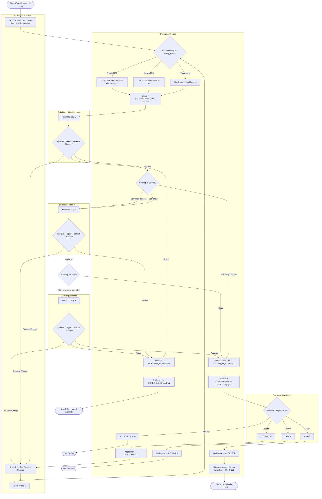

# B_act_offer_approval_v1 — ACT-02 Quy trình duyệt offer multi-level

**Người vẽ:** B (Behavior / Process Analyst)
**Phiên bản:** v1
**Nguồn:** UC-04, BR-08, BR-09, BR-10
**Swimlane:** Recruiter, Hiring Manager, Head of HR, Finance, Candidate, System

Tiêu chí Done:
- Start / end rõ
- Decision theo mức lương so với band (3 nhánh: trong band / vượt ≤10% / vượt >10%)
- Loop: Request Change / Reject nội bộ → Recruiter sửa → duyệt lại từ cấp 1
- Swimlane đủ actor liên quan

---

## Diagram

---

## Ghi chú

| Điểm | Giải thích |
|---|---|
| 3 nhánh band | BR-08: trong band → 1 cấp; vượt ≤10% → 2 cấp; vượt >10% → 3 cấp. |
| Loop Request Change | UC-04 A4.1: trả về Recruiter, duyệt lại từ cấp 1 (không tiếp tục từ cấp đang dang dở). |
| Reject nội bộ | `OFFER_REJECTED_INTERNALLY` → Application quay `SCREENING` (spec mục 7). |
| Candidate counter | `NEGOTIATING` → Recruiter chỉnh offer → vòng duyệt mới (loop về `OFFER_PENDING`). |
| BR-09 / BR-10 | Deadline 7 ngày làm việc; Accept → các Application khác `ON_HOLD`. |
| Khớp SEQ-02 | Cùng logic, góc nhìn object interaction thay vì swimlane nghiệp vụ. |
