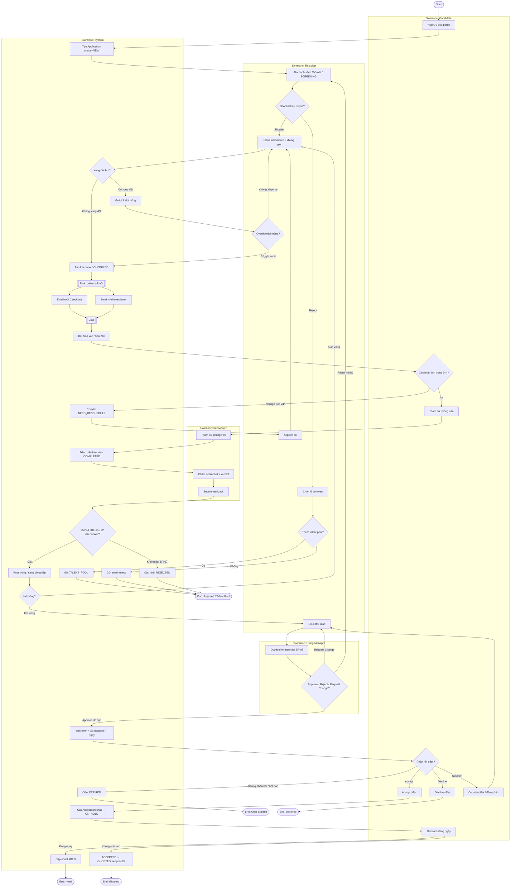

# B_act_recruitment_flow_v1 — ACT-01 Toàn bộ quy trình tuyển 1 ứng viên

**Người vẽ:** B (Behavior / Process Analyst)
**Phiên bản:** v1
**Nguồn:** UC-01 → UC-04, state machine mục 7 (`spec_ats (1).md`), BR-02/05/07/09/10/11
**Swimlane:** Candidate, Recruiter, Hiring Manager, Interviewer, System

Tiêu chí Done (`02_person_B_behavior.md` mục 6):
- Start / end node rõ ràng
- ≥2 decision node (sàng lọc, pass vòng PV, phản hồi offer, onboard)
- Swimlane cho mỗi actor
- Có fork/join: gửi email mời song song tới Candidate + Interviewer

---

## Diagram

---

## Ghi chú

| Điểm | Giải thích |
|---|---|
| Decision sàng lọc | Recruiter Shortlist / Reject (UC-02); Reject có nhánh talent pool (A4.1). |
| Decision lịch | System kiểm tra xung đột (BR-03); override ghi audit (UC-01 A5.2). |
| Decision vòng PV | BR-07: ≥2 interviewer → ≥50% verdict HIRE trở lên mới pass. |
| Decision offer | ACT-02 chi tiết hơn; ở đây rút gọn thành 1 swimlane Hiring Manager đại diện chuỗi duyệt. |
| Fork/Join | Gửi email mời Candidate và Interviewer song song sau khi tạo Interview. |
| NEED_RESCHEDULE | BR-05: Candidate không xác nhận trong 24h → System chuyển trạng thái, Recruiter xếp lại. |
| ON_HOLD / GHOSTED | BR-10 / BR-11 — khớp enum `application_status` của C. |
