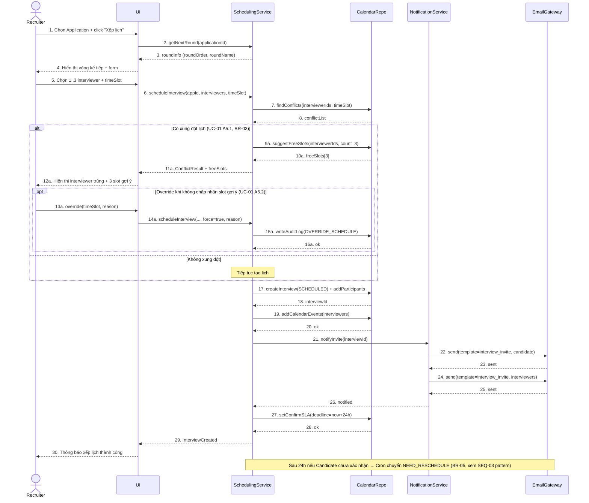

# B_seq_schedule_interview_v1 — SEQ-01 Xếp lịch phỏng vấn có kiểm tra xung đột

**Người vẽ:** B (Behavior / Process Analyst)
**Phiên bản:** v1
**Nguồn:** UC-01, BR-03, BR-05
**Lifelines:** Recruiter, UI, SchedulingService, CalendarRepo, NotificationService, EmailGateway

Tiêu chí Done:
- ≥4 lifeline (thực tế 6)
- Có message return (đường đứt nét)
- Fragment `alt` (xung đột / không xung đột) và `opt` (override)
- Khớp service naming với kiến trúc D (SchedulingService, NotificationService...)

---

## Diagram

---

## Ghi chú

| Điểm | Giải thích |
|---|---|
| Vì sao tách `CalendarRepo` | Persistence lịch + kiểm tra conflict; Redis lock (BR-03 race) nằm ở tầng SchedulingService trước khi gọi Repo — D sẽ phản ánh trong Component Diagram. |
| `alt` / `opt` | Đúng alt flow UC-01 A5.1 và A5.2; không gộp thành 1 nhánh. |
| Message return | Mọi gọi service đều có `-->>` trả kết quả. |
| BR-12 | Email dùng template đã duyệt (`interview_invite`). |
| Khớp C | Persist `interviews`, `interview_participants`; status `SCHEDULED`. |
