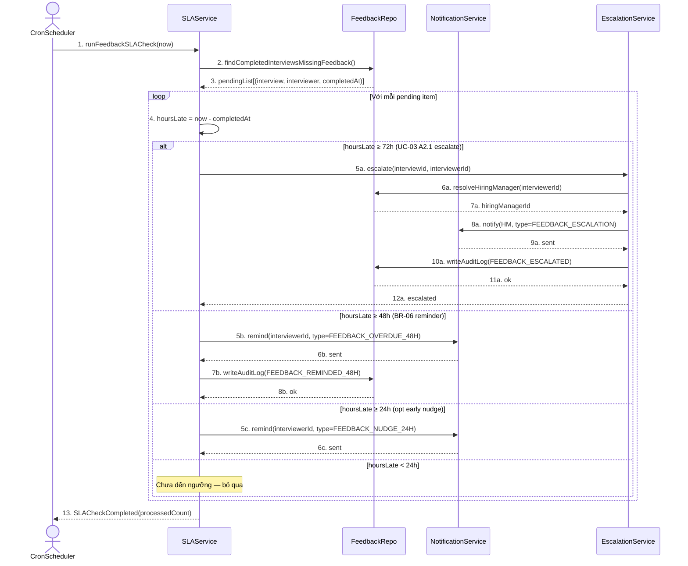

# B_seq_sla_feedback_v1 — SEQ-03 Nhắc SLA feedback trễ hạn

**Người vẽ:** B (Behavior / Process Analyst)
**Phiên bản:** v1
**Nguồn:** UC-03 A2.1, BR-06
**Lifelines:** CronScheduler, SLAService, FeedbackRepo, NotificationService, EscalationService

Tiêu chí Done:
- Actor System/Cron rõ ràng (không gộp "System" chung chung)
- Message return
- Fragment `loop` theo mốc thời gian; `alt` cho 48h nhắc / 72h escalate

**Mốc thời gian (sau khi Interview status = COMPLETED):**
- Trước 48h: chưa vi phạm BR-06 — có thể nhắc nhẹ ở 24h (opt)
- ≥48h chưa có feedback: nhắc Interviewer (BR-06)
- ≥72h vẫn chưa: escalate lên Hiring Manager của interviewer (UC-03 A2.1)

---

## Diagram

---

## Ghi chú

| Điểm | Giải thích |
|---|---|
| Vì sao 3 mốc 24/48/72? | Spec UC-03: khóa sửa sau 24h; BR-06 yêu cầu submit trong 48h; A2.1 escalate sau 72h. SEQ thể hiện đủ 3 hành vi khác nhau. |
| `FeedbackRepo` | Persist/query `feedbacks` + `interviews` (C); không map 1-1 bảng — đúng phân biệt service vs persistence. |
| `EscalationService` | Tách khỏi NotificationService vì escalate cần resolve manager + audit + có thể mở rộng (ticket, Slack) sau này — D dùng làm component riêng. |
| Không tạo feedback giả | Cron chỉ nhắc/escalate; Interviewer vẫn phải submit qua UC-03. |
