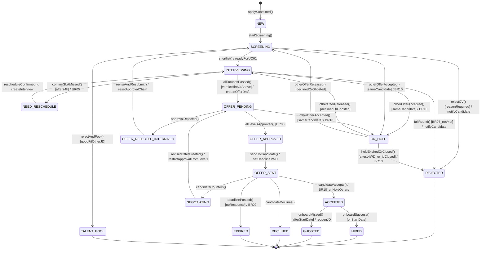

# B_state_application_v1 — STATE-01 Vòng đời Application

**Người vẽ:** B (Behavior / Process Analyst)
**Phiên bản:** v1
**Nguồn:** `spec_ats (1).md` mục 7; khớp `application_status` enum trong `sql/schema.sql` của C

Tiêu chí Done:
- Initial state + final state(s)
- Mỗi transition có label `event [guard] / action`
- Không có state cô lập
- State khớp ERD của C (17 giá trị enum)

**Final states:** `REJECTED`, `HIRED`, `GHOSTED`, `DECLINED`, `EXPIRED`, `TALENT_POOL`
**Trạng thái phụ:** `ON_HOLD` (từ bất kỳ pipeline đang mở khi candidate accept offer JD khác — BR-10; thoát `ON_HOLD` về `REJECTED` khi hết hạn/JD đóng — **BR-13**, mới thêm qua audit v1.1, xem `docs/change_log.md`)

---

## Diagram

---

## Bảng transition chính

| Từ | Event [guard] / action | Đến | BR / UC |
|---|---|---|---|
| NEW | `startScreening()` | SCREENING | UC-02 |
| SCREENING | `rejectCV() [reasonRequired]` | REJECTED | UC-02 |
| SCREENING | `shortlist()` | INTERVIEWING | UC-02 → UC-01 |
| SCREENING | `rejectAndPool()` | TALENT_POOL | UC-02 A4.1 |
| INTERVIEWING | `confirmSLAMissed() [after24h]` | NEED_RESCHEDULE | BR-05, UC-01 A6.1 |
| NEED_RESCHEDULE | `rescheduleConfirmed()` | INTERVIEWING | UC-01 |
| INTERVIEWING | `failRound() [BR07_notMet]` | REJECTED | BR-07 |
| INTERVIEWING | `allRoundsPassed()` | OFFER_PENDING | UC-04 |
| OFFER_PENDING | `allLevelsApproved()` | OFFER_APPROVED | BR-08 |
| OFFER_PENDING | `approvalRejected()` | OFFER_REJECTED_INTERNALLY | UC-04 |
| OFFER_REJECTED_INTERNALLY | `reviseAndResubmit()` | SCREENING | spec mục 7 loop |
| OFFER_APPROVED | `sendToCandidate()` | OFFER_SENT | BR-09 |
| OFFER_SENT | `candidateAccepts()` | ACCEPTED | BR-10 |
| OFFER_SENT | `candidateCounters()` | NEGOTIATING | UC-04 A6.1 |
| NEGOTIATING | `revisedOfferCreated()` | OFFER_PENDING | loop |
| ACCEPTED | `onboardSuccess()` | HIRED | — |
| ACCEPTED | `onboardMissed()` | GHOSTED | BR-11 |

## Khớp với C (ERD / enum)

Mọi state trên đều có trong `CREATE TYPE application_status AS ENUM (...)` của `sql/schema.sql`. Không thêm state ngoài enum; không thiếu state có trong enum (kể cả `ON_HOLD`, `TALENT_POOL`).

**Lưu ý (v1.1):** `application_status` là state machine của **Application**. Bảng `offers` có enum `offer_status` riêng (DRAFT/PENDING_APPROVAL/APPROVED/SIGNED_BY_COMPANY/...) mô tả cùng giai đoạn offer nhưng đặt tên khác — xem bảng ánh xạ 2 chiều trong `report/chapter_3_behavior.md` mục 3.4.5. Không nhầm đây là 1 state machine duy nhất.

Vòng đời riêng của **Interview** (`interview_status`: SCHEDULED/COMPLETED/CANCELLED/NEED_RESCHEDULE) được mô hình hoá riêng ở `diagrams/B_state_interview_v1.md` (STATE-02, thêm qua audit v1.1) — không trộn vào STATE-01 vì là 2 entity khác nhau trong ERD của C.
