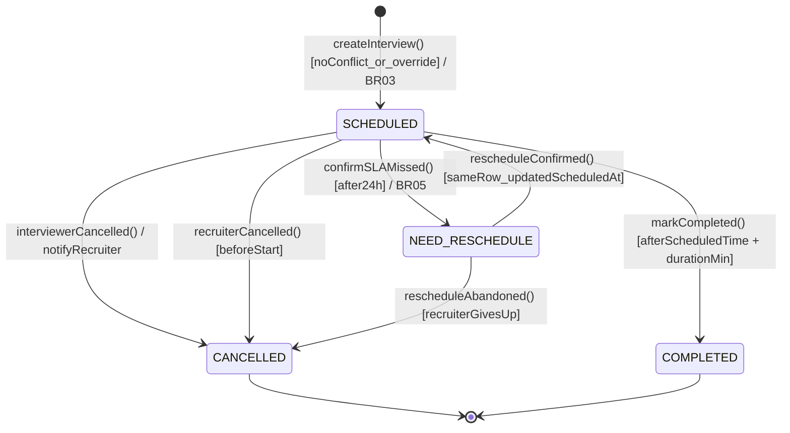

# B_state_interview_v1 — STATE-02 Vòng đời Interview

**Người vẽ:** B (Behavior / Process Analyst)
**Phiên bản:** v1 — *thêm mới qua audit Chương 3 (v1.1), xem `docs/change_log.md`*
**Nguồn:** `sql/schema.sql` — `CREATE TYPE interview_status`; `diagrams/B_seq_schedule_interview_v1.md` (SEQ-01); BR-03, BR-05

STATE-01 (`B_state_application_v1.md`) chỉ mô hình hoá `Application.status`. Bảng `interviews`
có enum riêng `interview_status` (SCHEDULED / COMPLETED / CANCELLED / NEED_RESCHEDULE) chưa từng
được vẽ — đây là khoảng trống được phát hiện khi audit chéo với `sql/schema.sql` của C.

Tiêu chí Done (theo đúng chuẩn B tự đặt ra ở `02_person_B_behavior.md` mục 6):
- Initial state + final state(s)
- Mỗi transition có label `event [guard] / action`
- Không có state cô lập
- Khớp đủ 4/4 giá trị `interview_status` trong `sql/schema.sql`

---

## Diagram

---

## Bảng transition

| Từ | Event [guard] / action | Đến | BR / UC / Ghi chú |
|---|---|---|---|
| `[*]` | `createInterview()` | SCHEDULED | UC-01 basic flow bước 6 |
| SCHEDULED | `confirmSLAMissed() [after24h]` | NEED_RESCHEDULE | BR-05 — **cùng thời điểm** Application cũng chuyển `NEED_RESCHEDULE` (STATE-01); đây là 2 field khác nhau (`interviews.status` và `applications.status`) đổi gần như đồng thời |
| NEED_RESCHEDULE | `rescheduleConfirmed()` | SCHEDULED | Giả định thiết kế: **UPDATE cùng 1 dòng** `interviews` (đổi `scheduled_at`), không tạo dòng mới cho cùng `round_order` |
| SCHEDULED | `interviewerCancelled()` / `recruiterCancelled()` | CANCELLED | Không có UC/BR nào mô tả rõ — cần A bổ sung alt flow cho UC-01 (xem câu hỏi bảo vệ ACT-01 "Interviewer từ chối phỏng vấn") |
| SCHEDULED | `markCompleted()` | COMPLETED | Tiền đề cho UC-03 (Ghi feedback) và SEQ-03 (SLA feedback) |

---

## Ghi chú thiết kế quan trọng — cần xác nhận với C

`interviews` trong `sql/schema.sql` **không có** ràng buộc `UNIQUE(application_id, round_order)`,
nên về lý thuyết có thể tồn tại 2 dòng `interviews` cùng `round_order` cho cùng 1 `application_id`
nếu reschedule được cài đặt theo kiểu "tạo dòng mới" thay vì "update dòng cũ". STATE-02 này giả
định phương án **update cùng dòng** (đơn giản hơn, khớp với cách STATE-01 chỉ có 1 field
`applications.status` cho mỗi application). Đã đề nghị C cân nhắc thêm
`UNIQUE(application_id, round_order)` vào `interviews` để ràng buộc này được đảm bảo ở tầng DB
thay vì chỉ dựa vào quy ước tầng service — xem `docs/change_log.md`.

## Khớp Person C

4/4 giá trị trong `CREATE TYPE interview_status AS ENUM ('SCHEDULED', 'COMPLETED', 'CANCELLED', 'NEED_RESCHEDULE')`
đều xuất hiện trong STATE-02. Không thêm state ngoài enum.
