# C_class_diagram_v1 — Class Diagram (Logical)

**Người vẽ:** C (Data Architect)
**Phiên bản:** v1.2 (đồng bộ schema sau audit Chương 3 + 4 — xem `docs/change_log.md`)
**Mức trừu tượng:** Logical — có attribute kèm kiểu dữ liệu (String, Int, Decimal, DateTime, Enum, JSON), có method mang ý nghĩa nghiệp vụ, có inheritance/interface, có association class.

Đáp ứng đủ tiêu chí "Done" ở `03_person_C_data.md` mục 7:
- Mọi class ≥3 attribute (không tính id).
- ≥5 method có ý nghĩa nghiệp vụ (thực tế có 14+ method).
- 1 inheritance: `User` → `Recruiter` / `HiringManager` / `Interviewer` / `HRAdmin` / `HeadOfHR` / `Finance` **[v1.2]**.
- 1 interface: `Approvable`, được implement bởi `Offer` và `JobDescription`.
- 1 association class: `InterviewParticipant` gắn thêm thuộc tính cho quan hệ N–N giữa `Interview` và `User`.

---

## Diagram

```mermaid
classDiagram
    class Department {
        +Long id
        +String name
        +Long parentId
        +DateTime createdAt
        +DateTime updatedAt
    }

    class User {
        +Long id
        +String email
        +String name
        +UserRole role
        +Long departmentId
        +Boolean isActive
        +DateTime createdAt
        +DateTime updatedAt
        +deactivate() void
        +changeDepartment(deptId Long) void
    }

    class Recruiter {
        +manageJD(jd JobDescription) void
        +screenCandidate(app Application, decision String) void
    }

    class HiringManager {
        +approveJD(jd JobDescription) void
        +decideOffer(offer Offer) void
    }

    class Interviewer {
        +submitFeedback(interview Interview) Feedback
    }

    class HRAdmin {
        +manageUsers() void
        +approveEmailTemplate(tpl EmailTemplate) void
    }

    class HeadOfHR {
        +decideOfferLevel2(offer Offer) void
        +viewReports() void
    }

    class Finance {
        +decideOfferLevel3(offer Offer) void
    }

    class Approvable {
        <<interface>>
        +approve(level Int) void
        +reject(reason String) void
        +isFullyApproved() Boolean
    }

    class JobDescription {
        +Long id
        +String title
        +Long departmentId
        +String level
        +Decimal salaryBandMin
        +Decimal salaryBandMax
        +Long hiringManagerId
        +Long recruiterId
        +JDStatus status
        +Int headcount
        +DateTime openedAt
        +DateTime closedAt
        +open() void
        +close() void
        +validateSalaryBand() Boolean
        +approve(level Int) void
        +reject(reason String) void
        +isFullyApproved() Boolean
    }

    class InterviewProcess {
        +Long id
        +Long jdId
        +Int roundOrder
        +String roundName
        +Int requiredInterviewers
        +Long scorecardTemplateId
    }

    class ScorecardTemplate {
        +Long id
        +String name
        +JSON criteria
    }

    class Candidate {
        +Long id
        +String fullName
        +String email
        +String phone
        +String currentCompany
        +Int yearsOfExperience
        +String experienceSummary
        +CandidateSource source
        +JSON parsedProfile
        +addToTalentPool() void
    }

    class Attachment {
        +Long id
        +Long candidateId
        +String fileUrl
        +String fileName
        +Int version
        +DateTime uploadedAt
    }

    class Application {
        +Long id
        +Long candidateId
        +Long jdId
        +ApplicationStatus status
        +DateTime appliedAt
        +Int currentRound
        +String rejectionReason
        +submit() void
        +transitionTo(status ApplicationStatus) void
        +placeOnHold() void
        +recordStatusChange(to ApplicationStatus, actor User) void
    }

    class ApplicationStatusHistory {
        +Long id
        +Long applicationId
        +ApplicationStatus fromStatus
        +ApplicationStatus toStatus
        +Long actorId
        +DateTime changedAt
        +String note
    }

    class Interview {
        +Long id
        +Long applicationId
        +Int roundOrder
        +DateTime scheduledAt
        +Int durationMin
        +String meetingLink
        +InterviewStatus status
        +checkConflict(user User, time DateTime) Boolean
        +reschedule(newTime DateTime) void
    }

    class InterviewParticipant {
        <<association class>>
        +Long id
        +Long interviewId
        +Long interviewerId
        +ParticipantRole role
    }

    class Feedback {
        +Long id
        +Long interviewId
        +Long interviewerId
        +Verdict verdict
        +Decimal totalScore
        +DateTime submittedAt
        +Boolean isLocked
        +calculateTotalScore() Decimal
        +lock() void
    }

    class FeedbackCriterion {
        +Long id
        +Long feedbackId
        +String criterionName
        +Int score
        +String comment
    }

    class Offer {
        +Long id
        +Long applicationId
        +Decimal salary
        +Date startDate
        +JSON benefits
        +Date deadline
        +OfferStatus status
        +Int currentApprovalLevel
        +Int currentApprovalAttempt
        +determineApprovalLevels() Int
        +isExpired() Boolean
        +approve(level Int) void
        +reject(reason String) void
        +isFullyApproved() Boolean
        +bumpApprovalAttempt() void
    }

    class OfferApproval {
        +Long id
        +Long offerId
        +Long approverId
        +Int level
        +Int attemptNo
        +Decision decision
        +String comment
        +DateTime decidedAt
    }

    class EmailTemplate {
        +Long id
        +String key
        +String subject
        +String body
        +JSON variables
    }

    class AuditLog {
        +Long id
        +Long actorId
        +String action
        +String entityType
        +Long entityId
        +JSON payload
        +DateTime createdAt
    }

    class Notification {
        +Long id
        +Long userId
        +String type
        +JSON payload
        +Boolean isRead
        +DateTime createdAt
    }

    User <|-- Recruiter
    User <|-- HiringManager
    User <|-- Interviewer
    User <|-- HRAdmin
    User <|-- HeadOfHR
    User <|-- Finance

    Approvable <|.. Offer
    Approvable <|.. JobDescription

    Department "0..1" --> "0..*" Department : parent-child
    Department "1" --> "0..*" User : employs
    Department "1" --> "0..*" JobDescription : owns
    User "1" --> "0..*" JobDescription : recruiter
    User "1" --> "0..*" JobDescription : hiringManager
    JobDescription "1" --> "0..*" InterviewProcess
    ScorecardTemplate "1" --> "0..*" InterviewProcess
    JobDescription "1" --> "0..*" Application
    Candidate "1" --> "0..*" Application
    Candidate "1" --> "0..*" Attachment
    Application "1" --> "0..*" Interview
    Application "1" --> "0..1" Offer
    Application "1" --> "0..*" ApplicationStatusHistory
    User "0..1" --> "0..*" ApplicationStatusHistory
    Interview "1" --> "0..*" InterviewParticipant
    User "1" --> "0..*" InterviewParticipant
    Interview "1" --> "0..*" Feedback
    User "1" --> "0..*" Feedback
    Feedback "1" *-- "1..*" FeedbackCriterion : composition
    Offer "1" --> "0..*" OfferApproval
    User "1" --> "0..*" OfferApproval
    User "0..1" --> "0..*" AuditLog
    User "1" --> "0..*" Notification
```

---

## Ghi chú thiết kế

### Inheritance: `User` → 6 subtype **[v1.2]**
Chọn mô hình hoá các vai trò như subtype của `User` ở tầng logical vì mỗi vai trò có **hành vi (method) khác nhau rõ rệt**:
- `Recruiter` — quản lý JD, sàng lọc CV
- `HiringManager` — duyệt JD / offer cấp 1
- `Interviewer` — nộp feedback
- `HRAdmin` — quản trị user, template email
- `HeadOfHR` — duyệt offer cấp 2 (BR-08 vượt band ≤10%), xem báo cáo
- `Finance` — duyệt offer cấp 3 (BR-08 vượt band >10%)

Trước v1.2 chỉ có 4 subtype; thiếu `HeadOfHR`/`Finance` khiến Class Diagram không khớp ACT-02/SEQ-02 của B.

Ở tầng ERD (physical), dùng **single-table inheritance** (một bảng `users` với cột `role` ENUM 6 giá trị) — xem `report/chapter_4_data.md`.

### Interface: `Approvable`
Cả `JobDescription` (được `HiringManager` duyệt mở) và `Offer` (được duyệt nhiều cấp theo BR-08) đều có chung hành vi "có thể duyệt/từ chối theo cấp". Trừu tượng hoá thành interface `Approvable` giúp tầng service (`ApprovalWorkflow` — xem sequence diagram của B) xử lý đồng nhất cho cả 2 loại đối tượng.

### Association class: `InterviewParticipant`
Quan hệ N–N giữa `Interview` và `User` không phải quan hệ N–N "trơn" vì cần lưu thêm thuộc tính `role` (primary/secondary — ai là interviewer chính). Do đó phải mô hình hoá thành **association class** thay vì bảng nối thuần không thuộc tính.

### Composition: `Feedback` *-- `FeedbackCriterion`
Dùng quan hệ composition (hình thoi đặc) vì `FeedbackCriterion` không có ý nghĩa tồn tại độc lập ngoài `Feedback` cha của nó — xoá `Feedback` phải xoá toàn bộ `FeedbackCriterion` liên quan (ánh xạ sang `ON DELETE CASCADE` ở ERD/SQL).

### ApplicationStatusHistory **[v1.2]**
Mỗi lần `Application.transitionTo()` / `recordStatusChange()` ghi 1 dòng lịch sử — phục vụ time-in-stage và audit chặt hơn `AuditLog` polymorphic. Append-only (không `updatedAt`).

### Candidate email **[v1.2]**
Đã bỏ method `linkEmail()` khỏi Class Diagram vì schema hiện tại chỉ có `candidates.email UNIQUE` (1 email). Nếu cần hỗ trợ đổi email nhiều lần (rủi ro spec mục 15), sẽ thêm bảng `candidate_emails` ở phiên bản sau — không giả vờ có hành vi mà chưa có cấu trúc lưu trữ.