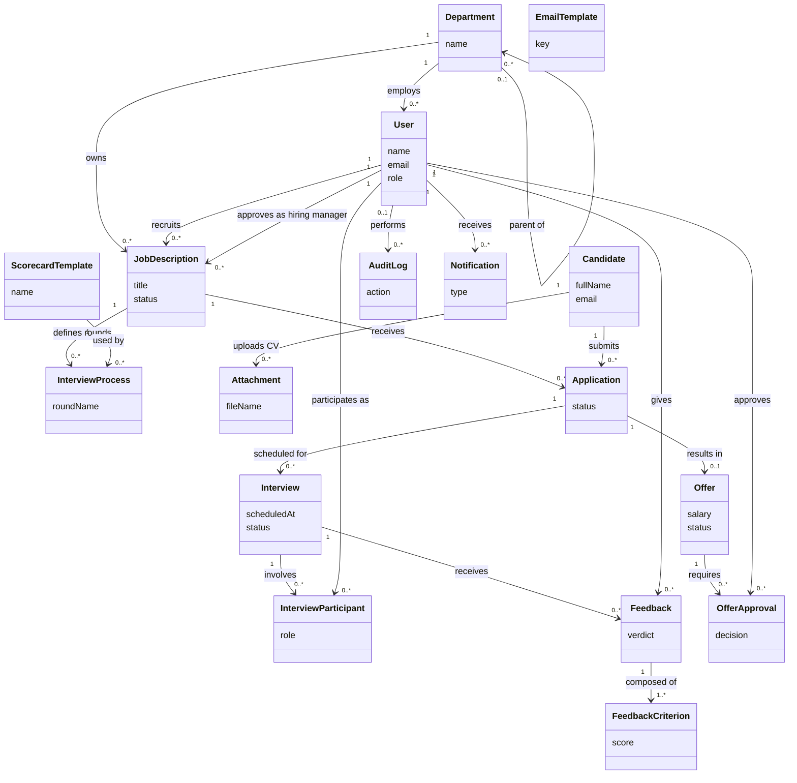

# C_domain_model_v1 — Domain Model (Conceptual)

**Người vẽ:** C (Data Architect)
**Phiên bản:** v1
**Mức trừu tượng:** Conceptual — chỉ thể hiện khái niệm nghiệp vụ, association và multiplicity. KHÔNG có datatype, KHÔNG có method (đúng nguyên tắc domain model, xem `03_person_C_data.md` mục 3).

Domain model gồm **17 class**, đáp ứng yêu cầu tối thiểu 15 entity trong đề (`spec_ats (1).md` mục 8), có đủ:
- 1 quan hệ **đệ quy**: `Department` tự liên kết với chính nó (cây phòng ban cha–con).
- 1 quan hệ **N–N**: `Interview` và `User` liên kết N–N thông qua `InterviewParticipant` (association class).

---

## Diagram

---

## Giải thích quan hệ đáng chú ý

| Quan hệ | Loại | Giải thích |
|---|---|---|
| `Department` — `Department` | Đệ quy (1 lớp tự liên kết) | Một phòng ban có thể có 0..1 phòng ban cha và 0..* phòng ban con. Cho phép mô hình cây tổ chức nhiều cấp (VD: Engineering → Backend Team). |
| `Interview` — `User` (qua `InterviewParticipant`) | N–N (association class) | Một buổi phỏng vấn có thể có nhiều interviewer; một interviewer có thể tham gia nhiều buổi phỏng vấn. `InterviewParticipant` mang thêm thuộc tính `role` (primary/secondary) nên được mô hình hoá thành class trung gian (association class) chứ không phải quan hệ N–N thuần. |
| `JobDescription` — `User` | Hai vai trò riêng (recruiter / hiring manager) | Tách 2 association riêng biệt vì BR-01 yêu cầu đúng 1 recruiter và 1 hiring manager cho mỗi JD — không dùng chung 1 association với role chung. |
| `Application` — `Offer` | 1 – 0..1 | Không phải mọi application đều có offer; chỉ những application pass hết vòng phỏng vấn mới sinh ra offer. |
| `Feedback` — `FeedbackCriterion` | 1 – 1..* | Mỗi feedback phải có ít nhất 1 tiêu chí chấm điểm (spec yêu cầu 5 tiêu chí cố định). |

## Ghi chú phạm vi

- Domain model **không** đưa `Role` thành class riêng — role được coi là thuộc tính khái niệm của `User` (quyết định tách thành subtype sẽ thể hiện ở Class Diagram, xem `C_class_diagram_v1.md`).
- Domain model **không** đưa `HRAdmin`, `Recruiter`, `HiringManager`, `Interviewer` thành class riêng ở mức conceptual để tránh trùng lặp — các subtype này chỉ xuất hiện ở Class Diagram logical, nơi cần thể hiện hành vi (method) khác nhau theo vai trò.
