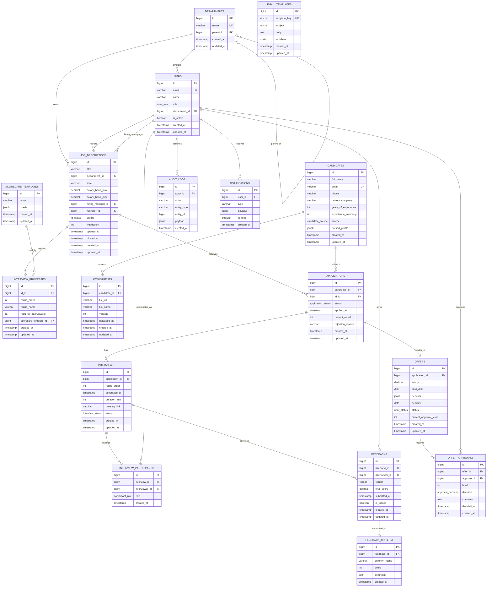

# C_erd_v1 — Entity Relationship Diagram (Physical)

**Người vẽ:** C (Data Architect)
**Phiên bản:** v1
**Mức trừu tượng:** Physical — sát SQL, có PK/FK/UK, kiểu dữ liệu SQL cụ thể, cardinality chính xác (bao gồm optional/mandatory).

**Quy ước đặt tên bảng:** danh từ số nhiều, snake_case (`departments`, `job_descriptions`...) — áp dụng nhất quán cho toàn bộ schema, khớp với `sql/schema.sql`.

Đây là bản chuyển đổi vật lý của `C_class_diagram_v1.md`:
- Quan hệ N–N `Interview` ↔ `User` → bảng trung gian `interview_participants` với surrogate key `id` + `UNIQUE(interview_id, interviewer_id)`.
- Inheritance `User → Recruiter/HiringManager/Interviewer/HRAdmin` → **single-table inheritance**: 1 bảng `users` + cột `role` (ENUM). Xem lý do trong `report/chapter_4_data.md` mục Normalization Analysis.
- Interface `Approvable` → không có bảng riêng (interface không tồn tại ở tầng lưu trữ), thể hiện qua việc `job_descriptions` và `offers` đều có cột `status` dạng ENUM theo state machine riêng.

---

## Diagram

---

## Giải thích các lựa chọn thiết kế physical

| Bảng / cột | Lựa chọn | Lý do |
|---|---|---|
| `departments.parent_id` | FK nullable, self-reference | Cho phép phòng ban gốc (không cha) — tránh reference vòng khi insert bản ghi đầu tiên (đúng cảnh báo ở `03_person_C_data.md` mục 9). |
| `users.role` | ENUM `user_role` | Thay cho bảng `Role` riêng — đơn giản hoá query "ai là recruiter", đổi lại mất khả năng 1 user có nhiều role đồng thời (chấp nhận đánh đổi vì spec không yêu cầu multi-role). |
| `job_descriptions.hiring_manager_id`, `recruiter_id` | 2 FK riêng tới `users` | Ánh xạ đúng BR-01 (đúng 1 recruiter + 1 hiring manager). |
| `interview_participants` | Bảng trung gian có surrogate key `id` + `UNIQUE(interview_id, interviewer_id)` | Giải quyết N–N, đồng thời mang thêm thuộc tính `role` (primary/secondary). |
| `feedbacks.total_score` | Cột cache (denormalize) | Tránh phải `SUM()`/`AVG()` từ `feedback_criteria` mỗi lần đọc danh sách feedback (đọc nhiều hơn viết rất nhiều trong use case xem dashboard). |
| `applications.current_round` | Cột cache (denormalize) | Tránh `SELECT MAX(round_order) FROM interviews WHERE application_id = ...` mỗi lần render pipeline kanban (UC-03). |
| `email_templates` | Không có FK trỏ tới bảng này | `Notification`/`AuditLog` lưu `type`/`action` dạng string, tra `email_templates.key` ở tầng service — giữ linh hoạt khi đổi template mà không phải sửa dữ liệu lịch sử đã gửi. |
| Mọi bảng | `created_at`, `updated_at` | Bắt buộc theo checklist C (mục 9 file `03_person_C_data.md`), hỗ trợ audit và debug. |

Chi tiết từng cột (kiểu, null, default, constraint) xem `docs/data_dictionary_C.md`. DDL chạy được xem `sql/schema.sql`.
