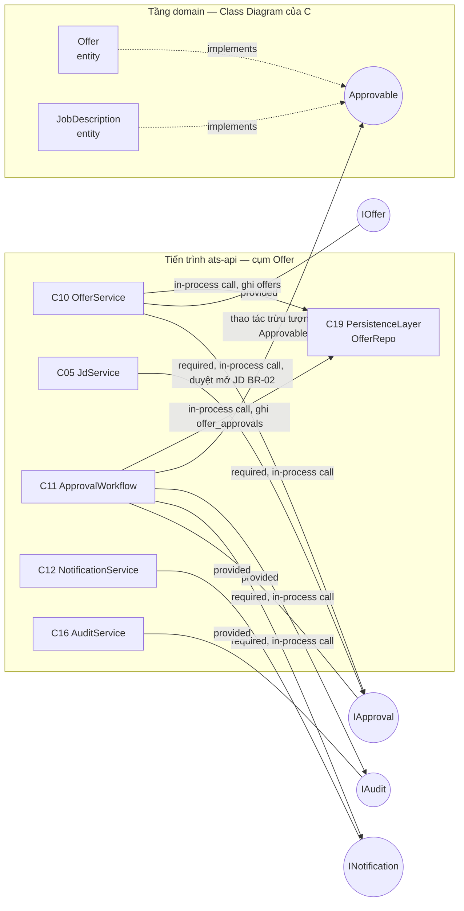

# D_comp_architecture_v1 — COMP-01 Sơ đồ thành phần hệ thống ATS mini

**Người vẽ:** D (System & UI Designer + Demo Lead)
**Phiên bản:** v1
**Nguồn:** `spec_ats (1).md` v1.1 mục 12; `report/chapter_3_behavior.md` (SEQ-01, SEQ-02, SEQ-03, ghi chú 3.5.4 và 3.6.2 của B); `report/chapter_4_data.md` + `sql/schema.sql` v1.2 (18 bảng, interface `Approvable`); `04_person_D_design.md` mục 2 và mục 6; ADR-01…ADR-12
**Phạm vi:** 24 component `C01`–`C24`, 3 tiến trình triển khai, 4 data store, 3 hệ thống ngoài, 19 hợp đồng interface/port
**Liên quan:** `diagrams/D_deploy_topology_v1.md` (DEP-01 — cùng hệ thống nhưng nhìn từ góc triển khai vật lý)

Tiêu chí Done (theo `04_person_D_design.md` mục 6 — đối chiếu chi tiết ở mục 9 của file này):

- ≥10 component — thực tế **24**.
- ≥1 hệ thống ngoài — thực tế **3** (`IdentityProvider`, `EmailGateway`, `CalendarProvider`).
- Interface/port thể hiện rõ, không phải các khối đứng cạnh nhau — 19 hợp đồng có chữ ký thao tác ở Bảng 5.22, cụm Offer được phóng to ở Hình 5.9.
- Có ghi chú giao thức trên mọi connector — `REST/HTTPS`, `in-process call`, `SQL`, `Redis RESP`, `S3 API`, `SMTP/HTTPS`, `OIDC`, `domain event`.

---

## 1. Kiến trúc tổng thể

Kiến trúc được chọn là **modular monolith** với ba tiến trình triển khai (ADR-01): `ats-api` phục vụ toàn bộ
lưu lượng đồng bộ từ trình duyệt, `ats-worker` chạy các job theo lịch, `ats-reporting` phục vụ truy vấn báo
cáo. Cách chia này giữ được ranh giới module rõ ràng để có thể tách thành service độc lập về sau, nhưng
không phải trả giá vận hành của hệ phân tán ngay ở quy mô mục tiêu (≤50 JD mở, ≤200 ứng viên/JD,
khoảng 60 người dùng nội bộ — NFR-08).

Hình 5.1 trình bày COMP-01. Bốn quy ước đọc hình:

1. Mỗi khối chữ nhật là một component có mã `Cxx`; mã này được dùng xuyên suốt Bảng 5.2, Bảng 5.3 và Bảng 5.4.
2. Khối `EdgeProxy Nginx` là **phần tử hạ tầng**, không mang mã component — nó thuộc về DEP-01 (node `N03`)
   và chỉ xuất hiện ở đây để thấy được điểm cắt TLS trước khi request chạm mã nguồn ứng dụng.
3. **Nét liền** là lời gọi đồng bộ (người dùng đang chờ kết quả). **Nét đứt** là luồng bất đồng bộ:
   ghi outbox, tiêu thụ outbox, làm mới read model, sao chép streaming.
4. Nhãn trên mỗi cạnh ghi giao thức hoặc kiểu gọi. `in-process call` nghĩa là lời gọi phương thức trong
   cùng một tiến trình JVM/Node, không qua mạng — đây là điểm phân biệt cốt lõi giữa modular monolith và
   microservices, và cũng là lý do hệ thống không cần service mesh hay giao dịch phân tán.

**Hình 5.1 — COMP-01: Sơ đồ thành phần hệ thống ATS mini**

```mermaid
flowchart TB

    subgraph CLIENT["Client tier"]
        C01["C01 InternalWebApp<br/>SPA cho 6 role nội bộ"]
        C02["C02 CandidatePortalApp<br/>SPA rút gọn cho ứng viên"]
    end

    subgraph EDGE["Edge"]
        EDGEPROXY["EdgeProxy Nginx<br/>TLS termination, reverse proxy, static SPA<br/>hạ tầng, chi tiết ở DEP-01 node N03"]
    end

    subgraph PAPI["Tiến trình ats-api"]
        C03["C03 ApiGateway BFF<br/>định tuyến, xác thực token, rate-limit"]

        subgraph BIZ["Module nghiệp vụ"]
            C04["C04 AuthService"]
            C05["C05 JdService"]
            C06["C06 CandidateService"]
            C07["C07 ApplicationService"]
            C08["C08 SchedulingService"]
            C09["C09 FeedbackService"]
            C10["C10 OfferService"]
            C11["C11 ApprovalWorkflow"]
            C12["C12 NotificationService"]
            C13["C13 EscalationService"]
            C14["C14 SLAService"]
            C15["C15 FileService"]
            C16["C16 AuditService"]
        end

        subgraph PERS["Persistence và Adapter"]
            C19["C19 PersistenceLayer<br/>ApplicationRepo, CalendarRepo, FeedbackRepo,<br/>OfferRepo, UserRepo, ReadModelRepo"]
            C20["C20 EmailAdapter<br/>hiện thực cổng EmailPort"]
            C21["C21 CalendarAdapter<br/>hiện thực cổng CalendarPort"]
            C22["C22 IdentityAdapter<br/>hiện thực cổng IdentityPort"]
            C23["C23 ObjectStorageAdapter<br/>hiện thực cổng StoragePort"]
            C24["C24 LockManager<br/>bọc Redis, ttl 120s"]
        end
    end

    subgraph PWORKER["Tiến trình ats-worker"]
        C17["C17 SchedulerWorker<br/>job idempotent, 1 instance active"]
    end

    subgraph PREP["Tiến trình ats-reporting"]
        C18["C18 ReportingService<br/>read model, metric, export, dataFreshness"]
    end

    subgraph DATA["Data store"]
        PGP[("PostgreSQL 16 primary<br/>18 bảng của C")]
        PGR[("PostgreSQL 16 read replica<br/>hot standby, chỉ đọc")]
        REDIS[("Redis 7<br/>lock lịch, session, hàng đợi outbox")]
        MINIO[("ObjectStorage MinIO<br/>bucket ats-cv, versioning")]
    end

    subgraph EXT["Hệ thống ngoài"]
        IDP["IdentityProvider<br/>Google Workspace OIDC"]
        MAIL["EmailGateway<br/>Amazon SES hoặc SendGrid"]
        CAL["CalendarProvider<br/>Google Calendar API"]
    end

    C01 -->|"REST/HTTPS"| EDGEPROXY
    C02 -->|"REST/HTTPS"| EDGEPROXY
    EDGEPROXY -->|"REST/HTTPS nội bộ, cổng 8080"| C03

    C03 -->|"in-process call IIdentity"| C04
    C03 -->|"in-process call IJobDescription"| C05
    C03 -->|"in-process call ICandidate"| C06
    C03 -->|"in-process call IApplication"| C07
    C03 -->|"in-process call IScheduling"| C08
    C03 -->|"in-process call IFeedback"| C09
    C03 -->|"in-process call IOffer"| C10
    C03 -->|"in-process call IFileAccess"| C15
    C03 -->|"in-process call IAudit"| C16
    C03 -->|"REST/HTTPS IReadModel"| C18

    C05 -->|"in-process call IApproval"| C11
    C10 -->|"in-process call IApproval"| C11
    C10 -->|"in-process call IApplication"| C07
    C11 -->|"in-process call INotification"| C12
    C08 -->|"in-process call, acquire slot lock"| C24
    C08 -->|"in-process call INotification"| C12
    C08 -->|"in-process call ISlaPolicy"| C14
    C08 -->|"in-process call CalendarPort, best-effort"| C21
    C09 -->|"in-process call ISlaPolicy"| C14
    C14 -->|"in-process call IEscalation"| C13
    C13 -->|"in-process call INotification"| C12
    C07 -->|"in-process call IAudit"| C16
    C06 -->|"in-process call IFileAccess"| C15
    C04 -->|"in-process call IdentityPort"| C22
    C15 -->|"in-process call StoragePort"| C23

    BIZ -->|"in-process call, repository"| C19
    C12 -.->|"domain event, ghi outbox_events"| C19

    C19 -->|"SQL, TCP 5432"| PGP
    C24 -->|"Redis RESP"| REDIS
    C04 -->|"Redis RESP, session cache"| REDIS
    C22 -->|"OIDC"| IDP
    C20 -->|"SMTP/HTTPS"| MAIL
    C21 -->|"REST/HTTPS, Calendar API"| CAL
    C23 -->|"S3 API"| MINIO

    C01 -->|"S3 API, presigned PUT và GET"| MINIO
    C02 -->|"S3 API, presigned PUT"| MINIO

    C17 -->|"SQL, quét SLA và job theo lịch"| PGP
    C17 -->|"Redis RESP, leader election"| REDIS
    C17 -.->|"domain event, poll outbox_events"| PGP
    C17 -.->|"SQL chỉ đọc, tổng hợp read model 15 phút"| PGR
    C17 -->|"in-process call ISlaPolicy"| C14
    C17 -->|"in-process call IOffer"| C10
    C17 -->|"in-process call IJobDescription"| C05
    C17 -.->|"in-process call EmailPort, idempotencyKey"| C20
    C17 -.->|"in-process call CalendarPort, retry"| C21

    PGP -.->|"streaming replication"| PGR
    C18 -->|"SQL chỉ đọc"| PGR
    C18 -->|"Redis RESP, cache kết quả chart"| REDIS
```

### 1.1. Bốn luồng đáng chú ý trên Hình 5.1

**Luồng tải CV không đi qua application server.** `C01`/`C02` gọi thẳng MinIO bằng presigned URL do
`C15 FileService` sinh ra (ADR-04, NFR-12). Nếu để file 10 MB đi xuyên `EdgeProxy` → `C03` → `C15` thì mỗi
lần tải là một lần chiếm dụng luồng xử lý của `ats-api`, làm hỏng mục tiêu p95 ≤2s của NFR-01. Đổi lại,
quyền truy cập phải được kiểm tra **trước** khi sinh URL và URL chỉ sống 10 phút.

**Luồng email hoàn toàn bất đồng bộ.** `C12 NotificationService` không gọi `C20 EmailAdapter`. Nó chỉ ghi
một bản ghi outbox trong **cùng transaction** với thao tác nghiệp vụ, rồi `C17 SchedulerWorker` mới đọc
outbox và gọi `C20` kèm `idempotencyKey` (ADR-06). Nhờ vậy giao dịch nghiệp vụ không bao giờ bị rollback vì
gateway lỗi, và job replay không tạo email trùng — đúng ngưỡng "0 email trùng khi replay" của NFR-11.

**Luồng calendar là best-effort có hàng chờ.** Khác với email, `C08 SchedulingService` **có** gọi `C21`
đồng bộ với timeout ngắn, vì Recruiter mong thấy sự kiện xuất hiện ngay. Khi gọi lỗi, interview vẫn được
tạo hợp lệ trong hệ thống, trạng thái đồng bộ được đánh dấu `CALENDAR_SYNC_PENDING` và bản ghi outbox còn
lại để `C17` thử lại (UC-01 E18.1). Đây là lý do trên Hình 5.1 tồn tại hai cạnh khác nhau tới `C21`: một
nét liền từ `C08` và một nét đứt từ `C17`.

**Luồng báo cáo không chạm primary.** `C18` chỉ đọc replica; các bảng tổng hợp `rm_*` do `C17` làm mới mỗi
15 phút (ADR-07). Chi tiết vì sao `C18` là tiến trình riêng được trình bày ở mục 6(d).

### 1.2. Ghi chú bắt buộc về ranh giới tiến trình

`C17` gọi `C14`, `C10`, `C05`, `C12`, `C13` bằng `in-process call` mặc dù nằm ở tiến trình khác trên hình.
Điều này **không** mâu thuẫn: modular monolith nghĩa là `ats-api` và `ats-worker` dùng **chung một
codebase, khác entrypoint** — các module nghiệp vụ được nạp như thư viện vào cả hai tiến trình. Tương tự
với `C19`–`C24`. Vì thế DEP-01 mô tả `WorkerNode` (N05) kết nối thẳng tới PostgreSQL, Redis, EmailGateway
và CalendarProvider mà **không** đi qua `AppServerNode`. Nếu sau này tách `ats-worker` thành service độc
lập, các cạnh này sẽ phải chuyển thành `REST/HTTPS` hoặc message queue — chi phí đó đã được cân nhắc và
chấp nhận ở ADR-01.

---

## 2. Sơ đồ interface/port — phóng to cụm Offer

Cụm Offer là nơi ranh giới interface có giá trị lớn nhất, vì đây là chỗ hai component khác nhau
(`C10 OfferService` và `C05 JdService`) dùng lại **cùng một** engine duyệt. Hình 5.9 phóng to cụm này theo
ký hiệu provided/required của UML: hình tròn là interface, cạnh gắn nhãn `provided` nối từ bên **cung cấp**,
cạnh gắn nhãn `required` nối từ bên **tiêu thụ**.

**Hình 5.9 — Chi tiết interface và port của cụm Offer trong COMP-01**

`C11 ApprovalWorkflow` cung cấp đúng một interface `IApproval` và không biết mình đang duyệt cái gì. Nó chỉ
làm việc trên interface `Approvable` mà C đã định nghĩa trong Class Diagram (`approve(level)`,
`reject(reason)`, `isFullyApproved()`), và cả `Offer` lẫn `JobDescription` đều hiện thực interface này
(`report/chapter_4_data.md` mục 4.3.2). Nhờ vậy quy trình duyệt mở JD của BR-02 và quy trình duyệt offer
nhiều cấp của BR-08 dùng chung một engine, một bảng lịch sử và một màn hình hộp thư duyệt (SCR-08), thay
vì viết hai lần.

Hai điểm cần nói rõ khi bảo vệ Hình 5.9:

- **Hướng phụ thuộc là một chiều.** `C10` phụ thuộc `IApproval`; `C11` không hề biết `IOffer` tồn tại. Nếu
  vẽ mũi tên hai chiều thì hai component đã dính chặt vào nhau và việc tách service sau này sẽ vô nghĩa.
- **`C11` không tự gửi email cho người duyệt.** Nó gọi `INotification`; việc chọn template đã duyệt (BR-12),
  render VI/EN (NFR-09) và ghi outbox là trách nhiệm của `C12`. Đây là ứng dụng trực tiếp của nguyên tắc
  một component chỉ có một lý do để thay đổi.

---

## 3. Danh mục component

Bảng 5.2 liệt kê đủ 24 component kèm tiến trình chứa nó, interface cung cấp/tiêu thụ và các UC/BR mà nó
chịu trách nhiệm. Cột "Interface tiêu thụ" chính là danh sách phụ thuộc ra ngoài của component — càng ngắn
thì component càng dễ tách và dễ kiểm thử độc lập.

**Bảng 5.2 — Danh mục 24 component của COMP-01**

| Mã | Component | Tiến trình | Trách nhiệm | Interface cung cấp | Interface tiêu thụ | UC/BR/NFR liên quan |
|---|---|---|---|---|---|---|
| C01 | `InternalWebApp` | Browser | SPA cho 6 role nội bộ: dashboard, kanban, scorecard, offer wizard, reports, admin (SCR-01…SCR-08, SCR-10, SCR-11) | Không phát hành interface máy-máy | REST của `C03`; `StoragePort` qua presigned URL | UC-01…UC-05, NFR-09, NFR-14 |
| C02 | `CandidatePortalApp` | Browser | SPA rút gọn cho ứng viên: xem trạng thái, xác nhận lịch, xem và phản hồi offer (SCR-09) | Không phát hành interface máy-máy | REST của `C03`; `StoragePort` qua presigned PUT | UC-01 A6.1, UC-04, UC-06, ADR-09 |
| C03 | `ApiGateway` (BFF) | `ats-api` | Định tuyến, xác thực token, rate-limit, tổng hợp response theo từng màn hình, gắn `correlationId` vào log | REST/HTTPS ra ngoài | `IIdentity`, `IAccessControl` và toàn bộ interface nghiệp vụ; `IReadModel` | NFR-04, NFR-13, BR-20, BR-21 |
| C04 | `AuthService` | `ats-api` | OIDC với IdP nội bộ, session, phát và thu hồi candidate token, giải quyết RBAC kèm department scope | `IIdentity`, `IAccessControl` | `IdentityPort`, `IAudit` | NFR-04, NFR-05, BR-20, BR-21, ADR-09, ADR-10 |
| C05 | `JdService` | `ats-api` | JD, `InterviewProcess`, `ScorecardTemplate`; gọi `ApprovalWorkflow` để duyệt mở JD; tự đóng/mở JD | `IJobDescription` | `IApproval`, `IAccessControl`, `IAudit` | UC-02, BR-01, BR-02, BR-11 |
| C06 | `CandidateService` | `ats-api` | Hồ sơ ứng viên, dedupe theo email, talent pool, metadata `attachments` | `ICandidate` | `IFileAccess`, `IAudit` | UC-02, BR-04 |
| C07 | `ApplicationService` | `ats-api` | Lõi nghiệp vụ: state machine `Application` theo STATE-01, pipeline kanban, ghi `application_status_history` | `IApplication` | `IAudit`, `INotification`, `ISlaPolicy`, `IAccessControl` | UC-02, UC-03, BR-07, BR-10, BR-11, BR-13, NFR-06 |
| C08 | `SchedulingService` | `ats-api` | Kiểm tra xung đột BR-03, giữ lock slot, tạo và đổi `Interview` theo STATE-02, gợi ý 3 slot trống | `IScheduling` | `LockManager`, `CalendarPort`, `INotification`, `ISlaPolicy`, `IAudit` | UC-01, BR-03, BR-05, BR-26, NFR-02 |
| C09 | `FeedbackService` | `ats-api` | Scorecard, `Feedback` và `FeedbackCriterion`, khóa sửa sau 24h, tổng hợp kết luận vòng | `IFeedback` | `ISlaPolicy`, `IApplication`, `IAudit` | UC-03, BR-06, BR-07 |
| C10 | `OfferService` | `ats-api` | Vòng đời `Offer`: tạo draft, gửi ứng viên, hết hạn, xử lý accept/decline/counter | `IOffer` | `IApproval`, `IApplication`, `INotification`, `IAudit` | UC-04, UC-06, BR-08, BR-09, BR-10 |
| C11 | `ApprovalWorkflow` | `ats-api` | Engine duyệt tổng quát cho mọi `Approvable`: tính số cấp theo BR-08, điều phối từng cấp, ghi `offer_approvals` kèm `attempt_no` | `IApproval` | `INotification`, `IAudit` | UC-04 A4.1, BR-02, BR-08, BR-16 |
| C12 | `NotificationService` | `ats-api`, nạp cả trong `ats-worker` | Chọn template đã duyệt, render VI/EN, ghi outbox, tạo `notifications` in-app cho user nội bộ | `INotification` | `IAudit`; ghi outbox qua `C19` | BR-12, BR-25, NFR-09, NFR-11 |
| C13 | `EscalationService` | `ats-api`, nạp cả trong `ats-worker` | Giải quyết quản lý trực tiếp của interviewer, escalate quá hạn, ghi audit | `IEscalation` | `INotification`, `IAudit` | UC-03 A2.1, BR-06 |
| C14 | `SLAService` | `ats-api`, nạp cả trong `ats-worker` | Định nghĩa và tính deadline mọi SLA (xác nhận lịch, feedback, offer, hold), quét bản ghi quá hạn | `ISlaPolicy` | `IApplication`, `IFeedback`, `IOffer`, `IEscalation`, `INotification` | BR-05, BR-06, BR-09, BR-13, NFR-11 |
| C15 | `FileService` | `ats-api` | Sinh presigned URL upload/download, versioning, kiểm tra checksum, hook antivirus | `IFileAccess` | `StoragePort`, `IAudit` | UC-02, NFR-12, ADR-04 |
| C16 | `AuditService` | `ats-api` | Ghi `audit_logs` và `application_status_history`; cung cấp API tra cứu lịch sử | `IAudit` | Chỉ `C19` | NFR-06, BR-26 |
| C17 | `SchedulerWorker` | `ats-worker` | Job idempotent: nhắc và escalate feedback, hết hạn offer, quá hạn xác nhận lịch, hold timeout, tự đóng/mở JD, làm mới read model, đẩy outbox | Không phát hành interface; kích hoạt bằng lịch cron | `ISlaPolicy`, `IOffer`, `IApplication`, `IJobDescription`, `INotification`, `EmailPort`, `CalendarPort` | BR-05, BR-06, BR-09, BR-11, BR-13, NFR-11, ADR-06 |
| C18 | `ReportingService` | `ats-reporting` | Read model, định nghĩa metric BR-24, truy vấn dashboard, export CSV/PDF, công bố `dataFreshness` | `IReadModel` qua REST/HTTPS | Chỉ đọc replica và cache Redis | UC-05, BR-24, NFR-10, ADR-07 |
| C19 | `PersistenceLayer` | Cả 3 tiến trình | Tập hợp repository: `ApplicationRepo`, `CalendarRepo`, `FeedbackRepo`, `OfferRepo`, `UserRepo`, `ReadModelRepo`; quản lý transaction và cột `version` cho optimistic locking (cột do D đề xuất mức P0, chưa có trong `sql/schema.sql` v1.2 — xem mục 9) | API repository nội bộ | `SQL` tới PostgreSQL | Toàn bộ UC; ADR-02, ADR-08 |
| C20 | `EmailAdapter` | `ats-api`, `ats-worker` | Hiện thực `EmailPort`: dựng message, gắn `idempotencyKey`, xử lý mã lỗi gateway | `EmailPort` | `SMTP/HTTPS` tới `EmailGateway` | BR-12, NFR-11, ADR-05, ADR-06 |
| C21 | `CalendarAdapter` | `ats-api`, `ats-worker` | Hiện thực `CalendarPort`: tạo/hủy sự kiện lịch; lỗi thì trả về để đánh dấu `CALENDAR_SYNC_PENDING` và retry | `CalendarPort` | `REST/HTTPS` tới `CalendarProvider` | UC-01 E18.1, ADR-05, NFR-11 |
| C22 | `IdentityAdapter` | `ats-api` | Hiện thực `IdentityPort` với Google Workspace OIDC: đổi code lấy token, lấy user info | `IdentityPort` | `OIDC` tới `IdentityProvider` | NFR-04, ADR-05 |
| C23 | `ObjectStorageAdapter` | `ats-api` | Hiện thực `StoragePort` tới MinIO/S3: ký presigned PUT/GET, đọc checksum, quản lý version của object | `StoragePort` | `S3 API` tới MinIO | NFR-12, ADR-04 |
| C24 | `LockManager` | `ats-api`, `ats-worker` | Bọc Redis: `acquire(interviewerId, slot, ttl=120s)`, gia hạn, nhả an toàn; ngoài ra làm leader election cho `ats-worker` | API thư viện hạ tầng, không nằm trong 19 hợp đồng phát hành | `Redis RESP` | BR-03, NFR-02, ADR-03 |

---

## 4. Interface và hợp đồng

Bảng 5.22 liệt kê 15 interface nội bộ và 4 cổng ra hệ thống ngoài. Chữ ký được viết rút gọn theo phong cách
Java/TypeScript để thấy rõ tham số nào là bắt buộc; đây là hợp đồng ở mức thiết kế, không phải mã nguồn.
Bốn cổng cuối bảng (`EmailPort`, `CalendarPort`, `IdentityPort`, `StoragePort`) là hiện thực trực tiếp của
ADR-05: lõi nghiệp vụ chỉ phụ thuộc vào cổng, còn adapter mới biết đến nhà cung cấp cụ thể. Nhờ vậy bản
demo khi bảo vệ có thể thay bốn adapter thật bằng bốn adapter giả mà không sửa một dòng nào trong
`C04`–`C16`.

**Bảng 5.22 — Hợp đồng của 19 interface và port**

| Interface | Bên cung cấp | Bên tiêu thụ | Thao tác chính | Ghi chú |
|---|---|---|---|---|
| `IIdentity` | `C04` | `C03`, `C02` gián tiếp | `Principal authenticate(String bearerToken)`; `CandidateSession redeemMagicLink(String token)`; `void revokeCandidateTokens(long applicationId)` | Token ứng viên dùng-một-lần cho hành động nhạy cảm, thu hồi khi Application vào trạng thái cuối (ADR-09) |
| `IAccessControl` | `C04` | `C03`, `C05`, `C06`, `C07`, `C15` | `boolean can(Principal p, Action a, ResourceRef r)`; `DepartmentScope scopeOf(Principal p)` | Deny-by-default; kiểm tra 2 tầng, gateway lọc thô còn service kiểm tra ownership (ADR-10, BR-20, BR-21) |
| `IJobDescription` | `C05` | `C03`, `C07`, `C17`, `C18` | `JobDescription create(JdDraft d)`; `void requestOpenApproval(long jdId)`; `void close(long jdId, CloseReason r)`; `void reopen(long jdId)` | `requestOpenApproval` là điểm `C05` gọi sang `IApproval` (BR-02); `reopen` phục vụ BR-11 |
| `ICandidate` | `C06` | `C03`, `C07` | `Candidate upsertByEmail(CandidateProfile p)`; `Page<Candidate> searchTalentPool(TalentPoolQuery q)`; `Attachment attachCv(long candidateId, FileRef f)` | `upsertByEmail` là nơi thực thi dedupe; BR-04 được kiểm tra khi tạo `Application` |
| `IApplication` | `C07` | `C03`, `C09`, `C10`, `C14`, `C17` | `void transitionTo(long appId, ApplicationStatus to, Actor a, int version)`; `KanbanBoard board(long jdId)`; `void placeOnHold(long appId, HoldReason r)` | Tham số `version` là optimistic locking (ADR-08); mọi transition đều sinh dòng `application_status_history` |
| `IScheduling` | `C08` | `C03`, `C17` | `Interview schedule(ScheduleRequest r)`; `List<TimeSlot> suggestFreeSlots(List<Long> interviewerIds, int n)`; `Interview reschedule(long interviewId, TimeSlot t)`; `void confirmByCandidate(long interviewId, String token)` | `ScheduleRequest` mang `force` và `reason` cho nhánh override (BR-26); `n = 3` đúng UC-01 A5.1 |
| `IFeedback` | `C09` | `C03`, `C14`, `C17` | `Feedback saveDraft(FeedbackDraft d)`; `void submit(long feedbackId, int version)`; `RoundVerdict evaluateRound(long interviewId)` | `evaluateRound` hiện thực BR-07 (≥50% HIRE khi vòng có ≥2 interviewer), tính khi cần chứ không cache |
| `IOffer` | `C10` | `C03`, `C14`, `C17` | `Offer createDraft(OfferDraft d)`; `void sendToCandidate(long offerId)`; `void respond(long offerId, CandidateDecision d)`; `void expire(long offerId)` | `expire` chỉ được `C17` gọi (BR-09); `respond` phủ accept/decline/counter, nhánh counter dẫn sang UC-06 |
| `IApproval` | `C11` | `C05`, `C10` | `int determineLevels(Approvable a)`; `ApprovalTicket start(Approvable a)`; `void decide(long ticketId, int level, Decision d, String comment)`; `boolean isFullyApproved(Approvable a)` | Tham số kiểu `Approvable` (interface của C) là lý do engine dùng lại được cho JD lẫn Offer; `REQUEST_CHANGE` làm tăng `attempt_no` |
| `INotification` | `C12` | `C07`, `C08`, `C10`, `C11`, `C13`, `C14`, `C17` | `void notify(Recipient r, TemplateKey k, Map<String, Object> vars, Locale l)`; `void enqueueOutbox(DomainEvent e, String idempotencyKey)` | Chỉ nhận `TemplateKey`, không nhận nội dung thô — chặn việc lách BR-12; `Locale` phục vụ NFR-09 |
| `IEscalation` | `C13` | `C14`, `C17` | `void escalate(EscalationCase c)`; `User resolveLineManager(long userId)` | `resolveLineManager` đi qua `UserRepo` và cây `departments`; mọi lần escalate đều ghi audit |
| `ISlaPolicy` | `C14` | `C07`, `C08`, `C09`, `C10`, `C17` | `Instant deadlineFor(SlaType t, Instant from)`; `void registerDeadline(EntityRef e, SlaType t, Instant due)`; `List<SlaBreach> scanBreaches(SlaType t, Instant now)` | Một chỗ duy nhất định nghĩa 24h/48h/72h/7 ngày làm việc/14 ngày làm việc; xem mục 6(b) |
| `IFileAccess` | `C15` | `C03`, `C06` | `PresignedUrl createUploadUrl(FileMeta m)`; `PresignedUrl createDownloadUrl(long attachmentId, Principal p)`; `void verifyChecksum(long attachmentId)` | URL hết hạn 10 phút; `createDownloadUrl` bắt buộc nhận `Principal` để ghi audit và kiểm tra BR-20 (NFR-12) |
| `IAudit` | `C16` | `C04`…`C15`, `C17` | `void record(Actor a, String action, EntityRef e, JsonNode payload)`; `Page<AuditEntry> query(AuditFilter f)` | Là interface được tiêu thụ rộng nhất — điều kiện để đạt "100% chuyển trạng thái có dòng audit" của NFR-06 |
| `IReadModel` | `C18` | `C01`, `C03` | `FunnelReport funnel(ReportFilter f)`; `TimeToHireReport timeToHire(ReportFilter f)`; `SourceEffectivenessReport sourceEffectiveness(ReportFilter f)`; `Instant dataFreshness()`; `byte[] exportCsv(ReportFilter f)` | Interface duy nhất đi qua mạng bằng `REST/HTTPS` chứ không `in-process call`, vì `C18` ở tiến trình riêng |
| `EmailPort` | `C20` | `C17` | `DeliveryResult send(EmailMessage m, String idempotencyKey)` | Chỉ `ats-worker` gọi; `C12` chỉ ghi outbox. Đây là điều kiện để đạt "0 email trùng khi replay" (NFR-11) |
| `CalendarPort` | `C21` | `C08`, `C17` | `EventRef createEvent(CalendarEvent e, String idempotencyKey)`; `void cancelEvent(EventRef r)` | `C08` gọi best-effort có timeout ngắn; lỗi thì `C17` retry tối đa 5 lần backoff (UC-01 E18.1) |
| `IdentityPort` | `C22` | `C04` | `OidcTokens exchangeCode(String code)`; `UserInfo userInfo(String accessToken)` | Che giấu nhà cung cấp OIDC cụ thể; đổi từ Google Workspace sang IdP khác chỉ sửa `C22` |
| `StoragePort` | `C23` | `C15` | `PresignedUrl presignPut(ObjectKey k, Duration ttl)`; `PresignedUrl presignGet(ObjectKey k, Duration ttl)`; `String checksum(ObjectKey k)` | `ttl` là tham số bắt buộc, không có giá trị mặc định vô hạn — ràng buộc thiết kế để không quên NFR-12 |

---

## 5. Ba bảng đối chiếu chéo

### 5.1. Đối chiếu lifeline của B với component của D

Bảng 5.3 là bằng chứng để B kiểm tra ở Sync S4 theo checklist "Tên lifeline có khớp Component Diagram của D
không?" trong `06_conventions_shared.md` mục 5. Ba sequence diagram của B có tất cả 16 lifeline khác
nhau: mười hai lifeline không phải actor người dùng đều tìm được component tương ứng, còn bốn lifeline
còn lại là actor người dùng nên không được biến thành component. `CronScheduler` được B khai bằng từ
khoá `actor` trên SEQ-03 nhưng được D xếp vào nhóm có component vì đó là worker nội bộ, không phải
người dùng — đây chính là nội dung mâu thuẫn X-05 đã chốt theo phương án của A.

**Bảng 5.3 — Ánh xạ lifeline trong sequence diagram của B sang component của D**

| Lifeline (B) | Diagram nguồn | Component (D) | Ghi chú đối chiếu |
|---|---|---|---|
| `UI` | SEQ-01 | `C01 InternalWebApp` + `C03 ApiGateway` | Một lifeline `UI` tương ứng hai component: phần chạy trên trình duyệt và phần BFF chạy trên server. Tách ra vì kiểm tra quyền phải nằm ở server, không phải ở SPA (ADR-10) |
| `SchedulingService` | SEQ-01 | `C08` | Giữ nguyên tên |
| `CalendarRepo` | SEQ-01 | `C19 PersistenceLayer.CalendarRepo` + `C21 CalendarAdapter` | **Không map 1-1 với bảng DB** — xem giải thích ngay dưới bảng |
| `NotificationService` | SEQ-01, SEQ-03 | `C12` | Giữ nguyên tên |
| `EmailGateway` | SEQ-01 | Hệ thống ngoài, truy cập qua `C20 EmailAdapter` | Trên sequence là lifeline; trên COMP-01 là hệ thống ngoài — hai góc nhìn khác nhau, không mâu thuẫn |
| `OfferService` | SEQ-02 | `C10` | Giữ nguyên tên |
| `ApprovalWorkflow` | SEQ-02 | `C11` | Giữ nguyên tên; lý do tách ở mục 6(a) |
| `CandidatePortal` | SEQ-02 | `C02 CandidatePortalApp` | Ứng viên không phải `User` nội bộ, xác thực bằng magic link (ADR-09) |
| `CronScheduler` | SEQ-03 | `C17 SchedulerWorker` | Trên SEQ-03 được vẽ như actor khởi tạo luồng; trên COMP-01 là component nội bộ. Đây là mâu thuẫn X-05 đã được chốt theo phương án của A |
| `SLAService` | SEQ-03 | `C14` | Giữ nguyên tên |
| `FeedbackRepo` | SEQ-03 | `C19 PersistenceLayer.FeedbackRepo` | **Không map 1-1 với bảng DB** — xem giải thích ngay dưới bảng |
| `EscalationService` | SEQ-03 | `C13` | Giữ nguyên tên; lý do tách ở mục 6(c) |
| `Recruiter`, `HiringManager`, `HeadOfHR`, `Finance` | SEQ-01, SEQ-02 | Không có component tương ứng | Là actor người dùng. Biến actor thành component là lỗi thiết kế thường gặp; ở đây chúng chỉ tương tác qua `C01` và `C03` |

**Vì sao `CalendarRepo` và `FeedbackRepo` không tương ứng 1-1 với một bảng.** Ghi chú 3.5.4 và ghi chú
trong `B_seq_sla_feedback_v1.md` đã nêu rõ repository là tầng persistence chứ không phải "một bảng một
lớp". Cụ thể:

- Trong SEQ-01, lifeline `CalendarRepo` gánh bốn trách nhiệm khác nhau: `findConflicts` và `createInterview`
  (đọc/ghi `interviews` JOIN `interview_participants`), `addCalendarEvents` (gọi hệ thống ngoài),
  `writeAuditLog` (ghi `audit_logs`) và `setConfirmSLA` (đặt deadline). Ở mức component, D tách bốn trách
  nhiệm này về bốn nơi đúng vai trò: `C19.CalendarRepo` giữ phần đọc/ghi hai bảng, `C21 CalendarAdapter`
  giữ phần gọi ra ngoài, `C16 AuditService` giữ phần audit, `C14 SLAService` giữ phần deadline. Sequence
  gộp chúng vào một lifeline là chấp nhận được vì mục tiêu của sequence là kể luồng thời gian, không phải
  phân rã cấu trúc.
- Trong SEQ-03, lifeline `FeedbackRepo` truy vấn `findCompletedInterviewsMissingFeedback` (JOIN `feedbacks`
  với `interviews`), `resolveHiringManager` (đọc `users` và cây `departments`) và `writeAuditLog`. D giữ
  truy vấn tổng hợp ở `C19.FeedbackRepo`, nhưng `resolveHiringManager` được đưa về `C13 EscalationService`
  (dùng `UserRepo`) và `writeAuditLog` về `C16`.

Kết luận cần thống nhất ở Sync S4: **tên lifeline của B không cần đổi**; chỉ cần B ghi thêm một dòng chú
thích rằng `CalendarRepo` và `FeedbackRepo` là lifeline gộp, và D chịu trách nhiệm phân rã ở tầng component.

### 5.2. Đối chiếu component với quyền ghi bảng của C

Bảng 5.4 gán từng bảng trong 18 bảng của C cho đúng một component được phép ghi. Đây là bảng mà C cần rà ở
Sync S4 theo checklist "Component Diagram có khớp DB không?": nếu một bảng không có chủ sở hữu, hoặc có hai
chủ sở hữu, thì thiết kế đang thiếu một ranh giới.

**Bảng 5.4 — Ánh xạ component sang các bảng của C mà component đó được phép GHI**

| Component | Bảng được phép GHI | Bảng chỉ ĐỌC tiêu biểu |
|---|---|---|
| `C05 JdService` | `job_descriptions`, `interview_processes`, `scorecard_templates` | `departments`, `users` |
| `C06 CandidateService` | `candidates`, `attachments` | `applications` |
| `C07 ApplicationService` | `applications`, `application_status_history` | `job_descriptions`, `candidates`, `interviews` |
| `C08 SchedulingService` | `interviews`, `interview_participants` | `applications`, `users`, `interview_processes` |
| `C09 FeedbackService` | `feedbacks`, `feedback_criteria` | `interviews`, `scorecard_templates` |
| `C10 OfferService` | `offers` | `applications`, `job_descriptions` (đọc salary band) |
| `C11 ApprovalWorkflow` | `offer_approvals`; các cột `offers.current_approval_level` và `offers.current_approval_attempt` | `offers`, `users`, `job_descriptions` |
| `C12 NotificationService` | `notifications`, bảng outbox | `email_templates` (chỉ đọc) |
| `C16 AuditService` | `audit_logs`, `application_status_history` | Toàn bộ (phục vụ API tra cứu) |
| `C18 ReportingService` | Không ghi bảng nghiệp vụ nào | Replica và các bảng read model `rm_*` |
| `C17 SchedulerWorker` | Không ghi trực tiếp — luôn ghi qua interface của module sở hữu; riêng bảng `rm_*` do job làm mới read model ghi | Bảng outbox, `interviews`, `feedbacks`, `offers`, `applications` |

**Nguyên tắc "một bảng chỉ có đúng một module sở hữu quyền ghi".** Mọi module đều được đọc dữ liệu của nhau
qua interface, nhưng mỗi bảng chỉ có duy nhất một component được phép `INSERT`/`UPDATE`/`DELETE` lên nó.
Khi module X cần thay đổi dữ liệu thuộc module Y, X phải gọi interface do Y cung cấp chứ không tự viết SQL.
Nguyên tắc này mang lại ba lợi ích cụ thể:

1. **Bất biến nghiệp vụ được bảo vệ ở đúng một chỗ.** Ví dụ mọi thay đổi `applications.status` đều buộc phải
   đi qua `IApplication.transitionTo(...)`, nên state machine STATE-01 và dòng `application_status_history`
   tương ứng không bao giờ bị bỏ sót — đây chính là điều kiện để NFR-06 đạt 100%.
2. **Khoanh vùng khi truy lỗi.** Nếu một dòng `offers` sai, chỉ có `C10` và `C11` là nghi phạm, không cần
   đọc toàn bộ codebase.
3. **Ranh giới ghi hôm nay chính là ranh giới service ngày mai.** Nếu sau này tách `ats-api` thành nhiều
   service, mỗi bảng đi theo đúng một service; không có bảng nào bị hai service tranh nhau ghi, nên không
   phát sinh nhu cầu giao dịch phân tán (two-phase commit) hay saga — vốn là chi phí lớn nhất của việc
   chuyển sang microservices.

Hai ngoại lệ đang tồn tại và cần chốt ở Sync S4 (đã đưa vào `docs/design_decisions_D.md`):

- **Bảng `offers`**: `C10` sở hữu bảng, nhưng `C11` cần cập nhật hai cột theo dõi tiến độ duyệt. Phương án
  đề xuất là `C11` không viết SQL trực tiếp mà gọi một thao tác hẹp do `C10` cung cấp; như vậy quyền ghi
  vẫn là duy nhất, đổi lại `IOffer` phải thêm một thao tác nội bộ.
- **Bảng `application_status_history`**: theo hợp đồng thiết kế, cả `C07` và `C16` đều ghi. Phương án đề
  xuất là để `C16` làm chủ sở hữu duy nhất và `C07` ghi thông qua `IAudit`, vì bảng này về bản chất là dữ
  liệu audit chứ không phải dữ liệu vận hành.

Ngoài ra, năm bảng chưa được hợp đồng thiết kế gán chủ sở hữu ghi: `departments`, `users`, `email_templates`
(thao tác duyệt template của HR Admin theo BR-12), cùng hai bảng D đề xuất bổ sung là `outbox_events` và
`candidate_portal_tokens`. Ba bảng đầu phục vụ màn hình SCR-11 và thuộc nhóm quản trị; đề xuất của D là gán
cho `C04 AuthService` (đang sở hữu `UserRepo` và toàn bộ logic phân quyền), còn hai bảng sau gán cho `C12`
và `C04` tương ứng. Đây là **suy luận của D ngoài phạm vi hợp đồng thiết kế**, cần xác nhận trước khi tính
là Done.

---

## 6. Vì sao chia như vậy

Bốn quyết định dưới đây là những chỗ dễ bị hội đồng chất vấn nhất, vì trong mỗi trường hợp đều tồn tại một
phương án "gộp lại cho đơn giản" nghe rất hợp lý.

**(a) Vì sao tách `ApprovalWorkflow` khỏi `OfferService`.** Phương án bị loại là để `C10` tự tính số cấp
duyệt và tự điều phối từng cấp. Lý do loại nằm ngay trong ghi chú 3.6.2 của B: hai component có hai trục
thay đổi hoàn toàn khác nhau. `C10` thay đổi khi vòng đời văn bản offer thay đổi (thêm trường lương, đổi
cách tính hạn phản hồi 7 ngày làm việc theo BR-09); `C11` thay đổi khi **quy tắc duyệt** thay đổi (đổi
ngưỡng vượt band 10% của BR-08, thêm cấp duyệt thứ tư, đổi hành vi khi `REQUEST_CHANGE`). Quan trọng hơn,
`C11` làm việc trên interface `Approvable` nên nó phục vụ được cả `JobDescription` (duyệt mở JD theo BR-02)
— nếu logic duyệt nằm trong `C10` thì `C05` sẽ phải viết lại lần thứ hai, và hai bản sao đó chắc chắn sẽ
lệch nhau khi quy tắc thay đổi. Giá phải trả là hệ thống có thêm một component và thêm một lần gọi
`in-process call`; đây là chi phí rất nhỏ so với rủi ro trùng lặp logic phê duyệt. Đánh đổi còn lại là
`C10` không còn nhìn thấy toàn bộ trạng thái duyệt trong bộ nhớ của mình, nên khi hiển thị SCR-07 phải hỏi
`C11` qua `isFullyApproved(...)`.

**(b) Vì sao tách `SLAService` khỏi `SchedulerWorker`.** Phương án bị loại là nhét công thức tính hạn vào
chính các job cron. Lý do loại: hai thứ này trả lời hai câu hỏi khác nhau. `C14` trả lời "hạn là khi nào và
đã vi phạm chưa" — đó là **chính sách**; `C17` trả lời "đến giờ chạy rồi, hãy quét đi" — đó là **cơ chế kích
hoạt**. Hệ thống có ít nhất năm loại SLA khác nhau (xác nhận lịch 24h theo BR-05, feedback 48h theo BR-06,
escalate 72h theo UC-03 A2.1, phản hồi offer 7 ngày làm việc theo BR-09, hold 14 ngày làm việc theo BR-13)
và cùng một công thức được dùng ở ít nhất ba nơi: `C08` đặt hạn khi tạo lịch, giao diện SCR-05/SCR-09 hiển
thị đồng hồ đếm ngược cho người dùng, và `C17` quét vi phạm. Nếu công thức nằm trong job cron thì màn hình
không thể hiển thị đúng hạn mà không sao chép lại logic — và lúc đó mâu thuẫn X-01 (24h hay 48h) sẽ phải
sửa ở nhiều chỗ thay vì một. Tách ra cũng làm `C14` kiểm thử được bằng unit test thuần (đưa vào một mốc
thời gian, kiểm tra deadline trả ra) mà không cần dựng cron.

**(c) Vì sao tách `EscalationService` khỏi `NotificationService`.** Phương án bị loại là coi escalate chỉ là
"gửi thêm một email cho sếp". Ghi chú của B trong `B_seq_sla_feedback_v1.md` đã bác bỏ cách hiểu đó:
escalate là một **quyết định nghiệp vụ** gồm ba bước — xác định quản lý trực tiếp của interviewer bằng cách
đi lên cây `departments`, thông báo cho đúng người đó, và ghi audit `FEEDBACK_ESCALATED` để sau này báo cáo
tuân thủ SLA (BR-24, BR-25) tính được. `C12` thì ngược lại, phải giữ vai trò thuần tuý kỹ thuật: chọn
template đã duyệt (BR-12), render đúng ngôn ngữ (NFR-09), ghi outbox. Nếu gộp, `C12` sẽ phải biết về cây tổ
chức và về quy tắc SLA — nghĩa là một component hạ tầng lại chứa tri thức nghiệp vụ, và mọi thay đổi về
cách xác định người nhận escalate sẽ buộc phải sửa vào chính chỗ chịu trách nhiệm gửi mọi email của hệ
thống. Tách ra còn để ngỏ đường mở rộng kênh escalate (tạo ticket, gửi Slack) mà không đụng tới `C12`.

**(d) Vì sao `ReportingService` là tiến trình riêng chứ không phải một module trong `ats-api`.** Phương án
bị loại là để `C18` thành module thứ mười bốn trong `ats-api`, đọc thẳng primary. Lý do loại là NFR-10:
truy vấn funnel và time-to-hire quét `application_status_history` theo khoảng thời gian dài, sinh ra sort và
aggregate nặng. Nếu chạy chung tiến trình và chung database primary, một lần Head of HR mở SCR-10 có thể
đẩy p95 của danh sách kanban vượt ngưỡng 2s của NFR-01 — nghĩa là một người xem báo cáo làm chậm cả sáu
người đang tuyển dụng. Tách tiến trình cho phép ba điều mà tách module không cho: đọc từ **replica** nên
tải phân tích không chạm primary; đặt **hạn mức tài nguyên riêng** cho container báo cáo; và **scale độc
lập** (DEP-01 ghi rõ `ReportingNode` scale không ảnh hưởng transactional). Cái giá phải trả là ba thứ:
`IReadModel` trở thành interface duy nhất đi qua mạng bằng `REST/HTTPS` thay vì `in-process call`; dữ liệu
báo cáo trễ tối đa 15 phút nên giao diện bắt buộc phải hiển thị `dataFreshness` để người dùng không hiểu
nhầm là số liệu thời gian thực (ADR-07, UC-05 A14.1); và hệ thống có thêm một tiến trình phải giám sát,
được xử lý bằng cảnh báo lag replica >60s trong NFR-13.

---

## 7. Đối chiếu tiêu chí Done

Bảng 5.20 đối chiếu bốn tiêu chí "Done" của Component Diagram trong `04_person_D_design.md` mục 6 với bằng
chứng cụ thể trong file này.

**Bảng 5.20 — Đối chiếu tiêu chí Done của Component Diagram**

| # | Tiêu chí | Kết quả | Bằng chứng |
|---|---|---|---|
| 1 | Có ≥10 component | Đạt | **24 component** `C01`–`C24`, liệt kê đủ ở Bảng 5.2 và xuất hiện đủ trên Hình 5.1. Vượt yêu cầu 2,4 lần vì đề bài gợi ý 11 khối thì D phân rã thêm tầng adapter và tầng persistence |
| 2 | Có ≥1 hệ thống ngoài | Đạt | **3 hệ thống ngoài**: `IdentityProvider` (OIDC), `EmailGateway` (SMTP/HTTPS), `CalendarProvider` (REST/HTTPS), nằm trong subgraph "Hệ thống ngoài" của Hình 5.1; mỗi hệ thống được truy cập qua đúng một adapter `C20`/`C21`/`C22` |
| 3 | Interface/port thể hiện rõ, không phải các khối đứng cạnh nhau | Đạt | **19 hợp đồng** ở Bảng 5.22, mỗi hợp đồng có bên cung cấp, bên tiêu thụ và chữ ký thao tác. Hình 5.9 vẽ riêng ký hiệu provided/required cho cụm Offer, gồm cả quan hệ `implements` giữa `Offer`/`JobDescription` và interface `Approvable` của C |
| 4 | Có ghi chú protocol trên connector nếu khác nhau | Đạt | Mọi cạnh trên Hình 5.1 đều có nhãn. Tám kiểu được dùng: `REST/HTTPS`, `in-process call`, `SQL`, `Redis RESP`, `S3 API`, `SMTP/HTTPS`, `OIDC`, `domain event`. Nét đứt dành riêng cho luồng bất đồng bộ (outbox, làm mới read model, streaming replication) |

Ba tiêu chí bổ sung mà D tự đặt ra để phục vụ review chéo ở Sync S4 (`06_conventions_shared.md` mục 5):
mọi lifeline của B đều tìm được component tương ứng (Bảng 5.3 — đạt, 12/12 lifeline không phải actor người dùng); mọi
bảng có quyền ghi đều được gán chủ sở hữu (Bảng 5.4 — đạt một phần, còn hai ngoại lệ và năm bảng chờ xác
nhận); và Component Diagram không trùng lặp với Deployment Diagram (đạt — COMP-01 không chứa số lượng
instance, cổng TCP hay chính sách backup, những nội dung đó thuộc DEP-01).

---

## 8. Câu hỏi bảo vệ

Bảng 5.21 tập hợp năm câu hỏi có khả năng cao được hỏi về COMP-01 kèm câu trả lời ngắn.

**Bảng 5.21 — Câu hỏi bảo vệ dự kiến về Component Diagram và trả lời**

| # | Câu hỏi | Trả lời |
|---|---|---|
| 1 | 24 component có phải là chia quá nhỏ cho một bài tập lớn không? | Không, vì 24 component chỉ chạy trong 3 tiến trình chứ không phải 24 service. Mười ba module nghiệp vụ gọi nhau bằng `in-process call`, không có chi phí mạng, không cần service discovery. Ranh giới được vẽ ra để mã nguồn có cấu trúc và để biết tách chỗ nào khi cần, chứ không phải để triển khai riêng ngay. |
| 2 | Vì sao `C11 ApprovalWorkflow` không nằm luôn trong `C10 OfferService`? | Vì hai component thay đổi vì hai lý do khác nhau, và vì `C11` còn phục vụ `C05 JdService` khi duyệt mở JD theo BR-02. `C11` làm việc trên interface `Approvable` của C nên không biết mình đang duyệt Offer hay JD. Gộp lại sẽ buộc phải viết logic duyệt lần thứ hai cho JD. |
| 3 | Nếu `EmailGateway` chết trong lúc đang gửi thư mời phỏng vấn thì sao? | Lịch phỏng vấn vẫn được tạo thành công, vì `C12` chỉ ghi bản ghi outbox trong cùng transaction chứ không gọi gateway. `C17` sẽ thử lại tối đa 5 lần với backoff, mỗi lần dùng cùng một `idempotencyKey` nên khi gateway hồi phục ứng viên chỉ nhận đúng một email. Nếu outbox tồn quá 100 bản ghi thì NFR-13 sinh cảnh báo. |
| 4 | Tại sao ứng viên tải CV thẳng lên MinIO mà không qua server? | Vì file CV có thể tới 10 MB, nếu đi xuyên `ats-api` thì mỗi lần tải chiếm một luồng xử lý và làm hỏng mục tiêu p95 ≤2s của NFR-01. `C15 FileService` kiểm tra quyền trước rồi mới ký presigned URL sống 10 phút; DB chỉ lưu URL, tên tệp và version, còn checksum được đọc từ metadata của object trên MinIO qua `StoragePort.checksum(ObjectKey)` nên `attachments` không cần thêm cột nào. Mỗi lượt tải xuống đều được ghi audit theo NFR-12. |
| 5 | Component Diagram này khác gì Deployment Diagram? | COMP-01 trả lời "hệ thống gồm những khối logic nào và chúng nói chuyện với nhau qua hợp đồng gì"; DEP-01 trả lời "những khối đó chạy trên máy nào, qua cổng nào, bao nhiêu instance". Ví dụ `C08 SchedulingService` xuất hiện đúng một lần trên COMP-01, nhưng trên DEP-01 nó nằm trong container `ats-api` được nhân bản 2 đến 6 instance ở node `N04`. |

---

## 9. Ghi chú phiên bản

| Điểm | Nội dung |
|---|---|
| Phần tử ngoài danh mục 24 component | Khối `EdgeProxy Nginx` trên Hình 5.1 là hạ tầng thuộc DEP-01 node `N03`, được vẽ để thấy điểm cắt TLS; không mang mã `Cxx` và không được đếm vào con số 24 |
| Điểm chờ xác nhận ở Sync S4 | Chủ sở hữu quyền ghi của `application_status_history` và của hai cột theo dõi duyệt trên `offers`; chủ sở hữu ghi của `departments`, `users`, `email_templates`, `outbox_events`, `candidate_portal_tokens` |
| Phụ thuộc vào đề xuất gửi C | Cột `version` trên `applications`, `feedbacks`, `offers` (mức P0, nền tảng của ADR-08), bảng outbox (`outbox_events`), bảng `candidate_portal_tokens` và bốn bảng read model `rm_*` hiện chưa có trong `sql/schema.sql` v1.2; COMP-01 đã vẽ luồng tương ứng theo hợp đồng thiết kế mục 8 |
| Đồng bộ với B | Không đề nghị B đổi tên lifeline nào; chỉ đề nghị bổ sung chú thích rằng `CalendarRepo` và `FeedbackRepo` là lifeline gộp (mục 5.1) |
