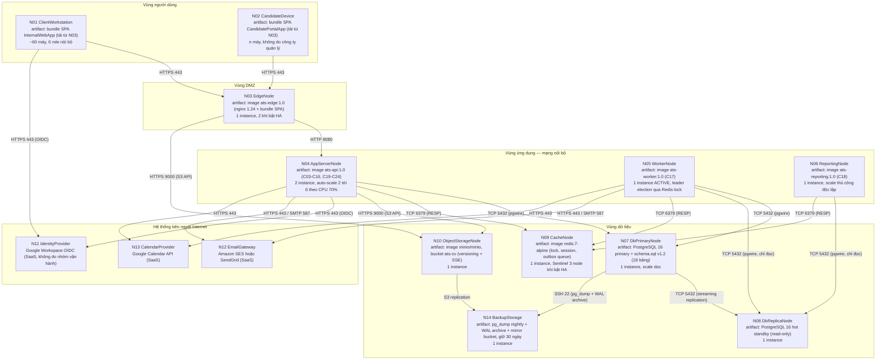

# D_deploy_topology_v1 — DEP-01 Deployment Diagram

**Người vẽ:** D (System & UI Designer + Demo Lead)
**Phiên bản:** v1
**Nguồn:** ADR-01…ADR-07 (`docs/design_decisions_D.md`), NFR-02/03/07/08/10/11/12/13, `spec_ats (1).md` mục 12 & 15, `sql/schema.sql` v1.2 (18 bảng), SEQ-01/SEQ-03 của B
**Phạm vi:** 14 node — N01…N14 — theo danh sách đã chốt; không thêm, không bớt, không đổi mã
**Quan hệ với COMP-01:** DEP-01 mô hình hoá **nơi chạy**, COMP-01 mô hình hoá **cái gì chạy** (xem mục 1)

Tiêu chí Done (`04_person_D_design.md` mục 6): ≥5 node vật lý · có node Client · có load balancer · protocol ghi rõ trên mọi connection · có ghi chú scaling. Đối chiếu chi tiết ở mục 9.

*Ghi chú đánh số:* hình và bảng được đánh số theo Chương 5 của báo cáo, mỗi số chỉ mang đúng một nội dung trong toàn bộ phần việc của D. `report/chapter_5_design.md` giữ Hình 5.1–5.8 và Bảng 5.1–5.11; `diagrams/D_comp_architecture_v1.md` giữ Hình 5.1 và 5.9 cùng Bảng 5.2–5.4, 5.20–5.22. Vì vậy DEP-01 dùng dải riêng: **Hình 5.10** và **Bảng 5.12–5.19**.

---

## 1. Vì sao DEP-01 không phải bản sao của COMP-01

Hai sơ đồ dùng hai **đơn vị mô hình hoá** khác nhau, nên không thể suy ra sơ đồ này từ sơ đồ kia bằng cách đổi hình khối. Bảng 5.12 đối chiếu bốn khác biệt cốt lõi.

**Bảng 5.12 — Phân biệt COMP-01 và DEP-01**

| Tiêu chí | COMP-01 (Component Diagram) | DEP-01 (Deployment Diagram) |
|---|---|---|
| Đơn vị trên sơ đồ | Component logic (`SchedulingService`, `ApprovalWorkflow`…) | **Node** (máy ảo / container host) và **artifact** (image triển khai) |
| Quan hệ giữa các phần tử | Cung cấp / tiêu thụ interface (`IScheduling`, `EmailPort`…) | Kênh truyền thông vật lý, có giao thức và số hiệu cổng |
| Câu hỏi trả lời | Trách nhiệm nghiệp vụ thuộc về ai | Tiến trình nào chạy ở đâu, đi qua đường mạng nào, nhân bản mấy bản |
| Thay đổi khi nào | Khi ranh giới nghiệp vụ đổi | Khi tải, chi phí hạ tầng hoặc yêu cầu khả dụng đổi |

Cụ thể, **24 component của COMP-01 được đóng gói lại thành đúng 5 artifact triển khai**: bundle tĩnh của `InternalWebApp` (C01) và `CandidatePortalApp` (C02) nằm chung trong image `ats-edge:1.0`; image `ats-api:1.0` mang C03–C16 và C19–C24; image `ats-worker:1.0` mang C17; image `ats-reporting:1.0` mang C18. Quan hệ nhiều-component-một-artifact chính là hệ quả trực tiếp của ADR-01 (modular monolith): ranh giới module được giữ ở tầng mã nguồn, không được nâng lên thành ranh giới tiến trình khi quy mô chưa đòi hỏi. Ngược lại, DEP-01 có những phần tử **không tồn tại** trong COMP-01 — `EdgeNode`, `BackupStorage`, các máy trạm của người dùng — vì đó là hạ tầng, không phải module nghiệp vụ.

---

## 2. Sơ đồ triển khai DEP-01

**Hình 5.10 — DEP-01: Sơ đồ triển khai hệ thống ATS mini theo vùng mạng**

Hình 5.10 cho thấy ba đặc điểm cấu trúc quan trọng. Thứ nhất, **mọi mũi tên đều đi từ trong ra ngoài hoặc từ vùng ngoài vào đúng một điểm** là N03 — không có node nào của vùng dữ liệu nhận kết nối trực tiếp từ Internet. Thứ hai, hai tiến trình nền N05 và N06 dùng hai nguồn dữ liệu theo hai cách khác nhau: N05 ghi trên primary N07 nhưng **đọc** trên replica N08 khi quét lịch sử trạng thái để làm mới read model, còn N06 chỉ chạm replica N08 và không bao giờ ghi — đây chính là cách ADR-02, ADR-07 và NFR-10 được hiện thực ở tầng hạ tầng chứ không chỉ ở tầng mã nguồn. Phần đọc nặng của job làm mới read model được đẩy sang replica để không tranh tài nguyên với giao dịch nghiệp vụ trên N07, còn phần ghi bốn bảng `rm_*` vẫn phải nằm trên primary vì N08 là hot standby chỉ đọc. Thứ ba, đường tải CV của ứng viên (N02 → N03 → N10) **không đi qua N04**, đúng theo ADR-04; lý do và hệ quả được phân tích ở mục 10.

---

## 3. Đặc tả node

Bảng 5.13 mô tả từng node theo sáu chiều: vai trò, artifact được triển khai lên node, cấu hình phần cứng đề xuất, số instance kèm chính sách nhân bản, và trạng thái lưu trữ. **Toàn bộ cột cấu hình là ước lượng** dựa trên quy mô giả định của đặc tả (mục 15: ≤50 JD mở đồng thời, ≤200 ứng viên/JD, ~60 user nội bộ), không phải kết quả đo trên hệ thống thật; cơ sở tính toán trình bày ngay dưới bảng.

**Bảng 5.13 — Đặc tả 14 node của DEP-01**

| Mã node | Vai trò | Artifact triển khai | Cấu hình đề xuất (ước lượng) | Số instance & chính sách scale | Trạng thái |
|---|---|---|---|---|---|
| N01 `ClientWorkstation` | Máy trạm của 6 role nội bộ | Bundle SPA `InternalWebApp` (C01) tải về từ N03, chạy trong trình duyệt | Máy sẵn có của công ty; yêu cầu tối thiểu giả định 4 GB RAM, Chrome/Edge/Firefox 2 phiên bản gần nhất (NFR-14) | ~60 máy; không do dự án cấp phát | Stateless (chỉ giữ access token trong bộ nhớ phiên) |
| N02 `CandidateDevice` | Thiết bị của ứng viên | Bundle SPA `CandidatePortalApp` (C02) | Không kiểm soát được; thiết kế responsive để chạy trên màn hình ≥360 px | n máy, không giới hạn | Stateless (magic-link token trong URL, không lưu lâu dài) |
| N03 `EdgeNode` | TLS termination, reverse proxy, **load balancer**, WAF cơ bản, phục vụ file tĩnh SPA | `ats-edge:1.0` = nginx 1.24 + hai bundle SPA | 2 vCPU / 4 GB RAM / 40 GB SSD | 1 instance; nâng lên 2 sau load balancer tầng 4 khi cần đạt NFR-03 chặt hơn | Stateless (chỉ có access log cục bộ, đẩy về log tập trung) |
| N04 `AppServerNode` | Chạy toàn bộ lõi nghiệp vụ đồng bộ (C03–C16, C19–C24) | `ats-api:1.0` | 2 vCPU / 4 GB RAM / 20 GB SSD mỗi instance | **2 instance thường trực, auto-scale 2 → 6** khi CPU trung bình >70% liên tục 5 phút; thu về khi <35% trong 15 phút | Stateless (session ở N09, file ở N10) |
| N05 `WorkerNode` | Chạy job định kỳ và đẩy outbox (C17) | `ats-worker:1.0` | 2 vCPU / 4 GB RAM / 20 GB SSD | **Đúng 1 instance active**, giữ leader lock trên N09; tuỳ chọn 1 instance standby chờ lock; **cấm auto-scale** | Không lưu dữ liệu, nhưng **có trạng thái quyền leader** đặt ở N09 |
| N06 `ReportingNode` | Truy vấn read model, dựng chart, export CSV/PDF (C18) | `ats-reporting:1.0` | 2 vCPU / 4 GB RAM / 20 GB SSD | 1 instance; nâng thủ công lên 2 trong kỳ chốt báo cáo tháng, không auto-scale | Stateless (read model nằm ở N08) |
| N07 `DbPrimaryNode` | PostgreSQL 16 primary, 18 bảng, 9 ENUM | Gói `postgresql-16` cài trực tiếp trên VM (không container hoá); cấu hình bắt buộc: `max_connections = 200` (nâng từ mặc định 100, xem mục 5.1), `archive_timeout = 300s` | 4 vCPU / 8 GB RAM / 100 GB SSD | 1 instance; **chỉ scale dọc**, không sharding | **Stateful** — nguồn sự thật của hệ thống |
| N08 `DbReplicaNode` | Hot standby chỉ đọc, phục vụ N06 và làm đích failover | Gói `postgresql-16` cấu hình `hot_standby = on` | 2 vCPU / 8 GB RAM / 100 GB SSD | 1 instance | **Stateful** (bản sao đồng bộ luồng) |
| N09 `CacheNode` | Redis 7: distributed lock BR-03, session, hàng đợi outbox, leader lock của N05 | `redis:7-alpine` | 1 vCPU / 2 GB RAM / 10 GB SSD | 1 instance; 3 node Sentinel khi cần HA | **Stateful có điều kiện** — mất dữ liệu chỉ gây mất phiên đăng nhập và phải chạy lại job, không mất dữ liệu nghiệp vụ |
| N10 `ObjectStorageNode` | MinIO S3-compatible, bucket `ats-cv`, bật versioning và SSE | `minio/minio` | 2 vCPU / 4 GB RAM / 500 GB SSD | 1 instance; mở rộng bằng cách thêm dung lượng đĩa | **Stateful** |
| N11 `IdentityProvider` | Google Workspace OIDC — xác thực SSO cho 6 role nội bộ | SaaS, không có artifact do nhóm triển khai | Do nhà cung cấp quyết định | Không áp dụng | Ngoài phạm vi vận hành |
| N12 `EmailGateway` | Amazon SES / SendGrid — gửi email ra ngoài theo template đã duyệt (BR-12) | SaaS | Do nhà cung cấp quyết định | Không áp dụng | Ngoài phạm vi vận hành |
| N13 `CalendarProvider` | Google Calendar API — đồng bộ event phỏng vấn | SaaS | Do nhà cung cấp quyết định | Không áp dụng | Ngoài phạm vi vận hành |
| N14 `BackupStorage` | Lưu pg_dump hằng đêm, WAL archive liên tục, mirror bucket CV; giữ 30 ngày | Script `pg_backup.sh` + `mc mirror`, đặt trên NAS hoặc bucket lạnh khác vùng vật lý | 1 vCPU / 2 GB RAM / 1 TB HDD | 1 instance | **Stateful** |

**Cơ sở của cấu hình đề xuất.** Cấu hình được chọn nhỏ một cách có chủ ý — đây là hệ thống nội bộ của một công ty, không phải nền tảng phục vụ hàng triệu người dùng, và cấu hình thừa chỉ làm tăng chi phí mà không cải thiện chỉ số nào trong NFR-01…NFR-14.

- **N07 4 vCPU / 8 GB.** Ước lượng dung lượng: một chu kỳ đầy tải sinh khoảng 10.000 `applications` (50 JD × 200 ứng viên); mỗi application kéo theo trung bình 8 dòng `application_status_history`, 3 dòng `interviews`, 6 dòng `feedbacks` và khoảng 30 dòng `feedback_criteria`, cộng thêm `audit_logs` — tổng khoảng 500.000 dòng, trung bình 300 byte/dòng, tức ~150 MB dữ liệu và ~300 MB kể cả index. Toàn bộ tập dữ liệu nóng nằm gọn trong `shared_buffers` 2 GB, nghĩa là hầu hết truy vấn của SCR-03 và SCR-10 được phục vụ từ bộ nhớ. Đĩa 100 GB không dành cho dữ liệu nghiệp vụ mà cho WAL, `audit_logs` tích luỹ nhiều năm và khoảng trống cần thiết khi restore tại chỗ.
- **N10 500 GB.** Giả định vòng đời một JD khoảng 2 tháng, tương ứng ~30.000 CV mỗi năm ở kịch bản đầy tải; CV trung bình 2 MB (trần cứng 10 MB, xem mục 10), hệ số versioning trung bình 1,5 bản/ứng viên → ~90 GB/năm. 500 GB đủ cho khoảng 5 năm vận hành kèm dư địa.
- **N09 2 GB.** Redis chỉ giữ khoảng 60 session, vài chục lock slot có TTL 120 giây và hàng đợi outbox thường xuyên rỗng; 2 GB là mức tối thiểu an toàn chứ không phải mức tính theo tải.
- **N04/N05/N06 2 vCPU.** Xem phép tính năng lực chịu tải ở mục 5.4.

---

## 4. Ma trận kết nối

Bảng 5.14 liệt kê đầy đủ 21 kênh truyền thông được vẽ trên Hình 5.10, cộng thêm một kênh vận hành (dòng 22 — đẩy log về nơi tập trung) được cố ý không vẽ lên hình để sơ đồ còn đọc được. Cột "Chiều khởi tạo" là cột quan trọng nhất về mặt bảo mật: nó cho thấy **không có kênh nào được khởi tạo từ Internet vào trong**, ngoại trừ hai kênh của người dùng đi tới N03.

**Bảng 5.14 — Ma trận kết nối giữa các node**

| # | Từ node | Đến node | Giao thức + cổng | Mã hoá | Mục đích | Chiều khởi tạo |
|---|---|---|---|---|---|---|
| 1 | N01 | N03 | HTTPS 443 | TLS 1.3 | Tải bundle SPA và gọi API nội bộ | Client khởi tạo |
| 2 | N02 | N03 | HTTPS 443 | TLS 1.3 | Candidate Portal, xác thực magic-link (ADR-09) | Client khởi tạo |
| 3 | N01 | N11 | HTTPS 443 (OIDC) | TLS 1.3 | Trình duyệt được chuyển hướng để đăng nhập SSO | Client khởi tạo |
| 4 | N03 | N04 | HTTP 8080 | Không mã hoá — trong mạng riêng, xem mục 7 | Reverse proxy và cân bằng tải round-robin | N03 khởi tạo |
| 5 | N03 | N10 | HTTPS 9000 (S3 API) | TLS | Chuyển tiếp upload/download CV bằng presigned URL | N03 khởi tạo |
| 6 | N04 | N07 | TCP 5432 (pgwire) | TLS, `sslmode=verify-full` | Đọc/ghi toàn bộ nghiệp vụ transactional | N04 khởi tạo |
| 7 | N04 | N09 | TCP 6379 (RESP) | TLS + xác thực mật khẩu | Lock chống trùng lịch (BR-03), session, ghi outbox | N04 khởi tạo |
| 8 | N04 | N10 | HTTPS 9000 (S3 API) | TLS | Phát presigned URL, đối chiếu checksum, đọc metadata | N04 khởi tạo |
| 9 | N04 | N11 | HTTPS 443 (OIDC) | TLS | Đổi authorization code lấy token, lấy JWKS | N04 khởi tạo |
| 10 | N04 | N12 | HTTPS 443 / SMTP 587 | TLS / STARTTLS | Gửi email cần tức thời, ví dụ magic link mời ứng viên | N04 khởi tạo |
| 11 | N04 | N13 | HTTPS 443 | TLS | Tạo/sửa event lịch ngay khi Recruiter thao tác (SEQ-01) | N04 khởi tạo |
| 12 | N05 | N07 | TCP 5432 (pgwire) | TLS | Quét SLA, đọc outbox, cập nhật trạng thái job | N05 khởi tạo |
| 13 | N05 | N09 | TCP 6379 (RESP) | TLS + xác thực mật khẩu | Giữ và gia hạn leader lock, đọc hàng đợi outbox | N05 khởi tạo |
| 14 | N05 | N12 | HTTPS 443 / SMTP 587 | TLS / STARTTLS | Đẩy email từ outbox kèm idempotency key (NFR-11) | N05 khởi tạo |
| 15 | N05 | N13 | HTTPS 443 | TLS | Thử lại đồng bộ lịch khi trạng thái là `CALENDAR_SYNC_PENDING` | N05 khởi tạo |
| 16 | N06 | N08 | TCP 5432 (pgwire, chỉ đọc) | TLS | Truy vấn read model `rm_*` cho 4 chart của SCR-10 | N06 khởi tạo |
| 17 | N06 | N09 | TCP 6379 (RESP) | TLS + xác thực mật khẩu | Cache kết quả chart và giá trị `dataFreshness` | N06 khởi tạo |
| 18 | N07 | N08 | TCP 5432 (streaming replication) | TLS | Sao chép luồng WAL sang hot standby (ADR-02) | N07 khởi tạo |
| 19 | N07 | N14 | SSH 22 (rsync pg_dump + WAL archive) | SSH, xác thực bằng khoá | Sao lưu hằng đêm và lưu trữ WAL liên tục (NFR-07) | N07 khởi tạo |
| 20 | N10 | N14 | S3 replication (HTTPS) | TLS | Nhân bản bucket `ats-cv` sang vùng lưu trữ khác | N10 khởi tạo |
| 21 | N05 | N08 | TCP 5432 (pgwire, chỉ đọc) | TLS | Quét `application_status_history` trên replica để làm mới read model mỗi 15 phút (ADR-07); kết quả tổng hợp được ghi ngược lên N07 qua dòng 12 | N05 khởi tạo |
| 22 | N04, N05, N06 | Log tập trung (trên N03) | TCP 514 / HTTPS | TLS | Đẩy log kèm `correlationId` và chỉ số health (NFR-13) | Node ứng dụng khởi tạo |

Một quyết định thiết kế cần nêu rõ: **hệ thống không nhận webhook từ N12 và N13.** Trạng thái gửi email được đối soát bằng cách N05 chủ động gọi API truy vấn theo chu kỳ, chấp nhận độ trễ vài phút trong việc cập nhật `delivery_status` (đề xuất P2 gửi C). Đánh đổi ở đây là rõ ràng: mất tính tức thời của thông tin gửi thư, nhưng đổi lại tường lửa **không cần mở bất kỳ cổng inbound nào ngoài 443 trên N03** — bề mặt tấn công nhỏ hơn hẳn, và ở quy mô hệ thống nội bộ thì độ trễ vài phút không ảnh hưởng tới bất kỳ SLA nào trong NFR.

---

## 5. Chiến lược mở rộng

### 5.1. `ats-api` (N04): stateless, auto-scale 2 → 6

`ats-api` được thiết kế **stateless hoàn toàn**, đây là điều kiện tiên quyết để nhân bản: session và refresh token nằm ở Redis (ADR-03) thay vì bộ nhớ tiến trình; file CV không bao giờ đi qua tiến trình ứng dụng (ADR-04); mọi trạng thái nghiệp vụ nằm ở PostgreSQL. Hệ quả trực tiếp là nginx trên N03 phân phối theo round-robin **không cần sticky session**, và một instance bị giết giữa chừng chỉ làm hỏng đúng các request đang bay, không làm mất phiên của ai.

Chính sách nhân bản: mở rộng khi CPU trung bình toàn nhóm vượt 70% liên tục 5 phút, thu về khi xuống dưới 35% liên tục 15 phút, kèm thời gian nguội 10 phút giữa hai lần điều chỉnh để tránh dao động lên xuống liên tục. Các ngưỡng này là **giả định vận hành**, cần hiệu chỉnh sau đợt load test đầu tiên.

Trần 6 instance không phải con số tuỳ ý mà bị chặn bởi **số kết nối tối đa tới N07**: mỗi instance giữ pool 20 kết nối, 6 instance chiếm 120, cộng 10 kết nối của N05 và các phiên quản trị, tổng vẫn dưới mức `max_connections = 200`. Đây là giá trị **được cấu hình** trên N07 chứ không phải mặc định: mặc định của PostgreSQL là `max_connections = 100`, và với mặc định đó thì 120 kết nối của 6 instance đã vượt trần. Việc nâng tham số này lên 200 (kèm `shared_buffers` tương ứng) là một mục cấu hình bắt buộc của N07, ghi ở mục 1. Muốn vượt trần này thì phải thêm một tầng gộp kết nối (PgBouncer) chứ không phải thêm máy — nghĩa là ở quy mô lớn hơn, nút thắt chuyển từ tầng ứng dụng xuống tầng dữ liệu.

### 5.2. `ats-worker` (N05): chỉ một instance active, leader election qua Redis

`ats-worker` là node duy nhất trong DEP-01 **bị cấm nhân bản tự do**. Lý do không phải hiệu năng mà là tính đúng đắn: các job của C17 thao tác trên tập bản ghi được chọn bằng điều kiện thời gian, nên hai tiến trình chạy song song sẽ chọn trúng cùng một tập và cùng hành động lên nó.

Ba kịch bản hỏng cụ thể nếu chạy 2 worker mà không có cơ chế điều phối:

1. **Job hết hạn offer (BR-09).** Cả hai worker cùng `SELECT` các `offers` có `deadline < now()` và `status = 'SIGNED_BY_COMPANY'`, cùng `UPDATE` sang `EXPIRED`, cùng ghi bản ghi outbox. Ứng viên nhận **hai email "offer đã hết hạn"** cách nhau vài giây; `application_status_history` có hai dòng cho cùng một transition, khiến báo cáo time-in-stage của SCR-10 đếm sai; và nếu ứng viên vừa bấm "Accept" đúng khoảnh khắc đó, hai luồng ghi song song còn tạo ra tranh chấp trạng thái mà `version` (ADR-08) sẽ chặn bằng cách làm hỏng một trong hai — nhưng người dùng không hiểu vì sao thao tác của mình thất bại.
2. **Job nhắc SLA feedback (SEQ-03, BR-06).** Cùng một `interview` quá 48 giờ bị hai worker cùng phát hiện; interviewer nhận hai email nhắc giống hệt trong cùng một phút. Điều này vi phạm trực tiếp NFR-11 ("0 email trùng khi replay") và làm hỏng chỉ số SLA compliance vì mốc 72 giờ có thể bị escalate hai lần lên Hiring Manager.
3. **Job làm mới read model (ADR-07).** Hai worker cùng làm mới `rm_funnel_daily` và `rm_time_to_hire`: nếu chiến lược là xoá-rồi-ghi thì số liệu bị nhân đôi hoặc rỗng tạm thời; nếu là ghi đè theo khoá thì hai transaction cùng đụng cùng dải khoá và sinh deadlock. Cả hai trường hợp đều làm SCR-10 hiển thị sai trong khi `dataFreshness` vẫn báo "vừa cập nhật" — một kiểu lỗi âm thầm, khó phát hiện.

Gốc rễ chung của cả ba: **job không idempotent theo mặc định**. Một job idempotent là job chạy lại n lần cho kết quả giống chạy một lần; các job trên lại có tác dụng phụ ra bên ngoài (gửi email, ghi lịch sử) nên chạy hai lần tạo hai tác dụng phụ.

Cơ chế điều phối được chọn là **leader election bằng Redis lock**: đầu mỗi chu kỳ 60 giây, worker thực hiện `SET lock:worker:leader <instanceId> NX PX 90000`; chỉ instance đặt được khoá mới chạy vòng job, đồng thời gia hạn khoá mỗi 30 giây trong lúc chạy. Khi tiến trình chết đột ngột, khoá tự hết hạn sau tối đa 90 giây và instance standby chiếm quyền — đổi lại là một khoảng trễ tối đa 90 giây, chấp nhận được vì mọi job đều theo lịch phút chứ không theo thời gian thực.

Một điểm dễ bị hỏi khi bảo vệ: **nếu đằng nào cũng chỉ chạy một container thì cần khoá làm gì?** Cần, vì trong lúc triển khai phiên bản mới theo kiểu cuốn chiếu, container cũ và container mới cùng tồn tại trong vài giây; đúng khoảng đó là cửa sổ sinh job trùng. Khoá biến một bất biến vận hành mong manh ("nhớ đừng chạy hai bản") thành một bất biến do hệ thống tự bảo đảm.

Khoá vẫn chỉ là lớp phòng thủ thứ nhất. Lớp thứ hai là **idempotency key**: mỗi bản ghi outbox mang `idempotency_key = hash(entity, event, attempt)` với ràng buộc UNIQUE (đề xuất P1 gửi C), và khoá này được truyền tiếp cho `EmailAdapter`/`CalendarAdapter` khi gọi N12/N13. Nguyên tắc thiết kế ở đây là: **khoá phân tán là tối ưu hoá, idempotency mới là bảo đảm** — nếu Redis mất dữ liệu hoặc mạng phân mảnh làm hai worker cùng tưởng mình là leader, email trùng vẫn bị chặn ở tầng ghi outbox và ở gateway.

Khi khối lượng job tăng, cách mở rộng đúng **không phải** thêm instance mà là chia job theo nhóm: một worker giữ khoá `lock:worker:sla`, một worker khác giữ `lock:worker:outbox` — mỗi loại job vẫn có đúng một chủ. Phương án thay thế là dùng hàng đợi có phân vùng (Kafka, mỗi partition một consumer) đã bị loại vì chi phí vận hành của một cụm broker hoàn toàn không tương xứng với khối lượng vài nghìn job mỗi ngày ở quy mô ≤50 JD.

### 5.3. `ats-reporting` (N06): scale độc lập

`ats-reporting` chỉ đọc replica N08 và không ghi bất kỳ bảng nào (bảng phân quyền ghi ở COMP-01 ghi rõ: chỉ đọc). Việc làm mới read model thuộc về C17 trên N05, không thuộc N06. Nhờ hai điều đó, N06 stateless tuyệt đối và tăng số instance **không tạo thêm một byte ghi nào lên N07** — đúng mục tiêu NFR-10. Trong kỳ chốt báo cáo tháng, khi Head of HR và HR Admin cùng xuất CSV/PDF, số instance được nâng thủ công lên 2; ngoài kỳ đó tải gần như bằng không nên auto-scale là thừa. Đây cũng là câu trả lời cho phản biện "tách reporting có làm phức tạp thêm không": phức tạp thêm đúng một tiến trình và một kết nối, đổi lại là bảo đảm cứng rằng một truy vấn chart nặng không bao giờ khoá bảng mà SCR-03 đang cần.

### 5.4. Ước lượng năng lực chịu tải

Bảng 5.15 trình bày phép ước lượng suy ra từ giả định quy mô của NFR-08. Mọi con số được đánh dấu "giả định" đều là tham số do D đặt ra để tính, chưa được đo trên hệ thống thật.

**Bảng 5.15 — Ước lượng tải đỉnh và năng lực đáp ứng của N04**

| # | Tham số | Giá trị | Nguồn |
|---|---|---|---|
| 1 | Số user nội bộ | 60 | NFR-08 / `spec_ats (1).md` mục 15 |
| 2 | Tỷ lệ online đồng thời lúc cao điểm | 40% → **24 phiên hoạt động** | Giả định |
| 3 | Nhịp thao tác của một phiên | 1 thao tác / 20 giây | Giả định (thời gian đọc và suy nghĩ giữa hai thao tác) |
| 4 | Số request HTTP cho mỗi thao tác UI | 3 | Giả định — đã tính phần gộp response của `ApiGateway`/BFF (C03) |
| 5 | Tải trung bình nội bộ | 24 × (1/20) × 3 = **3,6 req/s** | Tính từ 2, 3, 4 |
| 6 | Hệ số đỉnh (đầu giờ sáng, sau nghỉ trưa) | ×3 → **~11 req/s** | Giả định |
| 7 | Tải từ Candidate Portal | ≤10.000 hồ sơ, ~5% có hoạt động mỗi ngày, 5 request mỗi lượt, trải trên 8 giờ → **~0,1 req/s** | Tính từ NFR-08 |
| 8 | **Tổng tải đỉnh thiết kế** | **~12 req/s** | Tính từ 6, 7 |
| 9 | Thời gian xử lý p95 của một request API | 150 ms | Giả định, đặt sao cho một màn hình gồm 3 request vẫn đạt NFR-01 (≤2 s) |
| 10 | Số request xử lý song song tối đa mỗi instance | 20 | Giả định theo kích thước pool luồng và pool kết nối DB |
| 11 | Năng lực lý thuyết 1 instance (định luật Little: λ = L/W) | 20 / 0,15 ≈ **133 req/s** | Tính từ 9, 10 |
| 12 | Hệ số an toàn (chờ I/O, GC, biến động truy vấn) | 40% → **~50 req/s thực dụng** | Giả định |
| 13 | Năng lực 2 instance | **~100 req/s** | Tính từ 12 |
| 14 | Hệ số dư tải so với đỉnh thiết kế | 100 / 12 ≈ **8 lần** | Tính từ 8, 13 |

Kết luận rút ra từ Bảng 5.15 làm rõ một điều dễ bị hiểu nhầm: **hai instance được chọn không phải vì cần 100 req/s, mà vì cần khả dụng.** Một instance đã thừa sức gánh tải đỉnh ước tính, nhưng một instance nghĩa là mọi lần triển khai phiên bản mới, mọi lần khởi động lại và mọi sự cố phần cứng đều thành gián đoạn dịch vụ — không đạt NFR-03. Hai instance cho phép triển khai cuốn chiếu và chịu được mất một máy mà người dùng không nhận ra. Ngưỡng auto-scale tới 6 đóng vai trò van an toàn cho các đợt bất thường (import hàng loạt CV sau hội chợ việc làm, nhiều người cùng xuất báo cáo), chứ không phải chế độ vận hành thường ngày. Đáng lưu ý là ở những đợt đó, nút thắt nhiều khả năng nằm ở N07 chứ không phải N04, nên biện pháp đúng theo thứ tự là tối ưu truy vấn và bổ sung index (danh sách index D đề xuất gửi C) trước khi thêm instance.

Về NFR-02 ("50 request song song"): 2 instance xử lý đồng thời tối đa 40 request, 10 request còn lại xếp hàng và được giải phóng trong khoảng 150 ms — độ trễ tăng nhưng không có request nào bị từ chối. Quan trọng hơn, **tính đúng đắn của NFR-02 không phụ thuộc số instance**: bảo đảm "0 lịch trùng" đến từ `LockManager` trên N09 (ADR-03), và đúng vì thế mà nó vẫn đúng khi hệ thống chạy 2 hay 6 instance.

---

## 6. Sao lưu và khôi phục (NFR-07)

### 6.1. Lịch sao lưu

Bảng 5.16 tổng hợp toàn bộ chính sách sao lưu: mỗi loại dữ liệu được bảo vệ bằng một cơ chế khác nhau, tương ứng với hậu quả khác nhau khi mất.

**Bảng 5.16 — Lịch sao lưu và mục tiêu khôi phục**

| Đối tượng | Node nguồn | Phương thức | Tần suất | Nơi lưu | Thời gian giữ |
|---|---|---|---|---|---|
| Toàn bộ database | N07 | `pg_dump` nén định dạng custom | Hằng đêm 01:00 (giờ VN) | N14 | 30 ngày |
| Nhật ký giao dịch | N07 | WAL archive liên tục, `archive_timeout = 300s` | Liên tục, tối đa trễ 5 phút | N14 | 30 ngày |
| Bản sao nóng | N07 → N08 | Streaming replication | Gần tức thời | N08 | Luôn hiện hành |
| File CV | N10 | `mc mirror` bucket `ats-cv` | Hằng ngày 02:00 | N14 | 30 ngày, kèm versioning tại nguồn |
| Cấu hình triển khai | Toàn bộ node | Manifest triển khai và biến môi trường **không chứa bí mật**, lưu trong Git | Mỗi lần thay đổi | Kho Git | Vô thời hạn |
| Dữ liệu Redis (N09) | N09 | **Không sao lưu** — có chủ đích | — | — | — |

Redis cố ý không được sao lưu vì mọi thứ trong đó đều dựng lại được: session mất thì người dùng đăng nhập lại, lock mất thì job chạy lại chu kỳ sau, hàng đợi outbox mất thì được dựng lại từ bảng `outbox_events` trong PostgreSQL — tức là nguồn sự thật của outbox nằm ở N07 chứ không ở N09. Sao lưu một bộ nhớ đệm là chi phí không đổi lấy giá trị nào.

### 6.2. Mục tiêu RPO và RTO

**RPO ≤ 24 giờ** là cam kết của NFR-07, nhưng nhờ WAL archive với `archive_timeout = 300s`, RPO **thực tế** rơi vào khoảng 5 phút, và nếu sự cố chỉ ở phần cứng N07 thì việc chuyển đổi sang N08 cho RPO gần bằng 0. Khoảng cách giữa cam kết và thực tế là dư địa cố ý: cam kết được đặt ở mức luôn giữ được kể cả khi WAL archive hỏng.

**RTO ≤ 4 giờ** được phân rã thành ngân sách thời gian cụ thể để kiểm chứng được, chứ không phải một con số đẹp: phát hiện sự cố và ra quyết định khôi phục 30 phút; dựng node dữ liệu mới từ image chuẩn 45 phút; nạp bản backup nền và replay WAL 90 phút (giả định cơ sở dữ liệu ≤100 GB, tốc độ khôi phục ~50 MB/s); kiểm thử khói và đối chiếu toàn vẹn 30 phút; mở lại lưu lượng 15 phút. Tổng khoảng 3 giờ 30 phút, còn dư 30 phút cho tình huống ngoài dự kiến.

### 6.3. Quy trình khôi phục bốn bước

1. **Cách ly và tuyên bố sự cố.** Chuyển N03 sang trang thông báo bảo trì, dừng N04 và N05 để không có tiến trình nào tiếp tục ghi lên dữ liệu đang hỏng. Bước dừng N05 quan trọng hơn dừng N04: worker có thể đang đẩy email từ outbox và tiếp tục sinh tác dụng phụ ra bên ngoài trong lúc dữ liệu đã sai.
2. **Chọn điểm khôi phục và dựng lại tầng dữ liệu.** Có hai nhánh tuỳ bản chất sự cố. Nếu N07 hỏng phần cứng, thăng cấp N08 thành primary và trỏ N04/N05 sang node mới — nhanh nhất, mất dữ liệu gần bằng 0. Nếu là hỏng logic (xoá nhầm, lỗi migration làm sai dữ liệu), **không** được thăng cấp N08 vì replica đã sao chép trung thực cả cái sai; phải khôi phục từ N14 theo cơ chế point-in-time recovery về thời điểm ngay trước sự cố.
3. **Đối chiếu toàn vẹn trước khi mở cửa.** So số bản ghi các bảng trọng yếu (`applications`, `offers`, `interviews`) với số liệu giám sát gần nhất; kiểm tra mọi giá trị `attachments.file_url` mới nhất đều trỏ tới một object còn tồn tại trên N10, rồi đối chiếu checksum của các object đó giữa bucket `ats-cv` và bản mirror trên N14 — hai kho này khôi phục độc lập nên hoàn toàn có thể lệch nhau, và vì `attachments` không có cột checksum nên phép so sánh phải lấy giá trị từ metadata của chính object qua `StoragePort.checksum(ObjectKey)`; chạy kịch bản kiểm thử khói gồm đăng nhập, mở kanban, xếp một lịch thử.
4. **Mở lại lưu lượng theo thứ tự và ghi biên bản.** Bật N04 với 2 instance trước, quan sát 15 phút, rồi mới bật N05 sau cùng. Thứ tự này có lý do: các bản ghi outbox được khôi phục có thể quay lại trạng thái `PENDING` và bị đẩy lại — email trùng được chặn nhờ `idempotency_key` UNIQUE (NFR-11), nhưng vẫn cần quan sát trước khi cho worker chạy. Cuối cùng ghi biên bản sự cố và cập nhật runbook.

### 6.4. Diễn tập khôi phục

Một bản sao lưu chưa từng được khôi phục thì chưa được coi là bản sao lưu. Vì vậy, **mỗi quý một lần** (giả định về tần suất), bản backup gần nhất được khôi phục vào môi trường Staging, đo thời gian thực tế của từng bước trong mục 6.2 và đối chiếu với ngân sách RTO đã cam kết; sai lệch được ghi vào runbook cùng biện pháp rút ngắn. Diễn tập cũng là dịp kiểm tra rằng bộ script sao lưu vẫn chạy đúng sau các lần nâng cấp PostgreSQL.

### 6.5. Versioning bucket CV

Bucket `ats-cv` trên N10 bật versioning: mỗi lần ứng viên nộp CV mới, đối tượng cũ không bị ghi đè mà trở thành một version trước đó, và cột `version` trong bảng `attachments` trỏ đúng tới version tương ứng. Thao tác xoá tạo ra delete marker chứ không xoá thật, nên khôi phục một CV bị xoá nhầm là thao tác vài giây và **không cần khôi phục database**. Chính sách vòng đời dọn các version cũ hơn 30 ngày để dung lượng không phình vô hạn, khớp với thời gian giữ backup ở Bảng 5.16.

---

## 7. Bảo mật hạ tầng

**Phân vùng mạng.** Bốn vùng trong Hình 5.10 tương ứng bốn nhóm bảo mật với quy tắc mặc định là từ chối. Chỉ N03 có địa chỉ IP công khai và chỉ mở duy nhất cổng inbound TCP 443 (cổng 80 chỉ tồn tại để chuyển hướng 301 sang 443). N04, N05, N06 không có IP công khai; các node này ra Internet qua NAT với danh sách cho phép chỉ gồm tên miền của N11, N12, N13. Vùng dữ liệu (N07, N08, N09, N10, N14) chỉ chấp nhận kết nối phát sinh từ nhóm bảo mật của vùng ứng dụng, đúng cổng đã liệt kê ở Bảng 5.14 — nghĩa là ngay cả khi một máy trạm nội bộ bị chiếm quyền, nó vẫn không mở được kết nối tới cổng 5432 của N07.

**TLS ở đâu.** Kênh giữa người dùng và N03 dùng TLS 1.3 kèm HSTS, chứng chỉ tự động gia hạn. Mọi kết nối từ vùng ứng dụng tới N07, N08, N09, N10 và ra Internet đều bật TLS. Ngoại lệ có kiểm soát duy nhất là kênh N03 → N04 chạy HTTP 8080 trong mạng riêng: đánh đổi ở đây là bỏ chi phí vận hành một hệ thống chứng chỉ nội bộ, đổi lấy rủi ro chỉ hiện thực khi kẻ tấn công đã đứng được trong mạng nội bộ. Nếu yêu cầu tuân thủ tăng lên, biện pháp nâng cấp có sẵn là bật mTLS giữa N03 và N04 mà không cần đổi kiến trúc.

**Dữ liệu nghỉ.** N07, N08 và N14 mã hoá toàn ổ đĩa; N10 bật mã hoá phía máy chủ cho bucket `ats-cv`. Hệ thống **không** mã hoá riêng ở mức cột cho các trường nhạy cảm như email hay lương — quyết định này có đánh đổi rõ: mã hoá cột sẽ vô hiệu hoá các index mà C đã thiết kế (`candidates.email` UNIQUE, `offers(status, deadline)`) và làm hỏng cả bộ truy vấn báo cáo, trong khi rủi ro chính của một hệ thống nội bộ là truy cập sai quyền chứ không phải đĩa bị lấy đi. Bù lại, quyền riêng tư được bảo vệ ở tầng khác: RBAC deny-by-default (ADR-10, NFR-05) và audit đầy đủ (NFR-06). Cần nói rõ giới hạn để không tự huyễn hoặc: mã hoá toàn ổ chỉ bảo vệ trước việc đĩa bị mang đi, hoàn toàn không bảo vệ khi tài khoản database bị lộ.

**Quản lý bí mật.** Mật khẩu database, khoá truy cập MinIO, khoá API của N12/N13 không nằm trong image và không được commit vào kho mã. Chúng được nạp vào container dưới dạng biến môi trường lấy từ kho bí mật (giả định dùng Docker secret ở mức tối thiểu, hoặc HashiCorp Vault nếu công ty đã có), xoay vòng định kỳ 90 ngày. Presigned URL của CV chỉ sống 10 phút theo NFR-12, nên kể cả khi một URL bị lộ qua log hay lịch sử trình duyệt thì cửa sổ khai thác cũng rất hẹp.

**Quyền truy cập quản trị.** Không có node nào cho phép SSH trực tiếp từ Internet. Mọi phiên quản trị đi qua một bastion đặt trong DMZ, xác thực bằng cặp khoá kèm xác thực hai yếu tố, và toàn bộ phiên vào vùng dữ liệu được ghi lại. Chỉ hai vai trò vận hành (giả định: một DBA và một kỹ sư hạ tầng) có quyền vào N07, N08, N14. N04, N05, N06 **không cần quyền SSH cho bất kỳ ai**: chẩn đoán thực hiện qua log tập trung có `correlationId` (NFR-13), còn sửa lỗi thực hiện bằng cách triển khai image mới — nguyên tắc hạ tầng bất biến, vừa giảm bề mặt tấn công vừa loại bỏ tình trạng máy chạy khác với những gì kho mã mô tả.

---

## 8. Môi trường

Ba môi trường trong Bảng 5.17 là **thiết kế đề xuất cho một lần triển khai thật**. Trong phạm vi bài tập lớn, chỉ môi trường prototype tồn tại trên thực tế; Dev và Staging được mô tả để chứng minh kiến trúc có đường đi từ bản thiết kế tới vận hành, không phải để tuyên bố rằng chúng đã được dựng.

**Bảng 5.17 — So sánh ba môi trường triển khai**

| Tiêu chí | Dev | Staging | Production |
|---|---|---|---|
| Số node | 1 máy, toàn bộ dịch vụ chạy chung bằng `docker compose` | 4 VM (gộp N03+N04, N05+N06, N07, N09+N10) | 10 VM (N03–N10, N14 và bastion), N08 tách riêng |
| Số instance `ats-api` | 1 | 1 | 2, auto-scale tới 6 |
| PostgreSQL | 1 container, không replica | 1 primary + 1 replica dùng chung máy | 1 primary + 1 replica trên hai máy khác nhau |
| Dữ liệu | Bộ seed sinh tự động: 3 JD, 20 ứng viên hư cấu của VXTech | Bản sao production đã ẩn danh (thay tên, email, số điện thoại) | Dữ liệu thật |
| `IdentityProvider` (N11) | Adapter giả, đăng nhập bằng cách chọn role | Tenant Google Workspace thử nghiệm | Google Workspace của công ty |
| `EmailGateway` (N12) | Adapter giả, ghi email ra thư mục cục bộ | Tài khoản SES sandbox, chỉ gửi tới hộp thư nội bộ đã xác minh | Tài khoản SES/SendGrid thật |
| `CalendarProvider` (N13) | Adapter giả | Tài khoản thử nghiệm | Tài khoản thật |
| TLS | Không (chạy `http://localhost`) | Chứng chỉ staging | TLS 1.3 + HSTS |
| Sao lưu | Không | Hằng tuần, không cam kết RTO | Theo Bảng 5.16, RPO ≤24h, RTO ≤4h |
| Mục đích chính | Lập trình, chạy thử prototype | Diễn tập khôi phục, load test, tổng duyệt demo | Vận hành thật |

Việc N11, N12, N13 có thể thay bằng adapter giả ở môi trường Dev không phải tiện ích ngẫu nhiên mà là hệ quả trực tiếp của ADR-05 (hexagonal / ports-and-adapters): lõi nghiệp vụ chỉ biết tới `IdentityPort`, `EmailPort`, `CalendarPort`, nên đổi cài đặt phía sau cổng không cần chạm vào bất kỳ dòng nào của C04–C16.

**Môi trường dùng cho buổi demo.** Buổi bảo vệ dùng prototype tĩnh `prototype/index.html` (ADR-12) chạy trực tiếp trên máy trình bày, không cần mạng và không cần bất kỳ node nào của Hình 5.10. Lựa chọn này loại bỏ toàn bộ rủi ro hạ tầng ngay tại thời điểm không được phép có rủi ro: mạng phòng học chập chờn, chứng chỉ hết hạn, container không khởi động. Staging chỉ đóng vai trò nguồn ảnh chụp màn hình chuẩn bị trước và phương án dự phòng nếu hội đồng muốn xem hệ thống chạy thật.

---

## 9. Đối chiếu tiêu chí "Done"

Bảng 5.18 tự đối chiếu DEP-01 với checklist Deployment Diagram trong `04_person_D_design.md` mục 6, mỗi dòng kèm bằng chứng cụ thể để người review chéo (theo `06_conventions_shared.md` mục 4) kiểm tra được ngay.

**Bảng 5.18 — Đối chiếu DEP-01 với tiêu chí "Done"**

| # | Tiêu chí | Đạt | Bằng chứng |
|---|---|---|---|
| 1 | Có ≥5 node vật lý | Đạt | 14 node N01–N14 trong Hình 5.10 và Bảng 5.13, trong đó **9 node hạ tầng do nhóm vận hành** (N03–N10, N14), 2 node client, 3 hệ thống ngoài — vượt mức tối thiểu 5 |
| 2 | Có node "Client" (browser/mobile) | Đạt | N01 `ClientWorkstation` (trình duyệt của 6 role nội bộ) và N02 `CandidateDevice` (desktop/mobile của ứng viên), đặt trong subgraph "Vùng người dùng" |
| 3 | Có load balancer nếu app server >1 instance | Đạt | N04 chạy 2 instance nên N03 `EdgeNode` đảm nhiệm cân bằng tải round-robin (dòng 4 của Bảng 5.14); mục 5.1 giải thích vì sao không cần sticky session |
| 4 | Protocol ghi rõ trên connection | Đạt | 21/21 connector trên Hình 5.10 đều mang nhãn giao thức kèm số hiệu cổng (`HTTPS 443`, `HTTP 8080`, `TCP 5432 (pgwire)`, `TCP 6379 (RESP)`, `HTTPS 9000 (S3 API)`…); cả 22 dòng của Bảng 5.14 còn bổ sung cột mã hoá, mục đích và chiều khởi tạo |
| 5 | Có ghi chú về scaling | Đạt | Số instance và chính sách nhân bản ghi ngay trên nhãn node của Hình 5.10 (N04 "2 tới 6 theo CPU 70%", N05 "1 instance ACTIVE", N06 "scale thủ công độc lập"), chi tiết ở cột 5 Bảng 5.13 và toàn bộ mục 5 |
| 6 | Không trùng lặp Component Diagram (`04_person_D_design.md` mục 8) | Đạt | Mục 1 nêu rõ khác biệt về đơn vị mô hình hoá; DEP-01 dùng node và artifact, chứa các phần tử không có trong COMP-01 (N03, N14, N01, N02) và gộp 24 component thành 5 artifact |
| 7 | Mọi khẳng định truy được về UC/BR/NFR/ADR hoặc file của B/C | Đạt | Bảng 5.13–5.8 dẫn nguồn tại chỗ theo mã ADR/NFR/BR hoặc theo file của B/C; các con số không truy được về nguồn đều được đánh dấu "giả định" ở Bảng 5.15 và mục 3 |

---

## 10. Câu hỏi bảo vệ

**Câu 1 — Kiến trúc này chịu được bao nhiêu user đồng thời?**
Cần phân biệt hai con số. Về **tải thiết kế**, hệ thống nhắm tới 60 user nội bộ với khoảng 24 phiên hoạt động đồng thời lúc cao điểm, tương đương ~12 request/giây khi tính cả hệ số đỉnh và lưu lượng Candidate Portal (Bảng 5.15). Về **năng lực**, hai instance `ats-api` xử lý được khoảng 100 request/giây theo ước lượng bằng định luật Little với p95 150 ms và 20 request song song mỗi instance, tức dư khoảng 8 lần. Quy đổi ngược lại: ở nhịp đỉnh, mỗi phiên sinh 3 request mỗi 20 giây nhân hệ số đỉnh 3, tức 0,45 req/s; chia 100 req/s cho 0,45 được **khoảng 220 phiên hoạt động đồng thời** trước khi chạm ngưỡng — gần gấp bốn lần tổng số nhân sự của công ty giả định. Cần nói rõ đây là **ước lượng chưa đo**: con số cần được kiểm chứng bằng load test (JMeter, kịch bản 50 người dùng ảo mở kanban và xếp lịch song song). Và điểm mấu chốt: hai instance được chọn vì khả dụng (NFR-03, triển khai cuốn chiếu không gián đoạn) chứ không vì thông lượng; khi tải thật sự tăng, nút thắt sẽ xuất hiện ở N07 trước N04, nên hành động đúng là tối ưu index rồi mới thêm instance.

**Câu 2 — Nếu ứng viên nộp CV 10MB thì lưu ở đâu?**
File nằm ở N10 `ObjectStorageNode` (MinIO, bucket `ats-cv`), **không** nằm trong PostgreSQL và **không đi qua N04**. Luồng cụ thể: trình duyệt của ứng viên (N02) gọi API xin quyền tải lên; `FileService` (C15) trên N04 phát một presigned PUT URL có hạn 10 phút (NFR-12); trình duyệt tải thẳng file lên N10 qua N03 bằng HTTPS 9000 (dòng 5 của Bảng 5.14); sau khi tải xong, ứng dụng ghi vào bảng `attachments` của C đúng ba thứ — URL, tên tệp và số version — chứ không ghi nội dung file; checksum SHA-256 nằm ở metadata của chính object trên N10 và được đọc khi cần qua `StoragePort.checksum(ObjectKey)`, nên `attachments` giữ nguyên tám cột của `sql/schema.sql` v1.2. Ba lý do đằng sau: thứ nhất, một file 10 MB đi qua tiến trình ứng dụng sẽ chiếm giữ một luồng xử lý trong nhiều giây, làm hỏng đúng giả thiết "20 request song song, p95 150 ms" ở Bảng 5.15; thứ hai, lưu binary trong PostgreSQL làm phình WAL, kéo dài thời gian backup và làm chậm cả replication sang N08; thứ ba, tách file khỏi database cho phép bật versioning riêng và mirror riêng (mục 6.5). Giới hạn 10 MB được kiểm ở hai chỗ, ở chính sách của presigned URL và ở nginx trên N03, để một client được sửa đổi cũng không vượt qua được. Điểm cần thành thật: cách này khiến database và object storage có thể lệch nhau khi khôi phục sự cố, nên bước 3 của quy trình khôi phục có hẳn một mục đối chiếu checksum.

**Câu 3 — `ats-worker` chỉ một instance thì có phải điểm chết đơn lẻ không?**
Đúng là điểm chết đơn lẻ, nhưng là điểm chết đã được cân nhắc, và hệ quả của nó nhẹ hơn nhiều so với hệ quả của phương án ngược lại. Nếu N05 chết, không có thao tác nào của người dùng bị chặn: xếp lịch, chấm scorecard, duyệt offer đều chạy trên N04 và vẫn hoạt động bình thường; thứ bị hoãn là các việc nền — email trong outbox chưa được đẩy, job hết hạn offer chưa chạy. Vì mọi việc nền đều nằm trong bảng `outbox_events` chứ không nằm trong bộ nhớ tiến trình, khi worker sống lại nó chỉ việc xử lý phần tồn đọng. Với một instance standby chờ lock, thời gian gián đoạn tối đa là 90 giây (TTL của leader lock). Ngược lại, nếu chạy hai worker cùng lúc mà không điều phối thì hệ quả là email trùng gửi tới ứng viên và số liệu báo cáo sai — loại lỗi nhìn thấy được từ bên ngoài và làm mất uy tín, khó sửa hơn nhiều so với việc chậm vài phút.

**Câu 4 — Chỉ một PostgreSQL primary, hỏng thì hệ thống có đạt khả dụng 99% không?**
N08 tồn tại chính vì tình huống này: khi N07 hỏng phần cứng, N08 được thăng cấp thành primary với lượng dữ liệu mất gần bằng 0 nhờ streaming replication, và N04/N05 chỉ cần trỏ lại kết nối. Quy trình này hiện là **thao tác thủ công có runbook**, không tự động — đây là đánh đổi có ý thức: tự động chuyển đổi cần cơ chế bỏ phiếu của bên thứ ba để tránh tình trạng hai node cùng tưởng mình là primary, và độ phức tạp đó không tương xứng với quy mô ≤50 JD. Ngân sách downtime cần được tính minh bạch: 22 ngày làm việc × 10 giờ = 13.200 phút mỗi tháng, 1% của con số đó là khoảng **132 phút** — đủ rộng cho một lần chuyển đổi thủ công có tập dượt. *(Ghi chú đối chiếu: hợp đồng thiết kế diễn giải NFR-03 thành "≤13 phút downtime/tháng"; theo cách tính trên thì con số tương ứng với 99% là ~132 phút. D không tự sửa mã NFR của A, chỉ ghi nhận chênh lệch này để làm rõ ở Sync S4.)*

**Câu 5 — Vì sao không dùng Kubernetes hay dịch vụ quản lý sẵn trên đám mây?**
Vì cả hai giải pháp đó giải quyết những vấn đề mà hệ thống này chưa có. Kubernetes có giá trị khi phải điều phối hàng chục dịch vụ với vòng đời độc lập; ở đây chỉ có ba artifact ứng dụng, trong đó một artifact bị cấm nhân bản — toàn bộ nhu cầu điều phối gói gọn trong "giữ 2 tới 6 container của cùng một image". Cái giá phải trả lại rất thật: cả nhóm phải nắm thêm một tầng trừu tượng, và mọi sự cố hạ tầng đều phải chẩn đoán xuyên qua tầng đó. Với dịch vụ quản lý sẵn (RDS, ElastiCache, S3), lập luận nghiêng theo hướng khác: chúng thực sự giảm tải vận hành và nếu công ty đã đứng trên một nhà cung cấp đám mây thì nên dùng — Hình 5.10 gần như không đổi, chỉ có N07/N08/N09/N10 chuyển từ "VM do nhóm vận hành" thành "endpoint dịch vụ", còn ma trận kết nối ở Bảng 5.14 giữ nguyên giao thức và cổng. Bản thiết kế này chọn phương án tự vận hành để nhất quán với bối cảnh "hệ thống nội bộ, không SaaS" đã nêu trong đặc tả, và để hình vẽ thể hiện đủ các node mà một hệ thống thật cần có thay vì giấu chúng sau tên một dịch vụ.

---

## 11. Điểm cần xác nhận ở Sync S4

Bốn điểm trong Bảng 5.19 là các giả định mà DEP-01 đang dựa vào nhưng chưa được người phụ trách tương ứng "ký"; theo `06_conventions_shared.md` mục 4, tài liệu này chỉ được tính Done sau khi các điểm đó được xác nhận và ghi vào `docs/change_log.md`.

**Bảng 5.19 — Điểm cần xác nhận ở Sync S4**

| # | Nội dung | Cần ai xác nhận |
|---|---|---|
| 1 | Cách quy đổi NFR-03 thành ngân sách downtime theo phút (13 phút hay ~132 phút mỗi tháng) | A |
| 2 | Bảng `outbox_events` kèm `idempotency_key UNIQUE` — DEP-01 dựa vào ràng buộc này làm lớp bảo đảm cuối cho NFR-11 (đề xuất P1 trong danh sách D gửi C) | C |
| 3 | Bốn bảng read model `rm_*` đặt trong schema `reporting` trên **primary N07** — do C17 ghi, rồi được sao chép sang N08 qua streaming replication để N06 đọc; đây là cơ sở để N06 hoạt động chỉ-đọc (đề xuất P2) | C |
| 4 | Tần suất diễn tập khôi phục (đang giả định mỗi quý) và thời gian giữ backup 30 ngày | Cả nhóm |
