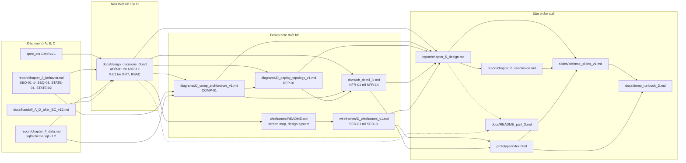

# Mục lục phần việc của Person D — Chương 5 và Chương 6

**Người phụ trách:** D — System & UI Designer kiêm Demo Lead
**Phạm vi:** toàn bộ deliverable D1…D10 theo `04_person_D_design.md` mục 1
**Ngày lập mục lục:** 16/08/2026
**Cách dùng file này:** đọc mục 1 để nắm phần việc, mục 2 để biết file nào ở đâu, mục 3 để chọn lộ trình
đọc phù hợp với vai trò của người đọc. Mục 5 là bảng tự chấm trung thực, mục 6 liệt kê việc còn treo.

---

## 1. Tóm tắt phần việc của D

D phụ trách hai chương cuối của báo cáo cùng vai trò điều phối buổi bảo vệ. **Chương 5 — Thiết kế hệ
thống** trả lời câu hỏi "hệ thống được xây dựng như thế nào": kiến trúc logic gồm 24 component
`C01`–`C24` chạy trong ba tiến trình `ats-api`, `ats-worker`, `ats-reporting` (sơ đồ COMP-01); kiến
trúc triển khai gồm 14 node `N01`–`N14` kèm giao thức và cổng trên từng kết nối (sơ đồ DEP-01); thiết
kế giao diện gồm 11 màn hình `SCR-01`–`SCR-11` với bản đồ màn hình, ba user flow và một hệ thống thiết
kế dùng chung; và mười bốn yêu cầu phi chức năng `NFR-01`–`NFR-14`, mỗi mã được khai triển thành ngưỡng
định lượng, cách đo bằng công cụ cụ thể, cơ chế thiết kế bảo đảm và phương án dự phòng. **Chương 6 —
Kết luận** tổng kết kết quả đạt được, nêu hạn chế và hướng phát triển. Ngoài phần viết, D còn chịu trách
nhiệm ba sản phẩm phục vụ buổi bảo vệ: bộ slide, prototype click-through chạy offline, và kịch bản demo.
Toàn bộ quyết định kiến trúc được ghi lại dưới dạng mười hai ADR, kèm sổ mâu thuẫn bảy điểm `X-01`–`X-07`
mà D phát hiện giữa tài liệu của A và tài liệu của B/C — theo nguyên tắc D không tự quyết mà chỉ đề xuất
phương án kèm chi phí sửa, chờ nhóm chốt ở Sync S4.

Với vai trò **Demo Lead**, D còn giữ phần việc không thuộc chương nào: chốt template slide chung cho cả
nhóm, tổ chức buổi dry run S6, đo thời lượng trình bày, phân công ai trả lời câu hỏi nào, và chuẩn bị
các lớp dự phòng cho buổi bảo vệ theo `04_person_D_design.md` mục 10.

---

## 2. Bảng deliverable

Mã D1…D8 lấy nguyên theo `04_person_D_design.md` mục 1. Ba dòng D5b, D9, D11 là file bổ sung mà D tạo
thêm trong quá trình làm để phần việc tự truy vết được; D10 là kịch bản demo phát sinh từ vai trò Demo
Lead. Cột trạng thái phản ánh đúng thời điểm lập mục lục: mọi đường dẫn trong bảng đã được kiểm là có
thật trên đĩa, và "đã có bản viết" không đồng nghĩa với Done — theo `00_README.md` mục 9 thì còn thiếu
bước review chéo, xem mục 5.6 của tài liệu này.

| Mã | Deliverable | Đường dẫn file | Mô tả | Trạng thái |
|---|---|---|---|---|
| D1 | Chương 5 — Thiết kế hệ thống | `report/chapter_5_design.md` | Chính văn Chương 5, tổng hợp COMP-01, DEP-01, thiết kế giao diện, NFR và sổ mâu thuẫn thành một mạch trình bày liên tục. | Đã có bản viết, chưa review chéo |
| D2 | Chương 6 — Kết luận, hạn chế, hướng phát triển | `report/chapter_6_conclusion.md` | Chính văn Chương 6: kết quả đạt được so với mục tiêu, những gì chưa làm được, hướng mở rộng. | Đã có bản viết, chưa review chéo |
| D3 | Component Diagram — COMP-01 | `diagrams/D_comp_architecture_v1.md` | 24 component, 19 hợp đồng interface/port, ba bảng đối chiếu chéo với lifeline của B và bảng dữ liệu của C. | Đã có bản viết, chưa review chéo |
| D4 | Deployment Diagram — DEP-01 | `diagrams/D_deploy_topology_v1.md` | 14 node vật lý, ma trận kết nối kèm giao thức và cổng, chiến lược mở rộng, quy trình sao lưu và khôi phục. | Đã có bản viết, chưa review chéo |
| D5 | Bộ wireframe 11 màn hình | `wireframes/D_wireframes_v1.md` | Wireframe dạng ASCII cho `SCR-01`…`SCR-11`, mỗi màn kèm các trạng thái bắt buộc, quy tắc phân quyền và mã UC phục vụ. | Đã có bản viết, chưa review chéo |
| D5b | Bản đồ màn hình và hệ thống thiết kế | `wireframes/README.md` | Site map, ba user flow, hai bảng đối chiếu use case với màn hình, bảng màu, thang chữ, thư viện thành phần, checklist tiếp cận. | Đã có bản viết, chưa review chéo |
| D6 | Đặc tả chi tiết NFR | `docs/nfr_detail_D.md` | `NFR-01`…`NFR-14`, mỗi mã đủ năm mục: phát biểu, chỉ số và ngưỡng, cách đo, cơ chế thiết kế, rủi ro và dự phòng. | Đã có bản viết, chưa review chéo |
| D7 | Slide bảo vệ | `slides/defense_slides_v1.md` | Bộ slide cho cả nhóm theo phân bổ ở `04_person_D_design.md` mục 3, gồm phần Chương 5, phần demo và phần kết luận. | Đã có bản viết, chưa dry run, chưa xuất PDF |
| D8 | Prototype click-through | `prototype/index.html` | Bản mô phỏng 11 màn trong đúng một tệp HTML, không thư viện ngoài, không máy chủ, chạy được khi không có mạng. | Đã có bản chạy được, chưa đo bằng axe-core và Lighthouse |
| D9 | Nhật ký quyết định thiết kế và sổ mâu thuẫn | `docs/design_decisions_D.md` | `ADR-01`…`ADR-12`, sổ mâu thuẫn `X-01`…`X-07`, chín đề xuất D gửi C, ma trận RBAC, bảng ánh xạ tên ba tầng. | Đã có bản viết, chưa review chéo |
| D10 | Kịch bản demo và runbook | `docs/demo_runbook_D.md` | Kịch bản bấm demo, agenda dry run S6, phân công trả lời Q&A, checklist máy trình chiếu. | Đã có bản viết, chưa chạy thử tại dry run |
| D11 | Mục lục phần việc của D | `docs/README_part_D.md` | Chính là tài liệu này: điểm vào duy nhất cho toàn bộ phần việc của D. | Đã có bản viết |
| D12 | Bàn giao ngược cho A, B, C | `docs/handoff_D_to_ABC_v1.md` | 10 quyết định cần chốt ở Sync S4, 11 việc gửi A, 12 việc gửi B, 9 đề xuất schema và 6 index gửi C, cùng các dòng soạn sẵn cho `docs/change_log.md`. **A, B, C đọc tệp này để biết cần sửa gì.** | Đã có bản viết, chờ Sync S4 |
| D13 | Ma trận truy vết | `docs/traceability_matrix_D.md` | Truy vết từ yêu cầu của A qua hành vi của B và dữ liệu của C tới thiết kế của D, kèm bảng đếm số liệu chốt để mọi con số trích trong Chương 5–6 đều kiểm được. | Đã có bản viết, chưa review chéo |

Hai file đầu vào mà D nhận từ người khác và phụ thuộc chặt vào, tuy không phải deliverable của D nhưng
cần biết khi truy nguồn: `docs/handoff_A_D_after_BC_v12.md` là ràng buộc A gửi D sau khi B và C chốt
phiên bản v1.2, còn `docs/change_log.md` là nơi ghi nhận mọi thay đổi liên chương của cả nhóm.

Ngoài mười bốn dòng trên, D còn tạo các tệp phụ trợ sau. `scripts/render_mermaid_D.py` kết xuất mọi khối
Mermaid trong tài liệu của B, C và D thành ảnh PNG, và `scripts/md_to_docx_D.py` chuyển bản Markdown sang
định dạng Word để ghép vào báo cáo chung — hai kịch bản này là công cụ, không phải nội dung báo cáo. Thư
mục `diagrams/rendered/` chứa kết quả kết xuất của kịch bản thứ nhất, dùng khi cần chèn hình vào slide
hoặc vào bản Word; đây là đầu ra sinh tự động nên khi tệp Markdown nguồn đổi thì phải chạy lại kịch bản
chứ không sửa tay vào ảnh. `sql/seed_demo_D.sql` là bộ dữ liệu mẫu VXTech dùng chung cho wireframe,
prototype và mọi ảnh chụp màn hình; nó chỉ chèn dữ liệu vào lược đồ v1.2 của C, không sửa lược đồ.
`prototype/capture_screenshots.sh` chụp lại toàn bộ 20 ảnh trong `prototype/screenshots/` bằng Chrome
headless; thư mục đó còn có `README.md` mô tả từng ảnh và cách chụp lại. Cuối cùng, `docs/chapter_5_6_D.docx`
(Chương 5 và Chương 6) và `docs/phu_luc_D.docx` (ba phụ lục: NFR, quyết định thiết kế, ma trận truy vết)
là hai bản Word xuất bằng `scripts/md_to_docx_D.py` để ghép vào báo cáo chung — cũng là đầu ra sinh tự
động, phải xuất lại khi bản Markdown nguồn đổi.

---

## 3. Thứ tự đọc đề xuất

Ba lộ trình dưới đây phục vụ ba loại người đọc khác nhau. Không lộ trình nào yêu cầu đọc hết tất cả các
file, vì tổng dung lượng phần việc của D vượt quá mức đọc một lượt.

### 3.1. Lộ trình A — người chấm muốn nắm nhanh trong mười phút

| Thứ tự | File và mục | Thời lượng | Lý do đọc mục này trước |
|---|---|---|---|
| 1 | `diagrams/D_comp_architecture_v1.md` mục 1 — Hình 5.1 | ~3 phút | Một hình duy nhất cho thấy toàn bộ hệ thống gồm những khối gì và chúng nói chuyện với nhau bằng giao thức nào; phần đầu file có sẵn bốn dòng tự đối chiếu tiêu chí Done. |
| 2 | `diagrams/D_deploy_topology_v1.md` mục 2 — Hình 5.10 | ~2 phút | Trả lời ngay câu hỏi hay bị hỏi nhất là "chạy trên máy nào, bao nhiêu instance"; mục 1 của file giải thích vì sao sơ đồ này không phải bản sao của sơ đồ trước. |
| 3 | `wireframes/README.md` mục 2 — Hình 5.20 bản đồ màn hình | ~2 phút | Thấy 11 màn hình được tổ chức thành hai nhánh tách biệt là nội bộ và ứng viên, không có cạnh nối nhau — đây là bằng chứng trực quan cho yêu cầu quyền riêng tư. |
| 4 | `docs/nfr_detail_D.md` mục 1 — Bảng 5.30 | ~2 phút | Một bảng gói đủ 14 NFR kèm ngưỡng cốt lõi, cơ chế chính và cách đo; nếu cần kiểm chứng sâu thì nhảy thẳng tới mục của mã tương ứng. |
| 5 | `prototype/index.html` | ~1 phút | Nhấp đúp để mở, đi ba màn `SCR-03` rồi `SCR-05` rồi `SCR-07`, thấy ngay thiết kế giao diện không dừng ở mức hình vẽ. |

### 3.2. Lộ trình B — thành viên A, B, C cần review chéo

Lộ trình này bám đúng checklist "Khi review Chương 5" ở `06_conventions_shared.md` mục 5, và bám phân
công review chéo ở mục 4 của cùng tài liệu, trong đó B rà component so với lifeline còn C rà phần dữ liệu.

| Thứ tự | File và mục | Người nên đọc | Lý do đọc mục này |
|---|---|---|---|
| 1 | `docs/design_decisions_D.md` mục 3 — sổ mâu thuẫn `X-01`…`X-07` | A, B, C | Bảy điểm này là chỗ tài liệu của A và tài liệu của B/C đang nói khác nhau; D chỉ đề xuất chứ không tự quyết, nên đây là phần cần kết luận trước mọi phần khác. |
| 2 | `diagrams/D_comp_architecture_v1.md` mục 5.1 — đối chiếu lifeline với component | B | Bảng đối chiếu từng lifeline trong `SEQ-01`, `SEQ-02`, `SEQ-03` sang component của D; B xác nhận không có lifeline nào bị đặt tên lệch hoặc bị bỏ sót. |
| 3 | `diagrams/D_comp_architecture_v1.md` mục 5.2 — quyền ghi bảng | C | Bảng gán mỗi component với đúng những bảng nó được phép ghi; C xác nhận không có tên bảng hoặc tên cột nào bị bịa. |
| 4 | `docs/design_decisions_D.md` mục 4 — chín đề xuất D gửi C | C | Danh sách đề xuất bổ sung enum, cột, bảng và index kèm mức ưu tiên P0 đến P2; C quyết định chấp nhận hay bác từng dòng, vì D không được tự sửa `sql/schema.sql`. |
| 5 | `wireframes/README.md` mục 4 — bảng đối chiếu use case sang màn hình | A | Kiểm tra tiêu chí "mỗi UC có ít nhất một wireframe phục vụ"; mục 5 ngay sau đó là bảng ngược, dùng để phát hiện màn hình thừa. |
| 6 | `docs/nfr_detail_D.md` mục về `NFR-13` và `NFR-14` | A | Hai mã này do D bổ sung ngoài dải `NFR-01`…`NFR-12` mà A đã phát hành; A cần xác nhận trước khi hai mã được coi là chính thức. |

### 3.3. Lộ trình C — người sẽ trình bày slide

| Thứ tự | File và mục | Lý do đọc mục này |
|---|---|---|
| 1 | `slides/defense_slides_v1.md` | Đọc hết một lượt trước tiên để biết mình sẽ nói những gì và theo thứ tự nào. |
| 2 | `docs/demo_runbook_D.md` | Kịch bản bấm demo theo từng bước, thời lượng từng phần và phân công trả lời Q&A. |
| 3 | `wireframes/README.md` mục 11.3 — ánh xạ nội dung sang slide | Bảng chỉ rõ slide nào lấy hình nào, kèm ghi chú nên nhấn vào chi tiết gì khi trình bày và hai slide dự phòng chỉ chiếu khi bị hỏi. |
| 4 | `diagrams/D_comp_architecture_v1.md` mục 8 và `diagrams/D_deploy_topology_v1.md` mục 10 | Mười câu hỏi bảo vệ dự kiến về kiến trúc kèm câu trả lời đã soạn sẵn; đây là phần cần thuộc chứ không phải phần cần đọc lại lúc bị hỏi. |
| 5 | `prototype/index.html` | Bấm thử đúng lộ trình demo ít nhất hai lần trên chính máy sẽ dùng để trình chiếu, không phải trên máy đã soạn slide. |
| 6 | `report/chapter_6_conclusion.md` | Phần hạn chế của Chương 6 là nơi lấy câu trả lời trung thực cho những câu hỏi về điểm yếu của thiết kế. |

---

## 4. Bản đồ quan hệ giữa các file của D

Sơ đồ dưới đây cho thấy file nào là nguồn của file nào. Ba khối bên trái là đầu vào D nhận từ A, B, C;
khối `docs/design_decisions_D.md` đứng ở vị trí trung tâm vì mọi mã `ADR` và `X` được viện dẫn ở các file
sau đều lấy từ đó; bốn deliverable thiết kế ở giữa hội tụ vào Chương 5, rồi Chương 5 và prototype nuôi
tiếp slide và kịch bản demo.

Ba quy tắc rút ra từ sơ đồ, cần nhớ khi sửa bất kỳ file nào của D. Thứ nhất, sửa `docs/design_decisions_D.md`
thì phải rà lại toàn bộ nhánh phía sau, vì đó là gốc của mọi mã `ADR` và `X`. Thứ hai, `wireframes/README.md`
đứng trước `wireframes/D_wireframes_v1.md` chứ không phải ngược lại, vì bảng màu, thang chữ và thư viện
thành phần được chốt ở file trước rồi mới áp vào từng màn ở file sau. Thứ ba, `prototype/index.html`
là hiện thực hoá của bộ wireframe chứ không phải một thiết kế độc lập, nên khi bộ wireframe đổi thì
prototype phải đổi theo, không được để hai bên lệch nhau lúc demo.

---

## 5. Bảng đối chiếu tiêu chí Done của D

Năm bảng dưới đây chép nguyên các checklist ở `04_person_D_design.md` mục 6 và tự chấm từng mục. Bằng
chứng luôn trỏ tới file kèm số mục để người review kiểm được ngay mà không phải tìm. Nguyên tắc chấm là
trung thực: mục nào chưa kiểm chứng được thì ghi chưa kiểm chứng, không ghi là đạt.

### 5.1. Component Diagram

| # | Tiêu chí theo `04_person_D_design.md` mục 6 | Kết quả | Bằng chứng |
|---|---|---|---|
| 1 | Có ≥10 component | Đạt | 24 component `C01`–`C24` liệt kê ở `diagrams/D_comp_architecture_v1.md` mục 3, tự đối chiếu tại mục 7 Bảng 5.20 dòng 1 |
| 2 | Có ≥1 hệ thống ngoài | Đạt | Ba hệ thống ngoài `IdentityProvider`, `EmailGateway`, `CalendarProvider` trong subgraph tương ứng của Hình 5.1, mục 1 cùng file |
| 3 | Interface/port thể hiện rõ, không chỉ là các khối đứng cạnh nhau | Đạt | 19 hợp đồng có bên cung cấp, bên tiêu thụ và chữ ký thao tác tại mục 4 Bảng 5.22; ký hiệu provided/required vẽ riêng cho cụm Offer tại mục 2 Hình 5.9 |
| 4 | Có ghi chú protocol trên connector nếu khác nhau | Đạt | Tám kiểu nhãn trên cạnh của Hình 5.1 gồm `REST/HTTPS`, `in-process call`, `SQL`, `Redis RESP`, `S3 API`, `SMTP/HTTPS`, `OIDC`, `domain event`; nét đứt dành cho luồng bất đồng bộ |

### 5.2. Deployment Diagram

| # | Tiêu chí theo `04_person_D_design.md` mục 6 | Kết quả | Bằng chứng |
|---|---|---|---|
| 1 | Có ≥5 node vật lý | Đạt | 14 node `N01`–`N14` tại `diagrams/D_deploy_topology_v1.md` mục 3, tự đối chiếu tại mục 9 Bảng 5.18 |
| 2 | Có node "Client" | Đạt | `N01 ClientWorkstation` cho sáu vai trò nội bộ và `N02 CandidateDevice` cho ứng viên, đặt trong subgraph vùng người dùng của Hình 5.10 |
| 3 | Có load balancer nếu app server >1 instance | Đạt | `N04` chạy hai instance nên `N03 EdgeNode` đảm nhiệm cân bằng tải; lý do không cần sticky session giải thích ở mục 5.1 |
| 4 | Protocol ghi rõ trên connection | Đạt | Ma trận kết nối tại mục 4 ghi giao thức, số hiệu cổng, mã hoá, mục đích và chiều khởi tạo cho từng cặp node |
| 5 | Có ghi chú về scaling | Đạt | Số instance và chính sách nhân bản nằm ngay trên nhãn node của Hình 5.10, chi tiết ở mục 5.1 đến 5.4 |

### 5.3. Wireframe

| # | Tiêu chí theo `04_person_D_design.md` mục 6 | Kết quả | Bằng chứng |
|---|---|---|---|
| 1 | Mỗi màn có tên rõ, mapping với UC nào | Đạt | Danh mục 11 màn kèm cột UC tại `wireframes/D_wireframes_v1.md` mục 1; bảng đối chiếu hai chiều tại `wireframes/README.md` mục 4 và mục 5 |
| 2 | Low-fi cho phần chưa chốt, mid hoặc high-fi cho phần quan trọng | Đạt | Phân bổ hai màn low-fi, bốn màn mid-fi, năm màn high-fi giải thích tại `wireframes/D_wireframes_v1.md` mục 0.3; `SCR-11` giữ mức low-fi vì chức năng F09 chưa có đặc tả use case |
| 3 | Có ít nhất 3 màn có "state" khác nhau | Vượt yêu cầu | Cả 11 màn đều có từ hai trạng thái trở lên, tổng 25 khối wireframe; `SCR-05`, `SCR-07`, `SCR-09` mỗi màn ba trạng thái — xem mục 15 Bảng 5.74 dòng 4 |
| 4 | Không có Lorem Ipsum thô, thay bằng dữ liệu mẫu có ý nghĩa | Đạt kèm một khác biệt đã ghi nhận | Kịch bản dữ liệu mẫu của công ty giả định VXTech tại mục 2; **khác biệt**: miền email dùng `@vxtech.vn` thay cho gợi ý `@cmc.com.vn` trong `04_person_D_design.md`, lý do là tránh gắn tên một doanh nghiệp có thật vào ảnh chụp màn hình, đã nêu tại mục 15 |

### 5.4. NFR

| # | Tiêu chí theo `04_person_D_design.md` mục 6 | Kết quả | Bằng chứng |
|---|---|---|---|
| 1 | Mỗi NFR có ≥1 số liệu định lượng | Đạt | Cả 14 mã đều có ngưỡng số tại `docs/nfr_detail_D.md` mục 1 Bảng 5.30, khai triển ở tiểu mục "Chỉ số và ngưỡng" của từng mã |
| 2 | Có ≥1 cách đo cho mỗi NFR | Đạt | Tiểu mục "Cách đo" của từng mã nêu công cụ và kịch bản cụ thể, ví dụ k6 50 VU trong 5 phút cho `NFR-01`, mock server đếm idempotency key cho `NFR-11`, axe-core và Lighthouse trên prototype cho `NFR-14` |
| 3 | *Điểm còn treo:* hai mã `NFR-13` và `NFR-14` do D bổ sung | **Chưa đạt** | Hai mã được đánh dấu "cần A xác nhận" ngay trong Bảng 5.30; chừng nào A chưa ký thì chúng chưa thuộc dải NFR chính thức |
| 4 | *Điểm còn treo:* cách quy đổi `NFR-03` sang ngân sách downtime | **Chưa đạt** | `diagrams/D_deploy_topology_v1.md` mục 10 câu 4 ghi rõ chênh lệch giữa con số 13 phút mỗi tháng và con số khoảng 132 phút tính theo 99% giờ hành chính; điểm này nằm ở dòng 1 Bảng 5.19 chờ A kết luận |

### 5.5. Slide

| # | Tiêu chí theo `04_person_D_design.md` mục 6 | Kết quả | Ghi chú |
|---|---|---|---|
| 1 | Không có slide chỉ có text đặc, tối đa 5 gạch đầu dòng | **Chưa kiểm chứng** | File `slides/defense_slides_v1.md` đã tồn tại nhưng chưa được rà theo tiêu chí này; việc rà thuộc buổi dry run S6 |
| 2 | Diagram luôn có nguồn và số hiệu | **Chưa kiểm chứng** | Cần đối chiếu từng hình trên slide với số hiệu gốc trong Chương 3, 4, 5 và ghi tên người vẽ |
| 3 | Slide cuối có mục "Câu hỏi thường gặp", chuẩn bị trước 3–5 câu | **Chưa kiểm chứng** | Nguyên liệu đã sẵn: mười câu hỏi bảo vệ kèm trả lời tại `diagrams/D_comp_architecture_v1.md` mục 8 và `diagrams/D_deploy_topology_v1.md` mục 10, cùng danh sách câu hỏi chung ở `06_conventions_shared.md` mục 6 |

### 5.6. Tiêu chí Done cấp nhóm

Ngoài năm checklist theo deliverable, `00_README.md` mục 9 đặt thêm bốn điều kiện cho mọi task, và
`06_conventions_shared.md` mục 4 quy định rõ không có review chéo thì không được tính Done.

| # | Điều kiện | Kết quả | Bằng chứng |
|---|---|---|---|
| 1 | Có deliverable file cụ thể | Đạt | Cả mười bốn dòng ở bảng mục 2 đều đã có file trên đĩa |
| 2 | Được một người khác trong nhóm review | **Chưa đạt** | Chưa có buổi review chéo nào cho phần việc của D; theo `06_conventions_shared.md` mục 4 thì B rà component so với lifeline và C rà phần dữ liệu |
| 3 | Đã chỉnh sửa theo comment của người review | **Chưa đạt** | Hệ quả trực tiếp của điều kiện 2 |
| 4 | Ghi vào `docs/change_log.md` ai làm, ngày xong, ai review | **Chưa đạt** | `docs/change_log.md` hiện không có dòng nào của D. Các dòng đề nghị ghi đã được soạn sẵn ở **hai nơi, không trùng nhau**: `docs/handoff_D_to_ABC_v1.md` mục 8 khối 1 công bố phát hành D1…D10 và ma trận truy vết, khối 2 là các đề nghị gửi A/B/C; `docs/design_decisions_D.md` mục 8 là bảy dòng về ADR, sổ mâu thuẫn và NFR. Chép cả hai nơi sau khi nhóm chốt, tránh dán trùng |

---

## 6. Việc còn lại của D theo timeline

Bám `05_timeline_milestones.md` tuần 4 và tuần 5, cùng `04_person_D_design.md` mục 3 và mục 10. Mười
việc dưới đây đều **cần người thật thực hiện** — không việc nào hoàn thành được bằng cách viết thêm tài
liệu, vì tất cả đều đòi hỏi một buổi họp, một cái máy tính cụ thể, một buổi tập hoặc một chữ ký xác
nhận. Hai việc có phần đã được kịch bản hoá (xuất Word bằng `scripts/md_to_docx_D.py`, chụp ảnh bằng
`prototype/capture_screenshots.sh`) thì phần còn lại — ghép, đọc rà và chèn vào slide — vẫn là việc tay.

| # | Việc còn lại | Mốc theo timeline | Vì sao không thể tự động hoá |
|---|---|---|---|
| 1 | Tổ chức review chéo Chương 5 với B và C, thu comment và sửa | Cuối tuần 3, Sync S4 — hiện đã quá hạn | Cần B và C thực sự đọc và ký xác nhận; đây là điều kiện bắt buộc để tính Done |
| 2 | Chốt bảy mâu thuẫn `X-01`…`X-07` và chín đề xuất D gửi C | Sync S4, chi tiết ở `docs/design_decisions_D.md` mục 7 | D chỉ được đề xuất; quyền sửa `sql/schema.sql` thuộc C, quyền sửa mã BR thuộc A |
| 3 | Chép các dòng đề nghị vào `docs/change_log.md` sau khi chốt | Ngay sau Sync S4 | File change log là tài sản chung, chỉ được ghi khi đã có kết luận thật |
| 4 | Ghép `docs/chapter_5_6_D.docx` và `docs/phu_luc_D.docx` (đã xuất sẵn bằng `scripts/md_to_docx_D.py`) vào báo cáo chung, chèn ảnh từ `diagrams/rendered/` vào các khung giữ chỗ rồi đọc rà định dạng một lượt từ đầu đến cuối | Sync S5 giữa tuần 4 | Việc ghép và đọc rà toàn báo cáo là việc của cả nhóm; định dạng sau khi chuyển đổi phải được người thật kiểm bằng mắt |
| 5 | Chèn 20 ảnh ở `prototype/screenshots/` vào slide 25–27 theo bảng danh mục của `prototype/screenshots/README.md`, cắt bớt khoảng trắng ở đáy các ảnh chạm sàn 900 px | Ngày 30 của tuần 5 | Ảnh đã chụp sẵn bằng `prototype/capture_screenshots.sh`, nhưng việc chọn ảnh nào cho slide nào và cắt cúp cho cân bố cục phải do người thật quyết |
| 6 | Xuất bản PDF dự phòng của bộ slide | Ngày 31 của tuần 5, theo `04_person_D_design.md` mục 10 | Bản PDF là lớp dự phòng khi phần mềm trình chiếu lỗi hoặc font bị lệch |
| 7 | Tổ chức dry run S6 cho cả nhóm, bấm giờ từng phần, cắt phần dài | Ngày 32 của tuần 5 | Là một buổi tập có mặt đủ bốn người; mục tiêu là khoảng 5 phút mỗi người, tổng 20 đến 25 phút trình bày cộng 10 phút hỏi đáp |
| 8 | Test slide hai lần trên đúng máy sẽ dùng để trình chiếu | Ngày 33 của tuần 5 | Font và bố cục thường lệch giữa máy soạn và máy trình chiếu; chỉ phát hiện được khi mở trên chính máy đó |
| 9 | Quay video dự phòng phần demo prototype | Ngày 34 của tuần 5 | Video là lớp dự phòng cuối cùng khi máy hoặc trình duyệt gặp sự cố ngay tại phòng bảo vệ |
| 10 | Đo `NFR-14` bằng axe-core và Lighthouse trên prototype, ghi lại số liệu | Trước buổi bảo vệ | Hiện `docs/nfr_detail_D.md` mới nêu cách đo, chưa có kết quả đo thật; không được ghi số liệu chưa chạy |

Một ràng buộc cần nhớ từ đầu tuần 5 theo `05_timeline_milestones.md`: không thêm chức năng mới vào báo
cáo, không đổi kiến trúc, không đổi tên entity hoặc use case; từ thời điểm đó chỉ được sửa lỗi chính tả,
định dạng và câu chữ.

---

## 7. Cách chạy prototype

1. Mở thư mục `prototype/` rồi nhấp đúp vào `index.html` — trình duyệt tự mở, **không cần cài đặt gì,
   không cần chạy máy chủ, không cần biên dịch**.
2. Màn hình đầu tiên là `SCR-01`; bấm nút "Tiếp tục với Google Workspace" để vào ứng dụng, sau đó dùng ô
   "Vai trò" ở thanh trên để đổi vai và thanh điều hướng bên trái để đi qua 11 màn `SCR-01`…`SCR-11`.
3. Toàn bộ HTML, CSS và JavaScript nằm gọn trong đúng một tệp, không tải bất kỳ tài nguyên nào từ mạng —
   **rút dây mạng và tắt Wi-Fi thì prototype vẫn chạy đầy đủ**, đây chính là lý do ADR-12 chọn phương án
   này thay cho prototype dựng bằng Figma.

---

## 8. Từ khoá tra cứu nhanh

| Muốn tìm | Mở file | Vào mục |
|---|---|---|
| Vì sao chọn modular monolith thay vì microservices | `docs/design_decisions_D.md` | ADR-01 |
| CV nặng 10 MB được lưu ở đâu | `docs/design_decisions_D.md` và `diagrams/D_deploy_topology_v1.md` | ADR-04; mục 10 câu 2 |
| Redis được dùng làm gì trong hệ thống | `docs/design_decisions_D.md` và `diagrams/D_comp_architecture_v1.md` | ADR-03; component `C24 LockManager` ở mục 3 |
| Cơ chế chống trùng lịch phỏng vấn theo BR-03 | `docs/nfr_detail_D.md` | `NFR-02`, tiểu mục "Cơ chế thiết kế để đạt được" |
| Danh sách đầy đủ 24 component kèm trách nhiệm | `diagrams/D_comp_architecture_v1.md` | mục 3 |
| Mỗi lifeline trong sequence của B ứng với component nào | `diagrams/D_comp_architecture_v1.md` | mục 5.1 |
| Component nào được phép ghi vào bảng nào của C | `diagrams/D_comp_architecture_v1.md` | mục 5.2 |
| Node, cổng và giao thức của từng kết nối | `diagrams/D_deploy_topology_v1.md` | mục 3 và mục 4 |
| Chiến lược mở rộng, ước lượng năng lực chịu tải | `diagrams/D_deploy_topology_v1.md` | mục 5 |
| Sao lưu, RPO, RTO, quy trình khôi phục | `diagrams/D_deploy_topology_v1.md` | mục 6 |
| Ngưỡng và cách đo của một NFR cụ thể | `docs/nfr_detail_D.md` | mục 1 Bảng 5.30 để tra nhanh, rồi tới mục của mã đó |
| Ma trận phân quyền của sáu vai trò nội bộ | `docs/design_decisions_D.md` | mục 5 |
| Vì sao vai trò duyệt tài chính có ba tên khác nhau | `docs/design_decisions_D.md` | mâu thuẫn X-06 ở mục 3; bảng ánh xạ ba tầng ở mục 6 |
| Những chỗ tài liệu của A và của B/C nói khác nhau | `docs/design_decisions_D.md` | mục 3, `X-01`…`X-07` |
| Đề xuất D gửi C về enum, cột, bảng và index | `docs/design_decisions_D.md` | mục 4 |
| Wireframe của một màn hình cụ thể | `wireframes/D_wireframes_v1.md` | mục tương ứng với mã `SCR-xx` |
| Use case nào được màn hình nào phục vụ | `wireframes/README.md` | mục 4 xuôi, mục 5 ngược |
| Bảng màu, thang chữ, thang khoảng cách | `wireframes/README.md` | mục 6 |
| Nhãn tiếng Việt của các giá trị `application_status` | `wireframes/README.md` | mục 6.6 |
| Nhãn tiếng Việt của các giá trị `offer_status` | `wireframes/README.md` | mục 6.7 |
| Wireframe có tiếp cận được cho người khuyết tật không | `wireframes/README.md` và `wireframes/D_wireframes_v1.md` | mục 10; mục 16 |
| Dữ liệu mẫu của công ty giả định VXTech | `wireframes/D_wireframes_v1.md` | mục 2 |
| Câu trả lời sẵn cho câu hỏi bảo vệ về kiến trúc | `diagrams/D_comp_architecture_v1.md` và `diagrams/D_deploy_topology_v1.md` | mục 8; mục 10 |
| Chính văn Chương 5 | `report/chapter_5_design.md` | toàn bộ file |
| Hạn chế và hướng phát triển | `report/chapter_6_conclusion.md` | phần hạn chế |
| Kịch bản demo, agenda dry run, phân công Q&A | `docs/demo_runbook_D.md` | toàn bộ file |
| Ảnh PNG của các sơ đồ để chèn vào slide hoặc bản Word | `diagrams/rendered/` | tệp có tiền tố `d-` cho sơ đồ của D |
