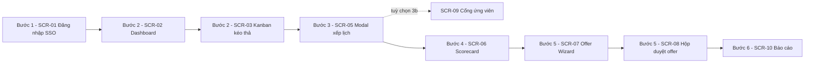

# Sổ tay vận hành buổi bảo vệ — Demo Runbook (D10)

> **Chủ sở hữu:** Person D — System & UI Designer + Demo Lead
> **Phiên bản:** v1.0 · **Phạm vi:** tuần 5 của `05_timeline_milestones.md` (Sync S6 → ngày bảo vệ)
> **Deliverable liên quan:** D7 `slides/defense_slides_v1.md`, D8 `prototype/index.html`,
> D1 `report/chapter_5_design.md`, D2 `report/chapter_6_conclusion.md`
> **Quy ước đánh số:** để không đụng dãy số của chính văn Chương 6, toàn bộ hình và bảng trong
> phụ lục này được đánh số **từ 6.20 trở đi** (Hình 6.20–6.21, Bảng 6.20–6.31), theo đúng cách bộ
> wireframe đã dùng dãy 5.60–5.85.

---

## 1. Mục đích và cách dùng file

Ba tài liệu của D phục vụ ba việc khác nhau và không thay thế nhau. `report/chapter_5_design.md` và
`report/chapter_6_conclusion.md` là bài nộp; `slides/defense_slides_v1.md` là thứ hội đồng nhìn;
còn file này là thứ **chỉ nhóm đọc** — nó trả lời câu hỏi "phút thứ mấy ai làm gì, và nếu hỏng thì
xử lý ra sao". Mọi con số thời lượng, thứ tự thao tác và phân công trả lời câu hỏi trong buổi bảo vệ
đều lấy file này làm nguồn chốt; khi số liệu ở đây lệch với trí nhớ của bất kỳ ai, file này đúng.

Ba nhóm người đọc và thời điểm đọc:

- **Cả nhóm A, B, C, D** — đọc **trọn vẹn một lần** trước Sync S6 (ngày 32 theo timeline), để vào
  buổi dry-run là đã biết mình có bao nhiêu phút và giữ những slide nào. Đọc lại **mục 5 và mục 6**
  vào tối trước ngày bảo vệ.
- **Người demo (D)** — đọc **mục 2** cho tới khi thuộc thứ tự sáu bước mà không cần nhìn giấy, và
  chạy **mục 7** đúng ba mốc thời gian đã ghi.
- **Người giữ đồng hồ** — mặc định là D; trong 4 phút 30 giây demo thì đồng hồ được chuyển tạm cho
  A, vì một người không thể vừa thao tác chuột vừa canh giờ. Người giữ đồng hồ chỉ cần **mục 4**.

Một quy ước bắt buộc kèm theo: từ đầu tuần 5, `05_timeline_milestones.md` đã áp luật *no surprise
before defense* — không thêm chức năng, không đổi kiến trúc, không đổi tên thực thể. Runbook này
được viết theo đúng tinh thần đó, nghĩa là mọi thứ trong kịch bản demo đều là thao tác **đã tồn tại**
trong `prototype/index.html`, không có thao tác nào cần viết thêm mã.

---

## 2. Kịch bản demo chi tiết

### 2.1. Nguyên tắc dựng kịch bản

Kịch bản đi theo đúng **một dòng đời hồ sơ**: một ứng viên duy nhất là Hoàng Thị Mai Chi đi từ lúc
được sàng lọc tới lúc số liệu của cô xuất hiện trong báo cáo. Cách kể này khiến sáu bước dính vào
nhau thành một câu chuyện thay vì sáu màn hình rời, và mỗi bước chứng minh đúng một use case, đúng
thứ tự UC-02 → UC-01 → UC-03 → UC-04 → UC-05 của Chương 6. Bước đầu tiên không thuộc use case nào mà
dựng bối cảnh xác thực và phân quyền, vì đó là tiền đề của cả năm use case còn lại.

Hình 6.21 vẽ đường đi màn hình của kịch bản. Cần chú ý ba màn hình được thăm bằng cách đổi vai trò
trên thanh trên chứ không phải bằng menu bên trái, vì menu bị lọc theo ma trận RBAC: `SCR-06` chỉ
nhập được khi đang là Interviewer, `SCR-07` chỉ Recruiter thấy, còn ba nút quyết định của `SCR-08`
chỉ bật cho đúng người đang giữ cấp duyệt hiện tại.

**Hình 6.21 — Đường đi màn hình của kịch bản demo sáu bước**

Tổng thời lượng phần bắt buộc là **4 phút 30 giây**; kèm bước tuỳ chọn 3b là **4 phút 55 giây**. Ô
thời lượng trong Bảng 6.20 là ngân sách tối đa cho từng bước, không phải mục tiêu phải tiêu hết —
người demo về sớm ở bước nào thì phần dư dồn cho bước 3 và bước 5, là hai bước đắt giá nhất.

### 2.2. Bảng kịch bản

**Bảng 6.20 — Kịch bản demo sáu bước trên `prototype/index.html`**

| STT | Giây | Màn hình | Thao tác chính xác | Câu nói mẫu | UC / BR / NFR chứng minh | Nếu hỏng thì làm gì |
|---|---|---|---|---|---|---|
| 1 | 30 | `SCR-01` | Trang đã mở sẵn ở màn đăng nhập sau khi nhấn F5. Bấm **"Mô phỏng lỗi tài khoản không active"** — khối đỏ `AUTH` hiện ra. Ở ô **"Đăng nhập với vai trò"** chọn `Recruiter — Nguyễn Minh Anh`, bấm **"Tiếp tục với Google Workspace"**. | "Hệ thống dùng đăng nhập một lần qua OIDC với Google Workspace nội bộ. Một tài khoản đã bị vô hiệu hoá bị chặn ngay tại `AuthService` chứ không phải bị ẩn nút trên giao diện." | NFR-04, ADR-10, ADR-05; component C04 `AuthService` | Nếu ô chọn vai trò trống thì JavaScript chưa chạy: nhấn Ctrl+R một lần. Vẫn trống thì chuyển sang slide S26 (ảnh chụp `SCR-05`) và kể tiếp bằng ảnh. |
| 2 | 45 | `SCR-02` → `SCR-03` | Bấm **"Xem trạng thái trống"**, đọc một câu, bấm **"Nạp dữ liệu mẫu"** để quay lại. Vào menu trái **"JD & Pipeline"**. Kéo thẻ **Hoàng Thị Mai Chi** từ cột *Đang sàng lọc* sang cột **Đã shortlist**, chỉ vào thông báo nổi. Đổi ô vai trò trên thanh trên sang **Hiring Manager**: bảng kanban khoá kéo-thả và menu ngắn lại. Đổi về **Recruiter**. | "Màn hình trống là thứ hệ thống thật hiển thị trong ngày đầu vận hành nên chúng em vẫn thiết kế nó. Mỗi lần thẻ đổi cột là một chuyển trạng thái của `STATE-01`, sinh đồng thời một dòng `application_status_history` và một dòng `audit_logs`." | UC-02; BR-21, NFR-06, X-02 (cột `SHORTLISTED`) | Nếu kéo-thả không nhận (trackpad hoặc máy chiếu trễ), **không kéo lần hai**: chỉ tay vào cột đích, nói "thao tác này là kéo thả", rồi đi tiếp. Nội dung chứng minh không mất. |
| 3 | 60 | `SCR-05` | Bấm **"Xếp lịch phỏng vấn"** trên thanh tiêu đề. Giữ nguyên người phỏng vấn **Vũ Ngọc Lan** đã tích sẵn. Chọn khung **14:00 – 15:00**: dải đỏ hiện, kèm ba khung giờ trống gợi ý. Gõ vào ô lý do ba chữ — nút xác nhận vẫn khoá. Gõ đủ câu "Ứng viên chỉ rảnh khung này" — nút **vẫn khoá** vì còn thiếu điều kiện thứ hai. Tích ô **cam kết trách nhiệm** — nút mở. Bấm **"Xác nhận xếp lịch"**. | "Kiểm tra trùng lịch nằm trong cùng một vùng khoá phân tán với thao tác ghi, nên hai Recruiter đặt song song không tạo được lịch trùng. Ép xếp lịch vẫn được phép nhưng bắt buộc có lý do và lý do đó đi vào `audit_logs`." | UC-01; BR-03, BR-05, BR-26; NFR-02, ADR-03 (Redis lock), ADR-01 | Nếu nút xác nhận không mở: ô lý do cần tối thiểu 20 ký tự **và** ô cam kết trách nhiệm phải được tích — kiểm cả hai. Nếu modal không mở, bấm nút **"Xếp lịch"** nhỏ ngay trên thẻ kanban. |
| 3b | 25 | `SCR-09` | *(tuỳ chọn — cắt đầu tiên khi thiếu giờ)* Từ `SCR-01` bấm **"Vào cổng ứng viên"**. Bấm **"Xác nhận tham dự"**, rồi bấm **"Đề nghị mức khác"** và **"Gửi đề nghị"**. | "Ứng viên không phải là người dùng nội bộ: cổng này xác thực bằng liên kết mời có hạn, không dùng SSO và không có hàng thông báo trong ứng dụng." | UC-01 (xác nhận lịch), UC-06; BR-05, ADR-09 | Cắt bỏ hoàn toàn nếu đồng hồ đã vượt mốc 2 phút 30 giây tại thời điểm kết thúc bước 3. |
| 4 | 45 | `SCR-06` | Đổi vai trò sang **Interviewer** (Vũ Ngọc Lan). Chấm 5 tiêu chí bằng cách bấm các nút thang 1–5, nhưng **cố ý bỏ trống một ô nhận xét**: khối cảnh báo đếm đúng số điểm và số nhận xét còn thiếu, nút **"Submit feedback"** vẫn khoá. Gõ nốt nhận xét, điểm trung bình cập nhật tức thời, bấm **"Submit feedback"**. | "Quy tắc bắt buộc nhận xét bằng lời cho từng tiêu chí được chặn ngay trên biểu mẫu chứ không chờ tới lúc gửi. Sau khi gửi, feedback còn sửa được trong 24 giờ rồi khoá vĩnh viễn." | UC-03; BR-15, BR-07, BR-06; NFR-06 | Nếu ô nhập bị mờ thì vai trò chưa phải Interviewer — đổi lại ô vai trò. Nếu scorecard đã ở trạng thái đã gửi từ lần chạy thử, bấm **"Đặt lại để trình diễn tiếp"**. |
| 5 | 60 | `SCR-07` → `SCR-08` | Đổi vai trò về **Recruiter**, vào menu **"Tạo offer"**. Ở khối *Thử nhanh khi trình diễn* bấm lần lượt **45.000.000**, **56.000.000**, rồi **51.840.000**: chuỗi duyệt đổi từ 1 cấp sang 3 cấp rồi về 2 cấp ngay trước mắt hội đồng. Bấm **"Tiếp tục"** tới bước 4, bấm **"Gửi duyệt offer"**, rồi **"Xem hộp duyệt offer với vai trò Head of HR"** — nút này tự đổi vai trò trước khi chuyển màn vì `SCR-08` từ chối Recruiter theo ma trận RBAC. Chọn `OFF-318`, bấm **"Yêu cầu chỉnh sửa"**. | "Số cấp duyệt không phải cấu hình cứng mà được `ApprovalWorkflow` tính lại mỗi khi mức lương đổi. Khi một cấp yêu cầu chỉnh sửa, các phê duyệt trước bị vô hiệu, `attempt_no` tăng lên và chuỗi chạy lại từ cấp một." | UC-04; BR-08, BR-16; ADR-06 (outbox), ADR-08 | Nếu ba nút quyết định bị mờ: vai trò hiện tại không giữ cấp duyệt của offer đang chọn — đổi sang **Head of HR**. Nếu đã lỡ bấm "Duyệt" thì ba nút vẫn còn bật vì `OFF-318` dừng ở cấp cuối — bấm ngay **"Yêu cầu chỉnh sửa"** để trình diễn lại. Muốn dùng offer khác thì phải đổi vai trò sang **Người duyệt Tài chính** rồi mới chọn `OFF-315`, vì offer đó đang chờ cấp 3. |
| 6 | 30 | `SCR-10` | Đổi vai trò sang **HR Admin**, vào menu **"Báo cáo"**. Chỉ vào dòng *Dữ liệu cập nhật lúc 09:15 — độ trễ 12 phút*. Bấm **"Hiện bảng số liệu"** để lộ số sau biểu đồ. Bấm **"Xem trạng thái rỗng"** và dừng ở đó. | "Bốn biểu đồ đọc từ read model làm mới mỗi 15 phút trên replica nên truy vấn báo cáo không chạm cơ sở dữ liệu giao dịch. Dòng độ trễ cho người dùng biết dữ liệu cũ bao lâu thay vì để họ tưởng là thời gian thực." | UC-05; NFR-10, ADR-02, ADR-07; bảng `application_status_history` của C | Nếu biểu đồ không vẽ (SVG dựng bằng JavaScript), bấm **"Hiện bảng số liệu"** — bốn bảng số vẫn đủ để nói hết ý. |

### 2.3. Ba điều người demo phải nhớ trước khi bấm chuột

1. **Nhấn F5 ngay trước khi bắt đầu.** Prototype giữ trạng thái trong biến JavaScript và không có nút
   khôi phục toàn cục: thẻ đã kéo thì nằm lại cột mới, offer đã bấm "Yêu cầu chỉnh sửa" thì
   `attempt_no` đã lên 2 và cấp duyệt đã quay về cấp 1. Chạy thử xong mà không tải lại trang thì
   bước 5 của lần chạy thật sẽ không còn nút nào bật.
2. **Không dùng nút "Chạy kịch bản demo" khi đang nói.** Nút đó tự nhảy bước mỗi 5,2 giây, nhanh hơn
   tốc độ nói và không chờ người trình bày. Nó chỉ dùng cho hai tình huống: chiếu vòng lặp lúc hội
   đồng đang đọc báo cáo, và khi người demo mất bình tĩnh cần một luồng tự chạy. Trong buổi bảo vệ,
   dùng hai nút **"Trước"** và **"Sau"** trên thanh công cụ demo để tự điều nhịp.
3. **Lớp phủ chú thích là công cụ hai lưỡi.** Khi bật, mỗi bước hiện một đoạn giải thích ở góc dưới —
   rất tốt cho video dự phòng, nhưng lúc trình bày trực tiếp thì hội đồng sẽ đọc chữ thay vì nghe.
   Tắt bằng nút **"Tắt lớp phủ chú thích"** trước khi vào phòng.

---

## 3. Agenda dry-run Sync S6

Sync S6 nằm ở ngày 32 theo `05_timeline_milestones.md` và là lần duy nhất cả nhóm chạy đủ bài trước
ngày bảo vệ. Buổi này có một mục tiêu đo được duy nhất: **đưa tổng thời lượng trình bày về đúng 23
phút nội dung và chốt danh sách slide bị cắt**. Mọi tranh luận về nội dung chuyên môn đã phải kết
thúc ở Sync S5; ai mang câu hỏi thiết kế vào S6 thì câu đó được ghi lại và xử lý ngoài buổi.

Bảng 6.21 chia 60 phút thành sáu mốc. Thứ tự các mốc quan trọng hơn độ dài từng mốc: đo trước, cắt
sau, chạy lại sau cùng. Đảo thứ tự này — cắt trước khi đo — là cách chắc chắn cắt nhầm phần cần giữ.

**Bảng 6.21 — Agenda dry-run Sync S6 (60 phút)**

| Mốc | Nội dung | Người phụ trách | Tiêu chí đạt |
|---|---|---|---|
| 00:00 – 00:05 | Dựng đúng máy sẽ dùng hôm bảo vệ: cắm máy chiếu hoặc màn ngoài, mở `slides/defense_slides_v1.md` đã xuất, mở `prototype/index.html` bằng `file://`, tắt Wi-Fi | D | Prototype chạy được với Wi-Fi đã tắt; slide hiển thị đúng font trên màn ngoài |
| 00:05 – 00:28 | Chạy thử lần 1 **liền mạch, tuyệt đối không dừng**, kể cả khi ai đó nói sai hay bấm nhầm | Cả nhóm; D bấm giờ từng người, A bấm giờ đoạn demo | Có một bảng số phút thực đo cho đủ 7 khối trình bày |
| 00:28 – 00:34 | Đọc số đo, so với Bảng 6.22, chỉ đích danh người vượt hạn mức và vượt bao nhiêu giây; chốt hạn mức cắt cho từng người | D | Mỗi người vượt giờ nhận đúng một con số "phải cắt bao nhiêu giây" |
| 00:34 – 00:44 | Cắt tại chỗ: bỏ slide, bỏ câu, không sửa nội dung chuyên môn. Ưu tiên bỏ slide chỉ có chữ trước, giữ slide có diagram | Từng người tự cắt phần của mình | Số slide sau khi cắt vẫn nằm trong khoảng 26–28 và không chương nào mất diagram chính |
| 00:44 – 00:55 | Chạy lần 2 **rút gọn**: chỉ các đoạn vừa bị cắt, cộng toàn bộ 4 phút 30 giây demo, cộng cả 6 điểm chuyển người | Cả nhóm; D bấm giờ | Tổng của lần 2 ≤ 23 phút khi cộng lại; không đoạn chuyển người nào mất quá 10 giây |
| 00:55 – 01:00 | Chốt ba việc: ai giữ đồng hồ ở từng đoạn, bảng phân công Q&A ở mục 5, danh sách việc kỹ thuật còn nợ ở mục 7 | D | Cả bốn người đọc lại được phân công của mình mà không cần mở file |

Hai điều cần tránh trong buổi này, vì đã có tiền lệ làm hỏng dry-run của nhiều nhóm. Thứ nhất là
dừng giữa chừng để sửa slide — dừng một lần thì buổi 60 phút hết trong khi chưa ai biết mình dài bao
nhiêu. Thứ hai là chạy dry-run trên máy khác máy sẽ dùng hôm bảo vệ; toàn bộ giá trị của việc đo
font, độ phân giải và tốc độ trình duyệt biến mất nếu đổi máy.

---

## 4. Phân bổ thời gian buổi bảo vệ

Bộ slide D7 gồm 30 slide và được chia thành bảy khối liên tục, mỗi khối một người, không xen kẽ.
Cách chia này đổi lấy một nhược điểm — người nghe thấy D nói ba lần — để lấy một ưu điểm lớn hơn là
chỉ có sáu điểm chuyển người, mỗi điểm chuyển tốn khoảng 10 giây. Hình 6.20 vẽ dòng thời gian đó.

**Hình 6.20 — Dòng thời gian buổi bảo vệ và sáu điểm chuyển người**

```mermaid
flowchart LR
  T0["00:00 D mở đầu S1-S2 (1 phút)"] --> T1["01:00 A Chương 1-2 S3-S6 (4 phút)"]
  T1 --> T2["05:00 B Chương 3 S7-S12 (4,5 phút)"]
  T2 --> T3["09:30 C Chương 4 S13-S17 (4 phút)"]
  T3 --> T4["13:30 D Chương 5 S18-S24 (4 phút)"]
  T4 --> T5["17:30 D Demo S25-S27 (4,5 phút)"]
  T5 --> T6["22:00 D Chương 6 S28-S30 (1 phút)"]
  T6 --> T7["23:00 Hỏi đáp - S30 luôn chiếu (10 phút)"]
```

**Bảng 6.22 — Phân bổ thời gian và slide cho buổi bảo vệ**

| Người | Khối trình bày | Slide | Phút | Ghi chú nội dung phải giữ bằng mọi giá |
|---|---|---|---|---|
| D | Mở đầu, giới thiệu nhóm và phân vai | S1 – S2 | 1,0 | Một câu nêu bài toán, một câu nêu phạm vi 6 use case |
| A | Chương 1 – 2: bối cảnh, actor, use case, business rule | S3 – S6 | 4,0 | Use Case Diagram; bảng business rule đo được |
| B | Chương 3: hành vi | S7 – S12 | 4,5 | `STATE-01`; một trong ba sequence, ưu tiên `SEQ-02` |
| C | Chương 4: dữ liệu | S13 – S17 | 4,0 | ERD 18 bảng; một điểm chuẩn hoá có đánh đổi |
| D | Chương 5: kiến trúc và giao diện | S18 – S24 | 4,0 | `COMP-01`; `DEP-01`; một wireframe có hai trạng thái |
| D | Demo trực tiếp trên prototype | S25 – S27 | 4,5 | Sáu bước ở Bảng 6.20; tối thiểu phải xong bước 3 và bước 5 |
| D | Chương 6: kết quả, hạn chế, hướng phát triển | S28 – S30 | 1,0 | Ba hạn chế thật, không tô hồng |
| — | **Tổng nội dung** | S1 – S30 | **23,0** | — |
| — | Sáu điểm chuyển người, 10 giây mỗi điểm | — | 1,0 | — |
| — | **Tổng chiếm chỗ trình bày** | — | **24,0** | Trần cho phép là 25 phút, còn 1 phút đệm |
| Cả nhóm | Hỏi đáp | S30 chiếu suốt | 10,0 | Slide S30 là danh sách câu hỏi thường gặp, để hội đồng nhìn thấy nhóm có chuẩn bị |

Tổng cộng buổi làm việc chiếm 34 phút trên ngân sách 35 phút. Phần đệm 1 phút là có chủ ý và không
được tiêu trước: nó dành cho tình huống máy chiếu mất tín hiệu một lần hoặc hội đồng ngắt lời giữa
chừng.

### 4.1. D giữ đồng hồ và cách ra hiệu

Đồng hồ do **D** giữ trong toàn bộ buổi, trừ 4 phút 30 giây demo — lúc đó D vừa nói vừa thao tác
chuột nên đồng hồ chuyển tạm cho **A**, và A dùng đúng bộ tín hiệu dưới đây. Công cụ là đồng hồ đếm
ngược trên điện thoại của D, đặt nằm trên bàn, màn hình hướng về phía nhóm và khuất khỏi tầm nhìn
hội đồng. Không dùng đồng hồ trên máy present vì máy đó đang chiếu.

Bốn tín hiệu trong Bảng 6.23 được cố tình giới hạn ở mức tối thiểu và đều là cử chỉ tay, vì tín hiệu
càng nhiều thì người đang nói càng phải nghĩ về tín hiệu thay vì về nội dung. Cả bốn phải được tập ít
nhất một lượt trong buổi dry-run, nếu không thì đến hôm bảo vệ người nhận tín hiệu sẽ không hiểu.

**Bảng 6.23 — Bộ tín hiệu giữ giờ (chỉ dùng tay, không nói, không gõ bàn)**

| Tín hiệu | Ý nghĩa | Người đang nói phải làm gì |
|---|---|---|
| Giơ một ngón tay, giữ 2 giây | Còn đúng 60 giây cho phần của bạn | Bỏ ví dụ minh hoạ, đi thẳng tới slide kết của khối |
| Xoay tròn bàn tay | Đang vượt giờ, tăng tốc | Bỏ hẳn slide hiện tại, chuyển slide tiếp theo trong 10 giây |
| Nắm bàn tay lại | Hết giờ, dừng ngay | Kết bằng đúng một câu đã chuẩn bị sẵn, chuyển máy cho người kế tiếp |
| Chỉ tay vào máy chiếu | Slide đang chiếu không khớp lời đang nói | Nhìn màn hình, bấm đúng slide, tiếp tục |

Quy tắc kèm theo: người nhận tín hiệu **không được giải thích tín hiệu đó thành lời** và không được
nói "chắc em hết giờ rồi". Câu kết một dòng cho mỗi khối phải được viết sẵn vào phần ghi chú của
slide cuối mỗi khối trong buổi Sync S6, để lúc bị cắt còn có cái mà đọc.

---

## 5. Phân công trả lời câu hỏi

Nguyên tắc lấy từ mục 10 của `04_person_D_design.md`: **người viết chương trả lời câu hỏi thuộc
chương đó**, D là lưới an toàn cuối cùng. Lưới an toàn có nghĩa cụ thể là: nếu người chính im lặng
quá 5 giây, người dự phòng đỡ lời bằng một câu mở đường ("Ý này nằm ở Hình 3.4, để em bổ sung"), rồi
trả về cho người chính. Người dự phòng không cướp lời và không trả lời thay trọn vẹn, vì hội đồng
chấm cả mức độ mỗi thành viên nắm phần của mình.

Bảng 6.24 chia theo **chủ đề câu hỏi** chứ không theo số hiệu chương, vì hội đồng hỏi theo nội dung
chứ không hỏi theo mục lục: một câu về bảo mật dữ liệu ứng viên chạm cả Chương 4 lẫn Chương 5, và
cần một người được chỉ định trước thay vì bốn người cùng nhìn nhau.

**Bảng 6.24 — Phân công trả lời câu hỏi theo chủ đề**

| Chủ đề câu hỏi | Người trả lời chính | Người dự phòng | Vì sao chia như vậy |
|---|---|---|---|
| Bối cảnh, lý do chọn đề tài, phạm vi, so sánh sản phẩm thương mại | A | D | A viết Chương 1–2; D nắm phần định vị vì đã viết Chương 6 |
| Actor, use case, business rule, tiêu chí chấp nhận | A | B | B đã đọc kỹ toàn bộ UC khi vẽ hành vi |
| Activity, state machine, sequence, luồng ngoại lệ | B | D | D đã ánh xạ lifeline của B sang component ở `COMP-01` |
| Domain model, class diagram, ERD, chuẩn hoá, index | C | D | D đã đề xuất 6 index cho màn hình báo cáo và kanban |
| Kiến trúc, triển khai, NFR, bảo mật, khả năng mở rộng | D | C | Phần lưu trữ và replica dính trực tiếp tới lựa chọn của C |
| Giao diện, wireframe, khả năng tiếp cận, prototype | D | B | B nắm thứ tự bước trong sequence, khớp với thứ tự màn hình |
| Quy trình làm việc nhóm, phân công, xử lý mâu thuẫn tài liệu | D | A | Sổ mâu thuẫn X-01…X-07 do D lập, `change_log.md` do cả nhóm ghi |
| Câu hỏi bẫy về giá trị sản phẩm hoặc về AI | A | D | Đây là câu hỏi định vị, không phải câu hỏi kỹ thuật |
| Câu hỏi không ai chuẩn bị | D | Người phụ trách chương gần nhất | D chốt bằng công thức ở mục 5.1 |

### 5.1. Công thức trả lời câu hỏi ngoài phạm vi

Khi câu hỏi rơi ra ngoài mọi thứ đã chuẩn bị, cấm tuyệt đối hai phản xạ: bịa một con số, và trả lời
"cái này chúng em chưa làm" rồi im. Thay vào đó dùng đúng ba nhịp, gói trong khoảng 20 giây:

1. **Thừa nhận ranh giới** — "Phần này nằm ngoài phạm vi bốn chương của bài, nhóm em chưa đo."
2. **Trả về thứ đã có** — nêu đúng một quyết định hoặc một con số đã ghi trong tài liệu có liên quan
   gần nhất, kèm tên file hoặc số hiệu hình.
3. **Nêu hướng xử lý nếu làm tiếp** — một câu, đúng một hướng, không liệt kê ba phương án.

---

## 6. Ngân hàng câu hỏi bảo vệ

Ngân hàng gồm **27 câu**, chia năm nhóm. Sáu câu ở mục 9 của `04_person_D_design.md` và ba câu bẫy ở
mục 6 của `06_conventions_shared.md` đều nằm trong danh sách và được đánh dấu nguồn ngay tại câu.
Cách dùng: mỗi người đọc trọn nhóm của mình, đọc lướt bốn nhóm còn lại; ai không trả lời trôi chảy
được câu nào của nhóm mình thì mang câu đó vào Sync S6. Bảng 6.25 cho biết mỗi nhóm nặng bao nhiêu
câu và ai chịu trách nhiệm chính, để việc ôn tập không bị dàn đều một cách vô ích.

**Bảng 6.25 — Phân bố ngân hàng câu hỏi bảo vệ**

| Nhóm | Chủ đề | Số câu | Mã câu | Người trả lời chính |
|---|---|---|---|---|
| 1 | Phạm vi và bối cảnh | 6 | Q-01 … Q-06 | A |
| 2 | Phân tích yêu cầu | 4 | Q-07 … Q-10 | A, B |
| 3 | Hành vi | 4 | Q-11 … Q-14 | B |
| 4 | Dữ liệu | 5 | Q-15 … Q-19 | C |
| 5 | Kiến trúc và giao diện | 8 | Q-20 … Q-27 | D |

### 6.1. Nhóm 1 — Phạm vi và bối cảnh

**Q-01. "Sao nhóm chọn đề tài này, không phải cái khác?"** — *Chính: A · Dự phòng: D*
- Quy trình tuyển dụng nội bộ đang chạy trên email và bảng tính, không ai trả lời được câu "hồ sơ
  này đang ở đâu" mà không đi hỏi từng người.
- Bài toán đủ nhiều trạng thái và ràng buộc thời gian để phân tích có chiều sâu, nhưng vẫn đủ nhỏ để
  bốn người phủ hết trong năm tuần.
- Có sẵn quy tắc nghiệp vụ đo được (24 giờ xác nhận, 48 giờ feedback, band lương) nên business rule
  không rơi vào kiểu "hệ thống phải nhanh".
- *Bằng chứng:* `spec_ats (1).md` mục 1–2; `docs/chapter-A.docx` Chương 1.

**Q-02. "Công ty đã mua LinkedIn Recruiter rồi thì hệ thống này còn cần không?"** — *Chính: A · Dự phòng: D*
- Hai công cụ giải hai bài toán khác nhau: LinkedIn Recruiter là kênh **tìm nguồn** ứng viên bên
  ngoài; ATS mini quản lý **vòng đời hồ sơ** sau khi ứng viên đã vào quy trình.
- Những thứ hệ thống này làm mà công cụ tìm nguồn không làm: chuỗi duyệt offer nhiều cấp theo band
  lương nội bộ, ràng buộc không trùng lịch phỏng vấn, nhật ký kiểm toán từng chuyển trạng thái.
- Dữ liệu lương và đánh giá ứng viên là dữ liệu nhạy cảm, công ty muốn giữ trong hạ tầng nội bộ.
- Trên thực tế hai hệ thống bổ sung nhau: `candidates.source` có giá trị `LINKEDIN` chính là để đo
  hiệu quả của kênh đó.
- *Bằng chứng:* `sql/schema.sql` enum `candidate_source`; biểu đồ *Hiệu quả nguồn tuyển* trên `SCR-10`.

**Q-03. "Hệ thống của em khác gì Greenhouse hay Lever?"** *(câu bẫy — `06_conventions_shared.md` mục 6)* — *Chính: A · Dự phòng: D*
- Không đặt mục tiêu hơn sản phẩm thương mại; mục tiêu là một hệ thống **nội bộ, không SaaS**, dữ liệu
  ứng viên không rời hạ tầng công ty.
- Tuỳ biến sâu theo đặc thù công ty công nghệ Việt Nam: band lương theo VND, chuỗi duyệt gắn với
  Head of HR và người duyệt Tài chính, giao diện song ngữ Việt – Anh.
- Tích hợp thẳng với định danh nội bộ qua OIDC thay vì tạo tài khoản riêng.
- Phạm vi hẹp có chủ ý: 6 use case, không làm sourcing, không làm chấm điểm tự động.
- *Bằng chứng:* NFR-09 và NFR-04 trong `docs/nfr_detail_D.md`; ADR-05 trong `docs/design_decisions_D.md`.

**Q-04. "Đây có phải hệ thống AI không?"** *(câu bẫy)* — *Chính: A · Dự phòng: D*
- Không. Toàn bộ 6 use case là quy trình nghiệp vụ tường minh, mọi quyết định do con người ra và
  được ghi nhật ký kèm người thực hiện.
- Chức năng gợi ý khớp CV với JD (F11 trong đặc tả) nằm ngoài phạm vi bài và nếu làm thì cũng ở mức
  **hỗ trợ**, không tự quyết.
- Việc để con người quyết là có chủ ý: quyết định tuyển dụng có hệ quả pháp lý và đạo đức, cần người
  chịu trách nhiệm cụ thể trong `audit_logs`.
- *Bằng chứng:* `spec_ats (1).md` danh sách chức năng F01–F11; NFR-06 trong `docs/nfr_detail_D.md`.

**Q-05. "Em nghĩ hệ thống này bán được không?"** *(câu bẫy)* — *Chính: A · Dự phòng: D*
- Thương mại hoá không phải mục tiêu của bài; đây là hệ thống nội bộ cho một công ty giả định quy mô
  khoảng 60 người dùng.
- Muốn bán thì phải thêm ít nhất ba thứ chưa có: cách ly nhiều khách hàng trên cùng hệ thống, cấu
  hình quy trình duyệt theo từng công ty, và tuân thủ quy định bảo vệ dữ liệu cá nhân.
- Kiến trúc modular monolith có tách ranh giới module nên nếu thật sự cần thì đường nâng cấp có sẵn,
  nhưng đó là giả định về hướng phát triển, không phải cam kết.
- *Bằng chứng:* NFR-08; ADR-01 trong `docs/design_decisions_D.md`; mục hướng phát triển của
  `report/chapter_6_conclusion.md`.

**Q-06. "Định nghĩa time-to-hire trong bài là gì?"** — *Chính: A · Dự phòng: C*
- Số ngày trung bình từ mốc hồ sơ được tiếp nhận tới mốc ứng viên nhận thư mời làm việc, tính trung
  bình theo phòng ban.
- Mốc đầu và mốc cuối không lấy từ trường thời gian rời rạc mà lấy từ bảng `application_status_history`
  — bảng append-only ghi mọi lần chuyển trạng thái, nên số liệu tái lập được.
- Giá trị hiển thị đọc từ bảng tổng hợp `rm_time_to_hire`, làm mới mỗi 15 phút, kèm mốc mục tiêu 30
  ngày vẽ bằng đường đứt nét.
- Định nghĩa này được viết thành chú thích ngay dưới biểu đồ trên `SCR-10` để người đọc báo cáo không
  phải đoán.
- *Bằng chứng:* `report/chapter_4_data.md` mục 4.7; ADR-07; biểu đồ thứ hai trên `SCR-10`.

### 6.2. Nhóm 2 — Phân tích yêu cầu

**Q-07. "Use case nào phức tạp nhất? Vì sao?"** — *Chính: A · Dự phòng: B*
- UC-04 duyệt offer nhiều cấp. Số cấp duyệt không cố định mà phụ thuộc mức lương so với band, nên
  luồng có ba nhánh khác nhau ngay từ bước tính chuỗi duyệt.
- Có vòng lặp thật: một cấp chọn "Yêu cầu chỉnh sửa" thì toàn bộ phê duyệt trước bị vô hiệu và chuỗi
  chạy lại từ cấp một, kéo theo nhu cầu lưu `attempt_no`.
- Có nhánh mở rộng sang UC-06 khi ứng viên đề nghị mức khác, và có ràng buộc thời gian riêng là hạn
  phản hồi 7 ngày làm việc.
- Đây cũng là use case duy nhất có ba actor người khác nhau cùng tham gia một luồng.
- *Bằng chứng:* `report/chapter_3_behavior.md` Hình 3.2 và Hình 3.5; `sql/schema.sql` bảng
  `offer_approvals` với `UNIQUE(offer_id, level, attempt_no)`.

**Q-08. "Một ứng viên nộp cùng lúc 3 JD thì hệ thống xử lý sao?"** — *Chính: A · Dự phòng: C*
- Mô hình dữ liệu tách `Candidate` khỏi `Application`: một ứng viên có nhiều application, mỗi
  application gắn đúng một JD và có vòng đời trạng thái độc lập.
- Ứng viên được nhận diện theo email nên ba lần nộp không tạo ba hồ sơ trùng; `CandidateService` gộp
  về một bản ghi ứng viên.
- Khi ứng viên nhận offer ở một JD, các application còn lại chuyển `ON_HOLD` chờ xác nhận onboard,
  theo BR-10; hold quá 14 ngày làm việc thì tự chuyển `REJECTED` theo BR-13.
- *Bằng chứng:* `report/chapter_4_data.md` Hình 4.3; `report/chapter_3_behavior.md` Hình 3.3 (`STATE-01`);
  BR-10 và BR-13 trong `spec_ats (1).md` mục 6.

**Q-09. "Business rule nào khó hiện thực nhất?"** — *Chính: B · Dự phòng: D*
- BR-03 chống trùng lịch phỏng vấn. Khó không nằm ở câu truy vấn kiểm tra chồng lấn mà ở chỗ hai
  Recruiter bấm cùng lúc: nếu kiểm tra và ghi tách rời nhau thì vẫn lọt lịch trùng.
- Cách xử lý: giữ khoá phân tán trên khoá `(interviewer_id, khung giờ)` trong Redis, kiểm tra chồng
  lấn và ghi bản ghi nằm trong cùng vùng khoá, khoá có thời hạn sống 120 giây để không kẹt vĩnh viễn.
- Điều kiện chồng lấn được viết tường minh `newStart < existingEnd AND newEnd > existingStart` để
  không bỏ sót trường hợp trùng một phút như BR-03 yêu cầu.
- Ngoại lệ ép xếp lịch vẫn được phép nhưng bắt buộc có lý do và ghi nhật ký, theo BR-26.
- *Bằng chứng:* `report/chapter_3_behavior.md` Hình 3.4 (`SEQ-01`); ADR-03; NFR-02; wireframe Hình 5.70 và 5.71.

**Q-10. "Chỉ có 5 use case chi tiết thì có ít quá không?"** — *Chính: A · Dự phòng: D*
- Số use case được chốt là 5 use case có kịch bản đầy đủ, cộng UC-06 đặc tả rút gọn vì nó là quan hệ
  mở rộng của UC-04 chứ không đứng độc lập.
- Lựa chọn có chủ ý: 5 use case được đặc tả tới mức có tiền điều kiện, hậu điều kiện, luồng chính và
  ít nhất một luồng thay thế, thay vì 12 use case chỉ có tên.
- Các chức năng còn lại như quản trị người dùng hay thông báo tự động vẫn có trong thiết kế và có
  màn hình phục vụ, chỉ không viết thành kịch bản use case.
- Điểm lệch giữa hướng dẫn ban đầu và số chốt được ghi lại minh bạch ở mâu thuẫn X-07 chứ không giấu.
- *Bằng chứng:* `docs/design_decisions_D.md` mục 3 (X-07); `wireframes/README.md` Bảng 5.91.

### 6.3. Nhóm 3 — Hành vi

**Q-11. "Nếu ứng viên không xác nhận lịch phỏng vấn thì sao?"** — *Chính: B · Dự phòng: D*
- BR-05 đặt hạn 24 giờ. Hệ thống gửi nhắc trước hạn; quá hạn thì buổi phỏng vấn chuyển
  `NEED_RESCHEDULE` và Recruiter nhận thông báo để xếp lại.
- Việc quét quá hạn do `SchedulerWorker` chạy nền đảm nhiệm, không phụ thuộc vào việc có ai mở trình
  duyệt hay không.
- Job được thiết kế idempotent kèm khoá chống trùng nên chạy lại không gửi nhắc hai lần.
- Đặc tả từng có chỗ ghi 48 giờ; điểm lệch này đã được đồng bộ về 24 giờ và ghi vào `change_log.md`,
  đồng thời còn một đề xuất mô hình hai mốc (nhắc ở 24 giờ, đổi trạng thái ở 48 giờ) đang chờ nhóm
  chốt — hiện tại tài liệu và prototype đều thống nhất theo mốc 24 giờ của BR-05.
- *Bằng chứng:* `report/chapter_3_behavior.md` Hình 3.3 và Hình 3.6; `docs/change_log.md` dòng
  2026-08-06; `docs/design_decisions_D.md` mục 3 (X-01).

**Q-12. "Trạng thái `SHORTLISTED` trong prototype có trong enum của cơ sở dữ liệu không?"** — *Chính: B · Dự phòng: C*
- Chưa có trong bản schema hiện tại; đây là đề xuất bổ sung đã được ghi thành mâu thuẫn X-02 với chi
  phí sửa cụ thể là thêm một giá trị ENUM, thêm một state và hai transition.
- Lý do cần: hậu điều kiện của UC-02 và tiền điều kiện của UC-01 mô tả đúng khoảng "đã sàng lọc xong,
  chưa xếp lịch"; nếu không có, khoảng đó phải gộp vào `SCREENING` và cột kanban mất ý nghĩa.
- Nhóm chọn cách ghi công khai điểm chưa khớp thay vì im lặng sửa schema, vì `sql/schema.sql` thuộc
  quyền của C và mọi thay đổi phải qua Sync.
- *Bằng chứng:* `docs/design_decisions_D.md` mục 3 (X-02) và mục 4; `sql/schema.sql` enum `application_status`.

**Q-13. "Interviewer không nộp feedback đúng hạn thì hệ thống làm gì?"** — *Chính: B · Dự phòng: D*
- BR-06 đặt hạn 48 giờ sau khi buổi phỏng vấn kết thúc. `SchedulerWorker` quét theo lịch và gửi nhắc.
- Quá hạn tiếp thì `EscalationService` giải quyết quản lý trực tiếp của interviewer và đẩy thông báo
  lên cấp trên, đồng thời ghi nhật ký.
- Mọi bước nhắc và leo thang đều đi qua outbox nên nếu cổng email lỗi thì thông báo không mất mà được
  thử lại, không gửi trùng nhờ khoá idempotency.
- Bảng điều khiển của Recruiter hiển thị số feedback quá hạn như một cảnh báo SLA, thấy được ngay
  trong demo bước 2.
- *Bằng chứng:* `report/chapter_3_behavior.md` Hình 3.6 (`SEQ-03`); NFR-11; ADR-06.

**Q-14. "Vì sao tách `ApprovalWorkflow` ra khỏi `OfferService`?"** — *Chính: B · Dự phòng: D*
- Vì quy trình duyệt không chỉ áp cho offer: mở JD cũng cần duyệt, nên logic duyệt được viết một lần
  trên interface `Approvable` thay vì chép hai lần.
- Tách ra giữ cho `OfferService` chỉ lo vòng đời và điều khoản của offer, còn việc tính số cấp, điều
  phối cấp và ghi `attempt_no` nằm gọn một chỗ.
- Đánh đổi phải chấp nhận: thêm một lần gọi giữa hai module và thêm một ranh giới giao dịch cần suy
  nghĩ kỹ; nhóm chấp nhận đổi lấy khả năng tái sử dụng.
- *Bằng chứng:* `report/chapter_3_behavior.md` mục 3.6.2; `diagrams/D_comp_architecture_v1.md` Hình 5.9.

### 6.4. Nhóm 4 — Dữ liệu

**Q-15. "Vì sao chọn PostgreSQL?"** — *Chính: C · Dự phòng: D*
- Dữ liệu nghiệp vụ có quan hệ dày và nhiều ràng buộc toàn vẹn: 18 bảng, khoá ngoại xuyên suốt, ràng
  buộc duy nhất phức hợp như `UNIQUE(offer_id, level, attempt_no)` — đúng thứ cơ sở dữ liệu quan hệ
  làm tốt.
- Cần giao dịch nhiều bảng khi tạo lịch phỏng vấn hoặc ghi outbox cùng transaction nghiệp vụ.
- PostgreSQL hỗ trợ sẵn kiểu ENUM, JSONB cho vài cột đọc-ghi nguyên khối, và streaming replication
  cho bản sao chỉ đọc phục vụ báo cáo — không cần thêm hệ quản trị thứ hai.
- Miễn phí, chạy được trong container, phù hợp hạ tầng nội bộ.
- *Bằng chứng:* `report/chapter_4_data.md` mục 4.1 và 4.8; ADR-02.

**Q-16. "Nếu mỗi ngày có 10.000 CV thì cơ sở dữ liệu chịu nổi không?"** — *Chính: C · Dự phòng: D*
- Con số đó vượt xa quy mô đã cam kết: NFR-08 đặt trần là 50 JD mở đồng thời và 200 ứng viên mỗi JD,
  tức khoảng 10.000 hồ sơ **tồn tại**, không phải mỗi ngày.
- Ở quy mô đã cam kết, nút thắt không phải số dòng mà là truy vấn kanban và báo cáo; hai chỗ này đã
  có index phục vụ trực tiếp và có read model tách khỏi cơ sở dữ liệu giao dịch.
- Nếu thật sự tới mức đó, hướng xử lý là phân mảnh `applications` và `application_status_history` theo
  tháng, và tách lưu trữ tệp CV ra khỏi cơ sở dữ liệu — điều thiết kế đã làm sẵn vì cơ sở dữ liệu chỉ
  giữ đường dẫn, phiên bản và giá trị băm.
- Đây là giả định về hướng mở rộng, nhóm chưa đo bằng kiểm thử tải thật.
- *Bằng chứng:* NFR-08 và NFR-01 trong `docs/nfr_detail_D.md`; ADR-04; `docs/design_decisions_D.md` mục 4 (danh sách index).

**Q-17. "Dùng cột JSON có vi phạm dạng chuẩn 1NF không?"** — *Chính: C · Dự phòng: D*
- Có, về hình thức thì vi phạm 1NF thuần tuý, và nhóm ghi rõ điều đó trong phần phân tích chuẩn hoá
  chứ không né.
- Chỉ 6 cột dùng JSONB và đều có chung một tính chất: luôn đọc và ghi nguyên khối, không bao giờ
  truy vấn theo từng phần tử con — ví dụ `benefits` của offer, `criteria` của mẫu scorecard, `payload`
  của nhật ký kiểm toán.
- Tách thành bảng riêng chỉ làm tăng số phép nối mà không đổi lại được khả năng truy vấn nào.
- Phần còn lại của schema đạt 3NF, có chứng minh từng mức trong báo cáo.
- *Bằng chứng:* `report/chapter_4_data.md` mục 4.6.1; `sql/schema.sql` các cột `criteria`,
  `benefits`, `parsed_profile`, `variables`, `payload`.

**Q-18. "Recruiter nghỉ việc thì dữ liệu của người đó xử lý thế nào?"** — *Chính: C · Dự phòng: D*
- Không xoá bản ghi người dùng. Tài khoản chuyển `users.is_active = false`, phiên đăng nhập bị từ
  chối ngay tại `AuthService` — chính là trạng thái lỗi được trình diễn ở bước 1 của demo.
- Xoá cứng bị chặn ở tầng cơ sở dữ liệu: khoá ngoại `job_descriptions.recruiter_id` dùng
  `ON DELETE RESTRICT`, nên không thể mất lịch sử.
- BR-01 buộc mỗi JD có đúng một Recruiter phụ trách, nên việc bàn giao là thao tác gán lại
  `recruiter_id` cho người mới, có ghi nhật ký kiểm toán.
- Nhật ký kiểm toán dùng `ON DELETE SET NULL` cho người thực hiện, để dòng nhật ký vẫn còn ngay cả
  trong tình huống bản ghi người dùng buộc phải biến mất.
- *Bằng chứng:* `sql/schema.sql` bảng `users`, `job_descriptions`, `audit_logs`; BR-01.

**Q-19. "18 bảng có nhiều quá so với 6 use case không?"** — *Chính: C · Dự phòng: D*
- Số bảng bị đẩy lên chủ yếu bởi ba nhóm: bảng trung gian cho quan hệ nhiều-nhiều như
  `interview_participants`, bảng lịch sử append-only như `application_status_history` và
  `offer_approvals`, và bảng hạ tầng như `notifications`, `email_templates`.
- Không bảng nào tồn tại mà không có ít nhất một business rule hoặc một use case dùng tới; bảng ánh
  xạ quy tắc sang ràng buộc dữ liệu chứng minh điều đó theo từng dòng.
- Bảng `application_status_history` được thêm ở phiên bản 1.2 vì cần nó mới đo được thời gian ở từng
  bước và mới có nguồn cho read model báo cáo.
- *Bằng chứng:* `report/chapter_4_data.md` Bảng 4.1 và Bảng 4.2; `docs/change_log.md` dòng thêm bảng
  lịch sử trạng thái.

### 6.5. Nhóm 5 — Kiến trúc và giao diện

**Q-20. "Vì sao chọn modular monolith mà không phải microservices?"** *(`04_person_D_design.md` mục 9)* — *Chính: D · Dự phòng: B*
- Quy mô đã cam kết là khoảng 60 người dùng nội bộ, 50 JD mở đồng thời, 200 ứng viên mỗi JD. Ở quy mô
  đó, chi phí vận hành của microservices lớn hơn lợi ích rất nhiều.
- Các use case đắt nhất đều cần giao dịch nhiều bảng trong cùng một ranh giới — xếp lịch, duyệt offer.
  Chia nhỏ thành dịch vụ riêng sẽ biến chúng thành giao dịch phân tán, đổi một bài toán dễ lấy một
  bài toán khó.
- Ranh giới module vẫn được tách rõ trong `COMP-01` và mỗi module có interface riêng, nên nếu sau này
  cần tách thì đường đi đã có sẵn thay vì phải viết lại.
- Đã tách sẵn ba tiến trình triển khai theo đúng ba đặc tính tải khác nhau: `ats-api` phục vụ người
  dùng, `ats-worker` chạy job nền, `ats-reporting` phục vụ truy vấn nặng.
- *Bằng chứng:* ADR-01 trong `docs/design_decisions_D.md`; `diagrams/D_comp_architecture_v1.md` Hình 5.1 và mục 6.

**Q-21. "Ứng viên nộp CV nặng 10 MB thì hệ thống lưu ở đâu?"** *(`04_person_D_design.md` mục 9)* — *Chính: D · Dự phòng: C*
- Tệp không nằm trong cơ sở dữ liệu. Tệp đi thẳng lên kho đối tượng tương thích S3 bằng đường tải lên
  có chữ ký, không đi qua máy chủ ứng dụng.
- Cơ sở dữ liệu chỉ giữ siêu dữ liệu trong bảng `attachments`: đường dẫn, phiên bản, giá trị băm để
  kiểm tra toàn vẹn.
- Tải xuống dùng đường dẫn có chữ ký hết hạn sau 10 phút và mỗi lượt tải đều ghi nhật ký kiểm toán —
  thao tác này có trên `SCR-04` của prototype.
- Lý do đằng sau: giữ kích thước sao lưu cơ sở dữ liệu nhỏ, tránh biến máy chủ ứng dụng thành nút cổ
  chai băng thông, và bật được phiên bản hoá ở tầng kho lưu trữ.
- *Bằng chứng:* ADR-04; NFR-12 trong `docs/nfr_detail_D.md`; `sql/schema.sql` bảng `attachments`.

**Q-22. "Tách riêng dịch vụ báo cáo có làm hệ thống phức tạp thêm không?"** *(`04_person_D_design.md` mục 9)* — *Chính: D · Dự phòng: C*
- Có, và cái giá phải trả được nêu thẳng: thêm một tiến trình để vận hành, thêm bốn bảng tổng hợp,
  và dữ liệu báo cáo trễ tối đa 15 phút so với dữ liệu giao dịch.
- Đổi lại: truy vấn biểu đồ quét hàng chục nghìn dòng lịch sử không còn chạm cơ sở dữ liệu giao dịch,
  nên một người mở báo cáo không làm chậm người đang xếp lịch.
- Độ trễ được xử lý bằng cách hiển thị công khai mốc làm mới ngay trên màn hình báo cáo, thay vì để
  người dùng tưởng số liệu là thời gian thực.
- Phương án bị loại: dựng kho dữ liệu riêng. Ở quy mô này thì kho dữ liệu là thừa, một bản sao chỉ
  đọc cộng bảng tổng hợp đã đủ.
- *Bằng chứng:* ADR-07; NFR-10; dòng độ trễ trên `SCR-10` và mục 5 của `diagrams/D_deploy_topology_v1.md`.

**Q-23. "Redis dùng để làm gì trong hệ thống này?"** *(`04_person_D_design.md` mục 9 và `06_conventions_shared.md` mục 6)* — *Chính: D · Dự phòng: B*
- Ba việc, không phải một: khoá phân tán cho cặp người phỏng vấn và khung giờ, lưu phiên đăng nhập,
  và hàng đợi đẩy outbox.
- Khoá phân tán là việc quan trọng nhất, vì nó là thứ khiến BR-03 đúng khi hai Recruiter thao tác
  song song trên hai instance ứng dụng khác nhau.
- Lưu phiên trong Redis là điều kiện để máy chủ ứng dụng phi trạng thái, nhờ đó mới co giãn được từ
  2 lên 6 instance.
- Phương án bị loại: khoá tư vấn của PostgreSQL. Nó hoạt động được nhưng buộc mọi lần kiểm tra xung
  đột phải giữ một kết nối cơ sở dữ liệu, tốn hơn khi mở rộng ngang.
- *Bằng chứng:* ADR-03; `diagrams/D_deploy_topology_v1.md` node `CacheNode`; NFR-02.

**Q-24. "Kiến trúc này chịu được bao nhiêu người dùng đồng thời?"** *(`04_person_D_design.md` mục 9)* — *Chính: D · Dự phòng: C*
- Mục tiêu đã cam kết: khoảng 60 người dùng nội bộ, 50 yêu cầu song song mà không tạo lịch trùng,
  danh sách 500 bản ghi trả về dưới 2 giây ở phân vị 95.
- Cách đạt: máy chủ ứng dụng phi trạng thái co giãn 2 đến 6 instance theo ngưỡng CPU, phiên nằm ngoài
  tiến trình, truy vấn nặng đẩy sang bản sao chỉ đọc.
- Cách đo đã định nghĩa sẵn chứ không nói suông: kịch bản kiểm thử tải mô phỏng số người dùng đồng
  thời và kịch bản 50 yêu cầu song song vào cùng một khung giờ để kiểm tra số lịch trùng phải bằng 0.
- Nhóm chưa chạy kiểm thử tải thật, nên các con số trên là mục tiêu thiết kế kèm cách đo, không phải
  kết quả đo.
- *Bằng chứng:* NFR-01, NFR-02, NFR-08 trong `docs/nfr_detail_D.md` (mỗi mã có mục "cách đo").

**Q-25. "Giao diện này có dùng được cho người khuyết tật không?"** *(`04_person_D_design.md` mục 9)* — *Chính: D · Dự phòng: B*
- Mục tiêu đặt ra là WCAG 2.1 mức AA cho 5 màn hình chính, với ba ràng buộc cụ thể: tỷ lệ tương phản
  tối thiểu 4,5:1, thao tác được trọn vẹn bằng bàn phím, và mọi ô nhập đều có nhãn gắn với ô.
- Ràng buộc kéo theo trong thiết kế: không dùng màu làm phương tiện truyền đạt duy nhất — trạng thái
  hồ sơ luôn có cả nhãn chữ bên cạnh màu.
- Thao tác kéo-thả trên bảng kanban là điểm yếu đã biết và đã ghi nhận; phương án bù là một menu
  "chuyển trạng thái" thao tác được bằng bàn phím.
- Cách đo: bảng tính tỷ lệ tương phản cho từng cặp màu trong hệ thống thiết kế, cộng một lượt kiểm
  tra bằng công cụ tự động.
- *Bằng chứng:* NFR-14 trong `docs/nfr_detail_D.md`; `wireframes/README.md` mục 6.1 và mục 10.

**Q-26. "Thông tin ứng viên được bảo vệ như thế nào?"** — *Chính: D · Dự phòng: C*
- Phân quyền theo nguyên tắc từ chối mặc định, kiểm tra hai tầng: cổng API lọc thô, tầng dịch vụ kiểm
  tra quyền sở hữu và phạm vi phòng ban. Ẩn nút trên giao diện không được coi là biện pháp bảo mật.
- Phạm vi dữ liệu hẹp hơn vai trò: người phỏng vấn chỉ thấy gói thông tin của buổi được giao, không
  thấy CV đầy đủ, mức lương mong muốn hay lịch sử ứng tuyển — trình diễn được ngay ở bước 2 của demo.
- Tệp CV chỉ tải được qua đường dẫn có chữ ký hết hạn 10 phút và mỗi lượt tải đều vào nhật ký.
- Ứng viên không phải người dùng nội bộ: cổng ứng viên xác thực bằng liên kết mời có hạn, thao tác
  nhạy cảm dùng liên kết một lần, và liên kết bị thu hồi khi hồ sơ về trạng thái cuối.
- *Bằng chứng:* NFR-04, NFR-05, NFR-12; ADR-09, ADR-10; ma trận RBAC ở mục 5 của
  `docs/design_decisions_D.md`; wireframe Hình 5.68.

**Q-27. "Trong báo cáo vẽ offer ba cấp duyệt, sao lúc demo chỉ có hai cấp?"** — *Chính: D · Dự phòng: A*
- Hai hình minh hoạ hai nhánh khác nhau của cùng một quy tắc BR-08, không phải hai thiết kế khác nhau.
- BR-08 có ba nhánh: trong band thì một cấp, vượt band không quá 10% thì hai cấp, vượt trên 10% thì
  thêm cấp duyệt tài chính thành ba cấp.
- Bộ wireframe minh hoạ nhánh vượt trên 10% để cho thấy trường hợp dài nhất; prototype đặt sẵn mức
  vượt 8% để minh hoạ nhánh giữa, và có ba nút thử nhanh để đổi mức lương ngay tại chỗ.
- Nếu hội đồng muốn xem, thao tác chứng minh mất khoảng 5 giây: bấm nút 45.000.000 rồi 56.000.000,
  chuỗi duyệt tự tính lại từ một cấp lên ba cấp.
- *Bằng chứng:* wireframe Hình 5.75; bước 5 của Bảng 6.20; ADR-08 và mục 6 của `docs/design_decisions_D.md`.

---

## 7. Checklist kỹ thuật trước buổi bảo vệ

Ba mốc dưới đây tách nhau vì việc ở mốc trước không thể dồn sang mốc sau: xuất bản PDF dự phòng cần
15 phút, còn khoảng thời gian ngay trước khi vào phòng chỉ đủ cho những việc tính bằng giây.

### 7.1. Trước một ngày

Bảng 6.26 gom những việc cần thời gian và cần người thứ hai kiểm chứng. Hai dòng dễ bị bỏ qua nhất
là việc chạy thử với Wi-Fi đã tắt — bằng chứng trực tiếp cho ADR-12 — và việc rà số hiệu hình trùng
nhau, một lỗi ghép tài liệu chỉ lộ ra khi bốn chương nằm cạnh nhau.

**Bảng 6.26 — Checklist trước một ngày (thực hiện tối ngày 34)**

| Xong | Việc | Người | Bằng chứng đạt |
|---|---|---|---|
| [ ] | Mở `prototype/index.html` bằng giao thức `file://` **trên đúng máy sẽ present**, không dùng máy khác | D | Thanh địa chỉ hiện `file:///…/prototype/index.html`, 11 màn hình đều mở được |
| [ ] | Tắt Wi-Fi rồi chạy lại trọn kịch bản sáu bước để chứng minh prototype không phụ thuộc mạng | D | Sáu bước chạy đủ với biểu tượng mạng đã tắt |
| [ ] | Đặt hệ điều hành của máy present về giao diện **sáng** | D | Prototype hiển thị nền sáng, không rơi vào bảng màu tối |
| [ ] | Xuất slide sang PDF, chép vào cùng thư mục với bản gốc và vào một USB | D | Có hai tệp cùng tên, khác đuôi, mở được bằng trình đọc PDF của máy |
| [ ] | Quay video demo 3–5 phút theo đúng Bảng 6.20, có tiếng, lưu ngoại tuyến | D | Tệp video mở được khi đã tắt mạng; độ dài nằm trong 3–5 phút |
| [ ] | Kiểm tra bản in hoặc bản PDF của báo cáo đã ghép đủ 6 chương | Cả nhóm | Mục lục có đủ Chương 1 đến Chương 6 |
| [ ] | Rà lại số hiệu hình và bảng giữa các phụ lục của D theo bản kê dải số ở mục 0.2 của `wireframes/D_wireframes_v1.md` | D | Trong bản ghép cuối, mỗi số hình và mỗi số bảng chỉ xuất hiện một lần |
| [ ] | Đọc lại mục 5 và mục 6 của runbook này | Cả nhóm | Mỗi người nói được tên hai câu hỏi khó nhất thuộc nhóm mình |

### 7.2. Trước một giờ

Bảng 6.27 là mốc duy nhất còn kịp sửa những thứ phụ thuộc vào chính căn phòng: độ phân giải máy
chiếu, khoảng cách từ chỗ ngồi cuối phòng tới màn hình, và ổ điện.

**Bảng 6.27 — Checklist trước một giờ**

| Xong | Việc | Người | Bằng chứng đạt |
|---|---|---|---|
| [ ] | Cắm máy chiếu, xác định độ phân giải thực đang xuất ra | D | Đọc được con số độ phân giải trong phần cài đặt màn hình |
| [ ] | Chỉnh mức phóng to trình duyệt theo Bảng 6.28 rồi kiểm tra bằng mắt từ **cuối phòng** | D nhìn máy, B đứng cuối phòng | B đọc được nhãn cột kanban và nhãn nút mà không nheo mắt |
| [ ] | Sạc pin máy present tới trên 80% và cắm sạc trong suốt buổi | D | Biểu tượng pin đang sạc |
| [ ] | Tắt toàn bộ thông báo hệ thống, thoát ứng dụng nhắn tin và thư điện tử | D | Bật chế độ tập trung; không có cửa sổ nào ngoài trình duyệt và trình chiếu |
| [ ] | Đóng mọi thẻ trình duyệt khác, chỉ để lại đúng một thẻ prototype | D | Thanh thẻ chỉ có một thẻ |
| [ ] | Mở sẵn ba thứ theo thứ tự sẽ dùng: slide, prototype, video dự phòng | D | Ba cửa sổ chuyển qua lại được bằng phím tắt trong 2 giây |
| [ ] | Đặt điện thoại bấm giờ lên bàn, hướng màn hình về phía nhóm | D | Người ngồi xa nhất trong nhóm đọc được số phút |

Mức phóng to không được chọn cảm tính, vì bố cục của prototype đổi theo bề rộng khả dụng: dưới 1080
điểm ảnh CSS thì các khối hai cột gộp lại thành một cột và bảng kanban phải cuộn ngang. Bảng 6.28 quy
đổi sẵn cho ba độ phân giải máy chiếu hay gặp.

**Bảng 6.28 — Mức phóng to trình duyệt theo độ phân giải máy chiếu**

| Độ phân giải xuất ra | Mức phóng to tối đa còn giữ được bố cục hai cột | Mức khuyến nghị | Ghi chú |
|---|---|---|---|
| 1920 × 1080 | 175% | **150%** | Thoải mái nhất, chữ đọc được từ cuối phòng |
| 1600 × 900 | 145% | **125%** | Vẫn giữ đủ ba cột kanban trong khung nhìn |
| 1280 × 720 | 115% | **110%** | Vượt 115% là bố cục gộp cột; nếu chữ vẫn nhỏ thì dùng video dự phòng thay vì phóng to thêm |

### 7.3. Ngay trước khi vào phòng

**Bảng 6.29 — Checklist ngay trước khi vào phòng (dưới 2 phút)**

| Xong | Việc | Người | Vì sao không thể làm sớm hơn |
|---|---|---|---|
| [ ] | Nhấn **F5** trên thẻ prototype để xoá sạch trạng thái của mọi lần chạy thử | D | Prototype giữ trạng thái trong bộ nhớ; chạy thử xong mà không tải lại thì bước 5 hết nút để bấm |
| [ ] | Bấm **"Tắt lớp phủ chú thích"** trên thanh công cụ demo | D | Lớp phủ chỉ dùng cho video dự phòng; để bật thì hội đồng đọc chữ thay vì nghe |
| [ ] | Xác nhận màn hình đang dừng ở `SCR-01` với vai trò Recruiter đã chọn sẵn | D | Bước 1 bắt đầu từ đúng màn này |
| [ ] | Ngắt Wi-Fi | D | Vừa là biện pháp chống thông báo, vừa là bằng chứng prototype chạy ngoại tuyến |
| [ ] | Đặt đồng hồ đếm ngược 23 phút, chưa bấm chạy | D | Bấm chạy đúng lúc câu đầu tiên được nói ra |
| [ ] | Hỏi to đúng một câu: "Ai giữ đồng hồ đoạn demo?" và nhận câu trả lời từ A | D | Đây là điểm chuyển trách nhiệm dễ quên nhất |

---

## 8. Phương án dự phòng khi sự cố

Nguyên tắc chung cho mọi ô trong Bảng 6.30: **không sửa lỗi trên sân khấu**. Trong 30 giây đầu chỉ
có hai lựa chọn hợp lệ là chuyển sang phương án thay thế hoặc nói tiếp mà không cần màn hình. Người
đang trình bày không được im lặng để chờ máy; người xử lý sự cố là người khác.

**Bảng 6.30 — Phương án dự phòng theo loại sự cố**

| Sự cố | Dấu hiệu nhận biết | Xử lý trong 30 giây | Ai xử lý |
|---|---|---|---|
| Máy chiếu không nhận tín hiệu | Màn ngoài đen hoặc báo không có tín hiệu quá 5 giây | Người đang nói tiếp tục bằng lời theo dàn ý slide, không dừng lại. Người xử lý rút cáp cắm lại một lần, đổi cổng một lần. Quá 30 giây thì chuyển sang bản PDF trên máy dự phòng của B | B xử lý máy; người đang nói vẫn nói |
| Prototype lỗi JavaScript | Bấm nút không phản ứng, biểu đồ trắng, hoặc danh sách rỗng | Nhấn F5 đúng một lần. Vẫn hỏng thì chuyển ngay sang video demo đã quay sẵn và thuyết minh đè lên video | D |
| Kéo-thả trên kanban không nhận | Thẻ không rời khỏi cột sau hai lần thử | Dừng thử, chỉ tay vào cột đích và nói rõ đây là thao tác kéo thả, đi tiếp sang bước 3 | D |
| Bản trình chiếu lệch phông chữ | Chữ tràn khung, dấu tiếng Việt vỡ, bố cục nhảy | Đóng bản gốc, mở bản PDF đã xuất từ tối hôm trước — PDF nhúng sẵn phông nên không lệch | D |
| Vượt giờ | Đồng hồ chạm mốc 20 phút mà chưa tới phần demo | Cắt theo đúng thứ tự đã định: bỏ bước 3b, rồi bước 1, rồi bước 6 của demo; thu hồi 85 giây. Không cắt bước 3 và bước 5 | D ra tín hiệu nắm tay; người đang nói kết bằng câu đã viết sẵn |
| Hội đồng hỏi ngoài phạm vi | Câu hỏi không thuộc chủ đề nào trong Bảng 6.24 | Dùng công thức ba nhịp ở mục 5.1: thừa nhận ranh giới, trả về thứ đã có kèm số hiệu tài liệu, nêu một hướng xử lý | D |
| Hội đồng ngắt giữa demo | Câu hỏi xen vào khi đang thao tác | Dừng tay, trả lời gọn, ghi nhớ đang ở bước nào rồi quay lại đúng bước đó bằng nút "Sau" trên thanh công cụ demo | D |
| Một thành viên vắng mặt đột xuất | Không có mặt trước giờ bảo vệ 15 phút | Người đóng cặp theo `05_timeline_milestones.md` trình bày thay bằng bản PDF slide: A đỡ cho B, D đỡ cho C và ngược lại | D phân công tại chỗ |

---

## 9. Năm câu chốt trước bảo vệ 30 phút

Năm câu này lấy nguyên từ mục 9 của `06_conventions_shared.md` và được viết lại thành dạng đánh dấu
được, kèm bằng chứng cụ thể — vì trả lời "rồi" theo trí nhớ là cách hỏng phổ biến nhất. Cả nhóm đứng
thành vòng, D đọc to từng câu trong Bảng 6.31, người phụ trách trả lời bằng đúng bằng chứng ghi ở cột
cuối. Chỉ khi đủ năm ô được đánh dấu thì nhóm mới coi là sẵn sàng.

**Bảng 6.31 — Năm câu chốt đọc trước giờ bảo vệ 30 phút**

| Xong | Câu chốt | Người trả lời | Bằng chứng phải nêu ra, không nói "rồi" suông |
|---|---|---|---|
| [ ] | Cả nhóm đã đọc đủ sáu chương ít nhất một lần chưa? | Từng người tự xác nhận | Mỗi người nêu tên một hình trong chương của người khác |
| [ ] | Có ai còn không hiểu một diagram của người khác không? | Từng người tự xác nhận | Ai còn vướng thì hỏi ngay tại chỗ, không mang vào phòng |
| [ ] | Đã có bản PDF dự phòng của slide chưa? | D | Mở tệp PDF ra, chuyển tới slide cuối |
| [ ] | Đồng hồ ai giữ? | D | Nêu đúng hai tên: D giữ toàn buổi, A giữ đoạn demo 4 phút 30 giây |
| [ ] | Ai trả lời câu hỏi thuộc chương nào — đã chốt chưa? | Cả nhóm | Mỗi người đọc lại đúng một dòng của mình trong Bảng 6.24 |

Ba việc bổ sung mà D làm trong đúng 30 phút cuối, xếp sau năm câu trên: dựng máy theo Bảng 6.29, đặt
điện thoại bấm giờ lên bàn, và nói to một lần thứ tự bảy khối trình bày để cả nhóm cùng nhớ điểm
chuyển người của mình.
