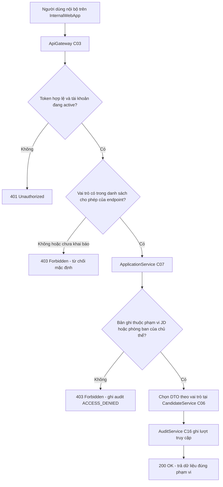

# Nhật ký quyết định thiết kế & Sổ mâu thuẫn

*Phụ lục của Chương 5 — Người phụ trách: D (System & UI Designer). File này ghi lại **vì sao** kiến trúc
ở Chương 5 có hình dạng như hiện tại, và ghi lại những điểm mà tài liệu của A, B, C chưa khớp nhau.*

---

## 1. Mục đích, phạm vi và quan hệ với `docs/change_log.md`

### 1.1. Mục đích

Component Diagram và Deployment Diagram chỉ trả lời câu hỏi "hệ thống gồm những gì". Câu hỏi khó hơn khi
bảo vệ là "vì sao lại chọn như vậy, còn phương án nào khác, và mất gì khi chọn". File này trả lời nhóm
câu hỏi thứ hai bằng 12 bản ghi quyết định kiến trúc theo mẫu ADR (Architecture Decision Record): mỗi
quyết định nêu bối cảnh, nội dung quyết định, các phương án đã cân nhắc và lý do loại, hệ quả tích cực,
hệ quả tiêu cực phải chấp nhận, và các mã UC/BR/NFR liên quan.

Phần thứ hai của file là **sổ mâu thuẫn**: bảy điểm mà `spec_ats (1).md` v1.1, `chapter-A.docx` v1.0,
Chương 3 của B và Chương 4 của C phát biểu khác nhau về cùng một sự việc. Nguyên tắc xử lý đã được chốt
từ đầu: **D không tự sửa tài liệu của A, B hoặc C.** Với mỗi mâu thuẫn, D ghi hiện trạng ở từng tài
liệu, phân tích ảnh hưởng tới Chương 5, đề xuất phương án và ước lượng chi phí sửa, rồi chuyển toàn bộ
sang Sync S4 để người phụ trách tài liệu tự quyết. Cách làm này bám đúng `06_conventions_shared.md` mục
4: không có review chéo thì không tính Done.

### 1.2. Phạm vi

Trong phạm vi: quyết định về kiến trúc ứng dụng, kiến trúc triển khai, cơ chế chống trùng lịch, cơ chế
thông báo, mô hình báo cáo, phân quyền, lưu trữ tệp, công cụ vẽ diagram và hình thức prototype. Ngoài
phạm vi: lựa chọn ngôn ngữ lập trình và framework cụ thể (được nêu ở mức tham khảo trong
`spec_ats (1).md` mục 12.3, không ràng buộc); chi tiết bảng và cột (thuộc Chương 4 của C); nội dung use
case và business rule (thuộc Chương 2 của A).

### 1.3. Quan hệ với `docs/change_log.md`

Hai file phục vụ hai mục đích khác nhau và không được trộn lẫn. `docs/change_log.md` là **nhật ký thay
đổi tài liệu** của cả nhóm, ghi theo định dạng `YYYY-MM-DD | Người | Nội dung | Ảnh hưởng`, dùng để người
khác biết tài liệu mình phụ thuộc đã đổi. File đang đọc là **nhật ký lý do**, ghi các quyết định đứng
phía sau tài liệu và không thay đổi khi tài liệu được biên tập lại về câu chữ.

Quan hệ giữa hai file là một chiều: khi một ADR được nhóm chấp thuận hoặc một mâu thuẫn được giải quyết
ở Sync S4, người phụ trách ghi thêm một dòng vào `docs/change_log.md`. Mục 8 của file này soạn sẵn các
dòng đó theo đúng định dạng để người thật dán vào. **D không tự ghi vào `docs/change_log.md`**, vì theo
`00_README.md` mục 9, một mục chỉ được tính Done sau khi có người thứ hai xác nhận.

**Quy ước đánh số:** để không trùng với chính văn Chương 5 và với phụ lục `docs/nfr_detail_D.md` (dùng
dải 5.30), phụ lục này dùng dải riêng — hình từ `Hình 5.50`, bảng từ `Bảng 5.50`.

---

## 2. Quyết định kiến trúc — ADR-01 … ADR-12

Bảng 5.50 liệt kê toàn bộ 12 quyết định để tra cứu nhanh; phần sau khai triển từng quyết định theo mẫu
sáu mục.

**Bảng 5.50 — Danh mục quyết định kiến trúc**

| Mã | Tên quyết định | Nhóm vấn đề | NFR chịu ảnh hưởng chính |
|---|---|---|---|
| ADR-01 | Modular monolith với ba tiến trình triển khai | Kiểu kiến trúc | NFR-01, NFR-08 |
| ADR-02 | PostgreSQL 16 primary kèm một streaming replica | Lưu trữ | NFR-03, NFR-07, NFR-10 |
| ADR-03 | Redis 7 cho khoá phân tán, session và hàng đợi outbox | Đồng thời | NFR-02, NFR-03, NFR-11 |
| ADR-04 | Object storage S3-compatible cho tệp CV | Lưu trữ tệp | NFR-05, NFR-07, NFR-12 |
| ADR-05 | Hexagonal / ports-and-adapters cho hệ thống ngoài | Tích hợp | NFR-11 |
| ADR-06 | Outbox pattern kèm idempotency key | Tin cậy thông báo | NFR-06, NFR-11, NFR-13 |
| ADR-07 | Read model báo cáo làm mới theo lịch 15 phút | Báo cáo | NFR-10 |
| ADR-08 | Optimistic locking bằng cột `version` | Toàn vẹn dữ liệu | NFR-02, NFR-06 |
| ADR-09 | Candidate không phải `User`, xác thực bằng magic link | Danh tính | NFR-04, NFR-05 |
| ADR-10 | RBAC từ chối mặc định, kiểm tra hai tầng | Phân quyền | NFR-04, NFR-05 |
| ADR-11 | Mermaid cho toàn bộ diagram của D | Công cụ tài liệu | — |
| ADR-12 | Prototype HTML/CSS/JS tĩnh một tệp | Demo | NFR-14 |

---

### ADR-01 — Modular monolith với ba tiến trình triển khai

**Bối cảnh.** Giả định quy mô ở `spec_ats (1).md` mục 15 giới hạn hệ thống ở mức tối đa 50 JD mở đồng
thời, tối đa 200 ứng viên cho mỗi JD và khoảng 60 người dùng nội bộ, tất cả trong một doanh nghiệp, một
múi giờ. Mục 12.2 của đặc tả để ngỏ giữa "modular monolith" và "microservices nhẹ". Nhóm phát triển giả
định là một đội nhỏ, không có đội vận hành riêng. Ba loại tải trong hệ thống có đặc tính rất khác nhau:
tải tương tác của Recruiter, tải nền theo lịch của các job SLA, và tải phân tích của màn báo cáo.

**Quyết định.** Hệ thống được xây dựng thành một khối mã nguồn có ranh giới module rõ ràng, triển khai
thành ba tiến trình theo đặc tính tải: `ats-api` chứa các component C03–C16 cùng C19–C24, `ats-worker`
chứa `SchedulerWorker` (C17), `ats-reporting` chứa `ReportingService` (C18). Ranh giới giữa các module
trong `ats-api` được giữ bằng interface (`IApplication`, `IScheduling`, `IApproval`…) chứ không bằng
ranh giới tiến trình.

**Phương án đã cân nhắc và lý do loại.**
*Microservices theo bounded context* (mỗi service một cơ sở dữ liệu, giao tiếp qua message broker) bị
loại vì với 10 000 application hoạt động, chi phí vận hành của hệ phân tán — service discovery, truy
vết phân tán, giao dịch phân tán cho luồng duyệt offer nhiều cấp — lớn hơn nhiều lần lợi ích thu được;
đây là trường hợp điển hình của thiết kế quá mức. *Monolith một tiến trình duy nhất* cũng bị loại: nếu
job quét SLA và truy vấn báo cáo 12 tháng chạy chung tiến trình với luồng tương tác, một truy vấn nặng
sẽ trực tiếp đẩy p95 của kanban vượt ngưỡng NFR-01, và không thể mở rộng riêng phần chịu tải nặng.
*Kiến trúc serverless theo hàm* bị loại vì hệ thống nội bộ không có đặc tính tải đột biến để tận dụng ưu
điểm của mô hình này, vì mỗi lần gọi hàm phải dựng lại kết nối cơ sở dữ liệu nên cần thêm một tầng gộp
kết nối chỉ để chạy được, và vì độ trễ khởi động nguội ăn thẳng vào ngân sách 2 giây của NFR-01.

**Hệ quả tích cực.** Một chuỗi gọi phục vụ dựng kanban nằm trọn trong một tiến trình, không có chặng
mạng nội bộ, nên gần như toàn bộ ngân sách 2 giây của NFR-01 dành cho truy vấn dữ liệu. Giao dịch nghiệp
vụ dùng transaction cục bộ của PostgreSQL, không cần giao dịch phân tán. Ba tiến trình mở rộng độc lập
theo NFR-08.

**Hệ quả tiêu cực phải chấp nhận.** Một lỗi nghiêm trọng ở một module có thể làm sập cả tiến trình
`ats-api`; toàn bộ mã nguồn phải triển khai cùng lúc nên không thể phát hành riêng từng module; và ranh
giới module chỉ được giữ bằng kỷ luật lập trình, dễ bị xói mòn nếu không rà soát mã thường xuyên.

**Liên quan.** NFR-01, NFR-08, NFR-03; toàn bộ UC-01…UC-06 chạy trên `ats-api`; `spec_ats (1).md` mục
12.2 và 15.

---

### ADR-02 — PostgreSQL 16 primary kèm một streaming replica

**Bối cảnh.** C đã chốt PostgreSQL với 18 bảng và 9 kiểu ENUM trong `sql/schema.sql` v1.2. Yêu cầu
NFR-10 buộc truy vấn báo cáo không được chạm cơ sở dữ liệu giao dịch, trong khi UC-05 cần bốn biểu đồ
trên dữ liệu 12 tháng. Đặc tả gốc ở mục 12.1 gợi ý "read replica hoặc ClickHouse".

**Quyết định.** Dùng một PostgreSQL 16 primary (`DbPrimaryNode`, N07) cho toàn bộ nghiệp vụ và một
streaming replica ở chế độ hot standby (`DbReplicaNode`, N08). Replica phục vụ duy nhất tiến trình
`ats-reporting`, đồng thời đóng vai bản sao nóng cho tình huống khôi phục ở NFR-07.

**Phương án đã cân nhắc và lý do loại.** *Bổ sung kho dữ liệu phân tích riêng (ClickHouse)* bị loại vì
khối lượng dữ liệu phân tích ước tính chỉ khoảng 120 000 dòng `application_status_history` cho 12 tháng
— quá nhỏ so với ngưỡng mà một cơ sở dữ liệu cột trở nên đáng giá, trong khi phải trả giá bằng một
đường ống ETL, một mô hình dữ liệu thứ hai và một hệ quản trị nữa phải vận hành. *Không dùng replica,
để báo cáo đọc thẳng primary* bị loại vì vi phạm trực tiếp NFR-10 và tạo đúng rủi ro mà
`04_person_D_design.md` mục 7 đã cảnh báo cho vai trò D. *Logical replication sang một cơ sở dữ liệu
khác chủng loại* bị loại vì làm phát sinh vấn đề ánh xạ 9 kiểu ENUM và các cột JSONB mà C đã thiết kế.

**Hệ quả tích cực.** Tách tải đọc phân tích khỏi tải giao dịch mà không cần thêm công nghệ mới; đội chỉ
phải thành thạo một hệ quản trị cơ sở dữ liệu; replica đồng thời rút ngắn RTO ở NFR-07 vì có thể promote
thay vì nạp lại bản dump; schema báo cáo dùng chung kiểu dữ liệu với schema nghiệp vụ nên không phát
sinh lỗi ánh xạ.

**Hệ quả tiêu cực phải chấp nhận.** Replica có độ trễ, nên số liệu báo cáo không bao giờ là tức thời —
đây chính là lý do NFR-10 buộc hiển thị `dataFreshness`. Truy vấn phân tích nặng vẫn chậm hơn cơ sở dữ
liệu cột chuyên dụng nếu sau này khối lượng tăng nhiều lần. Chi phí hạ tầng tăng thêm một máy.

**Liên quan.** NFR-03, NFR-07, NFR-10; UC-05; `sql/schema.sql` v1.2; `spec_ats (1).md` mục 12.1.

---

### ADR-03 — Redis 7 cho khoá phân tán, session và hàng đợi outbox

**Bối cảnh.** BR-03 cấm xếp hai buổi phỏng vấn chồng giờ cho cùng một interviewer, kể cả chồng một phút.
C đã ghi rõ ở `sql/schema.sql` ghi chú 1 rằng đây là ràng buộc liên dòng có yếu tố thời gian, không biểu
diễn được bằng `CHECK` constraint. B cũng ghi ở `report/chapter_3_behavior.md` mục 3.5.4 rằng race
condition phải xử lý bằng khoá ở tầng service trước khi ghi. Ngoài ra, `ats-api` chạy nhiều instance nên
session không thể nằm trong bộ nhớ tiến trình.

**Quyết định.** Triển khai một `CacheNode` (N09) chạy Redis 7 đảm nhiệm ba việc: giữ khoá phân tán theo
cặp `(interviewer_id, time_slot)` với TTL 120 giây thông qua `LockManager` (C24); lưu session của người
dùng nội bộ; và giữ hàng đợi làm việc cho `SchedulerWorker` cùng khoá leader election để chỉ một worker
active tại một thời điểm.

**Phương án đã cân nhắc và lý do loại.** *PostgreSQL advisory lock* là phương án gần nhất và không cần
thêm hạ tầng, nhưng bị loại vì mỗi khoá chiếm một kết nối trong suốt thời gian giữ; khi `ats-api` mở
rộng lên 6 instance, số kết nối tới primary trở thành tài nguyên khan hiếm, và một tiến trình treo sẽ
giữ khoá cho tới khi kết nối bị đóng, không có TTL tự nhiên. *Chỉ dựa vào ràng buộc UNIQUE ở tầng cơ sở
dữ liệu* bị loại vì xung đột lịch là quan hệ chồng lấn khoảng thời gian giữa các dòng khác nhau, không
quy về được một khoá duy nhất để đặt UNIQUE. *Khoá trong bộ nhớ tiến trình* bị loại ngay vì chỉ đúng khi
có một instance, mâu thuẫn với NFR-08.

**Hệ quả tích cực.** Khoá có TTL nên tiến trình chết không để lại khoá vĩnh viễn; session tách khỏi
instance nên mất một instance không làm người dùng đăng xuất, phục vụ NFR-03; một hạ tầng giải quyết cùng
lúc ba nhu cầu, giữ số thành phần phải vận hành ở mức thấp.

**Hệ quả tiêu cực phải chấp nhận.** Thêm một điểm hỏng đơn lẻ: Redis chết thì xếp lịch phải hạ cấp sang
khoá hàng của PostgreSQL (phương án dự phòng ở NFR-02) và người dùng có thể phải đăng nhập lại. Dữ liệu
Redis là bộ nhớ tạm, không được coi là nguồn sự thật cho bất kỳ dữ liệu nghiệp vụ nào.

**Liên quan.** BR-03; NFR-02, NFR-03, NFR-08, NFR-11; UC-01 (luồng A5.1, A5.2); SEQ-01 của B.

---

### ADR-04 — Object storage S3-compatible cho tệp CV

**Bối cảnh.** Ứng viên nộp CV dạng PDF hoặc DOCX, kích thước tới 10 MB. Bảng `attachments` của C đã thiết
kế theo hướng lưu con trỏ: `file_url`, `file_name`, `version`. Câu hỏi bảo vệ dự kiến trong
`04_person_D_design.md` mục 9 nêu thẳng tình huống "ứng viên nộp CV 10 MB thì lưu ở đâu". NFR-12 đòi hỏi
không có đường dẫn công khai vĩnh viễn và mọi lượt tải phải ghi audit.

**Quyết định.** Tệp được lưu trong object storage tương thích S3, cụ thể là MinIO tự vận hành
(`ObjectStorageNode`, N10) với bucket `ats-cv` bật versioning và mã hoá phía máy chủ. Cơ sở dữ liệu chỉ
lưu URL, tên tệp và số phiên bản — đúng ba cột `file_url`, `file_name`, `version` mà `sql/schema.sql`
v1.2 đã có; checksum SHA-256 được đọc từ metadata của object qua `StoragePort.checksum(ObjectKey)` nên
quyết định này không kéo theo đề xuất thêm cột nào cho bảng `attachments`. Trình duyệt tải tệp lên **trực tiếp** vào object storage bằng
presigned PUT, không đi qua `AppServerNode`; tải xuống bằng presigned GET có thời hạn 10 phút do
`FileService` (C15) cấp.

**Phương án đã cân nhắc và lý do loại.** *Lưu tệp trong PostgreSQL dạng BYTEA hoặc Large Object* bị loại
vì làm phình kích thước bản `pg_dump` hằng đêm, kéo dài thời gian khôi phục và do đó xung đột với RTO 4
giờ của NFR-07; ngoài ra mọi lượt tải đều phải đi qua tiến trình ứng dụng. *Lưu trên đĩa cục bộ của app
server* bị loại vì `AppServerNode` mở rộng 2→6 instance theo NFR-08, tệp tải lên instance này sẽ không
thấy được từ instance khác, trừ khi thêm hệ thống tệp chia sẻ — phức tạp hơn chính giải pháp object
storage. *Dùng dịch vụ lưu trữ tài liệu văn phòng sẵn có (Drive/SharePoint)* bị loại vì đó chính là hiện
trạng phân mảnh mà `spec_ats (1).md` mục 1.1 mô tả là vấn đề cần giải quyết, và không cấp được URL có
thời hạn gắn với phân quyền của hệ thống.

**Hệ quả tích cực.** Tệp 10 MB không bao giờ nằm trong bộ nhớ tiến trình ứng dụng, nên một đợt nộp CV
hàng loạt không làm cạn tài nguyên `ats-api`. Versioning của bucket cho phép khôi phục tệp bị ghi đè,
đáp ứng phần tệp của NFR-07. Presigned URL đáp ứng trực tiếp NFR-12.

**Hệ quả tiêu cực phải chấp nhận.** Thêm một hệ thống lưu trữ phải vận hành, sao lưu và xoay khoá truy
cập. Việc ghi audit gắn với thời điểm cấp URL chứ không phải thời điểm tải thật, nên số liệu audit hơi
thừa so với lượt tải thực tế — đây là đánh đổi có chủ ý, chấp nhận thừa còn hơn bỏ sót.

**Liên quan.** NFR-05, NFR-07, NFR-12; UC-02 (mở CV để sàng lọc); bảng `attachments` của C.

---

### ADR-05 — Hexagonal / ports-and-adapters cho mọi hệ thống ngoài

**Bối cảnh.** Hệ thống phụ thuộc bốn hệ thống ngoài: nhà cung cấp danh tính (Google Workspace OIDC),
cổng gửi email, nhà cung cấp lịch, và object storage. Trong phạm vi bài tập, không hệ thống nào trong số
này khả dụng thật khi bảo vệ, nhưng Chương 5 vẫn phải mô tả kiến trúc như hệ thống chạy thật. UC-01
E18.1 của A yêu cầu khi đồng bộ lịch lỗi thì buổi phỏng vấn vẫn được tạo với trạng thái
`CALENDAR_SYNC_PENDING`.

**Quyết định.** Mọi hệ thống ngoài được truy cập qua một cổng (port) do lõi nghiệp vụ định nghĩa và một
bộ chuyển đổi (adapter) cài đặt cổng đó: `EmailPort`/`EmailAdapter` (C20), `CalendarPort`/`CalendarAdapter`
(C21), `IdentityPort`/`IdentityAdapter` (C22), `StoragePort`/`ObjectStorageAdapter` (C23). Lõi nghiệp vụ
không tham chiếu bất kỳ thư viện SDK nào của nhà cung cấp.

**Phương án đã cân nhắc và lý do loại.** *Gọi trực tiếp SDK của nhà cung cấp trong service nghiệp vụ* là
cách nhanh nhất, nhưng bị loại vì khi đó không thể kiểm thử `SchedulingService` mà không có mạng, và
không thể chạy demo ngoại tuyến — mâu thuẫn với ADR-12. *Đặt một service trung gian riêng làm lớp chống
hỏng (anti-corruption layer)* bị loại vì thêm một chặng mạng và một tiến trình phải vận hành, trong khi
lợi ích cách ly hoàn toàn đạt được bằng ranh giới interface trong cùng tiến trình, đúng tinh thần
ADR-01.

**Hệ quả tích cực.** Cả bốn hệ thống ngoài thay được bằng mock trong kiểm thử, nhờ đó các phép đo của
NFR-11 (đếm lời gọi theo `idempotency_key`) và NFR-09 (kiểm tra ngôn ngữ email) thực hiện được. Khi đổi
nhà cung cấp email, chỉ một lớp adapter thay đổi. Lõi nghiệp vụ giữ được ngôn ngữ nghiệp vụ thuần tuý,
dễ đối chiếu với use case của A.

**Hệ quả tiêu cực phải chấp nhận.** Thêm một lớp trừu tượng nên mã nguồn dài hơn cách gọi trực tiếp; và
tồn tại nguy cơ trừu tượng hoá sai nếu cổng được thiết kế theo hình dạng của nhà cung cấp đầu tiên thay
vì theo nhu cầu của lõi nghiệp vụ.

**Liên quan.** NFR-11, NFR-09; UC-01 (E18.1), UC-03, UC-04; ADR-06, ADR-12.

---

### ADR-06 — Outbox pattern kèm idempotency key

**Bối cảnh.** Nhiều luồng nghiệp vụ vừa ghi cơ sở dữ liệu vừa phải gọi hệ thống ngoài trong cùng một
thao tác của người dùng: tạo buổi phỏng vấn rồi gửi email mời cho ứng viên và interviewer (UC-01 bước
6), gửi offer cho ứng viên (UC-04 bước 5), nhắc và leo thang khi feedback trễ hạn (SEQ-03 của B). Nếu
gọi hệ thống ngoài ngay trong transaction, gateway lỗi sẽ kéo theo rollback cả giao dịch nghiệp vụ hợp
lệ; nếu gọi sau khi commit, tiến trình chết giữa chừng sẽ làm mất thông báo.

**Quyết định.** Giao dịch nghiệp vụ ghi dữ liệu và ghi một bản ghi vào bảng `outbox_events` **trong cùng
một transaction**. `SchedulerWorker` (C17) đọc bảng này và gọi adapter tương ứng với khoá
`idempotencyKey = hash(entity, event, attempt)`; khoá này có ràng buộc UNIQUE ở tầng lưu trữ. Sự kiện
thất bại được thử lại tối đa 5 lần theo backoff luỹ thừa 1, 2, 4, 8, 16 phút rồi chuyển vào hàng đợi
chết.

**Phương án đã cân nhắc và lý do loại.** *Gửi email đồng bộ ngay trong request* bị loại vì buộc người
dùng chờ hệ thống ngoài và làm giao dịch nghiệp vụ phụ thuộc vào tình trạng của bên thứ ba — đúng tình
huống mà UC-01 E18.1 yêu cầu tránh. *Dùng message broker riêng như RabbitMQ hoặc Kafka* bị loại vì với
quy mô vài nghìn sự kiện mỗi ngày, một bảng cơ sở dữ liệu đủ sức đảm nhiệm, trong khi broker thêm một hạ
tầng phải vận hành và **không** tự giải quyết vấn đề cốt lõi là ghi cơ sở dữ liệu và phát sự kiện phải
nguyên tử với nhau. *Giao dịch phân tán hai pha* bị loại vì các hệ thống ngoài không hỗ trợ, và vì chi
phí vận hành không tương xứng với bài toán.

**Hệ quả tích cực.** Không tồn tại trạng thái "đã tạo phỏng vấn nhưng mất lệnh gửi email" hoặc ngược
lại. Việc phát lại toàn bộ hàng đợi an toàn, làm cho phép đo "0 email trùng trên 1 000 sự kiện" của
NFR-11 khả thi. Bảng outbox có sẵn `status`, `attempt_count`, `next_retry_at` nên trở thành nguồn số
liệu cho cảnh báo tồn đọng ở NFR-13 mà không cần hạ tầng đo riêng.

**Hệ quả tiêu cực phải chấp nhận.** Thông báo trở thành bất đồng bộ, có độ trễ tính bằng chu kỳ quét của
worker. Bảng outbox tăng trưởng và cần chính sách dọn dẹp. Cần bảng mới trong schema — D đã đưa vào danh
mục đề xuất gửi C ở mục 4 với mức ưu tiên P1.

**Liên quan.** NFR-06, NFR-11, NFR-13; UC-01 (bước 6, E18.1), UC-04 (bước 5); BR-12; SEQ-01 và SEQ-03
của B.

---

### ADR-07 — Read model báo cáo làm mới theo lịch 15 phút

**Bối cảnh.** UC-05 yêu cầu bốn biểu đồ: funnel, time-to-hire, source effectiveness và SLA compliance,
có bộ lọc theo khoảng thời gian, phòng ban, JD và nguồn tuyển. Tính trực tiếp các chỉ số này đòi hỏi quét
`application_status_history` — bảng mà C bổ sung ở v1.2 đúng cho mục đích đo time-in-stage — với nhiều
phép nhóm và tự nối. NFR-10 giới hạn p95 ở 3 giây và cấm chạm cơ sở dữ liệu primary.

**Quyết định.** Dựng bốn bảng tổng hợp `rm_funnel_daily`, `rm_time_to_hire`, `rm_source_effectiveness`,
`rm_sla_compliance` trong một schema `reporting` riêng, làm mới theo lịch 15 phút bởi `SchedulerWorker`
(C17), đọc từ replica. `ReportingService` (C18) chỉ đọc bốn bảng này và luôn trả kèm `dataFreshness` để
`SCR-10` hiển thị mốc thời gian của số liệu.

**Phương án đã cân nhắc và lý do loại.** *Truy vấn trực tiếp bảng giao dịch mỗi lần mở báo cáo* bị loại
vì chi phí truy vấn tăng tuyến tính theo lịch sử tích luỹ, nghĩa là báo cáo sẽ chậm dần theo thời gian
sử dụng — kiểu suy giảm khó phát hiện khi kiểm thử trên dữ liệu mới. *Cập nhật tức thời bằng trigger hoặc
materialized view làm mới ngay khi commit* bị loại vì đặt chi phí tính toán báo cáo lên đúng đường ghi
của luồng giao dịch, làm chậm chính thao tác chuyển trạng thái mà NFR-01 đang bảo vệ. *Kho dữ liệu riêng
với ETL hằng đêm* bị loại vì độ trễ tới 24 giờ quá lớn cho nhu cầu theo dõi SLA hằng ngày của Head of
HR, đồng thời trùng lý do đã nêu ở ADR-02.

**Hệ quả tích cực.** Truy vấn báo cáo trở thành phép đọc bảng đã tổng hợp sẵn, giữ được p95 3 giây ổn
định theo thời gian. Tải phân tích hoàn toàn tách khỏi primary. Việc hiển thị `dataFreshness` biến độ trễ
từ khiếm khuyết ẩn thành thông tin minh bạch cho người ra quyết định.

**Hệ quả tiêu cực phải chấp nhận.** Số liệu trễ tới 15 phút, nên không dùng được cho mục đích cần chính
xác tức thời. Có thêm bốn bảng phải bảo trì và một job có thể hỏng âm thầm — vì vậy NFR-13 đặt cảnh báo
theo tuổi read model. Logic tính chỉ số bị lặp ở hai nơi nếu không kỷ luật, nên định nghĩa metric được
gom về một chỗ trong `ReportingService` theo BR-24.

**Liên quan.** NFR-10, NFR-01; UC-05; BR-24, BR-25; bảng `application_status_history` của C.

---

### ADR-08 — Optimistic locking bằng cột `version`

**Bối cảnh.** Nhiều thao tác trong hệ thống có khả năng bị hai người thực hiện song song trên cùng một
bản ghi: hai Recruiter cùng mở một hồ sơ ứng viên và cùng bấm chuyển trạng thái; một Interviewer sửa
feedback trong khi hệ thống đang khoá feedback sau 24 giờ theo UC-03 A5.1; hai cấp duyệt cùng thao tác
trên một offer khi luồng duyệt bị `REQUEST_CHANGE` và chạy lại từ cấp 1 theo UC-04 A4.1. Nếu ghi đè theo
kiểu "ai ghi sau thắng", một thay đổi sẽ biến mất không dấu vết, kéo theo mất một dòng lịch sử và phá
NFR-06.

**Quyết định.** Bổ sung cột `version INT NOT NULL DEFAULT 1` cho ba bảng `applications`, `feedbacks`,
`offers`. Mọi lệnh cập nhật đi kèm điều kiện `WHERE id = :id AND version = :version` và tăng `version`
lên một; nếu số dòng bị ảnh hưởng bằng 0, hệ thống trả lỗi xung đột kèm thông báo tiếng Việt yêu cầu tải
lại dữ liệu mới.

**Phương án đã cân nhắc và lý do loại.** *Khoá bi quan bằng `SELECT ... FOR UPDATE` cho mọi thao tác
ghi* bị loại vì giữ khoá suốt thời gian người dùng điền biểu mẫu — có thể vài phút trên Offer Wizard bốn
bước — làm giảm nghiêm trọng khả năng phục vụ đồng thời, và một tab bị bỏ quên sẽ chặn người khác.
*Không làm gì, chấp nhận ghi đè* bị loại vì mâu thuẫn trực tiếp với yêu cầu toàn vẹn audit ở NFR-06 và
vì đây chính là loại lỗi rất khó tái hiện khi vận hành thật.

**Hệ quả tích cực.** Không giữ tài nguyên trong lúc người dùng suy nghĩ, phù hợp với biểu mẫu nhiều
bước. Xung đột được phát hiện tại đúng thời điểm ghi và báo cho người dùng thay vì im lặng mất dữ liệu.
Cơ chế đơn giản, kiểm thử được bằng hai request song song.

**Hệ quả tiêu cực phải chấp nhận.** Người dùng thua trong tranh chấp phải nhập lại thao tác, nên giao
diện cần thông báo rõ ràng thay vì báo lỗi kỹ thuật. Cần C bổ sung cột `version` cho ba bảng — đây là đề
xuất mức P0 ở mục 4, và cho tới khi C xác nhận thì đây vẫn là giả định thiết kế.

**Liên quan.** NFR-02, NFR-06; UC-01, UC-02, UC-03 (A5.1), UC-04 (A4.1); Chương 5 phác thảo của A.

---

### ADR-09 — Candidate không phải `User`, xác thực bằng magic link

**Bối cảnh.** `docs/handoff_A_D_after_BC_v12.md` ghi rõ Candidate không đăng nhập nội bộ như người dùng
hệ thống mà dùng portal cộng với email; C cũng đã xác nhận ở ghi chú v1.2 rằng Candidate không có hàng
trong bảng `notifications`. Bảng `users` của C chỉ chứa sáu vai trò nội bộ, không có vai trò ứng viên.
Đồng thời `spec_ats (1).md` mục 1.3 loại website tuyển dụng công khai khỏi phạm vi, chỉ giữ portal đăng
nhập bằng link mời.

**Quyết định.** Candidate là thực thể nghiệp vụ riêng (`candidates`), không phải `User`, không có vai
trò trong `user_role` và không tham gia RBAC nội bộ. `CandidatePortalApp` (C02) xác thực bằng magic link:
`AuthService` (C04) phát một token có thời hạn 7 ngày gắn với cặp `(candidate_id, application_id)`, gửi
qua email; token dùng-một-lần cho các hành động nhạy cảm như chấp nhận offer, và bị thu hồi khi
application chuyển sang trạng thái cuối.

**Phương án đã cân nhắc và lý do loại.** *Tạo hàng `users` cho ứng viên kèm mật khẩu băm* bị loại vì
buộc phải mở rộng `user_role` thêm một giá trị chỉ dùng cho một mục đích, làm mọi truy vấn nội bộ phải
thêm điều kiện loại trừ, và tạo ra bề mặt tấn công mới là kho mật khẩu của người ngoài doanh nghiệp.
*Cho ứng viên đăng nhập bằng SSO của nhà cung cấp bên ngoài* bị loại vì ứng viên không nhất thiết có tài
khoản phù hợp và vì hệ thống nội bộ không nên phụ thuộc danh tính bên ngoài cho luồng nghiệp vụ bắt
buộc. *Xác thực bằng mã một lần gửi qua tin nhắn* bị loại vì phát sinh chi phí và một tích hợp ngoài
nữa, trong khi email đã là kênh liên lạc chính thức của toàn bộ quy trình.

**Hệ quả tích cực.** Ranh giới an ninh giữa người ngoài và người trong doanh nghiệp rất rõ; một token
ứng viên bị lộ cũng không chạm được endpoint nội bộ. Không phải quản lý mật khẩu cho người ngoài. Mô
hình khớp đúng schema hiện có của C, không cần đổi `users`.

**Hệ quả tiêu cực phải chấp nhận.** Bảo mật phụ thuộc vào hộp thư của ứng viên; nếu email bị chuyển tiếp
thì token đi theo. Ứng viên mất email thì phải yêu cầu gửi lại link. Cần một bảng mới lưu token — đề
xuất mức P1 ở mục 4.

**Liên quan.** NFR-04, NFR-05; UC-01 (xác nhận lịch), UC-04 và UC-06 (phản hồi offer); `SCR-09`;
`docs/handoff_A_D_after_BC_v12.md`.

---

### ADR-10 — RBAC từ chối mặc định, kiểm tra hai tầng

**Bối cảnh.** Hệ thống có sáu vai trò nội bộ với quyền hạn khác nhau rõ rệt, cộng thêm phạm vi theo
phòng ban và theo JD được giao. BR-20 giới hạn Interviewer chỉ thấy gói thông tin của buổi phỏng vấn
được giao; BR-21 ràng buộc phạm vi truy cập theo phòng ban. NFR-04 đòi 100 % endpoint có kiểm tra quyền,
NFR-05 đòi không có ca đọc chéo JD.

**Quyết định.** Mọi tài nguyên mặc định bị từ chối; quyền phải được khai báo tường minh mới mở. Kiểm tra
diễn ra ở hai tầng: `ApiGateway` (C03) xác thực token và lọc thô theo vai trò; service tương ứng kiểm tra
quyền sở hữu và phạm vi trên chính dữ liệu được yêu cầu. Việc ẩn nút trên giao diện chỉ là cải thiện
trải nghiệm, không bao giờ được coi là biện pháp phân quyền.

**Phương án đã cân nhắc và lý do loại.** *Chỉ ẩn chức năng trên giao diện* bị loại vì không phải là biện
pháp an ninh: bất kỳ ai mở công cụ nhà phát triển của trình duyệt đều gọi được endpoint bị ẩn. *Chỉ kiểm
tra ở gateway* bị loại vì gateway không biết dữ liệu cụ thể — nó biết chủ thể là Recruiter nhưng không
biết ứng viên đang được yêu cầu có thuộc JD mà người đó phụ trách hay không; đây chính là loại kiểm tra
mà NFR-05 nhắm tới. *Kiểm soát truy cập theo quan hệ chi tiết tới từng bản ghi (ReBAC)* bị loại vì độ
phức tạp không tương xứng: ma trận 6 vai trò nhân 13 nhóm tài nguyên đã mô tả đủ nghiệp vụ, trong khi mô
hình quan hệ đòi hỏi một hệ thống đánh giá chính sách riêng.

**Hệ quả tích cực.** Sai sót lập trình dẫn tới "thiếu quyền" chứ không dẫn tới "thừa quyền", nghĩa là lỗi
lộ ra ngay khi kiểm thử thay vì âm thầm mở dữ liệu. Ma trận ở mục 5 sinh trực tiếp ra 182 ca kiểm thử của
NFR-04, biến yêu cầu phân quyền thành thứ đo được. Hai tầng độc lập nên một tầng sót vẫn còn tầng kia.

**Hệ quả tiêu cực phải chấp nhận.** Chi phí phát triển tăng: mỗi endpoint mới phải khai báo quyền và bổ
sung ca kiểm thử. Có chi phí xử lý thêm trên mỗi request, được giới hạn ở mức 15 mili giây theo NFR-04.
Trong giai đoạn đầu, người dùng có thể gặp lỗi 403 do khai báo còn thiếu.

**Liên quan.** BR-20, BR-21; NFR-04, NFR-05; toàn bộ 11 màn hình `SCR-01`…`SCR-11`; ADR-09.

---

### ADR-11 — Mermaid cho toàn bộ diagram của D

**Bối cảnh.** `04_person_D_design.md` mục 1 đề xuất vẽ Component Diagram và Deployment Diagram bằng
draw.io. Tuy nhiên B đã dùng Mermaid cho toàn bộ bảy diagram của Chương 3, và nhóm đã chốt ở
`docs/change_log.md` ngày 2026-08-06 rằng Mermaid được chấp nhận tương đương PlantUML. Tài liệu của nhóm
nằm trong kho Git, review qua pull request.

**Quyết định.** Toàn bộ diagram của D — COMP-01, DEP-01 và các sơ đồ minh hoạ trong phụ lục — được viết
bằng Mermaid nhúng trong tệp Markdown, đặt tại `diagrams/D_comp_architecture_v1.md` và
`diagrams/D_deploy_topology_v1.md` theo quy ước tên tệp ở `06_conventions_shared.md` mục 1.

**Phương án đã cân nhắc và lý do loại.** *draw.io theo gợi ý ban đầu* bị loại vì tệp nhị phân không so
sánh được giữa hai phiên bản trong pull request, nên người review chéo không thấy được thay đổi cụ thể;
ngoài ra diagram sẽ lệch phong cách với bảy diagram Mermaid của B trong cùng một báo cáo. *PlantUML* có
ưu thế thật về ký hiệu UML nghiêm ngặt — đặc biệt là fork/join và swimlane chuẩn — nhưng bị loại cho
phạm vi của D vì Component Diagram và Deployment Diagram không cần hai ký hiệu đó, trong khi việc dùng
hai công cụ song song làm tăng chi phí dựng tài liệu và tạo rủi ro thiếu công cụ khi kết xuất bản cuối.

**Hệ quả tích cực.** Diagram nằm cùng văn bản, thay đổi hiện rõ trong lịch sử Git, người review chéo đọc
được trực tiếp. Toàn bộ Chương 3 và Chương 5 đồng nhất một phong cách. Không phụ thuộc phần mềm cài đặt
trên máy cụ thể khi dựng bản nộp.

**Hệ quả tiêu cực phải chấp nhận.** Mermaid không có ký hiệu UML chuẩn cho một số cấu trúc, và khả năng
điều khiển bố cục hạn chế nên sơ đồ lớn dễ rối. Rủi ro đã được ghi nhận ngay trong `docs/change_log.md`:
nếu hội đồng yêu cầu ký hiệu UML nghiêm ngặt, phương án dự phòng là vẽ lại bằng PlantUML.

**Liên quan.** `06_conventions_shared.md` mục 1 và 7; `docs/change_log.md` mục ngày 2026-08-06; deliverable
D3 và D4.

---

### ADR-12 — Prototype HTML/CSS/JS tĩnh một tệp

**Bối cảnh.** `04_person_D_design.md` mục 2 cho hai lựa chọn: prototype dựng bằng Figma hoặc bản tĩnh
HTML; mục 8 của cùng tài liệu cảnh báo "prototype quá tham vọng" là sai lầm thường gặp và khuyên không
cố viết ứng dụng React thật. Buổi bảo vệ diễn ra tại phòng học, không bảo đảm có mạng ổn định. NFR-14
đòi hỏi đo được khả năng tiếp cận trên các màn hình chính.

**Quyết định.** Prototype là một tệp `prototype/index.html` duy nhất, chứa toàn bộ HTML, CSS và JavaScript
nội tuyến, không phụ thuộc thư viện ngoài và không cần máy chủ. Prototype phủ 11 màn `SCR-01`…`SCR-11`
theo kiểu click-through, dùng đúng dữ liệu mẫu đã chốt của công ty giả định VXTech.

**Phương án đã cân nhắc và lý do loại.** *Prototype Figma* bị loại vì phụ thuộc mạng và tài khoản khi
trình chiếu, và vì không chạy được công cụ kiểm tra khả năng tiếp cận như axe-core hay Lighthouse lên
sản phẩm — nghĩa là NFR-14 sẽ không có cách đo. *Ứng dụng React có backend thật* bị loại đúng theo cảnh
báo trong tài liệu hướng dẫn: chi phí thời gian đe doạ trực tiếp deliverable bắt buộc là slide và Chương
6, trong khi không mang thêm điểm cho một bài tập phân tích thiết kế. *Chỉ dùng ảnh chụp walkthrough* bị
loại vì không thể hiện được luồng thao tác và các trạng thái khác nhau của cùng một màn hình, vốn là yêu
cầu trong tiêu chí Done của hạng mục wireframe.

**Hệ quả tích cực.** Mở được bằng cách nhấp đúp tệp trên bất kỳ máy nào, không mạng, không cài đặt — loại
bỏ hoàn toàn rủi ro kỹ thuật lớn nhất của buổi demo. Chạy được axe-core và Lighthouse để lấy số liệu cho
NFR-14. Dễ sao lưu và gửi kèm bản nộp.

**Hệ quả tiêu cực phải chấp nhận.** Không có dữ liệu thật nên không minh hoạ được hành vi phụ thuộc dữ
liệu lớn; một tệp duy nhất sẽ dài và khó bảo trì nếu mở rộng thêm màn; và cần nói rõ khi bảo vệ rằng đây
là bản mô phỏng giao diện, không phải hệ thống chạy thật, để tránh gây hiểu nhầm.

**Liên quan.** NFR-14; toàn bộ `SCR-01`…`SCR-11`; deliverable D8; `04_person_D_design.md` mục 8 và 10.

---

## 3. Sổ mâu thuẫn — X-01 … X-07

Bảy điểm dưới đây được phát hiện khi đối chiếu bốn nguồn tài liệu trong quá trình dựng Chương 5. **D
không sửa tài liệu của A, B hoặc C**; toàn bộ nội dung mục này là đầu vào cho Sync S4. Bảng 5.51 tóm tắt
để chủ trì cuộc họp nắm nhanh; các mục sau khai triển từng điểm.

**Bảng 5.51 — Tổng hợp sổ mâu thuẫn**

| Mã | Điểm mâu thuẫn | Người phải quyết | Chi phí sửa ước tính | Mức khẩn |
|---|---|---|---|---|
| X-01 | SLA xác nhận lịch: 24 giờ hay hai mốc 24/48 giờ | A chủ trì, B thực hiện | B sửa 2 nhãn guard + thêm 1 bước trong SEQ-01 | P0 |
| X-02 | Thiếu trạng thái `SHORTLISTED` trong enum | A chủ trì, C và B thực hiện | C thêm 1 giá trị ENUM; B thêm 1 state + 2 transition | P0 |
| X-03 | Tên trạng thái offer khác nhau giữa A và C | D xử lý ở tầng nhãn | 0 dòng mã, 1 bảng ánh xạ trong Chương 5 | P2 |
| X-04 | Trùng mã BR-13 giữa `spec_ats (1).md` và `chapter-A.docx` | A | A sửa 1 dòng bảng BR + 2 chỗ tham chiếu trong UC-01 | P1 |
| X-05 | `System / Scheduler` là actor hay component nội bộ | A xác nhận, D chú thích | 0 dòng, 1 chú thích trên COMP-01 | P2 |
| X-06 | Tên vai trò duyệt tài chính khác nhau ở ba tầng | A xác nhận | 0 dòng, 1 bảng ánh xạ ba tầng | P2 |
| X-07 | Số lượng use case: 10–12 hay 5 + 1 | A | 0 dòng, 1 ghi chú phạm vi trong Chương 2 và Chương 5 | P1 |

---

### X-01 — SLA xác nhận lịch phỏng vấn: một mốc hay hai mốc

**Hiện trạng ở từng tài liệu.** `spec_ats (1).md` v1.1 mục 6 (BR-05) quy định ứng viên phải xác nhận
lịch trong 24 giờ, quá hạn chuyển `NEED_RESCHEDULE`; cùng tài liệu, UC-01 luồng A6.1 đã được vá về 24
giờ trong đợt audit của B. `report/chapter_3_behavior.md` mục 3.4.2 vẽ STATE-01 với guard
`confirmSLAMissed() [after24h]`, và mục 3.5.2 bước 5 của SEQ-01 đặt SLA xác nhận 24 giờ; STATE-02 dùng
cùng mốc. `chapter-A.docx` v1.0 mô tả mô hình hai mốc: nhắc ở 24 giờ và chỉ chuyển `NEED_RESCHEDULE` sau
48 giờ.

**Ảnh hưởng tới Chương 5 của D.** `SCR-05` (Schedule Interview) hiển thị hạn xác nhận cho Recruiter ngay
khi tạo lịch, `SCR-09` (Candidate Portal) hiển thị đồng hồ đếm ngược cho ứng viên, và `SLAService` (C14)
là nơi duy nhất tính deadline cho toàn hệ thống. Ba nơi này phải dùng cùng một con số; nếu wireframe ghi
48 giờ trong khi state machine chuyển trạng thái ở 24 giờ, ứng viên sẽ thấy còn hạn nhưng hệ thống đã
chuyển `NEED_RESCHEDULE` — lỗi nghiêm trọng và rất dễ bị hỏi khi bảo vệ.

**Phương án đề xuất.** Theo `chapter-A.docx`: giữ nguyên phát biểu "24 giờ để xác nhận" của BR-05 nhưng
tách thành hai mốc vận hành — mốc 24 giờ gửi nhắc, mốc 48 giờ chuyển `NEED_RESCHEDULE`. Mô hình hai mốc
hợp lý hơn về nghiệp vụ vì ứng viên đang đi làm thường không kiểm tra hộp thư trong một ngày, và nó
đồng dạng với mô hình ba mốc 24/48/72 giờ mà B đã dùng cho SLA feedback ở SEQ-03, tạo sự nhất quán trong
cách hệ thống xử lý mọi loại SLA.

**Chi phí sửa.** B sửa nhãn guard `[after24h]` thành `[after48h]` tại STATE-01
(`diagrams/B_state_application_v1.md`) và STATE-02 (`diagrams/B_state_interview_v1.md`) — hai dòng; thêm
một bước nhắc ở mốc 24 giờ vào SEQ-01 (`diagrams/B_seq_schedule_interview_v1.md`) — khoảng ba dòng; cập
nhật mục 3.4.3 và 3.5.2 của `report/chapter_3_behavior.md` — hai dòng. A làm rõ diễn giải hai mốc trong
UC-01 A6.1. **Không đổi schema**: `sql/schema.sql` không lưu hằng số SLA.

**Mức khẩn: P0.** Con số này xuất hiện trên hai màn hình và trong một component; không chốt thì D không
thể hoàn thiện `SCR-05`, `SCR-09` và mô tả `SLAService`.

---

### X-02 — Thiếu trạng thái `SHORTLISTED` trong `application_status`

**Hiện trạng ở từng tài liệu.** `sql/schema.sql` v1.2 khai báo `application_status` với 17 giá trị, đi
thẳng từ `SCREENING` sang `INTERVIEWING`, không có `SHORTLISTED`. `report/chapter_3_behavior.md` mục
3.4.4 khẳng định cả 17 giá trị đều xuất hiện trong STATE-01 và không có state nào chỉ tồn tại ở một
phía; transition tương ứng là `SCREENING --> INTERVIEWING : shortlist()`. Ngược lại,
`spec_ats (1).md` mục 5 (UC-02) ghi postcondition là "ứng viên có trạng thái SHORTLISTED hoặc REJECTED",
và `chapter-A.docx` dùng `SHORTLISTED` như trạng thái trung gian giữa `SCREENING` và `INTERVIEWING`,
đồng thời là precondition của UC-01.

**Ảnh hưởng tới Chương 5 của D.** `SCR-03` là bảng kanban theo cột trạng thái. Nếu không có
`SHORTLISTED`, ứng viên đã được duyệt qua vòng sàng lọc nhưng chưa xếp lịch sẽ nằm lẫn trong cột
`SCREENING` cùng những hồ sơ chưa ai đọc — mất đúng thông tin vận hành mà Recruiter cần nhất, là danh
sách việc phải làm tiếp theo. Đây cũng là hàng đợi đầu vào của UC-01, nên thiếu nó thì luồng từ UC-02
sang UC-01 không có điểm nối rõ ràng trên giao diện.

**Phương án đề xuất.** Bổ sung `SHORTLISTED` vào enum, nâng tổng số giá trị lên 18, đặt giữa `SCREENING`
và `INTERVIEWING` với hai transition `SCREENING → SHORTLISTED` (hành động `shortlist()`) và
`SHORTLISTED → INTERVIEWING` (hành động `interviewScheduled()`). Phương án thay thế là giữ 17 giá trị và
để `SCR-03` gộp hai nhóm vào một cột, nhưng như vậy giao diện sẽ không phản ánh được postcondition của
UC-02 mà A đã viết.

**Chi phí sửa.** C thêm một giá trị vào `CREATE TYPE application_status` trong `sql/schema.sql` — một
dòng, kèm cập nhật `docs/data_dictionary_C.md` và Bảng 4.2 (số giá trị enum) — khoảng ba dòng. B thêm
một state và hai transition vào STATE-01 — ba dòng — kèm một dòng trong bảng state đặc biệt ở mục 3.4.3.
A giữ nguyên vì tài liệu của A vốn đã dùng tên này.

**Mức khẩn: P0.** Đây là mâu thuẫn duy nhất trong sổ này ảnh hưởng tới cấu trúc dữ liệu; càng để lâu thì
càng nhiều tài liệu tham chiếu con số "17 giá trị" phải sửa theo.

---

### X-03 — Tên trạng thái offer khác nhau giữa tài liệu của A và schema của C

**Hiện trạng ở từng tài liệu.** `sql/schema.sql` khai báo `offer_status` gồm chín giá trị, trong đó có
`SIGNED_BY_COMPANY` cho giai đoạn công ty đã ký và gửi ứng viên. `report/chapter_3_behavior.md` mục
3.4.5 đã lập Bảng 3.1b ánh xạ hai chiều giữa `application_status` và `offer_status`, và giải thích rõ vì
sao không gộp thành một enum. `chapter-A.docx` đề nghị "chuẩn hoá dùng `OFFER_APPROVED` thay
`SIGNED_BY_COMPANY`" — thực chất là gộp hai enum vốn thuộc hai thực thể khác nhau.

**Ảnh hưởng tới Chương 5 của D.** Ba màn `SCR-07` (Offer Wizard), `SCR-08` (Offer Approval Inbox) và
`SCR-09` (Candidate Portal) đều hiển thị trạng thái offer, nhưng cho ba nhóm người dùng khác nhau:
Recruiter, cấp duyệt và ứng viên. Nếu D lấy thẳng tên enum làm nhãn thì ứng viên sẽ đọc thấy
`SIGNED_BY_COMPANY` — vừa khó hiểu vừa sai về ngôn ngữ báo cáo tiếng Việt.

**Phương án đề xuất.** Giữ nguyên hai enum như thiết kế của C, vì lập luận của B ở mục 3.4.5 là đúng:
`Application.status` mô tả trạng thái pipeline tuyển dụng, còn `Offer.status` mô tả vòng đời văn bản
offer, và một application có thể trải qua nhiều lần tạo lại offer. D giải quyết ở tầng nhãn: mỗi mã enum
được ánh xạ sang một nhãn tiếng Việt hiển thị (xem Bảng 5.56 ở mục 6), người dùng không bao giờ nhìn
thấy tên enum. Đây cũng là cách xử lý tổng quát cho mọi enum trong hệ thống.

**Chi phí sửa.** Không sửa tệp nào của A, B, C. D bổ sung một bảng ánh xạ nhãn vào Chương 5 và dùng đúng
bảng đó trong `wireframes/D_wireframes_v1.md` và `prototype/index.html`. A chỉ cần rút lại đề nghị "chuẩn
hoá" trong bản phác Chương 5 của mình — một dòng.

**Mức khẩn: P2.** Không chặn ai, nhưng cần được ghi nhận để bản Chương 2 cuối cùng không còn câu đề nghị
gộp enum, tránh mâu thuẫn hiển thị trong báo cáo hoàn chỉnh.

---

### X-04 — Trùng mã BR-13 giữa hai tài liệu

**Hiện trạng ở từng tài liệu.** `spec_ats (1).md` v1.1 mục 6 định nghĩa BR-13 là quy tắc hết hạn hold:
application ở `ON_HOLD` quá 14 ngày làm việc, hoặc JD đóng trong lúc đang hold, thì tự chuyển `REJECTED`.
`report/chapter_4_data.md` Bảng 4.1 và `report/chapter_3_behavior.md` Bảng 3.1 đều đã tham chiếu BR-13
theo nghĩa này. Trong khi đó `chapter-A.docx` dùng BR-13 cho một quy tắc hoàn toàn khác: việc override
lịch trùng phải kèm lý do và ghi audit log.

**Ảnh hưởng tới Chương 5 của D.** D tham chiếu mã BR ở ba nơi: mô tả job hết hạn hold của
`SchedulerWorker` (C17), mô tả cơ chế override trong `SchedulingService` (C08) và `SCR-05`, và ma trận
RBAC ở mục 5 (dòng "Override xung đột lịch"). Một mã trỏ tới hai quy tắc khác nhau khiến người đọc báo
cáo không xác định được cơ chế nào đang được nói tới, và nếu hội đồng tra ngược mã BR thì mâu thuẫn lộ
ra ngay.

**Phương án đề xuất.** Giữ BR-13 đúng nghĩa trong `spec_ats (1).md`, vì B và C đã tham chiếu nghĩa này ở
STATE-01 và Bảng 4.1 — sửa theo hướng ngược lại sẽ kéo theo nhiều tệp hơn. A đổi số quy tắc override
thành **BR-26**, là số tiếp theo còn trống sau dải BR-03…BR-25 mà A đã phát hành.

**Chi phí sửa.** A sửa một dòng trong bảng Business Rules của `chapter-A.docx` và hai chỗ tham chiếu
trong UC-01 (luồng A5.2 và phần "Business rules áp dụng"). B và C không phải sửa gì. D cập nhật tham
chiếu trong Chương 5 sau khi A xác nhận số mới.

**Mức khẩn: P1.** Không chặn công việc đang làm, nhưng phải xong trước khi ghép bốn chương thành bản
nộp, vì đây là loại lỗi mà người đọc kỹ sẽ phát hiện.

---

### X-05 — `System / Scheduler` là actor hay component nội bộ

**Hiện trạng ở từng tài liệu.** `spec_ats (1).md` mục 2.2 liệt kê `System (Scheduler)` là actor phụ trợ
với ghi chú "Cron/worker", và mục 4 gắn actor này với các use case gửi email tự động, tính SLA, cảnh báo
trễ hạn. `report/chapter_3_behavior.md` mục 3.7.3 vẽ `CronScheduler` như một actor khởi tạo luồng trong
SEQ-03, và mục 3.7.1 giải thích lựa chọn này là để tránh lifeline "System" chung chung.
`chapter-A.docx` xác định `System` **không** phải actor mà là worker nội bộ được lập lịch.

**Ảnh hưởng tới Chương 5 của D.** Câu hỏi thực tế là đặt `SchedulerWorker` ở đâu trên COMP-01: nếu là
actor thì nó nằm ngoài đường bao hệ thống, nếu là component thì nằm trong. Quyết định này ảnh hưởng tới
cả DEP-01, vì `WorkerNode` (N05) là một node bên trong hạ tầng của hệ thống.

**Phương án đề xuất.** Theo `chapter-A.docx`: `SchedulerWorker` (C17) là component nội bộ, nằm trong
đường bao hệ thống trên COMP-01 và chạy trên `WorkerNode` (N05) trong DEP-01. Đồng thời, cách vẽ của B ở
SEQ-03 **không sai**: trên sequence diagram, cron được vẽ như tác nhân khởi tạo luồng vì luồng đó không
do người dùng nào kích hoạt. Hai cách nhìn thuộc hai loại diagram khác nhau và không mâu thuẫn về bản
chất; điều cần làm chỉ là ghi chú rõ để người đọc không hiểu nhầm.

**Chi phí sửa.** Không tệp nào phải sửa. D thêm một chú thích trên COMP-01 trong
`diagrams/D_comp_architecture_v1.md` với nội dung nêu rõ `SchedulerWorker` là component nội bộ và giải
thích vì sao SEQ-03 của B vẽ cron ở vị trí actor. A xác nhận cách hiểu này ở Sync S4.

**Mức khẩn: P2.** Thuần tuý là vấn đề diễn giải; chỉ cần thống nhất cách trình bày trước buổi bảo vệ để
bốn người trả lời giống nhau nếu bị hỏi.

---

### X-06 — Tên vai trò duyệt tài chính khác nhau ở ba tầng tài liệu

**Hiện trạng ở từng tài liệu.** `sql/schema.sql` v1.2 khai báo giá trị enum `FINANCE` trong `user_role`.
`report/chapter_3_behavior.md` mục 3.6.3 vẽ lifeline tên `Finance` trong SEQ-02, và
`report/chapter_4_data.md` mục 4.3 đặt tên class là `Finance`. `chapter-A.docx` gọi actor này là
`FinanceApprover`.

**Ảnh hưởng tới Chương 5 của D.** Vai trò này xuất hiện ở hai chỗ trong Chương 5: dòng "Duyệt offer cấp
3" trong ma trận RBAC, và nhãn hiển thị trên `SCR-08` (Offer Approval Inbox) khi Phạm Đức Duy đăng nhập.
Nếu ba tài liệu dùng ba tên, người đọc báo cáo có thể tưởng đó là ba vai trò khác nhau.

**Phương án đề xuất.** Chấp nhận cả ba tên, vì chúng thuộc ba tầng biểu diễn khác nhau và
`06_conventions_shared.md` mục 1 đã quy định rõ nguyên tắc này: báo cáo dùng tiếng Việt, diagram dùng
tiếng Anh, cơ sở dữ liệu dùng UPPER_SNAKE. Điều còn thiếu là một bảng ánh xạ tường minh. D bổ sung bảng
ánh xạ ba tầng cho cả sáu vai trò cộng Candidate (Bảng 5.55 ở mục 6) và đưa vào Chương 5; A đưa cùng
bảng đó vào glossary của Chương 2.

**Chi phí sửa.** Không tệp nào phải sửa nội dung. D soạn một bảng, A tham chiếu lại trong glossary. Điểm
duy nhất cần A xác nhận là chọn `FinanceApprover` hay `Finance` làm tên chuẩn trên diagram, để COMP-01
của D và SEQ-02 của B dùng cùng một chuỗi ký tự.

**Mức khẩn: P2.** Không chặn ai, nhưng nên chốt sớm vì tên trên diagram xuất hiện trong slide bảo vệ.

---

### X-07 — Số lượng use case cần đặc tả

**Hiện trạng ở từng tài liệu.** `spec_ats (1).md` mục 5 đặc tả năm use case trọng tâm cộng UC-06 rút
gọn, trong khi mục 3.1 liệt kê mười nhóm chức năng F01–F10; tài liệu hướng dẫn nhiệm vụ của nhóm nêu con
số 10–12 use case. `chapter-A.docx` chốt đúng năm use case có kịch bản đầy đủ (UC-01…UC-05) cộng UC-06
đặc tả rút gọn. Chương 3 của B chỉ vẽ diagram cho các use case này.

**Ảnh hưởng tới Chương 5 của D.** Tiêu chí Done cho hạng mục wireframe trong `06_conventions_shared.md`
mục 5 yêu cầu "mỗi UC có ít nhất một wireframe phục vụ". Nếu số use case là 12, D thiếu wireframe cho
sáu use case chưa được đặc tả; nếu là 5 cộng 1, danh mục 11 màn hiện tại phủ dư. Ngoài ra, `SCR-11`
(Admin — Users & Departments) phục vụ chức năng F09, vốn không nằm trong năm use case trọng tâm.

**Phương án đề xuất.** Theo `chapter-A.docx`: năm use case có kịch bản đầy đủ cộng UC-06 rút gọn, đúng
như `spec_ats (1).md` mục 5 đã trình bày. Đặc tả gốc dùng cụm "5 use case trọng tâm" chứ không cam kết
đặc tả toàn bộ mười nhóm chức năng, nên đây là vấn đề diễn giải phạm vi chứ không phải thiếu sót nội
dung. D giữ nguyên 11 màn và ghi rõ trong bảng "UC → màn hình" rằng `SCR-11` phục vụ chức năng F09 nằm
ngoài năm use case trọng tâm, được thiết kế để hoàn chỉnh hệ thống chứ không để thoả tiêu chí đếm use
case.

**Chi phí sửa.** Không tệp nào phải sửa. A bổ sung một câu làm rõ phạm vi trong Chương 2 — rằng năm use
case được đặc tả đầy đủ là các luồng phức tạp nhất, các chức năng còn lại chỉ mô tả ở mức danh mục. D
thêm một cột ghi chú vào bảng "UC → màn hình" trong `wireframes/README.md`.

**Mức khẩn: P1.** Đây là câu hỏi hội đồng có thể đặt ra ("vì sao chỉ có năm use case"), nên cả nhóm cần
thống nhất câu trả lời trước buổi bảo vệ.

---

## 4. Yêu cầu D gửi C

Chín đề xuất dưới đây phát sinh từ nhu cầu của Chương 5 và không nằm trong 18 bảng mà C đã chốt.
`docs/handoff_A_D_after_BC_v12.md` ghi rõ nguyên tắc "không mở rộng schema thêm trừ khi cả nhóm đồng ý",
vì vậy đây là **đề xuất**, không phải thay đổi: D không chỉnh sửa `sql/schema.sql`. Bảng 5.52 trình bày
theo mức ưu tiên, kèm lý do nghiệp vụ cho từng mục.

**Bảng 5.52 — Đề xuất bổ sung schema, gửi C**

| Ưu tiên | Đề xuất | Lý do nghiệp vụ | Nếu không có thì sao |
|---|---|---|---|
| P0 | Thêm giá trị `SHORTLISTED` vào `application_status` | Postcondition của UC-02 là ứng viên ở trạng thái `SHORTLISTED`; đây cũng là precondition của UC-01. `SCR-03` cần một cột riêng cho nhóm "đã qua sàng lọc, chờ xếp lịch" — chính là hàng đợi việc phải làm của Recruiter | Cột kanban gộp với `SCREENING`, Recruiter không phân biệt được hồ sơ chưa đọc với hồ sơ đã duyệt; xem X-02 |
| P0 | Thêm cột `version INT NOT NULL DEFAULT 1` cho `applications`, `feedbacks`, `offers` | Ba bảng này đều có tình huống hai người thao tác song song: hai Recruiter cùng chuyển trạng thái, Interviewer sửa feedback sát mốc khoá 24 giờ, hai cấp duyệt cùng thao tác trên một offer sau `REQUEST_CHANGE` | Ghi đè im lặng, mất một thay đổi và mất một dòng lịch sử, phá NFR-06; xem ADR-08 |
| P1 | Thêm `offers.band_snapshot_min` và `offers.band_snapshot_max` kiểu `DECIMAL(12,2)` | BR-08 tính số cấp duyệt theo tỷ lệ vượt band tại **thời điểm tạo offer**; band của JD có thể được sửa sau đó. `SCR-07` và `SCR-08` hiển thị "vượt band 8 %" nên cần giá trị band gốc để tính lại đúng | Tỷ lệ vượt band hiển thị lại sai sau khi JD đổi band; hồ sơ duyệt không tự giải thích được vì sao khi đó cần hai cấp |
| P1 | Thêm bảng `outbox_events(id, aggregate_type, aggregate_id, event_type, payload JSONB, idempotency_key UNIQUE, status, attempt_count, next_retry_at, created_at)` | Nền tảng của ADR-06: ghi sự kiện cùng transaction nghiệp vụ và bảo đảm không gửi trùng khi phát lại | Email và sự kiện lịch có thể trùng hoặc mất khi tiến trình chết; NFR-11 không có cách đạt |
| P1 | Thêm bảng `candidate_portal_tokens(id, candidate_id, application_id, token_hash, expires_at, used_at, revoked_at)` | ADR-09 xác thực ứng viên bằng magic link; cần lưu băm token, hạn dùng, dấu đã dùng và dấu thu hồi để token dùng-một-lần cho hành động chấp nhận offer | Không thu hồi được link đã gửi, không chặn được việc dùng lại link cho thao tác nhạy cảm; vi phạm NFR-04 |
| P1 | `email_templates`: thêm `locale`, `version`, `is_active`; đổi UNIQUE `(template_key)` thành `(template_key, locale, version)` | BR-12 buộc dùng template **đã duyệt và đang active**, còn NFR-09 buộc mỗi template có đủ bản VI và EN. Ràng buộc UNIQUE hiện tại chỉ cho phép một bản cho mỗi khoá, nên không thể có hai ngôn ngữ | Không lưu được song song hai ngôn ngữ, không phân biệt bản đang dùng với bản cũ; NFR-09 không đạt |
| P2 | Thêm `notifications.delivery_status` và bảng `notification_deliveries` cho kênh email ra ngoài | Chỉ số SLA compliance của BR-25 và UC-05 chỉ đúng khi thông báo **gửi thành công** trước hạn; hiện tại `notifications` chỉ ghi thông báo trong ứng dụng cho người dùng nội bộ | Biểu đồ SLA compliance đếm cả thông báo gửi thất bại là đạt hạn, làm sai số liệu báo cáo |
| P2 | Thêm `interview_processes.scorecard_template_version` để chụp ảnh phiên bản template | Bảng rủi ro trong bản phác Chương 6 của A nêu tình huống template scorecard bị đổi giữa chừng; khi đó các feedback đã nộp và feedback nộp sau sẽ chấm theo hai bộ tiêu chí khác nhau | `SCR-06` hiển thị tiêu chí không khớp với điểm đã lưu; phép so sánh ứng viên trong cùng vòng mất ý nghĩa |
| P2 | Thêm bốn bảng read model `rm_funnel_daily`, `rm_time_to_hire`, `rm_source_effectiveness`, `rm_sla_compliance` trong schema `reporting` | Nền tảng của ADR-07 và NFR-10: báo cáo đọc bảng tổng hợp thay vì quét lịch sử mỗi lần mở | Truy vấn báo cáo chậm dần theo lịch sử tích luỹ và có nguy cơ phải chạm primary |

Bảng 5.53 liệt kê các index D đề xuất bổ sung. Điểm chung của cả sáu là chúng phục vụ những truy vấn cụ
thể của các màn hình trong Chương 5, chứ không phải index thêm cho đủ. C đã có index trên hầu hết khoá
ngoại và một số cột lọc; phần bổ sung ở đây chủ yếu là index tổ hợp nhiều cột, thứ mà index rời không
thay thế được khi truy vấn lọc theo nhiều điều kiện rồi sắp xếp.

**Bảng 5.53 — Index đề xuất bổ sung, gửi C**

| Index đề xuất | Màn hình / truy vấn phục vụ | Hiện trạng trong `sql/schema.sql` | Lý do index rời chưa đủ |
|---|---|---|---|
| `applications(jd_id, status, applied_at DESC)` | `SCR-03` dựng kanban theo JD, mỗi cột lọc theo `status` và sắp xếp theo thời gian nộp | Có ba index rời: `jd_id`, `status`, và `(candidate_id, jd_id, applied_at)` | Bộ tối ưu chỉ dùng được một index rời rồi phải lọc và sắp xếp phần còn lại; index tổ hợp đáp ứng cả ba điều kiện trong một lần quét, phục vụ trực tiếp NFR-01 |
| `application_status_history(to_status, changed_at)` | `SCR-10` tính funnel và thời gian ở mỗi giai đoạn | Có `idx_ash_to_status` và `idx_ash_changed_at` rời | Truy vấn funnel lọc đồng thời theo trạng thái đích và khoảng thời gian; index tổ hợp giảm số dòng phải đọc cho job làm mới read model (NFR-10) |
| `interviews(scheduled_at, status)` kết hợp `interview_participants(interviewer_id)` | `SCR-05` kiểm tra xung đột lịch theo BR-03 | Có `idx_interviews_scheduled_at` và `idx_ipart_interviewer_id` | Truy vấn overlap loại bỏ buổi đã huỷ, nên cần cả `scheduled_at` và `status`; đây là truy vấn chạy **bên trong vùng khoá**, mỗi mili giây tiết kiệm được đều làm giảm thời gian giữ khoá (NFR-02) |
| `offers(status, deadline)` | `SCR-08` liệt kê offer chờ duyệt; job hết hạn offer theo BR-09 | Có `idx_offers_status` và `idx_offers_deadline` rời | Job quét "offer đang chờ phản hồi và sắp tới hạn" lọc theo hai cột cùng lúc, chạy mỗi chu kỳ của `SchedulerWorker` |
| `candidates(source)` | `SCR-10` biểu đồ hiệu quả nguồn tuyển | Chưa có | Không có index nào trên cột này; phép nhóm theo nguồn phải quét toàn bảng `candidates` |
| `feedbacks(interview_id, submitted_at)` | `SCR-06`; job nhắc SLA feedback theo BR-06 và SEQ-03 | Có `idx_feedbacks_interview_id` | Job SLA tìm buổi phỏng vấn đã hoàn tất mà chưa có feedback trong khung thời gian, cần cả hai cột để tránh quét rộng |

Toàn bộ nội dung mục này cần C xem xét và tự quyết; nếu C từ chối một đề xuất, D điều chỉnh thiết kế
tương ứng chứ không tự thêm bảng hay cột.

---

## 5. Ma trận RBAC

### 5.1. Nguyên tắc từ chối mặc định

Ma trận ở Bảng 5.54 được đọc theo nguyên tắc **từ chối mặc định**: ô trống không có nghĩa là "chưa quyết
định", mà có nghĩa là **từ chối**. Quyền chỉ tồn tại khi được ghi tường minh bằng `F` (toàn quyền trong
phạm vi) hoặc `R` (chỉ đọc). Cách đọc này quan trọng vì nó quyết định hành vi của hệ thống khi lập trình
viên quên khai báo quyền cho một endpoint mới: hệ thống trả 403 và lỗi lộ ra ngay khi kiểm thử, thay vì
âm thầm mở dữ liệu cho mọi vai trò. Đây cũng là lý do NFR-04 đặt chỉ tiêu "100 % endpoint có khai báo
quyền" kèm một bước quét tĩnh làm hỏng bản build khi phát hiện endpoint thiếu khai báo.

Khái niệm "phạm vi" trong ma trận gồm hai lớp: phạm vi theo JD được giao (dựa trên
`job_descriptions.recruiter_id` và `hiring_manager_id`) và phạm vi theo phòng ban (dựa trên
`users.department_id` đối chiếu `job_descriptions.department_id`). Một quyền `F` luôn được hiểu là toàn
quyền **trong phạm vi**, không phải toàn quyền trên toàn hệ thống.

### 5.2. Nguyên tắc kiểm tra hai tầng

Việc kiểm tra quyền diễn ra ở hai tầng độc lập theo ADR-10, minh hoạ ở Hình 5.50. Tầng thứ nhất tại
`ApiGateway` (C03) trả lời câu hỏi "chủ thể này có phải loại người được phép gọi endpoint này không",
dựa trên vai trò lấy từ token. Tầng thứ hai tại service nghiệp vụ trả lời câu hỏi "bản ghi cụ thể này có
thuộc phạm vi của chủ thể không", dựa trên chính dữ liệu được yêu cầu. Hai câu hỏi này không thay thế
được cho nhau: gateway biết người gọi là Recruiter nhưng không biết ứng viên đang được yêu cầu thuộc JD
nào, còn service thì không nên gánh việc xác thực token.

Tầng thứ ba — ẩn nút và ẩn mục điều hướng trên giao diện — **không** được tính là biện pháp phân quyền.
Đó chỉ là cải thiện trải nghiệm để người dùng không thấy chức năng mình không dùng được; mọi endpoint
tương ứng vẫn phải tự bảo vệ, vì công cụ nhà phát triển của trình duyệt cho phép gọi thẳng.

**Hình 5.50 — Kiểm tra quyền hai tầng cho một yêu cầu xem hồ sơ ứng viên**



### 5.3. Ma trận

Bảng 5.54 là nguồn sinh trực tiếp của 182 ca kiểm thử phân quyền mô tả ở NFR-04: mỗi ô sinh hai ca, một
trong phạm vi và một ngoài phạm vi. Ký hiệu `F` là toàn quyền trong phạm vi, `R` là chỉ đọc, dấu gạch
ngang là từ chối.

**Bảng 5.54 — Ma trận RBAC cho sáu vai trò nội bộ và Candidate**

| Tài nguyên / hành động | Recruiter | HiringManager | Interviewer | HRAdmin | HeadOfHR | Finance | Candidate |
|---|---|---|---|---|---|---|---|
| JD của mình phụ trách | F | R + duyệt mở | — | F | R | — | — |
| JD phòng ban khác | — | — | — | R | R | — | — |
| CV / hồ sơ đầy đủ ứng viên | F (JD mình) | R (JD mình) | R (packet buổi phỏng vấn được giao) | R | R | — | Của chính mình |
| Sàng lọc: shortlist hoặc reject | F | — | — | — | — | — | — |
| Xếp lịch / đổi lịch | F | — | — | — | — | — | Xác nhận lịch của mình |
| Override xung đột lịch | F (kèm lý do, ghi audit) | — | — | F | — | — | — |
| Scorecard / feedback | R | R | F (của chính mình) | — | R | — | — |
| Tạo offer | F | — | — | — | — | — | — |
| Duyệt offer cấp 1 / 2 / 3 | — | Cấp 1 | — | — | Cấp 2 | Cấp 3 | — |
| Phản hồi offer | — | — | — | — | — | — | F (offer của mình) |
| Báo cáo toàn công ty | R (JD mình) | R (phòng ban mình) | — | F | F | R (chi phí offer) | — |
| Quản trị user / phòng ban / template | — | — | — | F | — | — | — |
| Xem audit log | — | — | — | F | R | — | — |

Ba điểm đáng lưu ý khi trình bày bảng này. Thứ nhất, Recruiter có `F` với sàng lọc nhưng chỉ có `R` với
scorecard: người tổ chức quy trình không được sửa đánh giá chuyên môn của người phỏng vấn — đây là ràng
buộc nghiệp vụ chứ không phải hạn chế kỹ thuật. Thứ hai, HR Admin có quyền override xung đột lịch ngang
Recruiter vì đây là vai trò xử lý ngoại lệ vận hành, nhưng vẫn phải ghi lý do và audit. Thứ ba, Candidate
xuất hiện trong ma trận như một chủ thể nhưng không phải một vai trò trong `user_role`: theo ADR-09,
quyền của Candidate được giải quyết qua token cổng ứng viên gắn với đúng một cặp
`(candidate_id, application_id)`, nên phạm vi luôn hẹp nhất có thể.

---

## 6. Bảng ánh xạ tên ba tầng

Hai bảng dưới đây giải quyết X-03 và X-06 mà không cần bất kỳ ai sửa tệp: cùng một khái niệm được gọi
bằng ba tên ở ba tầng biểu diễn, và bảng ánh xạ làm cho việc đó trở nên tường minh thay vì gây nhầm lẫn.
Quy tắc nền là `06_conventions_shared.md` mục 1: chính văn báo cáo dùng tiếng Việt, tên trên diagram dùng
tiếng Anh viết PascalCase, giá trị enum trong cơ sở dữ liệu dùng UPPER_SNAKE.

**Bảng 5.55 — Ánh xạ tên ba tầng cho các vai trò**

| Báo cáo tiếng Việt | Tên trên diagram | Giá trị enum trong DB | Ghi chú |
|---|---|---|---|
| Chuyên viên tuyển dụng | `Recruiter` | `RECRUITER` | Actor chính của UC-01, UC-02, UC-04 |
| Quản lý tuyển dụng | `HiringManager` | `HIRING_MANAGER` | Trưởng bộ phận cần người; duyệt mở JD (BR-02) và duyệt offer cấp 1 |
| Người phỏng vấn | `Interviewer` | `INTERVIEWER` | Actor chính của UC-03; phạm vi giới hạn theo BR-20 |
| Quản trị viên nhân sự | `HRAdmin` | `HR_ADMIN` | Cấu hình hệ thống, user, phòng ban, template email |
| Trưởng phòng Nhân sự | `HeadOfHR` | `HEAD_OF_HR` | Duyệt offer cấp 2 khi vượt band; thêm vào `user_role` ở v1.2 |
| Người duyệt Tài chính | `FinanceApprover` (theo A) / `Finance` (theo B, C) | `FINANCE` | Duyệt offer cấp 3 khi vượt band trên 10 %; **cần A chốt một tên chuẩn cho diagram**, xem X-06 |
| Ứng viên | `Candidate` | *(không có giá trị trong `user_role`)* | Không phải `User`; xác thực bằng magic link theo ADR-09 |

**Bảng 5.56 — Ánh xạ tên ba tầng cho trạng thái offer**

| Nhãn tiếng Việt hiển thị trên `SCR-07` / `SCR-08` / `SCR-09` | Tên trên diagram | `offer_status` (DB) | `application_status` tương ứng |
|---|---|---|---|
| Bản nháp, chưa gửi duyệt | `Draft` | `DRAFT` | `INTERVIEWING` hoặc `OFFER_PENDING`, tuỳ thời điểm tạo bản nháp |
| Đang chờ duyệt nội bộ | `PendingApproval` | `PENDING_APPROVAL` | `OFFER_PENDING` |
| Đã duyệt đủ cấp, chưa gửi ứng viên | `Approved` | `APPROVED` | `OFFER_APPROVED` |
| Đã gửi ứng viên, chờ phản hồi | `SignedByCompany` | `SIGNED_BY_COMPANY` | `OFFER_SENT` |
| Ứng viên đã đồng ý | `Accepted` | `ACCEPTED` | `ACCEPTED` |
| Ứng viên từ chối | `Declined` | `DECLINED` | `DECLINED` |
| Đang đàm phán lại | `Negotiating` | `NEGOTIATING` | `NEGOTIATING` |
| Hết hạn phản hồi | `Expired` | `EXPIRED` | `EXPIRED` |
| Bị từ chối ở một cấp duyệt | `RejectedInternally` | `REJECTED_INTERNALLY` | `OFFER_REJECTED_INTERNALLY` |

Bảng 5.56 lấy quan hệ hai enum từ Bảng 3.1b của B (`report/chapter_3_behavior.md` mục 3.4.5) và bổ sung
cột nhãn tiếng Việt — phần mà B không có trách nhiệm cung cấp vì thuộc tầng giao diện. Cần nhắc lại lưu ý
của B: quan hệ giữa hai enum **không phải ánh xạ một–một tuyệt đối**, vì một application có thể trải qua
nhiều lần tạo lại bản nháp offer trong khi vẫn ở cùng một giai đoạn `OFFER_PENDING`. Nhãn hiển thị trên
`SCR-07` và `SCR-08` lấy theo `offer_status` (người dùng nội bộ quan tâm văn bản offer), còn nhãn trên
`SCR-09` lấy theo `application_status` (ứng viên quan tâm tình trạng hồ sơ của mình).

---

## 7. Việc cần chốt ở Sync S4

Bảng 5.57 là checklist đưa vào cuộc họp. Mỗi dòng ghi rõ ai phải xác nhận điều gì và hệ quả nếu không
chốt; theo `06_conventions_shared.md` mục 4, mục nào chưa có người xác nhận thì phần liên quan của Chương
5 chưa được tính Done.

**Bảng 5.57 — Checklist Sync S4 cho Chương 5**

| # | Người xác nhận | Nội dung cần xác nhận | Nguồn | Nếu chưa chốt |
|---|---|---|---|---|
| 1 | A | Mô hình SLA xác nhận lịch: nhắc ở 24 giờ, chuyển `NEED_RESCHEDULE` ở 48 giờ | X-01 | `SCR-05`, `SCR-09` và `SLAService` không chốt được con số hiển thị |
| 2 | A + C + B | Bổ sung `SHORTLISTED` vào `application_status`, nâng lên 18 giá trị | X-02 | Cột kanban của `SCR-03` phải gộp vào `SCREENING` |
| 3 | A | Đổi số quy tắc override lịch trùng từ BR-13 thành BR-26 | X-04 | Mã BR trong Chương 5 trỏ tới hai quy tắc khác nhau |
| 4 | A | `SchedulerWorker` là component nội bộ, không phải actor; cách vẽ của B ở SEQ-03 vẫn giữ nguyên | X-05 | COMP-01 thiếu chú thích giải thích, dễ bị hỏi khi bảo vệ |
| 5 | A | Chọn `FinanceApprover` hay `Finance` làm tên chuẩn trên diagram | X-06 | COMP-01 của D và SEQ-02 của B dùng hai chuỗi khác nhau |
| 6 | A | Rút lại đề nghị gộp `SIGNED_BY_COMPANY` thành `OFFER_APPROVED`; giữ hai enum như thiết kế của C | X-03 | Chương 2 và Chương 4 mâu thuẫn nhau trong bản nộp |
| 7 | A | Phạm vi use case: năm use case đặc tả đầy đủ cộng UC-06 rút gọn; `SCR-11` phục vụ F09 ngoài phạm vi đó | X-07 | Tiêu chí "mỗi UC có ít nhất một wireframe" không kiểm được |
| 8 | A | Cách hiểu con số của NFR-03: 13 phút mỗi tháng là ngưỡng vận hành (99,9 %), 99 % là sàn cam kết | `docs/nfr_detail_D.md` mục NFR-03 | Bảng NFR tự mâu thuẫn về số học |
| 9 | A | Chấp thuận phát hành hai mã mới NFR-13 và NFR-14 do D bổ sung | `docs/nfr_detail_D.md` | Hai yêu cầu này không có mã chính thức để tham chiếu |
| 10 | C | Chín đề xuất schema ở Bảng 5.52, đặc biệt hai mục P0 | Mục 4 | ADR-08 và cột kanban của `SCR-03` mất cơ sở dữ liệu |
| 11 | C | Sáu index đề xuất ở Bảng 5.53 | Mục 4 | Không có cơ sở để khẳng định đạt ngưỡng NFR-01 và NFR-02 |
| 12 | B | Tên component trên COMP-01 khớp lifeline của SEQ-01, SEQ-02, SEQ-03 | Mục 2.6 hợp đồng thiết kế | Vi phạm checklist review chéo Chương 5 |
| 13 | Cả nhóm | Giữ quyết định dùng Mermaid cho diagram của D (ADR-11) | `docs/change_log.md` ngày 2026-08-06 | Phải vẽ lại COMP-01 và DEP-01 bằng công cụ khác |
| 14 | Cả nhóm | Ghi kết quả Sync S4 vào `docs/change_log.md` theo các dòng soạn sẵn ở mục 8 | `00_README.md` mục 9 | Không mục nào được tính Done |

---

## 8. Dòng đề nghị ghi vào `docs/change_log.md`

Các dòng dưới đây được soạn sẵn theo đúng định dạng `YYYY-MM-DD | Người | Nội dung | Ảnh hưởng` của
`06_conventions_shared.md` mục 3, để người phụ trách dán vào `docs/change_log.md` sau khi Sync S4 xác
nhận. **D không tự ghi vào tệp đó**, đúng nguyên tắc một mục chỉ được tính Done khi có người thứ hai xác
nhận.

```
2026-08-16 | D | Phát hành docs/design_decisions_D.md: 12 quyết định kiến trúc ADR-01…ADR-12 (modular monolith 3 tiến trình, PostgreSQL + replica, Redis lock, object storage cho CV, ports-and-adapters, outbox + idempotency, read model báo cáo, optimistic locking, Candidate không phải User, RBAC deny-by-default, Mermaid, prototype HTML tĩnh). | Ảnh hưởng: B (tên component phải khớp lifeline), C (ADR-02/04/08 giả định về schema), A (Chương 5 chính thức thay bản phác trong chapter-A.docx) [cần review chéo]

2026-08-16 | D | Phát hành docs/nfr_detail_D.md: khai triển NFR-01…NFR-12 của A thành 5 mục mỗi mã (phát biểu, chỉ số và ngưỡng, cách đo, cơ chế thiết kế, rủi ro và dự phòng); siết chặt ngưỡng định lượng; bổ sung ma trận NFR × component và bảng tự kiểm tiêu chí Done. | Ảnh hưởng: A (chủ sở hữu mã NFR), D (Chương 5 mục NFR) [cần A xác nhận]

2026-08-16 | D | Đề xuất bổ sung NFR-13 (khả năng vận hành / observability: correlationId, /healthz, cảnh báo outbox tồn > 100 và lag replica > 60s) và NFR-14 (khả năng tiếp cận WCAG 2.1 AA cho 5 màn chính, hỗ trợ Chrome/Edge/Firefox 2 phiên bản gần nhất). Hai mã do D phát hành, chưa có trong dải NFR-01…NFR-12 của A. | Ảnh hưởng: A (dải mã NFR), D (Chương 5, Chương 6) [cần A xác nhận]

2026-08-16 | D | Ghi nhận mâu thuẫn số học trong NFR-03: 99% của 220 giờ giờ hành chính mỗi tháng là 132 phút, không phải 13 phút. Đề xuất cách hiểu: 13 phút/tháng là ngưỡng vận hành nội bộ (tương đương 99,9%), 99% là sàn cam kết tối thiểu. | Ảnh hưởng: A (bảng NFR Chương 2) [cần A xác nhận]

2026-08-16 | D | Mở sổ mâu thuẫn X-01…X-07 giữa spec_ats (1).md v1.1, chapter-A.docx v1.0, Chương 3 của B và Chương 4 của C: SLA xác nhận lịch 24h/48h (P0), thiếu trạng thái SHORTLISTED (P0), trùng mã BR-13 (P1), phạm vi 5 use case (P1), tên trạng thái offer (P2), actor System/Scheduler (P2), tên vai trò duyệt tài chính (P2). D không sửa tài liệu của A/B/C — toàn bộ là đầu vào cho Sync S4. | Ảnh hưởng: A (X-01, X-03, X-04, X-05, X-06, X-07), B (X-01, X-02), C (X-02) [chờ Sync S4]

2026-08-16 | D | Gửi C 9 đề xuất bổ sung schema (2 mức P0: giá trị SHORTLISTED và cột version cho applications/feedbacks/offers; 4 mức P1: band_snapshot trên offers, bảng outbox_events, bảng candidate_portal_tokens, locale/version/is_active cho email_templates; 3 mức P2: delivery_status cho notifications, scorecard_template_version, 4 bảng read model rm_*) kèm 6 index tổ hợp phục vụ SCR-03, SCR-05, SCR-08, SCR-10. Chỉ là đề xuất, D không sửa sql/schema.sql. | Ảnh hưởng: C (schema.sql, data_dictionary_C.md, Chương 4) [cần C quyết định]

2026-08-16 | D | Chốt bảng ánh xạ tên ba tầng (báo cáo tiếng Việt — tên trên diagram — giá trị enum trong DB) cho 6 vai trò nội bộ, Candidate và 9 trạng thái offer, giải quyết X-03 và X-06 ở tầng nhãn hiển thị mà không cần sửa enum của C. | Ảnh hưởng: A (glossary Chương 2), D (Chương 5, wireframe, prototype) [cần A xác nhận tên chuẩn cho vai trò duyệt tài chính]
```
