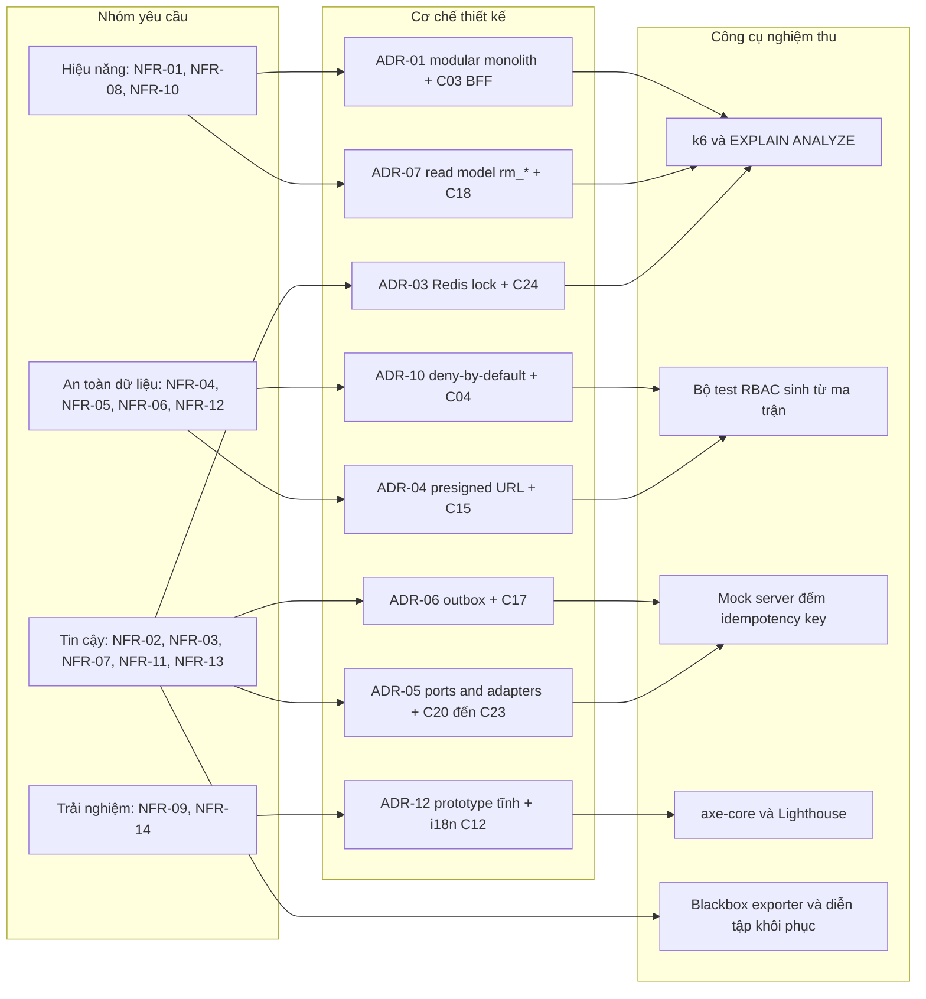

# Đặc tả chi tiết yêu cầu phi chức năng (NFR-01 … NFR-14)

*Phụ lục của Chương 5 — Người phụ trách: D (System & UI Designer). File này là bản khai triển đầy đủ
của bảng NFR rút gọn trong `report/chapter_5_design.md`.*

---

## 0. Mục đích, phạm vi và quy ước của phụ lục

Bảng NFR trong đặc tả gốc (`spec_ats (1).md` mục 11) và trong Chương 2 của A mới dừng ở mức nêu loại
yêu cầu, phần lớn chưa có ngưỡng đo được. Phụ lục này khai triển mỗi yêu cầu thành năm phần: phát biểu
kiểm chứng được, bảng chỉ số kèm ngưỡng, cách đo bằng công cụ và kịch bản cụ thể, cơ chế thiết kế bảo
đảm đạt ngưỡng, và rủi ro kèm phương án dự phòng khi không đạt.

Ba nguyên tắc biên soạn được tuân thủ:

1. **Không đánh số lại.** Mười hai mã NFR-01 … NFR-12 cùng tên nhóm do A phát hành được giữ nguyên;
   D chỉ siết chặt con số và bổ sung điều kiện đo. Hai mã NFR-13 và NFR-14 là phần bổ sung của D, được
   đánh dấu rõ **(D bổ sung — cần A xác nhận)** trong tiêu đề mục và trong Bảng 5.30.
2. **Mọi con số phải truy được nguồn.** Ngưỡng nào lấy từ đặc tả, use case hoặc business rule thì ghi
   mã nguồn gốc; ngưỡng nào do D suy ra từ quy mô hệ thống thì ghi rõ chữ "giả định".
3. **Cơ chế phải trỏ đích danh.** Mục "Cơ chế thiết kế để đạt được" của mỗi NFR chỉ được viện dẫn quyết
   định kiến trúc `ADR-xx` (xem `docs/design_decisions_D.md`), component `C01`–`C24` trong COMP-01
   (`diagrams/D_comp_architecture_v1.md`) và node `N01`–`N14` trong DEP-01
   (`diagrams/D_deploy_topology_v1.md`). Không dùng diễn đạt chung chung kiểu "tối ưu hệ thống".

**Quy ước đánh số:** để không trùng với chính văn Chương 5, phụ lục này dùng dải riêng — hình đánh số
từ `Hình 5.30`, bảng đánh số từ `Bảng 5.30`.

**Quy ước ngưỡng:** *Ngưỡng chấp nhận* là mức phải đạt để tính là thoả NFR; *Ngưỡng cảnh báo* là mức
sớm hơn, dùng cho hệ thống giám sát ở NFR-13 để can thiệp trước khi vi phạm thật sự xảy ra. Mọi chỉ số
thời gian phản hồi đo ở phân vị 95 (p95) trừ khi ghi khác, vì trung bình cộng che mất đuôi chậm mà
người dùng thực sự cảm nhận được.

---

## 1. Bảng tổng hợp

Bảng 5.30 là bản đồ tra cứu nhanh toàn bộ 14 yêu cầu; các mục từ 2 trở đi khai triển từng dòng của bảng
này theo đúng thứ tự.

**Bảng 5.30 — Tổng hợp NFR-01 … NFR-14**

| Mã | Nhóm | Ngưỡng cốt lõi | Cơ chế chính | Cách đo tóm tắt |
|---|---|---|---|---|
| NFR-01 | Hiệu năng danh sách | Kanban/danh sách CV p95 ≤ 2 s với ≤ 500 application/JD; lọc–sắp xếp p95 ≤ 1 s | ADR-01, C03 tổng hợp response, C07 phân trang cursor, index `applications(jd_id, status, applied_at DESC)` | k6 50 VU × 5 phút trên `GET /api/jds/{id}/pipeline`; `EXPLAIN (ANALYZE, BUFFERS)` |
| NFR-02 | Đồng thời | 0 cặp phỏng vấn chồng giờ cho cùng interviewer khi 50 request song song | ADR-03, C24 `LockManager`, C08 kiểm tra overlap trong vùng khoá, ADR-08 | k6 50 VU bắn cùng payload, 20 vòng; truy vấn SQL đếm cặp overlap sau mỗi vòng |
| NFR-03 | Khả dụng | ≥ 99,9 % giờ hành chính (≤ 13 phút/tháng); sàn cam kết ≥ 99 % | N03 Nginx health check, N04 2–6 instance stateless, ADR-02 replica, ADR-03 session Redis | Blackbox exporter poll `/healthz` 30 s; recording rule chỉ tính cửa sổ 8–18 h T2–T6; diễn tập kill container |
| NFR-04 | Xác thực & phân quyền | 100 % endpoint có khai báo quyền; 0 ca vượt quyền trong 182 ca kiểm thử | ADR-10 deny-by-default, C04 `AuthService`, C03 lọc thô, kiểm tra scope tại service | Bộ test tích hợp sinh từ ma trận RBAC; quét tĩnh router trong CI |
| NFR-05 | Quyền riêng tư | 0 ca đọc chéo JD; 100 % lượt mở CV có dòng audit; presigned URL ≤ 10 phút | ADR-04, ADR-10, C15 `FileService`, C06 trả DTO theo scope, C16 `AuditService` | Kịch bản 3 recruiter × 3 JD đọc chéo; đối chiếu `audit_logs`; thử URL hết hạn |
| NFR-06 | Audit | 100 % chuyển trạng thái Application/Offer sinh đúng 1 dòng lịch sử liên tục | C16 `AuditService`, C07 ghi `application_status_history` cùng transaction, ADR-08 | Chạy 12 transition end-to-end rồi kiểm tra chuỗi `from_status`/`to_status`; job đối soát đêm |
| NFR-07 | Sao lưu | RPO ≤ 24 h (thực tế ≤ 5 phút nhờ WAL archive `archive_timeout = 300s`), RTO ≤ 4 h, giữ 30 ngày | N07 → N14 dump + WAL archive, ADR-02 replica nóng, ADR-04 versioning bucket | Diễn tập khôi phục hằng quý trên máy sạch, bấm giờ, đối chiếu 10 truy vấn kiểm chứng |
| NFR-08 | Mở rộng | ≤ 50 JD mở, ≤ 200 ứng viên/JD (≈ 10 000 application); hệ số mở rộng ≥ 0,75 khi 2 → 6 instance | ADR-01 ranh giới module, N04 auto-scale, N05 một worker active, N06 tách reporting | k6 ba mức tải 20/50/100 VU × hai cấu hình instance; đo throughput và p95 |
| NFR-09 | Đa ngôn ngữ | 0 khoá i18n thiếu bản dịch; 0 template active thiếu locale | C12 chọn template theo `(template_key, locale, version, is_active)`, BR-12 | Script CI so khớp `vi.json`/`en.json`; truy vấn `email_templates` theo locale; rà 11 màn |
| NFR-10 | Tách tải báo cáo | 0 kết nối reporting tới primary; p95 ≤ 3 s; tuổi read model ≤ 15 phút | ADR-07 bốn bảng `rm_*`, C18 chỉ đọc, C17 làm mới theo lịch, N06 + N08 | k6 10 VU × 5 phút trên 4 endpoint báo cáo; `pg_stat_activity` trên primary; đo `refreshed_at` |
| NFR-11 | Tin cậy job | 0 email trùng khi replay 1 000 sự kiện; retry ≤ 5 lần, backoff 1–16 phút | ADR-06 outbox + idempotency key, C17 `SchedulerWorker`, C20/C21 adapter theo ADR-05 | Bơm 1 000 sự kiện, `kill -9` giữa chừng, khởi động lại, đếm lời gọi phân biệt ở mock server |
| NFR-12 | Bảo mật file | 0 truy cập bucket không qua chữ ký; URL ≤ 10 phút; 100 % lượt tải có audit | ADR-04, C15 `FileService`, C23 `ObjectStorageAdapter`, N10 MinIO bật SSE + versioning | `curl` trực tiếp vào bucket; thử URL sau 11 phút; upload 12 MB và tệp lệch checksum |
| NFR-13 **(D bổ sung — cần A xác nhận)** | Vận hành / observability | ≥ 99 % dòng log có `correlationId`; cảnh báo ≤ 5 phút khi outbox tồn > 100 hoặc lag replica > 60 s | C03 sinh và truyền `correlationId`, ADR-06 outbox có `status`/`attempt_count`, C17 phơi số liệu | Truy vết một nghiệp vụ xếp lịch qua log tập trung; chèn 150 outbox và `pg_wal_replay_pause()` |
| NFR-14 **(D bổ sung — cần A xác nhận)** | Tiếp cận & trình duyệt | 0 lỗi axe-core mức critical/serious trên 5 màn chính; tương phản ≥ 4,5 : 1; Lighthouse A11y ≥ 90 | Nhãn chữ kèm màu trên kanban, thay thế kéo–thả bằng menu bàn phím, ADR-12 prototype tĩnh | axe DevTools + Lighthouse trên `prototype/index.html`; ba kịch bản thao tác chỉ bằng bàn phím |

Hình 5.30 biểu diễn quan hệ giữa bốn nhóm yêu cầu, cơ chế thiết kế chịu trách nhiệm và công cụ dùng để
nghiệm thu; sơ đồ này giúp thấy vì sao một cơ chế như outbox lại phục vụ đồng thời nhiều NFR.

**Hình 5.30 — Bản đồ nhóm NFR → cơ chế thiết kế → công cụ nghiệm thu**



---

## NFR-01 — Hiệu năng danh sách

### 1. Phát biểu yêu cầu

Màn hình `SCR-03` (JD Detail — Kanban Pipeline) và danh sách CV của một JD phải trả về đầy đủ dữ liệu
hiển thị trong không quá 2 giây ở phân vị 95, khi JD đang chứa tối đa 500 application và hệ thống đang
có 50 JD mở. Thao tác lọc hoặc sắp xếp lại trên tập dữ liệu đã tải phải hoàn tất trong không quá 1 giây
ở phân vị 95. Ngưỡng được đo tại biên `EdgeNode` (N03) trong mạng nội bộ, không tính thời gian mạng
ngoài doanh nghiệp.

### 2. Chỉ số & ngưỡng

Bảng 5.31 cụ thể hoá phát biểu trên thành sáu chỉ số đo được: ba chỉ số đầu là điều kiện nghiệm thu bắt
buộc, ba chỉ số sau dùng để tìm nguyên nhân khi không đạt.

**Bảng 5.31 — Chỉ số và ngưỡng của NFR-01**

| Chỉ số | Ngưỡng chấp nhận | Ngưỡng cảnh báo | Điều kiện đo (tải, dữ liệu) |
|---|---|---|---|
| p95 `GET /api/jds/{id}/pipeline` | ≤ 2 000 ms | > 1 500 ms | 50 virtual user, 5 phút, 50 JD × 500 application |
| p99 `GET /api/jds/{id}/pipeline` | ≤ 4 000 ms | > 3 000 ms | như trên |
| p95 `GET /api/jds/{id}/applications?status=&sort=` | ≤ 1 000 ms | > 700 ms | như trên, bộ lọc theo `status` và `source` |
| Số truy vấn SQL cho một lần dựng kanban | ≤ 6 | > 10 | một request đơn lẻ, bật log truy vấn |
| Kích thước payload một trang kanban | ≤ 350 KB | > 550 KB | 7 cột × 50 thẻ đầu tiên |
| Time to Interactive của `SCR-03` trên trình duyệt | ≤ 2 500 ms | > 2 000 ms | Chrome, mạng LAN, máy cấu hình văn phòng phổ thông |

### 3. Cách đo

Kịch bản k6: 50 virtual user, ramp-up 30 giây, giữ tải 5 phút, mỗi user lặp chuỗi "mở kanban của một JD
ngẫu nhiên trong 50 JD → lọc theo `status = INTERVIEWING` → sắp xếp theo `applied_at`". Dữ liệu nền được
seed đúng giả định quy mô ở `spec_ats (1).md` mục 15: 50 JD mở, mỗi JD 500 application (tổng 25 000 dòng
`applications`), 60 người dùng nội bộ, khoảng 120 000 dòng `application_status_history` (giả định trung
bình 12 lần chuyển trạng thái cho mỗi application). Chỉ số lấy từ `http_req_duration` theo từng nhãn
endpoint.

Song song, mỗi truy vấn kanban được chạy thủ công với `EXPLAIN (ANALYZE, BUFFERS)` trên `psql` để xác
nhận kế hoạch thực thi dùng index composite `applications(jd_id, status, applied_at DESC)` mà D đề xuất
bổ sung (xem `docs/design_decisions_D.md` mục 4), chứ không rơi vào `Seq Scan`. Phía trình duyệt, Time
to Interactive đo bằng Lighthouse ở chế độ desktop trên `SCR-03` của `prototype/index.html` và trên bản
dựng thật khi có.

### 4. Cơ chế thiết kế để đạt được

`ADR-01` chọn modular monolith nên toàn bộ chuỗi gọi phục vụ một lần dựng kanban nằm trong cùng tiến
trình `ats-api`; không có bước gọi mạng giữa các module, nhờ đó phần lớn ngân sách 2 giây dành cho truy
vấn dữ liệu chứ không bị chia cho các chặng nội bộ. `ApiGateway` (C03) đóng vai backend-for-frontend:
một request `GET /api/jds/{id}/pipeline` được tổng hợp sẵn tại tầng gateway thành một response chứa
thông tin JD, bảy cột trạng thái và thẻ ứng viên, thay vì để trình duyệt gọi năm endpoint rời rạc rồi
tự ghép. `ApplicationService` (C07) phân trang theo cursor 50 thẻ mỗi cột và chỉ trả các trường cần cho
thẻ, tránh nạp `parsed_profile` kiểu JSONB vốn nặng. Cột denormalize `applications.current_round` do C
thiết kế (`report/chapter_4_data.md` mục 4.6.2) loại bỏ phép `MAX(interviews.round_order)` cho từng dòng,
đúng lý do C đã nêu là màn kanban của D render hàng trăm application một lúc. Ở tầng triển khai,
`AppServerNode` (N04) chạy 2 instance và tự mở rộng tới 6 khi CPU vượt 70 %, nên tải đọc tăng đột biến
không đẩy p95 vượt ngưỡng.

### 5. Rủi ro nếu không đạt & phương án dự phòng

Kanban là màn hình Recruiter mở nhiều lần mỗi ngày; nếu p95 vượt 2 giây thì thao tác kéo–thả trở nên
giật, người dùng quay lại thói quen quản lý bằng bảng tính — đúng hiện trạng mà mục tiêu hệ thống ở
`spec_ats (1).md` mục 1.2 muốn xoá bỏ. Ba lớp dự phòng theo thứ tự chi phí tăng dần: giới hạn cứng 50
thẻ mỗi cột kèm nút "tải thêm" để chặn payload phình theo dữ liệu; thêm cache Redis theo khoá `jd_id`
với TTL 30 giây, xoá cache ngay khi có transition ghi vào `application_status_history`; cuối cùng, dựng
một materialized view `rm_pipeline_card` làm mới mỗi phút theo đúng mô hình read model của `ADR-07`,
chấp nhận độ trễ hiển thị đổi lấy thời gian phản hồi ổn định.

---

## NFR-02 — Đồng thời

### 1. Phát biểu yêu cầu

Khi từ hai Recruiter trở lên cùng đặt một interviewer vào các khung giờ chồng lấn, hệ thống phải tạo
thành công đúng một bản ghi `Interview`; các request còn lại nhận mã lỗi 409 kèm ba khung giờ trống được
gợi ý. Sau mọi phiên kiểm thử, cơ sở dữ liệu không được tồn tại cặp `Interview` chồng giờ cho cùng một
interviewer, trừ trường hợp Recruiter chủ động override và đã ghi lý do vào `audit_logs`.

### 2. Chỉ số & ngưỡng

Bảng 5.32 tách yêu cầu thành hai nhóm chỉ số: nhóm kết quả (không tồn tại cặp lịch chồng giờ) và nhóm cơ
chế (hành vi của khoá phân tán). Chỉ đo kết quả thì khi bài test đạt cũng không biết là nhờ cơ chế khoá
hay nhờ may mắn về thời điểm.

**Bảng 5.32 — Chỉ số và ngưỡng của NFR-02**

| Chỉ số | Ngưỡng chấp nhận | Ngưỡng cảnh báo | Điều kiện đo (tải, dữ liệu) |
|---|---|---|---|
| Số cặp `Interview` chồng giờ cùng interviewer (không override) | 0 | ≥ 1 | 50 request song song cùng payload, lặp 20 vòng |
| Số request thắng khoá trên mỗi vòng | đúng 1 | ≠ 1 | như trên |
| p95 thời gian giữ khoá của một lần xếp lịch | ≤ 300 ms | > 800 ms | TTL khoá 120 s |
| Tỷ lệ khoá hết hạn trước khi commit | 0 % | > 0,1 % | như trên |
| Tỷ lệ response 409 có kèm đúng 3 slot gợi ý | 100 % | < 100 % | như trên |
| p95 `POST /api/interviews` khi không xung đột | ≤ 1 200 ms | > 900 ms | 20 virtual user, 5 phút |

### 3. Cách đo

Kịch bản k6 dạng "bão đồng thời": 50 virtual user cùng gửi `POST /api/interviews` với **cùng**
`interviewer_id` (Vũ Ngọc Lan) và **cùng** `scheduled_at`, dồn trong một giây, lặp 20 vòng, mỗi vòng dùng
một khung giờ mới để không lẫn dữ liệu. Sau mỗi vòng, chạy truy vấn kiểm chứng đếm số cặp chồng giờ theo
đúng quy tắc overlap `newStart < existingEnd AND newEnd > existingStart`:

```sql
SELECT count(*)
FROM interviews i1
JOIN interview_participants p1 ON p1.interview_id = i1.id
JOIN interview_participants p2 ON p2.interviewer_id = p1.interviewer_id
JOIN interviews i2 ON i2.id = p2.interview_id AND i2.id <> i1.id
WHERE i1.status <> 'CANCELLED' AND i2.status <> 'CANCELLED'
  AND i1.scheduled_at < i2.scheduled_at + (i2.duration_min * INTERVAL '1 minute')
  AND i1.scheduled_at + (i1.duration_min * INTERVAL '1 minute') > i2.scheduled_at;
```

Kết quả bắt buộc bằng 0. Bổ sung hai bài kiểm thử tình huống xấu bằng Testcontainers: ngắt Redis giữa
lúc đang giữ khoá để xác nhận hệ thống hạ cấp đúng cách thay vì ghi bừa; và giả lập một tiến trình treo
quá TTL 120 giây để xác nhận khoá được nhả và không có bản ghi mồ côi.

### 4. Cơ chế thiết kế để đạt được

`ADR-03` chọn Redis làm nơi giữ khoá phân tán theo cặp `(interviewer_id, time_slot)`; `LockManager` (C24)
bọc thao tác này thành `acquire(interviewerId, slotKey, ttl=120s)` kèm gia hạn và nhả an toàn.
`SchedulingService` (C08) thực hiện đúng trình tự bắt buộc nêu ở mục 6.1 hợp đồng thiết kế: lấy khoá →
truy vấn overlap trên `interviews` JOIN `interview_participants` → mở transaction → INSERT → nhả khoá.
Điểm mấu chốt là **phép kiểm tra xung đột và phép ghi nằm trong cùng một vùng khoá**; nếu kiểm tra nằm
ngoài, hai request vẫn có thể cùng đọc "không xung đột" rồi cùng ghi. `ADR-08` bổ sung cột `version` cho
optimistic locking, chặn trường hợp hai người cùng sửa một buổi phỏng vấn đã tồn tại. Index tổ hợp
`interviews(scheduled_at, status)` mà D đề xuất bổ sung, kết hợp với index `idx_ipart_interviewer_id`
đã có sẵn trên `interview_participants(interviewer_id)`, giữ cho truy vấn overlap trong vùng khoá đủ
nhanh để thời gian giữ khoá không vượt 300 ms.

Về ngữ nghĩa biên: quy tắc `newStart < existingEnd AND newEnd > existingStart` dùng **so sánh nghiêm
ngặt ở cả hai vế**, nên nó phủ đủ bốn kiểu chồng lấn — chồng một phần đầu, chồng một phần cuối, lồng
hoàn toàn và trùng khít — đồng thời **cố ý** loại trừ hai buổi nối đuôi nhau. Khi buổi trước kết thúc
đúng lúc buổi sau bắt đầu thì `newStart = existingEnd` làm vế thứ nhất sai, nên 14:00–15:00 và
15:00–16:00 **không** bị coi là xung đột: hai buổi chạm nhau tại đúng một điểm thời gian không chiếm
cùng một khoảng nào của interviewer. Truy vấn kiểm chứng ở mục 3 dùng đúng cặp toán tử này.

Cách tiếp cận này khớp đúng ghi chú của B ở `report/chapter_3_behavior.md` mục 3.5.4 ("race condition
được xử lý bằng lock Redis trong service trước khi ghi DB") và ghi chú của C ở `sql/schema.sql` mục 1
(BR-03 không biểu diễn được bằng `CHECK` constraint).

### 5. Rủi ro nếu không đạt & phương án dự phòng

Một interviewer bị đặt trùng hai buổi là lỗi nhìn thấy được từ bên ngoài doanh nghiệp: ứng viên tới nơi
mà không có người phỏng vấn. Đây cũng chính là điểm đau được nêu ở `spec_ats (1).md` mục 1.1. Phương án
dự phòng khi Redis không sẵn sàng: `SchedulingService` hạ cấp sang khoá hàng của PostgreSQL bằng
`SELECT ... FROM users WHERE id = :interviewerId FOR UPDATE` trong cùng transaction ghi — vẫn tuần tự
hoá được theo từng interviewer, đổi lại throughput giảm và không dùng lại được khi mở rộng ngang mạnh.
Sự kiện hạ cấp phải phát cảnh báo theo NFR-13. Nếu vẫn phát hiện cặp trùng trong dữ liệu thật, job đối
soát hằng đêm của `SchedulerWorker` (C17) quét toàn bộ buổi phỏng vấn trong 14 ngày tới, đánh dấu cặp
chồng giờ và gửi thông báo cho Recruiter phụ trách xử lý thủ công.

---

## NFR-03 — Khả dụng

### 1. Phát biểu yêu cầu

Trong khung giờ làm việc 8:00–18:00 các ngày Thứ Hai đến Thứ Sáu, hệ thống phải sẵn sàng phục vụ với tỷ
lệ không thấp hơn 99,9 %, tương đương tổng thời gian gián đoạn không quá 13 phút mỗi tháng trên cửa sổ
đo khoảng 220 giờ. Mọi đợt bảo trì có kế hoạch phải được thông báo trước ít nhất 24 giờ và đặt ngoài
khung giờ nêu trên. Một lần gián đoạn đơn lẻ không được kéo dài quá 5 phút.

> **Ghi chú số học cần A xác nhận.** Bảng NFR gốc ghi đồng thời "≥ 99 %" và "≤ 13 phút downtime/tháng".
> Hai con số này không khớp nhau: cửa sổ giờ hành chính khoảng 22 ngày × 10 giờ = 220 giờ mỗi tháng, nên
> 99 % tương ứng 132 phút, còn 13 phút tương ứng 99,9 %. D giữ nguyên mã và tên nhóm NFR-03, đồng thời
> chọn cách hiểu chặt hơn: **13 phút là ngưỡng vận hành nội bộ (99,9 %)**, còn **99 % là sàn cam kết tối
> thiểu** không được phá. Điểm này được đưa vào checklist Sync S4 trong `docs/design_decisions_D.md`.

### 2. Chỉ số & ngưỡng

Bảng 5.33 ghi đồng thời ngưỡng vận hành mà D siết lại và sàn cam kết gốc của A, để hai con số nêu trong
ghi chú trên đều có vị trí rõ ràng thay vì loại trừ lẫn nhau.

**Bảng 5.33 — Chỉ số và ngưỡng của NFR-03**

| Chỉ số | Ngưỡng chấp nhận | Ngưỡng cảnh báo | Điều kiện đo (tải, dữ liệu) |
|---|---|---|---|
| Uptime trong cửa sổ 8–18 h T2–T6 | ≥ 99,9 % (≤ 13 phút/tháng) | < 99,95 % (> 6,6 phút/tháng) | poll `/healthz` mỗi 30 s từ 2 điểm quan trắc |
| Sàn cam kết tối thiểu | ≥ 99 % (≤ 132 phút/tháng) | < 99,5 % | như trên |
| Thời lượng một lần gián đoạn | ≤ 5 phút | > 3 phút | tính từ lần poll fail đầu tiên |
| MTTR cho sự cố mức nghiêm trọng | ≤ 30 phút | > 20 phút | thống kê theo tháng |
| Thời gian `EdgeNode` loại một instance lỗi | ≤ 20 s | > 30 s | health check 5 s, 3 lần fail liên tiếp |
| Tỷ lệ đợt bảo trì thông báo trước ≥ 24 h | 100 % | < 100 % | thống kê theo quý |

### 3. Cách đo

Giám sát chủ động bằng Prometheus Blackbox Exporter (hoặc Uptime Kuma nếu triển khai gọn) poll endpoint
`/healthz` của `ats-api` mỗi 30 giây từ hai điểm quan trắc khác nhau, tránh kết luận sai do sự cố mạng
cục bộ của một điểm. Uptime chỉ được tính trên cửa sổ giờ hành chính bằng recording rule lọc theo nhãn
thời gian, chứ không lấy trung bình cả tháng — nếu lấy cả tháng thì downtime lúc 2 giờ sáng sẽ bị tính
oan vào chỉ tiêu.

Bên cạnh đo thụ động, mỗi quý thực hiện một diễn tập chủ động: dừng đột ngột một trong hai container
`ats-api` bằng `docker kill`, đồng thời chạy k6 ở mức 20 virtual user để có tải nền, rồi đo hai đại
lượng — số request lỗi trong cửa sổ chuyển đổi và thời gian tới khi Nginx ngừng định tuyến vào node
chết. Diễn tập thứ hai kiểm chứng phiên đăng nhập: người dùng đang thao tác trên instance bị dừng phải
tiếp tục làm việc mà không bị đăng xuất.

### 4. Cơ chế thiết kế để đạt được

`EdgeNode` (N03) chạy Nginx làm điểm kết thúc TLS và cân bằng tải, cấu hình health check chủ động để
loại instance lỗi sau ba lần thất bại liên tiếp. `AppServerNode` (N04) chạy tối thiểu 2 instance, nên
việc mất một instance chỉ làm giảm năng lực chứ không làm dừng dịch vụ; nhờ `ADR-03` đặt session trong
Redis, các instance hoàn toàn stateless và người dùng không bị đăng xuất khi request được chuyển sang
instance còn lại. `ADR-02` duy trì một streaming replica (N08) luôn sẵn sàng promote khi primary hỏng.
Triển khai theo kiểu rolling: cập nhật lần lượt từng instance nên nâng cấp phiên bản không tạo downtime,
điều này giữ cho "bảo trì có kế hoạch" hầu như không tiêu tốn ngân sách 13 phút.

### 5. Rủi ro nếu không đạt & phương án dự phòng

Gián đoạn trong giờ hành chính rơi đúng vào lúc Recruiter cần xếp lịch và Interviewer cần nộp feedback
trước hạn 48 giờ của BR-06, nên hệ quả lan sang các SLA nghiệp vụ khác chứ không dừng ở phiền toái.
Phương án dự phòng gồm ba lớp: chế độ chỉ-đọc — khi primary lỗi, `ApiGateway` chuyển toàn bộ endpoint
`GET` sang replica và trả 503 kèm thông báo tiếng Việt cho các thao tác ghi, để Hiring Manager vẫn xem
được hồ sơ trong lúc chờ khôi phục; cửa sổ bảo trì cố định 20:00–22:00 kèm banner thông báo hiện trước
24 giờ trên mọi màn hình; và quy trình promote replica thủ công có kịch bản viết sẵn để MTTR không phụ
thuộc vào việc ai trực hôm đó.

---

## NFR-04 — Xác thực & phân quyền

### 1. Phát biểu yêu cầu

Toàn bộ endpoint nghiệp vụ chỉ phục vụ request mang token hợp lệ do `IdentityProvider` cấp qua luồng
OIDC, hoặc token cổng ứng viên còn hiệu lực. Quyền truy cập được quyết định theo ma trận sáu vai trò nội
bộ nhân với phạm vi phòng ban, theo nguyên tắc từ chối mặc định: endpoint nào chưa khai báo quyền thì
trả 403 chứ không mở. Không endpoint nào được phép ra bản dựng chính thức khi thiếu khai báo quyền.

### 2. Chỉ số & ngưỡng

Bảng 5.34 đo yêu cầu theo hai hướng đối xứng: hệ thống không được cho phép vượt quyền, và cũng không được
từ chối nhầm người vốn có quyền — cả hai đều là lỗi phân quyền.

**Bảng 5.34 — Chỉ số và ngưỡng của NFR-04**

| Chỉ số | Ngưỡng chấp nhận | Ngưỡng cảnh báo | Điều kiện đo (tải, dữ liệu) |
|---|---|---|---|
| Tỷ lệ endpoint có khai báo quyền | 100 % | < 100 % | quét tĩnh toàn bộ router ở mỗi lần build |
| Số ca trả 200 cho chủ thể không có quyền | 0 | ≥ 1 | 182 ca kiểm thử (91 ô ma trận × trong/ngoài scope) |
| Số ca trả 403 nhầm cho chủ thể có quyền | 0 | ≥ 1 | như trên |
| Độ trễ phát hiện token đã thu hồi | ≤ 60 s | > 120 s | vô hiệu hoá tài khoản rồi gọi API liên tục |
| p95 chi phí kiểm tra quyền trên mỗi request | ≤ 15 ms | > 30 ms | 50 virtual user, 5 phút |
| Tỷ lệ đăng nhập của tài khoản `is_active = false` bị chặn | 100 % | < 100 % | 10 lần thử với tài khoản khoá |

### 3. Cách đo

Bộ kiểm thử tích hợp được **sinh tự động từ ma trận RBAC** trong `docs/design_decisions_D.md` mục 5: mỗi
ô của ma trận (13 tài nguyên × 7 chủ thể) sinh ra hai ca — một ca trong phạm vi phòng ban/JD được giao,
một ca ngoài phạm vi — cộng lại 182 ca, chạy trong CI ở mỗi pull request. Mỗi ca gọi endpoint tương ứng
bằng token của vai trò đó và khẳng định mã HTTP kỳ vọng: `F` kỳ vọng 200 cho cả đọc lẫn ghi, `R` kỳ vọng
200 khi đọc và 403 khi ghi, `—` kỳ vọng 403.

Bổ sung một script quét tĩnh duyệt bảng định tuyến của `ats-api`, liệt kê mọi handler thiếu khai báo
`@RequirePermission` và làm hỏng bản build nếu danh sách khác rỗng — đây là cách duy nhất bảo đảm chỉ số
"100 % endpoint" không bị bào mòn theo thời gian khi có người thêm endpoint mới. Kiểm thử thủ công luồng
OIDC dùng tài khoản `@vxtech.vn` bị đặt `is_active = false` để xác nhận hệ thống chặn ở tầng
`AuthService` chứ không chỉ dựa vào IdP.

### 4. Cơ chế thiết kế để đạt được

`ADR-10` chốt nguyên tắc từ chối mặc định và kiểm tra hai tầng. Tầng thứ nhất, `ApiGateway` (C03) xác
thực token, lọc thô theo vai trò và chặn sớm các request rõ ràng không hợp lệ, đồng thời áp rate-limit.
Tầng thứ hai, mỗi service kiểm tra quyền sở hữu và phạm vi trên chính dữ liệu được yêu cầu: `JdService`
(C05) so `job_descriptions.recruiter_id` và `hiring_manager_id` với chủ thể gọi, `ApplicationService`
(C07) suy phạm vi phòng ban qua `job_descriptions.department_id`. Việc tách hai tầng là cần thiết vì
gateway không biết dữ liệu cụ thể, còn service không nên gánh việc xác thực token. `AuthService` (C04)
cung cấp `IIdentity` và `IAccessControl`, là nơi duy nhất giải quyết vai trò và phạm vi;
`IdentityAdapter` (C22) nói chuyện với Google Workspace OIDC theo `ADR-05` nên có thể thay bằng mock khi
demo. `ADR-09` tách hẳn phiên ứng viên khỏi phiên người dùng nội bộ, tránh việc một token cổng ứng viên
vô tình chạm được endpoint nội bộ.

### 5. Rủi ro nếu không đạt & phương án dự phòng

Lỗ hổng phân quyền kéo theo vi phạm NFR-05 và làm mất giá trị của toàn bộ audit ở NFR-06, vì khi đó
không phân biệt được thao tác hợp lệ với thao tác vượt quyền. Ba biện pháp dự phòng: mặc định trả 403
cho mọi endpoint chưa khai báo, nên sai sót lập trình dẫn tới "thiếu quyền" chứ không dẫn tới "thừa
quyền"; ghi `audit_logs` với `action = 'ACCESS_DENIED'` và cảnh báo khi một tài khoản bị từ chối quá 20
lần trong 10 phút, dấu hiệu của việc dò quét; và bật tính năng mới sau cờ điều khiển, chỉ mở cho HR
Admin trong giai đoạn đầu để giới hạn phạm vi ảnh hưởng nếu khai báo quyền còn thiếu.

---

## NFR-05 — Quyền riêng tư

### 1. Phát biểu yêu cầu

Bản CV đầy đủ và thông tin liên hệ của ứng viên chỉ được truy cập bởi Recruiter phụ trách JD, Hiring
Manager của JD, HR Admin và Head of HR. Interviewer chỉ đọc được gói thông tin của đúng buổi phỏng vấn
được giao theo BR-20, không thấy thông tin liên hệ và không thấy các application khác của cùng ứng viên.
Mọi lượt xem và tải CV đều sinh bản ghi audit kèm danh tính người thực hiện.

### 2. Chỉ số & ngưỡng

Bảng 5.35 chuyển các ràng buộc của BR-20 thành chỉ số đếm được, thay cho phát biểu định tính kiểu "dữ
liệu ứng viên được bảo vệ" vốn không kiểm chứng được.

**Bảng 5.35 — Chỉ số và ngưỡng của NFR-05**

| Chỉ số | Ngưỡng chấp nhận | Ngưỡng cảnh báo | Điều kiện đo (tải, dữ liệu) |
|---|---|---|---|
| Số ca Recruiter đọc được hồ sơ của JD không phụ trách | 0 | ≥ 1 | 3 recruiter × 3 JD, 18 ca đọc chéo |
| Số ca Interviewer đọc được buổi phỏng vấn không được giao | 0 | ≥ 1 | 1 interviewer × 5 buổi, trong đó 2 buổi được giao |
| Tỷ lệ trường nhạy cảm bị che khi ngoài phạm vi | 100 % | < 100 % | email, điện thoại, công ty hiện tại, mức lương hiện tại |
| Tỷ lệ lượt mở/tải CV có dòng `audit_logs` | 100 % | < 99,9 % | 1 ngày dữ liệu demo |
| Thời hạn hiệu lực presigned URL | ≤ 600 s | > 600 s | kiểm tra tham số ký |
| Số lượt tải CV của một tài khoản trong ngày | ≤ 50 | > 30 | thống kê theo ngày |

### 3. Cách đo

Kịch bản đọc chéo dùng đúng dữ liệu mẫu đã chốt: Nguyễn Minh Anh phụ trách JD `Senior Backend Engineer
(Java)`, hai tài khoản Recruiter giả lập phụ trách `Data Engineer` và `AI Engineer`. Mỗi tài khoản lần
lượt gọi `GET /api/candidates/{id}`, `GET /api/applications/{id}` và
`GET /api/attachments/{id}/download` cho ứng viên của hai JD còn lại; kỳ vọng toàn bộ trả 403. Với
Interviewer Vũ Ngọc Lan, kịch bản gọi `GET /api/interviews/{id}/packet` cho năm buổi, trong đó chỉ hai
buổi được giao; ba buổi còn lại phải trả 403, và ngay cả với hai buổi hợp lệ, response phải không chứa
`email`, `phone` của ứng viên.

Sau mỗi ca hợp lệ, đối chiếu số dòng audit:

```sql
SELECT count(*) FROM audit_logs
WHERE action IN ('CV_VIEW', 'CV_DOWNLOAD') AND entity_type = 'Attachment'
  AND created_at >= :startOfTest;
```

Số dòng phải bằng số lần mở/tải thực tế. Cuối cùng, lấy một presigned URL, chờ 11 phút rồi gọi lại để
xác nhận MinIO trả 403 do chữ ký hết hạn.

### 4. Cơ chế thiết kế để đạt được

`ADR-04` đặt tệp CV trong object storage riêng, bucket `ats-cv` không mở công khai, nên không tồn tại
đường dẫn đoán được. `FileService` (C15) là cửa duy nhất cấp presigned GET với thời hạn 10 phút, và chỉ
cấp sau khi `AuthService` (C04) xác nhận chủ thể nằm trong phạm vi của application tương ứng.
`CandidateService` (C06) không trả một thực thể chung cho mọi vai trò mà trả các DTO khác nhau: bản đầy
đủ cho Recruiter phụ trách và Hiring Manager, bản rút gọn không có thông tin liên hệ cho Interviewer.
Cách làm này quan trọng vì che dữ liệu ở tầng giao diện là không đủ — chỉ cần mở tab mạng của trình
duyệt là thấy trường bị ẩn. `AuditService` (C16) ghi `audit_logs` cho mọi lượt cấp URL, nên chỉ số "100 %
lượt tải có audit" được bảo đảm ở đúng nơi phát sinh hành vi thay vì phụ thuộc lời gọi rải rác.

### 5. Rủi ro nếu không đạt & phương án dự phòng

Rò rỉ hồ sơ ứng viên gây thiệt hại kép: ứng viên mất niềm tin vào kênh tuyển dụng, và doanh nghiệp đối
mặt rủi ro pháp lý về bảo vệ dữ liệu cá nhân (giả định bối cảnh áp dụng quy định hiện hành của Việt Nam
về dữ liệu cá nhân). Dự phòng gồm: đóng dấu chìm động tên và thời điểm người xem lên bản xem trước PDF,
để nếu ảnh chụp màn hình bị phát tán thì truy được nguồn; hạn mức 50 lượt tải CV mỗi người mỗi ngày,
vượt hạn thì khoá mềm và thông báo HR Admin; và quy trình "quyền được lãng quên" theo hướng ẩn danh hoá
thay vì xoá cứng, đúng gợi ý ở `spec_ats (1).md` mục 15 để không phá vỡ số liệu báo cáo của NFR-10.

---

## NFR-06 — Audit

### 1. Phát biểu yêu cầu

Mỗi lần `Application` hoặc `Offer` đổi trạng thái, hệ thống sinh đúng một dòng lịch sử ghi lại trạng thái
trước, trạng thái sau, danh tính người thực hiện (hoặc đánh dấu là tiến trình hệ thống), thời điểm và
payload liên quan. Chuỗi lịch sử của một application phải liên tục: trạng thái sau của dòng thứ n bằng
trạng thái trước của dòng thứ n+1. Bản ghi lịch sử chỉ được thêm mới, không được sửa hoặc xoá bởi tài
khoản ứng dụng.

### 2. Chỉ số & ngưỡng

Bảng 5.36 đo tính liên tục của chuỗi lịch sử chứ không chỉ đếm số dòng, vì những bản ghi rời rạc không
đủ để tái dựng lại một quyết định tuyển dụng khi có khiếu nại.

**Bảng 5.36 — Chỉ số và ngưỡng của NFR-06**

| Chỉ số | Ngưỡng chấp nhận | Ngưỡng cảnh báo | Điều kiện đo (tải, dữ liệu) |
|---|---|---|---|
| Số lần chuyển trạng thái không có dòng lịch sử | 0 | ≥ 1 | kịch bản end-to-end 12 transition |
| Số điểm đứt gãy trong chuỗi `from_status`/`to_status` | 0 | ≥ 1 | toàn bộ application trong dataset demo |
| Tỷ lệ dòng lịch sử có `actor_id` NULL | ≤ tỷ lệ transition do cron (≈ 25 %, giả định) | > 40 % | thống kê 30 ngày |
| p95 truy vấn lịch sử một application | ≤ 300 ms | > 200 ms | dataset 120 000 dòng lịch sử |
| Số thao tác UPDATE/DELETE thành công trên bảng append-only | 0 | ≥ 1 | thử bằng tài khoản ứng dụng |
| Độ lệch giữa số transition trong log ứng dụng và số dòng lịch sử | 0 | ≥ 1 | đối soát hằng đêm |

### 3. Cách đo

Chạy kịch bản end-to-end trên dữ liệu mẫu: ứng viên Hoàng Thị Mai Chi đi trọn vòng đời từ `NEW` tới
`HIRED` qua 12 lần chuyển trạng thái, bao gồm một nhánh `NEED_RESCHEDULE` và một lần offer bị
`REQUEST_CHANGE`. Sau đó truy vấn:

```sql
SELECT from_status, to_status, actor_id, changed_at
FROM application_status_history
WHERE application_id = :appId
ORDER BY changed_at;
```

Kết quả phải ra đúng 12 dòng và chuỗi trạng thái phải khớp đầu–cuối. Kiểm thử tiêu cực: dùng tài khoản
kết nối của ứng dụng thực hiện `UPDATE applications SET status = 'HIRED'` trực tiếp và
`DELETE FROM application_status_history` — cả hai phải thất bại do thiếu quyền ở tầng cơ sở dữ liệu.
Cuối cùng, chọn ngẫu nhiên 30 dòng `audit_logs` và tìm lại bằng `correlationId` trong log ứng dụng
(NFR-13) để xác nhận hai nguồn khớp nhau.

### 4. Cơ chế thiết kế để đạt được

`AuditService` (C16) là component duy nhất được phép ghi `audit_logs` và `application_status_history`,
theo đúng bảng phân quyền ghi ở mục 2.7 hợp đồng thiết kế; các service khác gọi qua cổng `IAudit` chứ
không tự chèn dòng. `ApplicationService` (C07) gọi `recordStatusChange(to, actor)` — phương thức đã có
trong Class Diagram của C (`report/chapter_4_data.md` mục 4.3) — **bên trong cùng transaction** với lệnh
cập nhật `applications.status`; nhờ đó không tồn tại trạng thái trung gian mà status đã đổi nhưng lịch
sử chưa ghi, kể cả khi tiến trình chết giữa chừng. `ADR-08` bổ sung cột `version` để hai người thao tác
song song không ghi đè mù lên nhau, tránh mất một transition. Ở tầng cơ sở dữ liệu, tài khoản ứng dụng
chỉ có quyền `INSERT`/`SELECT` trên hai bảng append-only, theo đúng quy ước bảng append-only mà C ghi ở
`sql/schema.sql` ghi chú 5c.

### 5. Rủi ro nếu không đạt & phương án dự phòng

Thiếu audit đồng nghĩa với việc không giải trình được quyết định loại một ứng viên khi có khiếu nại, và
làm sai lệch toàn bộ chỉ số time-in-stage của NFR-10 vì read model `rm_funnel_daily` lấy nguồn từ chính
`application_status_history`. Dự phòng: job đối soát hằng đêm của `SchedulerWorker` (C17) so
`applications.updated_at` với `changed_at` của dòng lịch sử mới nhất, phát hiện lệch thì tạo cảnh báo và
dựng lại dòng thiếu từ `audit_logs`; xuất bản sao audit hằng tuần sang vùng lưu trữ chỉ-ghi trên
`BackupStorage` (N14) để bản gốc dù bị can thiệp vẫn còn đối chứng.

---

## NFR-07 — Sao lưu

### 1. Phát biểu yêu cầu

Dữ liệu nghiệp vụ được sao lưu sao cho lượng dữ liệu mất tối đa khi xảy ra sự cố không vượt quá 24 giờ,
và trên thực tế không vượt quá 5 phút nhờ lưu trữ WAL liên tục với `archive_timeout = 300s`, đúng tham
số hạ tầng ghi ở Bảng 5.16 của `diagrams/D_deploy_topology_v1.md`. Thời gian khôi phục dịch vụ tới trạng
thái phục vụ được không vượt quá 4 giờ. Bản sao lưu được giữ 30 ngày và bucket chứa CV bật versioning để
khôi phục được tệp bị ghi đè hoặc xoá nhầm.

### 2. Chỉ số & ngưỡng

Bảng 5.37 phân biệt rõ hai đại lượng hay bị dùng lẫn: RPO là lượng dữ liệu chấp nhận mất, còn RTO là
khoảng thời gian chấp nhận mất dịch vụ.

**Bảng 5.37 — Chỉ số và ngưỡng của NFR-07**

| Chỉ số | Ngưỡng chấp nhận | Ngưỡng cảnh báo | Điều kiện đo (tải, dữ liệu) |
|---|---|---|---|
| Tuổi bản sao lưu đầy đủ mới nhất | ≤ 24 h | > 26 h | kiểm tra hằng ngày lúc 9:00 |
| RPO thực tế (khoảng cách WAL cuối cùng) | ≤ 5 phút | > 10 phút | đo liên tục |
| RTO đo trong diễn tập | ≤ 4 h | > 3 h | diễn tập hằng quý trên máy sạch |
| Tỷ lệ bản sao lưu vượt qua kiểm tra tính toàn vẹn | 100 % | < 100 % | verify tự động sau mỗi lần dump |
| Số ngày lưu trữ | 30 | < 30 | chính sách vòng đời của `BackupStorage` |
| Tỷ lệ tệp CV khôi phục được từ phiên bản cũ | 100 % | < 100 % | thử xoá và khôi phục 10 tệp |

### 3. Cách đo

Diễn tập khôi phục hằng quý theo kịch bản viết sẵn: dựng một PostgreSQL 16 rỗng trên máy sạch, nạp bản
`pg_dump` gần nhất rồi replay WAL tới thời điểm mục tiêu, khởi động `ats-api` trỏ vào cơ sở dữ liệu mới,
bấm giờ từ lúc bắt đầu tới lúc màn hình `SCR-02` hiển thị đúng dữ liệu. Sau khôi phục, chạy bộ mười câu
truy vấn kiểm chứng và so với bản gốc: đếm số bảng (phải bằng 18), đếm dòng của `applications`,
`interviews`, `offers`, `application_status_history`, phân bố `applications.status`, tổng
`offers.salary`, và giá trị `id` lớn nhất của mỗi bảng chính. Toàn bộ kết quả và mốc thời gian ghi vào
biên bản diễn tập.

Với tệp CV: xoá một object trong bucket `ats-cv`, khôi phục từ phiên bản trước bằng API versioning của
MinIO, rồi so checksum SHA-256 của object vừa khôi phục với checksum của phiên bản tương ứng trên bản
mirror ở N14 để xác nhận đúng nội dung — `attachments` không có cột checksum nên giá trị đối chiếu được
lấy từ metadata của object qua `StoragePort.checksum(ObjectKey)`.

### 4. Cơ chế thiết kế để đạt được

`DbPrimaryNode` (N07) thực hiện `pg_dump` hằng đêm và lưu trữ WAL liên tục sang `BackupStorage` (N14);
chính cơ chế WAL archive với `archive_timeout = 300s` là thứ kéo RPO thực tế xuống 5 phút dù cam kết chỉ là 24 giờ. `ADR-02` duy trì
streaming replica (N08) đóng vai bản sao nóng — trong nhiều tình huống, promote replica là con đường
khôi phục nhanh hơn nhiều so với nạp dump. `ADR-04` cùng `ObjectStorageNode` (N10) bật versioning và sao
chép sang N14, nên tệp CV có hai lớp bảo vệ độc lập với cơ sở dữ liệu. Chính sách vòng đời 30 ngày đặt ở
tầng lưu trữ chứ không ở script, tránh trường hợp script hỏng âm thầm mà không ai biết.

### 5. Rủi ro nếu không đạt & phương án dự phòng

Mất dữ liệu tuyển dụng nhiều tháng đồng nghĩa với mất toàn bộ lịch sử phỏng vấn và cơ sở tính báo cáo,
và không thể tái tạo vì thông tin nằm ở nhiều người. Nếu diễn tập cho thấy RTO vượt 4 giờ, phương án
nâng cấp là chuyển con đường khôi phục chính sang promote replica (RTO xuống mức phút) và giữ dump làm
lớp phòng thủ thứ hai cho tình huống hỏng logic dữ liệu — vốn là tình huống mà replica không cứu được vì
đã sao chép cả lỗi. Thêm một bản dump ngoại vi lưu ngoài hạ tầng chính, để sự cố toàn trung tâm dữ liệu
vẫn còn đường lùi.

---

## NFR-08 — Mở rộng

### 1. Phát biểu yêu cầu

Hệ thống phục vụ đồng thời tối đa 50 JD mở, mỗi JD tối đa 200 ứng viên (khoảng 10 000 application đang
hoạt động), khoảng 60 người dùng nội bộ với tối đa 20 người thao tác cùng lúc. Tiến trình `ats-api` mở
rộng ngang từ 2 lên 6 instance mà không mất phiên đăng nhập và không làm job nền chạy trùng. Khi tăng
gấp đôi khối lượng dữ liệu, các ngưỡng của NFR-01 vẫn phải giữ.

### 2. Chỉ số & ngưỡng

Bảng 5.38 đo khả năng mở rộng bằng hệ số so sánh giữa hai cấu hình instance thay vì chỉ ghi số instance
tối đa; bản thân con số instance không nói lên năng lực nếu thêm máy mà throughput không tăng tương ứng.

**Bảng 5.38 — Chỉ số và ngưỡng của NFR-08**

| Chỉ số | Ngưỡng chấp nhận | Ngưỡng cảnh báo | Điều kiện đo (tải, dữ liệu) |
|---|---|---|---|
| Hệ số mở rộng throughput khi 2 → 6 instance | ≥ 0,75 (tức ≥ 2,25 lần) | < 0,6 | k6 100 virtual user, 5 phút |
| p95 kanban khi dữ liệu tăng gấp đôi (20 000 application) | ≤ 2 000 ms | > 1 700 ms | 50 virtual user, 5 phút |
| CPU trung bình mỗi instance ở tải danh định | < 70 % | > 60 % | 50 virtual user |
| Thời gian một instance mới sẵn sàng nhận tải | ≤ 90 s | > 120 s | đo bằng sự kiện container |
| Số job chạy trùng khi có 2 `WorkerNode` cùng khởi động | 0 | ≥ 1 | cố tình chạy 2 instance worker |
| Số kết nối cơ sở dữ liệu mở tối đa | ≤ 6 instance × 20 = 120 | > 100 | `pg_stat_activity` |

### 3. Cách đo

Chạy k6 ở ba mức tải 20, 50 và 100 virtual user, mỗi mức 5 phút, trên hai cấu hình: `AppServerNode` cố
định 2 instance và cố định 6 instance. Ghi lại throughput (request mỗi giây) cùng p95 rồi tính hệ số mở
rộng theo công thức `(throughput ở 6 instance) / (3 × throughput ở 2 instance)`. Bài đo thứ hai nhân đôi
dataset lên 20 000 application để kiểm tra biên vượt giả định, xác nhận ngưỡng NFR-01 vẫn giữ. Bài đo
thứ ba cố tình khởi động hai container `ats-worker` cùng lúc và đếm số lần một job SLA được thực thi
trong một chu kỳ — kỳ vọng đúng một lần nhờ leader election.

### 4. Cơ chế thiết kế để đạt được

`ADR-01` giữ ranh giới module rõ ràng bên trong một khối triển khai; điều này quan trọng không phải để
chạy nhanh hơn hôm nay, mà để khi vượt giả định quy mô thì việc tách một module thành dịch vụ riêng là
thao tác cơ học chứ không phải viết lại. Hệ thống đã tách sẵn ba tiến trình theo đặc tính tải:
`ats-api` chịu tải tương tác, `ats-worker` chịu tải nền, `ats-reporting` chịu tải phân tích — đây là
kiểu tách theo hồ sơ tài nguyên, hiệu quả hơn tách theo nghiệp vụ ở quy mô này. `AppServerNode` (N04) tự
mở rộng 2→6 theo ngưỡng CPU 70 %, khả thi vì instance stateless và session nằm ở Redis (`ADR-03`).
`WorkerNode` (N05) cố tình **không** mở rộng ngang tự do: chỉ một instance active thông qua leader
election trên khoá Redis, vì job SLA và job hết hạn offer không được chạy trùng. `ReportingNode` (N06)
mở rộng độc lập và đọc từ replica, nên báo cáo nặng không tranh tài nguyên với luồng giao dịch.

### 5. Rủi ro nếu không đạt & phương án dự phòng

Nếu doanh nghiệp mở gấp bốn lần số JD so với giả định, `DbPrimaryNode` sẽ thành nút cổ chai trước khi
`AppServerNode` chạm trần — mở rộng thêm instance ứng dụng lúc đó chỉ làm tăng số kết nối chứ không tăng
năng lực. Lộ trình dự phòng theo thứ tự: bổ sung connection pooler để giữ số kết nối tới primary trong
tầm kiểm soát; chuyển toàn bộ truy vấn đọc không cần dữ liệu tức thời sang replica; tách `ats-reporting`
sang cơ sở dữ liệu riêng thay vì dùng chung replica; và cuối cùng mới xét phân mảnh dữ liệu theo phòng
ban. Cần nêu rõ trong Chương 6 rằng các con số ở đây là **ngưỡng thiết kế theo giả định quy mô**, không
phải giới hạn kỹ thuật cuối cùng của kiến trúc.

---

## NFR-09 — Đa ngôn ngữ

### 1. Phát biểu yêu cầu

Toàn bộ nhãn giao diện của 11 màn hình `SCR-01`…`SCR-11` và toàn bộ template email đang ở trạng thái
active đều có đủ hai bản tiếng Việt và tiếng Anh. Người dùng chuyển ngôn ngữ bằng công tắc trên thanh
trên mà không phải tải lại trang và không mất dữ liệu đang nhập dở. Không có chuỗi hiển thị nào được
viết cứng trong mã nguồn giao diện.

### 2. Chỉ số & ngưỡng

Bảng 5.39 đặt phần lớn ngưỡng ở mức tuyệt đối bằng 0, vì thiếu một khoá dịch là lỗi hiện ngay trên màn
hình cho người dùng thấy, không phải khiếm khuyết chấp nhận được theo tỷ lệ.

**Bảng 5.39 — Chỉ số và ngưỡng của NFR-09**

| Chỉ số | Ngưỡng chấp nhận | Ngưỡng cảnh báo | Điều kiện đo (tải, dữ liệu) |
|---|---|---|---|
| Số khoá i18n có ở một ngôn ngữ mà thiếu ở ngôn ngữ kia | 0 | ≥ 1 | so khớp `vi.json` và `en.json` trong CI |
| Số template active thiếu một locale | 0 | ≥ 1 | truy vấn `email_templates` nhóm theo `template_key` |
| Số chuỗi hiển thị viết cứng ngoài hàm dịch | 0 | ≥ 1 | quét mã nguồn giao diện |
| Thời gian chuyển VI ⇄ EN | ≤ 300 ms | > 500 ms | 11 màn, đo bằng công cụ hiệu năng của trình duyệt |
| Số trường form mất dữ liệu khi chuyển ngôn ngữ | 0 | ≥ 1 | `SCR-06` và `SCR-07` đang nhập dở |
| Tỷ lệ email gửi đúng ngôn ngữ ứng viên đã chọn | 100 % | < 100 % | 20 email trong kịch bản demo |

### 3. Cách đo

Bước kiểm tra chạy trong CI gồm hai script. Script thứ nhất nạp `vi.json` và `en.json`, so sánh tập
khoá hai chiều và làm hỏng bản build nếu tập hiệu khác rỗng. Script thứ hai quét mã nguồn giao diện tìm
chuỗi ký tự hiển thị nằm ngoài lời gọi hàm dịch, dựa trên dấu hiệu chuỗi có ký tự tiếng Việt có dấu hoặc
chuỗi tiếng Anh dài hơn ba từ đặt trực tiếp trong JSX.

Với template email, truy vấn kiểm chứng dựa trên các cột `locale`, `version`, `is_active` mà D đề xuất
bổ sung cho C:

```sql
SELECT template_key
FROM email_templates
WHERE is_active
GROUP BY template_key
HAVING count(DISTINCT locale) < 2;
```

Kết quả phải rỗng. Kiểm thử thủ công: mở lần lượt 11 màn ở cả hai ngôn ngữ, đặc biệt chú ý `SCR-06`
(Scorecard) khi đang nhập dở nhận xét và `SCR-07` (Offer Wizard) khi đang ở bước 3, để xác nhận công tắc
ngôn ngữ không xoá dữ liệu tạm.

### 4. Cơ chế thiết kế để đạt được

Giao diện dùng từ điển khoá–giá trị tách khỏi mã nguồn, ngôn ngữ ưa dùng lưu trong hồ sơ người dùng nên
mỗi phiên đăng nhập tự khôi phục lựa chọn trước đó. Về phía email, `NotificationService` (C12) chọn
template theo bộ khoá `(template_key, locale, version, is_active)` — chính là lý do D đề xuất C đổi ràng
buộc UNIQUE của `email_templates` (xem `docs/design_decisions_D.md` mục 4). Cách này giải quyết đồng
thời hai yêu cầu: BR-12 buộc dùng template **đã duyệt và đang active**, và NFR-09 buộc có đủ hai ngôn
ngữ. Ngôn ngữ của ứng viên được xác định lúc tạo application và đi kèm mọi sự kiện trong outbox
(`ADR-06`), nên email nhắc lịch gửi ở thời điểm khác vẫn giữ đúng ngôn ngữ ban đầu.

### 5. Rủi ro nếu không đạt & phương án dự phòng

Thiếu bản dịch dẫn tới hai hậu quả cụ thể: ứng viên người nước ngoài nhận email tiếng Việt không hiểu và
bỏ lỡ hạn xác nhận lịch của BR-05; và trong buổi bảo vệ, việc bật công tắc EN mà màn hình hiện khoá thô
kiểu `scr03.column.interviewing` là lỗi trình bày nặng. Phương án dự phòng: khi thiếu khoá, tầng giao
diện trả về bản tiếng Việt kèm ghi log cảnh báo theo NFR-13, tuyệt đối không hiển thị khoá thô; khi
thiếu template ở locale yêu cầu, `NotificationService` dùng bản tiếng Việt và đánh dấu sự kiện là
`LOCALE_FALLBACK` để HR Admin bổ sung sau.

---

## NFR-10 — Tách tải báo cáo

### 1. Phát biểu yêu cầu

Toàn bộ truy vấn phục vụ màn hình `SCR-10` (Reports Dashboard) chạy trên read model và read replica,
không mở kết nối nào tới cơ sở dữ liệu primary. Bốn biểu đồ funnel, time-to-hire, source effectiveness và
SLA compliance dựng xong trong không quá 3 giây ở phân vị 95 với bộ lọc 12 tháng. Độ trễ của read model
không vượt quá 15 phút và giá trị `dataFreshness` luôn hiển thị trên màn hình.

### 2. Chỉ số & ngưỡng

Trong Bảng 5.40 có một chỉ số mang tính quyết định — số kết nối từ tiến trình báo cáo tới primary phải
bằng 0; các chỉ số còn lại đo chất lượng của mô hình read model.

**Bảng 5.40 — Chỉ số và ngưỡng của NFR-10**

| Chỉ số | Ngưỡng chấp nhận | Ngưỡng cảnh báo | Điều kiện đo (tải, dữ liệu) |
|---|---|---|---|
| Số kết nối từ `ats-reporting` tới primary | 0 | ≥ 1 | `pg_stat_activity` trên N07 trong suốt bài đo |
| p95 dựng đủ 4 biểu đồ | ≤ 3 000 ms | > 2 200 ms | 10 virtual user, 5 phút, bộ lọc 12 tháng |
| Tuổi read model khi hiển thị | ≤ 15 phút | > 20 phút | đo `now() - refreshed_at` |
| Độ trễ streaming replication | ≤ 60 s | > 30 s | `pg_last_xact_replay_timestamp()` |
| p95 export CSV 12 tháng | ≤ 10 s | > 7 s | 3 người export đồng thời |
| Thời gian một chu kỳ làm mới read model | ≤ 3 phút | > 5 phút | dataset 120 000 dòng lịch sử |

### 3. Cách đo

Kịch bản k6: 10 virtual user, 5 phút, mỗi user gọi lần lượt bốn endpoint
`GET /api/reports/funnel`, `/time-to-hire`, `/source-effectiveness`, `/sla-compliance` với tham số
`from=2025-08-01&to=2026-08-01` và bộ lọc phòng ban ngẫu nhiên. Trong suốt bài đo, mở một phiên `psql`
tới primary chạy định kỳ:

```sql
SELECT count(*) FROM pg_stat_activity WHERE application_name = 'ats-reporting';
```

Giá trị phải luôn bằng 0 — đây là phép kiểm chứng trực tiếp cho phần "không chạm primary", chặt hơn nhiều
so với việc chỉ đọc lại cấu hình chuỗi kết nối. Độ trễ replica đo bằng
`pg_last_xact_replay_timestamp()` trên N08. Dataset đo gồm 12 tháng dữ liệu: khoảng 10 000 application và
khoảng 120 000 dòng `application_status_history` (giả định trung bình 12 lần chuyển trạng thái mỗi
application).

### 4. Cơ chế thiết kế để đạt được

`ADR-07` chốt mô hình read model: bốn bảng tổng hợp `rm_funnel_daily`, `rm_time_to_hire`,
`rm_source_effectiveness`, `rm_sla_compliance` đặt trong schema `reporting` riêng, lấy nguồn chính từ
`application_status_history` — bảng mà C bổ sung ở v1.2 với mục đích đo time-in-stage. `SchedulerWorker`
(C17) làm mới bốn bảng này mỗi 15 phút và ghi lại mốc `refreshed_at`; `ReportingService` (C18) chỉ đọc và
luôn trả kèm `dataFreshness` để `SCR-10` hiển thị dòng "số liệu tính đến HH:mm" — người xem báo cáo biết
mình đang nhìn dữ liệu tới thời điểm nào, đúng yêu cầu UC-05 của A. Ở tầng triển khai, `ReportingNode`
(N06) là tiến trình tách riêng chỉ kết nối tới `DbReplicaNode` (N08) theo `ADR-02`, nên ngay cả khi một
truy vấn báo cáo viết sai và quét toàn bảng thì thiệt hại cũng khoanh trong replica. Index đề xuất
`application_status_history(to_status, changed_at)` phục vụ trực tiếp phép tính funnel và time-in-stage.

### 5. Rủi ro nếu không đạt & phương án dự phòng

Hai rủi ro ngược chiều nhau. Nếu báo cáo chạm primary, một truy vấn 12 tháng có thể làm chậm kanban và
kéo NFR-01 sập theo — đây chính là xung đột "D muốn báo cáo thời gian thực nhưng ERD nặng" đã được cảnh
báo trong `04_person_D_design.md` mục 7. Ngược lại, nếu read model cũ quá thì Head of HR ra quyết định
dựa trên số liệu lỗi thời mà không biết. Dự phòng: khi lag replica vượt 60 giây, `SCR-10` hiển thị banner
cảnh báo và tạm khoá chức năng export để tránh phát tán số liệu sai; khi job làm mới hỏng hai chu kỳ
liên tiếp, `ReportingService` chuyển tạm sang truy vấn trực tiếp replica nhưng giới hạn khoảng thời gian
tối đa 3 tháng để chi phí truy vấn còn kiểm soát được.

---

## NFR-11 — Tin cậy job

### 1. Phát biểu yêu cầu

Mọi job của `ats-worker` phải idempotent: chạy lại cùng một sự kiện không tạo thêm hiệu ứng phụ. Một sự
kiện gửi thất bại được thử lại tối đa 5 lần theo backoff luỹ thừa 1, 2, 4, 8, 16 phút, sau đó chuyển vào
hàng đợi chết. Việc phát lại toàn bộ hàng đợi outbox không được sinh email hoặc sự kiện lịch trùng lặp.

### 2. Chỉ số & ngưỡng

Bảng 5.41 đo tính idempotent bằng số hiệu ứng phụ phân biệt chứ không bằng số lời gọi, bởi gọi lại là
hành vi bình thường và mong muốn của cơ chế thử lại.

**Bảng 5.41 — Chỉ số và ngưỡng của NFR-11**

| Chỉ số | Ngưỡng chấp nhận | Ngưỡng cảnh báo | Điều kiện đo (tải, dữ liệu) |
|---|---|---|---|
| Số email trùng khi phát lại 1 000 sự kiện | 0 | ≥ 1 | dừng worker giữa chừng bằng `kill -9` rồi chạy lại |
| Số lần thử lại tối đa cho một sự kiện | ≤ 5 | > 5 | mock gateway trả 500 liên tục |
| Tỷ lệ sự kiện gửi thành công trong 15 phút | ≥ 99 % | < 99,5 % | 1 000 sự kiện, gateway hoạt động bình thường |
| Số bản ghi outbox ở trạng thái lỗi tồn quá 1 giờ | 0 | ≥ 1 | quan trắc liên tục |
| Tỷ lệ giao dịch nghiệp vụ bị rollback do lỗi gateway | 0 % | > 0 % | mock gateway trả 500 trong 3 phút |
| Thời gian đồng bộ lại sau khi `CalendarProvider` hồi phục | ≤ 15 phút | > 30 phút | mock lỗi 3 phút rồi khôi phục |

### 3. Cách đo

Bơm 1 000 bản ghi vào bảng `outbox_events` (bảng D đề xuất bổ sung, xem `docs/design_decisions_D.md`
mục 4), khởi động `ats-worker`, dừng đột ngột bằng `kill -9` khi đã xử lý khoảng một nửa, rồi khởi động
lại và để chạy hết. `EmailGateway` được thay bằng mock server ghi lại mọi lời gọi kèm `idempotency_key`;
số **khoá phân biệt** phải bằng đúng 1 000 dù tổng số lời gọi có thể lớn hơn do thử lại. Đây là phép đo
đúng bản chất idempotency: không cấm gọi lại, mà cấm gây hiệu ứng lần thứ hai.

Bài đo thứ hai kiểm chứng cơ chế suy giảm mềm với lịch: cấu hình mock `CalendarProvider` trả mã 500 liên
tục trong 3 phút, thực hiện xếp lịch trong khoảng đó và xác nhận `Interview` vẫn được tạo với trạng thái
đồng bộ `CALENDAR_SYNC_PENDING` (đúng luồng E18.1 của UC-01), sau đó cho mock hồi phục và đo thời gian
tới khi sự kiện lịch được đẩy thành công.

### 4. Cơ chế thiết kế để đạt được

`ADR-06` chốt mô hình outbox: giao dịch nghiệp vụ ghi dữ liệu và ghi bản ghi outbox trong **cùng một
transaction**, nên không tồn tại tình huống "đã tạo phỏng vấn nhưng mất lệnh gửi email" hay ngược lại
"đã gửi email nhưng giao dịch bị rollback". `SchedulerWorker` (C17) đọc outbox và gọi `EmailAdapter`
(C20) hoặc `CalendarAdapter` (C21) với khoá `idempotencyKey = hash(entity, event, attempt)`; ràng buộc
UNIQUE trên cột `idempotency_key` của bảng đề xuất là chốt chặn cuối cùng ở tầng lưu trữ. `ADR-05` đặt
mọi hệ thống ngoài sau cổng, nhờ đó bài đo trên thay được gateway thật bằng mock mà không đổi lõi nghiệp
vụ. `ADR-03` bảo đảm chỉ một `WorkerNode` (N05) active tại một thời điểm thông qua leader election, loại
bỏ nguồn trùng lặp thứ hai là hai worker cùng đọc một bản ghi.

### 5. Rủi ro nếu không đạt & phương án dự phòng

Ứng viên nhận năm email mời phỏng vấn giống hệt nhau là lỗi phá hỏng trải nghiệm mà `spec_ats (1).md`
mục 1.2 đặt làm mục tiêu; ở chiều ngược lại, mất email hoàn toàn khiến ứng viên bị "im lặng" — đúng hiện
trạng hệ thống muốn xoá bỏ. Dự phòng: bản ghi vượt 5 lần thử chuyển vào hàng đợi chết và hiện trên màn
quản trị để HR Admin gửi lại thủ công sau khi kiểm tra; đặt cảnh báo theo NFR-13 khi outbox tồn quá 100
bản ghi; và với sự kiện lịch, hệ thống luôn coi lịch nội bộ là nguồn sự thật còn đồng bộ sang
`CalendarProvider` là việc phụ, nên gián đoạn của nhà cung cấp ngoài không chặn nghiệp vụ.

---

## NFR-12 — Bảo mật file

### 1. Phát biểu yêu cầu

Không tồn tại đường dẫn công khai vĩnh viễn tới tệp CV. Mọi thao tác tải lên và tải xuống đều đi qua URL
có chữ ký với thời hạn không quá 10 phút, ràng buộc đúng phương thức HTTP và đúng object. Hệ thống lưu
checksum SHA-256 cho từng phiên bản tệp, từ chối tệp lệch checksum, tệp lớn hơn 10 MB hoặc tệp không
thuộc định dạng cho phép; mọi lượt tải xuống được ghi audit.

### 2. Chỉ số & ngưỡng

Bảng 5.42 gộp ba lớp bảo vệ tệp — kiểm soát truy cập, kiểm tra toàn vẹn và ghi nhật ký — thành sáu chỉ
số đo được độc lập với nhau, để khi một lớp hỏng thì phép đo chỉ ra đúng lớp đó.

**Bảng 5.42 — Chỉ số và ngưỡng của NFR-12**

| Chỉ số | Ngưỡng chấp nhận | Ngưỡng cảnh báo | Điều kiện đo (tải, dữ liệu) |
|---|---|---|---|
| Số request tới bucket thành công mà không có chữ ký | 0 | ≥ 1 | thử 20 đường dẫn trực tiếp |
| Thời hạn hiệu lực URL | ≤ 600 s | > 600 s | kiểm tra tham số ký |
| Tỷ lệ object có checksum trong metadata | 100 % | < 100 % | toàn bộ object trong bucket `ats-cv` |
| Kích thước tệp tối đa chấp nhận | 10 MB | > 10 MB | thử tệp 12 MB |
| Tỷ lệ lượt tải có dòng audit | 100 % | < 99,9 % | một ngày dữ liệu demo |
| Thời gian quét mã độc một tệp | ≤ 30 s | > 45 s | tệp 10 MB |

### 3. Cách đo

Bốn phép thử độc lập. Thứ nhất, dùng `curl` gọi trực tiếp `https://<minio-host>/ats-cv/<object-key>` mà
không kèm chữ ký cho 20 object khác nhau — toàn bộ phải trả 403. Thứ hai, xin một presigned URL hợp lệ,
chờ 11 phút rồi gọi lại — phải trả 403 do hết hạn; đồng thời thử dùng URL ký cho phương thức GET để thực
hiện PUT — cũng phải bị từ chối. Thứ ba, thử tải lên tệp 12 MB và tệp `.exe` — cả hai phải bị chặn ngay
ở bước xin presigned URL, tức chặn trước khi tốn băng thông; và thử sửa một byte của tệp sau khi tính
checksum để xác nhận `FileService` phát hiện lệch. Thứ tư, đối chiếu số dòng
`audit_logs WHERE action = 'CV_DOWNLOAD'` với số lần cấp presigned GET trong ngày demo, hai số phải bằng
nhau.

### 4. Cơ chế thiết kế để đạt được

`ADR-04` tách hẳn tệp binary khỏi cơ sở dữ liệu chính; `attachments` chỉ lưu `file_url`, `file_name` và
`version` đúng như schema v1.2 của C, còn checksum SHA-256 nằm ở metadata của object trên MinIO và được
`C15` đọc qua `StoragePort.checksum(ObjectKey)` mỗi khi cần kiểm toàn vẹn. `FileService` (C15) là nơi duy nhất cấp URL có chữ ký và là nơi gắn hook quét mã
độc; `ObjectStorageAdapter` (C23) nói chuyện với `ObjectStorageNode` (N10) đã bật mã hoá phía máy chủ và
versioning. Điểm đáng chú ý về kiến trúc: trình duyệt tải tệp **trực tiếp** lên MinIO bằng presigned PUT
chứ không đi qua `AppServerNode` (N04). Đây là câu trả lời trực tiếp cho câu hỏi bảo vệ "ứng viên nộp CV
10 MB thì hệ thống lưu ở đâu" trong `04_person_D_design.md` mục 9: tệp không bao giờ nằm trong bộ nhớ
tiến trình ứng dụng, nên một đợt nộp CV hàng loạt không đẩy `ats-api` vào tình trạng cạn bộ nhớ.
`AuditService` (C16) ghi nhật ký ngay tại thời điểm cấp URL, không phụ thuộc việc người dùng có thực sự
tải hay không — đánh đổi này làm số liệu audit hơi thừa so với lượt tải thật, nhưng bảo đảm không bỏ sót.

### 5. Rủi ro nếu không đạt & phương án dự phòng

Một URL bị chuyển tiếp qua ứng dụng nhắn tin là đủ để CV ra ngoài phạm vi kiểm soát. Dự phòng: rút thời
hạn URL xuống 5 phút riêng cho vai trò Interviewer, vốn chỉ cần mở tệp trong lúc phỏng vấn; gắn ràng
buộc dải IP nội bộ vào chữ ký cho các lượt tải từ mạng công ty; xoay khoá truy cập của MinIO theo chu kỳ
90 ngày; và kết hợp với biện pháp đóng dấu chìm ở NFR-05 để tệp rò rỉ vẫn truy được nguồn.

---

## NFR-13 — Khả năng vận hành / observability **(D bổ sung — cần A xác nhận)**

### 1. Phát biểu yêu cầu

Mọi request người dùng và mọi job nền mang một `correlationId` được sinh tại `ApiGateway` và truyền
xuyên suốt qua service, worker và adapter, cho phép dựng lại toàn bộ dấu vết của một nghiệp vụ từ một mã
duy nhất. Ba tiến trình `ats-api`, `ats-worker`, `ats-reporting` cùng phơi endpoint `/healthz` và
`/metrics`. Hệ thống phát cảnh báo trong không quá 5 phút khi hàng đợi outbox tồn trên 100 bản ghi hoặc
độ trễ replica vượt 60 giây.

### 2. Chỉ số & ngưỡng

Bảng 5.43 đo hai năng lực khác nhau: khả năng truy vết một nghiệp vụ đã xảy ra, và khả năng phát hiện
kịp thời một sự cố đang xảy ra.

**Bảng 5.43 — Chỉ số và ngưỡng của NFR-13**

| Chỉ số | Ngưỡng chấp nhận | Ngưỡng cảnh báo | Điều kiện đo (tải, dữ liệu) |
|---|---|---|---|
| Tỷ lệ dòng log có `correlationId` | ≥ 99 % | < 99,5 % | 1 giờ log ở tải danh định |
| Thời gian dựng lại dấu vết đầy đủ của một nghiệp vụ | ≤ 5 phút thao tác | > 10 phút | một lần xếp lịch có gửi email |
| Độ trễ phát cảnh báo khi vượt ngưỡng | ≤ 5 phút | > 8 phút | chèn 150 bản ghi outbox chờ xử lý |
| Ngưỡng cảnh báo tồn đọng outbox | > 100 bản ghi | > 60 bản ghi | quan trắc mỗi phút |
| Ngưỡng cảnh báo lag replica | > 60 s | > 30 s | quan trắc mỗi phút |
| Thời gian phản hồi `/healthz` | ≤ 200 ms | > 500 ms | poll mỗi 30 s |
| Tỷ lệ cảnh báo giả trong tuần | ≤ 10 % | > 20 % | thống kê hằng tuần |

### 3. Cách đo

Phép đo truy vết: thực hiện một lần xếp lịch trên `SCR-05`, lấy `correlationId` từ header phản hồi
`X-Correlation-Id`, rồi tìm mã đó trong log tập trung. Kết quả phải hiện đủ mắt xích theo đúng thứ tự
`ApiGateway` → `SchedulingService` → `LockManager` → `PersistenceLayer` → ghi outbox → `SchedulerWorker`
→ `EmailAdapter`, bao gồm cả nhánh chạy bất đồng bộ ở tiến trình `ats-worker` — đây là phần khó nhất,
vì `correlationId` phải được lưu kèm bản ghi outbox chứ không thể lấy từ ngữ cảnh request.

Phép đo cảnh báo: chèn 150 bản ghi `outbox_events` ở trạng thái chờ với `next_retry_at` trong quá khứ và
tạm dừng `ats-worker`, bấm giờ từ lúc vượt ngưỡng tới lúc cảnh báo tới nơi. Với replica, dùng
`SELECT pg_wal_replay_pause();` trên N08 để tạo lag nhân tạo rồi đo tương tự, sau đó
`pg_wal_replay_resume()` để khôi phục.

### 4. Cơ chế thiết kế để đạt được

`ApiGateway` (C03) đã có trách nhiệm ghi request log theo mục 2.1 hợp đồng thiết kế; NFR-13 mở rộng
trách nhiệm đó thành sinh và truyền `correlationId`. Bảng `outbox_events` mà D đề xuất bổ sung có sẵn
`status`, `attempt_count`, `next_retry_at`, nên chỉ số tồn đọng tính được bằng một câu đếm đơn giản chứ
không cần hạ tầng đo riêng — đây là ví dụ cho thấy một quyết định lưu trữ (`ADR-06`) mở đường cho khả
năng quan sát. `SchedulerWorker` (C17) phơi số liệu về số job chạy, số lần thử lại và tuổi read model,
phục vụ trực tiếp NFR-10 và NFR-11. `AuditService` (C16) đóng vai nguồn đối chiếu ở tầng nghiệp vụ: khi
log kỹ thuật và `audit_logs` bất đồng, đó là dấu hiệu có đường ghi dữ liệu đi tắt qua service.
`EdgeNode` (N03) dùng chính `/healthz` để loại instance lỗi, nên NFR-13 và NFR-03 chia sẻ một cơ chế.

### 5. Rủi ro nếu không đạt & phương án dự phòng

Không quan sát được thì mọi ngưỡng khác trở thành lời hứa không kiểm chứng: sự cố mất bốn giờ chỉ để tìm
nguyên nhân sẽ phá RTO của NFR-07 và ngân sách 13 phút downtime của NFR-03, còn hàng đợi outbox tắc âm
thầm sẽ phá NFR-11 mà không ai biết cho tới khi ứng viên phàn nàn. Phương án dự phòng khi chưa kịp dựng
hệ thống log tập trung: ghi log dạng JSON ra tệp có xoay vòng theo ngày, kèm một trang quản trị
`/admin/ops` liệt kê ba con số quan trọng nhất — số bản ghi outbox tồn, tuổi read model, độ trễ replica —
để trực vận hành vẫn nhìn được tình trạng mà không cần công cụ ngoài.

---

## NFR-14 — Khả năng tiếp cận & trình duyệt **(D bổ sung — cần A xác nhận)**

### 1. Phát biểu yêu cầu

Năm màn hình chính `SCR-02`, `SCR-03`, `SCR-05`, `SCR-06` và `SCR-09` đạt WCAG 2.1 mức AA: tỷ lệ tương
phản của văn bản thường tối thiểu 4,5 : 1, mọi trường nhập có nhãn liên kết, và ba nghiệp vụ trọng tâm
hoàn thành được chỉ bằng bàn phím. Giao diện hiển thị đúng trên Chrome, Edge và Firefox ở hai phiên bản
gần nhất, với độ rộng tối thiểu 1366 px cho màn nội bộ và 360 px cho `SCR-09` (Candidate Portal).

### 2. Chỉ số & ngưỡng

Bảng 5.44 kết hợp chỉ số lấy từ công cụ quét tự động với chỉ số chỉ kiểm được thủ công, vì công cụ tự
động không phát hiện được các vấn đề về thứ tự tiêu điểm và về khả năng hoàn thành nghiệp vụ bằng bàn
phím.

**Bảng 5.44 — Chỉ số và ngưỡng của NFR-14**

| Chỉ số | Ngưỡng chấp nhận | Ngưỡng cảnh báo | Điều kiện đo (tải, dữ liệu) |
|---|---|---|---|
| Số lỗi axe-core mức critical và serious | 0 | ≥ 1 | quét 5 màn chính |
| Tỷ lệ tương phản văn bản thường | ≥ 4,5 : 1 | < 5 : 1 | toàn bộ nhãn trạng thái kanban và nút chính |
| Tỷ lệ tương phản văn bản lớn và biểu tượng | ≥ 3 : 1 | < 3,5 : 1 | tiêu đề cột, badge thông báo |
| Tỷ lệ input có nhãn liên kết đúng | 100 % | < 100 % | `SCR-05`, `SCR-06`, `SCR-07` |
| Số bẫy tiêu điểm bàn phím | 0 | ≥ 1 | ba kịch bản thao tác bằng bàn phím |
| Điểm Lighthouse Accessibility | ≥ 90 | < 95 | 5 màn chính, chế độ desktop |
| Số lỗi bố cục trên ba trình duyệt | 0 | ≥ 1 | so sánh ảnh chụp màn hình |

### 3. Cách đo

Quét tự động bằng axe DevTools và Lighthouse trên năm màn chính của `prototype/index.html`, xuất báo cáo
kèm ảnh chụp để đưa vào phụ lục Chương 6. Kiểm thử bàn phím thực hiện thủ công theo ba kịch bản viết
sẵn, mỗi kịch bản chạy từ đầu tới cuối mà không chạm chuột: (1) từ `SCR-02`, mở JD `Senior Backend
Engineer (Java)`, chọn ứng viên Hoàng Thị Mai Chi và hoàn tất xếp lịch trên `SCR-05`; (2) từ danh sách
buổi phỏng vấn cần feedback, hoàn tất chấm điểm năm tiêu chí trên `SCR-06` và submit; (3) trên `SCR-09`,
xác nhận lịch phỏng vấn. Tỷ lệ tương phản kiểm bằng công cụ Contrast Checker cho toàn bộ cặp màu chữ –
nền trong bảng màu trạng thái. Tương thích trình duyệt kiểm bằng cách chụp cùng một màn hình trên ba
trình duyệt ở cùng độ rộng và so sánh trực tiếp.

### 4. Cơ chế thiết kế để đạt được

Ba quyết định thiết kế giao diện phục vụ trực tiếp yêu cầu này. Thứ nhất, trạng thái trên kanban
(`SCR-03`) không bao giờ chỉ được mã hoá bằng màu: mỗi cột có tiêu đề chữ và mỗi thẻ có nhãn trạng thái,
nên người khiếm khuyết nhận biết màu vẫn phân biệt được. Thứ hai, thao tác kéo–thả thẻ luôn có phương án
tương đương bằng bàn phím thông qua menu ngữ cảnh "Chuyển sang cột…" mở bằng phím Enter trên thẻ đang
được chọn — kéo–thả thuần tuý là mô thức không thao tác được bằng bàn phím, nên nếu không có phương án
thay thế thì `SCR-03` không thể đạt mức AA. Thứ ba, `ADR-12` chọn prototype HTML/CSS/JS tĩnh một tệp
thay vì prototype dựng bằng công cụ thiết kế: nhờ đó có thể chạy axe-core và Lighthouse ngay trên sản
phẩm thiết kế, điều mà bản mockup ảnh tĩnh không cho phép. Bố cục chung thanh bên 220 px cộng vùng nội
dung co giãn giữ cho các màn hoạt động ở độ rộng tối thiểu đã cam kết.

### 5. Rủi ro nếu không đạt & phương án dự phòng

`04_person_D_design.md` mục 9 đã liệt kê "wireframe này có accessible cho người khuyết tật không" là câu
hỏi bảo vệ dự kiến; không có số liệu đo thì câu trả lời chỉ là phỏng đoán. Ở mức nghiệp vụ, Interviewer
là vai trò kiêm nhiệm, thường mở scorecard vội giữa hai cuộc họp, nên một biểu mẫu không thao tác được
bằng bàn phím làm chậm việc nộp feedback và gián tiếp đẩy hệ thống vi phạm hạn 48 giờ của BR-06. Phương
án dự phòng khi không kịp đạt AA cho cả năm màn: ưu tiên `SCR-06` và `SCR-09` — hai màn có mật độ nhập
liệu cao nhất và có người dùng ngoài doanh nghiệp — đạt AA trước, ba màn còn lại đạt tối thiểu mức A, và
ghi rõ phần chưa đạt cùng lộ trình khắc phục vào mục hạn chế của Chương 6 thay vì bỏ trống.

---

## 2. Ma trận NFR × Component

Bảng 5.45 chỉ ra nhóm component nào chịu trách nhiệm chính cho từng yêu cầu. Ma trận này dùng cho hai
việc: khi một NFR không đạt trong kiểm thử, đọc theo hàng để biết cần soi component nào; khi sửa một
component, đọc theo cột để biết phép đo nào phải chạy lại trước khi coi là xong.

**Bảng 5.45 — Ma trận NFR × nhóm component chịu trách nhiệm**

| NFR | Presentation (C01–C03) | Domain (C04–C16) | Worker & Reporting (C17–C18) | Persistence & Adapter (C19–C24) | Hạ tầng (N01–N14) |
|---|---|---|---|---|---|
| NFR-01 Hiệu năng danh sách | C01, C03 (tổng hợp response, phân trang) | C07 | — | C19 (index, truy vấn) | N04, N07 |
| NFR-02 Đồng thời | C03 (trả 409 kèm gợi ý) | C08, C14 | — | C24, C19 | N09, N07 |
| NFR-03 Khả dụng | C03 | C04 (session) | C17 (leader election) | C19 | N03, N04, N07, N08, N09 |
| NFR-04 Xác thực & phân quyền | C03 (lọc thô) | C04, C05, C07, C16 | — | C22 | N11 |
| NFR-05 Quyền riêng tư | C01, C02, C03 | C04, C06, C15, C16 | — | C23 | N10 |
| NFR-06 Audit | — | C07, C10, C11, C16 | C17 (đối soát đêm) | C19 | N07, N14 |
| NFR-07 Sao lưu | — | — | — | C23 | N07, N08, N10, N14 |
| NFR-08 Mở rộng | C03 | toàn bộ module `ats-api` | C17, C18 | C19, C24 | N04, N05, N06, N09 |
| NFR-09 Đa ngôn ngữ | C01, C02 | C12 | C17 (đẩy outbox theo locale) | C20 | — |
| NFR-10 Tách tải báo cáo | C01 (hiển thị `dataFreshness`) | C16 (nguồn lịch sử) | C17, C18 | C19 (`ReadModelRepo`) | N06, N08 |
| NFR-11 Tin cậy job | — | C12, C13, C14 | C17 | C20, C21, C19 | N05, N09, N12, N13 |
| NFR-12 Bảo mật file | C01, C02, C03 | C15, C16 | — | C23 | N10, N14 |
| NFR-13 Vận hành / observability | C03 (`correlationId`) | C16 | C17, C18 | C19, C20–C24 | N03, N07, N08 |
| NFR-14 Tiếp cận & trình duyệt | C01, C02 | — | — | — | N01, N02 |

Ba nhận xét rút ra từ Bảng 5.45. Thứ nhất, `ApiGateway` (C03) xuất hiện ở 10 trên 14 hàng, xác nhận vai
trò điểm hội tụ của nó và giải thích vì sao mọi thay đổi ở component này đều cần chạy lại phần lớn bộ đo.
Thứ hai, `AuditService` (C16) xuất hiện ở cả nhóm bảo mật lẫn nhóm quan sát, cho thấy audit không chỉ là
yêu cầu tuân thủ mà còn là hạ tầng vận hành. Thứ ba, NFR-14 là yêu cầu duy nhất hoàn toàn nằm ở tầng
trình bày, nên có thể nghiệm thu độc lập trên prototype trước khi có bản dựng phía máy chủ.

---

## 3. Đối chiếu tiêu chí Done

Tiêu chí "Done" cho hạng mục NFR trong `04_person_D_design.md` mục 6 gồm hai điều kiện: mỗi NFR có ít
nhất một số liệu định lượng, và mỗi NFR có ít nhất một cách đo. Bảng 5.46 là kết quả tự kiểm theo hai
điều kiện đó, ghi kèm số liệu tiêu biểu và công cụ để người review chéo (B và C, theo
`06_conventions_shared.md` mục 4) kiểm chứng nhanh.

**Bảng 5.46 — Tự kiểm theo tiêu chí Done**

| Mã | ≥ 1 số liệu định lượng | Số liệu tiêu biểu | ≥ 1 cách đo | Công cụ chính | Kết luận |
|---|---|---|---|---|---|
| NFR-01 | Đạt (6 chỉ số) | p95 ≤ 2 000 ms | Đạt | k6, `EXPLAIN (ANALYZE, BUFFERS)`, Lighthouse | Đạt |
| NFR-02 | Đạt (6 chỉ số) | 0 cặp chồng giờ / 50 request song song | Đạt | k6, truy vấn SQL kiểm chứng, Testcontainers | Đạt |
| NFR-03 | Đạt (6 chỉ số) | ≤ 13 phút downtime/tháng | Đạt | Blackbox exporter, diễn tập `docker kill` | Đạt, kèm ghi chú số học cần A xác nhận |
| NFR-04 | Đạt (6 chỉ số) | 0/182 ca vượt quyền | Đạt | Bộ test sinh từ ma trận RBAC, quét tĩnh router | Đạt |
| NFR-05 | Đạt (6 chỉ số) | 0/18 ca đọc chéo JD | Đạt | Kịch bản đọc chéo, đối chiếu `audit_logs` | Đạt |
| NFR-06 | Đạt (6 chỉ số) | 12/12 transition có dòng lịch sử | Đạt | Kịch bản end-to-end, truy vấn chuỗi trạng thái | Đạt |
| NFR-07 | Đạt (6 chỉ số) | RTO ≤ 4 h, RPO thực tế ≤ 5 phút | Đạt | Diễn tập khôi phục hằng quý, 10 truy vấn kiểm chứng | Đạt |
| NFR-08 | Đạt (6 chỉ số) | Hệ số mở rộng ≥ 0,75 | Đạt | k6 ba mức tải × hai cấu hình instance | Đạt |
| NFR-09 | Đạt (6 chỉ số) | 0 khoá i18n thiếu bản dịch | Đạt | Script CI so khớp từ điển, truy vấn `email_templates` | Đạt |
| NFR-10 | Đạt (6 chỉ số) | 0 kết nối tới primary; p95 ≤ 3 s | Đạt | k6, `pg_stat_activity`, đo `refreshed_at` | Đạt |
| NFR-11 | Đạt (6 chỉ số) | 0 email trùng / 1 000 sự kiện | Đạt | Mock server đếm `idempotency_key`, `kill -9` giữa chừng | Đạt |
| NFR-12 | Đạt (6 chỉ số) | URL hết hạn ≤ 600 s | Đạt | `curl` trực tiếp bucket, thử URL quá hạn, tệp 12 MB | Đạt |
| NFR-13 | Đạt (7 chỉ số) | Cảnh báo ≤ 5 phút | Đạt | Truy vết `correlationId`, `pg_wal_replay_pause()` | Đạt, chờ A xác nhận việc bổ sung mã |
| NFR-14 | Đạt (7 chỉ số) | 0 lỗi axe-core critical/serious | Đạt | axe DevTools, Lighthouse, ba kịch bản bàn phím | Đạt, chờ A xác nhận việc bổ sung mã |

Tổng kết tự kiểm: 14/14 yêu cầu có tối thiểu sáu chỉ số định lượng kèm ngưỡng chấp nhận và ngưỡng cảnh
báo, 14/14 có kịch bản đo cụ thể gắn với công cụ và tập dữ liệu xác định. Hai điểm còn treo, đều đã đưa
vào checklist Sync S4 trong `docs/design_decisions_D.md` mục 7: A xác nhận cách hiểu con số của NFR-03,
và A chấp thuận việc phát hành thêm hai mã NFR-13, NFR-14. Theo `06_conventions_shared.md` mục 4, hạng
mục này chỉ được tính Done sau khi có review chéo và được ghi vào `docs/change_log.md`.
