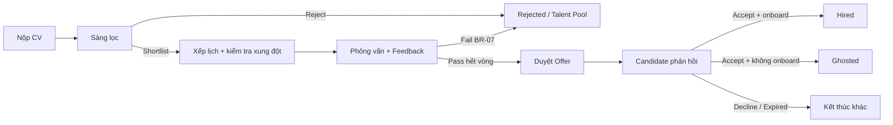
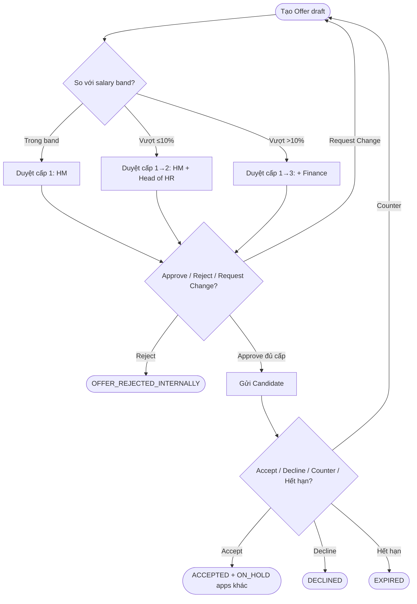
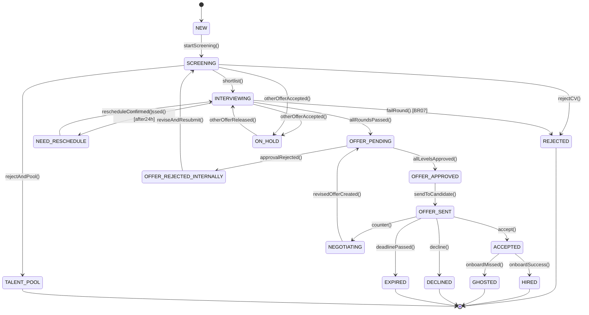
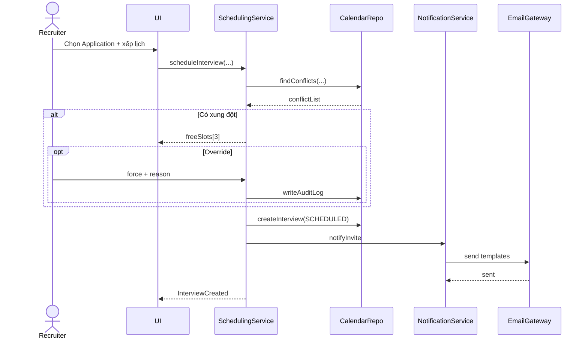
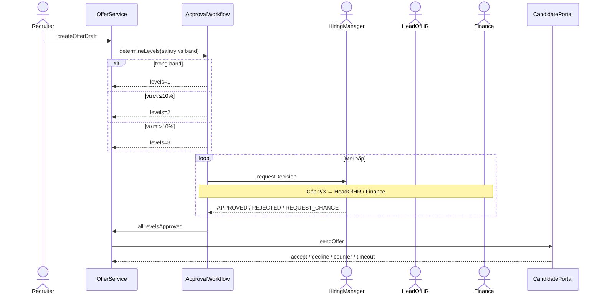
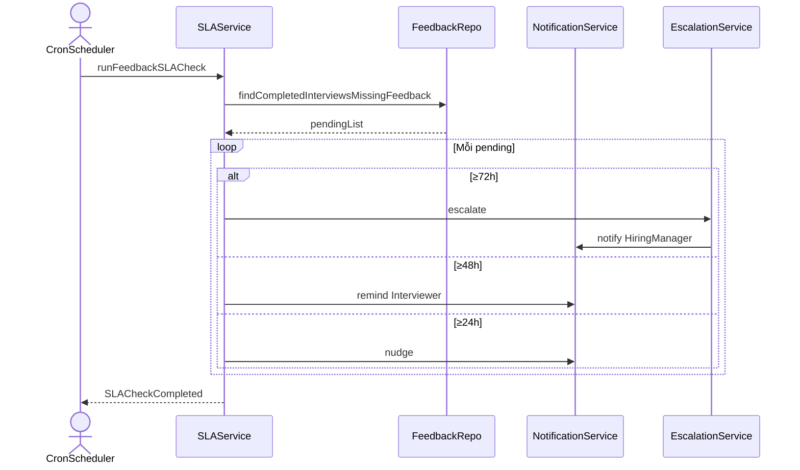

# Chương 3 — Phân tích hành vi

*Người phụ trách: B — Behavior / Process Analyst. Chương này mô tả hành vi động của hệ thống ATS mini qua Activity Diagram, State Machine và Sequence Diagram, bám sát use case / business rules ở Chương 2 và đồng bộ trạng thái với ERD ở Chương 4.*

---

## 3.1. Phương pháp phân tích hành vi

Phân tích hành vi trả lời câu hỏi: **hệ thống làm gì theo thời gian, ai làm, và các đối tượng tương tác thế nào**. Ba loại diagram UML được dùng với mục đích khác nhau:

| Diagram | Góc nhìn | Khi nào dùng trong chương này |
|---|---|---|
| Activity Diagram | Quy trình nghiệp vụ (workflow) theo actor / swimlane | ACT-01 toàn quy trình tuyển; ACT-02 duyệt offer |
| State Machine | Vòng đời một đối tượng qua các trạng thái | STATE-01 — `Application.status` |
| Sequence Diagram | Tương tác runtime giữa actor và các service/component | SEQ-01 xếp lịch; SEQ-02 duyệt offer; SEQ-03 SLA feedback |

**Nguyên tắc chọn luồng vẽ sequence:** ưu tiên luồng có nhiều actor, nhiều nhánh `alt`/`loop`, và có ràng buộc thời gian hoặc xung đột dữ liệu — đúng gợi ý mục 9 trong đặc tả. Ba luồng được chọn là UC-01 (xung đột lịch), UC-04 (multi-level approval), và UC-03 A2.1 / BR-06 (SLA feedback).

**Đồng bộ với các chương khác:**
- Tên state / enum khớp `application_status` trong `sql/schema.sql` (Person C).
- Tên service trên sequence (`SchedulingService`, `OfferService`, `ApprovalWorkflow`, `SLAService`...) là ứng viên component cho Person D.
- Alternative flow trong sequence phải truy được về alt flow trong UC của Person A.

File diagram nguồn (Mermaid):

| Mã | File |
|---|---|
| ACT-01 | `diagrams/B_act_recruitment_flow_v1.md` |
| ACT-02 | `diagrams/B_act_offer_approval_v1.md` |
| STATE-01 | `diagrams/B_state_application_v1.md` |
| SEQ-01 | `diagrams/B_seq_schedule_interview_v1.md` |
| SEQ-02 | `diagrams/B_seq_offer_approval_v1.md` |
| SEQ-03 | `diagrams/B_seq_sla_feedback_v1.md` |
| STATE-02 *(mới, v1.1)* | `diagrams/B_state_interview_v1.md` |

---

## 3.2. ACT-01 — Toàn bộ quy trình tuyển một ứng viên

### 3.2.1. Mục đích

ACT-01 mô tả end-to-end từ lúc Candidate nộp CV đến khi kết thúc bằng một trong các trạng thái cuối: Hired, Rejected / Talent Pool, Declined, Expired, hoặc Ghosted. Diagram dùng **5 swimlane** (Candidate, Recruiter, Hiring Manager, Interviewer, System) để làm rõ trách nhiệm từng vai trò — tránh biến activity thành flowchart một cột.

### 3.2.2. Các điểm quyết định chính

| Decision | Actor | Hệ quả |
|---|---|---|
| Shortlist / Reject | Recruiter | Shortlist → xếp lịch (UC-01); Reject → bắt buộc lý do; có thể vào Talent Pool (UC-02 A4.1) |
| Xung đột lịch? | System | Có → gợi ý 3 slot; Recruiter chọn lại hoặc override có audit (BR-03, UC-01 A5.1/A5.2) |
| Xác nhận lịch trong 24h? | Candidate | Không → `NEED_RESCHEDULE` (BR-05) |
| ≥50% HIRE nếu ≥2 interviewer? | System | Không đạt → Rejected (BR-07); đạt → vòng tiếp hoặc tạo offer |
| Phản hồi offer | Candidate | Accept / Decline / Counter / hết hạn (BR-09) |
| Onboard đúng ngày? | Candidate + System | Đúng → Hired; không → Ghosted + reopen JD (BR-11) |

### 3.2.3. Fork / Join

Sau khi tạo Interview `SCHEDULED`, System **fork** gửi email mời song song tới Candidate và Interviewer (BR-12 — dùng template đã duyệt), rồi **join** trước khi đặt SLA xác nhận 24h. Đây là điểm UML bắt buộc (không chỉ mũi tên tuần tự).

### 3.2.4. Hình 3.1 — ACT-01 (rút gọn trong chính văn)

Bản đầy đủ (≥20 activity node, đủ swimlane) nằm trong `diagrams/B_act_recruitment_flow_v1.md`. Tóm tắt luồng chính:

### 3.2.5. Câu hỏi bảo vệ liên quan

- *Khi Interviewer từ chối tham gia buổi PV?* ACT-01 mặc định Recruiter chọn lại interviewer ở bước xếp lịch (quay về decision xung đột / chọn người). Nếu buổi đã `SCHEDULED` rồi interviewer hủy, System chuyển interview `CANCELLED` / Application `NEED_RESCHEDULE` — cùng nhánh reschedule như BR-05.
- *Vì sao Activity chứ không BPMN?* Bài tập yêu cầu UML; Activity đủ thể hiện swimlane, decision, fork/join mà không cần ký hiệu BPMN phức tạp hơn.

---

## 3.3. ACT-02 — Quy trình duyệt offer multi-level

### 3.3.1. Mục đích

ACT-02 phóng to đoạn “tạo offer → duyệt nội bộ → gửi candidate” với swimlane riêng cho Hiring Manager, Head of HR, Finance — phản ánh đúng BR-08.

### 3.3.2. Ba nhánh theo band lương

| Điều kiện | Số cấp | Người duyệt |
|---|---|---|
| `salary` trong `[salary_band_min, salary_band_max]` | 1 | Hiring Manager |
| Vượt band ≤ 10% | 2 | HM + Head of HR |
| Vượt band > 10% | 3 | HM + Head of HR + Finance |

### 3.3.3. Vòng lặp

- **Request Change:** trả về Recruiter chỉnh draft; **duyệt lại từ cấp 1** (UC-04 A4.1) — không tiếp tục từ cấp đang dang dở.
- **Reject nội bộ:** `OFFER_REJECTED_INTERNALLY` → Application quay `SCREENING` (STATE-01).
- **Counter-offer:** `NEGOTIATING` → Recruiter tạo offer mới → vòng duyệt mới (`OFFER_PENDING`).

### 3.3.4. Hình 3.2 — ACT-02 (logic rút gọn)

Chi tiết swimlane đầy đủ: `diagrams/B_act_offer_approval_v1.md`.

---

## 3.4. STATE-01 — Vòng đời Application

### 3.4.1. Mục đích

Mọi thay đổi trạng thái tuyển dụng của một lần apply (một `Application`) được mô hình hoá bằng state machine. Đây là “nguồn sự thật” cho cột `applications.status` (Person C) và cho các transition trong Activity / Sequence.

### 3.4.2. Hình 3.3 — STATE-01

*(Bản đầy đủ kèm guard/action trên mọi mũi tên: `diagrams/B_state_application_v1.md`.)*

### 3.4.3. Các state đặc biệt

| State | Khi nào vào | Ý nghĩa |
|---|---|---|
| `ON_HOLD` | Candidate **Accept** offer ở JD khác (BR-10) | Tạm dừng pipeline JD hiện tại, chờ kết quả onboard |
| `TALENT_POOL` | Reject nhưng đánh dấu tái sử dụng (UC-02 A4.1) | Final “mềm” — giữ cho JD sau, không còn trong funnel active |
| `NEED_RESCHEDULE` | Quá SLA xác nhận lịch 24h (BR-05) | Quay lại `INTERVIEWING` sau khi xếp lịch mới |
| `NEGOTIATING` | Candidate counter-offer | Loop về `OFFER_PENDING` khi có draft mới |
| `GHOSTED` | Accept nhưng không onboard đúng ngày (BR-11) | Final; JD có thể reopen |

### 3.4.4. Khớp Person C

Tất cả 17 giá trị trong `CREATE TYPE application_status` đều xuất hiện trong STATE-01. Không có state “chỉ có trên diagram” hoặc “chỉ có trong DB”.

### 3.4.5. Ánh xạ Application.status ↔ Offer.status *(bổ sung v1.1)*

`application_status` (STATE-01) và `offer_status` (bảng `offers`, `sql/schema.sql`) là **2 enum
độc lập** mô tả cùng một giai đoạn nghiệp vụ (vòng đời offer) nhưng ở 2 entity khác nhau
(`Application` vs `Offer`) với tên gọi không giống nhau. Đây là điểm dễ gây nhầm lẫn khi trình
bày, nên bổ sung bảng đối chiếu:

**Bảng 3.1b — Đối chiếu `application_status` và `offer_status`**

| `application_status` (Application) | `offer_status` (Offer) | Ý nghĩa chung |
|---|---|---|
| `OFFER_PENDING` | `PENDING_APPROVAL` | Offer draft đã tạo, đang chờ duyệt nội bộ |
| `OFFER_APPROVED` | `APPROVED` | Đủ cấp duyệt nội bộ, chưa gửi candidate |
| `OFFER_SENT` | `SIGNED_BY_COMPANY` | Công ty đã ký, offer đã gửi candidate, chờ phản hồi |
| `ACCEPTED` | `ACCEPTED` | Candidate đồng ý |
| `DECLINED` | `DECLINED` | Candidate từ chối |
| `NEGOTIATING` | `NEGOTIATING` | Candidate counter-offer (UC-06) |
| `EXPIRED` | `EXPIRED` | Hết hạn phản hồi (BR-09) |
| `OFFER_REJECTED_INTERNALLY` | `REJECTED_INTERNALLY` | Bị từ chối ở một cấp duyệt nội bộ |
| *(không có tương ứng)* | `DRAFT` | Offer chưa gửi duyệt lần nào — ở mức Application vẫn đang `INTERVIEWING`/`OFFER_PENDING` tuỳ thời điểm tạo draft |

**Vì sao không gộp thành 1 enum:** `Application.status` phản ánh trạng thái *pipeline tuyển dụng*
(nhìn từ góc Recruiter/Hiring Manager), còn `Offer.status` phản ánh trạng thái *vòng đời văn bản
offer* (có thể có nhiều lần tạo lại offer draft trong 1 Application — xem SEQ-02, `revisedOfferCreated()`).
Tách 2 enum giúp `offers` giữ lịch sử duyệt lại mà không làm nhiễu state machine chính của
`Application`. Điểm cần lưu ý khi bảo vệ: **không có mapping 1-1 tuyệt đối** — ví dụ nhiều dòng
lịch sử `offer_status` (qua các lần Request Change/Counter) có thể ứng với cùng 1 giai đoạn
`OFFER_PENDING` bên Application.

---

## 3.5. SEQ-01 — Xếp lịch phỏng vấn có kiểm tra xung đột

### 3.5.1. Mục đích

Thể hiện tương tác runtime của UC-01: Recruiter → UI → `SchedulingService` → `CalendarRepo` → `NotificationService` → `EmailGateway`, với nhánh xung đột và override.

### 3.5.2. Diễn giải luồng

1. Recruiter chọn Application; service trả vòng PV kế tiếp theo cấu hình JD (`InterviewProcess`).
2. Recruiter chọn interviewer + slot; `SchedulingService` gọi `CalendarRepo.findConflicts` (BR-03).
3. **Alt xung đột:** gợi ý 3 slot; Recruiter chọn lại **hoặc** override kèm lý do + audit log (UC-01 A5.2).
4. Tạo `Interview` (`SCHEDULED`) + `InterviewParticipant`; gửi email (template) cho Candidate và Interviewer.
5. Đặt SLA xác nhận 24h (BR-05). Quá hạn xử lý theo cùng pattern cron như SEQ-03.

### 3.5.3. Hình 3.4 — SEQ-01 (cấu trúc chính)

Chi tiết đánh số message: `diagrams/B_seq_schedule_interview_v1.md`.

### 3.5.4. Ghi chú thiết kế

`SchedulingService` không map 1-1 một bảng (Person C) — đúng phân biệt service layer vs persistence. Race condition hai Recruiter xếp cùng slot được xử lý bằng lock (Redis) trong service trước khi ghi DB — Person D phản ánh trong kiến trúc.

---

## 3.6. SEQ-02 — Duyệt offer multi-level

### 3.6.1. Mục đích

Sequence dài nhất: xác định số cấp duyệt (BR-08), vòng lặp từng cấp với Approve / Reject / Request Change, rồi gửi CandidatePortal và xử lý Accept / Decline / Counter / Expire.

### 3.6.2. Vì sao tách `ApprovalWorkflow` khỏi `OfferService`

| Trách nhiệm | Service |
|---|---|
| Tạo/sửa offer, gửi candidate, expire, cập nhật Application | `OfferService` |
| Tính số cấp theo band, điều phối từng cấp, ghi `OfferApproval` | `ApprovalWorkflow` |

Tách ra để tái sử dụng cùng pattern duyệt cho JD (`Approvable` trong Class Diagram của C) và để Sequence / Component Diagram của D không biến `OfferService` thành “god service”.

### 3.6.3. Hình 3.5 — SEQ-02 (cấu trúc chính)

Bản đầy đủ: `diagrams/B_seq_offer_approval_v1.md`. ACT-02 và SEQ-02 cùng logic nghiệp vụ, khác góc nhìn (swimlane vs object interaction).

---

## 3.7. SEQ-03 — Nhắc SLA feedback trễ hạn

### 3.7.1. Mục đích

Mô hình hoá actor phụ **System** dưới dạng `CronScheduler` + các service cụ thể — tránh lifeline “System” chung chung (sai lầm cần tránh trong `02_person_B_behavior.md`).

### 3.7.2. Ba mốc hành vi

| Thời điểm sau Interview COMPLETED | Hành động |
|---|---|
| ≥ 24h | Nudge nhẹ tới Interviewer (opt) |
| ≥ 48h | Nhắc overdue — khớp BR-06 |
| ≥ 72h | Escalate tới Hiring Manager của interviewer (UC-03 A2.1) + audit log |

### 3.7.3. Hình 3.6 — SEQ-03

Chi tiết: `diagrams/B_seq_sla_feedback_v1.md`.

---

## 3.8. Đối chiếu chéo với Chương 2 và Chương 4

**Bảng 3.1 — Mapping UC / BR → diagram hành vi**

| UC / BR | Diagram phản ánh |
|---|---|
| UC-01 (+ A5.1, A5.2, A6.1 — đã đồng bộ 24h với BR-05, v1.1), BR-03, BR-05 | ACT-01, SEQ-01, STATE-01 (`NEED_RESCHEDULE`), STATE-02 (`interview_status`) |
| UC-02 (+ A4.1) | ACT-01, STATE-01 (`REJECTED`, `TALENT_POOL`) |
| UC-03 (+ A2.1), BR-06, BR-07 | ACT-01, SEQ-03, STATE-01 (pass/fail vòng), STATE-02 (`COMPLETED`) |
| UC-04 (+ A4.1, A6.1 → UC-06 Đàm phán lương), BR-08, BR-09, BR-10 | ACT-02, SEQ-02, STATE-01 (nhánh offer), Bảng 3.1b (Offer.status) |
| BR-11 | ACT-01, STATE-01 (`GHOSTED`) |
| BR-13 *(mới, v1.1)* | STATE-01 (`ON_HOLD` → `REJECTED`) |

**Bảng 3.2 — Khớp enum với Person C**

| Enum C (`application_status`) | Có trong STATE-01 |
|---|---|
| NEW … TALENT_POOL (17 giá trị) | Có đủ — xem `diagrams/B_state_application_v1.md` |

---

## 3.9. Kết luận chương

Chương 3 đã mô tả hành vi hệ thống ATS mini bằng 6 diagram UML:

1. **ACT-01** — quy trình tuyển end-to-end với 5 swimlane, nhiều decision và fork/join.
2. **ACT-02** — duyệt offer 3 nhánh band + loop Request Change / counter.
3. **STATE-01** — vòng đời Application đủ 17 state, khớp ERD của C, có `ON_HOLD` / `TALENT_POOL`.
4. **SEQ-01** — xếp lịch có kiểm tra xung đột, override, email invite.
5. **SEQ-02** — multi-level approval (diagram phức tạp nhất, trọng tâm bảo vệ).
6. **SEQ-03** — SLA feedback 24h / 48h / 72h với escalate.

Các sequence dùng service cụ thể (không “System” chung), có message return và fragment `alt`/`loop`/`opt`, sẵn sàng bàn giao cho Person D làm Component Diagram và cho Person A đối chiếu alt flow khi Sync S4.

---

## 3.10. Addendum — cập nhật sau audit chéo (v1.1)

Sau khi tự-audit đối chiếu Chương 3 với `spec_ats.md`, `sql/schema.sql` và
`docs/data_dictionary_C.md`, các thay đổi sau đã được áp dụng. **Các mục có tag "cần A/C xác
nhận" chỉ mới được B tự sửa để nhất quán — vẫn cần A/C duyệt chính thức ở Sync S4 theo đúng quy
trình review chéo ở `06_conventions_shared.md` §4 trước khi tính là Done.**

| # | Thay đổi | File bị ảnh hưởng | Trạng thái |
|---|---|---|---|
| 1 | Đồng bộ SLA xác nhận lịch UC-01 A6.1 (48h → 24h, khớp BR-05) | `spec_ats.md`, STATE-01, SEQ-01 (không đổi vì đã sẵn dùng 24h) | Cần A xác nhận |
| 2 | Đổi UC tham chiếu trong UC-04 A6.1 từ "UC-05" thành "UC-06 Đàm phán lương" + thêm đặc tả rút gọn UC-06 | `spec_ats.md`, Bảng 3.1 | Cần A xác nhận |
| 3 | Thêm BR-13 (hold timeout 14 ngày làm việc) làm cơ sở cho transition `ON_HOLD → REJECTED` | `spec_ats.md`, STATE-01 | Cần A xác nhận số ngày |
| 4 | Thêm Bảng 3.1b đối chiếu `application_status` ↔ `offer_status` | Chương 3 (mục 3.4.5) | Hoàn tất |
| 5 | Thêm STATE-02 cho vòng đời `Interview` (`interview_status`), trước đây chưa có diagram nào | `diagrams/B_state_interview_v1.md` | Cần C xác nhận giả định "update cùng dòng khi reschedule" |
| 6 | Đề nghị C thêm `UNIQUE(application_id, round_order)` vào bảng `interviews` và `attempt_no` vào `offer_approvals` (hỗ trợ vòng duyệt lại từ cấp 1, UC-04 A4.1) | `sql/schema.sql`, `docs/data_dictionary_C.md` | Cần C xác nhận |

Toàn bộ chi tiết (ai làm, ảnh hưởng ai) được ghi theo đúng format tại `docs/change_log.md`.
