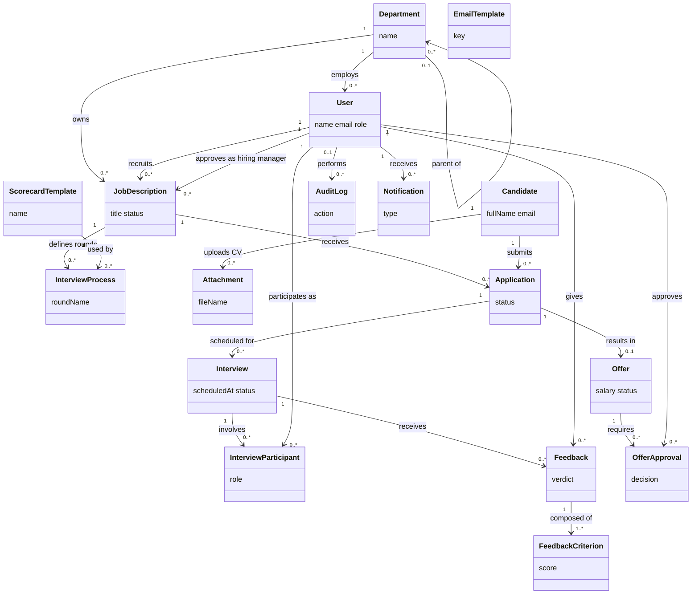
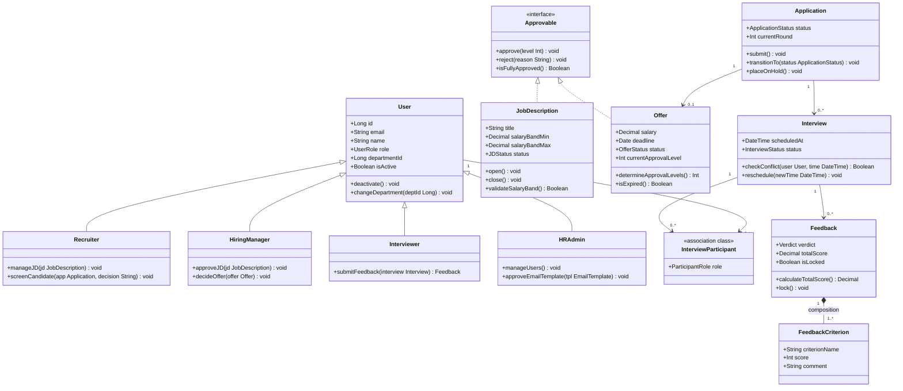
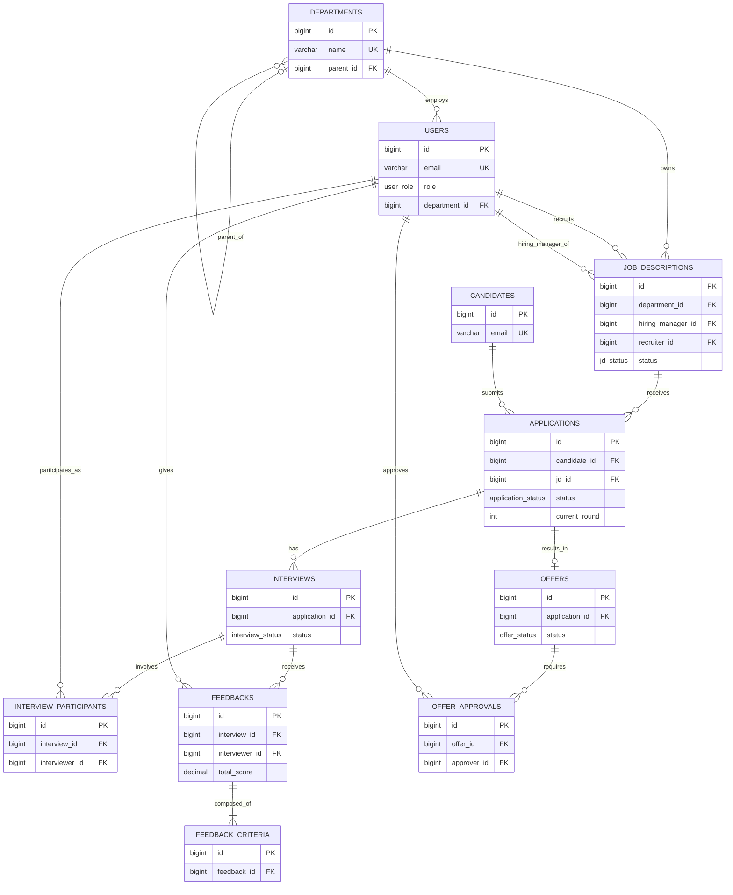

# Chương 4 — Phân tích cấu trúc dữ liệu

*Người phụ trách: C — Data Architect. Chương này trình bày quá trình phân tích và thiết kế cấu trúc dữ liệu cho hệ thống ATS mini, đi từ mô hình khái niệm đến schema vật lý có thể triển khai.*

---

## 4.1. Phương pháp phân tích

Cấu trúc dữ liệu được xây dựng theo 3 tầng trừu tượng giảm dần, mỗi tầng phục vụ một mục đích riêng:

| Tầng | Diagram | Mục đích | Vị trí |
|---|---|---|---|
| Conceptual | Domain Model | Nắm khái niệm nghiệp vụ, không quan tâm cách lưu trữ | `diagrams/C_domain_model_v1.md` |
| Logical | Class Diagram | Thiết kế hướng đối tượng, có kiểu dữ liệu và hành vi | `diagrams/C_class_diagram_v1.md` |
| Physical | ERD | Triển khai thật trên PostgreSQL, có PK/FK/index/constraint | `diagrams/C_erd_v1.md`, `sql/schema.sql` |

Nguồn dữ liệu đầu vào là danh sách entity và business rules ở Chương 2 (`spec_ats (1).md` mục 6, 8), được đối chiếu chéo với activity/state diagram ở Chương 3 (đặc biệt là vòng đời `Application`) để đảm bảo mọi trạng thái nghiệp vụ đều có cột lưu trữ tương ứng.

Quy trình thực hiện: liệt kê entity từ use case → vẽ Domain Model → phát triển song song thành Class Diagram (thêm hành vi) và ERD (thêm ràng buộc lưu trữ) → viết Data Dictionary → phân tích chuẩn hoá → đối chiếu lại với Chương 2 và Chương 3 để phát hiện thiếu sót.

---

## 4.2. Domain Model

Domain Model (Hình 4.1) mô hình hoá 17 khái niệm nghiệp vụ cốt lõi, vượt mức yêu cầu tối thiểu 15 entity. Ở tầng này, mọi association chỉ mang tên và bội số (multiplicity), không có kiểu dữ liệu, không có phương thức.

**Hình 4.1 — Domain Model (nguồn: `diagrams/C_domain_model_v1.md`)**



Domain Model thoả 2 ràng buộc kỹ thuật bắt buộc:
- **Quan hệ đệ quy:** `Department` tự liên kết với chính nó, thể hiện cây tổ chức nhiều cấp (VD: Engineering → Backend Team → Payment Squad).
- **Quan hệ N–N:** `Interview` và `User` liên kết N–N thông qua association class `InterviewParticipant` — một buổi phỏng vấn có nhiều interviewer, một interviewer tham gia nhiều buổi phỏng vấn khác nhau.

Không có class nào "cô lập" (không association nào); mọi entity đều xuất hiện trong ít nhất một use case ở Chương 2, thoả tiêu chí "Done" của Data Architect.

---

## 4.3. Class Diagram

Class Diagram (Hình 4.2) phát triển từ Domain Model, bổ sung kiểu dữ liệu cho attribute, phương thức mang ý nghĩa nghiệp vụ, và 2 cấu trúc OOP nâng cao: inheritance và interface.

**Hình 4.2 — Class Diagram (nguồn: `diagrams/C_class_diagram_v1.md`, trích các class chính; bản đầy đủ 17 class xem file nguồn)**



### 4.3.1. Inheritance — `User` và 4 vai trò

Bốn vai trò (`Recruiter`, `HiringManager`, `Interviewer`, `HRAdmin`) được mô hình hoá là subtype của `User` vì mỗi vai trò có **hành vi khác biệt rõ rệt** — đây là tiêu chí phân loại đúng tinh thần OOP (tách theo hành vi, không chỉ theo dữ liệu). Ở tầng vật lý, quyết định này **không** dẫn đến 4 bảng riêng; xem lý do ở mục 4.5.2.

### 4.3.2. Interface — `Approvable`

`JobDescription` (được Hiring Manager duyệt mở, BR-02) và `Offer` (được duyệt nhiều cấp, BR-08) đều chia sẻ hành vi "có thể duyệt/từ chối theo cấp". Trừu tượng hoá thành interface `Approvable` giúp một `ApprovalWorkflow` (service ở Chương 5 của D) xử lý đồng nhất logic duyệt cho cả hai loại đối tượng, tránh trùng lặp code.

### 4.3.3. Association class — `InterviewParticipant`

Do quan hệ N–N giữa `Interview` và `User` cần lưu thêm thuộc tính `role` (ai là interviewer chính, ai là phụ), quan hệ này không thể là association N–N "trơn" mà phải là **association class**.

### 4.3.4. Composition — `Feedback` *-- `FeedbackCriterion`

`FeedbackCriterion` không có ý nghĩa tồn tại độc lập ngoài `Feedback` cha — dùng quan hệ composition (hình thoi đặc), ánh xạ sang `ON DELETE CASCADE` ở tầng SQL.

---

## 4.4. Entity Relationship Diagram (ERD)

ERD (Hình 4.3) là bản chuyển đổi vật lý của Class Diagram, sát với schema PostgreSQL thật trong `sql/schema.sql`. Ba phép chuyển đổi quan trọng từ logical sang physical:

1. Quan hệ N–N `Interview` ↔ `User` → bảng trung gian `interview_participants` với surrogate key và `UNIQUE(interview_id, interviewer_id)`.
2. Inheritance `User` → 4 subtype → **single-table inheritance**: một bảng `users` duy nhất với cột `role` kiểu ENUM.
3. Interface `Approvable` → không có bảng riêng (interface không tồn tại ở tầng lưu trữ); hành vi được đảm bảo qua ràng buộc ENUM `status` trên `job_descriptions` và `offers`.

**Hình 4.3 — ERD tổng thể (nguồn đầy đủ: `diagrams/C_erd_v1.md`; DDL chạy được: `sql/schema.sql`)**



*(Ghi chú: sơ đồ trên rút gọn thuộc tính để vừa trang; ERD đầy đủ 17 bảng với mọi cột đặt trong `diagrams/C_erd_v1.md`, chi tiết field-level đặt trong phụ lục — xem `docs/data_dictionary_C.md`.)*

---

## 4.5. Ánh xạ Business Rules vào ràng buộc dữ liệu

**Bảng 4.1 — Ánh xạ Business Rules sang ràng buộc dữ liệu**

| Mã BR | Nội dung (rút gọn) | Ràng buộc trong schema |
|---|---|---|
| BR-01 | Mỗi JD có đúng 1 recruiter, 1 hiring manager | Hai cột `recruiter_id`, `hiring_manager_id` NOT NULL, FK riêng tới `users`, không dùng bảng N–N chung |
| BR-02 | JD chỉ nhận CV khi ở trạng thái OPEN | `job_descriptions.status` ENUM `jd_status`; enforce ở service layer khi tạo `Application` |
| BR-03 | Không trùng lịch cho cùng 1 interviewer | Không biểu diễn được bằng CHECK constraint (ràng buộc liên dòng, có yếu tố thời gian) — enforce bằng Redis lock ở service layer (xem SEQ-01, Chương 3) + `idx_interviews_scheduled_at`, `idx_ipart_interviewer_id` hỗ trợ query kiểm tra trước khi ghi |
| BR-04 | Không apply lại cùng JD trong 6 tháng kể từ lần reject | Tương tự BR-03, enforce ở service layer; index `(candidate_id, jd_id, applied_at)` hỗ trợ truy vấn nhanh |
| BR-06 | Feedback phải submit trong 48h | `feedbacks.submitted_at`, `is_locked`; cron kiểm tra định kỳ (xem SEQ-03, Chương 3) |
| BR-07 | Vòng ≥2 interviewer cần ≥50% kết luận HIRE trở lên | Suy ra được từ `feedbacks.verdict` theo `interview_id`; không cache sẵn (kết quả suy ra khi cần, tránh đồng bộ sai) |
| BR-08 | Cấp duyệt offer theo mức lương so với band | `offer_approvals.level` CHECK 1–3; số cấp được tính động bởi `Offer.determineApprovalLevels()` ở tầng service |
| BR-09 | Offer có hạn phản hồi tối đa 7 ngày làm việc | `offers.deadline` NOT NULL, có index để cron quét offer gần hết hạn |
| BR-10, BR-11 | Chuyển trạng thái pipeline khác khi nhận offer / ghosted | Thể hiện qua các giá trị ENUM `ON_HOLD`, `GHOSTED` trong `application_status` |

Hai rule BR-03 và BR-04 là ví dụ cho thấy **không phải mọi business rule đều enforce được bằng constraint tại DB** — đây là nội dung dự kiến được hỏi khi bảo vệ (xem `06_conventions_shared.md` mục 6).

---

## 4.6. Phân tích chuẩn hoá (Normalization Analysis)

### 4.6.1. Chứng minh đạt 3NF

Schema đạt **Third Normal Form (3NF)** với lý do:

- **1NF:** mọi cột chứa giá trị đơn (atomic), không có repeating group. Ngoại lệ có kiểm soát: `criteria` (scorecard_templates), `benefits` (offers), `parsed_profile` (candidates), `variables` (email_templates), `payload` (audit_logs, notifications) dùng JSONB — về hình thức "vi phạm" 1NF thuần tuý, nhưng được chấp nhận vì các cột này luôn đọc/ghi nguyên khối, không cần truy vấn SQL theo từng phần tử con — nếu tách bảng riêng sẽ tăng số lượng JOIN không cần thiết mà không mang lại lợi ích truy vấn tương ứng.
- **2NF:** mọi bảng có khoá chính là surrogate key đơn (`id`), nên không tồn tại partial dependency (chỉ xảy ra với composite key).
- **3NF:** không có transitive dependency — ví dụ, `applications` không lưu `candidate_name` hay `jd_title` (những thông tin này phụ thuộc vào `candidates`/`job_descriptions` chứ không phụ thuộc trực tiếp vào khoá của `applications`), mà truy vấn qua JOIN khi cần hiển thị.

### 4.6.2. Các điểm cố ý denormalize

| Cột | Giá trị gốc tính từ | Lý do denormalize |
|---|---|---|
| `feedbacks.total_score` | `AVG(feedback_criteria.score)` theo `feedback_id` | Dashboard Recruiter/Hiring Manager đọc danh sách feedback rất thường xuyên (mỗi lần mở Candidate Profile — UC liên quan Chương 2), trong khi tổng điểm chỉ thay đổi khi Interviewer sửa feedback (hiếm, và chỉ trong 24h đầu). Tỷ lệ đọc/viết cao → cache hợp lý hơn tính lại mỗi lần đọc. |
| `applications.current_round` | `MAX(interviews.round_order)` theo `application_id` | Màn hình Kanban Pipeline (D thiết kế ở Chương 5) render danh sách hàng trăm application đồng thời; tính `MAX()` qua JOIN cho mỗi dòng sẽ chậm ở quy mô ≤200 ứng viên/JD × ≤50 JD mở đồng thời (theo giả định NFR ở spec mục 15). |

Cả hai cột cache đều được đồng bộ lại tại đúng thời điểm ghi dữ liệu nguồn thay đổi (`FeedbackCriterion` mới/sửa → tính lại `total_score`; `Interview` mới → cập nhật `current_round`), không đồng bộ theo lịch định kỳ, để tránh hiển thị dữ liệu cũ.

### 4.6.3. Đánh đổi single-table inheritance cho `User`

Thay vì tách `users` thành `users` + 4 bảng con (`recruiters`, `hiring_managers`, `interviewers`, `hr_admins`) theo đúng inheritance ở Class Diagram, ERD chọn **một bảng `users` với cột `role`**:

- **Được:** truy vấn "ai thuộc phòng ban X" không cần UNION 4 bảng; thêm vai trò mới (nếu có) chỉ cần thêm giá trị ENUM, không cần migration tạo bảng.
- **Mất:** không thể có ràng buộc riêng theo vai trò ở tầng DB (VD: chỉ `Interviewer` mới có "skill tags") — nếu cần, sẽ bổ sung bảng phụ 1–1 tuỳ chọn (`interviewer_profiles`) ở phiên bản sau, không phá vỡ schema hiện tại.

Đây là ví dụ thực tế cho thấy Class Diagram (thiết kế hướng đối tượng) và ERD (thiết kế lưu trữ) có thể hợp lý khi khác nhau về cấu trúc, miễn là có lý do rõ ràng.

---

## 4.7. Data Dictionary

Data Dictionary đầy đủ cho toàn bộ 17 bảng (tên field, kiểu, null?, default, mô tả, ràng buộc) được trình bày trong phụ lục `docs/data_dictionary_C.md` để giữ chính văn chương gọn. Bảng 4.2 tóm tắt số liệu tổng quan.

**Bảng 4.2 — Tóm tắt Data Dictionary**

| Chỉ số | Giá trị |
|---|---|
| Số bảng | 17 |
| Tổng số cột | ~140 |
| Số cột dùng ENUM | 9 (`user_role`, `jd_status`, `candidate_source`, `application_status`, `interview_status`, `participant_role`, `verdict`, `offer_status`, `approval_decision`) |
| Số cột JSONB | 5 (`criteria`, `parsed_profile`, `benefits`, `variables`, `payload` × 2 bảng) |
| Số ràng buộc UNIQUE (ngoài PK) | 8 |
| Số ràng buộc CHECK | 13 |
| Số cột denormalize (cache) | 2 (`feedbacks.total_score`, `applications.current_round`) |

---

## 4.8. Mã nguồn triển khai (SQL DDL)

Toàn bộ schema được cài đặt bằng PostgreSQL DDL chạy được tại `sql/schema.sql`, bao gồm:

- 9 `CREATE TYPE ... AS ENUM` cho các cột trạng thái, đảm bảo dữ liệu không hợp lệ bị chặn ngay ở tầng DB thay vì chỉ kiểm tra ở tầng ứng dụng.
- 17 `CREATE TABLE` với đầy đủ `PRIMARY KEY`, `FOREIGN KEY` (kèm quy tắc `ON DELETE` phù hợp với ngữ nghĩa nghiệp vụ — `RESTRICT` cho dữ liệu lịch sử quan trọng, `CASCADE` cho dữ liệu con phụ thuộc chặt, `SET NULL` cho tự tham chiếu và audit log), `UNIQUE`, `CHECK`.
- 25 `CREATE INDEX` trên mọi khoá ngoại và các cột lọc thường dùng (`status`, `scheduled_at`, `deadline`), đáp ứng NFR hiệu năng ở spec mục 11 ("trang danh sách load ≤2s cho ≤500 record").

Script có thể chạy trực tiếp trên một database PostgreSQL rỗng:

```bash
createdb ats_mini
psql -d ats_mini -f sql/schema.sql
```

---

## 4.9. Kết luận chương

Chương 4 đã xây dựng đầy đủ cấu trúc dữ liệu cho hệ thống ATS mini qua 3 tầng trừu tượng (Domain Model → Class Diagram → ERD), với 17 entity đáp ứng đủ các yêu cầu kỹ thuật: quan hệ N–N (`Interview`–`User` qua `InterviewParticipant`), quan hệ đệ quy (`Department`), subtype/inheritance (`User` → 4 vai trò), và interface (`Approvable`). Schema đạt 3NF với 2 điểm denormalize có chủ đích và lý do rõ ràng, được cài đặt thành DDL PostgreSQL chạy được, sẵn sàng làm nền cho thiết kế kiến trúc và giao diện ở Chương 5.

Các điểm cần lưu ý khi cross-review với B (khớp `application_status`/`interview_status`/`offer_status` ENUM với state machine STATE-01) và D (ERD làm cơ sở chọn PostgreSQL + xác định index cho Reporting service) đã được đối chiếu và không phát hiện mâu thuẫn tại thời điểm viết chương này.
