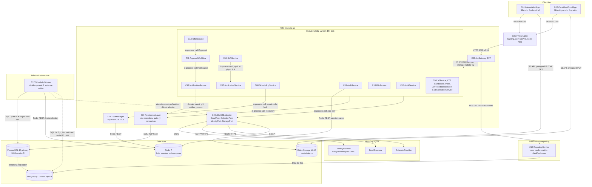
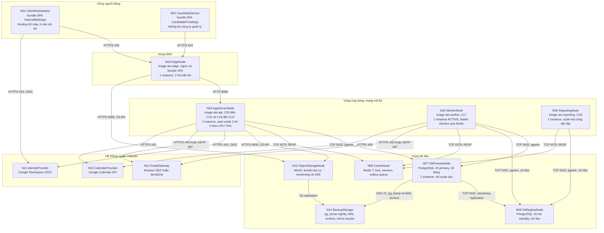
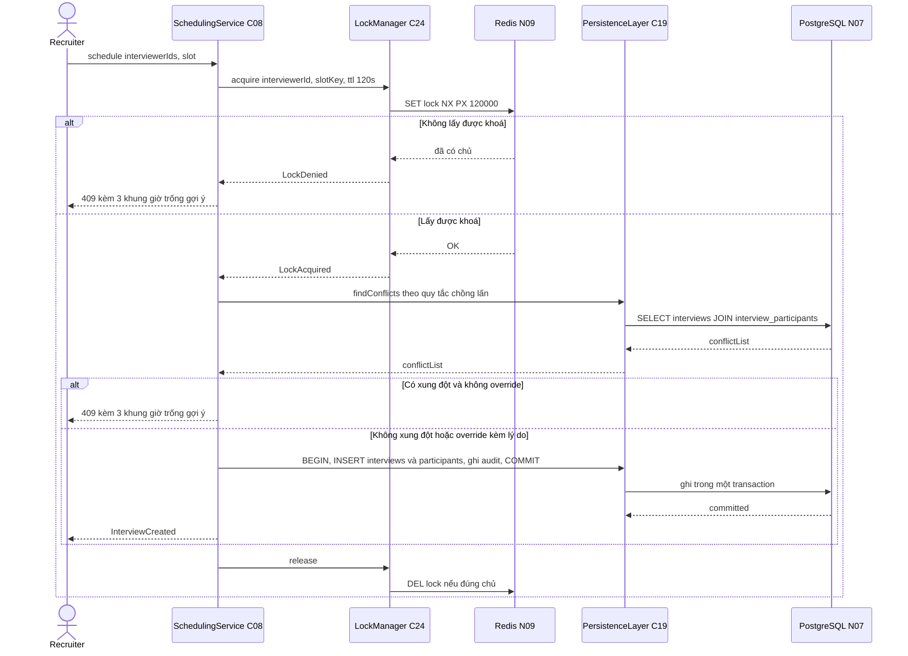
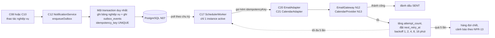
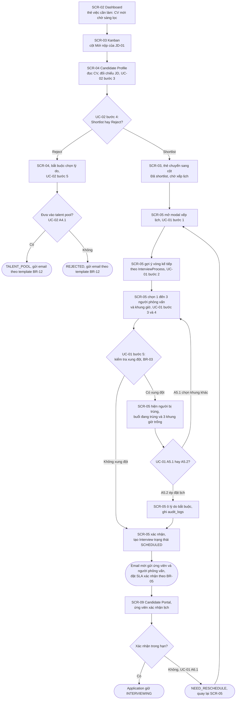

# Chương 5 — Thiết kế kiến trúc và giao diện

*Người phụ trách: D — System & UI Designer + Demo Lead. Chương này chuyển kết quả phân tích của Chương 2 (yêu cầu), Chương 3 (hành vi) và Chương 4 (dữ liệu) thành một bản thiết kế thi công được: kiến trúc logic, kiến trúc triển khai, các cơ chế kỹ thuật then chốt, thiết kế giao diện cho 11 màn hình và bộ yêu cầu phi chức năng có ngưỡng đo được. Các bảng và hình dài được đặt trong phụ lục; chính văn chỉ giữ bản rút gọn kèm đường dẫn tới file nguồn.*

**Tài liệu nguồn của chương này**

| Mã | File | Nội dung chi tiết |
|---|---|---|
| COMP-01 | `diagrams/D_comp_architecture_v1.md` | 24 component, 19 hợp đồng interface/port, 3 bảng đối chiếu chéo |
| DEP-01 | `diagrams/D_deploy_topology_v1.md` | 14 node, ma trận 22 kênh kết nối (21 vẽ trên hình + 1 kênh vận hành), chiến lược mở rộng, sao lưu và khôi phục |
| D5 | `wireframes/D_wireframes_v1.md` | Wireframe 11 màn `SCR-01`…`SCR-11` kèm 25 trạng thái |
| D5b | `wireframes/README.md` | Bản đồ màn hình, 3 user flow, hệ thống thiết kế, checklist tiếp cận |
| D6 | `docs/nfr_detail_D.md` | NFR-01…NFR-14, mỗi mã 5 mục: phát biểu, ngưỡng, cách đo, cơ chế, rủi ro |
| D9 | `docs/design_decisions_D.md` | ADR-01…ADR-12, sổ mâu thuẫn X-01…X-07, đề xuất gửi C, ma trận RBAC |

---

## 5.1. Từ yêu cầu đến quyết định kiến trúc

### 5.1.1. Sáu ràng buộc dẫn dắt thiết kế

Kiến trúc của một hệ thống nghiệp vụ không được chọn theo xu hướng công nghệ mà được suy ra từ những ràng buộc cụ thể mà hệ thống phải sống chung. Sáu ràng buộc dưới đây được rút ra từ đặc tả và từ hai chương phân tích trước, và chúng giải thích gần như toàn bộ các quyết định trong chương này.

**Ràng buộc 1 — Quy mô nhỏ và biết trước.** Mục 15 của `spec_ats (1).md` giả định tối đa 50 JD mở đồng thời, tối đa 200 ứng viên cho mỗi JD và không cần đa quốc gia, đa múi giờ. Con số **khoảng 60 người dùng nội bộ** không có trong đặc tả và cũng không có trong NFR-08; đây là **giả định của D**, suy ra từ bối cảnh "công ty IT quy mô ~500–1000 nhân sự" ở mục 1.1 của đặc tả và từ sáu vai trò nội bộ trong `user_role` của `sql/schema.sql` — ước chừng 8 Recruiter, 20 Hiring Manager, 25 Interviewer kiêm nhiệm, 3 HR Admin, 2 Head of HR và 2 người duyệt tài chính. Con số này được đánh dấu giả định theo đúng quy ước ở mục 5.3.3 và cần hiệu chỉnh khi có số liệu nhân sự thật. Quy đổi ra là khoảng 10.000 bản ghi `applications` cho một chu kỳ đầy tải — một khối lượng mà một cơ sở dữ liệu quan hệ đơn lẻ xử lý thoải mái. Ràng buộc này quan trọng ở chỗ nó **loại trừ** nhiều thứ hơn là đòi hỏi: không cần sharding, không cần kho dữ liệu phân tích riêng, không cần hệ phân tán.

**Ràng buộc 2 — NFR-01, ngân sách thời gian phản hồi 2 giây.** Màn hình `SCR-03` (kanban pipeline) là màn Recruiter mở nhiều lần mỗi ngày và phải trả đủ dữ liệu trong 2 giây ở phân vị 95 với 500 bản ghi. Ngân sách này bị tiêu hao bởi mọi chặng trung gian, nên nó gây sức ép trực tiếp lên số lần gọi mạng nội bộ giữa các module.

**Ràng buộc 3 — NFR-02, tính đúng đắn khi có đồng thời.** Yêu cầu "0 lịch trùng khi hai Recruiter cùng đặt một khung giờ, với 50 request song song" là một yêu cầu về **tính đúng đắn**, không phải hiệu năng. Nó không thể được thoả bằng cách chạy nhanh hơn, mà chỉ bằng một cơ chế tuần tự hoá tường minh.

**Ràng buộc 4 — NFR-05, quyền riêng tư của hồ sơ ứng viên.** Hồ sơ đầy đủ chỉ được đọc bởi Recruiter phụ trách JD và Hiring Manager của JD; Interviewer chỉ thấy gói thông tin của buổi phỏng vấn được giao (BR-20). Ràng buộc này buộc quyết định phân quyền phải nằm ở tầng máy chủ và phải dựa trên chính dữ liệu được yêu cầu, chứ không thể giải quyết bằng cách ẩn nút trên giao diện.

**Ràng buộc 5 — NFR-10, tách tải báo cáo.** Bốn biểu đồ của UC-05 quét `application_status_history` theo khoảng thời gian dài. Nếu tải phân tích và tải giao dịch dùng chung một tiến trình và một cơ sở dữ liệu, một lần Head of HR mở báo cáo có thể làm hỏng ngân sách 2 giây của sáu người đang tuyển dụng.

**Ràng buộc 6 — BR-03 và BR-08, hai quy tắc nghiệp vụ không biểu diễn được bằng ràng buộc dữ liệu.** BR-03 cấm hai buổi phỏng vấn chồng giờ cho cùng một interviewer, kể cả chồng một phút; C đã ghi rõ trong `sql/schema.sql` rằng đây là ràng buộc liên dòng có yếu tố thời gian, không viết được bằng `CHECK`. BR-08 xác định số cấp duyệt offer theo tỷ lệ vượt band lương và cho phép quy trình chạy lại từ cấp 1 khi bị `REQUEST_CHANGE`. Cả hai buộc phải được thực thi ở tầng dịch vụ, và vì thế chúng trở thành yêu cầu kiến trúc chứ không còn là yêu cầu nghiệp vụ thuần tuý.

Bảng 5.1 nối sáu ràng buộc trên với quyết định thiết kế tương ứng và mã ADR ghi nhận quyết định đó. Bản khai triển đầy đủ của mỗi ADR — bối cảnh, phương án bị loại, hệ quả tích cực và tiêu cực — nằm ở `docs/design_decisions_D.md` mục 2.

**Bảng 5.1 — Ràng buộc dẫn dắt, quyết định thiết kế tương ứng và mã ADR**

| # | Ràng buộc | Nguồn | Quyết định thiết kế | Mã ADR |
|---|---|---|---|---|
| 1 | ≤50 JD mở, ≤200 ứng viên/JD, ~60 user nội bộ | `spec_ats (1).md` mục 15 và NFR-08 cho hai ngưỡng đầu; con số ~60 user là **giả định của D** suy từ bối cảnh ~500–1000 nhân sự ở mục 1.1 của đặc tả (xem mục 5.1.1) | Modular monolith, 3 tiến trình `ats-api` / `ats-worker` / `ats-reporting`; giữ ranh giới module bằng interface | ADR-01 |
| 2 | Kanban p95 ≤2 s với 500 bản ghi | NFR-01 | `ApiGateway` đóng vai BFF tổng hợp response; phân trang cursor; dùng cột cache `applications.current_round` của C; gọi nội bộ trong tiến trình thay vì qua mạng | ADR-01 |
| 3 | 0 lịch trùng với 50 request song song | NFR-02, BR-03 | Khoá phân tán Redis theo cặp `(interviewer_id, time_slot)`, TTL 120 giây, đặt **kiểm tra và ghi trong cùng vùng khoá**; bổ sung optimistic locking cột `version` | ADR-03, ADR-08 |
| 4 | CV chỉ hiển thị đúng phạm vi; 100% lượt tải có audit | NFR-05, NFR-12, BR-20 | RBAC từ chối mặc định kiểm tra hai tầng; tệp CV nằm ở object storage riêng, truy cập bằng presigned URL 10 phút do `FileService` cấp sau khi kiểm tra quyền | ADR-10, ADR-04 |
| 5 | Truy vấn báo cáo không chạm primary; p95 ≤3 s | NFR-10 | PostgreSQL primary kèm một streaming replica; bốn bảng read model `rm_*` làm mới 15 phút; `ReportingService` chạy ở tiến trình riêng, chỉ đọc replica | ADR-02, ADR-07 |
| 6 | BR-03 và BR-08 không enforce được ở tầng DB | `sql/schema.sql` ghi chú 1; `report/chapter_4_data.md` Bảng 4.1 | Đưa hai quy tắc lên tầng dịch vụ: `SchedulingService` cho BR-03, `ApprovalWorkflow` làm engine duyệt tổng quát trên interface `Approvable` của C cho BR-08 | ADR-03, ADR-06 |

Ba quyết định còn lại không xuất phát từ một ràng buộc duy nhất mà phục vụ nhiều ràng buộc cùng lúc: ADR-05 (ports-and-adapters cho mọi hệ thống ngoài) làm cho bốn tích hợp bên thứ ba thay được bằng bản giả khi demo; ADR-06 (outbox kèm idempotency key) bảo đảm giao dịch nghiệp vụ không bị rollback vì gateway lỗi; ADR-09 (ứng viên không phải `User`, xác thực bằng magic link) giữ ranh giới an ninh giữa người ngoài và người trong doanh nghiệp.

### 5.1.2. Ba phương án kiến trúc và lý do chọn modular monolith

Đặc tả gốc ở mục 12.2 để ngỏ giữa "modular monolith" và "microservices nhẹ", nên lựa chọn phải được biện minh chứ không thể coi là hiển nhiên. Ba phương án được so sánh trên năm tiêu chí trong Bảng 5.1b; mỗi ô ghi kết quả đánh giá kèm căn cứ, không chỉ ghi tốt hay xấu.

**Bảng 5.1b — So sánh ba phương án kiến trúc trên năm tiêu chí**

| Tiêu chí | Monolith một tiến trình | **Modular monolith, 3 tiến trình (được chọn)** | Microservices theo bounded context |
|---|---|---|---|
| Đáp ứng NFR-01 (kanban ≤2 s) | Rủi ro: job quét SLA và truy vấn báo cáo 12 tháng chạy chung tiến trình với luồng tương tác, một truy vấn nặng đẩy p95 vượt ngưỡng | Đạt: chuỗi gọi dựng kanban nằm trọn trong `ats-api`, không có chặng mạng nội bộ, gần như toàn bộ ngân sách 2 s dành cho truy vấn dữ liệu | Kém hơn: một màn hình cần dữ liệu của 3–4 service, mỗi lời gọi thêm một chặng mạng và một lần tuần tự hoá dữ liệu |
| Đáp ứng NFR-10 (tách tải báo cáo) | Không đạt: không có cách nào tách tài nguyên của phần báo cáo khỏi phần giao dịch | Đạt: `ats-reporting` là tiến trình riêng, chỉ đọc replica, có hạn mức tài nguyên riêng và scale độc lập | Đạt, nhưng không thêm lợi ích nào so với phương án 2 vì phương án 2 đã tách sẵn tiến trình báo cáo |
| Tính đúng đắn của giao dịch nghiệp vụ | Đạt: transaction cục bộ của PostgreSQL | Đạt: cùng lý do; luồng duyệt offer nhiều cấp ghi `offers` và `offer_approvals` trong một transaction | Kém: luồng UC-04 chạm nhiều aggregate nên phải dùng saga hoặc giao dịch phân tán — chi phí lớn nhất của phương án này |
| Chi phí vận hành với đội nhỏ, không có đội vận hành riêng | Thấp nhất | Thấp: 3 artifact, 1 cơ sở dữ liệu, 1 Redis, 1 object storage | Cao: service discovery, truy vết phân tán, quản lý phiên bản hợp đồng giữa các service |
| Khả năng tiến hoá về sau | Kém: ranh giới module dễ bị xoá nhoà vì không có áp lực nào giữ | Chấp nhận được: ranh giới giữ bằng interface và bằng nguyên tắc mỗi bảng chỉ có một module sở hữu quyền ghi, nên biết sẵn đường cắt khi cần tách | Tốt nhất, nhưng trả trước toàn bộ chi phí cho một nhu cầu chưa phát sinh |

**Vì sao monolith một tiến trình bị loại.** Ba loại tải trong hệ thống có đặc tính khác nhau về bản chất: tải tương tác của Recruiter cần độ trễ thấp và tới theo đợt; tải nền của các job SLA chạy theo lịch, kéo dài, chấp nhận chậm; tải phân tích của báo cáo nặng và không đều. Gộp cả ba vào một tiến trình nghĩa là chúng tranh nhau cùng một pool luồng và cùng một pool kết nối cơ sở dữ liệu, và loại tải chậm nhất quyết định trải nghiệm của loại tải cần nhanh nhất. Ba tiến trình là chi phí nhỏ nhất để tách ba đặc tính tải đó ra.

**Vì sao microservices bị loại.** Vấn đề không nằm ở việc chia nhỏ — thiết kế này thực tế đã chia thành 24 component với ranh giới rõ — mà nằm ở việc nâng ranh giới module thành ranh giới tiến trình. Với 10.000 application, lợi ích thu được (triển khai độc lập, mở rộng độc lập từng nghiệp vụ) không xuất hiện, trong khi chi phí xuất hiện ngay lập tức: luồng duyệt offer nhiều cấp của UC-04 chạm `offers`, `offer_approvals`, `applications` và `notifications`, nếu bốn bảng này thuộc bốn service thì một thao tác "duyệt cấp cuối" trở thành một saga có bù trừ. Đổi một transaction cục bộ lấy một saga để phục vụ 60 người dùng là ví dụ điển hình của thiết kế quá mức. Phương án serverless theo hàm cũng đã được cân nhắc và bị loại vì ba lý do: hệ thống nội bộ có tải đều và biết trước, không có đặc tính tải đột biến để tận dụng ưu điểm của mô hình; mỗi lần gọi hàm phải dựng lại kết nối cơ sở dữ liệu nên cần thêm một tầng gộp kết nối chỉ để chạy được; và độ trễ khởi động nguội ăn vào ngân sách 2 giây của NFR-01 đúng ở màn hình được mở nhiều nhất.

Kết luận: hệ thống được xây dựng thành **một khối mã nguồn có ranh giới module rõ ràng, triển khai thành ba tiến trình theo đặc tính tải**. Đây là ADR-01, và mọi mục còn lại của chương này là hệ quả của nó.

---

## 5.2. Kiến trúc logic

### 5.2.1. Sơ đồ thành phần COMP-01

Hình 5.1 là bản rút gọn của COMP-01: giữ đủ các nhóm component và mọi luồng dữ liệu chính, nhưng gộp bốn adapter `EmailAdapter`, `CalendarAdapter`, `IdentityAdapter`, `ObjectStorageAdapter` thành một khối để hình vừa trang. Bản đầy đủ 24 component kèm sơ đồ phóng to cụm Offer theo ký hiệu provided/required của UML nằm ở `diagrams/D_comp_architecture_v1.md`.

Bốn quy ước đọc hình: mỗi khối là một component mang mã `Cxx` dùng xuyên suốt Bảng 5.2 đến Bảng 5.4; khối `EdgeProxy` là phần tử hạ tầng thuộc DEP-01, được vẽ để thấy điểm cắt TLS chứ không mang mã component; nét liền là lời gọi đồng bộ, nét đứt là luồng bất đồng bộ; nhãn trên mỗi cạnh ghi giao thức, trong đó `in-process call` nghĩa là lời gọi phương thức trong cùng tiến trình, không qua mạng.

**Hình 5.1 — COMP-01: Sơ đồ thành phần hệ thống ATS mini (bản rút gọn)**



### 5.2.2. Danh mục component

Bảng 5.2 liệt kê 24 component ở dạng rút gọn: mã, tên, trách nhiệm một câu và tiến trình chứa nó. Cột "Tiến trình" là cột nối trực tiếp sang mục 5.3 — nó cho biết mỗi khối logic trên Hình 5.1 sẽ nằm trong artifact nào khi triển khai. Bản đầy đủ có thêm cột interface cung cấp, interface tiêu thụ và danh sách UC/BR/NFR mà component chịu trách nhiệm, đặt ở `diagrams/D_comp_architecture_v1.md` Bảng 5.2 của file đó.

**Bảng 5.2 — Danh mục 24 component của COMP-01 (bản rút gọn)**

| Mã | Component | Trách nhiệm | Tiến trình |
|---|---|---|---|
| C01 | `InternalWebApp` | SPA phục vụ 6 vai trò nội bộ, gồm 10 trong 11 màn hình | Browser |
| C02 | `CandidatePortalApp` | SPA rút gọn cho ứng viên: xem trạng thái, xác nhận lịch, phản hồi offer | Browser |
| C03 | `ApiGateway` (BFF) | Định tuyến, xác thực token, rate-limit, tổng hợp response theo từng màn hình, gắn `correlationId` | `ats-api` |
| C04 | `AuthService` | OIDC với IdP nội bộ, session, phát và thu hồi token ứng viên, giải quyết RBAC kèm phạm vi phòng ban | `ats-api` |
| C05 | `JdService` | Quản lý JD, `InterviewProcess`, `ScorecardTemplate`; yêu cầu duyệt mở JD theo BR-02 | `ats-api` |
| C06 | `CandidateService` | Hồ sơ ứng viên, dedupe theo email, talent pool, metadata `attachments` | `ats-api` |
| C07 | `ApplicationService` | Lõi nghiệp vụ: state machine `Application` theo STATE-01, pipeline kanban, ghi lịch sử trạng thái | `ats-api` |
| C08 | `SchedulingService` | Kiểm tra xung đột BR-03, giữ khoá slot, tạo và đổi `Interview`, gợi ý 3 khung giờ trống | `ats-api` |
| C09 | `FeedbackService` | Scorecard, `Feedback` và `FeedbackCriterion`, khoá sửa sau 24 giờ, tổng hợp kết luận vòng theo BR-07 | `ats-api` |
| C10 | `OfferService` | Vòng đời `Offer`: tạo bản nháp, gửi ứng viên, hết hạn, xử lý accept/decline/counter | `ats-api` |
| C11 | `ApprovalWorkflow` | Engine duyệt tổng quát cho mọi `Approvable`: tính số cấp theo BR-08, điều phối từng cấp, ghi `offer_approvals` | `ats-api` |
| C12 | `NotificationService` | Chọn template đã duyệt, render VI/EN, ghi outbox, tạo thông báo trong ứng dụng | `ats-api`, nạp cả trong `ats-worker` |
| C13 | `EscalationService` | Xác định quản lý trực tiếp của interviewer, leo thang khi quá hạn, ghi audit | `ats-api`, nạp cả trong `ats-worker` |
| C14 | `SLAService` | Nơi duy nhất định nghĩa và tính deadline mọi loại SLA, quét bản ghi vi phạm | `ats-api`, nạp cả trong `ats-worker` |
| C15 | `FileService` | Sinh presigned URL, quản lý version, kiểm tra checksum, hook antivirus | `ats-api` |
| C16 | `AuditService` | Ghi `audit_logs` và `application_status_history`, cung cấp API tra cứu lịch sử | `ats-api` |
| C17 | `SchedulerWorker` | Job idempotent: nhắc và leo thang feedback, hết hạn offer, quá hạn xác nhận lịch, hold timeout, tự đóng và mở JD, làm mới read model, đẩy outbox | `ats-worker` |
| C18 | `ReportingService` | Read model, định nghĩa metric, truy vấn dashboard, export CSV/PDF, công bố `dataFreshness` | `ats-reporting` |
| C19 | `PersistenceLayer` | Tập hợp repository, quản lý transaction và cột `version` cho optimistic locking | Cả 3 tiến trình |
| C20 | `EmailAdapter` | Hiện thực `EmailPort`: dựng message, gắn `idempotencyKey`, xử lý mã lỗi gateway | `ats-api`, `ats-worker` |
| C21 | `CalendarAdapter` | Hiện thực `CalendarPort`: tạo và huỷ sự kiện lịch; lỗi thì trả về để đánh dấu `CALENDAR_SYNC_PENDING` | `ats-api`, `ats-worker` |
| C22 | `IdentityAdapter` | Hiện thực `IdentityPort` với Google Workspace OIDC | `ats-api` |
| C23 | `ObjectStorageAdapter` | Hiện thực `StoragePort`: ký presigned PUT/GET, đọc checksum, quản lý version của object | `ats-api` |
| C24 | `LockManager` | Bọc Redis: `acquire(interviewerId, slot, ttl=120s)`, gia hạn, nhả an toàn; làm leader election cho worker | `ats-api`, `ats-worker` |

### 5.2.3. Đối chiếu với Chương 3: lifeline của B trở thành component của D

Checklist review chéo trong `06_conventions_shared.md` mục 5 đặt câu hỏi "tên lifeline của B có khớp Component Diagram của D không". Bảng 5.3 là bằng chứng trả lời câu hỏi đó: trong 16 lifeline khác nhau của SEQ-01, SEQ-02 và SEQ-03, mười hai lifeline không phải actor người dùng đều tìm được component tương ứng, bốn lifeline còn lại là actor người dùng, và **không lifeline nào của B cần đổi tên**.

**Bảng 5.3 — Ánh xạ lifeline trong sequence diagram của B sang component của D**

| Lifeline (B) | Diagram nguồn | Component (D) | Ghi chú đối chiếu |
|---|---|---|---|
| `UI` | SEQ-01 | `C01` + `C03` | Một lifeline tương ứng hai component: phần chạy trên trình duyệt và phần BFF chạy trên máy chủ; tách vì kiểm tra quyền phải nằm ở máy chủ (ADR-10) |
| `SchedulingService` | SEQ-01 | `C08` | Giữ nguyên tên |
| `CalendarRepo` | SEQ-01 | `C19.CalendarRepo` + `C21` + `C16` + `C14` | Lifeline gộp bốn trách nhiệm; D phân rã ở tầng component, xem giải thích dưới bảng |
| `NotificationService` | SEQ-01, SEQ-03 | `C12` | Giữ nguyên tên |
| `EmailGateway` | SEQ-01 | Hệ thống ngoài, truy cập qua `C20` | Trên sequence là lifeline, trên COMP-01 là hệ thống ngoài — hai góc nhìn, không mâu thuẫn |
| `OfferService` | SEQ-02 | `C10` | Giữ nguyên tên |
| `ApprovalWorkflow` | SEQ-02 | `C11` | Giữ nguyên tên; lý do tách nêu ở mục 5.2.5 |
| `CandidatePortal` | SEQ-02 | `C02` | Ứng viên không phải `User` nội bộ, xác thực bằng magic link (ADR-09) |
| `CronScheduler` | SEQ-03 | `C17` | Trên SEQ-03 vẽ như actor khởi tạo luồng, trên COMP-01 là component nội bộ — mâu thuẫn X-05, đã chốt theo phương án của A |
| `SLAService` | SEQ-03 | `C14` | Giữ nguyên tên |
| `FeedbackRepo` | SEQ-03 | `C19.FeedbackRepo` + `C13` + `C16` | Lifeline gộp, tương tự `CalendarRepo` |
| `EscalationService` | SEQ-03 | `C13` | Giữ nguyên tên; lý do tách nêu ở mục 5.2.5 |
| `Recruiter`, `HiringManager`, `HeadOfHR`, `Finance` | SEQ-01, SEQ-02 | Không có component | Là actor người dùng; biến actor thành component là lỗi thiết kế thường gặp. Bốn actor này tương tác qua `C01` và `C03` |

Hai dòng cần giải thích thêm là `CalendarRepo` và `FeedbackRepo`. Ghi chú 3.5.4 của B đã nêu rõ repository là tầng persistence chứ không phải "một bảng một lớp". Trong SEQ-01, lifeline `CalendarRepo` gánh bốn việc khác nhau — `findConflicts` và `createInterview` đọc ghi hai bảng, `addCalendarEvents` gọi hệ thống ngoài, `writeAuditLog` ghi `audit_logs`, `setConfirmSLA` đặt deadline. Ở tầng component, bốn việc đó được trả về đúng bốn nơi chịu trách nhiệm. Việc sequence gộp chúng vào một lifeline là hợp lệ vì mục tiêu của sequence là kể luồng theo thời gian, còn mục tiêu của component diagram là phân rã cấu trúc. Kết luận đề nghị B ghi nhận ở Sync S4: giữ nguyên tên lifeline, chỉ bổ sung một dòng chú thích rằng hai lifeline này là lifeline gộp.

### 5.2.4. Đối chiếu với Chương 4: mỗi bảng có đúng một chủ sở hữu quyền ghi

Bảng 5.4 gán quyền ghi cho **15 trong 18 bảng** của C. Ba bảng còn lại — `departments`, `users`, `email_templates` — chưa có chủ sở hữu quyền ghi trong bảng này; phương án đề xuất gán chúng cho `C04` và `C12` đang chờ chốt ở Sync S4 (mục 5.7, Bảng 5.11 dòng 13). Nguyên tắc nền là **một bảng chỉ có duy nhất một component được phép `INSERT`/`UPDATE`/`DELETE`**; mọi module khác đọc dữ liệu qua interface do module sở hữu cung cấp, không tự viết câu lệnh ghi.

**Bảng 5.4 — Ánh xạ component sang các bảng của C mà component đó được phép ghi**

| Component | Bảng được phép ghi | Bảng chỉ đọc tiêu biểu |
|---|---|---|
| `C05 JdService` | `job_descriptions`, `interview_processes`, `scorecard_templates` | `departments`, `users` |
| `C06 CandidateService` | `candidates`, `attachments` | `applications` |
| `C07 ApplicationService` | `applications`, `application_status_history` | `job_descriptions`, `candidates`, `interviews` |
| `C08 SchedulingService` | `interviews`, `interview_participants` | `applications`, `users`, `interview_processes` |
| `C09 FeedbackService` | `feedbacks`, `feedback_criteria` | `interviews`, `scorecard_templates` |
| `C10 OfferService` | `offers` | `applications`, `job_descriptions` (đọc band lương) |
| `C11 ApprovalWorkflow` | `offer_approvals`; hai cột theo dõi tiến độ duyệt trên `offers` | `offers`, `users`, `job_descriptions` |
| `C12 NotificationService` | `notifications`, bảng outbox (đề xuất P1 gửi C) | `email_templates` |
| `C16 AuditService` | `audit_logs`, `application_status_history` | Toàn bộ, phục vụ API tra cứu |
| `C17 SchedulerWorker` | Không ghi trực tiếp bảng nghiệp vụ; ghi các bảng read model `rm_*` | Bảng outbox, `interviews`, `feedbacks`, `offers`, `applications` |
| `C18 ReportingService` | Không ghi bảng nào | Replica và các bảng `rm_*` |

Nguyên tắc này mang lại ba lợi ích kiểm chứng được. Thứ nhất, bất biến nghiệp vụ được bảo vệ ở đúng một chỗ: mọi thay đổi `applications.status` buộc phải đi qua `IApplication.transitionTo(...)`, nên state machine STATE-01 và dòng `application_status_history` tương ứng không bao giờ bị bỏ sót — đây chính là điều kiện để NFR-06 đạt 100%. Thứ hai, khi truy lỗi thì phạm vi nghi vấn hẹp: một dòng `offers` sai thì chỉ `C10` và `C11` là nghi phạm. Thứ ba, ranh giới quyền ghi hôm nay chính là đường cắt service ngày mai; vì không bảng nào bị hai module tranh nhau ghi nên nếu sau này tách service cũng không phát sinh nhu cầu giao dịch phân tán.

Hai ngoại lệ hiện còn tồn tại và đã được ghi vào `docs/design_decisions_D.md` để chốt ở Sync S4: bảng `offers` do `C10` sở hữu nhưng `C11` cần cập nhật hai cột theo dõi tiến độ duyệt — phương án đề xuất là `C11` gọi một thao tác hẹp do `C10` cung cấp thay vì viết câu lệnh trực tiếp; và bảng `application_status_history` hiện có cả `C07` lẫn `C16` ghi — phương án đề xuất là để `C16` làm chủ sở hữu duy nhất vì bảng này về bản chất là dữ liệu audit.

### 5.2.5. Bốn quyết định tách service và lý do đằng sau

**Tách `ApprovalWorkflow` khỏi `OfferService`.** Phương án bị loại là để `C10` tự tính số cấp duyệt và tự điều phối từng cấp. Lý do loại nằm ngay trong ghi chú 3.6.2 của B: hai component có hai trục thay đổi khác nhau. `C10` thay đổi khi vòng đời văn bản offer thay đổi, còn `C11` thay đổi khi **quy tắc duyệt** thay đổi — đổi ngưỡng vượt band 10% của BR-08, thêm một cấp duyệt, đổi hành vi khi `REQUEST_CHANGE`. Quan trọng hơn, `C11` làm việc trên interface `Approvable` mà C đã định nghĩa trong Class Diagram, nên cùng một engine phục vụ cả quy trình duyệt mở JD của BR-02 lẫn quy trình duyệt offer nhiều cấp của BR-08. Nếu logic duyệt nằm trong `C10` thì `C05` phải viết lại lần thứ hai, và hai bản sao đó chắc chắn lệch nhau khi quy tắc đổi. Giá phải trả là thêm một component và thêm một lời gọi trong tiến trình; đánh đổi còn lại là `C10` không còn giữ toàn bộ trạng thái duyệt trong bộ nhớ của mình nên khi dựng `SCR-07` phải hỏi `C11`.

**Tách `SLAService` khỏi `SchedulerWorker`.** Phương án bị loại là nhét công thức tính hạn vào chính các job cron. Hai thứ này trả lời hai câu hỏi khác nhau: `C14` trả lời "hạn là khi nào và đã vi phạm chưa" — đó là chính sách; `C17` trả lời "đến giờ chạy rồi, hãy quét đi" — đó là cơ chế kích hoạt. Hệ thống có ít nhất năm loại SLA (xác nhận lịch theo BR-05, feedback 48 giờ theo BR-06, leo thang 72 giờ theo UC-03 A2.1, phản hồi offer 7 ngày làm việc theo BR-09, hold 14 ngày làm việc theo BR-13) và cùng một công thức được dùng ở ba nơi: `C08` đặt hạn khi tạo lịch, giao diện `SCR-05` và `SCR-09` hiển thị đồng hồ đếm ngược, `C17` quét vi phạm. Nếu công thức nằm trong job cron thì màn hình không thể hiển thị đúng hạn mà không sao chép lại logic — và khi đó mâu thuẫn X-01 (24 giờ hay 48 giờ) sẽ phải sửa ở nhiều chỗ thay vì một.

**Tách `EscalationService` khỏi `NotificationService`.** Phương án bị loại là coi leo thang chỉ là "gửi thêm một email cho cấp trên". Leo thang thực chất là một quyết định nghiệp vụ gồm ba bước: xác định quản lý trực tiếp của interviewer bằng cách đi lên cây `departments`, thông báo cho đúng người đó, và ghi audit để báo cáo tuân thủ SLA tính được. `C12` ngược lại phải giữ vai trò thuần kỹ thuật: chọn template đã duyệt theo BR-12, render đúng ngôn ngữ theo NFR-09, ghi outbox. Nếu gộp, một component hạ tầng sẽ phải chứa tri thức về cây tổ chức và về quy tắc SLA.

**Tách `ReportingService` thành tiến trình riêng.** Phương án bị loại là để `C18` thành module thứ mười bốn trong `ats-api`, đọc thẳng primary. Tách tiến trình cho phép ba điều mà tách module không cho: đọc từ replica nên tải phân tích không chạm primary; đặt hạn mức tài nguyên riêng cho container báo cáo; và mở rộng độc lập. Cái giá phải trả gồm ba thứ: `IReadModel` trở thành interface duy nhất đi qua mạng bằng REST/HTTPS thay vì gọi trong tiến trình; dữ liệu báo cáo trễ tối đa 15 phút nên giao diện bắt buộc hiển thị `dataFreshness`; và hệ thống có thêm một tiến trình phải giám sát, được xử lý bằng cảnh báo lag replica trong NFR-13.

---

## 5.3. Kiến trúc triển khai

### 5.3.1. Sơ đồ triển khai DEP-01

Hình 5.2 trình bày DEP-01 với 14 node xếp theo năm vùng mạng. Bản đầy đủ kèm ma trận 22 kênh kết nối (21 kênh vẽ trên hình cộng một kênh vận hành cố ý không vẽ), chính sách sao lưu, quy trình khôi phục bốn bước và ước lượng năng lực chịu tải nằm ở `diagrams/D_deploy_topology_v1.md`.

**Hình 5.2 — DEP-01: Sơ đồ triển khai hệ thống ATS mini theo vùng mạng**



Bảng 5.5 mô tả từng node theo vai trò, artifact được triển khai, cấu hình phần cứng đề xuất và chính sách nhân bản; Bảng 5.6 liệt kê giao thức và số hiệu cổng của các kênh kết nối chính. Hình 5.2 thể hiện ba đặc điểm cấu trúc. Thứ nhất, mọi kết nối từ bên ngoài đều đi vào đúng một điểm là N03; không node nào của vùng dữ liệu nhận kết nối trực tiếp từ Internet. Thứ hai, hai tiến trình nền dùng hai nguồn dữ liệu theo hai cách khác nhau — N05 ghi trên primary N07 nhưng đọc trên replica N08 khi quét lịch sử trạng thái để làm mới read model, còn N06 chỉ chạm replica và không bao giờ ghi — đây là cách ADR-02, ADR-07 và NFR-10 được hiện thực ở tầng hạ tầng chứ không chỉ ở tầng mã nguồn. Bốn bảng `rm_*` nằm trên primary vì N08 là hot standby chỉ đọc, và tới được N08 qua streaming replication. Thứ ba, đường tải CV của ứng viên đi N02 → N03 → N10, **không qua N04**, đúng theo ADR-04.

**Bảng 5.5 — Đặc tả node của DEP-01 (bản rút gọn)**

| Mã node | Vai trò | Artifact | Cấu hình đề xuất (ước lượng) | Số instance và chính sách |
|---|---|---|---|---|
| N01 | Máy trạm của 6 vai trò nội bộ | Bundle SPA `InternalWebApp` | Máy sẵn có, Chrome/Edge/Firefox 2 phiên bản gần nhất (NFR-14) | ~60 máy, không do dự án cấp |
| N02 | Thiết bị của ứng viên | Bundle SPA `CandidatePortalApp` | Không kiểm soát; thiết kế responsive từ 360 px | Không giới hạn |
| N03 | TLS termination, reverse proxy, cân bằng tải, WAF cơ bản, phục vụ file tĩnh | `ats-edge` (nginx 1.24 + 2 bundle) | 2 vCPU / 4 GB / 40 GB SSD | 1 instance, nâng 2 khi cần HA |
| N04 | Toàn bộ lõi nghiệp vụ đồng bộ | `ats-api` (C03–C16, C19–C24) | 2 vCPU / 4 GB / 20 GB SSD mỗi instance | 2 thường trực, auto-scale tới 6 khi CPU >70% liên tục 5 phút |
| N05 | Job theo lịch và đẩy outbox | `ats-worker` (C17) | 2 vCPU / 4 GB / 20 GB SSD | Đúng 1 instance active, cấm auto-scale |
| N06 | Truy vấn read model, dựng chart, export | `ats-reporting` (C18) | 2 vCPU / 4 GB / 20 GB SSD | 1 instance, nâng thủ công lên 2 trong kỳ chốt báo cáo |
| N07 | PostgreSQL 16 primary, 18 bảng, 9 ENUM | Gói `postgresql-16` trên VM, cấu hình `max_connections = 200` (nâng từ mặc định 100) | 4 vCPU / 8 GB / 100 GB SSD | 1 instance, chỉ scale dọc |
| N08 | Hot standby chỉ đọc, đích failover | `postgresql-16`, `hot_standby = on` | 2 vCPU / 8 GB / 100 GB SSD | 1 instance |
| N09 | Redis 7: khoá BR-03, session, outbox queue, leader lock | `redis:7-alpine` | 1 vCPU / 2 GB / 10 GB SSD | 1 instance, 3 node Sentinel khi cần HA |
| N10 | MinIO S3-compatible, bucket `ats-cv` | `minio/minio` | 2 vCPU / 4 GB / 500 GB SSD | 1 instance, mở rộng bằng dung lượng đĩa |
| N11–N13 | IdP, Email gateway, Calendar provider | Dịch vụ ngoài | Do nhà cung cấp quyết định | Ngoài phạm vi vận hành |
| N14 | Sao lưu: pg_dump hằng đêm, WAL archive, mirror bucket CV | Script sao lưu | 1 vCPU / 2 GB / 1 TB HDD | 1 instance, giữ 30 ngày |

Toàn bộ cột cấu hình là **ước lượng** dựa trên quy mô giả định, không phải kết quả đo trên hệ thống thật. Cơ sở của con số 100 GB cho N07: một chu kỳ đầy tải sinh khoảng 10.000 `applications`, kéo theo tổng khoảng 500.000 dòng trên các bảng con, tương đương khoảng 300 MB kể cả index — đĩa 100 GB không dành cho dữ liệu nghiệp vụ mà cho WAL, cho `audit_logs` tích luỹ nhiều năm và cho khoảng trống khi khôi phục tại chỗ. Con số 500 GB cho N10 tính từ khoảng 30.000 CV mỗi năm, trung bình 2 MB mỗi tệp, hệ số versioning 1,5 — đủ khoảng 5 năm vận hành.

**Bảng 5.6 — Giao thức của các kênh kết nối chính**

| Từ | Đến | Giao thức và cổng | Mã hoá | Mục đích |
|---|---|---|---|---|
| N01, N02 | N03 | HTTPS 443 | TLS 1.3 | Tải bundle SPA và gọi API |
| N01 | N11 | HTTPS 443 (OIDC) | TLS 1.3 | Trình duyệt được chuyển hướng đăng nhập SSO |
| N03 | N04 | HTTP 8080 | Không mã hoá, trong mạng riêng | Reverse proxy và cân bằng tải round-robin |
| N03 | N10 | HTTPS 9000 (S3 API) | TLS | Chuyển tiếp tải lên và tải xuống CV bằng presigned URL |
| N04, N05 | N07 | TCP 5432 (pgwire) | TLS, `sslmode=verify-full` | Đọc ghi toàn bộ nghiệp vụ giao dịch |
| N04, N05, N06 | N09 | TCP 6379 (RESP) | TLS kèm xác thực mật khẩu | Khoá chống trùng lịch, session, hàng đợi outbox, leader lock |
| N04 | N10 | HTTPS 9000 (S3 API) | TLS | Phát presigned URL, đối chiếu checksum |
| N04 | N11 | HTTPS 443 (OIDC) | TLS | Đổi authorization code lấy token |
| N04, N05 | N12 | HTTPS 443 hoặc SMTP 587 | TLS / STARTTLS | Gửi email; N05 gửi kèm idempotency key |
| N04, N05 | N13 | HTTPS 443 | TLS | Tạo sự kiện lịch; N05 thử lại khi `CALENDAR_SYNC_PENDING` |
| N05 | N08 | TCP 5432, chỉ đọc | TLS | Quét `application_status_history` trên replica để làm mới read model mỗi 15 phút (ADR-07) |
| N06 | N08 | TCP 5432, chỉ đọc | TLS | Truy vấn read model cho 4 biểu đồ của `SCR-10` |
| N07 | N08 | TCP 5432 (streaming replication) | TLS | Sao chép luồng WAL sang hot standby |
| N07 | N14 | SSH 22 | SSH, xác thực bằng khoá | Sao lưu hằng đêm và lưu trữ WAL |
| N10 | N14 | S3 replication (HTTPS) | TLS | Nhân bản bucket CV sang vùng lưu trữ khác |

Một quyết định cần nêu rõ: hệ thống **không nhận webhook** từ N12 và N13. Trạng thái gửi email được đối soát bằng cách N05 chủ động gọi API theo chu kỳ. Đánh đổi rõ ràng: mất tính tức thời của thông tin gửi thư, đổi lại tường lửa không cần mở bất kỳ cổng inbound nào ngoài 443 trên N03.

### 5.3.2. Vì sao Hình 5.2 không phải bản vẽ lại của Hình 5.1

Đây là điểm hội đồng thường hỏi, nên cần nói tách bạch. Hai sơ đồ dùng hai **đơn vị mô hình hoá** khác nhau, nên không thể suy ra sơ đồ này từ sơ đồ kia bằng cách đổi hình khối. Đơn vị của COMP-01 là component logic và quan hệ giữa chúng là cung cấp hoặc tiêu thụ interface; đơn vị của DEP-01 là node vật lý cùng artifact được triển khai lên node, và quan hệ giữa chúng là kênh truyền thông có giao thức và số hiệu cổng. COMP-01 trả lời "trách nhiệm nghiệp vụ thuộc về ai", DEP-01 trả lời "tiến trình nào chạy ở đâu, đi qua đường mạng nào, nhân bản mấy bản". Hai sơ đồ cũng thay đổi vì hai lý do khác nhau: COMP-01 đổi khi ranh giới nghiệp vụ đổi, DEP-01 đổi khi tải, chi phí hạ tầng hoặc yêu cầu khả dụng đổi.

Quan hệ giữa hai sơ đồ là quan hệ nhiều-một: **24 component của COMP-01 được đóng gói thành đúng 5 artifact triển khai**. Bundle tĩnh của `C01` và `C02` nằm chung trong image `ats-edge`; image `ats-api` mang `C03`–`C16` và `C19`–`C24`; image `ats-worker` mang `C17`; image `ats-reporting` mang `C18`. Đây là hệ quả trực tiếp của ADR-01: ranh giới module được giữ ở tầng mã nguồn, không được nâng lên thành ranh giới tiến trình khi quy mô chưa đòi hỏi. Ngược lại, DEP-01 chứa những phần tử **không tồn tại** trong COMP-01 — `EdgeNode`, `BackupStorage`, hai node client — vì đó là hạ tầng chứ không phải module nghiệp vụ. Một ví dụ cụ thể để đối chiếu: `C08 SchedulingService` xuất hiện đúng một lần trên Hình 5.1, nhưng trên Hình 5.2 nó nằm trong container `ats-api` được nhân bản từ 2 đến 6 instance ở node N04.

### 5.3.3. Chiến lược mở rộng và vì sao worker không scale ngang

`ats-api` được thiết kế **stateless hoàn toàn** — session và refresh token nằm ở Redis, tệp CV không bao giờ đi qua tiến trình ứng dụng, mọi trạng thái nghiệp vụ nằm ở PostgreSQL. Nhờ vậy nginx phân phối theo round-robin mà không cần sticky session, và một instance bị dừng giữa chừng chỉ ảnh hưởng các request đang bay. Trần 6 instance không phải con số tuỳ ý: mỗi instance giữ pool 20 kết nối, 6 instance chiếm 120, cộng kết nối của N05 và các phiên quản trị vẫn dưới mức `max_connections = 200` — đây là giá trị **được cấu hình** trên N07 chứ không phải mặc định, vì mặc định của PostgreSQL là 100 và 120 kết nối đã vượt trần ngay. Muốn vượt trần này thì phải thêm một tầng gộp kết nối chứ không phải thêm máy — nghĩa là ở quy mô lớn hơn, nút thắt chuyển từ tầng ứng dụng xuống tầng dữ liệu.

Một điểm cần làm rõ về con số 2 instance: hai instance được chọn **vì khả dụng, không vì thông lượng**. Ước lượng tải đỉnh thiết kế chỉ khoảng 12 request mỗi giây (60 user, giả định 40% online đồng thời, mỗi phiên một thao tác mỗi 20 giây, mỗi thao tác 3 request, hệ số đỉnh 3 lần), trong khi năng lực ước tính của hai instance khoảng 100 request mỗi giây theo định luật Little với p95 150 ms và 20 request song song mỗi instance — dư khoảng 8 lần. Một instance đã thừa sức gánh tải đỉnh, nhưng một instance nghĩa là mọi lần triển khai phiên bản mới đều thành gián đoạn dịch vụ, không đạt NFR-03. Toàn bộ phép tính kèm nguồn của từng tham số nằm ở `diagrams/D_deploy_topology_v1.md` mục 5.4; các tham số không truy được về đặc tả đều được đánh dấu "giả định".

`ats-worker` là node duy nhất **bị cấm nhân bản tự do**, và lý do không phải hiệu năng mà là tính đúng đắn. Các job của `C17` chọn tập bản ghi bằng điều kiện thời gian, nên hai tiến trình chạy song song sẽ chọn trúng cùng một tập và cùng hành động lên nó. Ba kịch bản hỏng cụ thể: job hết hạn offer theo BR-09 khiến ứng viên nhận hai email "offer đã hết hạn" và `application_status_history` có hai dòng cho cùng một transition, làm báo cáo time-in-stage đếm sai; job nhắc SLA feedback khiến interviewer nhận hai email nhắc giống hệt, vi phạm trực tiếp ngưỡng "0 email trùng" của NFR-11; job làm mới read model khiến số liệu bị nhân đôi hoặc hai transaction đụng cùng dải khoá và sinh deadlock, trong khi `dataFreshness` vẫn báo "vừa cập nhật" — một kiểu lỗi âm thầm, khó phát hiện. Gốc rễ chung là các job này **không idempotent theo mặc định** vì chúng có tác dụng phụ ra bên ngoài.

Cơ chế điều phối được chọn là leader election bằng khoá Redis: đầu mỗi chu kỳ, worker đặt khoá `lock:worker:leader` với TTL 90 giây; chỉ instance đặt được khoá mới chạy vòng job và gia hạn khoá trong lúc chạy. Khi tiến trình chết đột ngột, khoá tự hết hạn và instance dự phòng chiếm quyền, đổi lại là độ trễ tối đa 90 giây — chấp nhận được vì mọi job đều theo lịch phút. Một câu hỏi dễ gặp: nếu đằng nào cũng chỉ chạy một container thì cần khoá làm gì? Cần, vì trong lúc triển khai phiên bản mới theo kiểu cuốn chiếu, container cũ và container mới cùng tồn tại vài giây — đúng khoảng đó là cửa sổ sinh job trùng. Khoá biến một bất biến vận hành mong manh thành một bất biến do hệ thống tự bảo đảm. Khi khối lượng job tăng, cách mở rộng đúng không phải thêm instance mà là chia job theo nhóm, mỗi nhóm một khoá riêng, để mỗi loại job vẫn có đúng một chủ.

---

## 5.4. Thiết kế các cơ chế then chốt

Bảy cơ chế dưới đây là phần thể hiện chiều sâu thiết kế của chương: mỗi cơ chế giải một bài toán cụ thể mà tầng cơ sở dữ liệu hoặc tầng giao diện không giải được.

### 5.4.1. Chống trùng lịch phỏng vấn (BR-03, NFR-02)

BR-03 cấm xếp hai buổi phỏng vấn chồng giờ cho cùng một interviewer, kể cả chồng một phút. Như C đã ghi trong `sql/schema.sql`, đây là ràng buộc liên dòng có yếu tố thời gian nên không viết được bằng `CHECK`; và như B đã ghi ở mục 3.5.4, nó phải được xử lý bằng khoá ở tầng dịch vụ trước khi ghi.

**Điều kiện chồng lấn.** Hai khoảng thời gian `[newStart, newEnd)` và `[existingStart, existingEnd)` được coi là chồng lấn khi và chỉ khi:

```
newStart < existingEnd  AND  newEnd > existingStart
```

Công thức này đúng cho mọi kiểu chồng lấn — chồng một phần đầu, chồng một phần cuối, lồng hoàn toàn, trùng khít — và tự động loại trừ hai buổi nối đuôi nhau (buổi trước kết thúc đúng lúc buổi sau bắt đầu) vì khi đó `newStart = existingEnd` làm vế thứ nhất sai. Cả hai biên đều so sánh nghiêm ngặt nên hai buổi chạm nhau tại một điểm không bị coi là xung đột. Trong lược đồ của C, `existingEnd` được tính là `scheduled_at + duration_min`, và truy vấn nối `interviews` với `interview_participants` để lọc theo `interviewer_id`, đồng thời loại các buổi có trạng thái `CANCELLED`.

**Trình tự bắt buộc.** Điểm cốt lõi của cơ chế nằm ở thứ tự thao tác, không nằm ở công thức: **phép kiểm tra xung đột và phép ghi phải nằm trong cùng một vùng khoá**. Nếu kiểm tra nằm ngoài vùng khoá, hai request vẫn có thể cùng đọc kết quả "không xung đột" rồi cùng ghi. Hình 5.3 mô tả trình tự này.

**Hình 5.3 — Trình tự lấy khoá, kiểm tra chồng lấn, ghi và nhả khoá khi xếp lịch phỏng vấn**



Khoá được giữ trong khoảng vài trăm mili giây chứ không phải suốt thời gian người dùng điền biểu mẫu; TTL 120 giây chỉ là van an toàn cho trường hợp tiến trình chết đột ngột. Ngưỡng đo tương ứng ở NFR-02 là p95 thời gian giữ khoá ≤300 ms và tỷ lệ khoá hết hạn trước khi commit bằng 0. Index tổ hợp `interviews(scheduled_at, status)` mà D đề xuất bổ sung, kết hợp với index `idx_ipart_interviewer_id` đã có sẵn trên `interview_participants(interviewer_id)`, phục vụ đúng truy vấn chạy bên trong vùng khoá; mỗi mili giây tiết kiệm ở đây đều làm giảm thời gian giữ khoá.

**Nhánh override.** UC-01 A5.2 cho phép Recruiter ép đặt lịch trùng kèm lý do bắt buộc. Trên `SCR-05`, nút xác nhận chỉ được bật khi lý do đạt tối thiểu 20 ký tự và ô cam kết trách nhiệm đã được tích; ràng buộc này được kiểm tra lại ở `C08` chứ không chỉ ở trình duyệt. Mỗi lần override sinh một dòng `audit_logs` với hành động `INTERVIEW_CONFLICT_OVERRIDE` kèm actor, thời điểm và lý do, ghi trong cùng transaction với việc tạo `Interview`. Phương án chặn hoàn toàn việc override đã được cân nhắc và bị loại: nó an toàn về dữ liệu nhưng đẩy người dùng ra ngoài hệ thống, họ sẽ hẹn miệng với ứng viên rồi nhập sau, khiến dữ liệu còn sai hơn.

**Phương án dự phòng.** Khi Redis không sẵn sàng, `C08` hạ cấp sang khoá hàng của PostgreSQL bằng `SELECT ... FOR UPDATE` trên hàng của interviewer trong cùng transaction ghi — vẫn tuần tự hoá được theo từng interviewer, đổi lại throughput giảm. Sự kiện hạ cấp phải phát cảnh báo theo NFR-13.

### 5.4.2. Outbox và idempotency key (ADR-06, NFR-11)

Nhiều luồng nghiệp vụ vừa ghi cơ sở dữ liệu vừa phải gọi hệ thống ngoài trong cùng một thao tác: tạo buổi phỏng vấn rồi gửi email mời (UC-01 bước 6), gửi offer cho ứng viên (UC-04 bước 5), nhắc và leo thang feedback trễ hạn (SEQ-03). Hai cách làm hiển nhiên đều sai: gọi hệ thống ngoài **trong** transaction thì gateway lỗi sẽ kéo theo rollback cả giao dịch nghiệp vụ hợp lệ; gọi **sau khi** commit thì tiến trình chết giữa chừng sẽ làm mất thông báo mà không ai biết.

Cơ chế được chọn là ghi bản ghi outbox trong **cùng transaction** với thao tác nghiệp vụ, rồi để `C17` đọc và gửi bất đồng bộ. Hình 5.4 mô tả luồng này.

**Hình 5.4 — Luồng outbox: ghi nguyên tử trong transaction nghiệp vụ và gửi bất đồng bộ kèm idempotency key**



Khoá chống trùng là `idempotencyKey = hash(entity, event, attempt)` với ràng buộc UNIQUE ở tầng lưu trữ, và khoá này được truyền tiếp cho hệ thống ngoài. Nhờ vậy, việc phát lại toàn bộ hàng đợi là an toàn: nếu worker chết sau khi gateway đã nhận nhưng trước khi kịp đánh dấu `SENT`, lần gửi lại dùng đúng khoá cũ và gateway loại bỏ bản trùng. Đây là điều kiện để phép đo "0 email trùng khi replay 1.000 sự kiện" của NFR-11 khả thi. Nguyên tắc thiết kế cần nhấn mạnh: **khoá phân tán là tối ưu hoá, idempotency mới là bảo đảm** — nếu Redis mất dữ liệu hoặc mạng phân mảnh làm hai worker cùng tưởng mình là leader thì email trùng vẫn bị chặn ở tầng ghi outbox.

Luồng calendar được xử lý khác luồng email một cách có chủ ý. `C08` **có** gọi `C21` đồng bộ với timeout ngắn vì Recruiter mong thấy sự kiện xuất hiện ngay; khi lời gọi lỗi, buổi phỏng vấn vẫn được tạo hợp lệ trong hệ thống, trạng thái đồng bộ được đánh dấu `CALENDAR_SYNC_PENDING` và bản ghi outbox còn lại để `C17` thử lại — đúng luồng E18.1 của UC-01. Đó là lý do trên Hình 5.1 tồn tại hai cạnh khác nhau tới nhóm adapter: một nét liền từ module nghiệp vụ và một nét đứt từ worker.

Phương án dùng message broker riêng (RabbitMQ, Kafka) đã được cân nhắc và bị loại: với vài nghìn sự kiện mỗi ngày, một bảng cơ sở dữ liệu đủ sức đảm nhiệm, trong khi broker thêm một hạ tầng phải vận hành và **không** tự giải quyết vấn đề cốt lõi là ghi cơ sở dữ liệu và phát sự kiện phải nguyên tử với nhau. Cái giá phải trả của outbox là thông báo trở thành bất đồng bộ với độ trễ bằng chu kỳ quét, bảng outbox tăng trưởng và cần chính sách dọn dẹp, và cần một bảng mới trong lược đồ — đã đưa vào danh mục đề xuất gửi C ở mức P1.

### 5.4.3. Read model cho báo cáo (ADR-07, NFR-10)

UC-05 yêu cầu bốn biểu đồ funnel, time-to-hire, source effectiveness và SLA compliance, có bộ lọc theo khoảng thời gian, phòng ban, JD và nguồn tuyển. Tính trực tiếp các chỉ số này đòi hỏi quét `application_status_history` — bảng mà C bổ sung ở v1.2 đúng cho mục đích đo time-in-stage — với nhiều phép nhóm và tự nối. Với 12 tháng dữ liệu, ước tính khoảng 120.000 dòng lịch sử (giả định trung bình 12 lần chuyển trạng thái cho mỗi application).

Cơ chế được chọn là bốn bảng tổng hợp `rm_funnel_daily`, `rm_time_to_hire`, `rm_source_effectiveness`, `rm_sla_compliance` đặt trong một schema `reporting` riêng, do `C17` làm mới mỗi 15 phút bằng cách đọc từ replica. `C18` chỉ đọc bốn bảng này và luôn trả kèm `dataFreshness` để `SCR-10` hiển thị dòng "số liệu tính đến HH:mm". Việc công bố `dataFreshness` không phải chi tiết trang trí mà là điều kiện để mô hình này chấp nhận được về mặt nghiệp vụ: nó biến độ trễ từ một khiếm khuyết ẩn thành thông tin minh bạch cho người ra quyết định.

Hai phương án bị loại. *Truy vấn trực tiếp bảng giao dịch mỗi lần mở báo cáo* bị loại vì chi phí tăng tuyến tính theo lịch sử tích luỹ — báo cáo sẽ chậm dần theo thời gian sử dụng, kiểu suy giảm khó phát hiện khi kiểm thử trên dữ liệu mới. *Cập nhật tức thời bằng trigger hoặc materialized view làm mới ngay khi commit* bị loại vì đặt chi phí tính toán báo cáo lên đúng đường ghi của luồng giao dịch, làm chậm chính thao tác chuyển trạng thái mà NFR-01 đang bảo vệ. Cái giá phải trả là số liệu trễ tối đa 15 phút và có thêm bốn bảng cùng một job có thể hỏng âm thầm — vì vậy NFR-13 đặt cảnh báo theo tuổi read model, và khi lag replica vượt 60 giây thì `SCR-10` hiển thị dải cảnh báo và tạm khoá chức năng export để tránh phát tán số liệu sai.

### 5.4.4. Lưu trữ CV (ADR-04, NFR-12)

Câu hỏi "ứng viên nộp CV 10 MB thì hệ thống lưu ở đâu" có ba phần trả lời, và cả ba đều là quyết định thiết kế chứ không phải chi tiết cài đặt.

**Tệp không nằm trong cơ sở dữ liệu.** Tệp nằm ở bucket `ats-cv` trên N10; bảng `attachments` của C chỉ lưu URL, tên tệp và số version — đúng ba cột `file_url`, `file_name`, `version` đang có trong `sql/schema.sql` v1.2. Giá trị checksum SHA-256 không được nhân bản thành một cột trong cơ sở dữ liệu mà được đọc trực tiếp từ metadata của object trên MinIO qua `StoragePort.checksum(ObjectKey)`, nhờ vậy thiết kế không phát sinh thêm đề xuất sửa lược đồ nào. Lưu binary trong PostgreSQL làm phình WAL, kéo dài thời gian backup và làm chậm cả quá trình sao chép sang N08.

**Tệp không đi qua application server.** `C01` và `C02` tải trực tiếp lên và tải xuống từ MinIO bằng presigned URL do `C15` sinh ra. Nếu để một tệp 10 MB đi xuyên `EdgeProxy` → `C03` → `C15` thì mỗi lượt tải chiếm một luồng xử lý trong nhiều giây, phá vỡ đúng giả thiết "20 request song song, p95 150 ms" mà ước lượng năng lực ở mục 5.3.3 dựa vào.

**Quyền được kiểm tra trước khi ký, và mọi lượt tải đều được ghi audit.** `C15.createDownloadUrl` bắt buộc nhận `Principal`; URL chỉ được ký sau khi `C04` xác nhận chủ thể nằm trong phạm vi của application tương ứng, và mỗi lần cấp URL sinh một dòng `audit_logs`. URL sống 10 phút — tham số `ttl` trong `StoragePort` không có giá trị mặc định vô hạn, đây là một ràng buộc thiết kế cố ý để không ai quên NFR-12. Giới hạn 10 MB được kiểm ở hai chỗ, ở chính sách của presigned URL và ở nginx trên N03, để một client được sửa đổi cũng không vượt qua được.

Điểm cần thành thật khi bảo vệ: cách này khiến cơ sở dữ liệu và object storage có thể lệch nhau khi khôi phục sự cố, vì hai kho được khôi phục độc lập. Đó là lý do quy trình khôi phục ở `diagrams/D_deploy_topology_v1.md` có hẳn một bước đối chiếu hai phần: mỗi giá trị `attachments.file_url` phải trỏ tới một object còn tồn tại trên N10, và checksum của các object mới nhất phải khớp giữa bucket `ats-cv` trên N10 với bản mirror trên N14.

### 5.4.5. Quy trình duyệt tổng quát (BR-08, BR-16)

`C11 ApprovalWorkflow` không biết mình đang duyệt cái gì. Nó chỉ làm việc trên interface `Approvable` mà C định nghĩa trong Class Diagram — `approve(level)`, `reject(reason)`, `isFullyApproved()` — và cả `Offer` lẫn `JobDescription` đều hiện thực interface này (`report/chapter_4_data.md` mục 4.3.2). Nhờ vậy, quy trình duyệt mở JD của BR-02 và quy trình duyệt offer nhiều cấp của BR-08 dùng chung một engine, một bảng lịch sử và một màn hình hộp thư duyệt (`SCR-08`), thay vì được viết hai lần.

Số cấp duyệt được `C11.determineLevels` tính theo ba nhánh của BR-08: mức lương trong band thì một cấp (Hiring Manager); vượt trần band tối đa 10% thì hai cấp (thêm Head of HR); vượt trên 10% thì ba cấp (thêm người duyệt Tài chính). Tỷ lệ vượt được tính trên **trần band**, không phải trên giữa band, và với dữ liệu mẫu đã chốt thì mức 51.840.000 VND so với trần 48.000.000 VND cho tỷ lệ 8,0% — hai cấp duyệt.

Điểm tinh tế nhất của cơ chế này là hành vi khi một cấp chọn `REQUEST_CHANGE`. Theo UC-04 A4.1, quy trình phải chạy lại **từ cấp 1**, không tiếp tục từ cấp đang dở. Nếu chỉ cập nhật chồng lên các dòng `offer_approvals` cũ thì lịch sử lần duyệt trước biến mất, và người duyệt cấp 2 ở lần thứ hai không có cách nào biết vì sao lần thứ nhất bị trả lại. Đây chính là lý do C đã bổ sung `offer_approvals.attempt_no` và `offers.current_approval_attempt` ở v1.1 với ràng buộc `UNIQUE(offer_id, level, attempt_no)`: mỗi lần duyệt lại là một `attempt` riêng, giữ nguyên toàn bộ dòng của các lần trước. Giao diện `SCR-07` bước 4 hiển thị đúng cấu trúc đó — chuỗi duyệt của lần hiện tại ở trên, khối lịch sử lần duyệt trước ở dưới kèm quyết định và ghi chú của từng cấp.

Một hệ quả về sở hữu dữ liệu cần chốt ở Sync S4: `C11` sở hữu quyền ghi `offer_approvals`, nhưng hai cột theo dõi tiến độ duyệt lại nằm trên bảng `offers` do `C10` sở hữu. Phương án đề xuất là `C11` gọi một thao tác hẹp do `C10` cung cấp thay vì viết câu lệnh trực tiếp, để nguyên tắc "một bảng một chủ sở hữu ghi" không bị phá.

### 5.4.6. Phân quyền theo vai trò và phạm vi (BR-20, BR-21, NFR-04, NFR-05)

Ma trận RBAC gồm 6 vai trò nội bộ cộng Candidate, đối chiếu với 13 nhóm tài nguyên hoặc hành động; bản đầy đủ nằm ở `docs/design_decisions_D.md` mục 5. Ba nguyên tắc quyết định cách ma trận đó được thực thi.

**Từ chối mặc định.** Ô trống trong ma trận không có nghĩa "chưa quyết định" mà có nghĩa **từ chối**. Cách đọc này quyết định hành vi của hệ thống khi lập trình viên quên khai báo quyền cho một endpoint mới: hệ thống trả 403 và lỗi lộ ra ngay khi kiểm thử, thay vì âm thầm mở dữ liệu cho mọi vai trò. Đây cũng là lý do NFR-04 đặt chỉ tiêu "100% endpoint có khai báo quyền" kèm một bước quét tĩnh làm hỏng bản build khi phát hiện endpoint thiếu khai báo.

**Kiểm tra hai tầng.** Tầng thứ nhất tại `C03` trả lời "chủ thể này có thuộc loại người được phép gọi endpoint này không", dựa trên vai trò lấy từ token. Tầng thứ hai tại service nghiệp vụ trả lời "bản ghi cụ thể này có thuộc phạm vi của chủ thể không", dựa trên chính dữ liệu được yêu cầu. Hai câu hỏi không thay thế được cho nhau: gateway biết người gọi là Recruiter nhưng không biết ứng viên đang được yêu cầu thuộc JD nào; còn service thì không nên gánh việc xác thực token. Khái niệm "phạm vi" gồm hai lớp — phạm vi theo JD được giao (dựa trên `job_descriptions.recruiter_id` và `hiring_manager_id`) và phạm vi theo phòng ban (dựa trên `users.department_id` đối chiếu `job_descriptions.department_id`) — nên một quyền toàn quyền luôn được hiểu là toàn quyền **trong phạm vi**.

**Ẩn nút trên giao diện không phải biện pháp phân quyền.** Thanh điều hướng được dựng động từ ma trận RBAC và mục không có quyền thì không render, nhưng đó chỉ là cải thiện trải nghiệm; mọi endpoint tương ứng vẫn phải tự bảo vệ vì công cụ nhà phát triển của trình duyệt cho phép gọi thẳng. Cùng lý do đó, việc che dữ liệu ở tầng giao diện là không đủ: `C06` không trả một thực thể chung cho mọi vai trò mà trả các DTO khác nhau — bản đầy đủ cho Recruiter phụ trách và Hiring Manager, bản rút gọn không có thông tin liên hệ cho Interviewer theo BR-20.

### 5.4.7. Vòng đời phiên của ứng viên (ADR-09)

Ứng viên là thực thể nghiệp vụ riêng (`candidates`), **không phải** `User`: không có giá trị trong `user_role`, không tham gia RBAC nội bộ, và theo ghi chú v1.2 của C thì cũng không có hàng trong bảng `notifications`. `C02 CandidatePortalApp` xác thực bằng magic link: `C04` phát một token có thời hạn 7 ngày gắn với đúng một cặp `(candidate_id, application_id)`, gửi qua email; token **dùng-một-lần** cho các hành động nhạy cảm như chấp nhận offer, và bị thu hồi khi application chuyển sang trạng thái cuối.

Ba phương án đã bị loại. *Tạo hàng `users` cho ứng viên kèm mật khẩu băm* bị loại vì buộc phải mở rộng `user_role` thêm một giá trị chỉ dùng cho một mục đích, làm mọi truy vấn nội bộ phải thêm điều kiện loại trừ, và tạo ra bề mặt tấn công mới là kho mật khẩu của người ngoài doanh nghiệp. *Cho ứng viên đăng nhập bằng SSO của nhà cung cấp bên ngoài* bị loại vì ứng viên không nhất thiết có tài khoản phù hợp. *Xác thực bằng mã một lần gửi qua tin nhắn* bị loại vì phát sinh thêm chi phí và một tích hợp ngoài nữa, trong khi email đã là kênh liên lạc chính thức của toàn bộ quy trình.

Hệ quả kiến trúc quan trọng nhất là ranh giới an ninh trở nên rất rõ: một token ứng viên bị lộ cũng không chạm được endpoint nội bộ, vì phạm vi của nó luôn hẹp nhất có thể. Hệ quả tiêu cực phải chấp nhận: bảo mật phụ thuộc vào hộp thư của ứng viên, nếu email bị chuyển tiếp thì token đi theo. Cơ chế này cần một bảng mới lưu băm token, hạn dùng, dấu đã dùng và dấu thu hồi — đề xuất mức P1 gửi C.

---

## 5.5. Thiết kế giao diện

### 5.5.1. Nguyên tắc thiết kế

Bốn nguyên tắc chi phối toàn bộ 11 màn hình; chi tiết hệ thống thiết kế — bảng màu kèm tỷ lệ tương phản, thang khoảng cách, thang chữ, thư viện 10 thành phần dùng lại — nằm ở `wireframes/README.md` mục 6 và 7.

**Giao diện phục vụ thao tác, không phục vụ ấn tượng.** Bảng điều khiển của Recruiter được thiết kế quanh câu hỏi "hôm nay phải xử lý việc gì trước", nên nội dung chính là danh sách việc quá hạn kèm nút dẫn thẳng tới thao tác kế tiếp. Phương án bảng điều khiển kiểu "toàn biểu đồ" với funnel ngay trang chủ bị loại vì sai đối tượng: biểu đồ funnel là nhu cầu của Head of HR và HR Admin, đã có `SCR-10` phục vụ; đặt biểu đồ nặng ở trang chủ còn kéo truy vấn báo cáo vào đường giao dịch, đi ngược ADR-07 và NFR-10.

**Người dùng không bao giờ nhìn thấy tên enum.** Mọi giá trị `application_status` và `offer_status` đều đi qua một bảng ánh xạ nhãn trước khi hiển thị. Đây chính là cách mâu thuẫn X-03 được xử lý mà không ai phải sửa lược đồ hay state machine.

**Quy tắc nghiệp vụ được nói thẳng trên giao diện.** Trạng thái trống của `SCR-02` giải thích bằng đúng nội dung BR-01; dải cảnh báo xung đột trên `SCR-05` in ra quy tắc chồng lấn; khối vượt band trên `SCR-07` in ra phép tính phần trăm. Đánh đổi là giao diện dày chữ hơn chuẩn thương mại; bù lại người dùng kiểm chứng được kết quả hệ thống đưa ra thay vì phải tin.

**Quyết định từ chối luôn nằm ở tầng dịch vụ.** Giao diện chỉ phản ánh kết quả phân quyền, không tự quyết định — đúng ADR-10, như đã trình bày ở mục 5.4.6.

### 5.5.2. Bản đồ màn hình

Bảng 5.7 là danh mục 11 màn hình đã chốt, kèm vai trò truy cập chính và use case được phục vụ. Bảng đối chiếu hai chiều đầy đủ — gồm cả bảng ngược "màn hình → use case" dùng để phát hiện màn hình thừa — nằm ở `wireframes/README.md` mục 4 và 5.

**Bảng 5.7 — Danh mục 11 màn hình, actor và use case phục vụ**

| Mã | Màn hình | Actor chính | UC phục vụ | Độ chi tiết | Số trạng thái được vẽ |
|---|---|---|---|---|---|
| SCR-01 | Đăng nhập / SSO redirect | Cả 6 vai trò nội bộ | Tiền đề mọi UC; hiện thực hoá NFR-04 | low-fi | 2 |
| SCR-02 | Dashboard | Recruiter (chính); các vai trò khác thấy biến thể | UC-01, UC-02, UC-03 (biến thể Interviewer), UC-06, F10 | high-fi | 2 |
| SCR-03 | JD Detail — Kanban Pipeline | Recruiter, Hiring Manager (chỉ đọc) | UC-02 nối sang UC-01 | high-fi | 2 |
| SCR-04 | Candidate Profile và Timeline | Recruiter, Hiring Manager; chặn theo phạm vi phòng ban theo BR-20 | UC-02, UC-03 (xem), UC-04 | mid-fi | 2 |
| SCR-05 | Schedule Interview (modal) | Recruiter | UC-01 | high-fi | 3 |
| SCR-06 | Scorecard | Interviewer | UC-03 | high-fi | 2 |
| SCR-07 | Offer Wizard 4 bước | Recruiter | UC-04, UC-06 | high-fi | 3 |
| SCR-08 | Offer Approval Inbox | Hiring Manager, Head of HR, người duyệt Tài chính | UC-04 | mid-fi | 2 |
| SCR-09 | Candidate Portal | Ứng viên | UC-01, UC-04, UC-06 | mid-fi | 3 |
| SCR-10 | Reports Dashboard | HR Admin, Head of HR | UC-05 | mid-fi | 2 |
| SCR-11 | Admin — Users và Departments | HR Admin | F09, ngoài 5 UC trọng tâm (X-07) | low-fi | 2 |

Kết luận về độ phủ: toàn bộ 6 use case (UC-01…UC-06) và hai chức năng F09, F10 đều có ít nhất một màn hình phục vụ, phần lớn có từ ba màn trở lên; và không màn hình nào thừa — mỗi màn đều phục vụ ít nhất một use case hoặc là tiền đề kỹ thuật bắt buộc. Trong quá trình lập bảng ngược, một màn hình đã bị loại bỏ trước khi vẽ là "Trung tâm thông báo" cho F10, vì mọi bước của F10 đã được phục vụ bởi chuông thông báo trên thanh trên và bởi email.

### 5.5.3. Một user flow: Recruiter từ sàng lọc CV tới khi lịch được tạo

Hình 5.5 nối UC-02 và UC-01 vì trong thực tế vận hành hai use case này được thực hiện liên tiếp trong cùng một phiên làm việc: Recruiter sàng lọc xong là xếp lịch ngay. Nhánh xung đột lịch được vẽ đầy đủ vì đây là điểm phức tạp nhất của luồng. Hai user flow còn lại — Interviewer ghi feedback, và luồng offer từ wizard qua các cấp duyệt tới phản hồi của ứng viên — nằm ở `wireframes/README.md` mục 3.

**Hình 5.5 — User flow Recruiter: sàng lọc CV và xếp lịch phỏng vấn (UC-02 nối UC-01)**



Hai điểm thiết kế cần lưu ý trên Hình 5.5. Thứ nhất, `SCR-05` là **modal chồng lên** `SCR-03` hoặc `SCR-04` chứ không phải trang riêng, để Recruiter không mất ngữ cảnh danh sách ứng viên đang xử lý — đây là lý do vòng lặp từ nhánh A5.1 quay lại được ngay mà không phải tải lại trang. Thứ hai, mốc thời gian ở nhánh "xác nhận trong hạn" phụ thuộc kết luận của mâu thuẫn X-01 và vì thế được ghi bằng nội dung thay vì bằng con số cứng.

### 5.5.4. Ba wireframe tiêu biểu

Ba màn dưới đây được chọn vì chúng là nơi ba cơ chế nặng nhất của mục 5.4 hiện ra thành giao diện: Hình 5.6 là kanban pipeline nơi state machine STATE-01 trở thành các cột thao tác được, Hình 5.7 là modal xếp lịch nơi cơ chế chống trùng lịch hiện thành cảnh báo kiểm chứng được, và Hình 5.8 là bước tính cấp duyệt của Offer Wizard nơi ba nhánh của BR-08 hiện thành một chuỗi duyệt cụ thể. Bản đầy đủ 11 màn với toàn bộ 25 trạng thái, kèm bảng thành phần và ghi chú thiết kế cho từng màn, nằm ở `wireframes/D_wireframes_v1.md`.

**Hình 5.6 — SCR-03: Kanban pipeline của JD-01 ở trạng thái bình thường**

```text
┌──────────────────────────────────────────────────────────────────────────────────────────────────┐
│ JD-01 · Senior Backend Engineer (Java) · Khối Công nghệ · OPEN                                   │
│ Band 35.000.000 – 48.000.000 VND · Headcount 0/2 · HM Trần Quốc Bảo · REC Nguyễn Minh Anh        │
│ 17/08/2026 15:48                          [ + Thêm hồ sơ ]  [ Đóng JD ]  [ Cấu hình vòng PV ]    │
├──────────────────────────────────────────────────────────────────────────────────────────────────┤
│ [ Nguồn: Tất cả v ]  [ Vòng: Tất cả v ]  [ Chỉ hiện quá hạn SLA [ ] ]  [ Tìm tên ......... ]     │
├──────────────────────────────────────────────────────────────────────────────────────────────────┤
│Mới (7)      │Sàng lọc(3)  │Shortlist(2) │Đang PV (4)  │Chờ duyệt(0) │Đã gửi (0)   │Kết thúc(5)   │
│─────────────┼─────────────┼─────────────┼─────────────┼─────────────┼─────────────┼──────────────│
│┌───────────┐│┌───────────┐│┌───────────┐│┌───────────┐│(trống)      │(trống)      │┌───────────┐ │
││7 hồ sơ mới│││Ngô Phương │││2 hồ sơ chờ│││Hoàng Thị  ││             │             ││4 REJECTED │ │
││chưa mở    │││Thảo       │││xếp lịch   │││Mai Chi    ││Chưa có      │Chưa có      ││1 TALENT_  │ │
││cũ nhất    │││APP-1049   │││vòng 1     │││APP-1042   ││ứng viên     │ứng viên     ││  POOL     │ │
││12/08/2026 │││WEBSITE    ││└───────────┘││Vòng 2/3   ││ở bước này   │ở bước này   │└───────────┘ │
│└───────────┘││12/08 09:40││             ││20/08 16:00││             │             │[Xem tất cả]  │
│             │└───────────┘│             ││REFERRAL   ││             │             │              │
│             │··· 2 thẻ    │             │└───────────┘│             │             │              │
│             │    khác     │             │┌───────────┐│             │             │              │
│             │             │             ││Bùi Tuấn   ││             │             │              │
│             │             │             ││Kiệt       ││             │             │              │
│             │             │             ││APP-1045   ││             │             │              │
│             │             │             ││Vòng 1/3   ││             │             │              │
│             │             │             ││20/08 14:00││             │             │              │
│             │             │             ││LINKEDIN   ││             │             │              │
│             │             │             │└───────────┘│             │             │              │
│             │             │             │··· 2 thẻ    │             │             │              │
│             │             │             │    khác     │             │             │              │
├──────────────────────────────────────────────────────────────────────────────────────────────────┤
│ Chú giải cột (nhãn đầy đủ trên giao diện thật):                                                  │
│ Mới = NEW · Sàng lọc = SCREENING · Shortlist = "Đã shortlist — chờ xếp lịch" (SHORTLISTED)       │
│ Đang PV = INTERVIEWING và NEED_RESCHEDULE · Chờ duyệt = OFFER_PENDING và OFFER_APPROVED          │
│ Đã gửi = OFFER_SENT, NEGOTIATING và ACCEPTED · Kết thúc = REJECTED, OFFER_REJECTED_INTERNALLY,   │
│ TALENT_POOL, DECLINED, EXPIRED, HIRED, GHOSTED, ON_HOLD                                          │
│ Bảy cột phủ đủ 17 giá trị của application_status, thành 18 nếu X-02 được chốt                    │
└──────────────────────────────────────────────────────────────────────────────────────────────────┘
```

Kanban được chọn thay cho bảng danh sách vì thao tác chính ở đây là **chuyển trạng thái**, và kanban biến thao tác đó thành một cử chỉ thay vì ba lần bấm. Cái giá phải trả là kanban khó đọc khi số cột lớn và khó dùng bằng bàn phím; hai điểm này được xử lý bằng cách gộp các giá trị trạng thái thành bảy nhóm cột và bằng lộ trình thao tác bàn phím tương đương. Phương án hiển thị đủ một cột cho mỗi giá trị enum bị loại: đúng về dữ liệu nhưng không ai cuộn ngang mười tám cột để làm việc hằng ngày. Cột thứ ba phụ thuộc kết luận của mâu thuẫn X-02; nếu `SHORTLISTED` không được bổ sung vào enum thì cột này gộp vào `SCREENING` và phần còn lại của màn không đổi.

**Hình 5.7 — SCR-05: modal xếp lịch ở trạng thái phát hiện xung đột kèm ba khung giờ gợi ý**

```text
┌──────────────────────────────────────────────────────────────────────────────────────────────────┐
│ (Nền mờ: SCR-03 — pipeline JD-01)                                              17/08/2026 15:50  │
│                                                                                                  │
│    ┌──────────────────────────────────────────────────────────────────────────────────────┐      │
│    │ Xếp lịch phỏng vấn — Hoàng Thị Mai Chi (APP-1042)                            [ X ]   │      │
│    ├──────────────────────────────────────────────────────────────────────────────────────┤      │
│    │ Vòng 2 — System Design   Ngày [ 20/08/2026 v ]  Giờ [ 14:00 v ]  [ 90 phút v ]       │      │
│    │ Người phỏng vấn: [x] Vũ Ngọc Lan (PRIMARY)   [x] Trần Quốc Bảo (SECONDARY)           │      │
│    ├──────────────────────────────────────────────────────────────────────────────────────┤      │
│    │ ! PHÁT HIỆN XUNG ĐỘT LỊCH — không thể lưu ở khung giờ hiện tại (BR-03)               │      │
│    │                                                                                      │      │
│    │   Vũ Ngọc Lan đã có buổi INT-2061                                                    │      │
│    │     Bùi Tuấn Kiệt · Technical Round 1 · JD-01                                        │      │
│    │     20/08/2026 14:00 – 15:00   (trùng 60 phút với khung bạn chọn)                    │      │
│    │                                                                                      │      │
│    │   Trần Quốc Bảo: không xung đột.                                                     │      │
│    │                                                                                      │      │
│    │   # Quy tắc chồng lấn: newStart < existingEnd AND newEnd > existingStart             │      │
│    │   # 20/08 14:00 < 20/08 15:00  và  20/08 15:30 > 20/08 14:00  →  chồng lấn           │      │
│    ├──────────────────────────────────────────────────────────────────────────────────────┤      │
│    │ BA KHUNG GIỜ TRỐNG GẦN NHẤT CHO CẢ 2 NGƯỜI PHỎNG VẤN                                 │      │
│    │   (o) 20/08/2026 16:00 – 17:30   thứ Năm, cùng ngày, sau buổi hiện có 60 phút        │      │
│    │   ( ) 21/08/2026 09:30 – 11:00   thứ Sáu, buổi sáng                                  │      │
│    │   ( ) 21/08/2026 14:00 – 15:30   thứ Sáu, buổi chiều                                 │      │
│    │   # Gợi ý tính trong 5 ngày làm việc kế tiếp, giờ hành chính 08:30–17:30.            │      │
│    ├──────────────────────────────────────────────────────────────────────────────────────┤      │
│    │  [ Huỷ ]   [ Đổi người phỏng vấn ]   [ Dùng khung giờ đã chọn ]   [ Ép đặt lịch ]    │      │
│    │  # "Ép đặt lịch" chỉ hiển thị với Recruiter và HR Admin (ma trận RBAC).              │      │
│    └──────────────────────────────────────────────────────────────────────────────────────┘      │
│                                                                                                  │
└──────────────────────────────────────────────────────────────────────────────────────────────────┘
```

Màn này là bề mặt giao diện của cơ chế ở mục 5.4.1. Việc in quy tắc chồng lấn và phép so sánh cụ thể lên giao diện là có chủ ý: nó cho phép trả lời hai câu hỏi hay gặp nhất khi bảo vệ — "nếu hai người cùng đặt một khung thì sao" và "vì sao hai khung này bị coi là đụng nhau" — bằng chính ảnh chụp màn hình. Phương án gọn hơn, chỉ hiện chữ "Trùng lịch" kèm biểu tượng, bị loại vì người dùng không kiểm chứng được kết quả và sẽ mất niềm tin vào phép kiểm tra.

**Hình 5.8 — SCR-07 bước 2: mức lương vượt trần band 15,0% và chuỗi duyệt ba cấp**

```text
┌──────────────────────────────────────────────────────────────────────────────────────────────────┐
│ VXTech ATS  ·  Offer › OFF-318 › Bước 2                                                          │
│              [ Tìm ứng viên, JD, mã offer ............. ]   Thông báo (1)   VI|EN   NMA v        │
├────────────────────┬─────────────────────────────────────────────────────────────────────────────┤
│ VXTech ATS         │ Tạo offer — Hoàng Thị Mai Chi (APP-1042)              25/08/2026 09:05      │
│ ────────────────── ├─────────────────────────────────────────────────────────────────────────────┤
│   Bảng điều khiển  │ (1) Thông tin ── (2) Band và cấp duyệt ── (3) Phúc lợi ── (4) Xem lại       │
│   JD của tôi       │                  ^ đang ở bước 2                                            │
│   Ứng viên         ├─────────────────────────────────────────────────────────────────────────────┤
│   Lịch phỏng vấn   │ Vị trí   JD-01 Senior Backend Engineer (Java) · Khối Công nghệ              │
│ > Offer            │ Band JD  35.000.000 – 48.000.000 VND/tháng                                  │
│   Báo cáo          │ Mức lương đề xuất  [ 55.200.000 ............ ] VND/tháng (gross)            │
│ ────────────────── │                                                                             │
│ Nguyễn Minh Anh    │ ┌─────────────────────────────────────────────────────────────────────────┐ │
│ Recruiter          │ │ ! VƯỢT TRẦN BAND 15,0%                                                  │ │
│                    │ │   (55.200.000 − 48.000.000) / 48.000.000 = 0,150 = 15,0%                │ │
│                    │ │   Vượt trên 10% nên cần đủ 3 cấp duyệt (BR-08).                         │ │
│                    │ │   [ Hạ về mức trần 48.000.000 ]   [ Hạ về mức vượt 10% = 52.800.000 ]   │ │
│                    │ └─────────────────────────────────────────────────────────────────────────┘ │
│                    │                                                                             │
│                    │ CHUỖI DUYỆT HỆ THỐNG XÁC ĐỊNH                                               │
│                    │ ┌───────┬──────────────────┬────────────────────────┬───────────────────┐   │
│                    │ │ Cấp   │ Người duyệt      │ Vai trò                │ Trạng thái        │   │
│                    │ ├───────┼──────────────────┼────────────────────────┼───────────────────┤   │
│                    │ │ Cấp 1 │ Trần Quốc Bảo    │ Hiring Manager         │ Nhận yêu cầu đầu  │   │
│                    │ │ Cấp 2 │ Lê Thu Hà        │ Head of HR             │ Chờ cấp 1         │   │
│                    │ │ Cấp 3 │ Phạm Đức Duy     │ Người duyệt Tài chính  │ Chờ cấp 2         │   │
│                    │ └───────┴──────────────────┴────────────────────────┴───────────────────┘   │
│                    │ # Nếu một cấp chọn "Yêu cầu chỉnh sửa", quy trình chạy lại TỪ CẤP 1 và      │
│                    │ # attempt_no tăng thêm 1 để giữ nguyên lịch sử lần duyệt trước (UC-04 A4.1).│
│                    ├─────────────────────────────────────────────────────────────────────────────┤
│                    │                              [ Quay lại bước 1 ]   [ Tiếp tục bước 3 ]      │
└────────────────────┴─────────────────────────────────────────────────────────────────────────────┘
```

Màn này làm ba việc cùng lúc: hiện thực hoá ba nhánh của BR-08, cho người dùng thấy **ngưỡng** làm đổi số cấp duyệt bằng hai nút hạ mức nhanh (giảm số vòng thương lượng nội bộ), và thể hiện quy ước tên ba tầng của mâu thuẫn X-06 — báo cáo gọi "Người duyệt Tài chính", sơ đồ gọi `FinanceApprover`, cơ sở dữ liệu lưu `FINANCE`.

### 5.5.5. Ánh xạ trạng thái sang nhãn tiếng Việt và nhóm màu

Mười bảy giá trị `application_status` là quá nhiều để mỗi giá trị một màu: người dùng không nhớ nổi mười bảy màu, và bảng màu sẽ vượt xa số màu phân biệt được an toàn cho người rối loạn nhận biết màu. Giải pháp là gộp thành **năm nhóm ngữ nghĩa theo hàm ý hành động**, còn giá trị cụ thể được phân biệt bằng nhãn chữ đi kèm chip. Bảng 5.7b trình bày bản rút gọn; bản đầy đủ đủ 17 giá trị kèm nhãn tiếng Anh, cùng bảng tương ứng cho `offer_status`, nằm ở `wireframes/README.md` mục 6.6 và 6.7.

**Bảng 5.7b — Ánh xạ trạng thái sang nhãn hiển thị và nhóm màu (rút gọn)**

| Nhóm màu | Hàm ý hành động | Giá trị `application_status` thuộc nhóm | Ví dụ nhãn tiếng Việt |
|---|---|---|---|
| Đang xử lý | Hồ sơ đang chạy bình thường, không cần can thiệp gấp | `SCREENING`, `INTERVIEWING`, `OFFER_PENDING`, `OFFER_APPROVED`, `OFFER_SENT`, *(đề xuất)* `SHORTLISTED` | "Đang sàng lọc", "Đã gửi offer cho ứng viên" |
| Thành công | Kết quả tích cực đã đạt, chuyển sang bước tiếp | `ACCEPTED`, `HIRED` | "Ứng viên đã đồng ý", "Đã nhận việc" |
| Cảnh báo | Đang mắc, có việc phải làm trước một thời hạn | `NEED_RESCHEDULE`, `NEGOTIATING`, `ON_HOLD`, `GHOSTED` | "Cần xếp lại lịch", "Tạm giữ chờ kết quả JD khác" |
| Từ chối | Kết thúc theo hướng tiêu cực, chỉ còn giá trị báo cáo | `REJECTED`, `DECLINED`, `EXPIRED`, `OFFER_REJECTED_INTERNALLY` | "Đã từ chối hồ sơ", "Offer hết hạn phản hồi" |
| Trung tính | Chưa bắt đầu hoặc đã lưu trữ để dùng sau | `NEW`, `TALENT_POOL` | "Mới nộp", "Đã đưa vào nguồn dự trữ" |

Hai lựa chọn ánh xạ cần biện minh vì chúng không hiển nhiên. `GHOSTED` được xếp nhóm **cảnh báo** chứ không phải từ chối, dù đây là trạng thái cuối tiêu cực: theo BR-11, ứng viên `GHOSTED` kéo theo việc JD được mở lại, tức là có việc phải làm ngay cho Recruiter; xếp vào nhóm từ chối sẽ khiến nó trông giống `REJECTED` — một trạng thái không đòi hỏi hành động nào — và Recruiter sẽ bỏ sót việc mở lại JD. `TALENT_POOL` vào nhóm **trung tính** chứ không phải từ chối, dù nó đi ra từ hành động Reject, vì đây là kết thúc "mềm": hồ sơ vẫn có giá trị cho JD sau. Hệ quả kiểm chứng được của toàn bộ cơ chế này: nếu trong quá trình rà soát wireframe hoặc prototype phát hiện một chuỗi in hoa gạch dưới ở **vùng nhãn dành cho người dùng cuối** — chip trạng thái, nhãn cột kanban, tuỳ chọn biểu mẫu, thông báo nổi — thì đó là lỗi giao diện. Phép kiểm này biến một tranh luận về đặt tên enum thành một câu hỏi có kết quả đúng hoặc sai rõ ràng. Được miễn trừ khỏi phép kiểm là các chuỗi mã kỹ thuật in bằng kiểu chữ `mono` hoặc nằm trong dòng chú thích, vì chúng cố ý hiển thị để giải trình khi bảo vệ chứ không phải để người dùng cuối đọc.

### 5.5.6. Trạng thái rỗng và trạng thái lỗi

Ba trong bốn tiêu chí "Done" của hạng mục wireframe liên quan tới trạng thái, nên phần này được xử lý có hệ thống chứ không để tuỳ từng màn.

**Trạng thái rỗng phải giải thích nguyên nhân và đề xuất hành động.** Bảng điều khiển của một Recruiter chưa được giao JD nào không hiển thị bảng rỗng mà hiển thị đúng nội dung BR-01 ("mỗi JD phải có đúng một Recruiter phụ trách") kèm ba hành động cụ thể: tạo JD mới, yêu cầu được giao JD, xem hướng dẫn quy trình. Trạng thái rỗng của `SCR-10` phân biệt rõ "chưa đủ dữ liệu 30 ngày theo precondition của UC-05" với "bộ lọc hiện tại không có kết quả" — hai nguyên nhân khác nhau dẫn tới hai hành động khác nhau. Thư viện thành phần định nghĩa sẵn bốn biến thể của trạng thái rỗng: rỗng lần đầu (kèm nút tạo mới), rỗng do bộ lọc (kèm nút xoá bộ lọc), rỗng do không có quyền (kèm giải thích theo BR-20, không kèm nút), và rỗng do lỗi tải (kèm nút thử lại).

**Lỗi chặn thao tác dùng dải cảnh báo cố định, không dùng toast.** Toast tự tắt sau vài giây là bẫy quen thuộc với người dùng bàn phím và người dùng trình đọc màn hình. Mỗi thông báo lỗi phải có đủ hai phần — chuyện gì đã xảy ra và người dùng làm gì tiếp — và kèm mã theo dõi chính là `correlationId` của NFR-13 để có thể tra ngược log.

**Xung đột ghi được diễn đạt bằng ngôn ngữ người dùng.** Khi optimistic locking phát hiện xung đột, `SCR-03` không hiện mã lỗi kỹ thuật mà hiện câu "Không chuyển được trạng thái — APP-1049 vừa được người khác cập nhật. Tải lại để xem dữ liệu mới nhất", đồng thời trả thẻ về vị trí cũ. Đây là bề mặt giao diện của ADR-08.

### 5.5.7. Đa ngôn ngữ (NFR-09) và khả năng tiếp cận (NFR-14)

**Đa ngôn ngữ.** NFR-09 yêu cầu 100% nhãn giao diện và mẫu email có cả bản tiếng Việt lẫn tiếng Anh. Nguyên tắc thi hành: không có chuỗi cứng trong giao diện — mọi chuỗi đi qua một khoá dạng `<màn hình>.<thành phần>.<nhãn>`; tiếng Việt là bản gốc và tiếng Anh là bản dịch, khi hai bản lệch nghĩa thì bản tiếng Việt thắng vì nghiệp vụ được đặc tả bằng tiếng Việt; tên riêng không dịch; nhãn trạng thái lấy từ bảng ánh xạ ở mục 5.5.5 chứ không dịch tự do ở từng màn. Trên `SCR-09`, ngôn ngữ được chọn theo ngôn ngữ của email mời đã gửi, vì ứng viên không có hồ sơ người dùng để lưu tuỳ chọn. Cần ghi nhận thẳng thắn một hạn chế: **NFR-09 hiện mới đạt ở phần giao diện, chưa đạt ở phần email**, vì ràng buộc `UNIQUE(template_key)` hiện tại của bảng `email_templates` chỉ cho phép một bản cho mỗi khoá nên không lưu song song được hai ngôn ngữ. Đây là đề xuất P1 D gửi C.

**Khả năng tiếp cận.** NFR-14 đặt mục tiêu WCAG 2.1 mức AA cho năm màn chính `SCR-02`, `SCR-03`, `SCR-05`, `SCR-06`, `SCR-09` — tiêu chí chọn là hai màn dùng nhiều nhất, một màn tương tác phức tạp nhất, và màn duy nhất mà người ngoài doanh nghiệp chạm tới nên hệ thống không kiểm soát được thiết bị hay công nghệ hỗ trợ họ dùng. Bốn cam kết cụ thể: mọi cặp màu chữ trên nền đạt từ 4,5:1 (bảng token màu đã được tính và kiểm tra, chữ chính đạt 17,85:1); mọi phần tử nhận focus có vòng focus dày 2 px không bị cắt bởi vùng cuộn; **thao tác kéo thả trên `SCR-03` luôn có đường thay thế bằng bàn phím** — chọn thẻ bằng Space, di chuyển bằng phím mũi tên, xác nhận bằng Enter, huỷ bằng Escape; và màu không bao giờ là tín hiệu duy nhất, mọi trạng thái đều có nhãn chữ trong chip nên chuyển ảnh sang thang xám vẫn phân biệt được. Checklist mười mục kiểm được bằng thao tác cụ thể nằm ở `wireframes/README.md` mục 10. Hạn chế cần ghi nhận: NFR-14 chỉ cam kết cho năm màn chính; sáu màn còn lại dùng cùng bộ token nên phần lớn tiêu chí được thoả một cách tự nhiên, nhưng chúng **chưa được kiểm** — và một tiêu chí chưa kiểm thì không được tính là đạt.

---

## 5.6. Yêu cầu phi chức năng

### 5.6.1. Bảng tổng hợp

Mười hai mã NFR-01…NFR-12 do A phát hành được giữ nguyên cả mã lẫn tên nhóm; phần việc của D là siết chặt ngưỡng và bổ sung điều kiện đo. Hai mã NFR-13 và NFR-14 là phần bổ sung của D và cần A xác nhận trước khi coi là chính thức. Bảng 5.8 là bản rút gọn; bản đầy đủ với năm mục cho mỗi mã — phát biểu kiểm chứng được, bảng chỉ số kèm ngưỡng chấp nhận và ngưỡng cảnh báo, cách đo bằng công cụ và kịch bản cụ thể, cơ chế thiết kế trỏ đích danh ADR và component, rủi ro kèm phương án dự phòng — nằm ở `docs/nfr_detail_D.md`.

**Bảng 5.8 — Tổng hợp NFR-01…NFR-14**

| Mã | Ngưỡng cốt lõi | Cách đo | Cơ chế đạt được |
|---|---|---|---|
| NFR-01 | Kanban p95 ≤2 s với ≤500 application/JD; lọc và sắp xếp p95 ≤1 s | k6 50 VU × 5 phút trên endpoint pipeline; `EXPLAIN (ANALYZE, BUFFERS)` | ADR-01; `C03` tổng hợp response; phân trang cursor; index `applications(jd_id, status, applied_at DESC)`; cột cache `current_round` của C |
| NFR-02 | 0 cặp phỏng vấn chồng giờ cho cùng interviewer với 50 request song song | k6 50 VU cùng payload, 20 vòng; truy vấn SQL đếm cặp chồng lấn sau mỗi vòng | ADR-03; `C24` giữ khoá; `C08` đặt kiểm tra và ghi trong cùng vùng khoá; ADR-08 |
| NFR-03 | ≥99,9% giờ hành chính 8–18 h T2–T6 (≤13 phút/tháng) làm ngưỡng vận hành, ≥99% là sàn cam kết — cách hiểu con số chờ A chốt, xem mục 5.7; bảo trì báo trước 24 h | Blackbox poll `/healthz` mỗi 30 s, chỉ tính cửa sổ giờ hành chính; diễn tập dừng container | N04 hai instance stateless; session ở Redis nên mất một instance không đăng xuất ai; N08 làm đích failover |
| NFR-04 | 100% endpoint có khai báo quyền; 0 ca vượt quyền trong bộ kiểm thử sinh từ ma trận RBAC | Bộ test tích hợp sinh từ ma trận; quét tĩnh router trong CI | ADR-10 từ chối mặc định; `C04` giải quyết vai trò và phạm vi; `C03` lọc thô |
| NFR-05 | 0 ca đọc chéo JD; 100% lượt mở và tải CV có dòng audit; presigned URL ≤10 phút | Kịch bản 3 Recruiter × 3 JD đọc chéo; đối chiếu `audit_logs`; thử URL sau 11 phút | ADR-04; `C15` là cửa duy nhất cấp URL; `C06` trả DTO theo vai trò; `C16` ghi audit |
| NFR-06 | 100% chuyển trạng thái Application/Offer sinh đúng một dòng lịch sử liên tục | Chạy các transition end-to-end rồi kiểm chuỗi `from_status`/`to_status`; job đối soát đêm | `C07` ghi `application_status_history` trong cùng transaction; nguyên tắc một bảng một chủ sở hữu ghi; ADR-08 |
| NFR-07 | RPO ≤24 h (thực tế ~5 phút nhờ WAL archive), RTO ≤4 h, giữ 30 ngày | Diễn tập khôi phục hằng quý trên máy sạch, bấm giờ từng bước | pg_dump hằng đêm + WAL archive về N14; replica nóng N08; bucket CV bật versioning và mirror |
| NFR-08 | ≤50 JD mở, ≤200 ứng viên/JD; `ats-api` mở rộng 2→6 instance | k6 ba mức tải trên hai cấu hình instance; đo throughput và p95 | ADR-01 giữ ranh giới module; N04 auto-scale; N05 một worker active; N06 tách riêng |
| NFR-09 | 0 khoá i18n thiếu bản dịch; 0 template active thiếu locale | Script CI so khớp hai tệp ngôn ngữ; truy vấn `email_templates` theo locale; rà 11 màn | `C12` chọn template theo khoá, locale, version và cờ active; BR-12 |
| NFR-10 | 0 kết nối từ tiến trình báo cáo tới primary; p95 ≤3 s; tuổi read model ≤15 phút | k6 10 VU trên 4 endpoint báo cáo; `pg_stat_activity` trên primary; đo `refreshed_at` | ADR-07 bốn bảng `rm_*`; `C18` chỉ đọc; `C17` làm mới theo lịch; N06 nối N08 |
| NFR-11 | 0 email trùng khi phát lại 1.000 sự kiện; retry ≤5 lần, backoff 1–16 phút | Bơm 1.000 sự kiện, dừng đột ngột tiến trình, khởi động lại, đếm lời gọi phân biệt ở máy chủ giả | ADR-06 outbox kèm idempotency key; `C17` một instance active; `C20`/`C21` theo ADR-05 |
| NFR-12 | 0 truy cập bucket không qua chữ ký; URL ≤10 phút; 100% lượt tải có audit | Gọi trực tiếp vào bucket; thử URL sau 11 phút; tải tệp 12 MB và tệp lệch checksum | ADR-04; `C15` kiểm quyền trước khi ký; `C23`; N10 bật versioning và mã hoá phía máy chủ |
| NFR-13 *(D bổ sung)* | ≥99% dòng log có `correlationId`; cảnh báo ≤5 phút khi outbox tồn >100 hoặc lag replica >60 s | Truy vết một nghiệp vụ xếp lịch qua log tập trung; chèn 150 bản ghi outbox và tạm dừng replay | `C03` sinh và truyền `correlationId`; bảng outbox có sẵn `status` và `attempt_count`; health check `/healthz` |
| NFR-14 *(D bổ sung)* | 0 lỗi tiếp cận mức nghiêm trọng trên 5 màn chính; tương phản ≥4,5:1; thao tác được hoàn toàn bằng bàn phím | Công cụ kiểm tra tiếp cận trên prototype; ba kịch bản thao tác không dùng chuột | Bảng token màu đã tính tương phản; nhãn chữ kèm màu; đường thay thế bàn phím cho kéo thả; ADR-12 |

### 5.6.2. Ba yêu cầu khó nhất

**NFR-02 — đồng thời.** Đây là yêu cầu duy nhất trong bảng mà việc "chạy nhanh hơn" hoàn toàn không giúp gì, vì nó là yêu cầu về tính đúng đắn. Điểm dễ sai nhất khi đo là chỉ đo kết quả: nếu bài kiểm thử chỉ đếm số cặp lịch chồng giờ sau khi chạy và kết quả bằng 0, ta vẫn không biết đó là nhờ cơ chế khoá hay nhờ may mắn về thời điểm. Vì vậy bộ chỉ số của NFR-02 tách làm hai nhóm: nhóm kết quả (0 cặp chồng giờ) và nhóm cơ chế (đúng một request thắng khoá mỗi vòng, p95 thời gian giữ khoá ≤300 ms, tỷ lệ khoá hết hạn trước khi commit bằng 0). Truy vấn kiểm chứng dùng đúng công thức chồng lấn ở mục 5.4.1 và loại các buổi `CANCELLED`. Hai bài kiểm thử tình huống xấu được bổ sung: ngắt Redis giữa lúc đang giữ khoá để xác nhận hệ thống hạ cấp đúng cách thay vì ghi bừa, và giả lập một tiến trình treo quá TTL để xác nhận khoá được nhả và không có bản ghi mồ côi. Điểm cuối cùng đáng nhấn mạnh: **tính đúng đắn của NFR-02 không phụ thuộc số instance** — bảo đảm "0 lịch trùng" đến từ khoá phân tán trên N09, nên nó vẫn đúng khi hệ thống chạy 2 hay 6 instance.

**NFR-05 — quyền riêng tư.** Khó không phải vì kỹ thuật mà vì nó dễ bị tuyên bố đạt trong khi thực tế chưa đạt. Che dữ liệu ở tầng giao diện là cách làm sai phổ biến nhất: chỉ cần mở tab mạng của trình duyệt là thấy trường đã bị ẩn. Vì thế cơ chế nằm ở ba lớp độc lập. Lớp thứ nhất, `C06` trả các DTO khác nhau theo vai trò thay vì một thực thể chung — Interviewer nhận bản rút gọn không có email và số điện thoại của ứng viên. Lớp thứ hai, tệp CV không có đường dẫn đoán được: bucket không mở công khai, `C15` là cửa duy nhất cấp presigned GET và chỉ cấp sau khi xác nhận chủ thể nằm trong phạm vi. Lớp thứ ba, `C16` ghi audit tại đúng nơi phát sinh hành vi là thao tác cấp URL, nên chỉ số "100% lượt tải có audit" không phụ thuộc vào việc lập trình viên có nhớ gọi hàm ghi log ở từng chỗ hay không. Cách đo tương ứng cũng gồm ba phần: kịch bản đọc chéo 3 Recruiter × 3 JD kỳ vọng toàn bộ trả 403; kiểm tra response của hai buổi phỏng vấn hợp lệ không chứa trường liên hệ; và đối chiếu số dòng `audit_logs` với số lần mở thực tế. Cần nói rõ một giới hạn để không tự huyễn hoặc: hệ thống mã hoá toàn ổ đĩa nhưng **không** mã hoá riêng ở mức cột, vì mã hoá cột sẽ vô hiệu hoá các index mà C đã thiết kế và làm hỏng cả bộ truy vấn báo cáo; đổi lại, mã hoá toàn ổ chỉ bảo vệ trước việc đĩa bị mang đi chứ không bảo vệ khi tài khoản cơ sở dữ liệu bị lộ. Rủi ro chính của một hệ thống nội bộ là truy cập sai quyền, và đó là lý do trọng tâm phòng thủ được đặt vào RBAC và audit.

**NFR-10 — tách tải báo cáo.** Đây là yêu cầu có hai rủi ro ngược chiều nhau, nên không thể tối ưu một chiều. Nếu báo cáo chạm primary, một truy vấn 12 tháng có thể làm chậm kanban và kéo NFR-01 sập theo — đúng xung đột "D muốn báo cáo thời gian thực nhưng lược đồ nặng" mà bảng phân công đã cảnh báo trước cho vai trò D. Ngược lại, nếu read model cũ quá thì Head of HR ra quyết định dựa trên số liệu lỗi thời mà không biết. Thiết kế xử lý cả hai chiều: chiều thứ nhất bằng cách tách tiến trình và tách nguồn dữ liệu ở tầng hạ tầng, chiều thứ hai bằng cách công bố `dataFreshness` và đặt ngưỡng cảnh báo theo tuổi read model. Chỉ số quyết định của NFR-10 được chọn rất cụ thể để không thể lách: số kết nối từ tiến trình `ats-reporting` tới primary phải bằng 0, đo bằng cách truy vấn `pg_stat_activity` trên primary trong suốt bài đo — chặt hơn nhiều so với việc chỉ đọc lại cấu hình chuỗi kết nối. Phương án dự phòng cũng có hai nhánh: khi lag replica vượt 60 giây thì `SCR-10` hiện cảnh báo và tạm khoá export để tránh phát tán số liệu sai; khi job làm mới hỏng hai chu kỳ liên tiếp thì `C18` chuyển tạm sang truy vấn trực tiếp replica nhưng giới hạn khoảng thời gian tối đa 3 tháng để chi phí truy vấn còn kiểm soát được.

---

## 5.7. Đối chiếu chéo và các điểm còn mở

Chương 5 được dựng trên bốn nguồn tài liệu được viết bởi bốn người ở bốn thời điểm khác nhau, nên việc phát hiện mâu thuẫn là kết quả bình thường của quá trình đối chiếu chứ không phải dấu hiệu sai sót của ai. Theo nguyên tắc làm việc đã thống nhất, **D không tự sửa tài liệu của A, B hoặc C**: toàn bộ nội dung mục này là đầu vào cho Sync S4, mỗi điểm kèm phương án đề xuất và ước tính chi phí sửa để cuộc họp quyết định nhanh. Bảng 5.9 tóm tắt bảy điểm đó theo thứ tự mức khẩn giảm dần.

**Bảng 5.9 — Bảy mâu thuẫn được phát hiện khi dựng Chương 5**

| Mã | Điểm mâu thuẫn | Hiện trạng mỗi bên | Đề xuất của D | Ai cần xác nhận |
|---|---|---|---|---|
| X-01 | SLA xác nhận lịch phỏng vấn | BR-05, STATE-01, STATE-02 và SEQ-01: quá 24 giờ chuyển `NEED_RESCHEDULE`. Bản phác của A: nhắc ở 24 giờ, quá 48 giờ mới chuyển | Theo A — mô hình hai mốc tốt hơn về vận hành và đồng dạng với mô hình ba mốc mà B đã dùng cho SLA feedback. Chi phí: B sửa hai nhãn guard và thêm một bước nhắc trong SEQ-01; **không đổi lược đồ** | A chủ trì, B thực hiện (P0) |
| X-02 | Thiếu trạng thái `SHORTLISTED` | Enum của C có 17 giá trị, đi thẳng từ `SCREENING` sang `INTERVIEWING`. A dùng `SHORTLISTED` làm postcondition UC-02 và precondition UC-01 | Bổ sung `SHORTLISTED`, nâng enum lên 18 giá trị. Chi phí: C thêm một giá trị ENUM, B thêm một state và hai transition. Nếu không chốt, cột thứ ba của `SCR-03` gộp vào `SCREENING` | A chủ trì, C và B thực hiện (P0) |
| X-03 | Tên trạng thái offer | C có `offer_status.SIGNED_BY_COMPANY`; B đã có Bảng 3.1b ánh xạ hai enum. A đề nghị chuẩn hoá dùng `OFFER_APPROVED` | Giữ hai enum như thiết kế của C vì lập luận của B ở mục 3.4.5 là đúng; D xử lý ở tầng nhãn hiển thị. Chi phí sửa: 0 dòng mã, một bảng ánh xạ | A rút lại đề nghị gộp (P2) |
| X-04 | Trùng mã BR-13 | `spec_ats (1).md` v1.1: BR-13 là quy tắc hold quá 14 ngày làm việc. Bản phác của A: BR-13 là quy tắc override lịch trùng | Giữ BR-13 theo đặc tả vì B và C đã tham chiếu nghĩa này; A đổi số quy tắc override thành **BR-26**. Chi phí: A sửa một dòng và hai chỗ tham chiếu trong UC-01 | A (P1) |
| X-05 | `System / Scheduler` là actor hay component | Đặc tả mục 2.2 liệt kê là actor phụ; SEQ-03 vẽ `CronScheduler` như actor. A xác định là worker nội bộ | Theo A: `SchedulerWorker` (C17) là component nội bộ. Cách vẽ của B **không sai** — trên sequence, cron là tác nhân khởi tạo luồng. Hai góc nhìn thuộc hai loại diagram; D bổ sung chú thích trên COMP-01 | A xác nhận (P2) |
| X-06 | Tên vai trò duyệt tài chính | C dùng enum `FINANCE`; B và C dùng tên `Finance` trên diagram và class; A dùng actor `FinanceApprover` | Ba tên ở ba tầng biểu diễn là hợp lệ theo quy ước chung; điều còn thiếu là bảng ánh xạ tường minh, D đã lập cho cả 6 vai trò. Điểm duy nhất cần chốt là chọn tên chuẩn trên diagram | A chọn một tên (P2) |
| X-07 | Số lượng use case cần đặc tả | Đặc tả và tài liệu hướng dẫn nêu 10–12 UC; A chốt 5 UC có kịch bản đầy đủ cộng UC-06 rút gọn | Theo A. D giữ nguyên 11 màn và ghi rõ `SCR-11` phục vụ chức năng F09 nằm ngoài 5 UC trọng tâm, được thiết kế để hoàn chỉnh hệ thống chứ không để thoả tiêu chí đếm use case | A làm rõ phạm vi (P1) |

Ngoài bảy điểm trên, Chương 5 còn phụ thuộc vào chín đề xuất bổ sung lược đồ và sáu index mà D gửi C. Nguyên tắc đã được ghi trong tài liệu bàn giao là "không mở rộng lược đồ trừ khi cả nhóm đồng ý", nên đây là **đề xuất**: D không chỉnh sửa `sql/schema.sql`. Bảng 5.10 trình bày bản rút gọn theo mức ưu tiên; lý do nghiệp vụ đầy đủ và hệ quả nếu không có nằm ở `docs/design_decisions_D.md` mục 4.

**Bảng 5.10 — Đề xuất bổ sung lược đồ và index, gửi C**

| Ưu tiên | Đề xuất | Phục vụ | Nếu không có |
|---|---|---|---|
| P0 | Thêm giá trị `SHORTLISTED` vào `application_status` | Cột kanban của `SCR-03`; postcondition UC-02 | Recruiter không phân biệt được hồ sơ chưa đọc với hồ sơ đã duyệt (X-02) |
| P0 | Cột `version INT NOT NULL DEFAULT 1` cho `applications`, `feedbacks`, `offers` | Optimistic locking theo ADR-08 | Ghi đè im lặng, mất một thay đổi và mất một dòng lịch sử, phá NFR-06 |
| P1 | Hai cột `offers.band_snapshot_min` và `band_snapshot_max` | `SCR-07`, `SCR-08` hiển thị tỷ lệ vượt band tại thời điểm tạo offer | Tỷ lệ vượt band hiển thị lại sai sau khi JD đổi band; hồ sơ duyệt không tự giải thích được |
| P1 | Bảng `outbox_events` kèm `idempotency_key UNIQUE` | ADR-06 và NFR-11 | Email và sự kiện lịch có thể trùng hoặc mất khi tiến trình chết |
| P1 | Bảng `candidate_portal_tokens` | ADR-09: token có hạn, dùng-một-lần, thu hồi được | Không thu hồi được liên kết đã gửi, không chặn được việc dùng lại cho thao tác nhạy cảm |
| P1 | `email_templates`: thêm `locale`, `version`, `is_active`; đổi UNIQUE thành `(template_key, locale, version)` | BR-12 và NFR-09 | Không lưu song song hai ngôn ngữ; NFR-09 không đạt ở phần email |
| P2 | `notifications.delivery_status` và bảng `notification_deliveries` | Chỉ số SLA compliance của BR-25 và UC-05 | Biểu đồ SLA compliance đếm cả thông báo gửi thất bại là đạt hạn |
| P2 | `interview_processes.scorecard_template_version` | Chụp ảnh phiên bản template khi vòng phỏng vấn bắt đầu | `SCR-06` hiển thị tiêu chí không khớp với điểm đã lưu nếu template đổi giữa chừng |
| P2 | Bốn bảng read model `rm_*` trong schema `reporting` | ADR-07 và NFR-10 | Truy vấn báo cáo chậm dần theo lịch sử và có nguy cơ phải chạm primary |
| — | Sáu index tổ hợp: `applications(jd_id, status, applied_at DESC)`; `application_status_history(to_status, changed_at)`; `interviews(scheduled_at, status)`; `offers(status, deadline)`; `candidates(source)`; `feedbacks(interview_id, submitted_at)` | `SCR-03`, `SCR-05`, `SCR-08`, `SCR-10` và các job của `C17` | Bộ tối ưu chỉ dùng được một index rời rồi phải lọc và sắp xếp phần còn lại; không có cơ sở khẳng định đạt NFR-01 và NFR-02 |

**Ba điểm khác đang chờ xác nhận, không thuộc hai bảng trên.** Thứ nhất, cách quy đổi NFR-03 thành ngân sách downtime theo phút: nếu tính 22 ngày làm việc × 10 giờ mỗi tháng thì 1% tương ứng khoảng 132 phút, trong khi hợp đồng thiết kế diễn giải NFR-03 thành "≤13 phút mỗi tháng" — con số này ứng với 99,9%. D không tự sửa mã NFR của A mà ghi nhận chênh lệch để A quyết cách hiểu. Thứ hai, hai mã NFR-13 và NFR-14 do D phát hành cần A chấp thuận để có mã chính thức. Thứ ba, năm bảng chưa được gán chủ sở hữu quyền ghi (`departments`, `users`, `email_templates` và hai bảng D đề xuất bổ sung) hiện đang được đề xuất gán cho `C04` và `C12` — đây là suy luận của D ngoài phạm vi hợp đồng thiết kế.

Toàn bộ các mục trong mục 5.7 **chưa được chốt** và sẽ được quyết ở Sync S4; theo quy ước review chéo, phần liên quan của Chương 5 chỉ được tính Done sau khi các điểm đó được xác nhận và ghi vào `docs/change_log.md`.

---

## 5.8. Kết luận chương

Chương 5 đã chuyển kết quả phân tích của ba chương trước thành một bản thiết kế có thể thi công. Kiến trúc được chọn là modular monolith với ba tiến trình triển khai, và lựa chọn này được biện minh bằng phép so sánh ba phương án trên năm tiêu chí chứ không bằng sở thích công nghệ: hai phương án còn lại bị loại vì một phương án không tách được ba loại tải có đặc tính khác nhau, còn phương án kia trả trước toàn bộ chi phí của hệ phân tán cho một nhu cầu chưa phát sinh. Kiến trúc logic gồm 24 component phủ đủ mười hai lifeline không phải actor người dùng trong ba sequence diagram của Chương 3, và 15 trong 18 bảng của Chương 4 đã có chủ sở hữu quyền ghi; ba bảng `departments`, `users`, `email_templates` cùng một ngoại lệ hai chủ trên `application_status_history` (`C07` và `C16`) còn chờ chốt ở Sync S4 (mục 5.7, Bảng 5.11 dòng 13). Kiến trúc triển khai gồm mười bốn node xếp theo năm vùng mạng, trong đó điểm cần nhớ nhất là hai sơ đồ COMP-01 và DEP-01 dùng hai đơn vị mô hình hoá khác nhau nên không suy ra được từ nhau. Bảy cơ chế then chốt — chống trùng lịch, outbox, read model, lưu trữ CV, quy trình duyệt tổng quát, phân quyền hai tầng và vòng đời phiên ứng viên — là nơi các quy tắc nghiệp vụ mà tầng cơ sở dữ liệu không enforce được tìm thấy chỗ đứng của mình. Thiết kế giao diện phủ mười một màn hình cho toàn bộ sáu use case và hai chức năng, kèm cam kết định lượng về đa ngôn ngữ và khả năng tiếp cận. Mười bốn yêu cầu phi chức năng đều có ngưỡng đo được, cách đo cụ thể và cơ chế thiết kế trỏ đích danh quyết định kiến trúc chịu trách nhiệm.

Chương này cũng ghi nhận thẳng thắn những gì chưa xong: bảy mâu thuẫn giữa các tài liệu, chín đề xuất bổ sung lược đồ và ba điểm diễn giải còn chờ Sync S4. Chương 6 tiếp nối bằng phần demo trên prototype tĩnh, đánh giá kết quả đạt được so với mục tiêu ban đầu, các hạn chế đã biết của bản thiết kế và hướng phát triển tiếp theo.

---

## 5.9. Addendum — trạng thái và việc cần xác nhận

Bảng 5.11 liệt kê các nội dung của Chương 5 chưa được xác nhận chính thức. Theo `06_conventions_shared.md` mục 4, mục nào chưa có người thứ hai xác nhận thì chưa được tính Done, kể cả khi nội dung đã được viết đầy đủ.

**Bảng 5.11 — Trạng thái xác nhận của các nội dung Chương 5**

| # | Nội dung | File ảnh hưởng | Trạng thái |
|---|---|---|---|
| 1 | Mô hình SLA xác nhận lịch: nhắc ở 24 giờ, chuyển `NEED_RESCHEDULE` ở 48 giờ (X-01) | `report/chapter_5_design.md` mục 5.4.1 và 5.5.3; `wireframes/D_wireframes_v1.md` (`SCR-05`, `SCR-09`); `docs/nfr_detail_D.md` | Cần A xác nhận |
| 2 | Bổ sung `SHORTLISTED` vào `application_status`, nâng lên 18 giá trị (X-02) | `sql/schema.sql`; `diagrams/B_state_application_v1.md`; `SCR-03` | Cần C xác nhận (kèm B thực hiện) |
| 3 | Đổi số quy tắc override lịch trùng từ BR-13 thành BR-26 (X-04) | Chương 2 của A; mục 5.4.1; `SCR-05` | Cần A xác nhận |
| 4 | Rút lại đề nghị gộp `SIGNED_BY_COMPANY` thành `OFFER_APPROVED`; giữ hai enum như C (X-03) | Chương 2 của A; bảng ánh xạ nhãn ở mục 5.5.5 | Cần A xác nhận |
| 5 | `SchedulerWorker` là component nội bộ, không phải actor; cách vẽ SEQ-03 của B giữ nguyên (X-05) | `diagrams/D_comp_architecture_v1.md`; Bảng 5.3 | Cần A xác nhận |
| 6 | Chọn `FinanceApprover` hay `Finance` làm tên chuẩn trên diagram (X-06) | COMP-01 của D; SEQ-02 của B; `SCR-08` | Cần A xác nhận |
| 7 | Phạm vi 5 use case đặc tả đầy đủ cộng UC-06 rút gọn; `SCR-11` phục vụ F09 ngoài phạm vi đó (X-07) | Chương 2 của A; Bảng 5.7 | Cần A xác nhận |
| 8 | Phát hành hai mã mới NFR-13 và NFR-14 do D bổ sung | `docs/nfr_detail_D.md`; Bảng 5.8 | Cần A xác nhận |
| 9 | Cách hiểu con số của NFR-03: 13 phút mỗi tháng tương ứng 99,9%, còn 99% tương ứng ~132 phút | Bảng 5.8; `docs/nfr_detail_D.md` mục NFR-03 | Cần A xác nhận |
| 10 | Chín đề xuất bổ sung lược đồ ở Bảng 5.10, đặc biệt hai mục P0 | `sql/schema.sql`; `docs/data_dictionary_C.md` | Cần C xác nhận |
| 11 | Sáu index tổ hợp đề xuất ở Bảng 5.10 | `sql/schema.sql` | Cần C xác nhận |
| 12 | Tên component trên COMP-01 khớp lifeline của SEQ-01, SEQ-02, SEQ-03; đề nghị B chú thích `CalendarRepo` và `FeedbackRepo` là lifeline gộp | `report/chapter_3_behavior.md` mục 3.5.3 và 3.7.3; Bảng 5.3 | Cần B xác nhận |
| 13 | Chủ sở hữu quyền ghi của `application_status_history` và của hai cột theo dõi duyệt trên `offers`; chủ sở hữu ghi của `departments`, `users`, `email_templates` | Bảng 5.4; `diagrams/D_comp_architecture_v1.md` | Cần C xác nhận |
| 14 | Sáu ràng buộc dẫn dắt, 12 quyết định ADR-01…ADR-12 và ba bản so sánh phương án bị loại | Mục 5.1, 5.2.5, 5.4; `docs/design_decisions_D.md` | Hoàn tất |
| 15 | Danh mục 11 màn hình, hai bảng đối chiếu hai chiều use case và màn hình, bảng ánh xạ trạng thái sang nhãn | Mục 5.5; `wireframes/README.md`; `wireframes/D_wireframes_v1.md` | Hoàn tất |

Các dòng đề nghị ghi vào `docs/change_log.md` sau khi Sync S4 xác nhận đã được soạn sẵn theo đúng định dạng quy ước tại `docs/design_decisions_D.md` mục 8.
