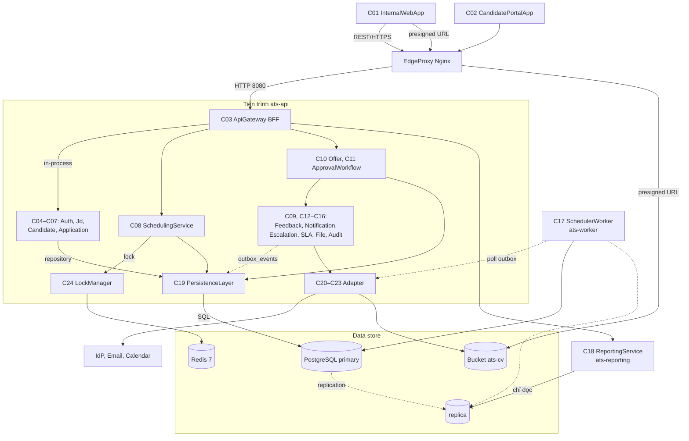
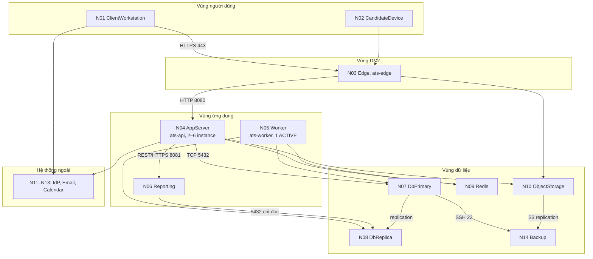
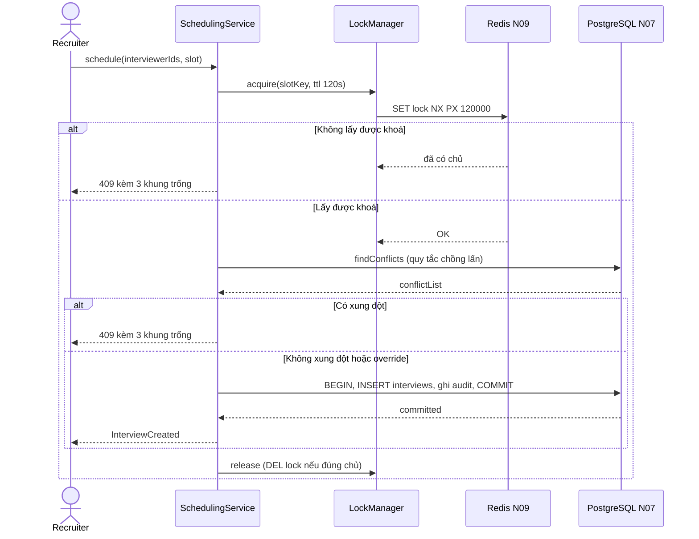
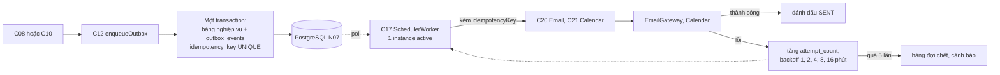
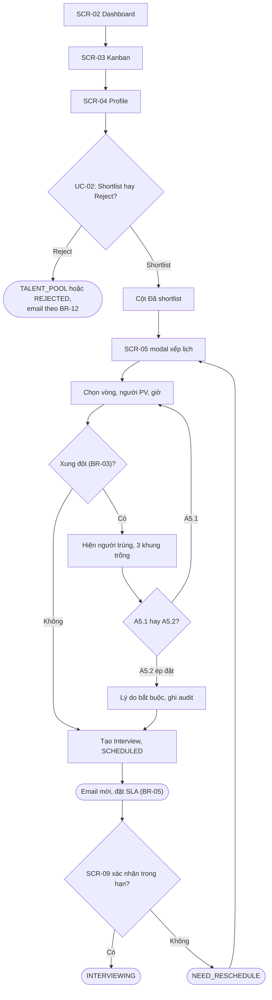
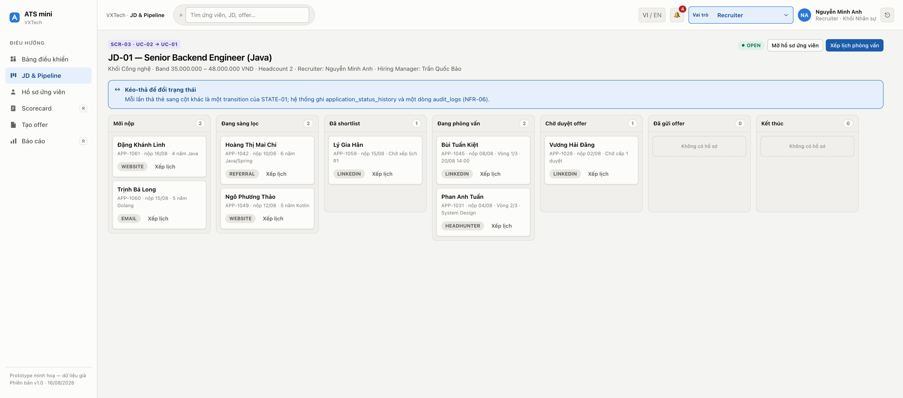
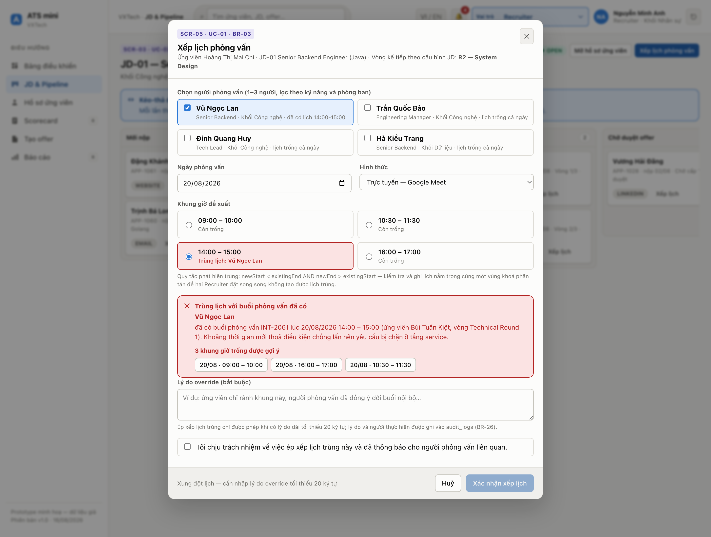
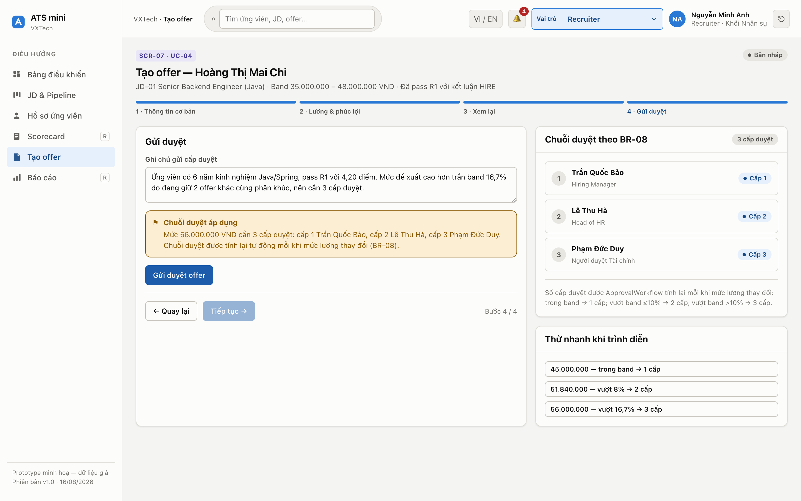
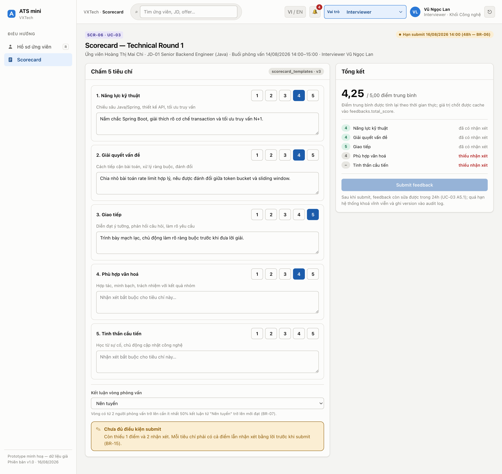

# Chương 5 — Thiết kế kiến trúc và giao diện

*Người phụ trách: D — System & UI Designer, Demo Lead. Chương này chuyển phân tích của Chương 2, 3, 4 thành bản thiết kế thi công được: hai sơ đồ COMP-01 và DEP-01, 12 quyết định ADR-01…ADR-12, 11 màn hình, 14 mã NFR.*

---

## 5.1. Ràng buộc và lựa chọn kiến trúc

Bảng 5.1 tổng hợp sáu ràng buộc dẫn dắt và quyết định tương ứng.

**Bảng 5.1 — Sáu ràng buộc dẫn dắt và quyết định**

| # | Ràng buộc | Nguồn | Quyết định | ADR |
|---|---|---|---|---|
| 1 | ≤50 JD mở, ≤200 ứng viên/JD, ~60 người dùng nội bộ | NFR-08; ~60 là **giả định của chương này** | Modular monolith ba tiến trình | ADR-01 |
| 2 | Kanban p95 ≤2 giây với 500 bản ghi (biên an toàn 2,5× so với ngưỡng 200 của NFR-08) | NFR-01 | BFF tổng hợp response, phân trang cursor | ADR-01 |
| 3 | 0 lịch trùng với 50 request song song | NFR-02, BR-03 | Khoá Redis theo `(interviewer_id, ngày)`, TTL 120 giây | ADR-03, ADR-08 |
| 4 | Hồ sơ chỉ mở đúng phạm vi, mọi lượt tải CV có audit | NFR-05, NFR-12, BR-20 | RBAC từ chối mặc định, presigned URL | ADR-04, ADR-10 |
| 5 | Tải báo cáo không ăn ngân sách 2 giây | NFR-10 | Replica, bốn bảng `rm_*` *(mở rộng lược đồ)* | ADR-02, ADR-07 |
| 6 | BR-03 không enforce được ở tầng DB; BR-08 chỉ ràng buộc `level` 1–3 | Bảng 4.1 của Chương 4 | Đưa quy tắc lên tầng dịch vụ | ADR-03, ADR-08 |

*Về mã BR:* báo cáo dùng hợp của hai tập mã, tổng 23 mã — đặc tả gốc BR-01…BR-13 và 16 mã Chương 2 dùng trong dải BR-03…BR-25 (BR-17, BR-18 không phát hành). BR-13 mang hai nghĩa ở hai nguồn nên chương này nhắc kèm nội dung quy tắc, không chỉ gọi số hiệu. Chương 5 phát hành thêm đúng một mã, **BR-26**: ép xếp lịch trùng chỉ được phép khi có lý do tối thiểu 20 ký tự, ghi vào `audit_logs`.

Đặc tả để ngỏ giữa modular monolith và microservices nhẹ, nên Bảng 5.2 so sánh ba phương án trên năm tiêu chí.

**Bảng 5.2 — So sánh ba phương án kiến trúc**

| Tiêu chí | Monolith một tiến trình | **Modular monolith, 3 tiến trình (chọn)** | Microservices |
|---|---|---|---|
| NFR-01, kanban ≤2 s | Rủi ro: job SLA chung luồng | Đạt: gọi trọn trong `ats-api` | Kém: một màn cần 3–4 service |
| NFR-10, tách báo cáo | Không đạt | Đạt: tiến trình riêng đọc replica | Đạt, không hơn |
| Đúng đắn giao dịch | Đạt: transaction cục bộ | Đạt: transaction cục bộ | Kém: UC-04 dùng saga |
| Chi phí vận hành | Thấp nhất | Thấp: 3 artifact, 1 DB, 1 Redis | Cao: discovery, truy vết |
| Khả năng tiến hoá | Kém: ranh giới dễ nhoà | Được: interface và quyền ghi bảng | Tốt nhất nhưng trả trước |

Monolith một tiến trình bị loại vì ba loại tải khác bản chất — tương tác, job theo lịch, phân tích nặng — tranh cùng pool luồng: loại chậm nhất quyết định trải nghiệm của loại cần nhanh nhất. Microservices bị loại vì nâng ranh giới module thành ranh giới tiến trình quá sớm: luồng duyệt offer của UC-04 chạm bốn bảng, nếu thuộc bốn service thì duyệt cấp cuối thành saga có bù trừ.

---

## 5.2. Kiến trúc logic

### 5.2.1. Sơ đồ thành phần

Hình 5.1 rút gọn COMP-01: gộp module cùng nhóm và bốn adapter; nét liền là lời gọi đồng bộ, nét đứt là bất đồng bộ.

**Hình 5.1 — COMP-01: Sơ đồ thành phần (bản rút gọn)**



### 5.2.2. Nhóm trách nhiệm và ánh xạ lifeline

Bảng 5.3 gộp 24 component thành bốn nhóm trách nhiệm.


**Bảng 5.3 — Component theo nhóm trách nhiệm**

| Nhóm | Component | Trách nhiệm chung | Tiến trình |
|---|---|---|---|
| Presentation | `C01`, `C02`, `C03 ApiGateway` | Hai SPA; BFF định tuyến, xác thực token, tổng hợp response | Trình duyệt, `ats-api` |
| Nghiệp vụ | 13 module `C04`–`C16`: Auth, Jd, Candidate, Application, Scheduling, Feedback, Offer, ApprovalWorkflow, Notification, Escalation, SLA, File, Audit | State machine STATE-01, BR-03, BR-07, BR-08, SLA, audit | `ats-api`, một phần ở `ats-worker` |
| Tiến trình riêng | `C17 SchedulerWorker`, `C18 ReportingService` | Job idempotent theo lịch, đẩy outbox, làm mới read model | `ats-worker`, `ats-reporting` |
| Persistence, Adapter | `C19`, `C20`–`C23`, `C24 LockManager` | Repository và transaction; bốn port ra ngoài (ADR-05); bọc Redis | Cả ba tiến trình |

Bốn adapter `C20`–`C23` ra hệ thống ngoài đều đi qua port theo ADR-05: nhờ đó bốn tích hợp bên thứ ba thay được bằng bản giả khi demo và khi kiểm thử, giá phải trả là thêm một lớp interface.

Bảng 5.4 đối chiếu lifeline sequence diagram Chương 3 với component: 12 lifeline không phải actor người dùng đều có component tương ứng.

**Bảng 5.4 — Ánh xạ lifeline trong sequence diagram của Chương 3 sang component**

| Lifeline (Chương 3) | Diagram | Component | Ghi chú |
|---|---|---|---|
| `UI` | SEQ-01 | `C01` + `C03` | Tách vì quyền kiểm ở máy chủ |
| `SchedulingService`, `NotificationService`, `OfferService`, `ApprovalWorkflow`, `SLAService`, `EscalationService` | SEQ-01…03 | `C08`, `C12`, `C10`, `C11`, `C14`, `C13` | Một–một |
| `CalendarRepo`, `FeedbackRepo` | SEQ-01, SEQ-03 | `C19`, `C21`, `C13`, `C14`, `C16` | Lifeline gộp |
| `EmailGateway` | SEQ-01 | Hệ thống ngoài, qua `C20` | Hai góc nhìn |
| `CandidatePortal` | SEQ-02 | `C02` | Ứng viên không phải `User` |
| `CronScheduler` | SEQ-03 | `C17` | Actor khởi tạo luồng |
| Bốn actor người dùng | SEQ-01, SEQ-02 | Không có | Không phải component |

Hai lifeline gộp `CalendarRepo` và `FeedbackRepo` trả về đúng nơi chịu trách nhiệm ở tầng component; cách vẽ ở Chương 3 vẫn hợp lệ vì sequence kể luồng theo thời gian, component chia theo trách nhiệm.

### 5.2.3. Hai quyết định tách và nguyên tắc chủ sở hữu quyền ghi

`C11 ApprovalWorkflow` tách khỏi `C10 OfferService` vì JD và Offer có hai trục duyệt khác nhau — JD do Hiring Manager duyệt trước khi mở (BR-02), Offer qua tối đa ba cấp (BR-08) — nhưng cùng hiện thực interface `Approvable` của Chương 4; nếu để logic duyệt nằm trong `C10` thì `C05 JdService` phải viết lại lần hai. `ReportingService` tách riêng vì chỉ tiến trình riêng mới đọc được replica; giá phải trả là số liệu trễ tới 15 phút.

Nguyên tắc nền: **một bảng chỉ có một component được phép ghi**. 13 trong 18 bảng của Chương 4 đã sẵn đúng một chủ; ba bảng còn lại được chương này gán chủ — `departments` và `users` thuộc `C04` (quản trị người dùng, cơ cấu tổ chức), `email_templates` thuộc `C12 NotificationService`, component chọn và kết xuất template khi gửi thư. Hai ngoại lệ có chủ đích chia đôi quyền ghi: `application_status_history` do `C07` ghi dòng chuyển trạng thái, `C16` ghi dấu vết kiểm toán; hai cột theo dõi tiến trình duyệt trên `offers` do `C11` cập nhật thay vì `C10`. Nhờ đó mọi buổi phỏng vấn chỉ ghi qua `C08`, mọi thay đổi `applications.status` đều qua `IApplication.transitionTo(...)` — điều kiện để NFR-06 đạt 100%.

---

## 5.3. Kiến trúc triển khai

### 5.3.1. Vùng mạng và node

Hình 5.2 rút gọn DEP-01 theo năm vùng mạng, giữ các node và kênh quyết định tới kiến trúc.

**Hình 5.2 — DEP-01: Sơ đồ triển khai theo vùng mạng**



Bảng 5.5 gộp 14 node và 22 kênh của DEP-01 theo vùng mạng. Ba điểm cần đọc ra: kết nối từ ngoài chỉ vào N03, N06 chỉ chạm replica ở tầng dữ liệu, đường tải CV đi N02 → N03 → N10 **không qua N04**.

**Bảng 5.5 — Node theo vùng mạng: artifact, số instance và kênh chính**

| Vùng | Node | Artifact và số instance | Kênh chính (giao thức, cổng) |
|---|---|---|---|
| Người dùng | N01, N02 | Bundle SPA `C01`, `C02` trên trình duyệt; ~60 máy nội bộ | → N03 HTTPS 443; tải CV → N10 **qua N03**, không qua N04 |
| DMZ | N03 | `ats-edge`; 1, nâng 2 khi cần HA | TLS termination, reverse proxy, cân bằng tải → N04 HTTP 8080 |
| Ứng dụng | N04 | `ats-api`; 2, auto-scale tới 6 khi CPU >70% | → N07 TCP 5432 `sslmode=verify-full`; → N09 TCP 6379 TLS; → N11–N13 HTTPS 443, SMTP 587 |
| Ứng dụng | N05, N06 | `ats-worker` đúng 1 active, `ats-reporting` | N05 → N07, N09 (job theo lịch, đẩy outbox); N04 → N06 REST/HTTPS 8081 (`IReadModel`, interface duy nhất đi qua mạng); N06 → N08 TCP 5432 **chỉ đọc** |
| Dữ liệu | N07–N10 | `postgresql-16` primary (`max_connections = 200`) và hot standby, `redis:7`, `minio` | N07 → N08 replication; N09 giữ khoá, session, hàng đợi outbox |
| Ngoài, sao lưu | N11–N14 | IdP, Email, Calendar; N14 giữ 30 ngày bản sao | N07 → N14 SSH 22; N10 → N14 S3 replication |

### 5.3.2. Quan hệ COMP-01 và DEP-01

Hình 5.1 và Hình 5.2 không suy ra được từ nhau vì dùng hai **đơn vị mô hình hoá** khác nhau: COMP-01 gồm component logic nối bằng interface, DEP-01 gồm node vật lý cùng artifact, nối bằng kênh có giao thức và cổng. Quan hệ là nhiều–một: 24 component đóng gói thành đúng 5 artifact — hai bundle SPA do `ats-edge` phục vụ và ba image `ats-api`, `ats-worker`, `ats-reporting`. `C08` là một khối trên Hình 5.1 nhưng ở Hình 5.2 nằm trong `ats-api` nhân bản 2–6 instance.

### 5.3.3. Số instance và lý do

`ats-api` **stateless hoàn toàn** nên round-robin không cần sticky session; trần 6 instance không tuỳ ý: pool 20 kết nối mỗi instance, 6 instance chiếm 120, cộng N05 vẫn dưới `max_connections = 200`. Hai instance thường trực là **vì khả dụng, không vì thông lượng** — tải đỉnh ước tính 12 request mỗi giây so với năng lực khoảng 100, nhưng một instance thì mọi lần triển khai đều thành gián đoạn. `ats-worker` bị cấm nhân bản vì lý do đúng đắn chứ không phải hiệu năng: hai tiến trình cùng quét bản ghi theo điều kiện thời gian sẽ sinh email nhắc trùng, vi phạm ngưỡng "0 email trùng" của NFR-11. Vẫn cần leader election bằng khoá Redis TTL 90 giây vì triển khai cuốn chiếu làm hai container cùng tồn tại vài giây.


---

## 5.4. Cơ chế thiết kế then chốt

### 5.4.1. Chống trùng lịch phỏng vấn (BR-03, NFR-02)

BR-03 cấm hai buổi phỏng vấn chồng giờ cho cùng một interviewer, kể cả chồng một phút. Đây là ràng buộc liên dòng có yếu tố thời gian, không viết được bằng `CHECK`. Hai khoảng thời gian chồng lấn khi và chỉ khi:

```
newStart < existingEnd  AND  newEnd > existingStart
```

Điểm cốt lõi là thứ tự thao tác: **kiểm tra và ghi phải nằm trong cùng một vùng khoá** (Hình 5.3); kiểm tra xong mới lấy khoá thì hai request cùng đọc "không xung đột" rồi cùng ghi.


**Hình 5.3 — Trình tự lấy khoá, kiểm tra chồng lấn, ghi và nhả khoá**



Đơn vị khoá là cặp `(interviewer_id, ngày)`, không phải từng khung giờ: hai khung chồng lấn một phần (14:00–15:30 và 15:00–16:00) phải rơi vào cùng một khoá mới không bỏ sót cặp xung đột — độ song song đánh đổi lấy đúng đắn. Buổi có n người phỏng vấn lấy n khoá theo thứ tự `interviewer_id` tăng dần để hai request không khoá chéo nhau. TTL 120 giây là van an toàn khi tiến trình chết đột ngột; nhánh ép đặt ở UC-01 A5.2 bắt buộc có lý do kèm `audit_logs` theo BR-26.

Khoá phân tán chỉ tuần tự hoá request đồng thời nên cần lớp thứ hai: optimistic locking bằng cột `version` trên `applications`, `feedbacks`, `offers` (ADR-08) — ba cột này là phần mở rộng lược đồ Chương 4 chưa bao gồm. Redis là điểm hỏng đơn lẻ đã biết nên `C24 LockManager` không bao giờ ghi khi thiếu khoá; mất Redis thì hạ cấp sang advisory lock của PostgreSQL trên cùng khoá, đổi throughput lấy đúng đắn, kèm cảnh báo theo NFR-13.

### 5.4.2. Outbox và idempotency key (ADR-06, NFR-11)

Nhiều luồng vừa ghi cơ sở dữ liệu vừa gọi hệ thống ngoài, chẳng hạn tạo buổi phỏng vấn rồi gửi email mời. Gọi hệ thống ngoài **trong** transaction thì gateway lỗi kéo theo rollback cả giao dịch hợp lệ; gọi **sau khi** commit thì tiến trình chết giữa chừng làm mất thông báo. Vì thế outbox ghi cùng transaction rồi gửi bất đồng bộ (Hình 5.4). Bảng `outbox_events` cùng cột `idempotency_key` là phần mở rộng lược đồ Chương 4 chưa bao gồm; đây là nguồn sự thật, Redis chỉ giữ hàng đợi gửi.

**Hình 5.4 — Luồng outbox và idempotency key**



`idempotencyKey = hash(entity, event, attempt)` có ràng buộc UNIQUE và được truyền cho hệ thống ngoài nên phát lại hàng đợi vẫn an toàn: worker chết trước khi đánh dấu `SENT` thì lần gửi lại dùng khoá cũ, gateway loại bản trùng. **Khoá phân tán chỉ là tối ưu hoá, idempotency mới là bảo đảm.**


### 5.4.3. Read model cho báo cáo (NFR-10)

Bốn biểu đồ của UC-05 phải quét `application_status_history`, khoảng 120.000 dòng cho 12 tháng. Cơ chế chọn là bốn bảng `rm_*` *(mở rộng lược đồ so với Chương 4)* do `C17` làm mới mỗi 15 phút từ replica, `C18` chỉ đọc và trả kèm `dataFreshness`. Hai phương án bị loại: truy vấn thẳng bảng giao dịch làm chi phí tăng theo lịch sử; cập nhật tức thời bằng trigger thì đặt chi phí tính báo cáo lên đúng đường ghi mà NFR-01 bảo vệ.

### 5.4.4. Lưu trữ CV bằng presigned URL (NFR-12)

Tệp CV nằm ở bucket `ats-cv` trên N10, `attachments` chỉ lưu URL, tên tệp và version. Lưu binary trong PostgreSQL làm phình WAL và kéo dài backup; tệp 10 MB đi xuyên N04 thì mỗi lượt tải chiếm một luồng nhiều giây. Vì thế hai SPA tải trực tiếp bằng presigned URL do `C15` sinh sau khi `C04` xác nhận phạm vi — "trực tiếp" là không qua tiến trình `ats-api`, luồng vẫn qua reverse proxy N03 nên bucket không mở ra Internet. URL sống 10 phút, mọi lượt cấp đều có `audit_logs`, trần 10 MB chặn ở hai chỗ — chính sách presigned URL và nginx trên N03 — nên client bị chỉnh sửa cũng không vượt qua. Giá phải trả là hai kho được khôi phục độc lập nên có thể lệch nhau; quy trình khôi phục vì thế có một bước đối chiếu `attachments.file_url` với object còn tồn trên N10.

### 5.4.5. Quy trình duyệt tổng quát (BR-08)

Offer và JD có hai trục duyệt khác nhau nhưng cùng cần lưu vết từng vòng duyệt; viết hai engine riêng thì logic BR-08 bị nhân bản. `C11 ApprovalWorkflow` chỉ làm việc trên interface `Approvable` mà cả `Offer` lẫn `JobDescription` đều hiện thực, nên hai quy trình duyệt dùng chung một engine. Số cấp theo ba nhánh BR-08: trong band một cấp, vượt trần tối đa 10% hai cấp, trên 10% ba cấp; tỷ lệ tính trên **trần band** (51.840.000 so với trần 48.000.000 VND là 8,0%). Khi một cấp chọn `REQUEST_CHANGE`, quy trình chạy lại **từ cấp 1** (UC-04 A4.1); ghi chồng lên dòng `offer_approvals` cũ sẽ xoá mất lịch sử nên lược đồ thêm cột `attempt_no`.

### 5.4.6. Phân quyền từ chối mặc định, hai tầng (BR-20, NFR-04)

Phân quyền là ma trận đối chiếu 6 vai trò nội bộ cộng Candidate với bảy nhóm tài nguyên: JD, hồ sơ ứng viên kèm CV, lịch phỏng vấn, feedback, offer, báo cáo, quản trị. Mỗi ô ghi quyền đọc, quyền ghi hoặc bỏ trống. Recruiter ghi JD mình phụ trách, hồ sơ và lịch; Interviewer chỉ ghi feedback của mình; Candidate chỉ chạm hồ sơ của mình. HiringManager, Head of HR và Người duyệt Tài chính giữ ba cấp duyệt offer; HRAdmin là vai trò duy nhất ghi được nhóm quản trị. Ô trống là **từ chối**: endpoint thiếu khai báo quyền trả 403, lộ lỗi ngay khi kiểm thử — cơ sở của chỉ tiêu 100% endpoint khai báo quyền ở NFR-04. Kiểm tra hai tầng: `C03` hỏi chủ thể có được gọi endpoint không, service hỏi bản ghi có thuộc phạm vi không (phạm vi = JD được giao hoặc phòng ban của chủ thể). Hai câu hỏi không thay thế nhau: gateway biết vai trò nhưng không biết bản ghi thuộc JD nào, còn service không nên gánh việc xác thực token. Ẩn nút trên giao diện là cách ngây thơ, nên `C06` trả DTO theo vai trò (BR-20): Interviewer gọi đúng endpoint hồ sơ ứng viên mình sắp phỏng vấn vẫn chỉ nhận bản rút gọn.

### 5.4.7. Phiên của ứng viên bằng magic link (ADR-09)

Ứng viên là thực thể nghiệp vụ riêng (`candidates`), **không phải** `User`: không có giá trị trong `user_role`, không tham gia RBAC nội bộ. `C04` phát token hạn 7 ngày gắn với cặp `(candidate_id, application_id)`, **dùng-một-lần** cho hành động nhạy cảm như chấp nhận offer. Tạo hàng `users` kèm mật khẩu băm cho ứng viên là cách ngây thơ vì sinh thêm kho mật khẩu của người ngoài; đổi lại, magic link phụ thuộc hộp thư ứng viên.

---

## 5.5. Thiết kế giao diện

### 5.5.1. Danh mục màn hình và user flow

Bảng 5.6 là danh mục 11 màn hình kèm actor và use case: cả 6 use case và hai chức năng F09, F10 đều có màn hình.

**Bảng 5.6 — 11 màn hình, actor và use case phục vụ**

| Mã | Màn hình | Actor chính | UC phục vụ |
|---|---|---|---|
| SCR-01 | Đăng nhập, SSO | 6 vai trò nội bộ | Tiền đề mọi UC |
| SCR-02 | Dashboard | Recruiter và biến thể | UC-01…UC-03, UC-06, F10 |
| SCR-03 | JD Detail — Kanban Pipeline | Recruiter, HM | UC-02 nối UC-01 |
| SCR-04 | Candidate Profile | Recruiter, HM | UC-02, UC-03, UC-04 |
| SCR-05 | Schedule Interview, modal | Recruiter | UC-01 |
| SCR-06 | Scorecard | Interviewer | UC-03 |
| SCR-07 | Offer Wizard 4 bước | Recruiter | UC-04, UC-06 |
| SCR-08 | Offer Approval Inbox | HM, Head of HR, Người duyệt Tài chính | UC-04 |
| SCR-09 | Candidate Portal | Candidate | UC-01, UC-04, UC-06 |
| SCR-10 | Reports Dashboard | HR Admin, Head of HR | UC-05 |
| SCR-11 | Admin: Users, Departments | HR Admin | F09 |

Hình 5.5 nối UC-02 với UC-01 vì hai use case diễn ra liên tiếp trong một phiên. Nó dùng lại luồng ACT-01 nhưng đổi trục — mỗi bước gắn một mã `SCR` — để kiểm mọi nhánh của Chương 3 đều có nơi thao tác; hai user flow của Interviewer và Candidate dựng theo cách đó.

**Hình 5.5 — User flow Recruiter: UC-02 nối UC-01**



### 5.5.2. Ba nguyên tắc thiết kế

Ba nguyên tắc chi phối 11 màn hình.

Thứ nhất, giao diện phục vụ thao tác chứ không phục vụ ấn tượng: dashboard dựng quanh câu hỏi hôm nay phải xử lý việc gì trước; phương án toàn biểu đồ bị loại vì kéo truy vấn báo cáo vào đường giao dịch.

Thứ hai, người dùng không bao giờ thấy tên enum: 17 giá trị `application_status` gộp thành **năm nhóm màu theo hàm ý hành động**: Đang xử lý, Thành công, Cảnh báo, Từ chối, Trung tính. 17 màu vượt xa số màu phân biệt an toàn cho người rối loạn sắc giác, nên giá trị cụ thể phân biệt bằng nhãn chữ trong chip. Hai ca cần biện minh: `GHOSTED` vào nhóm Cảnh báo vì theo BR-11 nó kéo theo mở lại JD, `TALENT_POOL` vào nhóm Trung tính dù đi ra từ hành động Reject.

Thứ ba, quy tắc nghiệp vụ nói thẳng trên giao diện: `SCR-05` in quy tắc chồng lấn, `SCR-07` in phép tính phần trăm vượt band. Đánh đổi là giao diện dày chữ hơn thường lệ, bù lại người dùng kiểm chứng được kết quả thay vì phải tin.

### 5.5.3. Bốn màn hình then chốt

Bốn màn hình dưới đây là nơi các cơ chế nặng nhất của mục 5.4 hiện thành giao diện; ảnh chụp trên prototype ở Chương 6. Cả 11 màn hình đều đặc tả tới mức trạng thái hiển thị — đủ dữ liệu, rỗng, lỗi, bị từ chối quyền — tổng cộng 25 trạng thái. Bốn ảnh chụp ở bốn thời điểm khác nhau của cùng một hồ sơ APP-1042, không phải cùng một lát cắt thời gian.

**Hình 5.6 — SCR-03: Kanban pipeline của JD-01**



Ở Hình 5.6, Kanban được chọn thay bảng danh sách vì thao tác chính ở đây là chuyển trạng thái, không phải tra cứu. Bảy cột phủ đủ 17 giá trị `application_status`, mỗi cột gom các giá trị cùng một giai đoạn (Đang phỏng vấn gom `INTERVIEWING` và `NEED_RESCHEDULE`; Kết thúc gom `HIRED`, `REJECTED`, `DECLINED`, `EXPIRED`, `GHOSTED`, `TALENT_POOL`, `ON_HOLD`); mở một cột cho mỗi giá trị enum bị loại vì buộc người dùng cuộn ngang qua 17 cột phần lớn luôn rỗng. Kéo thả không phải đường duy nhất — thẻ nhận focus bằng Tab, Space nhấc thẻ, mũi tên chọn cột, Enter thả (NFR-14) — và mọi lần chuyển đều qua `IApplication.transitionTo(...)` nên sinh một dòng lịch sử kèm audit. Đây cũng là màn NFR-01 đặt ngưỡng p95 ≤2 giây với 500 bản ghi.

**Hình 5.7 — SCR-05: modal xếp lịch khi phát hiện xung đột**



Hình 5.7 là bề mặt giao diện của cơ chế ở mục 5.4.1: khung 14:00–15:00 bị đánh dấu trùng với buổi INT-2061 của Vũ Ngọc Lan, quy tắc chồng lấn in thẳng lên màn hình, hệ thống gợi ý ba khung trống, nhánh ép đặt chỉ mở khi có lý do tối thiểu 20 ký tự ghi vào `audit_logs` theo BR-26.

**Hình 5.8 — SCR-07: vượt trần band 16,7% và chuỗi duyệt ba cấp**



Hình 5.8 hiện thực ba nhánh của BR-08 và cho thấy **ngưỡng** làm đổi số cấp duyệt: mức 56.000.000 VND vượt trần band 48.000.000 VND đúng 16,7%, tức trên 10%, nên chuỗi duyệt thành đủ ba cấp — Hiring Manager, Head of HR rồi Người duyệt Tài chính. Đây cũng là quy ước tên ba tầng của chương: chính văn gọi "Người duyệt Tài chính", cơ sở dữ liệu lưu `FINANCE`, tầng sơ đồ lifeline và component dùng `Finance`.

**Hình 5.9 — SCR-06: scorecard chưa đủ điều kiện submit theo BR-15**



Hình 5.9 là nơi BR-15 thành ràng buộc thao tác: nút submit chỉ mở khi cả năm tiêu chí đều có điểm kèm nhận xét, phần tổng kết chỉ ra tiêu chí còn thiếu. Ở tầng dữ liệu cột nhận xét vẫn cho phép NULL, nên ràng buộc "phải có nhận xét" chỉ đứng được nhờ tầng dịch vụ chặn và giao diện phản ánh — đúng mô hình Bảng 5.1 đặt ra cho quy tắc không enforce được ở tầng cơ sở dữ liệu.

### 5.5.4. Thư viện thành phần, đa ngôn ngữ, tiếp cận

Thư viện thành phần định nghĩa sẵn bốn biến thể trạng thái rỗng — lần đầu, do bộ lọc, do không có quyền (BR-20), do lỗi tải — vì chúng dẫn tới bốn hành động khác nhau. Lỗi chặn thao tác dùng dải cảnh báo cố định, không dùng toast vì toast tự tắt là bẫy với người dùng bàn phím.


Về đa ngôn ngữ (NFR-09), giao diện không có chuỗi cứng mà đi qua khoá `<màn hình>.<thành phần>.<nhãn>`, tiếng Việt là bản gốc; phải ghi nhận thẳng thắn rằng **NFR-09 mới đạt ở phần giao diện, chưa đạt ở phần email** vì `UNIQUE(template_key)` chỉ cho phép một bản cho mỗi khoá. NFR-14 nhắm WCAG 2.1 mức AA cho 5 màn chính, mỗi màn có một tiêu chí chọn rõ ràng:

- `SCR-02` và `SCR-03` được mở nhiều nhất, riêng `SCR-03` mang tương tác phức tạp nhất là kéo thả;
- `SCR-05` và `SCR-06` là hai màn hệ thống từ chối thao tác nên thông báo lỗi bắt buộc đến được với công nghệ hỗ trợ;
- `SCR-09` là màn duy nhất người ngoài doanh nghiệp chạm tới.

Cam kết gồm tương phản từ 4,5:1, vòng focus 2 px, kéo thả có đường thay thế bằng bàn phím. Mức đã kiểm mới là bảng token màu tính tương phản trên giấy (chữ chính đạt 17,85:1); **chưa có lượt kiểm nào bằng công cụ tự động hay trình đọc màn hình**, nên NFR-14 hiện là cam kết thiết kế.

---

## 5.6. Yêu cầu phi chức năng

12 mã NFR-01…NFR-12 của Chương 2 giữ nguyên; phần việc của chương này là siết ngưỡng và bổ sung điều kiện đo, cộng hai mã bổ sung NFR-13, NFR-14. Siết ngưỡng nghĩa là thay phát biểu định tính bằng số đo được kèm công cụ đo: NFR-10 từ "báo cáo không ảnh hưởng giao dịch" thành "0 kết nối tới primary, p95 ≤3 giây, tuổi read model ≤15 phút", đo bằng `pg_stat_activity` chứ không bằng cách đọc lại chuỗi kết nối. Bảng 5.7 trình bày cả 14 mã theo khuôn đó.

**Bảng 5.7 — 14 yêu cầu phi chức năng: ngưỡng, cách đo và cơ chế**

| Mã | Ngưỡng cốt lõi và cách đo | Cơ chế đạt được |
|---|---|---|
| NFR-01 | Kanban p95 ≤2 s với 500 application/JD; k6 50 VU và `EXPLAIN ANALYZE` | ADR-01; BFF tổng hợp; index `(jd_id, status, applied_at)` |
| NFR-02 | 0 cặp chồng giờ / 50 request song song, p95 giữ khoá ≤300 ms; k6 20 vòng rồi đếm cặp chồng lấn | ADR-03 khoá Redis; ADR-08 |
| NFR-03 | ≥99,9% giờ hành chính 8–18 h T2–T6, tức ≤13 phút/tháng; poll `/healthz` mỗi 30 s | N04 hai instance stateless; N08 làm đích failover |
| NFR-04 | 100% endpoint khai báo quyền, 0 ca vượt quyền; kiểm thử sinh từ ma trận RBAC | ADR-10 từ chối mặc định; `C04` |
| NFR-05 | 0 ca đọc chéo JD, 100% lượt tải CV có audit; kịch bản 3 Recruiter × 3 JD | ADR-04; `C15` cấp URL; DTO theo vai trò |
| NFR-06 | 100% chuyển trạng thái sinh đúng một dòng lịch sử; kiểm chuỗi `from_status`/`to_status` | `C07` ghi trong cùng transaction |
| NFR-07 | RPO ≤24 h (thực tế ~5 phút nhờ WAL archive), RTO ≤4 h, giữ 30 ngày; diễn tập hằng quý | Sao lưu đêm và WAL archive về N14; replica nóng N08 |
| NFR-08 | ≤50 JD mở, ≤200 ứng viên/JD, `ats-api` 2→6 instance; k6 ba mức tải | ADR-01; N04 auto-scale |
| NFR-09 | 0 khoá i18n thiếu bản dịch, 0 template thiếu locale; script CI so khớp hai tệp ngôn ngữ | `C12` chọn theo khoá và locale; BR-12 — **phần email chưa đạt**, cần đổi khoá thành `UNIQUE(template_key, locale)` |
| NFR-10 | 0 kết nối tới primary, p95 ≤3 s, tuổi read model ≤15 phút; `pg_stat_activity`, `refreshed_at` | ADR-07, bốn bảng `rm_*` *(mở rộng lược đồ)* |
| NFR-11 | 0 email trùng khi phát lại 1.000 sự kiện; retry ≤5 lần, backoff 1–16 phút | ADR-06 outbox kèm idempotency key |
| NFR-12 | 0 truy cập bucket không qua chữ ký, URL ≤10 phút, trần tệp 10 MB; thử URL sau 11 phút | ADR-04; `C15` kiểm quyền trước khi ký |
| NFR-13 *(bổ sung)* | ≥99% dòng log có `correlationId`; cảnh báo ≤5 phút khi outbox tồn >100 bản ghi hoặc lag replica >60 s | `C03` truyền `correlationId`; `/healthz` |
| NFR-14 *(bổ sung)* | 0 lỗi tiếp cận nghiêm trọng trên 5 màn chính, tương phản ≥4,5:1, thao tác được bằng bàn phím | Token màu; đường bàn phím thay kéo thả |

Ba mã khó nhất — NFR-02, NFR-05, NFR-10 — dễ bị tuyên bố đạt trong khi chưa đạt, nên cách đo của chúng đo cả cơ chế chứ không chỉ đo kết quả.

---

## 5.7. Kết luận chương

Chương 5 đã chuyển phân tích của ba chương trước thành bản thiết kế thi công được: modular monolith ba tiến trình, chọn bằng so sánh ba phương án trên năm tiêu chí chứ không bằng sở thích công nghệ; kiến trúc logic 24 component phủ đủ 12 lifeline của Chương 3, theo nguyên tắc mỗi bảng chỉ một component được phép ghi; kiến trúc triển khai 14 node theo năm vùng mạng. Bảy cơ chế then chốt là chỗ đứng của các quy tắc nghiệp vụ tầng dữ liệu không enforce được; 11 màn hình và 14 NFR đều có ngưỡng đo được kèm cơ chế.

Hai chỗ thiết kế của chương này đi xa hơn Chương 4. Thứ nhất, `SHORTLISTED` là một trạng thái riêng vì đó là hậu điều kiện của UC-02 và là ranh giới để `C08` được phép xếp lịch, trong khi lược đồ Chương 4 gộp giai đoạn này vào `SCREENING`. Thứ hai, chương yêu cầu tám phần mở rộng lược đồ Chương 4 chưa bao gồm — bảng `outbox_events`, bốn bảng `rm_*` và cột `version` trên `applications`, `feedbacks`, `offers` — vì outbox, read model và optimistic locking không thể hiện thực nếu thiếu chúng.

Chương 6 dựng các màn hình vừa thiết kế thành prototype chạy được rồi trình diễn ba kịch bản nặng nhất: chống trùng lịch, scorecard theo BR-15 và chuỗi duyệt offer nhiều cấp theo BR-08.


---

## 5.8. Phụ lục chương: 12 quyết định kiến trúc

Bảng 5.8 liệt kê 12 quyết định kiến trúc được viện dẫn trong chương, mỗi dòng gồm quyết định chọn và phương án bị loại.

**Bảng 5.8 — 12 quyết định kiến trúc ADR-01…ADR-12**

| Mã | Quyết định | Phương án bị loại |
|---|---|---|
| ADR-01 | Modular monolith, ba tiến trình | Monolith một tiến trình; microservices |
| ADR-02 | PostgreSQL 16 primary kèm một streaming replica | Một node cho cả hai loại tải |
| ADR-03 | Redis 7: khoá phân tán, session, outbox | Khoá bi quan trong cơ sở dữ liệu |
| ADR-04 | Object storage S3-compatible cho tệp CV | Binary trong PostgreSQL; ổ đĩa N04 |
| ADR-05 | Hexagonal, ports-and-adapters | Gọi thẳng SDK trong service |
| ADR-06 | Outbox pattern kèm idempotency key | Gọi hệ thống ngoài trong transaction |
| ADR-07 | Read model báo cáo làm mới theo lịch 15 phút | Truy vấn thẳng bảng giao dịch |
| ADR-08 | Optimistic locking bằng cột `version` | Khoá bi quan `SELECT FOR UPDATE` |
| ADR-09 | Candidate không phải `User`, magic link | Tạo hàng `users` cho ứng viên |
| ADR-10 | RBAC từ chối mặc định, kiểm tra hai tầng | Cho phép mặc định; ẩn nút ở giao diện |
| ADR-11 | Mermaid cho toàn bộ sơ đồ của chương | Công cụ vẽ sinh tệp nhị phân |
| ADR-12 | Prototype HTML/CSS/JS tĩnh một tệp | Prototype có backend cần mạng |
