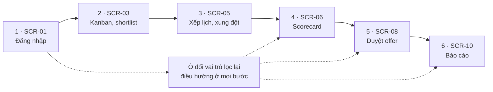

# Chương 6 — Demo và kết luận

*Người phụ trách: D — System & UI Designer, Demo Lead. Chương này đối chiếu sản phẩm phân tích với năm mục tiêu đặc tả, nêu kịch bản demo, tiêu chí nghiệm thu, hạn chế và hướng phát triển.*

---

## 6.1. Kết quả đạt được

Bảng 6.1 truy năm mục tiêu đặc tả xuống sản phẩm phân tích từng chương.

**Bảng 6.1 — Đối chiếu năm mục tiêu hệ thống với sản phẩm phân tích**

| # | Mục tiêu (đặc tả mục 1.2) | Yêu cầu, hành vi (Ch. 2–3) | Dữ liệu (Ch. 4) | Thiết kế (Ch. 5) |
|---|---|---|---|---|
| 1 | Chuẩn hoá quy trình tuyển dụng | UC-01…UC-05; ACT-01, STATE-01 | `applications`, `application_status_history` | C05 JdService, C07; SCR-03 |
| 2 | Loại bỏ trùng lịch | UC-01 A5.1, BR-03; SEQ-01, STATE-02 | `interviews`, `interview_participants` | C08, C24 LockManager; ADR-03; NFR-02; SCR-05 |
| 3 | Tập trung feedback | UC-03, BR-14; SEQ-03 | `feedbacks`, `feedback_criteria` | C09 FeedbackService, C14 SLAService; SCR-06 |
| 4 | Báo cáo funnel, time-to-hire | UC-05, BR-24 | `application_status_history` | ADR-07, `rm_*` *(mở rộng lược đồ)*, C18; NFR-10; SCR-10 |
| 5 | Phản hồi ứng viên trong SLA | BR-05, BR-25; SEQ-03 | `notifications`, `email_templates` | ADR-06 outbox, C12; NFR-11; SCR-09 |

Năm mã BR ở Bảng 6.1 và BR-19 ở Bảng 6.2 đến từ hai nguồn, theo chú thích Bảng 5.1. Đặc tả gốc: BR-03 cấm trùng
lịch cho cùng một interviewer, BR-05 đặt hạn xác nhận lịch. Dải Chương 2 phát hành: BR-14 mỗi
interviewer nộp đúng một feedback, khoá sửa sau 24 giờ; BR-19 buộc mọi chuyển trạng thái sinh
một dòng lịch sử kèm một dòng audit; BR-24 định nghĩa time-to-hire và time-to-fill; BR-25 mỗi
giai đoạn có SLA riêng.

Sản phẩm cả nhóm gồm 7 business actor, 6 use case, 24 business rule, 19 diagram, 18 bảng dữ liệu,
24 component, 14 node, 11 màn hình, 14 NFR và 12 ADR.

Bài tập lớn dừng ở **mức phân tích – thiết kế cộng một prototype click-through**: chưa có backend,
chưa nạp dữ liệu, chưa tích hợp thật với IdP, email gateway hay calendar.

---

## 6.2. Kịch bản demo và tiêu chí nghiệm thu

Kịch bản demo bám năm use case trọng tâm, mở đầu bằng đăng nhập. Hình 6.1 vẽ demo thành một đường
thẳng sáu bước; ba nét đứt tới bước 4, 5, 6 là ba chỗ người trình bày đổi vai trò ngay trên giao
diện — Interviewer chấm scorecard, Hiring Manager duyệt offer, Head of HR đọc báo cáo — biến RBAC từ chối
mặc định (ADR-10) thành thứ quan sát được.

**Hình 6.1 — Luồng demo sáu bước qua các màn hình SCR**

**Bảng 6.2 — Kịch bản demo end-to-end sáu bước**

| Bước | Màn hình | Thao tác | UC / BR chứng minh |
|---|---|---|---|
| 1 | SCR-01 | Mô phỏng tài khoản bị vô hiệu hoá, bị chặn tại `AuthService`, rồi đăng nhập vai trò Recruiter | Tiền đề mọi UC; NFR-04, ADR-10 |
| 2 | SCR-03 | Kéo thẻ ứng viên sang cột "Đã shortlist"; transition sinh một dòng `application_status_history` và một dòng audit | UC-02; BR-19 |
| 3 | SCR-05 | Chọn khung giờ đã bận, đọc cảnh báo xung đột và ba khung trống gợi ý, nhập lý do để mở nút xác nhận | UC-01 A5.1, A5.2; BR-03 |
| 4 | SCR-06 | Chấm năm tiêu chí kèm nhận xét rồi submit; hiện mốc khoá sau 24 giờ | UC-03; BR-14, BR-15 |
| 5 | SCR-08 | Mở offer vượt band 8% nên chuỗi duyệt hai cấp; chọn "Yêu cầu chỉnh sửa" để `attempt_no` tăng lên 2 | UC-04 A4.1; BR-08 |
| 6 | SCR-10 | Đọc bốn biểu đồ và `dataFreshness` | UC-05; BR-24 |

Bước 3 và bước 5 ở Bảng 6.2 quan trọng nhất khi bảo vệ: hệ thống **từ chối** thao tác chứ không chỉ
ghi nhận. Demo đạt yêu cầu khi:

- sáu bước chạy hết;
- hai luồng thay thế bắt buộc A5.1/A5.2 của UC-01 và A4.1 của UC-04 đều được diễn;
- mọi chuyển trạng thái đều nằm trong state machine Chương 3 và sinh dòng audit;
- BR-03, BR-08, BR-14, BR-15, BR-19, BR-24 được chứng minh bằng dữ liệu demo;
- vai trò không có quyền bị từ chối trên giao diện — lớp chặn tại API chỉ kiểm được khi có backend.

Ba use case còn lại chỉ demo luồng cơ bản vì luồng thay thế không quan sát được trên bản tĩnh.

Sản phẩm demo là trang web tĩnh tự chứa, mở trực tiếp bằng trình duyệt, không cần cài đặt hay mạng —
ADR-12 chọn HTML tĩnh một tệp chính là để buổi demo không hỏng vì hạ tầng phòng máy. Dự phòng khi
phòng máy gặp sự cố: video ghi màn hình 3–5 phút đúng sáu bước này, kèm bản PDF slide bảo vệ.

---

## 6.3. Hạn chế

Sáu hạn chế xếp theo mức ảnh hưởng tới kết luận báo cáo.

- **Prototype không có backend nên chưa chứng minh được ràng buộc đồng thời thật.** Cảnh báo xung đột
  lịch dựng từ mảng khung giờ bận cố định; khoá phân tán của BR-03 chưa từng chạy.
- **Các con số NFR là mục tiêu thiết kế, chưa đo trên hệ thống thật.** Cả 14 mã đều có ngưỡng và
  cách đo ở Bảng 5.7, nhưng chưa đo lượt nào.
- **Thiết kế Chương 5 dựa trên vài phần mở rộng mà lược đồ Chương 4 chưa bao gồm.** Chương 5 dùng
  `SHORTLISTED` như trạng thái riêng (hậu điều kiện UC-02), còn lược đồ Chương 4 gộp nó vào
  `SCREENING`; optimistic locking theo ADR-08 cần thêm cột `version` cho `applications`, `feedbacks`
  và `offers`.
- **Chưa thiết kế màn quản trị template email.** BR-12 đòi thư gửi ra ngoài dùng phiên bản đã duyệt,
  NFR-09 đòi đủ hai ngôn ngữ, nhưng thao tác soạn, duyệt, thu hồi chưa có màn hình.
- **Chưa kiểm thử khả dụng với người dùng thật.** Bố cục suy ra từ use case; cam kết WCAG 2.1 mức AA
  mới có tương phản tính trên bảng token.
- **Module gợi ý match CV–JD mới ở mức đề xuất kiến trúc.** Báo cáo mới dành chỗ hiển thị điểm match
  trên SCR-03 và SCR-04, chưa chọn mô hình embedding.

---

## 6.4. Hướng phát triển

Ba nhóm ở Bảng 6.3 sắp theo thứ tự phụ thuộc, mỗi nhóm gắn một điều kiện kích hoạt đo được. Ranh
giới cho nhóm trung hạn đã có sẵn nhờ ADR-01, ADR-05, ADR-06, ADR-07; ngoài ngưỡng của NFR-08,
NFR-10, NFR-13, các số còn lại là giả định.

**Bảng 6.3 — Hướng phát triển và điều kiện kích hoạt**

| Nhóm | Nội dung | Điều kiện kích hoạt |
|---|---|---|
| Ngắn hạn | Tra cứu talent pool; parse CV; gợi ý match CV–JD bằng embedding | Hồ sơ nhãn `TALENT_POOL` vượt 200; nhập liệu thủ công vượt 5 phút mỗi hồ sơ; gợi ý match chỉ bật sau 1.000 hồ sơ gán nhãn |
| Trung hạn | Nâng C18 từ tiến trình riêng lên dịch vụ triển khai độc lập; tách C12 và C08 khỏi `ats-api` | C18 khi p95 báo cáo vượt 3 giây (NFR-10) hoặc lag replica trên 60 giây (NFR-13); C12 khi outbox tồn quá 100 bản ghi; C08 khi số JD mở vượt 50 (NFR-08) |
| Dài hạn | Ứng dụng di động; calendar hai chiều; dự báo time-to-hire | Feedback trễ theo BR-06 vượt 30%; đồng bộ lịch thất bại vượt 2%; đủ 12 tháng read model và 200 lượt hire |

---

## 6.5. Rủi ro thiết kế và biện pháp

Bảng 6.4 nêu bốn rủi ro Chương 5 chưa che được, kèm biện pháp và phương án dự phòng.

**Bảng 6.4 — Bốn rủi ro thiết kế còn lại và cách xử lý**

| # | Rủi ro | Biện pháp thiết kế | Phương án dự phòng |
|---|---|---|---|
| 1 | Recruiter rời công ty, JD mất chủ sở hữu (BR-01) | Chặn vô hiệu hoá tài khoản khi còn JD đang mở, bắt buộc chuyển giao trên SCR-11 | Gán tạm quyền cho Head of HR kèm audit và hạn chuyển giao |
| 2 | Ứng viên yêu cầu xoá dữ liệu cá nhân, xung đột với nhu cầu audit | Ẩn danh hoá trường định danh, giữ số liệu tổng hợp thay vì xoá cứng | Xoá tệp CV nhưng giữ checksum và dòng audit; xử lý thủ công có phê duyệt |
| 3 | Template email hoặc scorecard đổi giữa chừng, dữ liệu lịch sử bị hiểu sai | Ghi lại phiên bản template tại thời điểm dùng | Khoá sửa template khi còn feedback chưa nộp |
| 4 | Read model lệch so với nguồn, số trên SCR-10 sai | Bốn bảng `rm_*` chỉ dựng từ `application_status_history`; job làm mới idempotent | Đối soát hằng đêm; lệch quá 0,5% thì dựng lại `rm_*` |

---

## 6.6. Kết luận

Báo cáo xây dựng một chuỗi truy vết liên tục: từ actor và use case ở Chương 2, xuống hành vi và vòng
đời trạng thái ở Chương 3, xuống cấu trúc dữ liệu ở Chương 4, rồi lên kiến trúc, triển khai, giao
diện và NFR ở Chương 5; năm mục tiêu đều có sản phẩm tương ứng.

Modular monolith ba tiến trình được chọn vì tương xứng quy mô bài toán — dưới 50 JD mở, dưới 200 ứng
viên mỗi JD, khoảng 60 người dùng nội bộ — nhưng giữ sẵn đường tách ba dịch vụ khi ngưỡng ở Bảng 6.3
bị chạm. Mỗi lựa chọn kiến trúc đều có một ADR kèm phương án bị loại; mỗi con số chưa đo đều được
đánh dấu là mục tiêu hoặc giả định. Giới hạn sản phẩm nêu thẳng ở mục 6.3 và 6.5, còn Bảng 6.3 đặt
sẵn ngưỡng đo được cho giai đoạn hiện thực hoá.
