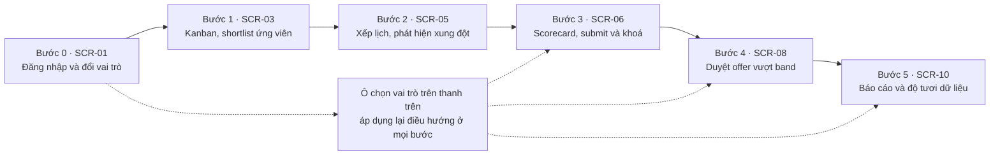

# Chương 6 — Demo và kết luận

Chương 6 khép lại báo cáo bằng bốn việc: đối chiếu sản phẩm phân tích thu được với năm mục tiêu hệ
thống đặt ra ở mục 1.2 của đặc tả, mô tả kịch bản demo và tiêu chí nghiệm thu buổi demo, nêu thẳng
những hạn chế còn lại, và đề xuất hướng phát triển kèm điều kiện kích hoạt. Chương này thay cho phần
phác Chương 6 trong `docs/chapter-A.docx`; nội dung do A phát hành ở đó được giữ nguyên và mở rộng,
nhưng **được đánh số lại theo dải bảng của Chương 6 này**: bảng kịch bản demo của A thành Bảng 6.2,
bảng rủi ro của A thành Bảng 6.5. Vì vậy mọi mã "Bảng 6.x" trong chương này trỏ tới bảng của chương
này; khi cần nhắc tới bản phác của A thì gọi bằng tên bảng chứ không bằng số.

---

## 6.1. Kết quả đạt được

Năm mục tiêu ở mục 1.2 của `spec_ats (1).md` được dùng làm thước đo duy nhất. Bảng 6.1 truy từng mục
tiêu xuống sản phẩm phân tích cụ thể của từng chương, thay vì khẳng định chung chung rằng hệ thống
"đáp ứng yêu cầu".

**Bảng 6.1 — Đối chiếu năm mục tiêu hệ thống với sản phẩm phân tích**

| # | Mục tiêu (spec mục 1.2) | Chương 2 (A) | Chương 3 (B) | Chương 4 (C) | Chương 5 (D) |
|---|---|---|---|---|---|
| 1 | Chuẩn hoá quy trình từ mở JD đến tuyển được người | UC-01…UC-05, BR-19, BR-21, BR-22 | ACT-01 năm swimlane; STATE-01 17 trạng thái | `job_descriptions`, `applications`, `application_status_history` | `JdService` C05, `ApplicationService` C07; SCR-02, SCR-03, SCR-04 |
| 2 | Loại bỏ trùng lịch, tự động hoá xếp lịch | UC-01 kèm A5.1, A5.2; BR-03 | SEQ-01; STATE-02 | `interviews`, `interview_participants` | `SchedulingService` C08, `LockManager` C24, Redis N09; ADR-03; NFR-02; SCR-05 ba trạng thái |
| 3 | Tập trung feedback để quyết định trên cùng một dashboard | UC-03; BR-06, BR-07, BR-14, BR-15 | SEQ-03 ba mốc 24h/48h/72h | `feedbacks`, `feedback_criteria`, `scorecard_templates` | `FeedbackService` C09, `EscalationService` C13, `SLAService` C14; SCR-06, SCR-04 |
| 4 | Báo cáo funnel, time-to-hire, hiệu quả nguồn tuyển | UC-05; BR-24 | Bảng 3.1 truy vết UC-05 | `application_status_history`, `candidates.source` | ADR-07 với bốn bảng `rm_*`, `ReportingService` C18, node N06/N08; NFR-10; SCR-10 |
| 5 | Bảo đảm mọi ứng viên nhận phản hồi trong SLA | BR-05, BR-12, BR-25 | SEQ-03; STATE-01 `NEED_RESCHEDULE` | `notifications`, `email_templates` | ADR-06 outbox, `NotificationService` C12, `SchedulerWorker` C17; NFR-11; SCR-09 |

Cần nói rõ mức độ hoàn thành để không gây hiểu nhầm khi bảo vệ: bài tập lớn dừng ở **mức phân tích –
thiết kế cộng một prototype click-through**, không phải một hệ thống chạy thật. Không có backend,
không có cơ sở dữ liệu được nạp dữ liệu, không có tích hợp thật với IdP, email gateway hay calendar.
Tệp `sql/schema.sql` là DDL PostgreSQL chạy được nhưng chưa từng được nạp dữ liệu và đo hiệu năng;
`prototype/index.html` đọc toàn bộ số liệu từ một đối tượng JavaScript cố định trong chính tệp đó.
Mọi ngưỡng trong NFR-01…NFR-14 vì vậy là **mục tiêu thiết kế kèm phương pháp đo**, không phải kết quả
đo. Bảng 6.1b thống kê khối lượng sản phẩm thực tế có trong repo tại thời điểm nộp.

**Bảng 6.1b — Thống kê sản phẩm phân tích của cả nhóm**

| Hạng mục | Số lượng | Nguồn đếm |
|---|---|---|
| Business actor / supporting actor | 7 / 3 (+1 trigger nội bộ) | Bảng 2.1, Bảng 2.2 của A; Bảng 2.2 có 4 dòng nhưng `Scheduled trigger` là kích hoạt nội bộ, không phải actor ngoài — kết luận X-05, xem Bảng 5.9 và Bảng 5.118 của `docs/traceability_matrix_D.md` |
| Use case đặc tả đầy đủ / rút gọn | 5 / 1 | UC-01…UC-05 và UC-06 |
| Business rule trong phạm vi năm UC | 16 | Bảng 2.15a, 2.15b của A; đặc tả v1.1 có 13 mã gốc; D đề xuất thêm BR-26 |
| Activity diagram / state machine / sequence diagram | 2 / 2 / 3 | `diagrams/B_*.md` |
| Use case diagram | 2 | Tổng quan năm UC và bản riêng cho UC-03 |
| Domain model / class diagram / ERD | 1 / 1 / 1 | `diagrams/C_*.md` |
| Component diagram / deployment diagram | 2 / 1 | COMP-01 toàn cảnh, bản phóng to cụm Offer, DEP-01 |
| Bảng dữ liệu / kiểu ENUM / giá trị ENUM / index | 18 / 9 / 55 / 32 | `sql/schema.sql` |
| Đề xuất bổ sung schema / index gửi C | 9 / 6 | `docs/design_decisions_D.md` mục 4 |
| Component logic / tiến trình triển khai | 24 / 3 | C01…C24; `ats-api`, `ats-worker`, `ats-reporting` |
| Node triển khai (nội bộ / hệ thống ngoài) | 14 (11 / 3) | N01…N14 |
| Màn hình wireframe / khối trạng thái đã vẽ | 11 / 25 | SCR-01…SCR-11, Bảng 5.74 |
| NFR / ADR / mâu thuẫn đang mở | 14 / 12 / 7 | NFR-01…NFR-14, ADR-01…ADR-12, X-01…X-07 |
| Prototype | 1 tệp HTML tự chứa, 11 màn, khoảng 138 KB | `prototype/index.html` |

---

## 6.2. Kịch bản demo

Kịch bản demo bám năm use case trọng tâm theo đúng tinh thần bảng kịch bản demo end-to-end trong bản phác của A, nhưng
được bổ sung **bước 0** ở đầu. Lý do: bốn trong năm bước sau đó đều giả định người thao tác đã có
đúng quyền, trong khi RBAC từ chối mặc định (ADR-10, BR-21, NFR-04) là một trong những quyết định
thiết kế tốn công nhất của Chương 5. Nếu không đổi vai trò ngay trên màn hình, người xem không có
cách nào phân biệt "hệ thống có phân quyền" với "hệ thống chỉ vẽ một giao diện duy nhất". Hình 6.1
mô tả đường đi của sáu bước qua các màn hình.

**Hình 6.1 — Luồng demo sáu bước qua các màn hình SCR**

**Bảng 6.2 — Kịch bản demo end-to-end sáu bước**

| Bước | Màn hình | Thao tác cụ thể | UC / BR / NFR được chứng minh | Kết quả cần thấy trên màn hình |
|---|---|---|---|---|
| 0 | SCR-01 rồi SCR-04 | Đăng nhập với vai trò Interviewer (Vũ Ngọc Lan), quan sát thanh điều hướng; đổi ô "Vai trò" trên thanh trên sang Recruiter (Nguyễn Minh Anh) | Tiền đề mọi UC; BR-20, BR-21; NFR-04, NFR-05; ADR-10 | Interviewer chỉ thấy 2 mục điều hướng (Hồ sơ ứng viên, Scorecard) và hồ sơ ở chế độ chỉ đọc; Recruiter thấy đủ 6 mục, xuất hiện nút "Tạo offer" |
| 1 | SCR-03 | Kéo thẻ Hoàng Thị Mai Chi từ cột "Đang sàng lọc" sang cột "Đã shortlist" | UC-02; BR-19, BR-21; NFR-06 | Thẻ đổi cột; lớp chú thích ghi rõ một transition của STATE-01 sinh đồng thời một dòng `application_status_history` và một dòng `audit_logs` |
| 2 | SCR-05 | Chọn người phỏng vấn Vũ Ngọc Lan và khung 14:00 – 15:00 ngày 20/08, tức khung đã bận; sau đó chọn một trong ba khung gợi ý | UC-01 nhánh A5.1 và A5.2; BR-03, BR-26; NFR-02; ADR-03 | Cảnh báo xung đột kèm tên buổi trùng; ba khung trống được gợi ý; ô lý do bắt buộc bật lên và nút "Xác nhận xếp lịch" bị khoá tới khi hết xung đột hoặc đã nhập lý do |
| 3 | SCR-06 | Đổi vai trò sang Interviewer, chấm năm tiêu chí thang 1–5 kèm nhận xét, chọn kết luận rồi submit | UC-03; BR-06, BR-14, BR-15 | Điểm trung bình cập nhật tức thời; nút submit chỉ mở khi mọi tiêu chí đủ điểm và nhận xét; sau khi submit hiện mốc khoá sau 24 giờ |
| 4 | SCR-08 | Đổi vai trò sang Head of HR, mở offer OFF-318 mức 51.840.000 VND, chọn "Yêu cầu chỉnh sửa" | UC-04 nhánh A4.1; BR-08, BR-16, BR-23; ADR-08 | Dải band hiển thị vượt trần 8% nên chuỗi duyệt có hai cấp; cấp 1 đã duyệt; sau khi chọn yêu cầu chỉnh sửa, chuỗi quay lại cấp 1 và `attempt_no` tăng lên 2 |
| 5 | SCR-10 | Đổi vai trò sang HR Admin, mở báo cáo, đọc bốn biểu đồ và dòng độ tươi dữ liệu | UC-05; BR-24, BR-25; NFR-10; ADR-07 | Funnel 128 hồ sơ còn 7 hire, time-to-hire theo khối kèm đường mục tiêu 30 ngày, hiệu quả nguồn tuyển, tỉ lệ đúng SLA; dòng `dataFreshness` ghi thời điểm read model được làm mới |

Bước 2 và bước 4 là hai bước quan trọng nhất khi bảo vệ vì đó là hai chỗ hệ thống **từ chối** thao tác
của người dùng chứ không chỉ ghi nhận. Ba điểm cần nói rõ về quan hệ giữa prototype và bộ
wireframe. Thứ nhất, các mã định danh dùng trong kịch bản demo đã được đồng bộ về đúng kịch bản dữ
liệu ở Bảng 5.62 của bộ wireframe: hồ sơ dùng dải `APP-1042`, `APP-1045`, `APP-1049`, buổi phỏng vấn
dùng `INT-2061` và `INT-2087`, offer dùng `OFF-317` và `OFF-318`, và ngày xảy ra xung đột lịch là
20/08/2026; ngoài kịch bản demo, prototype dựng thêm một offer `OFF-315` không có trong Bảng 5.62, chỉ
để minh hoạ nhánh chuỗi duyệt ba cấp của BR-08. Thứ hai,
vị trí các thẻ trên kanban của prototype **cố ý** không trùng với lát cắt 17/08/2026 15:48 mà
Hình 5.65 chụp: prototype đặt Hoàng Thị Mai Chi ở cột "Đang sàng lọc" để kịch bản demo có thể bắt đầu
từ thao tác shortlist và đi hết một dòng đời hồ sơ trong sáu bước, trong khi ở mốc mà wireframe chụp
thì hồ sơ này đã ở vòng phỏng vấn thứ hai. Đây là khác biệt về **thời điểm chụp**, không phải khác
biệt về dữ liệu. Thứ ba, prototype dựng `OFF-318` ở **lát cắt `attempt_no = 1`** với mức 51.840.000 VND
(vượt band 8,0%, chuỗi hai cấp, cấp 1 đã duyệt), tức là **không** dựng lại lần duyệt vượt band 15,0%
mà Bảng 5.62 và Hình 5.78 mô tả. Nhờ vậy thao tác "Yêu cầu chỉnh sửa" ở bước 4 làm `attempt_no` tăng
từ 1 lên 2 ngay trước mắt hội đồng; nếu dựng đúng lát cắt của Hình 5.78 thì con số hiện trên màn hình
sẽ là 3 chứ không phải 2.

**Cách mở prototype.** Tệp `prototype/index.html` được mở trực tiếp bằng trình duyệt Chrome, Edge hoặc
Firefox — nhấp đúp vào tệp hoặc dùng menu Tệp rồi Mở tệp. Không cần cài Node, không cần dựng web
server, không cần kết nối mạng: toàn bộ HTML, CSS, JavaScript, biểu đồ SVG và dữ liệu mẫu nằm trong
một tệp duy nhất, đúng ADR-12, nên demo chạy được cả khi phòng bảo vệ mất mạng. Thanh công cụ demo ở
góc dưới bên phải có nút "Trước", "Sau" và "Chạy kịch bản demo" để đi qua sáu bước dựng sẵn kèm lớp
phủ chú thích, trong đó bước đầu là màn đăng nhập và đổi vai trò. Theo mục 8 của
`06_conventions_shared.md`, buổi bảo vệ vẫn cần một bản video ghi màn hình 3–5 phút và bản PDF của
slide làm phương án dự phòng.

---

## 6.3. Tiêu chí nghiệm thu demo

Sáu tiêu chí nghiệm thu do A đề ra được giữ nguyên nội dung và bổ sung cột cách kiểm để mỗi tiêu chí
trở thành một phép thử có kết quả đúng hoặc sai; D thêm hai tiêu chí gắn với NFR-14 và ADR-12.
Bảng 6.3 liệt kê tám tiêu chí đó kèm cách kiểm trên prototype và nguồn của từng tiêu chí.

**Bảng 6.3 — Tiêu chí nghiệm thu buổi demo**

| # | Tiêu chí | Cách kiểm trên prototype | Nguồn |
|---|---|---|---|
| 1 | Mỗi use case chính đi qua luồng cơ bản và ít nhất một luồng thay thế | Bước 1–5 của Bảng 6.2; A5.1 tại bước 2, A4.1 tại bước 4 | A |
| 2 | Mọi chuyển trạng thái xuất hiện đúng trong state machine và có dòng audit | Đối chiếu lớp chú thích ở bước 1 và bước 4 với `diagrams/B_state_application_v1.md` | A |
| 3 | BR-03, BR-05, BR-08, BR-14 và BR-24 được chứng minh bằng dữ liệu demo | BR-03 tại bước 2; BR-05 ở hạn xác nhận trên SCR-09; BR-08 tại bước 4; BR-14 ở mốc khoá 24 giờ tại bước 3; BR-24 ở định nghĩa metric tại bước 5 | A |
| 4 | Vai trò không có quyền bị từ chối | Bước 0 chứng minh lớp ẩn giao diện; lớp chặn tại API và service theo ADR-10 chỉ kiểm được bằng negative test khi có backend, nên tiêu chí này **đạt một phần** | A, D |
| 5 | Lỗi email hoặc calendar không làm mất dữ liệu nghiệp vụ và có cơ chế thử lại | Đối chiếu luồng outbox trong COMP-01 và trạng thái `CALENDAR_SYNC_PENDING`; prototype không mô phỏng lỗi gateway | A |
| 6 | Báo cáo hiển thị định nghĩa metric và độ tươi dữ liệu | Bước 5, dòng `dataFreshness` và chú giải từng biểu đồ trên SCR-10 | A |
| 7 | Toàn bộ sáu bước thao tác được bằng bàn phím, không dùng chuột | Dùng Tab và Enter đi hết Bảng 6.2; kiểm vòng focus trên modal SCR-05 | D, NFR-14 |
| 8 | Demo không phát sinh yêu cầu mạng nào | Mở tab Network của trình duyệt trước khi demo, số request tới miền ngoài phải bằng 0 | D, ADR-12 |

---

## 6.4. Hạn chế

**H-01 — Prototype không có backend nên không chứng minh được ràng buộc đồng thời thật.** Cảnh báo
xung đột lịch ở bước 2 được dựng từ một mảng khung giờ bận cố định trong JavaScript. Cơ chế thật của
BR-03 gồm khoá phân tán qua Redis, truy vấn overlap và thao tác ghi nằm trong cùng một transaction
chưa từng được thực thi lần nào, nên NFR-02 hiện chỉ có luận cứ thiết kế chứ không có bằng chứng.

**H-02 — Các con số NFR là mục tiêu thiết kế, chưa được đo trên hệ thống thật.** Ngưỡng 2 giây cho
danh sách 500 bản ghi, p95 dưới 3 giây cho truy vấn báo cáo hay 0 email trùng khi phát lại outbox đều
kèm kịch bản đo trong `docs/nfr_detail_D.md`, nhưng chưa có lần chạy nào. Riêng NFR-03 còn một mâu
thuẫn số học giữa mức 99% và ngưỡng 13 phút mỗi tháng, đang chờ A quyết cách hiểu.

**H-03 — Bảy điểm mâu thuẫn X-01…X-07 chưa được chốt ở Sync S4.** Hai điểm ở mức P0 chạm cả dữ liệu
lẫn giao diện: X-01 quyết định lịch chuyển `NEED_RESCHEDULE` ở mốc 24 giờ hay 48 giờ, X-02 quyết định
có bổ sung giá trị `SHORTLISTED` vào `application_status` hay không. Nếu X-02 bị bác, cột "Đã
shortlist" trên SCR-03 phải gộp vào `SCREENING` và bước 1 của Bảng 6.2 phải viết lại.

**H-04 — Chưa thiết kế chi tiết màn quản trị template email.** BR-12 đòi mọi thư gửi ra ngoài dùng
phiên bản template đã duyệt và NFR-09 đòi đủ hai ngôn ngữ, nhưng SCR-11 mới dừng ở quản trị người
dùng và phòng ban ở mức low-fi. Toàn bộ thao tác soạn, duyệt, kích hoạt và thu hồi phiên bản template
hiện chưa có màn hình nào phục vụ, dù D đã đề xuất C bổ sung ba cột `locale`, `version`, `is_active`.

**H-05 — Chưa có kiểm thử khả dụng với người dùng thật.** Mọi quyết định bố cục được suy ra từ use
case và từ tần suất thao tác giả định, chưa có Recruiter hay Interviewer nào ngồi thao tác thử. Các
lựa chọn như bảy cột kanban, thanh bên 220 px hay thứ tự bốn bước của Offer Wizard vì vậy chưa được
kiểm chứng. Cam kết WCAG 2.1 mức AA ở NFR-14 cũng mới là ghi chú thiết kế, chưa chạy công cụ kiểm tra
tương phản và trình đọc màn hình trên giao diện thật.

**H-06 — Module gợi ý match CV–JD mới ở mức đề xuất kiến trúc.** F11 nằm trong nhóm stretch goal của
đặc tả và trong báo cáo này chỉ được dành sẵn chỗ hiển thị điểm match trên SCR-03 và SCR-04. Chưa có
lựa chọn mô hình embedding, chưa có tiêu chí đánh giá chất lượng gợi ý, và quan trọng hơn là chưa có
phương án xử lý rủi ro thiên lệch khi dùng điểm số máy sinh để sàng lọc con người.

**H-07 — Bộ số liệu dùng cho demo là dữ liệu giả và chưa đồng bộ hoàn toàn.** Bốn biểu đồ trên SCR-10,
số hồ sơ trên từng cột kanban và mức lương của lần duyệt thứ nhất đều là số giả định, đã được ghi rõ
trong Bảng 5.62 của bộ wireframe, nên không thể dùng để kết luận bất cứ điều gì về hiệu quả nghiệp vụ.
Ngoài ra bộ dữ liệu của prototype không trùng khít bộ dữ liệu của wireframe: prototype có thêm offer
`OFF-315` (Phan Anh Tuấn, JD-03) không xuất hiện trong Bảng 5.62, và dựng `OFF-318` ở lát cắt
`attempt_no = 1` thay vì lát cắt `attempt_no = 2` của Hình 5.78 — hai khác biệt đã được giải trình ở
mục 6.2 nhưng vẫn là chỗ người đọc dễ hiểu nhầm nếu đối chiếu hai tài liệu cạnh nhau.

---

## 6.5. Hướng phát triển

Ba nhóm hướng phát triển dưới đây được sắp theo thứ tự phụ thuộc chứ không theo mức độ hấp dẫn. Mỗi
nhóm gắn với một **điều kiện kích hoạt đo được**, để việc mở rộng là kết quả của một quan sát vận
hành chứ không phải của cảm tính. Trừ các ngưỡng đã có sẵn trong NFR-08, NFR-10 và NFR-13, những con
số còn lại trong Bảng 6.4 là **giả định** do D đề xuất và cần nhóm rà lại khi có dữ liệu thật.

**Bảng 6.4 — Hướng phát triển và điều kiện kích hoạt**

| Nhóm | Nội dung | Điều kiện kích hoạt | Phụ thuộc |
|---|---|---|---|
| Ngắn hạn | F13 — Talent pool: màn tra cứu và tái sử dụng ứng viên đã bị từ chối | Số hồ sơ mang nhãn `TALENT_POOL` vượt 200, tức lúc tìm lại rẻ hơn tuyển mới | Đã có giá trị enum và nhánh A4.1 của UC-02; chỉ thiếu màn hình |
| Ngắn hạn | F12 — Parse CV tự động thành hồ sơ ứng viên | Thời gian nhập liệu thủ công vượt 5 phút mỗi hồ sơ, hoặc một Recruiter phải nhập hơn 30 hồ sơ mỗi ngày | `FileService` C15 và cột `parsed_profile` đã có chỗ |
| Ngắn hạn | F11 — Gợi ý match CV–JD bằng embedding | F12 chạy ổn định ít nhất 3 tháng và có tối thiểu 1.000 hồ sơ đã gán nhãn shortlist hoặc reject để đánh giá chất lượng gợi ý | Phụ thuộc F12; cần bộ tiêu chí đánh giá thiên lệch trước khi bật |
| Trung hạn | Tách `ReportingService` C18 thành dịch vụ độc lập, có kho dữ liệu riêng | p95 truy vấn báo cáo vượt 3 giây (ngưỡng NFR-10), hoặc lag replica giữ trên 60 giây (ngưỡng NFR-13), hoặc chu kỳ làm mới read model 15 phút không kịp hoàn tất | Ranh giới đã tách sẵn ở ADR-01 và ADR-07; chi phí thêm là một ranh giới mạng và nhu cầu trace phân tán |
| Trung hạn | Tách `NotificationService` C12 kèm hàng đợi riêng | Outbox tồn quá 100 bản ghi liên tục 15 phút (cảnh báo NFR-13), hoặc lưu lượng vượt 5.000 thư mỗi ngày, hoặc phải thêm kênh mới ngoài email | ADR-05 và ADR-06 đã cô lập adapter, việc tách không chạm lõi nghiệp vụ |
| Trung hạn | Tách `SchedulingService` C08 | Số JD mở vượt 50 (trần giả định của NFR-08), hoặc tỉ lệ tranh chấp khoá vượt 5% số lượt xếp lịch mỗi ngày | Cần tách `LockManager` C24 theo cùng nhịp |
| Dài hạn | Ứng dụng di động cho Interviewer | Tỉ lệ feedback nộp trễ theo BR-06 vượt 30% và nguyên nhân ghi nhận được là interviewer không ở bàn làm việc; đo bằng bảng `rm_sla_compliance` | Cần API công khai ổn định và cơ chế xác thực thiết bị |
| Dài hạn | Tích hợp calendar hai chiều thay cho đồng bộ một chiều | Tỉ lệ buổi phỏng vấn rơi vào `CALENDAR_SYNC_PENDING` vượt 2%, hoặc trên 20% số buổi phải đổi lịch vì lịch cá nhân thay đổi sau khi đặt | `CalendarAdapter` C21 đã theo mô hình cổng, đổi adapter không chạm C08 |
| Dài hạn | Phân tích dự báo time-to-hire và khả năng lấp đầy JD | Có tối thiểu 12 tháng dữ liệu read model và 200 lượt hire để mô hình đủ ý nghĩa thống kê | Phụ thuộc việc tách `ReportingService` ở nhóm trung hạn |

---

## 6.6. Rủi ro thiết kế và biện pháp

Bảng 6.5 giữ nguyên sáu rủi ro trong bảng rủi ro thiết kế của bản phác A, bổ sung cột xác suất và cột phương án dự phòng
khi biện pháp thiết kế vẫn không chặn được, đồng thời thêm ba rủi ro thuộc phần kiến trúc và triển
khai mà chỉ Chương 5 mới nhìn thấy. Cột xác suất là đánh giá định tính của nhóm, chưa có dữ liệu vận
hành chống lưng.

**Bảng 6.5 — Rủi ro thiết kế, biện pháp và phương án dự phòng**

| # | Rủi ro | Ảnh hưởng | Xác suất | Biện pháp thiết kế | Phương án dự phòng khi vẫn xảy ra |
|---|---|---|---|---|---|
| 1 | Hai Recruiter đặt cùng một khung giờ cho cùng một interviewer | Buổi phỏng vấn trùng, mất uy tín với ứng viên | Cao | Khoá phân tán qua Redis, kiểm tra overlap và ghi nằm trong cùng vùng khoá (ADR-03, C08, C24) | Cho phép ép đặt lịch kèm lý do bắt buộc và audit (BR-26); báo cáo lịch trùng hằng ngày để HR Admin xử lý tay |
| 2 | Email gateway hoặc calendar provider lỗi | Ứng viên không nhận thư mời hoặc offer đúng hạn | Trung bình | Outbox kèm idempotency key, thử lại tối đa 5 lần có backoff (ADR-06, NFR-11) | Lịch nội bộ vẫn hợp lệ ở trạng thái `CALENDAR_SYNC_PENDING`; Recruiter gọi điện theo danh sách outbox tồn đọng |
| 3 | Recruiter rời công ty | JD mất chủ sở hữu, vi phạm BR-01 | Trung bình | Chặn vô hiệu hoá tài khoản khi còn JD đang mở, bắt buộc chuyển giao trên SCR-11 | HR Admin gán tạm quyền phụ trách cho Head of HR và ghi audit, đặt hạn chuyển giao chính thức |
| 4 | Ứng viên yêu cầu xoá dữ liệu cá nhân | Xung đột giữa quyền riêng tư và nhu cầu audit, báo cáo | Thấp | Ẩn danh hoá dữ liệu định danh, giữ khoá thay thế và số liệu tổng hợp thay vì xoá cứng | Xoá tệp CV trên object storage nhưng giữ checksum và dòng audit; mở phiếu xử lý thủ công có phê duyệt |
| 5 | Template email hoặc scorecard đổi giữa chừng | Dữ liệu lịch sử bị diễn giải sai | Trung bình | Chụp ảnh phiên bản tại thời điểm dùng: `scorecard_template_version` và `email_templates.version` (đề xuất P1, P2 gửi C) | Nếu C chưa bổ sung cột: khoá việc sửa template khi còn buổi phỏng vấn chưa nộp feedback |
| 6 | Read model làm mới trễ | KPI hiển thị chậm hơn thực tế, người dùng mất tin tưởng | Cao | Làm mới theo lịch 15 phút và luôn hiển thị `dataFreshness` (ADR-07, NFR-10) | Nút làm mới ngay chạy trên replica, giới hạn tần suất để không đẩy tải sang primary |
| 7 | Redis là điểm chết đơn lẻ của cơ chế khoá lịch | Toàn hệ thống không xếp được lịch mới; nếu bỏ qua khoá thì BR-03 bị hở | Trung bình | Node N09 bật Sentinel khi cần khả dụng cao; `LockManager` dùng TTL 120 giây và chọn hướng fail-closed thay vì cho qua | Chuyển tạm sang advisory lock của PostgreSQL trên cùng khoá `(interviewer_id, slot)` — chậm hơn nhưng vẫn đúng; trong lúc đó chặn thao tác xếp lịch |
| 8 | Read model lệch so với dữ liệu nguồn | Số trên SCR-10 khác số đếm trực tiếp, báo cáo mất giá trị ra quyết định | Trung bình | Bốn bảng `rm_*` chỉ dựng từ `application_status_history` là nguồn chỉ ghi thêm; job làm mới idempotent | Job đối soát hằng đêm so tổng read model với truy vấn nguồn; lệch quá 0,5% thì dựng lại toàn bộ `rm_*` và cảnh báo |
| 9 | Hai bản `ats-worker` cùng chạy | Gửi thư lặp, escalate sai người, offer hết hạn hai lần | Thấp | Chỉ một instance active nhờ leader election bằng khoá Redis (N05); mọi job idempotent, `idempotency_key` là UNIQUE trên `outbox_events` (NFR-11) | Khoá kênh gửi ra ngoài, phát lại từ outbox theo idempotency key; giám sát cảnh báo khi outbox tồn quá 100 bản ghi (NFR-13) |

---

## 6.7. Phân công và đóng góp

Nhóm chia việc theo bốn khối công việc nối tiếp nhau đã mô tả ở mục 1 của `00_README.md`, mỗi người
sở hữu trọn một khối và một chương báo cáo. Bảng 6.6 liệt kê phần việc và sản phẩm chính đã nộp vào
repo; theo mục 9 của cùng tài liệu, mỗi sản phẩm còn cần một thành viên khác review chéo mới được
tính là hoàn thành.

**Bảng 6.6 — Phân công và deliverable chính**

| Người | Vai trò | Chương phụ trách | Deliverable chính trong repo |
|---|---|---|---|
| A | Business Analyst, Requirements Owner | Chương 1, Chương 2 | `docs/chapter-A.docx`: 7 business actor và 4 supporting actor, use case diagram, đặc tả UC-01…UC-05 (Bảng 2.3 — danh mục năm use case có kịch bản), 16 business rule trong phạm vi, glossary và checklist review chéo. UC-06 "Đàm phán lương" ở dạng rút gọn kế thừa từ `spec_ats (1).md` mục 5, không nằm trong tệp của A |
| B | Behavior / Process Analyst | Chương 3 | `report/chapter_3_behavior.md` và 7 tệp `diagrams/B_*.md`: ACT-01, ACT-02, STATE-01, STATE-02, SEQ-01, SEQ-02, SEQ-03 |
| C | Data Architect | Chương 4 | `report/chapter_4_data.md`, `sql/schema.sql` với 18 bảng, 9 kiểu ENUM và 32 index, `docs/data_dictionary_C.md`, 3 tệp `diagrams/C_*.md` |
| D | System & UI Designer, Demo Lead | Chương 5, Chương 6 | `diagrams/D_comp_architecture_v1.md` (COMP-01), `diagrams/D_deploy_topology_v1.md` (DEP-01), `wireframes/D_wireframes_v1.md` với 11 màn, `docs/nfr_detail_D.md` (NFR-01…NFR-14), `docs/design_decisions_D.md` (ADR-01…ADR-12 và sổ mâu thuẫn X-01…X-07), `prototype/index.html`; điều phối slide bảo vệ và buổi dry run S6 |

---

## 6.8. Kết luận

Báo cáo xây dựng một chuỗi truy vết liên tục cho bài toán quản lý tuyển dụng nội bộ: từ actor và use
case ở Chương 2, xuống hành vi và vòng đời trạng thái ở Chương 3, xuống cấu trúc dữ liệu và ràng buộc
ở Chương 4, rồi lên kiến trúc thành phần, hình trạng triển khai, giao diện và yêu cầu phi chức năng ở
Chương 5. Năm mục tiêu hệ thống ở mục 1.2 của đặc tả đều có sản phẩm phân tích tương ứng như Bảng 6.1
đã đối chiếu, và tính nhất quán giữa bốn chương không được khẳng định suông mà được kiểm bằng các
bảng đối chiếu chéo — lifeline của B so với component của D, enum của C so với state machine của B,
màn hình của D so với use case của A — cùng một sổ mâu thuẫn ghi lại đúng bảy chỗ bốn tài liệu chưa
khớp nhau. Việc phát hiện và ghi lại mâu thuẫn, thay vì lặng lẽ chọn một cách hiểu, là phần đóng góp
mà nhóm cho là có giá trị nhất về mặt phương pháp.

Về mặt thiết kế, phương án modular monolith với ba tiến trình triển khai được chọn vì tương xứng với
quy mô bài toán — dưới 50 JD mở, dưới 200 ứng viên mỗi JD, khoảng 60 người dùng nội bộ — nhưng vẫn
giữ sẵn đường tách `ReportingService`, `NotificationService` và `SchedulingService` khi các ngưỡng ở
Bảng 6.4 bị chạm. Mỗi lựa chọn kiến trúc đều có một quyết định ADR kèm phương án bị loại và lý do
loại, mỗi con số chưa đo được đánh dấu rõ là mục tiêu thiết kế hoặc giả định. Phạm vi thực tế đạt
được dừng ở mức phân tích, thiết kế và một prototype click-through chạy offline; những phần còn thiếu
đã được liệt kê thẳng ở mục 6.4, trong đó bảy điểm mâu thuẫn đang mở là công việc phải kết luận ở
Sync S4 trước khi bộ tài liệu này được coi là bản cuối.
