<style>
:root {
  --accent: #1F6FEB;
  --accent-soft: #E8F0FE;
  --ink: #16202A;
  --muted: #5B6B7B;
  --warn: #B54708;
}
section {
  font-size: 23px;
  color: var(--ink);
  padding: 44px 56px;
}
h1 { color: var(--accent); font-size: 40px; margin-bottom: 8px; }
h2 {
  color: var(--accent);
  font-size: 30px;
  border-bottom: 3px solid var(--accent);
  padding-bottom: 6px;
  margin-bottom: 14px;
}
h3 { font-size: 24px; color: var(--muted); font-weight: 600; }
table { font-size: 17px; border-collapse: collapse; }
th { background: var(--accent-soft); }
ul { line-height: 1.45; }
pre, code { font-size: 13px; line-height: 1.25; }
strong { color: var(--accent); }
em.cap { display: block; font-size: 15px; color: var(--muted); margin-top: 6px; }
section.lead { text-align: center; }
section.lead h1 { font-size: 44px; }
</style>

<!-- _class: lead -->

# ATS mini — Hệ thống quản lý quy trình tuyển dụng nội bộ

### Bài tập lớn môn Phân tích & Thiết kế Hệ thống — IT3120
### Trường Đại học Bách khoa Hà Nội

| Thành viên | Vai trò trong nhóm | Chương phụ trách |
|---|---|---|
| A | Requirements Analyst | Chương 1 – 2 |
| B | Behavior / Process Analyst | Chương 3 |
| C | Data Architect | Chương 4 |
| D | System & UI Designer, Demo Lead | Chương 5 – 6 |

Hà Nội, tháng 9 năm 2026 — phiên bản slide v1

<!-- Ghi chú người nói: Chào hội đồng, giới thiệu tên đề tài và bốn thành viên kèm đúng một câu về vai trò từng người. Nói ngay phạm vi: hệ thống nội bộ của một doanh nghiệp công nghệ thông tin quy mô 500–1.000 nhân sự, không phải sản phẩm SaaS bán ra ngoài. Thời lượng cụm slide 1–2: 1 phút. Tổng nội dung 23 phút cộng khoảng 1 phút cho sáu điểm chuyển người, tức 24 phút trên trần 25 phút, dành 10 phút cuối cho hỏi đáp; D giữ đồng hồ. Nguồn chốt của mọi con số thời lượng là mục 4 của `docs/demo_runbook_D.md` — bảng trên chép theo đúng bảng đó. Lưu ý kỹ thuật: họ tên và mã số sinh viên của bốn thành viên cần được điền vào bảng trên trước khi in, và ngày bảo vệ cần cập nhật theo lịch chính thức của bộ môn. -->

---

## Mục lục và phân công trình bày

| Slide | Nội dung | Người trình bày | Thời lượng |
|---|---|---|---|
| 1 – 2 | Giới thiệu, mục lục | D | 1 phút |
| 3 – 6 | Chương 1 – 2: bối cảnh, mục tiêu, actor, use case, business rule | A | 4 phút |
| 7 – 12 | Chương 3: activity, state machine, sequence | B | 4,5 phút |
| 13 – 17 | Chương 4: domain model, class diagram, ERD, chuẩn hoá | C | 4 phút |
| 18 – 24 | Chương 5: kiến trúc, triển khai, cơ chế thiết kế, giao diện, NFR | D | 4 phút |
| 25 – 27 | Demo theo kịch bản 6 bước | D | 4,5 phút |
| 28 – 30 | Chương 6: kết quả, hạn chế, hướng phát triển, hỏi đáp | D | 1 phút |

<!-- Ghi chú người nói: Nói rõ mạch trình bày đi từ "cần gì" (Chương 1–2) sang "chạy thế nào" (Chương 3), "lưu gì" (Chương 4), rồi "dựng bằng gì" (Chương 5) và "chứng minh ra sao" (Chương 6 kèm demo). Nhấn rằng bốn chương dùng chung một bộ mã định danh UC, BR, NFR, ADR nên hội đồng có thể truy ngược bất kỳ khẳng định nào. Nhắc quy ước hỏi đáp: người viết chương nào trả lời câu hỏi của chương đó, D là người đỡ khi cần. Ghi chú kỹ thuật: các sơ đồ trong tệp này viết bằng khối mermaid; khi xuất bằng marp-cli cần bật bộ dựng mermaid hoặc thay bằng ảnh đã kết xuất, xuất kèm một bản PDF dự phòng theo yêu cầu sao lưu ở 06_conventions_shared.md mục 8. -->

---

## Bối cảnh và năm điểm đau của quy trình hiện tại

- Hồ sơ đến từ email, mạng nghề nghiệp, website và giới thiệu nội bộ, nằm rải rác trên ổ chia sẻ nên không kiểm soát được phiên bản CV.
- Lịch phỏng vấn xếp thủ công qua Outlook hoặc Google Calendar, thường xuyên trùng giờ của cùng một người phỏng vấn.
- Feedback ghi trong tệp Word hoặc Excel riêng của từng người, không tạo thành hồ sơ quyết định thống nhất.
- Không đo được funnel, time-to-hire và hiệu quả từng nguồn tuyển vì dữ liệu không liên kết.
- Ứng viên bị "im lặng" do không có cơ chế nhắc phản hồi theo cam kết thời gian.

<!-- Ghi chú người nói: Đây là hiện trạng giả định của một doanh nghiệp công nghệ thông tin quy mô 500–1.000 nhân sự theo spec_ats mục 1.1. Nên kể một câu chuyện ngắn thay vì đọc gạch đầu dòng: một ứng viên nộp hồ sơ qua giới thiệu nội bộ, hai tuần sau vẫn chưa ai trả lời, trong khi hai người phỏng vấn bị xếp trùng giờ cùng một buổi chiều. Nhấn rằng năm điểm đau này ánh xạ trực tiếp sang năm use case trọng tâm ở slide 6, nghĩa là phạm vi hệ thống không được chọn theo cảm tính. Thời lượng cụm slide 3–6: 4 phút. -->

---

## Mục tiêu hệ thống và ranh giới phạm vi

| Trong phạm vi | Ngoài phạm vi |
|---|---|
| Chuẩn hoá vòng đời tuyển dụng bằng một state machine thống nhất cho `Application` | Chấm công, tính lương, quản lý nhân sự sau khi nhận việc |
| Loại bỏ trùng lịch phỏng vấn và tự động hoá việc xếp lịch | Website tuyển dụng công khai |
| Tập trung feedback để quản lý tuyển dụng quyết định trên cùng một dữ liệu | Thanh toán hoa hồng cho đơn vị tuyển dụng bên ngoài |
| Cung cấp báo cáo funnel, time-to-hire, hiệu quả nguồn tuyển | Đánh giá năng lực bằng trí tuệ nhân tạo |
| Bảo đảm mọi ứng viên nhận phản hồi trong SLA đã cam kết | Đa quốc gia, đa múi giờ |

Quy mô thiết kế: tối đa **50 JD mở đồng thời**, **200 ứng viên mỗi JD**, khoảng **60 người dùng nội bộ**.

<!-- Ghi chú người nói: Cột bên phải quan trọng không kém cột bên trái: phần lớn rủi ro của một bài phân tích đến từ phạm vi trôi. Nói rõ ba con số quy mô ở dòng cuối vì toàn bộ Chương 5 dựa vào chúng để chọn kiến trúc, chọn cấu hình máy và đặt ngưỡng NFR-08; nếu quy mô đổi thì kết luận kiến trúc phải xem lại. Nếu hội đồng hỏi vì sao không làm gợi ý ghép hồ sơ với JD bằng trí tuệ nhân tạo, trả lời rằng đó là chức năng mở rộng F11, chỉ được thiết kế chỗ đặt trong kiến trúc chứ không cài đặt, và hệ thống này là hỗ trợ chứ không lấy trí tuệ nhân tạo làm trung tâm. -->

---

## Bảy business actor và ba thành phần hỗ trợ

| Tên trong báo cáo | Tên trên diagram | Trách nhiệm chính |
|---|---|---|
| Quản trị HR | `HRAdmin` | Cấu hình hệ thống, người dùng, phòng ban, template, báo cáo |
| Chuyên viên tuyển dụng | `Recruiter` | Vận hành JD, hồ sơ, pipeline, lịch phỏng vấn và offer |
| Quản lý tuyển dụng | `HiringManager` | Duyệt JD, xem shortlist, quyết định vòng, duyệt offer cấp 1 |
| Người phỏng vấn | `Interviewer` | Xem lịch được giao, chấm scorecard, nộp feedback |
| Ứng viên | `Candidate` | Nộp hồ sơ, theo dõi trạng thái, xác nhận lịch, phản hồi offer |
| Trưởng bộ phận Nhân sự | `HeadOfHR` | Duyệt offer vượt band, xem báo cáo toàn hệ thống |
| Người duyệt Tài chính | `FinanceApprover` | Duyệt offer vượt band trên 10% |

Thành phần hỗ trợ: `IdentityProvider`, `EmailGateway` (bắt buộc), `CalendarProvider` (tuỳ tích hợp).

<!-- Ghi chú người nói: Điểm cần nhấn là hai vai trò duyệt offer được tách hẳn khỏi Quản trị HR, vì BR-08 quy định ba cấp duyệt khác nhau; nếu gộp lại thì không mô hình hoá được chuỗi duyệt. Điểm thứ hai dễ bị hỏi: bộ định thời chạy job SLA không được coi là actor của hệ thống mà là thành phần nội bộ, vì nó nằm bên trong ranh giới hệ thống chứ không phải bên ngoài tương tác vào; đây là điểm A và D đã thống nhất, ghi thành mâu thuẫn X-05 trong sổ mâu thuẫn của D. Trên sequence diagram của B, bộ định thời vẫn được vẽ như một lifeline khởi tạo luồng, đó là góc nhìn khác chứ không phải mâu thuẫn. -->

---

## Năm use case trọng tâm và các business rule chính

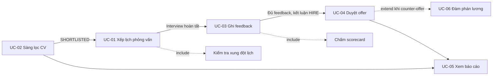

<em class="cap">Hình 2.1 — Quan hệ luồng giữa năm use case trọng tâm, rút gọn (do A thực hiện)</em>

| BR-03 | BR-05 | BR-06 | BR-08 | BR-16 |
|---|---|---|---|---|
| Không xếp hai buổi trùng giờ cho cùng một người phỏng vấn | Xác nhận lịch trong 24 giờ, quá hạn chuyển `NEED_RESCHEDULE` | Feedback nộp trong 48 giờ, quá 72 giờ escalate | Trong band 1 cấp; vượt ≤10% thêm Head of HR; vượt >10% thêm Tài chính | `REQUEST_CHANGE` đưa offer về `DRAFT`, duyệt lại từ cấp 1 |

<!-- Ghi chú người nói: Chỉ vào hai cạnh nét đứt: include là hành vi luôn xảy ra bên trong use case cha, extend là hành vi chỉ xảy ra khi có điều kiện, ở đây là khi ứng viên đề nghị thương lượng lương. Nói rằng báo cáo cố ý chỉ đặc tả chi tiết năm use case thay vì mười hai, để mỗi use case có đủ điều kiện trước, điều kiện sau, luồng chính và ít nhất một luồng ngoại lệ; các thao tác như gửi thông báo hay xuất tệp được mô tả như bước xử lý bên trong. Năm business rule ở bảng dưới là năm rule sẽ xuất hiện lại ở Chương 3, Chương 4 và Chương 5, nên hội đồng có thể theo dõi xuyên suốt. Hết phần của A, chuyển sang B. -->

---

## Chương 3 — Phương pháp phân tích hành vi

| Loại diagram | Góc nhìn | Dùng ở đâu |
|---|---|---|
| Activity Diagram | Quy trình nghiệp vụ theo swimlane của từng vai trò | ACT-01 toàn quy trình, ACT-02 duyệt offer |
| State Machine | Vòng đời của một đối tượng qua các trạng thái | STATE-01 `Application`, STATE-02 `Interview` |
| Sequence Diagram | Tương tác lúc chạy giữa actor và các service | SEQ-01 xếp lịch, SEQ-02 duyệt offer, SEQ-03 SLA feedback |

Ba luồng được chọn vẽ sequence vì cùng thoả ba tiêu chí: **nhiều actor**, **nhiều nhánh rẽ**, **có ràng buộc thời gian hoặc xung đột dữ liệu**.

<!-- Ghi chú người nói: Giải thích vì sao cần cả ba loại diagram thay vì một: activity trả lời ai làm gì theo thứ tự, state machine trả lời một hồ sơ có thể ở những trạng thái nào và đi từ đâu sang đâu, sequence trả lời các thành phần phần mềm nói chuyện với nhau ra sao. Nhấn nguyên tắc chọn luồng vẽ sequence, vì nếu chọn luồng đơn giản thì sequence chỉ là một đường thẳng, không thể hiện được năng lực phân tích. Nói thêm rằng tên các lifeline trên sequence chính là danh sách component ứng viên mà D dùng ở Chương 5, đó là điểm khớp bắt buộc giữa hai chương. Thời lượng cụm slide 7–12: 5 phút. -->

---

## ACT-01 — Toàn bộ quy trình tuyển một ứng viên

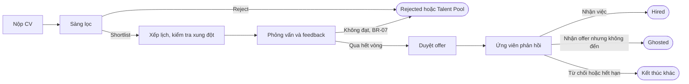

<em class="cap">Hình 3.1 — ACT-01, luồng chính rút gọn (do B thực hiện; bản đầy đủ 5 swimlane trong <code>diagrams/B_act_recruitment_flow_v1.md</code>)</em>

<!-- Ghi chú người nói: Nói rõ bản chiếu ở đây là bản rút gọn để đọc được trên màn chiếu; bản đầy đủ có năm swimlane cho Candidate, Recruiter, Hiring Manager, Interviewer và System, hơn hai mươi node hoạt động. Hai điểm bắt buộc phải nêu: thứ nhất, sau khi buổi phỏng vấn được tạo, hệ thống fork gửi thư mời song song cho ứng viên và người phỏng vấn rồi join lại trước khi đặt hạn xác nhận 24 giờ; thứ hai, quy trình có sáu điểm kết thúc khác nhau chứ không chỉ có Hired và Rejected, trong đó Ghosted là trường hợp ứng viên nhận offer nhưng không đến nhận việc, kéo theo mở lại JD theo BR-11. -->

---

## ACT-02 — Duyệt offer nhiều cấp theo salary band

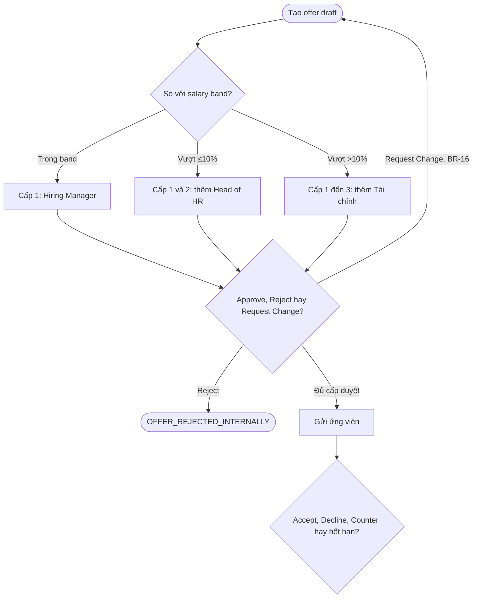

<em class="cap">Hình 3.2 — ACT-02, ba nhánh theo band và vòng lặp duyệt lại (do B thực hiện)</em>

<!-- Ghi chú người nói: Đây là hình thể hiện rõ nhất BR-08. Nhấn vòng lặp từ Request Change quay lại đầu: theo BR-16, khi một cấp yêu cầu chỉnh sửa thì offer trở về trạng thái nháp và chuỗi duyệt bắt đầu lại từ cấp một, không tiếp tục từ cấp đang dang dở, vì nội dung offer đã thay đổi nên chữ ký duyệt cũ không còn giá trị. Nhánh Counter dẫn sang UC-06 Đàm phán lương và tạo một offer mới, đó là lý do một Application có thể có nhiều lần tạo offer. Nếu bị hỏi vì sao không tiếp tục từ cấp dang dở, trả lời bằng đúng lập luận chữ ký duyệt trên một văn bản đã bị sửa. -->

---

## STATE-01 — Vòng đời của một Application

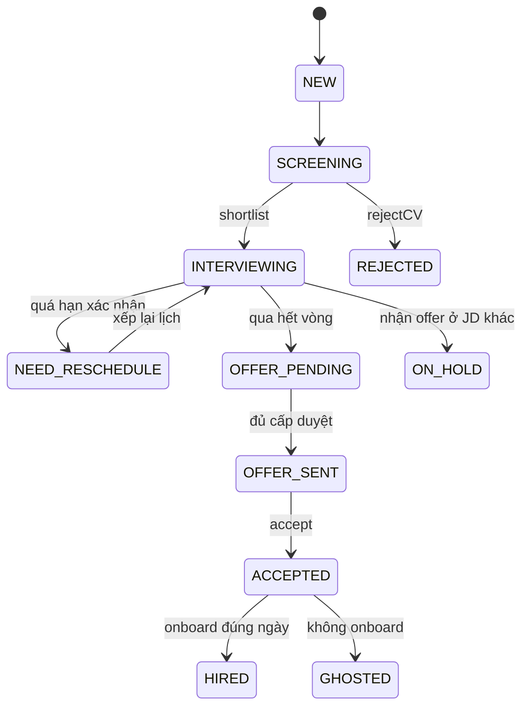

<em class="cap">Hình 3.3 — STATE-01, trục chính rút gọn từ 17 trạng thái (do B thực hiện)</em>

<!-- Ghi chú người nói: Nói ngay rằng bản đầy đủ có đủ 17 giá trị của kiểu application_status, bản chiếu chỉ giữ trục chính cộng ba nhánh đáng chú ý. Ba trạng thái cần giải thích: ON_HOLD xảy ra khi ứng viên nhận offer ở một JD khác nên pipeline hiện tại tạm dừng chờ kết quả nhận việc theo BR-10; TALENT_POOL là kết thúc mềm, giữ hồ sơ cho JD sau; GHOSTED là nhận offer nhưng không đến, kéo theo mở lại JD. Điểm khớp quan trọng với Chương 4: mọi trạng thái trên diagram đều là một giá trị trong kiểu ENUM của cơ sở dữ liệu, không có trạng thái nào chỉ tồn tại trên hình vẽ và cũng không có giá trị ENUM nào không xuất hiện trên hình. -->

---

## SEQ-01 — Xếp lịch phỏng vấn có xung đột

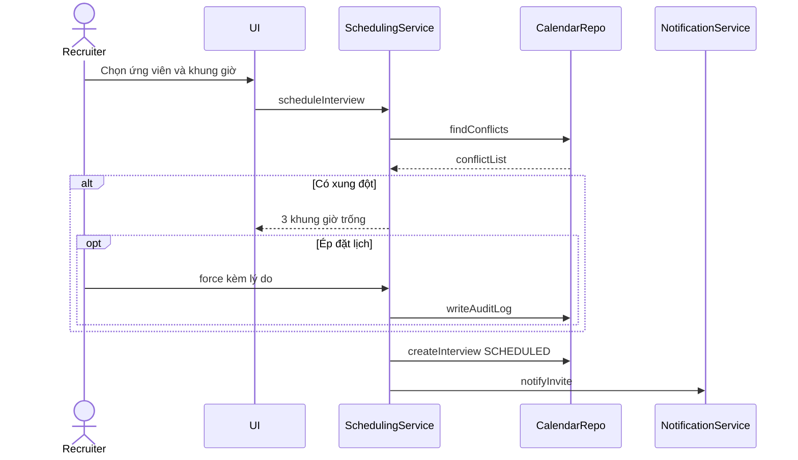

<em class="cap">Hình 3.4 — SEQ-01, cấu trúc chính của luồng xếp lịch (do B thực hiện)</em>

<!-- Ghi chú người nói: Chỉ vào fragment alt và opt: alt là nhánh có hoặc không có xung đột, opt là hành động ép đặt lịch chỉ xảy ra khi người dùng có quyền và chấp nhận ghi lý do. Nhấn rằng mọi lời gọi đều có message trả về, đó là tiêu chí review chéo trong quy ước nhóm. Điểm bàn giao sang Chương 5: SchedulingService không ánh xạ một-một với một bảng cơ sở dữ liệu, và tình huống hai chuyên viên tuyển dụng cùng đặt một khung giờ được xử lý bằng khoá phân tán ở tầng service trước khi ghi, D sẽ trình bày cơ chế đó ở slide 21. -->

---

## SEQ-02 — Duyệt offer nhiều cấp

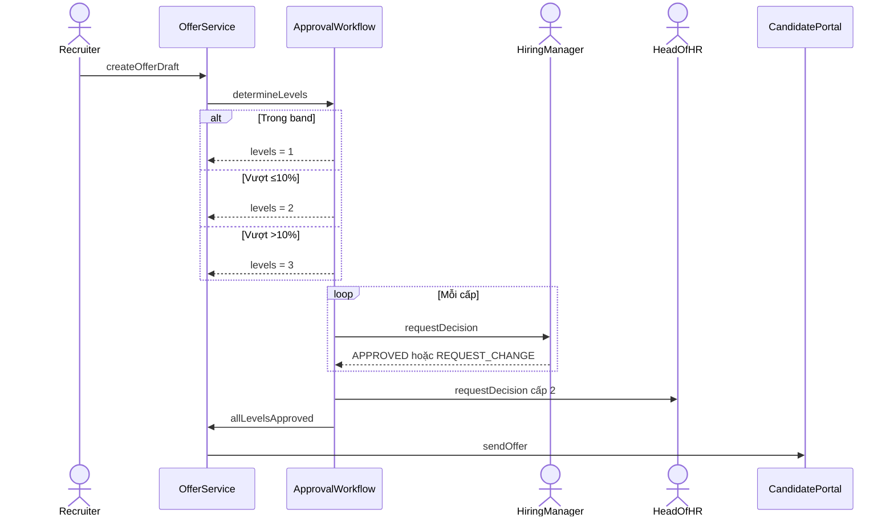

<em class="cap">Hình 3.5 — SEQ-02, sequence phức tạp nhất của báo cáo (do B thực hiện)</em>

<!-- Ghi chú người nói: Đây là diagram trọng tâm khi bảo vệ vì có đủ alt, loop và nhiều actor. Điểm thiết kế cần nêu: ApprovalWorkflow được tách khỏi OfferService có chủ ý. OfferService lo vòng đời văn bản offer, còn ApprovalWorkflow lo tính số cấp và điều phối từng cấp; tách ra để dùng lại đúng engine đó cho quy trình duyệt mở JD theo BR-02, và để OfferService không phình thành một service làm mọi việc. Đây chính là chỗ Chương 4 và Chương 5 nối vào: interface Approvable của C và component C11 của D. Hết phần của B, chuyển sang C. -->

---

## Chương 4 — Ba tầng mô hình dữ liệu

| Tầng | Diagram | Mục đích | Sản phẩm |
|---|---|---|---|
| Conceptual | Domain Model | Nắm khái niệm nghiệp vụ, chưa quan tâm cách lưu trữ | 18 khái niệm, chỉ có tên và bội số |
| Logical | Class Diagram | Thiết kế hướng đối tượng, có kiểu dữ liệu và hành vi | Kế thừa, interface, association class, composition |
| Physical | ERD và DDL | Triển khai thật trên PostgreSQL | 18 bảng, 9 kiểu ENUM, khoá chính, khoá ngoại, index |

Quy trình: liệt kê entity từ use case → Domain Model → phát triển song song Class Diagram và ERD → Data Dictionary → phân tích chuẩn hoá → đối chiếu ngược với Chương 2 và Chương 3.

<!-- Ghi chú người nói: Giải thích vì sao cần ba tầng thay vì vẽ thẳng ERD: mỗi tầng trả lời một câu hỏi khác nhau và có thể hợp lý khi khác nhau, ví dụ Class Diagram có sáu lớp con của User còn ERD chỉ có một bảng users, sẽ nói kỹ ở slide 17. Nhấn bước cuối cùng của quy trình là đối chiếu ngược: mọi trạng thái trong state machine của B phải có chỗ lưu, mọi entity trong use case của A phải có bảng. Thời lượng cụm slide 13–17: 4 phút. -->

---

## Domain Model — 18 khái niệm nghiệp vụ

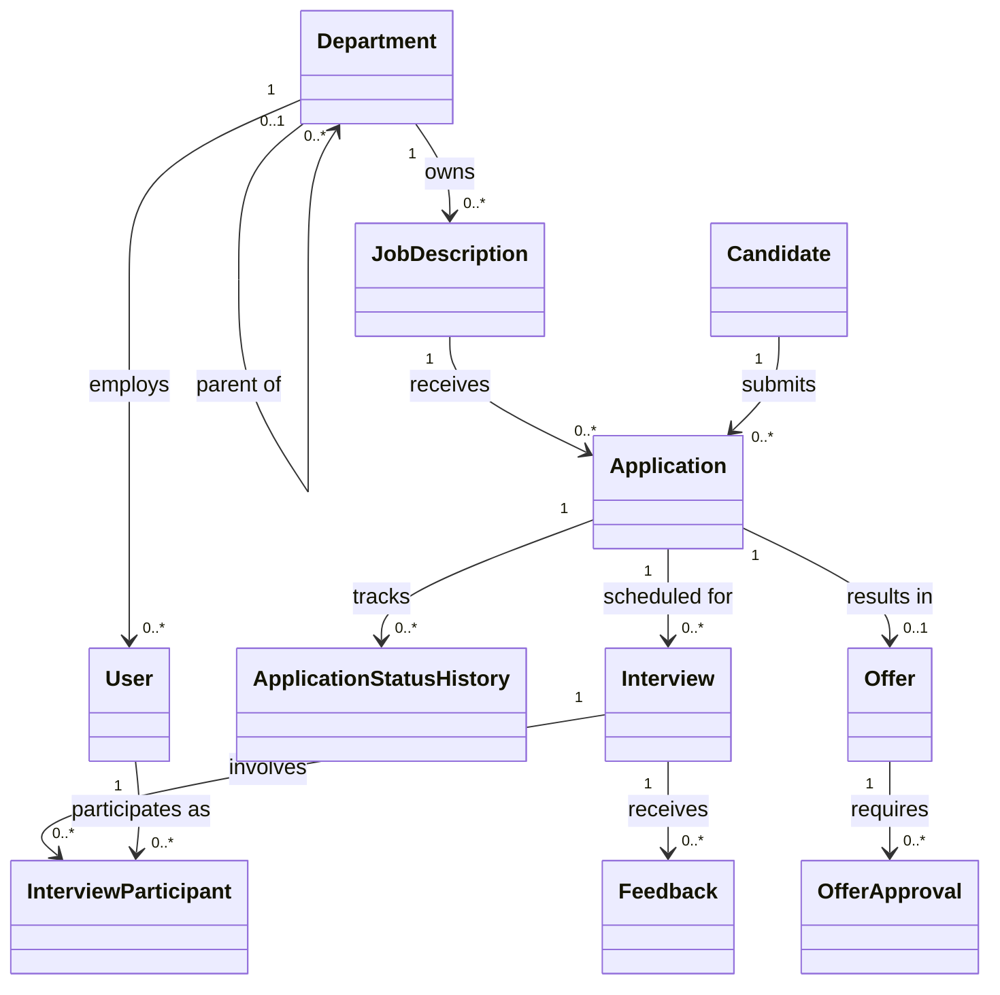

<em class="cap">Hình 4.1 — Domain Model, 11 trong 18 khái niệm (do C thực hiện)</em>

<!-- Ghi chú người nói: Hai ràng buộc kỹ thuật bắt buộc đều nằm trên hình này. Thứ nhất là quan hệ đệ quy: Department tự liên kết với chính nó để mô hình hoá cây tổ chức nhiều cấp, ví dụ Khối Công nghệ có Nhóm Backend, trong đó có Tổ Thanh toán. Thứ hai là quan hệ nhiều-nhiều giữa Interview và User, được hiện thực bằng association class InterviewParticipant vì cần lưu thêm vai trò người phỏng vấn chính hay phụ. Bảy khái niệm không chiếu ở đây là Attachment, InterviewProcess, ScorecardTemplate, FeedbackCriterion, EmailTemplate, AuditLog và Notification; không có khái niệm nào cô lập, mọi khái niệm đều xuất hiện trong ít nhất một use case. -->

---

## Class Diagram — kế thừa, interface, association class

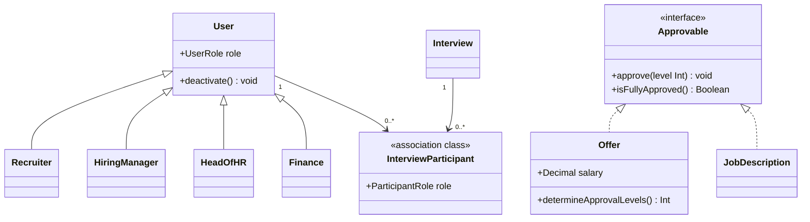

<em class="cap">Hình 4.2 — Class Diagram, ba cấu trúc hướng đối tượng trọng tâm (do C thực hiện)</em>

<!-- Ghi chú người nói: Ba cấu trúc cần chỉ tận tay. Kế thừa: sáu vai trò là lớp con của User vì mỗi vai trò có hành vi khác nhau, hình chỉ chiếu bốn để đọc được, còn thiếu Interviewer và HRAdmin. Interface Approvable: cả Offer và JobDescription đều có thể được duyệt theo cấp, nên trừu tượng hoá thành một hợp đồng chung, nhờ đó Chương 5 chỉ cần một engine duyệt dùng cho cả hai. Association class InterviewParticipant: quan hệ nhiều-nhiều có thuộc tính riêng nên không thể là một cạnh trơn. Ngoài ra Feedback và FeedbackCriterion là quan hệ composition, ánh xạ sang ON DELETE CASCADE ở tầng SQL. -->

---

## ERD — 18 bảng trên PostgreSQL 16

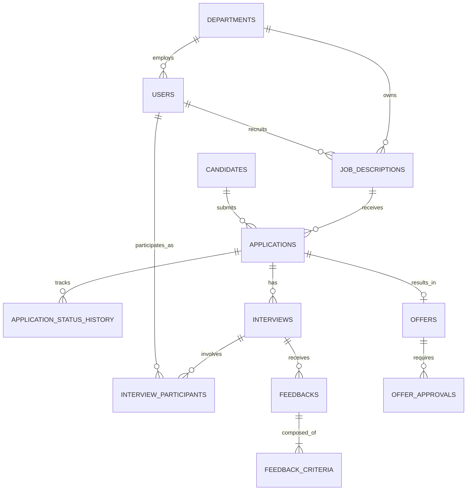

<em class="cap">Hình 4.3 — ERD, 13 quan hệ cốt lõi trong tổng số 18 bảng (do C thực hiện; DDL chạy được tại <code>sql/schema.sql</code>)</em>

<!-- Ghi chú người nói: Nhấn ba phép chuyển đổi từ tầng logic sang tầng vật lý. Một, quan hệ nhiều-nhiều thành bảng trung gian interview_participants có khoá thay thế và ràng buộc duy nhất trên cặp buổi phỏng vấn và người phỏng vấn. Hai, kế thừa sáu vai trò thành một bảng users duy nhất với cột role kiểu ENUM, lý do ở slide sau. Ba, interface Approvable không có bảng riêng vì interface không tồn tại ở tầng lưu trữ, hành vi được bảo đảm bằng ràng buộc ENUM trên cột trạng thái. Nói thêm rằng bảng application_status_history được thêm ở phiên bản 1.2 chính là nguồn dữ liệu cho báo cáo time-in-stage mà D dùng ở Chương 5. Nếu bị hỏi về khối lượng, toàn bộ 18 bảng có khoảng 150 cột, 11 ràng buộc duy nhất và 15 ràng buộc kiểm tra. -->

---

## Chuẩn hoá 3NF và hai điểm cố ý phá chuẩn

| Cột phá chuẩn | Tính lại được từ | Vì sao vẫn giữ |
|---|---|---|
| `feedbacks.total_score` | `AVG(feedback_criteria.score)` | Danh sách feedback được đọc rất thường xuyên, còn điểm chỉ đổi khi người phỏng vấn sửa trong 24 giờ đầu; tỷ lệ đọc trên ghi rất cao |
| `applications.current_round` | `MAX(interviews.round_order)` | Màn kanban dựng hàng trăm hồ sơ cùng lúc; tính `MAX()` qua JOIN cho từng dòng sẽ chậm ở quy mô 50 JD × 200 ứng viên |

- **1NF**: mọi cột nguyên tử; 5 cột JSONB luôn đọc–ghi nguyên khối nên không tách bảng.
- **2NF**: mọi bảng dùng khoá thay thế đơn nên không có phụ thuộc bộ phận.
- **3NF**: `applications` không lưu `candidate_name` hay `jd_title`, lấy qua JOIN khi cần.
- Cả hai cột phá chuẩn được đồng bộ ngay tại thời điểm ghi dữ liệu nguồn, không đồng bộ theo lịch.
- `users` dùng single-table inheritance: đổi lại không đặt được ràng buộc riêng theo vai trò ở tầng cơ sở dữ liệu.

<!-- Ghi chú người nói: Đây là slide dễ bị hỏi nhất của Chương 4. Câu hỏi quen thuộc là cột JSONB có vi phạm 1NF không: trả lời rằng về hình thức là có, nhưng chỉ chấp nhận ở những cột luôn được đọc và ghi nguyên khối, không bao giờ truy vấn theo từng phần tử con; nếu tách bảng thì chỉ thêm JOIN mà không thêm khả năng truy vấn nào. Câu hỏi thứ hai là phá chuẩn có gây lệch dữ liệu không: trả lời rằng cả hai cột được cập nhật trong cùng giao dịch với dữ liệu nguồn nên không có cửa sổ lệch, và đây là đánh đổi có chủ ý chứ không phải sơ suất. Hết phần của C, chuyển sang D. -->

---

## Vì sao chọn modular monolith — ADR-01

| Tiêu chí | Microservices theo bounded context | Monolith một tiến trình | **Modular monolith, 3 tiến trình (chọn)** |
|---|---|---|---|
| Chi phí vận hành | Cao: service discovery, truy vết phân tán, giao dịch phân tán cho luồng duyệt offer | Thấp nhất | Thấp: một mã nguồn, ba entrypoint |
| Cô lập tải | Tốt | **Kém**: một truy vấn báo cáo 12 tháng đẩy p95 của kanban vượt NFR-01 | Tốt: `ats-api`, `ats-worker`, `ats-reporting` tách theo đặc tính tải |
| Giao dịch nghiệp vụ | Cần saga hoặc giao dịch phân tán | Giao dịch cục bộ | Giao dịch cục bộ của PostgreSQL |
| Phù hợp quy mô mục tiêu | Thiết kế quá mức ở 10.000 hồ sơ, 60 người dùng | Không mở rộng riêng phần nặng được | Vừa đúng, vẫn tách service về sau được |
| Giá phải trả | — | — | Lỗi nặng ở một module làm sập cả `ats-api`; ranh giới module giữ bằng kỷ luật lập trình |

<!-- Ghi chú người nói: Trình bày theo lối loại trừ chứ không theo lối ca ngợi lựa chọn của mình. Microservices bị loại vì chi phí hệ phân tán lớn hơn nhiều lần lợi ích ở quy mô 10.000 hồ sơ hoạt động và một đội nhỏ không có bộ phận vận hành riêng. Monolith một tiến trình bị loại vì không cô lập được ba loại tải rất khác nhau: tải tương tác, tải job theo lịch và tải phân tích. Kiến trúc không hàm bị loại vì mô hình khởi động nguội không giữ được khoá phân tán 120 giây của BR-03. Nói rõ cả cột giá phải trả, vì một quyết định kiến trúc không nêu mặt trái là một quyết định chưa được cân nhắc. Thời lượng cụm slide 18–24: 6 phút. -->

---

## Component Diagram — COMP-01

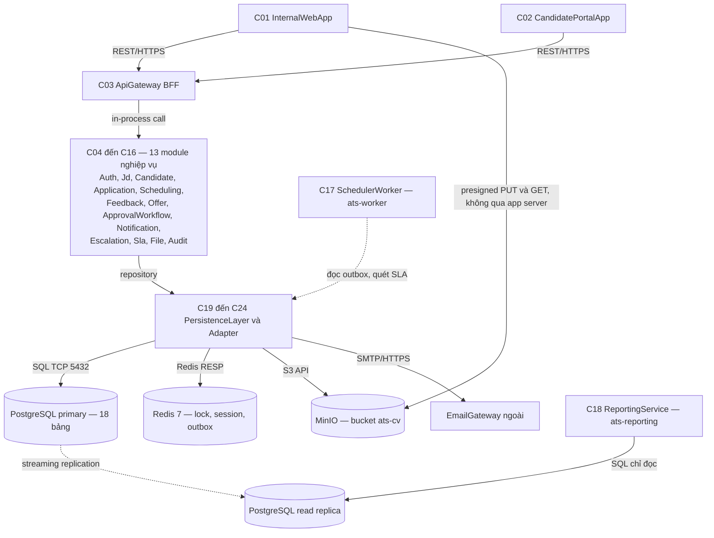

<em class="cap">Hình 5.1 — COMP-01, rút gọn từ 24 component (do D thực hiện; bản đầy đủ tại <code>diagrams/D_comp_architecture_v1.md</code>)</em>

<!-- Ghi chú người nói: Ba điều cần chỉ trên hình. Một, mọi lifeline trong sequence diagram của B đều tìm được component tương ứng ở đây: SchedulingService là C08, ApprovalWorkflow là C11, SLAService là C14, EscalationService là C13; bảng đối chiếu đầy đủ nằm trong tài liệu component. Hai, cạnh nét đứt là luồng bất đồng bộ; NotificationService không gọi thẳng cổng thư mà chỉ ghi một bản ghi outbox trong cùng giao dịch nghiệp vụ, sau đó SchedulerWorker mới đẩy đi kèm khoá chống trùng. Ba, cạnh dưới cùng là đường tải CV đi thẳng từ trình duyệt vào kho đối tượng, không qua máy chủ ứng dụng; đó là câu trả lời cho câu hỏi ứng viên nộp CV 10 MB thì lưu ở đâu. Nói rõ in-process call nghĩa là gọi phương thức trong cùng tiến trình, không qua mạng, và đó là điểm phân biệt cốt lõi với microservices. -->

---

## Deployment Diagram — DEP-01

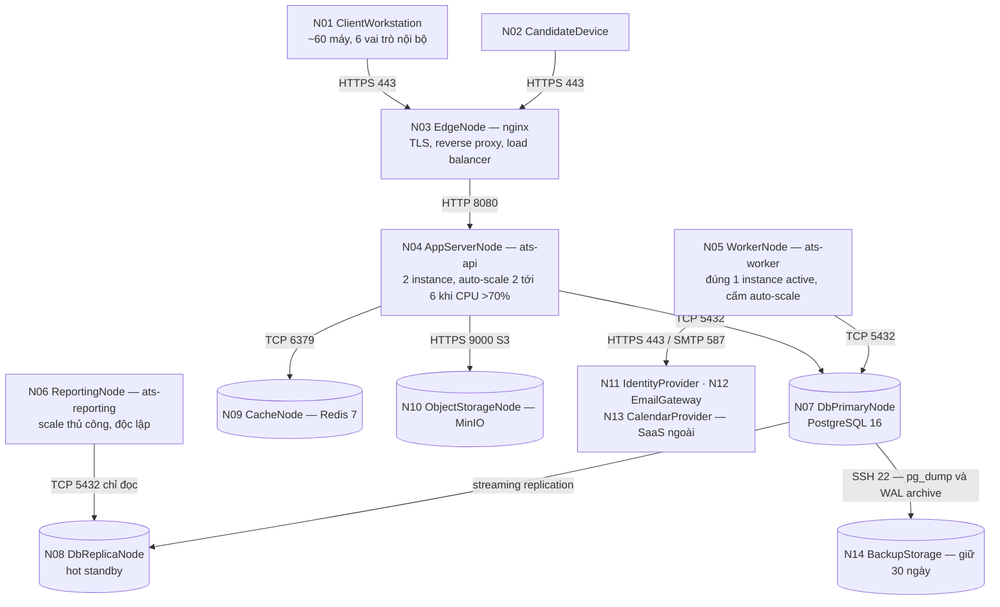

<em class="cap">Hình 5.2 — DEP-01, 12 trong 14 node theo vùng mạng (do D thực hiện; bản đầy đủ là Hình 5.10 tại <code>diagrams/D_deploy_topology_v1.md</code>)</em>

<!-- Ghi chú người nói: Nói ngay điểm phân biệt: sơ đồ thành phần trả lời trách nhiệm nghiệp vụ thuộc về ai, sơ đồ triển khai trả lời tiến trình nào chạy ở đâu và đi qua đường mạng nào; 24 component được đóng gói thành đúng 5 artifact triển khai. Ba ghi chú nhân bản bắt buộc nêu: ats-api không lưu trạng thái nên nhân bản tự do từ 2 lên 6 instance, trần 6 bị chặn bởi số kết nối tối đa tới PostgreSQL chứ không phải bởi CPU; ats-worker bị cấm nhân bản tự do vì hai worker cùng chạy sẽ gửi hai email nhắc cho cùng một buổi phỏng vấn, nên chỉ một instance giữ khoá leader trên Redis; ats-reporting chỉ đọc bản sao nên tăng số instance không tạo thêm một byte ghi nào lên máy chính. Hai instance ats-api được chọn vì khả dụng chứ không vì tải: theo ước lượng, tải đỉnh thiết kế chỉ khoảng 12 request mỗi giây trong khi hai instance đáp ứng khoảng 100, dư khoảng 8 lần; con số này là ước lượng, chưa đo trên hệ thống thật. -->

---

## Cơ chế chống trùng lịch — BR-03 và NFR-02

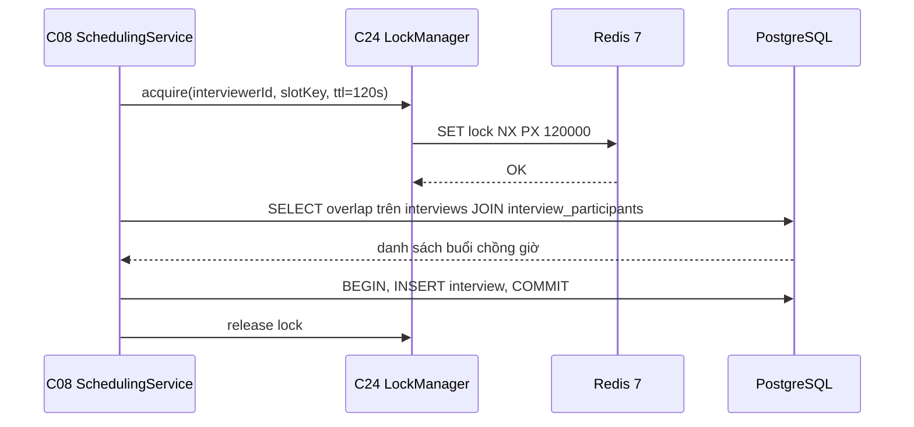

<em class="cap">Hình 5.3 — Trình tự chống trùng lịch, kiểm tra và ghi nằm trong cùng vùng khoá (do D thực hiện)</em>

Quy tắc chồng lấn: `newStart < existingEnd AND newEnd > existingStart` — **kiểm tra và ghi phải nằm trong cùng vùng khoá**.

<!-- Ghi chú người nói: Đây là chỗ trả lời trực tiếp câu hỏi Redis dùng làm gì. Nhấn rằng cái sai kinh điển là kiểm tra xung đột xong mới xin khoá, khi đó vẫn còn cửa sổ để hai chuyên viên tuyển dụng cùng ghi; ở đây khoá được lấy trước và chỉ nhả sau khi giao dịch đã ghi xong. Giải thích vì sao không dùng ràng buộc duy nhất ở cơ sở dữ liệu: xung đột lịch là quan hệ chồng lấn khoảng thời gian giữa các dòng khác nhau, không quy về được một khoá duy nhất. Vì sao không dùng advisory lock của PostgreSQL: mỗi khoá chiếm một kết nối trong suốt thời gian giữ, và khi ats-api chạy 6 instance thì kết nối tới máy chính là tài nguyên khan hiếm; ngoài ra khoá Redis có thời gian sống nên tiến trình chết không để lại khoá vĩnh viễn. Nói rõ Redis chỉ là bộ nhớ tạm, không phải nguồn sự thật; nếu Redis chết thì hạ cấp sang khoá hàng của PostgreSQL. -->

---

## Cơ chế duyệt offer nhiều cấp — BR-08 và BR-16

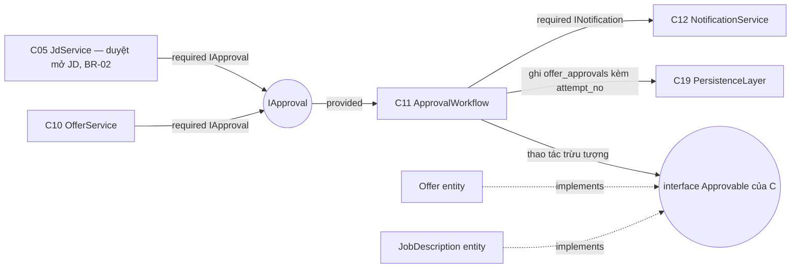

<em class="cap">Hình 5.9 — Chi tiết interface và port của cụm Offer trong COMP-01: một engine dùng chung cho hai loại đối tượng (do D thực hiện; bản đầy đủ tại <code>diagrams/D_comp_architecture_v1.md</code>)</em>

<!-- Ghi chú người nói: Điểm cần nhấn là ApprovalWorkflow không biết mình đang duyệt cái gì; nó chỉ làm việc trên interface Approvable mà C đã định nghĩa, gồm approve theo cấp, reject kèm lý do và kiểm tra đã đủ cấp chưa. Nhờ vậy quy trình duyệt mở JD theo BR-02 và quy trình duyệt offer nhiều cấp theo BR-08 dùng chung một engine, một bảng lịch sử và một màn hộp thư duyệt, thay vì viết hai lần. Điểm thứ hai là cột attempt_no: khi một cấp chọn yêu cầu chỉnh sửa thì số lần duyệt tăng lên và chuỗi duyệt bắt đầu lại từ cấp một, nhưng lịch sử của lần duyệt trước vẫn được giữ nguyên để kiểm toán. Điểm thứ ba là hướng phụ thuộc một chiều: OfferService phụ thuộc IApproval, còn ApprovalWorkflow không hề biết IOffer tồn tại; nếu vẽ mũi tên hai chiều thì việc tách service sau này trở nên vô nghĩa. -->

---

## Thiết kế giao diện — bản đồ 11 màn hình

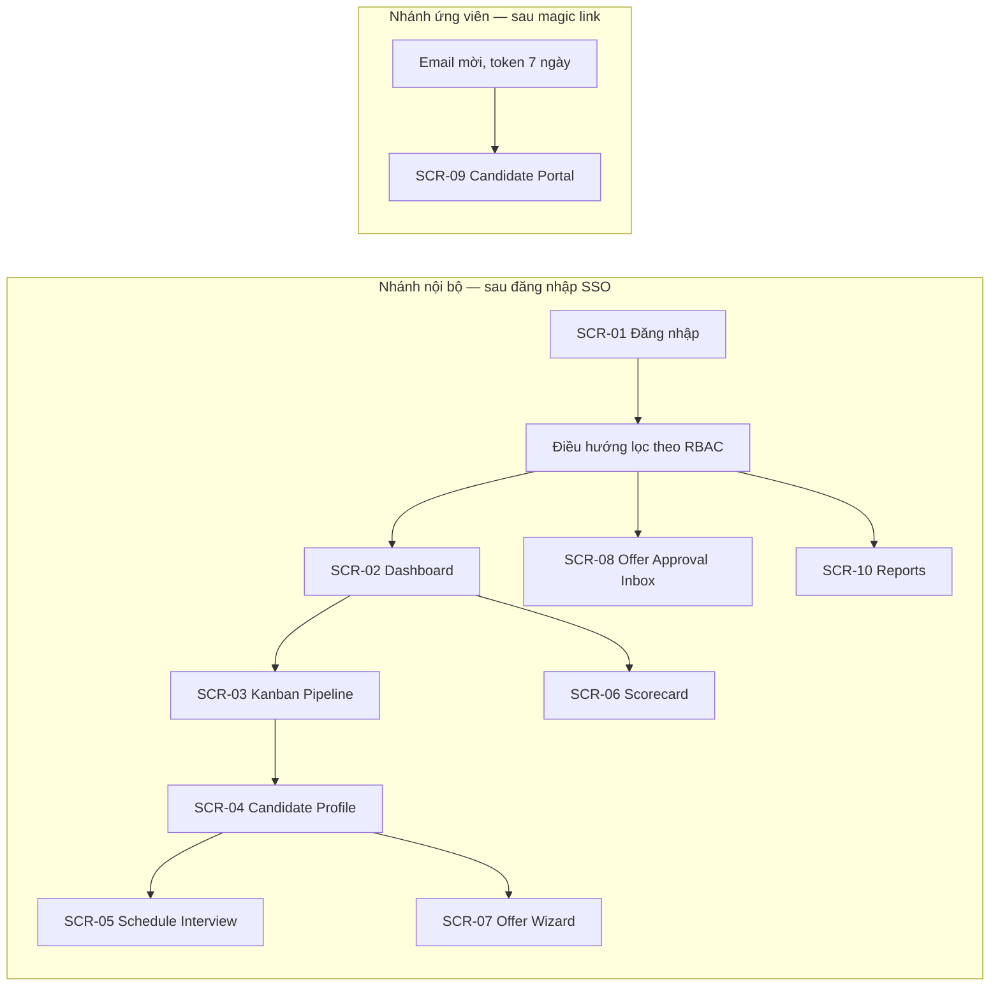

<em class="cap">Hình 5.20 — Bản đồ màn hình, hai nhánh điều hướng tách rời (do D thực hiện; chưa chiếu SCR-11 Admin)</em>

<!-- Ghi chú người nói: Điều đáng nói nhất trên hình là hai nhánh không có bất kỳ cạnh nối nào, và đó là chủ ý chứ không phải thiếu sót. Ứng viên không phải một hàng trong bảng users, không có đăng nhập một lần, không có thanh điều hướng trái; lối vào duy nhất là liên kết có token hạn 7 ngày, dùng một lần cho hành động nhạy cảm như chấp nhận offer, và bị thu hồi khi hồ sơ chuyển sang trạng thái cuối. Kênh duy nhất nối hai nhánh là email, tức là kênh ngoài băng. Nói thêm rằng thanh điều hướng được lọc theo quyền, nhưng việc ẩn mục chỉ là lớp trải nghiệm, quyết định từ chối thật nằm ở tầng API và tầng service theo nguyên tắc từ chối mặc định. Toàn bộ 11 màn dùng chung một bộ dữ liệu mẫu của công ty giả định VXTech, không dùng chữ giả. -->

---

## Bảng NFR trọng tâm — 6 trong 14 yêu cầu

| Mã | Ngưỡng định lượng | Cơ chế đạt được | Cách đo |
|---|---|---|---|
| NFR-01 | Kanban p95 ≤ 2 giây với ≤ 500 hồ sơ mỗi JD | Phân trang con trỏ, index `applications(jd_id, status, applied_at DESC)` | k6 50 VU × 5 phút; `EXPLAIN ANALYZE` |
| NFR-02 | 0 cặp phỏng vấn chồng giờ khi 50 request song song | `LockManager` trên Redis, kiểm tra chồng lấn trong vùng khoá | k6 bắn cùng payload 20 vòng, đếm cặp chồng |
| NFR-05 | 0 lượt đọc chéo JD; 100% lượt mở CV có dòng audit | Từ chối mặc định, URL ký sẵn 10 phút, DTO theo phạm vi | 3 recruiter × 3 JD đọc chéo, soi `audit_logs` |
| NFR-10 | 0 kết nối báo cáo tới máy chính; p95 ≤ 3 giây | Bốn bảng `rm_*`, `ReportingService` chỉ đọc bản sao | `pg_stat_activity`, đo `refreshed_at` |
| NFR-11 | 0 email trùng khi phát lại 1.000 sự kiện | Outbox kèm idempotency key, retry ≤ 5 lần | Bơm sự kiện, `kill -9`, đếm ở máy chủ giả lập |
| NFR-14 | 0 lỗi axe-core mức nghiêm trọng; tương phản ≥ 4,5 : 1 | Nhãn chữ kèm màu, thay kéo–thả bằng menu bàn phím | axe DevTools và Lighthouse trên prototype |

<!-- Ghi chú người nói: Nguyên tắc viết NFR của nhóm là mỗi yêu cầu phải có đủ năm phần: phát biểu, chỉ số và ngưỡng, cách đo bằng công cụ cụ thể, cơ chế thiết kế trỏ về ADR hoặc component, và rủi ro kèm phương án dự phòng nếu không đạt. Nói rõ hai mã NFR-13 về khả năng vận hành và NFR-14 về khả năng tiếp cận là do D bổ sung ngoài mười hai mã gốc, và đang chờ A xác nhận. Nếu bị hỏi ngưỡng lấy ở đâu ra, trả lời trung thực: ngưỡng nghiệp vụ suy từ đặc tả và business rule, còn các con số hạ tầng như 12 request mỗi giây hay 150 mili giây là giả định tính toán, chưa đo trên hệ thống thật, và đã được ghi rõ là giả định trong tài liệu. Hết phần kiến trúc, chuyển sang demo. -->

---

## Kịch bản demo — sáu bước liên tục trên cùng một bộ dữ liệu

| # | UC | Thao tác trên prototype | Điều cần chứng minh |
|---|---|---|---|
| 1 | UC-02 | Mở APP-1042 của Hoàng Thị Mai Chi ở cột "Mới nộp", đọc hồ sơ, shortlist | Chuyển trạng thái đúng state machine, ghi lịch sử và audit |
| 2 | UC-01 | Xếp lịch vòng 2, cố ý chọn khung giờ đã có buổi của Vũ Ngọc Lan | BR-03 chặn, hiện 3 khung trống; nhánh ép đặt lịch bắt buộc nhập lý do |
| 3 | UC-01 | Mở Candidate Portal bằng liên kết mời, xác nhận lịch | Token có hạn, đồng hồ đếm ngược 24 giờ theo BR-05 |
| 4 | UC-03 | Nhập scorecard vòng 2, lưu nháp rồi nộp | Bắt buộc điểm và nhận xét cho mọi tiêu chí; mốc khoá sau 24 giờ |
| 5 | UC-04 | Tạo offer 51.840.000 VND, vượt band 8%, duyệt cấp 1 rồi cấp 2 | BR-08 xác định 2 cấp; BR-16 khi yêu cầu chỉnh sửa thì `attempt_no` tăng |
| 6 | UC-05 | Mở Reports, xem 4 biểu đồ, kiểm tra `dataFreshness`, xuất CSV | Báo cáo đọc bản sao, độ trễ ≤ 15 phút, metric có định nghĩa theo BR-24 |

<!-- Ghi chú người nói: Nhấn rằng sáu bước này đi liên tục trên cùng một ứng viên và cùng một JD, chứ không phải trình diễn sáu màn rời rạc; mục tiêu là cho hội đồng thấy tính liên tục của dữ liệu, rule và chuyển trạng thái. Prototype là một tệp HTML tĩnh chạy được không cần mạng, chọn cách này để không phụ thuộc đường truyền phòng học. Nói trước rằng nếu máy trục trặc thì có bản ghi hình 3 đến 5 phút dự phòng. Thời lượng cụm slide 25–27: 3 phút, trong đó thao tác thật khoảng 2 phút. -->

---

## Màn hình minh hoạ 1 — SCR-05 phát hiện xung đột lịch

```text
┌ Xếp lịch vòng 2 — Hoàng Thị Mai Chi · APP-1042 · JD-01 ────── 17/08/2026 15:52 ┐
│ Vòng: R2 System Design         Khung giờ chọn: 20/08/2026  14:00 – 15:30       │
│ Người phỏng vấn: Vũ Ngọc Lan (chính) · Trần Quốc Bảo (phụ)                     │
├────────────────────────────────────────────────────────────────────────────────┤
│ ! XUNG ĐỘT LỊCH — không lưu được ở khung giờ này  (BR-03)                      │
│   Vũ Ngọc Lan đã có INT-2061 · Bùi Tuấn Kiệt · 20/08  14:00 – 15:00            │
│   newStart < existingEnd  AND  newEnd > existingStart   →  chồng 60 phút       │
│   Trần Quốc Bảo: không xung đột.                                               │
├────────────────────────────────────────────────────────────────────────────────┤
│ BA KHUNG GIỜ TRỐNG CHO CẢ HAI NGƯỜI PHỎNG VẤN                                  │
│   (o) 20/08  16:00 – 17:30     ( ) 21/08  09:30 – 11:00     ( ) 21/08  14:00   │
├────────────────────────────────────────────────────────────────────────────────┤
│ [ Huỷ ]   [ Đổi người phỏng vấn ]   [ Dùng khung đã chọn ]   [ Ép đặt lịch ]   │
│ # "Ép đặt lịch" chỉ hiện với Recruiter và HR Admin; bắt buộc lý do ≥ 20 ký tự  │
└────────────────────────────────────────────────────────────────────────────────┘
```

<em class="cap">Hình 5.70 — SCR-05, trạng thái phát hiện xung đột kèm ba khung giờ gợi ý (do D thực hiện)</em>

<!-- Ghi chú người nói: Đây là bản mô tả bố cục bằng khối ký tự vì bộ ảnh chụp màn hình sẽ được chụp từ prototype ngay trước buổi bảo vệ và thay vào chỗ này. Ba chi tiết đáng chỉ: một, hệ thống nói rõ ai bị trùng và trùng với buổi nào chứ không chỉ báo lỗi chung chung, vì chuyên viên tuyển dụng cần đủ thông tin để quyết định; hai, ba khung giờ gợi ý được tính trong 5 ngày làm việc kế tiếp và trong giờ hành chính, và phải trống cho tất cả người phỏng vấn được chọn chứ không chỉ người bị trùng; ba, nút ép đặt lịch chỉ hiển thị với hai vai trò theo ma trận phân quyền, và việc ẩn nút chỉ là lớp trải nghiệm, tầng service vẫn kiểm tra lại quyền. Khi ép đặt lịch, hệ thống ghi một dòng audit với hành động INTERVIEW_CONFLICT_OVERRIDE kèm lý do. -->

---

## Màn hình minh hoạ 2 — SCR-08 duyệt offer vượt band

```text
┌ Hộp thư duyệt offer — Lê Thu Hà (Head of HR) ──────────────── 26/08/2026 10:12 ┐
│ Chờ duyệt (2)                                                                  │
│  > OFF-318 · Hoàng Thị Mai Chi · Senior Backend Engineer (Java)    Cấp 2 / 2   │
│    OFF-317 · Ngô Phương Thảo   · Data Engineer                     Đã đủ cấp   │
├────────────────────────────────────────────────────────────────────────────────┤
│ OFF-318 — lần trình duyệt thứ 2  (attempt_no = 2, do cấp 2 từng yêu cầu sửa)   │
│   Mức lương đề xuất : 51.840.000 VND / tháng                                   │
│   Band của JD-01    : 35.000.000 – 48.000.000  →  vượt 8,0%  ⇒  2 cấp duyệt    │
│   Cấp 1  Trần Quốc Bảo (Hiring Manager)   APPROVED   25/08 16:20               │
│   Cấp 2  Lê Thu Hà     (Head of HR)       đang chờ quyết định                  │
│   Hạn phản hồi của ứng viên: 07/09/2026 17:00   (BR-09 — 7 ngày làm việc)      │
├────────────────────────────────────────────────────────────────────────────────┤
│ [ Xem hồ sơ và feedback 3 vòng ]    [ Từ chối ]  [ Yêu cầu sửa ]  [ Duyệt ]    │
└────────────────────────────────────────────────────────────────────────────────┘
```

<em class="cap">Hình 5.77 và 5.78 — SCR-08, danh sách chờ duyệt và chi tiết offer, ghép lại (do D thực hiện)</em>

- Ba điểm nhấn cần hội đồng thấy: **rule chặn thật** (BR-03), **chuỗi duyệt tính tự động theo band** (BR-08), **báo cáo có ghi độ tươi dữ liệu** (NFR-10).

<!-- Ghi chú người nói: Chỉ vào dòng band và tỷ lệ vượt: số cấp duyệt không do người dùng chọn mà hệ thống tự tính từ mức lương so với band của JD, đúng BR-08; đây là ví dụ business rule được nhúng vào giao diện chứ không nằm trong đầu người vận hành. Chỉ tiếp vào attempt_no bằng 2: lần trình duyệt thứ nhất bị cấp 2 yêu cầu chỉnh sửa nên chuỗi duyệt chạy lại từ cấp một, nhưng lịch sử lần một vẫn còn để kiểm toán. Nút xem hồ sơ và feedback là cạnh ngược quan trọng trong bản đồ màn hình: thiếu nó thì màn duyệt trở thành duyệt mù. Kết lại phần demo bằng ba điểm nhấn ở gạch đầu dòng cuối, rồi chuyển sang Chương 6. -->

---

## Kết quả đạt được và hạn chế

| Kết quả | Con số |
|---|---|
| Phân tích yêu cầu | 7 business actor, 5 use case đặc tả đầy đủ, 16 business rule truy vết được |
| Phân tích hành vi | 2 activity, 2 state machine, 3 sequence có `alt`/`opt`/`loop` và message trả về |
| Cấu trúc dữ liệu | 18 bảng, 9 ENUM, DDL PostgreSQL chạy được, đạt 3NF với 2 điểm phá chuẩn có lý do |
| Thiết kế hệ thống | 24 component, 14 node triển khai, 12 ADR, 11 màn hình, 14 NFR định lượng |

- Chưa cài đặt phần lõi: prototype là bản HTML tĩnh, mọi rule được minh hoạ chứ chưa được thực thi bởi mã nguồn thật.
- Các con số hiệu năng là **ước lượng bằng tính toán**, chưa có kết quả đo tải trên hệ thống thật.
- Chín đề xuất bổ sung cột và bảng gửi C (trong đó có `outbox_events`, cột `version`, giá trị `SHORTLISTED`) chưa được áp vào `sql/schema.sql`.
- Bảy điểm chưa khớp giữa các chương đã được ghi thành sổ mâu thuẫn X-01 đến X-07, còn ba điểm chờ chốt ở buổi đồng bộ cuối.
- NFR-09 mới đạt ở phần nhãn giao diện, chưa đạt ở phần thư điện tử vì bảng `email_templates` chưa có cột ngôn ngữ.

<!-- Ghi chú người nói: Trình bày hạn chế một cách chủ động thay vì để hội đồng phát hiện; đó là điểm cộng chứ không phải điểm trừ. Nói rõ nhóm không tuyên bố hệ thống đã chạy được, mà tuyên bố thiết kế đã đủ chi tiết để lập trình được: mỗi khẳng định kỹ thuật đều truy được về một mã UC, BR, NFR hoặc ADR. Nhấn rằng bảy mâu thuẫn được ghi lại kèm phương án đề xuất và chi phí sửa chứ không bị giấu đi, vì việc phát hiện được mâu thuẫn giữa bốn tài liệu do bốn người viết chính là một kết quả của quá trình review chéo. Thời lượng cụm slide 28–30: 2 phút. -->

---

## Hướng phát triển

- **Đo thật trước khi tối ưu**: chạy k6 theo đúng ba kịch bản đã viết trong phụ lục NFR, rồi hiệu chỉnh ngưỡng nhân bản và kích thước pool kết nối theo số đo thay vì theo ước lượng.
- **Hoàn tất đề xuất schema gửi C**: bảng `outbox_events`, bảng `candidate_portal_tokens`, cột `version` cho khoá lạc quan, cột ngôn ngữ cho `email_templates` để đạt NFR-09 ở phần thư điện tử.
- **Chức năng mở rộng F11 và F12**: gợi ý ghép hồ sơ với JD và bóc tách CV thành hồ sơ có cấu trúc; kiến trúc đã chừa sẵn chỗ đặt ở tầng adapter nên không phải sửa lõi nghiệp vụ.
- **Tách service khi tải tăng**: `ReportingService` và `SchedulingService` là hai ứng viên tách trước tiên vì ranh giới interface đã rõ; chi phí chuyển đổi là đổi lời gọi trong tiến trình thành lời gọi qua mạng.
- **Nâng mức khả dụng**: bật chế độ dự phòng cho `EdgeNode` và Redis, diễn tập khôi phục hằng quý để kiểm chứng mục tiêu khôi phục trong 4 giờ.

<!-- Ghi chú người nói: Thứ tự các gạch đầu dòng là thứ tự ưu tiên có chủ ý: đo trước, vá dữ liệu sau, rồi mới thêm chức năng, và chỉ tách service khi có số liệu chứng minh cần tách. Nếu hội đồng hỏi khi nào thì nên chuyển sang microservices, trả lời bằng tiêu chí chứ không bằng cảm tính: khi một module có nhịp phát hành khác hẳn phần còn lại, hoặc khi một loại tải cần mở rộng gấp nhiều lần loại khác, hoặc khi đội phát triển đủ lớn để một nhóm sở hữu trọn một service. Nhấn rằng ranh giới interface đã được giữ sẵn nên chi phí chuyển đổi là hữu hạn và đã lường trước ở ADR-01. -->

---

## Câu hỏi thường gặp — chuẩn bị sẵn

| Câu hỏi | Ý chính khi trả lời |
|---|---|
| Modular monolith hay microservices? | • 60 người dùng, 10.000 hồ sơ → microservices là thiết kế quá mức • Vẫn tách 3 tiến trình theo đặc tính tải • Ranh giới interface giữ sẵn để tách service về sau |
| Redis dùng làm gì? | • Khoá phân tán theo cặp người phỏng vấn và khung giờ, TTL 120 giây (BR-03) • Lưu phiên để `ats-api` không giữ trạng thái • Hàng đợi outbox và khoá leader • Không phải nguồn sự thật |
| Ứng viên nộp CV 10 MB lưu ở đâu? | • Kho đối tượng MinIO, bật versioning và mã hoá • Cơ sở dữ liệu chỉ giữ URL, tên tệp, phiên bản; checksum nằm ở metadata object trên MinIO • URL ký sẵn hạn 10 phút, không qua máy chủ ứng dụng • Mọi lượt tải có audit |
| Tách reporting có phức tạp thêm không? | • Thêm đúng một tiến trình và một kết nối • Đổi lại: truy vấn biểu đồ không bao giờ khoá bảng kanban đang dùng • Đọc bản sao nên hiển thị `dataFreshness` |
| Chịu được bao nhiêu người dùng, scale chiều nào? | • Đỉnh thiết kế ~12 request/giây, 2 instance đáp ứng ~100 (ước lượng) • Scale ngang 2→6, trần do số kết nối PostgreSQL • Worker không scale ngang, chỉ chia job theo khoá |
| Bảo mật thông tin ứng viên? | • Từ chối mặc định, kiểm tra quyền ở cả API và service • Hồ sơ đầy đủ chỉ cho recruiter và quản lý của JD; người phỏng vấn chỉ thấy packet được giao (BR-20) • Ứng viên vào bằng token có hạn |

<!-- Ghi chú người nói: Mỗi ô chỉ là dàn ý; trả lời bằng lời nói ngắn gọn rồi dừng, không đọc hết bảng. Phân công trả lời: câu về kiến trúc, hạ tầng, giao diện do D trả lời; câu về use case và business rule do A; câu về diagram hành vi do B; câu về cơ sở dữ liệu và chuẩn hoá do C. Hai câu dự phòng nên chuẩn bị thêm: "wireframe này có tiếp cận được cho người khuyết tật không" — trả lời bằng NFR-14, gồm tương phản tối thiểu 4,5 trên 1, thao tác được hoàn toàn bằng bàn phím với phương án thay thế cho kéo–thả, và nhãn cho mọi ô nhập; "hệ thống khác gì Greenhouse hay Lever" — trả lời rằng đây là hệ thống nội bộ, không phải dịch vụ cho thuê, tuỳ biến sâu theo quy trình duyệt và phân quyền của doanh nghiệp, tích hợp thẳng đăng nhập một lần nội bộ. Kết thúc: cảm ơn hội đồng, nhắc rằng toàn bộ tài liệu, sơ đồ nguồn và mã DDL nằm trong kho mã của nhóm. -->
