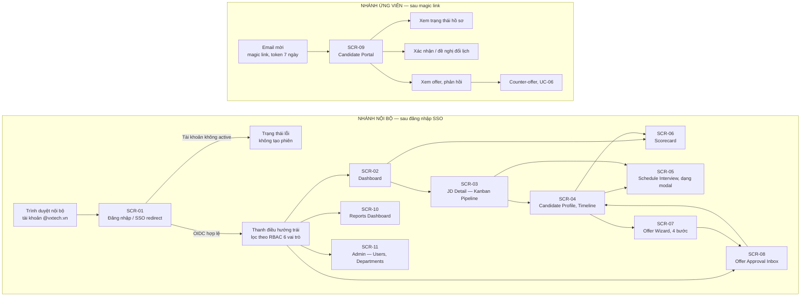
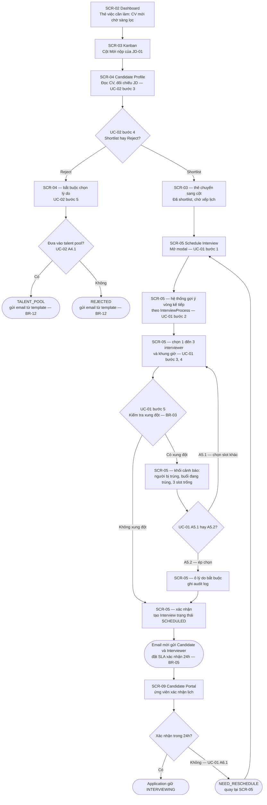
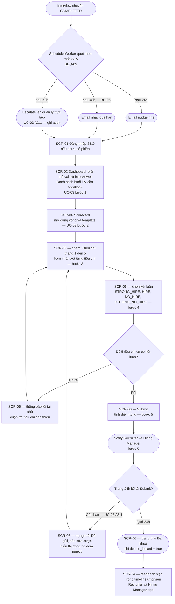
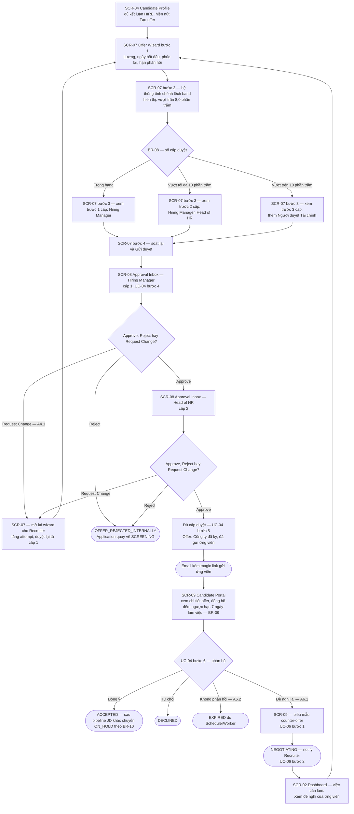

# Bản đồ màn hình & Hệ thống thiết kế giao diện — ATS mini

*Người phụ trách: D — System & UI Designer. Tài liệu này là phụ lục điều hướng của Chương 5
(`report/chapter_5_design.md`), đóng vai trò mục lục cho bộ wireframe và là bản bàn giao chính
thức của D cho A theo mục 5 của `04_person_D_design.md` ("Sơ đồ màn hình → A check UC đủ,
không thiếu").*

**Quy ước đánh số của tài liệu này:** vì đây là phụ lục của Chương 5, mọi hình và bảng ở đây dùng
dải số từ **5.20 trở lên** để không trùng số với chính văn Chương 5. Mọi mã `SCR-xx`, `ADR-xx`,
`NFR-xx`, `X-xx` trong tài liệu là mã đã chốt của D; mọi mã `UC-xx`, `BR-xx`, `F0x` là mã do A và
đặc tả gốc phát hành, được giữ nguyên không đánh số lại.

---

## 1. Mục đích và cách đọc bộ wireframe

### 1.1. Ba tài liệu, ba mức chi tiết

Thiết kế giao diện của hệ thống ATS mini được tách thành ba tài liệu có mức trừu tượng giảm dần,
thay vì gộp vào một file duy nhất. Lý do của việc tách: người đọc mỗi tài liệu khác nhau và mục
đích kiểm tra cũng khác nhau — A cần kiểm tra **độ phủ** (không use case nào thiếu màn hình),
B và C cần kiểm tra **tính khả thi dữ liệu** của từng màn, còn hội đồng bảo vệ chỉ có vài phút để
nhìn thấy hệ thống **chạy như thế nào**. Bảng 5.90 liệt kê ba tài liệu đó kèm câu hỏi mà mỗi tài
liệu chịu trách nhiệm trả lời.

**Bảng 5.90 — Ba tài liệu giao diện và cách dùng**

| Tài liệu | Mức chi tiết | Trả lời câu hỏi | Người đọc chính |
|---|---|---|---|
| `wireframes/README.md` *(tài liệu này)* | Bản đồ + hệ thống thiết kế | Có bao nhiêu màn, đi từ màn nào sang màn nào, dùng màu/chữ/thành phần gì | A (kiểm tra độ phủ UC), cả nhóm (làm slide) |
| `wireframes/D_wireframes_v1.md` | Wireframe từng màn, dạng ASCII, kèm các trạng thái | Màn `SCR-xx` có những vùng nào, hiển thị dữ liệu nào, trạng thái rỗng ra sao | B, C (rà dữ liệu), người vẽ prototype |
| `prototype/index.html` | Bản click-through chạy được | Người dùng thật bấm vào đâu thì ra gì | Hội đồng bảo vệ, buổi demo |

### 1.2. Thứ tự đọc được khuyến nghị

Bộ tài liệu được thiết kế để đọc theo thứ tự: mục 2 (bản đồ màn hình) để nắm khung điều hướng →
mục 3 (ba user flow chính) để hiểu ba hành trình nghiệp vụ dài nhất → mục 4 và 5 (hai bảng đối
chiếu hai chiều giữa use case và màn hình) để kiểm tra độ phủ → mục 6 đến 10 (quy ước thiết kế) khi
cần dựng màn mới hoặc sửa màn cũ mà vẫn giữ được tính nhất quán.

Người chỉ có 5 phút — ví dụ khi rà soát nhanh trước Sync S4 — nên đọc **Bảng 5.91** và **Bảng 5.92**
là đủ: hai bảng này chứa toàn bộ kết luận về độ phủ, phần còn lại là căn cứ.

### 1.3. Phạm vi và những gì tài liệu này không làm

Tài liệu mô tả **cấu trúc thông tin và quy ước trình bày**, không mô tả pixel. Không có thông số
kích thước tuyệt đối cho từng phần tử, không có bảng đặc tả animation, không có mã CSS sản xuất.
Prototype (`prototype/index.html`) hiện thực hoá đúng các token trong mục 6 nhưng ở mức tối giản,
đúng phạm vi ADR-12 — một file HTML/CSS/JS tĩnh, không backend, không thư viện ngoài, chạy được
khi không có mạng.

---

## 2. Bản đồ màn hình (site map)

### 2.1. Nguyên tắc tổ chức điều hướng

Hệ thống có **hai nhánh điều hướng tách rời hoàn toàn**, không có bất kỳ liên kết nào nối trực tiếp
giữa hai nhánh:

- **Nhánh nội bộ** — dành cho 6 vai trò nội bộ (Recruiter, Hiring Manager, Interviewer, HR Admin,
  Head of HR, Finance). Điểm vào duy nhất là `SCR-01` với luồng OIDC tới `IdentityProvider`
  (Google Workspace), theo ADR-10 và NFR-04. Sau khi có phiên, thanh điều hướng trái được **lọc
  theo quyền** — người dùng không nhìn thấy mục điều hướng mà mình không có quyền truy cập, nhưng
  việc ẩn mục chỉ là lớp trải nghiệm; quyết định từ chối thật sự nằm ở tầng API và tầng service
  (deny-by-default, ADR-10).
- **Nhánh ứng viên** — chỉ có `SCR-09`. Ứng viên **không phải** một hàng trong bảng `users`
  (ADR-09), không có SSO, không có thanh điều hướng trái. Điểm vào duy nhất là magic link gửi qua
  email, mang token có hạn 7 ngày; token dùng-một-lần cho hành động nhạy cảm như chấp nhận offer,
  và bị thu hồi khi `Application` chuyển sang trạng thái cuối.

Việc hai nhánh không có cạnh nối nào trong Hình 5.20 là **có chủ ý**, không phải thiếu sót của
sơ đồ: kênh duy nhất giữa hai nhánh là email do `NotificationService` phát qua outbox (ADR-06), và
email là kênh ngoài băng chứ không phải một liên kết điều hướng. Cách vẽ này cũng đồng thời trả lời
được câu hỏi thường gặp khi bảo vệ — ứng viên có thể lần theo URL để mò vào màn nội bộ hay không.

### 2.2. Hình 5.20 — Bản đồ màn hình toàn hệ thống

*Hình 5.20 — Bản đồ màn hình toàn hệ thống, hai nhánh điều hướng tách rời*

### 2.3. Diễn giải các cạnh đáng chú ý

Một vài cạnh trong Hình 5.20 không hiển nhiên và cần giải thích:

- `SCR-02 → SCR-06` tồn tại vì Interviewer vào thẳng scorecard từ danh sách việc cần làm trên
  dashboard, không đi qua kanban — Interviewer theo BR-20 chỉ được thấy packet của buổi phỏng vấn
  được giao, nên không có quyền mở `SCR-03`.
- `SCR-03 → SCR-05` là đường tắt: Recruiter xếp lịch trực tiếp từ thẻ kanban mà không cần mở hồ sơ
  đầy đủ, phục vụ thao tác hàng loạt trong ngày làm việc.
- `SCR-08 → SCR-04` là cạnh **ngược** quan trọng: người duyệt offer cần xem lại hồ sơ và feedback
  các vòng trước khi bấm duyệt. Nếu thiếu cạnh này, `SCR-08` trở thành màn "duyệt mù".
- Không có cạnh nào đi tới `SCR-11` ngoài thanh điều hướng, vì chỉ HR Admin thấy mục này.

---

## 3. Ba user flow chính

Ba hành trình dưới đây được chọn vì cùng lý do B đã chọn ba luồng để vẽ sequence diagram: nhiều
actor, nhiều nhánh rẽ, và có ràng buộc thời gian. Mỗi node được gắn mã `SCR-xx` để có thể đối chiếu
trực tiếp với wireframe tương ứng trong `D_wireframes_v1.md`.

### 3.1. Luồng A — Recruiter: từ dashboard đến khi lịch phỏng vấn được tạo

Luồng này nối liền **UC-02 (Sàng lọc CV)** và **UC-01 (Xếp lịch phỏng vấn)** vì trong thực tế vận
hành hai use case này được thực hiện liên tiếp trong cùng một phiên làm việc: Recruiter sàng lọc
xong là xếp lịch ngay, không thoát ra rồi vào lại. Nhánh xung đột lịch (BR-03, UC-01 A5.1 và A5.2)
được vẽ đầy đủ vì đây là điểm phức tạp nhất của luồng và là nội dung trọng tâm khi bảo vệ.

*Hình 5.21 — User flow A: Recruiter sàng lọc CV và xếp lịch phỏng vấn (UC-02 + UC-01)*

Hình 5.21 cho thấy hai điểm thiết kế cần lưu ý. Thứ nhất, `SCR-05` được thiết kế là **modal chồng
lên `SCR-03` hoặc `SCR-04`** chứ không phải trang riêng, để Recruiter không mất ngữ cảnh danh sách
ứng viên đang xử lý — đây là lý do vòng lặp `O → K` quay lại được ngay mà không phải tải lại trang.
Thứ hai, nhánh override (A5.2) bắt buộc phải nhập lý do trước khi nút xác nhận được bật; ràng buộc
này nằm ở giao diện chỉ để giảm thao tác sai, còn việc chặn thật vẫn ở tầng service.

**Vấn đề đánh số cần lưu ý:** rule "override xung đột lịch phải có lý do và ghi audit" hiện đang bị
trùng mã BR-13 với rule hold timeout của đặc tả v1.1. Mâu thuẫn này đã được ghi thành **X-04** trong
`docs/design_decisions_D.md` với đề xuất đổi mã rule override thành BR-26; trong tài liệu này rule
đó được gọi bằng nội dung chứ không bằng mã số, để không phát tán thêm một mã sai.

### 3.2. Luồng B — Interviewer: từ email nhắc đến khi feedback bị khoá

Luồng này hiện thực hoá **UC-03 (Ghi feedback phỏng vấn)** và là mặt giao diện của SEQ-03 do B vẽ.
Điểm đáng chú ý về mặt thiết kế: Interviewer là vai trò **ít vào hệ thống nhất** trong 6 vai trò
nội bộ — họ chỉ vào sau mỗi buổi phỏng vấn. Vì vậy luồng được tối ưu để đi từ email tới nút Submit
trong số bước ít nhất có thể, và không yêu cầu Interviewer tự tìm buổi phỏng vấn của mình.

*Hình 5.22 — User flow B: Interviewer ghi feedback theo scorecard (UC-03)*

Hình 5.22 làm rõ một quyết định giao diện quan trọng: trạng thái "đã gửi nhưng còn sửa được" và
trạng thái "đã khoá" phải **trông khác nhau rõ rệt**, vì cả hai đều là hậu Submit và người dùng rất
dễ tưởng rằng đã gửi là xong. Giải pháp là hiển thị đồng hồ đếm ngược 24 giờ ngay cạnh nút, dùng
màu nhóm cảnh báo khi còn dưới 2 giờ, và thay toàn bộ vùng nhập bằng bản chỉ đọc kèm chip "Đã khoá"
màu trung tính khi hết hạn.

**Điểm phải suy luận thêm ngoài hợp đồng thiết kế:** danh mục màn hình đã chốt đặt tên `SCR-02` là
"Dashboard Recruiter", trong khi UC-03 bước 1 mô tả Interviewer đăng nhập và thấy danh sách phỏng
vấn cần feedback. Tài liệu này **không tạo mã màn hình mới**, mà suy ra rằng `SCR-02` là màn
dashboard chung được render theo vai trò, với biến thể Interviewer là danh sách buổi phỏng vấn cần
feedback. Đề xuất kèm theo: đổi nhãn `SCR-02` từ "Dashboard Recruiter" thành "Dashboard theo vai
trò" và bổ sung biến thể Interviewer làm trạng thái thứ ba phải vẽ. Chi phí sửa bằng không về mặt
kiến trúc; xem mục 12.

### 3.3. Luồng C — Offer: từ wizard qua hai cấp duyệt tới phản hồi của ứng viên

Luồng này là hành trình dài nhất và có nhiều actor nhất, nối **UC-04 (Duyệt offer)** với
**UC-06 (Đàm phán lương)**. Kịch bản được vẽ theo đúng dữ liệu mẫu đã chốt: offer mức
51.840.000 VND cho vị trí `Senior Backend Engineer (Java)` có band 35.000.000–48.000.000 VND, tức
vượt trần band 8% nên theo BR-08 cần **2 cấp duyệt** — Hiring Manager rồi Head of HR, chưa cần
Finance.

*Hình 5.23 — User flow C: tạo offer, duyệt nhiều cấp và phản hồi của ứng viên (UC-04 + UC-06)*

Hình 5.23 thể hiện ba vòng lặp mà giao diện phải chịu được: Request Change quay về wizard (và theo
UC-04 A4.1 thì duyệt **lại từ cấp 1** chứ không tiếp tục từ cấp đang dở), counter-offer quay về
wizard qua dashboard của Recruiter, và reject nội bộ đưa `Application` quay lại `SCREENING`. Hệ quả
thiết kế: `SCR-07` không được giả định là chỉ mở một lần cho mỗi ứng viên — nó phải hiển thị được
lần duyệt thứ mấy và cho phép so sánh với bản offer trước, dựa trên `offer_approvals.attempt_no` mà
C đã bổ sung ở v1.1.

Ba nhãn trạng thái trong Hình 5.23 cố tình **không dùng tên enum**: người dùng thấy "Công ty đã ký,
đã gửi ứng viên" chứ không thấy `SIGNED_BY_COMPANY` hay `OFFER_APPROVED`. Đây chính là cách mâu
thuẫn X-03 được xử lý ở tầng nhãn giao diện, trình bày đầy đủ ở mục 6.6.

---

## 4. Bảng đối chiếu use case → màn hình

Đây là deliverable D nợ A theo mục 5 của `04_person_D_design.md` và là một trong bốn mục kiểm tra
khi review Chương 5 theo `06_conventions_shared.md` mục 5 ("Mỗi UC có ít nhất 1 wireframe phục vụ
không?").

**Bảng 5.91 — Đối chiếu use case và chức năng sang màn hình phục vụ**

| UC / F | Tên | Màn hình phục vụ | Bước nào của UC | Đã có wireframe? |
|---|---|---|---|---|
| **UC-01** | Xếp lịch phỏng vấn | `SCR-02` | Bước 1 — vào từ thẻ việc cần làm "Ứng viên chờ xếp lịch" | Có |
| | | `SCR-03` | Bước 1 — chọn ứng viên từ pipeline kanban của JD | Có |
| | | `SCR-04` | Bước 1 — vào xếp lịch từ hồ sơ ứng viên | Có |
| | | `SCR-05` | Bước 2 đến 7 — gợi ý vòng kế tiếp, chọn interviewer, chọn khung giờ, kiểm tra xung đột, A5.1 gợi ý 3 slot, A5.2 override kèm lý do | Có |
| | | `SCR-09` | Bước 7 và A6.1 — ứng viên xác nhận lịch trong SLA 24h theo BR-05 | Có |
| **UC-02** | Sàng lọc CV | `SCR-02` | Bước 1 — thẻ "CV mới chờ sàng lọc" dẫn vào danh sách | Có |
| | | `SCR-03` | Bước 1 và 7 — cột "Mới nộp"; sau shortlist thẻ chuyển cột | Có |
| | | `SCR-04` | Bước 3 đến 6 — đọc CV, chọn Shortlist hoặc Reject, bắt buộc chọn lý do khi Reject, A4.1 đánh dấu talent pool | Có |
| **UC-03** | Ghi feedback phỏng vấn | `SCR-02` *(biến thể vai trò Interviewer)* | Bước 1 — danh sách buổi phỏng vấn cần feedback sau khi đăng nhập | **Chưa** — đề xuất bổ sung, xem mục 12 |
| | | `SCR-06` | Bước 2 đến 5 và A5.1 — mở scorecard, chấm 5 tiêu chí, ghi kết luận, submit, sửa trong 24h rồi khoá | Có |
| | | `SCR-04` | Bước 6 — Recruiter và Hiring Manager đọc feedback trong timeline | Có |
| **UC-04** | Duyệt offer nhiều cấp | `SCR-04` | Bước 1 — điểm khởi phát: nút "Tạo offer" chỉ hiện khi đủ kết luận HIRE | Có |
| | | `SCR-07` | Bước 1 đến 3 và A4.1 — nhập điều khoản, xem số cấp duyệt theo BR-08, gửi duyệt, mở lại khi Request Change | Có |
| | | `SCR-08` | Bước 3 đến 5 — từng cấp xem chi tiết và chọn Approve, Reject hoặc Request Change | Có |
| | | `SCR-09` | Bước 6 và A6.2 — ứng viên xem offer, phản hồi trước hạn BR-09, hoặc để hết hạn | Có |
| **UC-05** | Xem báo cáo tuyển dụng | `SCR-10` | Bước 1 đến 3 — chọn khoảng thời gian và bộ lọc, xem 4 biểu đồ, export CSV hoặc PDF | Có |
| **UC-06** | Đàm phán lương | `SCR-09` | Bước 1 — biểu mẫu counter-offer nhập mức và điều kiện mong muốn | Có |
| | | `SCR-02` | Bước 2 — Recruiter nhận thông báo, việc cần làm "Xem đề nghị của ứng viên" | Có |
| | | `SCR-07` | Bước 3 — tạo offer draft mới, vòng duyệt UC-04 chạy lại từ cấp 1 | Có |
| **F09** | Quản lý user, phân quyền theo phòng ban | `SCR-11` | Không có kịch bản UC — chức năng ngoài 5 use case trọng tâm theo X-07 | Có |
| **F10** | Thông báo và nhắc SLA tự động | Thanh trên dùng chung *(chuông thông báo có badge)* — hiện trên `SCR-02` đến `SCR-08`, `SCR-10`, `SCR-11` | Không có kịch bản UC — hiện thực hoá BR-05, BR-06, BR-09, BR-13; hành vi nền theo SEQ-03 | Có — vẽ trong `SCR-02` |
| | | `SCR-09` | Kênh ngoài băng: ứng viên nhận email vì không có hàng `notifications` theo ADR-09 | Có |

### 4.1. Kết luận về độ phủ

Toàn bộ **6 use case** (UC-01 đến UC-06) và **2 chức năng** F09, F10 đều có ít nhất một màn hình
phục vụ, phần lớn có từ 3 màn trở lên. Tiêu chí "mỗi UC có ít nhất 1 wireframe minh hoạ" trong danh
sách việc phải làm ở Sync S4 được thoả.

Một điểm cần A xác nhận: **UC-05 chỉ có đúng một màn hình phục vụ** (`SCR-10`). Đây không phải
thiếu sót mà là hệ quả của bản chất use case — cả ba bước của UC-05 đều diễn ra trên cùng một
dashboard với bộ lọc thay đổi, không có bước nào đòi hỏi rời màn. Tuy vậy `SCR-10` bắt buộc phải vẽ
**hai trạng thái** (trống khi chưa đủ dữ liệu 30 ngày theo precondition của UC-05, và đầy đủ 4 biểu
đồ), vì trạng thái trống là thứ hội đồng hay hỏi và là thứ hệ thống thật sẽ hiển thị trong ngày đầu
vận hành.

Điểm thứ hai: **F10 không có màn hình riêng** và đó là quyết định có chủ ý. Thông báo là một thành
phần dùng chung nằm trên thanh trên của mọi màn nội bộ, cộng với email cho ứng viên. Tạo một màn
"Trung tâm thông báo" riêng sẽ thêm một mã `SCR` mà không phục vụ bước nào của use case nào — đúng
loại màn hình thừa mà bảng ngược ở mục 5 được thiết kế để phát hiện.

---

## 5. Bảng ngược: màn hình → use case

Bảng 5.91 chứng minh **không UC nào thiếu màn hình**. Bảng ngược dưới đây trả lời câu hỏi đối
xứng và quan trọng không kém: **có màn hình nào không phục vụ use case nào không?** Một màn hình
không xuất hiện ở cột giữa của bảng này là màn hình thừa, cần bị loại bỏ trước khi tốn công vẽ
wireframe và dựng prototype.

**Bảng 5.92 — Đối chiếu ngược: màn hình sang use case được phục vụ**

| Mã | Màn hình | UC / F được phục vụ | Vai trò truy cập | Kết luận |
|---|---|---|---|---|
| `SCR-01` | Đăng nhập / SSO redirect | Tiền đề của mọi UC nội bộ; hiện thực hoá NFR-04 | 6 vai trò nội bộ | Giữ — không có màn này thì không UC nội bộ nào bắt đầu được |
| `SCR-02` | Dashboard | UC-01, UC-02, UC-03 *(biến thể Interviewer)*, UC-06, F10 | Recruiter là chính; các vai trò khác thấy biến thể theo quyền | Giữ — màn có nhiều UC nhất, là điểm vào mặc định sau đăng nhập |
| `SCR-03` | JD Detail — Kanban Pipeline | UC-02, UC-01 | Recruiter, Hiring Manager *(chỉ đọc theo ma trận RBAC)* | Giữ |
| `SCR-04` | Candidate Profile, Timeline | UC-02, UC-03 *(xem kết quả)*, UC-04 | Recruiter, Hiring Manager; chặn theo department scope theo BR-20 | Giữ — là trục nối ba use case |
| `SCR-05` | Schedule Interview, dạng modal | UC-01 | Recruiter | Giữ |
| `SCR-06` | Scorecard | UC-03 | Interviewer nhập; Recruiter, Hiring Manager, Head of HR chỉ đọc | Giữ |
| `SCR-07` | Offer Wizard, 4 bước | UC-04, UC-06 | Recruiter | Giữ |
| `SCR-08` | Offer Approval Inbox | UC-04 | Hiring Manager, Head of HR, Người duyệt Tài chính | Giữ |
| `SCR-09` | Candidate Portal | UC-01, UC-04, UC-06 | Ứng viên | Giữ — màn duy nhất của nhánh ứng viên, phục vụ 3 UC |
| `SCR-10` | Reports Dashboard | UC-05 | HR Admin, Head of HR; Recruiter và Hiring Manager thấy bản thu hẹp theo scope | Giữ |
| `SCR-11` | Admin — Users, Departments | F09 | HR Admin | Giữ — không thuộc 5 UC trọng tâm, được ghi rõ là chức năng ngoài phạm vi theo X-07 |

### 5.1. Kết luận về màn hình thừa

**Không có màn hình thừa.** Cả 11 màn hình đều phục vụ ít nhất một use case hoặc một chức năng
trong danh sách F01 đến F10, hoặc là tiền đề kỹ thuật bắt buộc như `SCR-01`.

Hai màn hình cần được biện minh rõ khi bảo vệ vì không nằm trong 5 use case có kịch bản đầy đủ:

- `SCR-01` không phục vụ bước nào của UC nào, nhưng là điều kiện tiên quyết của toàn bộ nhánh nội
  bộ và là nơi duy nhất thể hiện được cơ chế OIDC của NFR-04. Bỏ màn này thì Chương 5 mất chỗ trình
  bày trực quan về xác thực.
- `SCR-11` phục vụ F09, là chức năng nằm ngoài 5 use case trọng tâm mà A đã chốt. Màn này được giữ
  vì nếu không có nơi tạo user và gán phòng ban thì ma trận RBAC 6 vai trò trở thành cấu hình
  "từ trên trời rơi xuống", không kiểm chứng được.

Trong quá trình lập bảng ngược, một màn hình đã bị **loại bỏ trước khi vẽ**: "Trung tâm thông báo"
cho F10. Lý do loại: mọi bước của F10 đã được phục vụ bởi chuông thông báo trên thanh trên và bởi
email, nên một trang riêng chỉ nhân đôi thông tin.

---

## 6. Hệ thống thiết kế (design system)

Hệ thống thiết kế được định nghĩa dưới dạng **token** — biến có tên, có giá trị, được tham chiếu
thay vì lặp lại giá trị thô. Cách làm này phục vụ hai mục tiêu cụ thể của đồ án: bảo đảm 11 màn
hình nhất quán khi được vẽ ở các thời điểm khác nhau, và cho phép kiểm chứng NFR-14 bằng cách kiểm
tra một bảng token thay vì đi soi từng màn.

### 6.1. Bảng màu và tỷ lệ tương phản

Mọi tỷ lệ trong Bảng 5.93 được tính theo công thức tương phản của WCAG 2.1 và kiểm tra lại bằng
tính toán, không ước lượng bằng mắt. Ngưỡng cần đạt: **4.5:1** cho chữ thường (mức AA, tiêu chí
1.4.3) và **3:1** cho đường viền của thành phần điều khiển (tiêu chí 1.4.11).

**Bảng 5.93 — Token màu, giá trị hex và tỷ lệ tương phản**

| Token | Hex | Dùng cho | Nền tham chiếu | Tương phản | Đạt AA |
|---|---|---|---|---|---|
| `--bg` | `#FFFFFF` | Nền trang | — | — | — |
| `--surface` | `#F8FAFC` | Nền thẻ, nền cột kanban, nền thanh bên | `#FFFFFF` | 1.05:1 | Trang trí, không mang thông tin |
| `--text` | `#0F172A` | Chữ chính, tiêu đề | `#FFFFFF` | **17.85:1** | Đạt |
| `--text-muted` | `#475569` | Chữ phụ, nhãn cột, chú thích | `#FFFFFF` | **7.58:1** | Đạt |
| `--text-muted` trên nền thẻ | `#475569` | Chữ phụ đặt trên `--surface` | `#F8FAFC` | **7.24:1** | Đạt |
| `--border` | `#CBD5E1` | Đường kẻ phân tách trang trí | `#FFFFFF` | 1.48:1 | Không mang thông tin, được miễn |
| `--border-control` | `#64748B` | Viền ô nhập, viền nút Secondary | `#FFFFFF` | **4.76:1** | Đạt, vượt ngưỡng 3:1 |
| `--focus` | `#2563EB` | Vòng focus bàn phím, dày 2px, cách 2px | `#FFFFFF` | **5.17:1** | Đạt |
| `--primary` | `#1D4ED8` | Nút chính, liên kết, tiêu điểm thương hiệu | `#FFFFFF` | **6.70:1** | Đạt |
| `--primary-hover` | `#1E40AF` | Nút chính khi trỏ chuột, khi nhấn | `#FFFFFF` | **8.72:1** | Đạt |
| `--on-primary` | `#FFFFFF` | Chữ trên nền nút chính | `#1D4ED8` | **6.70:1** | Đạt |
| `--processing` | `#1D4ED8` | Nhóm trạng thái đang xử lý | `#FFFFFF` | **6.70:1** | Đạt |
| `--success` | `#15803D` | Nhóm trạng thái thành công | `#FFFFFF` | **5.02:1** | Đạt |
| `--danger` | `#B91C1C` | Nhóm trạng thái từ chối, thông báo lỗi | `#FFFFFF` | **6.47:1** | Đạt |
| `--warning` | `#B45309` | Nhóm trạng thái cảnh báo, sắp quá hạn | `#FFFFFF` | **5.02:1** | Đạt |
| `--neutral` | `#475569` | Nhóm trạng thái trung tính | `#FFFFFF` | **7.58:1** | Đạt |
| `--chip-processing` | Chữ `#1E3A8A` / nền `#DBEAFE` | Chip trạng thái nhóm đang xử lý | Nền chip | **8.49:1** | Đạt |
| `--chip-success` | Chữ `#14532D` / nền `#DCFCE7` | Chip trạng thái nhóm thành công | Nền chip | **8.30:1** | Đạt |
| `--chip-danger` | Chữ `#7F1D1D` / nền `#FEE2E2` | Chip trạng thái nhóm từ chối | Nền chip | **8.20:1** | Đạt |
| `--chip-warning` | Chữ `#78350F` / nền `#FEF3C7` | Chip trạng thái nhóm cảnh báo | Nền chip | **8.15:1** | Đạt |
| `--chip-neutral` | Chữ `#334155` / nền `#F1F5F9` | Chip trạng thái nhóm trung tính | Nền chip | **9.45:1** | Đạt |
| `--disabled` | Chữ `#94A3B8` / nền `#F1F5F9` | Nút và ô nhập bị vô hiệu hoá | Nền vô hiệu | 2.34:1 | Được miễn theo ngoại lệ của tiêu chí 1.4.3 cho thành phần vô hiệu hoá |

Ba lựa chọn cần giải thích. Thứ nhất, chữ trên chip dùng biến thể **rất tối** của cùng tông màu chứ
không dùng chữ trắng trên nền đậm; cách này cho tương phản trên 8:1 ở mọi chip, trong khi chip nền
đậm chữ trắng chỉ đạt khoảng 5:1 và làm kanban trở nên nặng nề khi có hàng chục thẻ trên màn.
Thứ hai, `--border` cố tình để tương phản thấp vì nó chỉ phân tách trang trí; mọi đường viền **mang
thông tin** — viền ô nhập, viền nút Secondary — dùng `--border-control` đạt 4.76:1. Thứ ba, màu
vô hiệu hoá không đạt 4.5:1 và điều này được chấp nhận có ý thức: WCAG miễn trừ thành phần vô hiệu
hoá, nhưng để bù lại, trạng thái vô hiệu **luôn kèm lý do bằng chữ** đặt cạnh nút chứ không để
người dùng tự đoán.

### 6.2. Thang khoảng cách

Toàn bộ khoảng cách bám lưới cơ sở **4px**. Chỉ sáu bậc được phép dùng; mọi giá trị nằm ngoài thang
là lỗi thiết kế cần sửa chứ không phải ngoại lệ.

**Bảng 5.94 — Thang khoảng cách**

| Token | Giá trị | Dùng cho |
|---|---|---|
| `--space-1` | 4px | Khoảng cách giữa biểu tượng và chữ trong chip, giữa nhãn và ô nhập |
| `--space-2` | 8px | Đệm trong của chip và nút nhỏ; khoảng cách giữa hai nút liền kề |
| `--space-3` | 12px | Đệm trong của thẻ ứng viên trên kanban; khoảng cách giữa các dòng trong biểu mẫu |
| `--space-4` | 16px | Đệm trong của thẻ lớn và panel; khoảng cách giữa các nhóm trường liên quan |
| `--space-5` | 24px | Khoảng cách giữa các khối nội dung; đệm trong của modal |
| `--space-6` | 32px | Đệm ngoài của vùng nội dung chính; khoảng cách giữa các phần lớn của trang |

Sáu bậc trong Bảng 5.94 đủ phủ mọi nhu cầu của 11 màn hình; giới hạn số bậc là cách rẻ nhất để 11
màn được vẽ ở các thời điểm khác nhau vẫn trông cùng một hệ thống. Bố cục chung đã chốt dùng thanh
bên trái rộng 220px. Con số này **không thuộc thang khoảng cách**
vì nó là kích thước bố cục chứ không phải khoảng trống, và được giữ nguyên như hợp đồng thiết kế
quy định.

### 6.3. Thang chữ

**Bảng 5.95 — Thang chữ, cỡ chữ và cân nặng**

| Token | Cỡ / chiều cao dòng | Cân nặng | Dùng cho |
|---|---|---|---|
| `--font-h1` | 28px / 36px | 600 | Tiêu đề trang, ví dụ tên JD trên `SCR-03` |
| `--font-h2` | 22px / 30px | 600 | Tiêu đề vùng, tiêu đề modal `SCR-05` và `SCR-07` |
| `--font-h3` | 18px / 26px | 600 | Tiêu đề nhóm, tên cột kanban, tiêu đề biểu đồ trên `SCR-10` |
| `--font-body` | 14px / 22px | 400 | Chữ chính, nội dung ô nhập, ô bảng dữ liệu |
| `--font-body-strong` | 14px / 22px | 500 | Tên ứng viên trên thẻ kanban, nhãn trường bắt buộc |
| `--font-small` | 12px / 18px | 400 | Chú thích, dấu thời gian, chữ trong chip |
| `--font-numeric` | 14px / 22px | 500 | Cột tiền và cột ngày giờ; bật chữ số đều chiều rộng để các con số thẳng cột |

Điểm gây tranh cãi nhất trong Bảng 5.95 là cỡ chữ chính. Cỡ chữ chính được đặt ở 14px chứ không
phải 16px vì đây là ứng dụng nghiệp vụ mật độ cao — `SCR-03` phải
hiển thị nhiều thẻ trên một màn, `SCR-10` phải hiển thị bốn biểu đồ. Đánh đổi này được bù bằng ba
điều kiện bắt buộc: chiều cao dòng rộng rãi 22px, tương phản chữ chính đạt 17.85:1 (cao hơn nhiều
so với ngưỡng 4.5:1), và giao diện phải chịu được thao tác phóng to 200% của trình duyệt mà không
mất nội dung — đây là một mục trong checklist ở mục 10.

Về bộ chữ: ưu tiên bộ chữ hệ thống theo thứ tự `system-ui`, `Segoe UI`, `Roboto`, `Helvetica Neue`,
`Arial`. Không nhúng bộ chữ tải từ mạng, vì ADR-12 quy định prototype phải chạy được khi không có
mạng trong phòng bảo vệ. Điều kiện bắt buộc khi chọn bộ chữ: hiển thị đầy đủ dấu tiếng Việt, gồm cả
các tổ hợp hai dấu như "ộ", "ữ", "ể" — đây là lý do loại các bộ chữ trang trí chỉ phủ Latin cơ bản.

### 6.4. Bán kính bo góc và đổ bóng

**Bảng 5.96 — Token bán kính bo góc và đổ bóng**

| Token | Giá trị | Dùng cho | Lý do |
|---|---|---|---|
| `--radius-sm` | 4px | Ô nhập, chip trạng thái, ô đánh dấu | Bo nhẹ, giữ cảm giác chính xác cho phần tử nhập liệu |
| `--radius-md` | 8px | Nút, thẻ ứng viên, khối cảnh báo | Bo vừa, phân biệt phần tử bấm được với phần tử nhập |
| `--radius-lg` | 12px | Modal, panel lớn, thẻ biểu đồ | Bo rõ để khối nổi tách khỏi nền trang |
| `--radius-full` | 999px | Ảnh đại diện, badge số trên chuông thông báo | Hình tròn hoàn toàn |
| `--shadow-0` | không đổ bóng | Bảng dữ liệu, vùng nội dung phẳng | Tránh nhiễu thị giác ở màn nhiều dữ liệu |
| `--shadow-1` | `0 1px 2px rgba(15,23,42,0.06)` | Thẻ ứng viên ở trạng thái mặc định | Gợi ý thẻ tách khỏi nền cột |
| `--shadow-2` | `0 4px 8px rgba(15,23,42,0.10)` | Thẻ đang được kéo, danh sách xổ xuống, toast | Thể hiện phần tử đang ở lớp cao hơn |
| `--shadow-3` | `0 12px 24px rgba(15,23,42,0.16)` | Modal `SCR-05` và `SCR-07` | Tách hẳn khỏi nền mờ phía sau |

Bốn token đổ bóng trong Bảng 5.96 được dùng để thể hiện **thứ bậc lớp**, không dùng để trang trí. Cụ thể trên `SCR-03`, sự
khác nhau giữa `--shadow-1` và `--shadow-2` chính là tín hiệu thị giác duy nhất cho biết thẻ đang
được kéo — nhưng vì đổ bóng không phải tín hiệu tiếp cận được, thao tác kéo-thả bắt buộc phải có
đường thay thế bằng bàn phím, xem mục 10.

### 6.5. Quy ước màu ngữ nghĩa cho trạng thái Application

Mười bảy giá trị của `application_status` là quá nhiều để mỗi giá trị một màu — người dùng không
thể nhớ mười bảy màu, và bảng màu sẽ vượt xa số màu phân biệt được an toàn cho người rối loạn nhận
biết màu. Giải pháp: gộp thành **năm nhóm ngữ nghĩa**, mỗi nhóm một màu, còn giá trị cụ thể được
phân biệt bằng **nhãn chữ** đi kèm chip.

**Bảng 5.97 — Năm nhóm màu ngữ nghĩa cho trạng thái**

| Nhóm | Token màu | Ý nghĩa nghiệp vụ | Hàm ý hành động |
|---|---|---|---|
| Đang xử lý | `--processing` | Hồ sơ đang chạy trong pipeline, mọi việc bình thường | Không cần can thiệp gấp |
| Thành công | `--success` | Kết quả tích cực đã đạt được | Chuyển sang bước tiếp theo |
| Từ chối | `--danger` | Kết thúc theo hướng tiêu cực, không còn trong funnel hoạt động | Không còn hành động, chỉ đọc để báo cáo |
| Cảnh báo | `--warning` | Đang mắc, cần người can thiệp trong thời hạn | Có việc phải làm, thường gắn với một SLA |
| Trung tính | `--neutral` | Chưa bắt đầu, hoặc đã lưu trữ để dùng sau | Chờ hoặc không cần xử lý |

### 6.6. Ánh xạ 17 giá trị `application_status` sang nhãn tiếng Việt và màu

Đây là bảng quan trọng nhất của mục 6, vì nó **giải quyết mâu thuẫn X-03 ở tầng nhãn giao diện**.
Nguyên tắc: hai enum `application_status` và `offer_status` được **giữ nguyên như C đã thiết kế**,
không đổi tên, không gộp — nhưng người dùng cuối **không bao giờ nhìn thấy tên enum**. Mọi giá trị
enum đều đi qua bảng ánh xạ này trước khi hiển thị. Chi phí sửa của phương án bằng không: không đổi
schema, không đổi state machine của B, chỉ thêm một bảng khoá đa ngôn ngữ ở tầng giao diện.

**Bảng 5.98 — Ánh xạ `application_status` sang nhãn tiếng Việt, nhãn tiếng Anh và nhóm màu**

| # | Giá trị enum | Nhãn tiếng Việt | Nhãn tiếng Anh | Nhóm màu |
|---|---|---|---|---|
| 1 | `NEW` | Mới nộp | New | Trung tính |
| 2 | `SCREENING` | Đang sàng lọc | Screening | Đang xử lý |
| 3 | `INTERVIEWING` | Đang phỏng vấn | Interviewing | Đang xử lý |
| 4 | `NEED_RESCHEDULE` | Cần xếp lại lịch | Needs reschedule | Cảnh báo |
| 5 | `OFFER_PENDING` | Chờ duyệt offer | Offer pending approval | Đang xử lý |
| 6 | `OFFER_APPROVED` | Offer đã duyệt nội bộ | Offer approved internally | Đang xử lý |
| 7 | `OFFER_SENT` | Đã gửi offer cho ứng viên | Offer sent | Đang xử lý |
| 8 | `ACCEPTED` | Ứng viên đã đồng ý | Accepted | Thành công |
| 9 | `HIRED` | Đã nhận việc | Hired | Thành công |
| 10 | `NEGOTIATING` | Đang đàm phán lương | Negotiating | Cảnh báo |
| 11 | `ON_HOLD` | Tạm giữ chờ kết quả JD khác | On hold | Cảnh báo |
| 12 | `GHOSTED` | Không đến nhận việc | Ghosted | Cảnh báo |
| 13 | `REJECTED` | Đã từ chối hồ sơ | Rejected | Từ chối |
| 14 | `DECLINED` | Ứng viên từ chối offer | Declined by candidate | Từ chối |
| 15 | `EXPIRED` | Offer hết hạn phản hồi | Offer expired | Từ chối |
| 16 | `OFFER_REJECTED_INTERNALLY` | Offer bị từ chối ở cấp duyệt | Offer rejected internally | Từ chối |
| 17 | `TALENT_POOL` | Đã đưa vào nguồn dự trữ | Talent pool | Trung tính |
| *(đề xuất)* | `SHORTLISTED` | Đã shortlist, chờ xếp lịch | Shortlisted | Đang xử lý |

Bốn quyết định ánh xạ cần biện minh vì chúng không hiển nhiên:

- `GHOSTED` được xếp nhóm **cảnh báo** chứ không phải từ chối, dù đây là trạng thái cuối tiêu cực.
  Lý do: theo BR-11, ứng viên `GHOSTED` kéo theo việc JD được mở lại, tức là có việc phải làm ngay
  cho Recruiter. Xếp vào nhóm từ chối màu đỏ sẽ khiến nó trông giống `REJECTED` — một trạng thái
  không đòi hỏi hành động nào — và Recruiter sẽ bỏ sót việc mở lại JD.
- `NEGOTIATING` và `ON_HOLD` cùng vào nhóm **cảnh báo** vì cả hai đều là trạng thái "mắc kẹt có
  thời hạn": `NEGOTIATING` chờ Recruiter tạo offer mới, `ON_HOLD` có đồng hồ 14 ngày làm việc theo
  BR-13 rồi tự chuyển `REJECTED`. Màu cảnh báo đúng với hàm ý "có việc phải làm trước khi hết hạn".
- `TALENT_POOL` vào nhóm **trung tính** chứ không phải từ chối, dù nó đi ra từ hành động Reject.
  Đây là kết thúc "mềm" — hồ sơ vẫn có giá trị cho JD sau, nên tô đỏ sẽ truyền sai thông điệp cho
  Recruiter đang tìm nguồn ứng viên.
- Dòng cuối cùng, `SHORTLISTED`, **chưa có trong 17 giá trị hiện tại của schema**. Đây là đề xuất
  P0 đã ghi thành mâu thuẫn X-02: A dùng `SHORTLISTED` làm postcondition của UC-02 và precondition
  của UC-01, nhưng enum của C chưa có giá trị này. Trước khi được chốt ở Sync S4, cột "Đã shortlist,
  chờ xếp lịch" vẫn được vẽ riêng trên `SCR-03` và đã có trong prototype; nếu Sync S4 bác X-02 thì
  cột này được gộp vào `SCREENING`, kanban rút còn sáu cột và phần còn lại của màn hình không đổi.

### 6.7. Ánh xạ `offer_status` — điểm giải quyết trực tiếp mâu thuẫn X-03

Mâu thuẫn X-03 nằm ở chỗ bản phác của A đề nghị "chuẩn hoá dùng `OFFER_APPROVED` thay
`SIGNED_BY_COMPANY`", trong khi C đã có sẵn `offer_status.SIGNED_BY_COMPANY` và B đã có bảng đối
chiếu 3.1b giữa hai enum. Đổi enum sẽ kéo theo sửa schema, sửa state machine và sửa bảng 3.1b —
chi phí lan sang cả B và C chỉ để làm đẹp một cái tên mà người dùng không bao giờ nhìn thấy.

Phương án của D: **giữ nguyên hai enum**, xử lý ở tầng nhãn. Bảng 5.99 là bản hợp đồng nhãn cho
`offer_status`; khi đọc cùng Bảng 5.98, người vẽ giao diện có đủ căn cứ để không bao giờ phải viết
tên enum lên màn hình.

**Bảng 5.99 — Ánh xạ `offer_status` sang nhãn hiển thị**

| Giá trị enum | Nhãn tiếng Việt | Nhóm màu | Xuất hiện ở màn |
|---|---|---|---|
| `DRAFT` | Bản nháp, chưa gửi duyệt | Trung tính | `SCR-07` |
| `PENDING_APPROVAL` | Đang chờ duyệt, cấp {n} trên {tổng} | Đang xử lý | `SCR-07`, `SCR-08` |
| `APPROVED` | Đã duyệt đủ cấp, chờ gửi ứng viên | Đang xử lý | `SCR-07`, `SCR-08` |
| `SIGNED_BY_COMPANY` | Công ty đã ký, đã gửi ứng viên | Đang xử lý | `SCR-07`, `SCR-09` |
| `ACCEPTED` | Ứng viên đã đồng ý | Thành công | `SCR-04`, `SCR-09` |
| `DECLINED` | Ứng viên từ chối | Từ chối | `SCR-04`, `SCR-09` |
| `NEGOTIATING` | Ứng viên đề nghị lại | Cảnh báo | `SCR-04`, `SCR-07`, `SCR-09` |
| `EXPIRED` | Hết hạn phản hồi | Từ chối | `SCR-04`, `SCR-09` |
| `REJECTED_INTERNALLY` | Bị từ chối ở cấp duyệt | Từ chối | `SCR-07`, `SCR-08` |

Hệ quả kiểm chứng được: nếu trong quá trình rà soát wireframe hoặc prototype phát hiện bất kỳ chuỗi
in hoa gạch dưới nào xuất hiện trên màn hình, đó là lỗi giao diện — không phải lỗi dữ liệu. Đây là
một mục trong checklist ở mục 10.

---

## 7. Thư viện thành phần

Mười thành phần dưới đây phủ toàn bộ 11 màn hình. Nguyên tắc: một nhu cầu giao diện chỉ được giải
bằng **một** thành phần; nếu hai màn cần cùng một thứ mà trông khác nhau thì đó là lỗi nhất quán
cần sửa, chứ không phải một thành phần mới.

**Bảng 5.100 — Thư viện thành phần dùng lại**

| Thành phần | Dùng ở màn nào | Các trạng thái phải vẽ |
|---|---|---|
| **Nút** — 4 biến thể: Primary *(hành động chính, mỗi màn tối đa một)*, Secondary *(hành động phụ, có viền)*, Ghost *(hành động ít dùng, chỉ chữ)*, Destructive *(hành động không hoàn tác được)* | Toàn bộ `SCR-01` đến `SCR-11` | Mặc định; trỏ chuột *(nền đậm hơn một bậc)*; đang nhấn; có focus bàn phím *(vòng `--focus` dày 2px)*; vô hiệu hoá *(kèm lý do bằng chữ)*; đang xử lý *(có chỉ báo quay, chặn bấm lần hai)* |
| **Thẻ ứng viên** *(thẻ kanban)* | `SCR-03`; bản rút gọn trong kết quả tìm kiếm ở thanh trên | Mặc định; trỏ chuột *(nâng bóng lên `--shadow-2`)*; đang được kéo; là vị trí thả hợp lệ; là vị trí thả không hợp lệ; được chọn bằng bàn phím; đang tải |
| **Chip trạng thái** | `SCR-02`, `SCR-03`, `SCR-04`, `SCR-06`, `SCR-07`, `SCR-08`, `SCR-09` | Năm nhóm màu theo Bảng 5.97; biến thể có biểu tượng; biến thể chỉ chữ; không có trạng thái vô hiệu hoá vì chip là phần tử chỉ đọc |
| **Bảng dữ liệu có phân trang** | `SCR-08`, `SCR-10`, `SCR-11` | Mặc định; đang tải *(khung xương)*; rỗng *(dùng thành phần Trạng thái rỗng)*; lỗi tải; hàng được chọn; cột đang sắp xếp; trang cuối *(nút sang trang bị vô hiệu hoá)* |
| **Modal** | `SCR-05` *(xếp lịch)*, `SCR-07` *(xác nhận gửi duyệt)*, `SCR-08` *(xác nhận từ chối)*, `SCR-11` *(xác nhận vô hiệu hoá user)* | Mặc định; đang gửi dữ liệu; có lỗi cấp biểu mẫu; nội dung dài phải cuộn trong thân modal; xác nhận hành động phá huỷ *(nút Destructive nằm bên phải, nút Huỷ bên trái)* |
| **Thanh bước** *(stepper)* | `SCR-07` *(4 bước tạo offer)*; hàng ngang trạng thái duyệt trên `SCR-08` | Bước đã xong; bước hiện tại; bước chưa tới *(vô hiệu hoá, không bấm nhảy cóc được)*; bước có lỗi; bước bị bỏ qua *(khi số cấp duyệt là 1 thì cấp 2 và 3 hiển thị mờ kèm chú thích)* |
| **Ô chọn khung giờ** | `SCR-05`; bản chỉ đọc trên `SCR-09` khi ứng viên xác nhận lịch | Slot trống; slot đã chọn; slot bị xung đột *(gạch chéo, kèm tên người bị trùng)*; slot ngoài giờ làm việc; ba slot được hệ thống gợi ý *(có viền nhấn)*; đang tải lịch bận |
| **Khối cảnh báo** | `SCR-05` *(cảnh báo xung đột)*, `SCR-06` *(sắp hết hạn 48h)*, `SCR-07` *(vượt band)*, `SCR-09` *(offer sắp hết hạn)*, `SCR-10` *(độ trễ dữ liệu báo cáo)* | Bốn mức: thông tin, cảnh báo, lỗi, thành công; biến thể có nút hành động; biến thể đóng được; biến thể không đóng được *(dùng cho ràng buộc nghiệp vụ)* |
| **Trạng thái rỗng** | `SCR-02` *(chưa có JD)*, `SCR-03` *(cột kanban rỗng)*, `SCR-08` *(không có offer chờ duyệt)*, `SCR-10` *(chưa đủ dữ liệu 30 ngày)*, `SCR-11` | Rỗng lần đầu *(kèm nút tạo mới)*; rỗng do bộ lọc *(kèm nút xoá bộ lọc)*; rỗng do không có quyền *(kèm giải thích theo BR-20, không kèm nút)*; rỗng do lỗi tải *(kèm nút thử lại)* |
| **Toast** | Toàn hệ thống, neo góc dưới bên phải | Thành công *(tự ẩn sau 4 giây)*; lỗi *(không tự ẩn, phải bấm đóng)*; đang xử lý; có nút hoàn tác *(dùng cho thao tác kéo-thả trên `SCR-03`)*; xếp chồng tối đa 3 toast |

Hai ghi chú về phạm vi của Bảng 5.100. Thứ nhất, **thanh điều hướng trái và thanh trên không nằm
trong bảng này**
vì chúng là bố cục khung chứ không phải thành phần dùng lại — chúng được đặc tả một lần trong phần
bố cục chung của `D_wireframes_v1.md`. Thứ hai, thành phần "Toast có nút hoàn tác" tồn tại vì thao
tác kéo-thả trên `SCR-03` làm thay đổi trạng thái `Application` và ghi một dòng
`application_status_history`; hoàn tác ở đây là **một chuyển trạng thái ngược có ghi audit đầy đủ**,
không phải xoá dòng lịch sử. Đây là điểm cần nói rõ khi bảo vệ, vì NFR-06 yêu cầu 100% chuyển trạng
thái có dòng audit.

---

## 8. Quy ước nội dung và ngôn ngữ

### 8.1. Giọng văn của nhãn giao diện

Giao diện nói với người dùng bằng giọng **trung tính, ngắn, hướng hành động**. Ba quy tắc bắt buộc:
không dùng dấu chấm than; không nhân cách hoá hệ thống thành người nói kiểu "hệ thống đã lưu giúp
bạn rồi nhé"; không dùng thuật ngữ kỹ thuật rò rỉ từ tầng dưới lên như tên enum, tên bảng, mã lỗi
HTTP.

Thông báo lỗi phải có đủ **hai phần**: chuyện gì đã xảy ra và người dùng làm gì tiếp. Ví dụ đúng
cho `SCR-05`: "Khung giờ này trùng với buổi phỏng vấn khác của Vũ Ngọc Lan lúc 14:00 ngày
20/08/2026. Chọn một trong ba khung giờ trống bên dưới, hoặc ép chọn kèm lý do." Ví dụ sai:
"Conflict detected" hoặc "Lỗi 409".

### 8.2. Quy tắc đặt nhãn nút

Nhãn nút luôn bắt đầu bằng **động từ** mô tả đúng việc sắp xảy ra, không dùng nhãn chung chung.
Người dùng phải đoán được hậu quả của cú bấm chỉ từ nhãn, không cần đọc câu hỏi phía trên.

**Bảng 5.101 — Quy ước đặt nhãn nút**

| Ngữ cảnh | Nhãn đúng | Nhãn sai và lý do |
|---|---|---|
| Xác nhận xếp lịch trên `SCR-05` | "Xếp lịch phỏng vấn" | "OK" — không cho biết chuyện gì sẽ xảy ra |
| Gửi offer đi duyệt trên `SCR-07` | "Gửi duyệt" | "Submit" — không phải tiếng Việt, và không rõ gửi cho ai |
| Cấp duyệt đồng ý trên `SCR-08` | "Duyệt offer" | "Đồng ý" — mơ hồ giữa duyệt offer và đồng ý điều khoản |
| Cấp duyệt yêu cầu sửa trên `SCR-08` | "Yêu cầu chỉnh sửa" | "Trả lại" — không cho biết offer sẽ về tay ai |
| Ứng viên chấp nhận trên `SCR-09` | "Chấp nhận offer" | "Có" — hành động không hoàn tác được mà nhãn quá nhẹ |
| Nộp scorecard trên `SCR-06` | "Gửi đánh giá" | "Lưu" — không phân biệt được với lưu nháp |
| Huỷ trong modal | "Huỷ" | "Không" — không đối xứng với nhãn động từ của nút chính |

Cột "Nhãn sai" của Bảng 5.101 quan trọng ngang cột "Nhãn đúng": phần lớn nhãn sai không sai về ngữ
pháp mà sai vì quá nhẹ so với hậu quả của cú bấm, và đó là loại lỗi chỉ phát hiện được khi đặt hai
phương án cạnh nhau. Quy ước vị trí: trong modal, nút Huỷ đặt **bên trái**, nút hành động chính đặt
**bên phải**; hành
động không hoàn tác được dùng biến thể Destructive và yêu cầu xác nhận hai bước — riêng thao tác
chấp nhận offer trên `SCR-09` còn cần token dùng-một-lần theo ADR-09.

### 8.3. Định dạng ngày, giờ, tiền và số

Bảng 5.102 chốt định dạng cho mọi loại dữ liệu hiển thị lặp lại trên nhiều màn. Đây là nhóm quy ước
dễ bị mỗi màn làm một kiểu nhất, vì mỗi màn thường được vẽ tại một thời điểm khác nhau.

**Bảng 5.102 — Định dạng ngày, giờ, tiền và số**

| Loại dữ liệu | Định dạng | Ví dụ | Ghi chú |
|---|---|---|---|
| Ngày và giờ | `dd/mm/yyyy HH:MM` | `20/08/2026 14:30` | Đồng hồ 24 giờ, không dùng SA/CH |
| Chỉ ngày | `dd/mm/yyyy` | `20/08/2026` | Dùng cho `offers.start_date` và `offers.deadline` |
| Thời gian tương đối | Chỉ dùng khi dưới 24 giờ | `Còn 3 giờ 12 phút` | Trên 24 giờ phải hiện ngày tuyệt đối để tránh nhầm |
| Tiền | Dấu chấm ngăn nghìn, đơn vị viết sau | `35.000.000 VND` | Không hiển thị phần thập phân dù cột là `DECIMAL(12,2)` |
| Khoảng lương band | Hai mốc nối bằng gạch ngang | `35.000.000 – 48.000.000 VND` | Hiển thị trên `SCR-03` và `SCR-07` |
| Phần trăm | Dấu phẩy thập phân, một chữ số | `+8,0% so với trần band` | Có dấu cộng khi vượt band, để đọc lướt vẫn thấy |
| Điểm scorecard | Một chữ số thập phân, kèm thang | `4,2 / 5` | Nguồn là `feedbacks.total_score` |

Hai lưu ý mang tính hệ thống. Thứ nhất, dấu ngăn nghìn là **dấu chấm** và dấu thập phân là **dấu
phẩy**, theo quy ước Việt Nam; đây là điểm dễ sai vì cột trong cơ sở dữ liệu dùng dấu chấm làm dấu
thập phân, nên việc chuyển đổi phải nằm ở tầng hiển thị chứ không phải ở tầng dữ liệu. Thứ hai,
toàn hệ thống dùng một múi giờ GMT+7 và không hiển thị nhãn múi giờ, đúng giả định "không đa múi
giờ" của đặc tả; nếu giả định này thay đổi thì mọi ô hiển thị thời gian đều bị ảnh hưởng, nên nó
được ghi lại như một giả định có rủi ro chứ không phải một sự thật hiển nhiên.

### 8.4. Quy tắc song ngữ Việt – Anh

NFR-09 yêu cầu 100% nhãn giao diện và mẫu email có cả bản tiếng Việt lẫn tiếng Anh. Năm quy tắc
được áp dụng:

1. **Không có chuỗi cứng trong giao diện.** Mọi chuỗi đi qua một khoá theo dạng
   `<màn hình>.<thành phần>.<nhãn>`, ví dụ `scr05.conflict.alert_title`. Chuỗi cứng là lỗi cần sửa,
   kể cả với chuỗi trông như không cần dịch.
2. **Tiếng Việt là bản gốc, tiếng Anh là bản dịch.** Khi hai bản lệch nghĩa thì bản tiếng Việt
   thắng, vì nghiệp vụ được đặc tả bằng tiếng Việt.
3. **Tên riêng không dịch:** tên người, tên phòng ban, tên JD giữ nguyên ở cả hai ngôn ngữ.
4. **Nhãn trạng thái lấy từ Bảng 5.98 và Bảng 5.99**, không dịch tự do ở từng màn — đây là lý do
   hai bảng đó có sẵn cột tiếng Anh.
5. **Mẫu email cũng phải song ngữ.** Việc này phụ thuộc đề xuất P1 mà D đã gửi C: bổ sung `locale`,
   `version`, `is_active` vào bảng `email_templates` và đổi ràng buộc duy nhất thành
   `(template_key, locale, version)`. Chừng nào đề xuất chưa được chốt thì NFR-09 mới đạt được ở
   phần giao diện, chưa đạt ở phần email — đây là một hạn chế được ghi nhận thẳng thắn thay vì bỏ
   qua.

Nút chuyển Việt/Anh nằm trên thanh trên của mọi màn nội bộ. Trên `SCR-09`, ngôn ngữ được chọn theo
ngôn ngữ của email mời đã gửi, vì ứng viên không có hồ sơ người dùng để lưu tuỳ chọn.

---

## 9. Nguyên tắc đáp ứng (responsive)

### 9.1. Ba điểm ngắt

**Bảng 5.103 — Ba điểm ngắt và hành vi bố cục**

| Điểm ngắt | Bề rộng | Hành vi bố cục | Màn hình được cam kết dùng tốt |
|---|---|---|---|
| `sm` | dưới 640px | Một cột; thanh bên trái thu thành ngăn kéo mở bằng nút; bảng dữ liệu chuyển thành danh sách thẻ; modal chiếm toàn màn | `SCR-09`, `SCR-06`, `SCR-01` |
| `md` | 640px đến 1023px | Hai cột; thanh bên thu thành dải biểu tượng rộng 56px; kanban cuộn ngang theo cột | `SCR-01`, `SCR-02`, `SCR-04`, `SCR-06`, `SCR-08`, `SCR-09` |
| `lg` | từ 1024px trở lên | Bố cục đầy đủ: thanh bên 220px cố định, thanh trên, vùng nội dung; kanban hiện tối thiểu 4 cột | Toàn bộ 11 màn |

Cột cuối của Bảng 5.103 là phần cam kết thật sự: một màn chỉ được coi là "dùng tốt" ở một điểm ngắt
khi mọi hành động chính của màn đó hoàn thành được ở bề rộng ấy, chứ không phải khi bố cục không
vỡ. Thiết kế đi theo hướng **desktop trước** vì 6 vai trò nội bộ đều làm việc trên máy tính công ty
và
NFR-14 chỉ cam kết hỗ trợ Chrome, Edge, Firefox hai phiên bản gần nhất. Hai màn hình dưới đây là
ngoại lệ và được thiết kế ưu tiên điện thoại.

### 9.2. `SCR-09` Candidate Portal — bắt buộc dùng tốt trên điện thoại

Ứng viên tiếp cận hệ thống **duy nhất qua magic link trong email**, và email thường được mở đầu
tiên trên điện thoại. Nếu `SCR-09` khó dùng trên màn nhỏ, hai ràng buộc nghiệp vụ có thời hạn sẽ bị
vi phạm ngay: BR-05 buộc ứng viên xác nhận lịch trong 24 giờ, BR-09 cho ứng viên tối đa 7 ngày làm
việc để phản hồi offer. Một ứng viên phải đợi đến khi về nhà mở máy tính là một ứng viên có nguy cơ
rơi vào `NEED_RESCHEDULE` hoặc `EXPIRED` vì lý do thuần tuý giao diện — và cả hai trạng thái đó đều
làm hỏng chỉ số SLA compliance mà `SCR-10` báo cáo.

Yêu cầu cụ thể ở điểm ngắt `sm`: ba hành động chính — xác nhận lịch, chấp nhận offer, gửi
counter-offer — phải nằm trong tầm với mà không cần cuộn ngang; vùng bấm tối thiểu 44×44px; bảng
điều khoản offer chuyển thành danh sách nhãn-giá trị theo chiều dọc thay vì bảng hai cột.

### 9.3. `SCR-06` Scorecard — bắt buộc dùng tốt trên điện thoại

Interviewer ghi feedback **ngay sau buổi phỏng vấn**, thường là lúc vừa rời phòng họp và chưa quay
lại bàn làm việc. BR-06 cho 48 giờ, còn SEQ-03 thì nhắc ở mốc 48 giờ và escalate lên quản lý trực
tiếp ở mốc 72 giờ. Ghi feedback được ngay trên điện thoại là cách rẻ nhất để giảm số lần escalate —
rẻ hơn nhiều so với việc thêm cơ chế nhắc.

Yêu cầu cụ thể ở điểm ngắt `sm`: năm tiêu chí chấm điểm xếp dọc, mỗi tiêu chí là một hàng nút chọn
thang 1 đến 5 đủ lớn để bấm bằng ngón cái; ô nhận xét mở rộng theo nội dung; nội dung đang nhập
được lưu nháp cục bộ để không mất khi mất mạng; nút "Gửi đánh giá" ghim ở đáy màn.

### 9.4. Hai màn không cam kết dùng tốt trên điện thoại

`SCR-03` Kanban và `SCR-10` Reports **không** cam kết trải nghiệm đầy đủ dưới 1024px, và đây là
quyết định có chủ ý chứ không phải phần việc bị bỏ dở. Kéo-thả nhiều cột trên màn hẹp cho tỷ lệ
thao tác sai cao, còn bốn biểu đồ của `SCR-10` mất ý nghĩa khi bị nén. Phương án thay thế ở điểm
ngắt `sm`: `SCR-03` hiển thị danh sách ứng viên có bộ lọc theo trạng thái, chuyển trạng thái bằng
danh sách chọn thay vì kéo-thả; `SCR-10` hiển thị các con số tổng hợp dạng thẻ và một liên kết
export, bỏ phần biểu đồ.

---

## 10. Khả năng tiếp cận (NFR-14)

NFR-14 đặt mục tiêu WCAG 2.1 mức AA cho **năm màn chính**. Năm màn được chọn là `SCR-02`, `SCR-03`,
`SCR-05`, `SCR-06`, `SCR-09` — tiêu chí chọn: hai màn có tần suất dùng cao nhất trong nội bộ, một
màn có tương tác phức tạp nhất, và màn duy nhất mà người dùng bên ngoài công ty chạm tới nên hệ
thống không kiểm soát được thiết bị hay công nghệ hỗ trợ mà họ dùng.

Checklist dưới đây được viết sao cho mỗi mục **kiểm được bằng một thao tác cụ thể**, không phải một
lời cam kết định tính.

**Bảng 5.104 — Checklist khả năng tiếp cận, 10 mục kiểm được**

| # | Mục kiểm | Cách kiểm | Tiêu chí đạt |
|---|---|---|---|
| 1 | Tương phản chữ | Đo bằng công cụ kiểm tra tương phản trên toàn bộ cặp màu ở Bảng 5.93 | Mọi cặp chữ trên nền đạt từ 4.5:1 trở lên, trừ thành phần vô hiệu hoá được miễn trừ |
| 2 | Tương phản đường viền điều khiển | Đo viền ô nhập và viền nút Secondary so với nền liền kề | Đạt từ 3:1 trở lên, hiện là 4.76:1 |
| 3 | Thao tác hoàn toàn bằng bàn phím | Rút chuột ra, hoàn thành một lượt của user flow A từ `SCR-02` đến khi tạo xong lịch | Hoàn thành được, không có bẫy focus, thoát modal bằng phím Esc |
| 4 | Kéo-thả có đường thay thế | Trên `SCR-03`, chuyển một ứng viên sang cột khác không dùng chuột | Có menu "Chuyển trạng thái" trên thẻ, mở được bằng bàn phím |
| 5 | Vòng focus luôn nhìn thấy | Nhấn Tab qua từng phần tử trên năm màn chính | Mọi phần tử nhận focus đều có vòng `--focus` dày 2px, cách 2px, không bị cắt bởi vùng cuộn |
| 6 | Mọi ô nhập đều có nhãn | Rà từng biểu mẫu trên `SCR-05`, `SCR-06`, `SCR-07`, `SCR-11` | Không có ô nào chỉ dựa vào chữ gợi ý mờ; nhãn gắn với ô bằng thuộc tính liên kết |
| 7 | Không dùng màu làm tín hiệu duy nhất | Chụp năm màn chính, chuyển ảnh sang thang xám | Vẫn phân biệt được trạng thái nhờ nhãn chữ trong chip theo Bảng 5.98 |
| 8 | Lỗi được nêu bằng chữ, gắn đúng ô | Gửi biểu mẫu `SCR-06` khi còn thiếu tiêu chí | Thông báo lỗi nằm cạnh ô sai, có mô tả cách sửa, focus được đưa tới ô đầu tiên bị lỗi |
| 9 | Phóng to 200% không mất nội dung | Đặt trình duyệt ở mức phóng 200% trên năm màn chính | Không có nội dung bị cắt, không xuất hiện cuộn ngang ở cấp trang |
| 10 | Không rò rỉ tên enum ở vùng nhãn trạng thái dành cho người dùng cuối | Tìm chuỗi in hoa có gạch dưới trong các chip trạng thái, nhãn cột kanban, tuỳ chọn biểu mẫu và thông báo nổi của wireframe và prototype | Không kết quả nào; mọi trạng thái đi qua Bảng 5.98 hoặc Bảng 5.99. **Được miễn trừ:** các chuỗi mã kỹ thuật in bằng kiểu chữ `mono` hoặc nằm trong dòng chú thích `#` — chúng cố ý hiển thị để giải trình khi bảo vệ, ví dụ mã vai trò trên `SCR-11` và tên bảng trong lớp chú thích |

Ba mục trong Bảng 5.104 cần nói thêm. Mục 4 tồn tại vì kéo-thả là tương tác hấp dẫn nhất của
`SCR-03` nhưng cũng là
tương tác loại trừ nhiều người dùng nhất; giữ cả hai đường thao tác là cách duy nhất để `SCR-03`
vừa demo đẹp vừa đạt AA. Mục 7 là phép kiểm rẻ nhất trong cả bảng — chỉ cần một ảnh chụp màn hình
chuyển sang thang xám là phát hiện ngay mọi chỗ dùng màu làm tín hiệu duy nhất. Mục 10 gắn trực
tiếp với mâu thuẫn X-03: nó biến một tranh luận về đặt tên enum thành một phép kiểm giao diện có
kết quả đúng hoặc sai rõ ràng.

Hạn chế cần ghi nhận: NFR-14 chỉ cam kết cho năm màn chính, không phải cả 11 màn. Sáu màn còn lại
tuân thủ cùng bộ token nên phần lớn tiêu chí được thoả một cách tự nhiên, nhưng chúng **chưa được
kiểm** — và một tiêu chí chưa kiểm thì không được tính là đạt.

---

## 11. Danh sách file trong thư mục và cách dùng khi làm slide

### 11.1. File trong thư mục `wireframes/`

Thư mục chỉ chứa đúng hai file, liệt kê ở Bảng 5.105. Chủ ý giữ số file ở mức tối thiểu: mỗi file
thêm vào là thêm một chỗ có thể lệch phiên bản với phần còn lại của báo cáo.

**Bảng 5.105 — File trong thư mục `wireframes/` và vai trò**

| File | Vai trò | Trạng thái |
|---|---|---|
| `README.md` *(tài liệu này)* | Bản đồ màn hình, ba user flow, hai bảng đối chiếu use case và màn hình, hệ thống thiết kế, thư viện thành phần, quy ước nội dung, nguyên tắc đáp ứng, checklist tiếp cận | Bản giao cho A |
| `D_wireframes_v1.md` | Wireframe dạng ASCII cho 11 màn `SCR-01` đến `SCR-11`, kèm các trạng thái bắt buộc của từng màn và mã UC mà màn phục vụ | Deliverable D5 |

### 11.2. File liên quan ở thư mục khác

Bảng 5.106 liệt kê những file bên ngoài thư mục mà nội dung ở đây phụ thuộc vào, hoặc ngược lại.
Khi một trong các file đó đổi, tài liệu này phải được rà lại — đặc biệt là `docs/design_decisions_D.md`,
vì mọi mã `ADR` và `X` được viện dẫn ở đây đều lấy từ đó.

**Bảng 5.106 — File liên quan ở thư mục khác**

| File | Liên quan thế nào tới tài liệu này |
|---|---|
| `prototype/index.html` | Hiện thực hoá 11 màn thành bản click-through một file theo ADR-12; dùng đúng token màu, chữ, khoảng cách ở mục 6 |
| `diagrams/D_comp_architecture_v1.md` | Thành phần `InternalWebApp` và `CandidatePortalApp` chính là hai nhánh của bản đồ màn hình ở Hình 5.20 |
| `diagrams/D_deploy_topology_v1.md` | Node `ClientWorkstation` phục vụ nhánh nội bộ, node `CandidateDevice` phục vụ nhánh ứng viên |
| `docs/nfr_detail_D.md` | NFR-09 và NFR-14 được cụ thể hoá thành mục 8.4 và mục 10 của tài liệu này |
| `docs/design_decisions_D.md` | Nguồn của các mã ADR và của sổ mâu thuẫn X-02, X-03, X-04, X-07 được viện dẫn ở đây |
| `report/chapter_5_design.md` | Chính văn Chương 5; mục 5.3 trình bày thiết kế giao diện và trỏ về tài liệu này để lấy chi tiết |

### 11.3. Cách dùng khi làm slide bảo vệ

Phần trình bày Chương 5 chiếm slide 18 đến 24, phần demo chiếm slide 25 đến 27 theo phân bổ trong
`04_person_D_design.md`. Bảng 5.107 là ánh xạ đề xuất từ tài liệu này sang từng slide, kèm hai slide
dự phòng chỉ chiếu khi bị hỏi.

**Bảng 5.107 — Ánh xạ nội dung tài liệu sang slide bảo vệ**

| Slide | Lấy từ mục nào | Ghi chú khi trình bày |
|---|---|---|
| Slide 23 — Bản đồ 11 màn hình | Hình 5.20 | Nhấn vào chi tiết hai nhánh không có cạnh nối nào; đây là câu trả lời sẵn cho câu hỏi về bảo mật thông tin ứng viên |
| Slide 24 — Bảng NFR trọng tâm | Bảng 5.30 của `docs/nfr_detail_D.md`, rút gọn còn 6 mã | Không thuộc tài liệu này; ghi ở đây để thấy khối giao diện kết thúc ở slide 23 |
| Slide 25 — Bảng kịch bản demo | Bảng 6.20 của `docs/demo_runbook_D.md` | Chiếu trước khi thao tác để hội đồng biết sáu bước sắp đi qua những màn nào |
| Slide 26 và 27 — Wireframe tiêu biểu | `SCR-05` *(Hình 5.70)* và `SCR-08` *(Hình 5.77, Hình 5.78)* trong `D_wireframes_v1.md` | Hai màn được chọn vì đây là hai chỗ hệ thống **từ chối** thao tác; không chiếu cả 11 màn vì hết giờ |
| Slide dự phòng — Một user flow | Chọn **Hình 5.21** *(luồng Recruiter)* | Bộ slide hiện **không có** slide user flow; hình này chỉ chiếu khi hội đồng hỏi về trình tự thao tác, vì đây là luồng duy nhất có nhánh xung đột lịch, tức chỗ thể hiện rõ nhất BR-03 và vai trò của Redis lock |
| Slide dự phòng — Độ phủ UC | Bảng 5.91 rút gọn còn cột UC và cột màn hình | Chỉ chiếu khi hội đồng hỏi "có UC nào không có giao diện không"; là bằng chứng trực tiếp |
| Slide dự phòng — Tiếp cận | Bảng 5.104 rút gọn còn 5 mục | Chuẩn bị sẵn cho câu hỏi "wireframe này có tiếp cận được cho người khuyết tật không" đã liệt kê trong `04_person_D_design.md` |

Ba hình Mermaid trong tài liệu này được vẽ ở tỷ lệ đọc được khi chiếu: Hình 5.21 và Hình 5.23 khá
cao nên khi đưa lên slide cần cắt còn nhánh chính và một nhánh rẽ, giữ nguyên mã `SCR-xx` trên node
để khớp với wireframe được chiếu ngay sau đó.

---

## 12. Những điểm phải suy luận và cần xác nhận ở Sync S4

Tài liệu này bám hợp đồng thiết kế đã chốt, không tự đặt thêm mã màn hình, mã ADR hay mã NFR nào.
Bốn điểm trong Bảng 5.108 là chỗ hợp đồng chưa nói tới và đã được suy ra từ file nguồn; cả bốn cần
được xác nhận trước khi tính là Done.

**Bảng 5.108 — Các điểm D phải suy luận thêm và cần xác nhận ở Sync S4**

| # | Điểm | Suy luận của D | Căn cứ | Chi phí nếu chốt |
|---|---|---|---|---|
| 1 | Màn hình phục vụ UC-03 bước 1 | `SCR-02` là dashboard chung render theo vai trò; biến thể Interviewer là danh sách buổi phỏng vấn cần feedback. Đề xuất đổi nhãn `SCR-02` thành "Dashboard theo vai trò" và thêm biến thể Interviewer làm trạng thái thứ ba phải vẽ | UC-03 bước 1 của đặc tả; bố cục chung quy định thanh điều hướng lọc theo quyền | Vẽ thêm một trạng thái của `SCR-02`; không thêm mã màn hình mới |
| 2 | Nhóm màu cho `GHOSTED`, `ON_HOLD`, `NEGOTIATING`, `TALENT_POOL` | Xếp theo **hàm ý hành động** chứ không theo kết quả tích cực hay tiêu cực, xem lý do ở mục 6.6 | BR-10, BR-11, BR-13 và STATE-01 của B | Bằng không nếu được chấp thuận; nếu không thì chỉ đổi giá trị trong Bảng 5.98 |
| 3 | Cột `SHORTLISTED` trên kanban | Đã vẽ thành cột riêng thứ ba trên `SCR-03` (kanban 7 cột) và đã hiện thực trong prototype; nhãn và màu lấy ở dòng cuối Bảng 5.98 | Mâu thuẫn X-02, đề xuất P0 gửi C | Nếu X-02 bị bác: gộp cột này vào `SCREENING`, kanban còn 6 cột, phần còn lại của màn hình không đổi |
| 4 | Mẫu email song ngữ | NFR-09 mới đạt ở phần giao diện, **chưa đạt** ở phần email vì bảng `email_templates` chưa có cột `locale` | Đề xuất P1 D gửi C; BR-12 yêu cầu dùng template đã duyệt | Thuộc phần việc của C; D chỉ ghi nhận hạn chế, không tự sửa schema |

Ngoài bốn điểm trên, tài liệu này còn phụ thuộc vào kết quả xử lý mâu thuẫn **X-01** (mốc chuyển
`NEED_RESCHEDULE` là sau 24 giờ hay sau 48 giờ). Hiện Hình 5.21 vẽ theo BR-05 và STATE-01, tức là
quá 24 giờ. Nếu Sync S4 chốt theo mô hình hai mốc của A — nhắc ở 24 giờ, chuyển trạng thái ở 48
giờ — thì chỉ cần sửa nhãn của một nhánh trong Hình 5.21 và một dòng đếm ngược trên `SCR-09`; bố
cục và thành phần không đổi.
